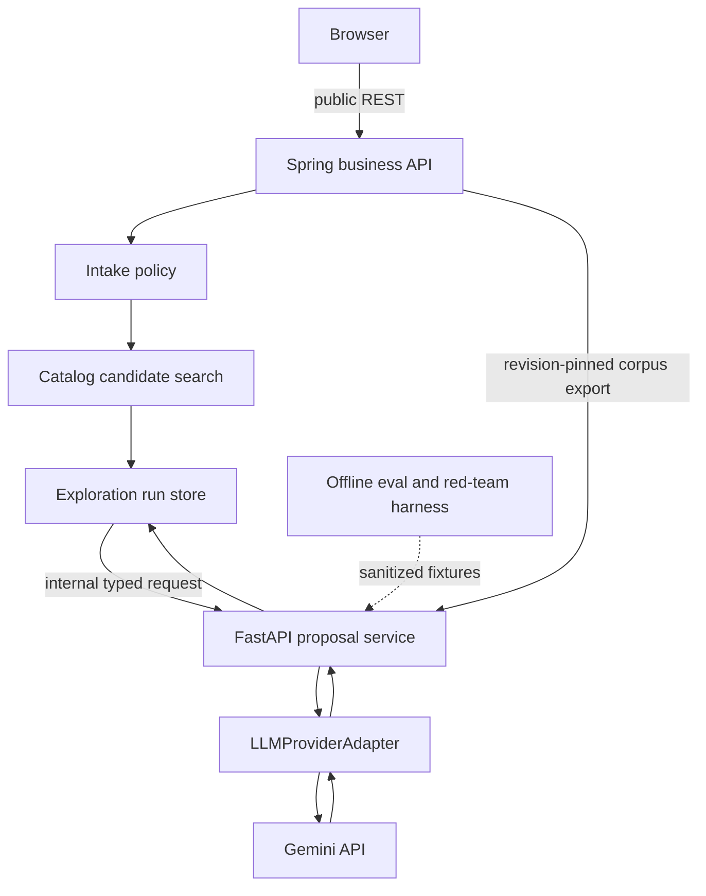
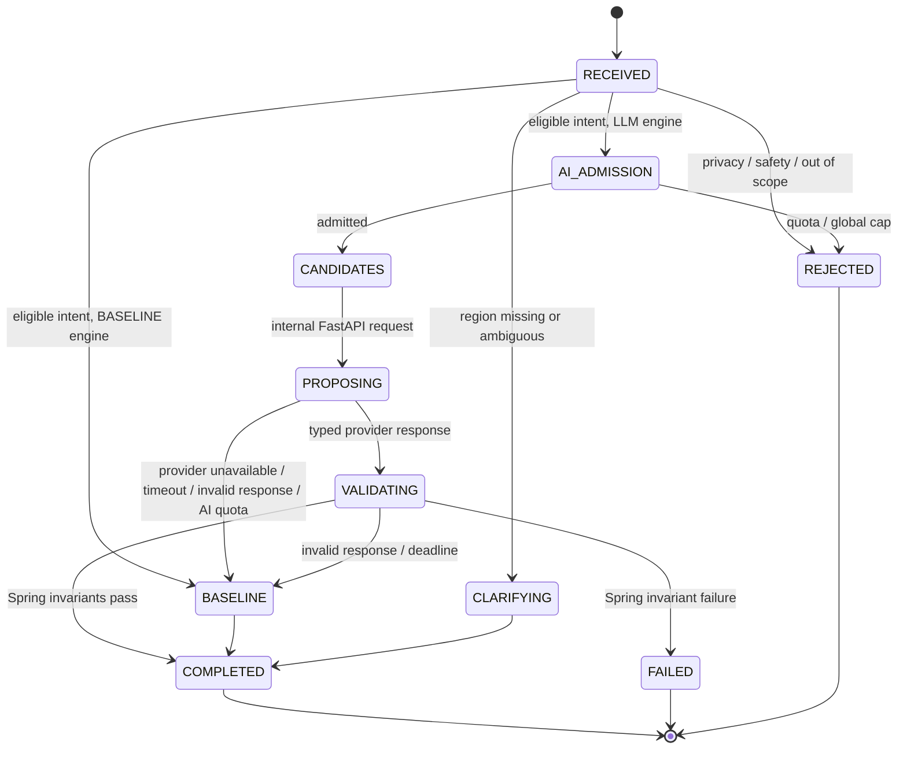

# FastAPI AI application architecture

2026-09-12. 상태: 구현 전 설계. 이 문서는 OnMaru의 여정 탐색 AI를 제품 서비스로 운영하기 위한 application architecture, prompt/evaluation harness, provider 교체 경계를 정의한다. 문화 일반 Q&A와 문화 콘텐츠 페이지는 이번 범위가 아니다.

> **예외**: "공급된 evidence 밖의 사실을 도입할 수 없다"는 §3의 원칙은 스크린 속 한옥(K-콘텐츠) 리서치 기능에 한해 명시적으로 완화된다 — [ADR-0010](../decisions/0010-screen-hanok-ai-auto-publish-without-review.md)을 참고할 것.

## 1. 결정 요약

OnMaru AI는 자유롭게 행동하는 여행 agent가 아니다. 검수된 한옥·한옥 숙박·한옥 카페·전통시장·Odii 후보 중에서 사용자의 조건에 맞는 **여정 순서와 근거 표현을 제안하는 bounded proposal service**다.

| 결정 | 채택 | 이유 |
|---|---|---|
| 업무 상태 소유 | Spring + PostgreSQL run lifecycle | 로그인, quota, 후보 공개 상태, 저장, 취소, 재개는 business transaction이다. |
| AI 처리 | FastAPI의 provider-neutral proposal service | provider SDK와 Python AI 도구의 변화가 Spring core로 새지 않는다. |
| 모델 출력 | structured JSON + Pydantic 검증 + Spring 재검증 | 자유 텍스트가 UI·DB 상태를 바꾸지 못하게 한다. |
| 검색 | Spring의 deterministic catalog search, 이후 선택 RAG | 모델이 검색 범위나 공개 상태를 결정하지 못하게 한다. |
| tool calling | MVP 비활성 | 모델 주도 외부 호출, URL fetch, DB 접근을 만들지 않는다. |
| agent framework | MVP 미도입 | 단일 bounded proposal에는 LangChain/LangGraph의 agent loop가 필요 없다. |
| 평가 | fixture + Promptfoo + release gate | prompt/model 변경을 주관적 인상으로 배포하지 않는다. |

이 결정은 LangGraph, PydanticAI, Promptfoo, Guardrails AI의 패턴을 무시하는 것이 아니라 필요한 책임만 가져오는 것이다. LangGraph의 durable state는 Spring run 상태로, PydanticAI의 typed output은 FastAPI Pydantic 계약으로, Promptfoo의 red-team/eval은 개발·CI harness로 적용한다.

## 2. 참조한 오픈소스 패턴

| 오픈소스 | 가져오는 설계 원칙 | OnMaru에서 도입하지 않는 부분 |
|---|---|---|
| [LangGraph](https://github.com/langchain-ai/langgraph) | durable execution, checkpoint, 명시적 state transition, human interruption | 모델 주도 graph routing, long-running agent memory, 다중 agent 실행. Spring DB run이 checkpoint의 정답이다. |
| [PydanticAI](https://github.com/pydantic/pydantic-ai) | provider-independent typed output, dependency injection, output validation | agent가 tool을 선택하거나 validator가 자동 재시도하는 흐름. 실패는 숨기지 않고 run으로 기록한다. |
| [Promptfoo](https://github.com/promptfoo/promptfoo) | declarative eval, provider 비교, red-team corpus, CI regression gate | 실사용 prompt와 private fixture의 외부 공유, production traffic proxy. |
| [Guardrails AI](https://github.com/guardrails-ai/guardrails) | 입력/출력 검증을 모델 호출과 분리하고 validator를 조합하는 원칙 | 별도 guard service와 LLM-as-judge를 MVP 요청 경로에 추가하는 것. |
| [Gemini structured output](https://ai.google.dev/gemini-api/docs/structured-output?lang=rest) | JSON schema를 최종 UI 응답 형식으로 강제 | schema 준수를 사실성·권한 검증으로 오해하는 것. Spring이 재검증한다. |

LangGraph가 강조하는 durable execution은 실패 후 정확한 지점에서 재개할 수 있는 stateful workflow를 위한 것이다. OnMaru는 `QUEUED → RUNNING → terminal` run과 DB deadline/CAS를 이미 설계했으므로, 그 원칙을 유지하되 두 번째 workflow state store를 만들지 않는다. PydanticAI도 schema가 모델의 지시일 뿐 runtime의 모든 제약을 보장하지 않는다고 설명한다. 그래서 FastAPI Pydantic 검증 뒤에도 Spring 검증이 필요하다.

## 3. 책임과 신뢰 경계

### Spring owns truth

Spring owns actor identity, opt-in, guest/member quota, safety and scope policy, region dictionary, candidate eligibility, ranking, pin/exclude constraints, active dataset revision, exploration version, board persistence, and public API error semantics. It alone creates or terminalizes a run. The model has no authority to mutate this state.

### FastAPI owns proposal mechanics

FastAPI owns provider-specific request construction, prompt package selection, output parsing, provider timeout translation, Pydantic validation, and AI corpus ingestion/retrieval. It has no browser endpoint, no Spring business-schema credential, no member or guest credential, no external tourism key, and no write path back into Spring. It may own a separate `ai` schema credential for its corpus, chunks, embeddings, and eval metadata. It only receives bounded internal requests and returns bounded proposals.

### Gemini is an untrusted proposal source

Gemini may reorder supplied candidates and express a reason grounded in supplied evidence. It cannot introduce a place, factual claim, image, link, action, tool call, or user-visible error message. Provider response is treated like untrusted external input: parsed, size-bounded, schema-validated, and checked against the originating request.

## 4. Full journey request lifecycle

The first three rejection outcomes return synchronously and do not create an exploration or persist a raw turn: `PRIVACY_REDACT_REQUIRED`, `SAFETY_BLOCKED`, `JOURNEY_SCOPE_UNSUPPORTED`. They have stable FE-owned copy. A missing region is not a rejection: Spring creates a short clarification run that ends in `COMPLETED + CLARIFICATION_REQUIRED`, asks exactly one question, and waits for the next typed answer.

An eligible request produces a deterministic candidate set before FastAPI is contacted. If the feature flag selects `BASELINE`, Spring returns the top board itself. If it selects `LLM`, Spring consumes an AI quota only when the provider request is dispatched. Provider timeout, malformed output, internal service failure, or AI quota exhaustion make Spring complete the **same run** with that already-validated candidate set and template evidence reasons under `execution.engine=BASELINE`; this is one deterministic fallback, not another model call or a retry. The FE presents a reviewed “basic exploration result” affordance rather than raw provider-health copy. Cancellation, safety/scope rejection, candidate search failure, or Spring invariant failure never fall back: they retain their typed terminal outcome.

## 5. Input policy and service taxonomy

The input policy is a versioned decision table, not a single keyword blacklist. It combines deterministic syntax checks, an allowlisted journey taxonomy, and narrow high-confidence safety/privacy detectors. Every policy release has fixtures for both expected blocks and expected passes, including valid Korean place names and cultural expressions that could otherwise be falsely blocked.

| Gate | Inputs accepted | Output | Model call |
|---|---|---|---|
| Transport | valid UTF-8, size, idempotency, rate | validation error | no |
| Privacy | no secret/credential or high-confidence personal identifier | `PRIVACY_REDACT_REQUIRED` | no |
| Safety | no high-confidence unsafe request | `SAFETY_BLOCKED` | no |
| Scope | journey taxonomy only | `JOURNEY_SCOPE_UNSUPPORTED` | no |
| Region | one canonical region | typed clarification when absent/ambiguous | no |
| Candidate | published, eligible, scoped candidates | clarification/no-results | no |
| Admission | opt-in, actor cap, global cap, deadline | AI run or quota response | after all gates |

The taxonomy has explicit values rather than arbitrary prompt text: region, place category, activity/theme, mood, stated exclusion, and supported time constraint. Any condition that cannot be truthfully evaluated, such as live crowding or unverified opening hours, creates `UNSUPPORTED_CONDITION` clarification rather than a guessed recommendation.

## 6. Internal contracts and output validation

The provider-neutral request carries only a contract version, correlation IDs, deadline, prompt version, normalized `JourneyIntent`, pins/exclusions, and a maximum of 12 candidates with their revision-pinned evidence. It does not carry the raw user question, exact device location, session/OAuth data, saved resources, visit-review text, or secrets.

The response has only three outcomes: `PROPOSE_BOARD`, `ASK_CLARIFICATION`, and `NO_RESULTS`. A board contains one to three unique candidate references and, for each reference, a short Korean reason tied to evidence IDs from that same candidate. A clarification contains one approved reason and zero to five typed choices. Any other key, output form, new candidate ID, duplicate ref, evidence mismatch, HTML, URL, markdown, or excessive text is invalid.

Validation occurs three times:

1. Gemini structured-output schema limits the response shape at generation.
2. FastAPI Pydantic validates JSON, enum values, lengths, and internal response shape.
3. Spring validates request correlation, candidate and evidence ownership, current publication revision, pin/exclude state, actor ownership, exploration version, deadline, and atomic persistence.

The third layer is decisive. A response that passes JSON schema but claims an unsupported fact or stale reference must not reach the board.

## 7. Prompt package engineering

Prompts are versioned artifacts, not inline strings spread through code. A package contains a stable policy instruction, a response schema description, four to six synthetic few-shot examples, and a machine-readable manifest.

| Prompt component | Purpose | Change rule |
|---|---|---|
| policy | supplied candidates/evidence only; no cultural Q&A, tools, links, facts outside evidence | security review and full eval required |
| few-shot examples | teach outcome selection and ordered JSON, not Korean cultural facts | synthetic IDs only; example change triggers eval |
| data envelope | normalized intent, pins, candidate/evidence set | generated per request; treated as untrusted data |
| schema | response enum, limits, required fields | contract version bump when incompatible |
| manifest | prompt/version/model alias/temperature/token caps | stored with eval result and release evidence |

Few-shot examples include: a complete quiet hanok walk; a market plus Odii request; an insufficient-candidate response; and a typed constraint clarification. They do not contain real source prose, credentials, private user language, or instructions that could train the model to invent travel facts.

The runtime uses one provider request, deterministic temperature where supported, a bounded output token budget, and no automatic prompt repair. A model response failure is observable and reproducible through the stored non-sensitive manifest, not silently converted into a second paid call.

## 8. Tool, RAG, and agent evolution rules

### MVP: no model-selected tools

Gemini function calling is intentionally disabled. The Gemini documentation makes clear that an application must execute the function selected by the model; that is the wrong authority direction for OnMaru. Spring decides when catalog retrieval happens. FastAPI invokes no Google Search, Maps, URL context, code execution, browser, SQL, or write tool.

### FastAPI-owned RAG: bounded read-only evidence

RAG, when enabled by the evaluation gate, is built only in FastAPI. Spring does not chunk, embed, index, query vectors, or own `ai` schema migrations. Spring exports a revision-pinned, sanitized corpus manifest and documents over an authenticated internal read API; FastAPI pulls it idempotently, stores corpus state in the `ai` schema, and records the source revision/manifest hash. The exact manifest, tombstone, ACK, retention, and activation rules are fixed in [corpus sync contract](corpus-sync-contract.md). The proposal request names the allowed source revision and candidate/evidence scope. `EvidenceRetriever` enforces both before retrieval, has a per-run cardinality/context budget, returns provenance with each snippet, and cannot call the internet or query Spring business tables. Retrieval completes before the model call and is never exposed to Gemini as a function declaration.

FastAPI's runtime DB role receives only `USAGE`/DML rights on `ai`; Spring has no `ai` credential; neither runtime role owns migrations. A separately invoked migration role creates the `ai` schema. RAG remains feature-flagged until the frozen evaluation set improves the baseline within the approved cost and latency budget.

### Internal service authentication

Spring and FastAPI communicate only on a private service network. Every internal request carries a short-lived signed service token with `iss`, `sub`, `aud`, `exp`, `jti`, request correlation, and the propagated deadline; FastAPI verifies the expected audience, expiry, signature, and replay-safe `jti` before parsing a body. The token is never forwarded to Gemini or the browser. Development uses a separate local secret; staging/production keys come from the secret manager, support overlapping key rotation, and are least-privilege per caller. Transport TLS is mandatory; managed workload identity or mTLS may replace the token signer only through the same `InternalCallerAuthenticator` interface and a separate deployment decision. TTL replay storage, rotation, outage behavior, and runbook proof are fixed in [internal service authentication](internal-service-authentication.md).

### Future tools: separate decision

A future tool requires a dedicated ADR, threat model, typed input/output schema, authorization owner, idempotency model, timeout, cost budget, audit event, test fake, and kill switch. Read-only catalog lookup and user-affecting writes must never share a tool permission. LangGraph is reconsidered only when this service genuinely has durable multi-step tool execution that Spring's run state cannot express cleanly.

## 9. Evaluation, red team, and release harness

The harness uses three layers, borrowing Promptfoo's declarative provider comparison and red-team approach while keeping fixtures sanitized and repository-controlled.

| Layer | Runs where | Input | Required assertion |
|---|---|---|---|
| unit/contract | FastAPI and Spring test suites | deterministic fake adapter | schema, correlation, adapter conformance, invariant validation |
| offline quality | local/CI with approved provider budget | frozen Korean journey set | allowed-ID violation 0, evidence support, nDCG/recall vs baseline, latency/cost |
| red team | local/CI, no production traffic | injection, privacy, safety, scope evasion corpus | no model call for blocked input; no policy/prompt leakage; no tool invocation |

Promptfoo is a development dependency only. It runs against a provider adapter test endpoint or fake data for most tests; a small opt-in live-provider suite is separately budgeted and never uses production conversations. A prompt, schema, policy, model alias, or adapter change is blocked from promotion when it regresses a frozen test without an explicitly approved baseline update.

Metrics are separated by engine and data mode: intake-block rate and false-positive sample review; clarification completion rate; candidate eligibility violations; structured-output parse rate; evidence support; baseline versus LLM board quality; timeout/provider failure rate; token/call usage; daily quota exhaustion; and opt-in conversion. Logs retain request/trace/run IDs, policy/prompt/adapter/model versions, outcome, latency, and error code, but never raw query text, precise location, user identifiers, OAuth data, or evidence body.

## 10. Delivery sequence

1. Freeze the public intake codes, `JourneyIntent`, internal proposal schema, and FE copy mapping.
2. Create the provider adapter interface plus fake adapter and conformance fixtures before Gemini is enabled.
3. Implement Spring policy/region/candidate gates and verify no rejected input reaches FastAPI.
4. Add the Gemini structured-output adapter with one request, deadline propagation, and output validation.
5. Add Promptfoo offline eval/red-team configuration and wire its required suite into CI.
6. Enable Gemini only in an opt-in environment after daily/global budgets, test results, and live provider quota are recorded.
7. Consider RAG only after the frozen evaluation set demonstrates the documented quality improvement over baseline.

No step authorizes a cultural Q&A feature, external search, autonomous agent, provider tool, or payment tier. Each is a new product and security decision.
