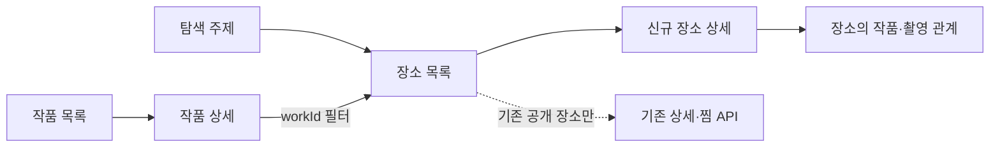

# 전통문화 탐색·K-Contents FE API 명세 초안

> 상태: 2026-10-08 FE 검토용 설계. 아래 신규 경로는 **아직 구현·배포되지 않았다**. 기존 API의 대체 명세가 아니다.
> 관련: [장소·K-Contents PRD](../planning/place-kcontents/product-prd.md), [현행 스크린 속 한옥 계약](screen-hanok-api.md), [FE–BE 추적표](../specs/traceability/fe-be-traceability-matrix.md), Issue #603.

## 1. 호환성 경계

심사 기간에는 기존 홈·지도·한옥·장소 상세·찜·`GET /api/v1/hanoks/screen-hanok`의 경로, 요청, 응답, 게시 장소 집합을 새 선별 정책 때문에 축소하거나 삭제하지 않는다. 특히 기존 `screen-hanok`의 `region`, `mediaType=K_DRAMA|CINEMA|KPOP`, `total/items`, `savedByMe`와 단일 대표 작품·출처 필드를 유지한다. 과거 `KPOP` 화보를 새 `MUSIC_VIDEO` 촬영지로 자동 변환하지 않는다.

새 탐색은 기존 active catalog를 교체하지 않는 **독립 게시 revision/read model**을 읽는다. 신규 수집·라벨링 실패는 마지막 정상 신규 게시본과 기존 API 양쪽에 영향을 주지 않는다. 기존 장소와 새 장소가 겹치면 동일한 온마루 `placeId`를 사용한다. TourAPI `contentId`는 원천 식별자이며 FE 라우팅 키가 아니다. 새 탐색에만 게시된 장소는 기존 `GET /api/v1/places/{placeId}`와 찜 API에서 아직 지원되지 않을 수 있으므로, 새 상세 경로와 `saveAvailable`을 사용한다. 기존 공개본 삭제·revision 전환은 별도 승인과 회귀 검증 전까지 하지 않는다.

## 2. 리소스와 화면 흐름

| 신규 GET 경로 | 역할 | 페이지네이션 |
|---|---|---|
| `/api/v1/discovery/topics` | 공개 탐색 주제·건수 | 고정 소규모 코드 목록이라 없음 |
| `/api/v1/discovery/places` | 장소당 한 카드·필터·facet | 커서 |
| `/api/v1/discovery/places/{placeId}` | 새 탐색 장소 상세 | 단건 |
| `/api/v1/k-contents/works` | 작품 검색·필터 | 커서 |
| `/api/v1/k-contents/works/{workId}` | 작품 상세·확인된 소재 | 단건 |
| `/api/v1/places/{placeId}/k-contents` | 해당 장소의 검증된 작품 관계·출처 | 커서 |



FE의 독립 페이지·섹션 레이아웃은 FE가 정한다. 서버는 고정된 7개 카드 배열이나 섹션별 전용 API를 만들지 않는다. 작품별 장소는 `GET /api/v1/discovery/places?workId=...`로 조회하며 별도 `/works/{id}/places`는 만들지 않는다.

## 3. 공통 계약

- 모든 신규 경로의 기본값은 공개 GET이며 인증이 필요하지 않다. 회원 세션을 보낸 경우에도 저장 지원 여부는 응답의 `saveAvailable`이 결정한다. 새 경로는 기존 쓰기·CSRF 계약을 변경하지 않는다.
- 기존 `ApiErrorResponse` 형식 `{"schemaVersion":"1.2","code":"...","message":"...","requestId":"...","details":{}}`을 사용한다. FE는 `message`가 아닌 `code`로 처리한다.
- 회원별 `savedByMe`가 응답에 포함될 수 있으므로 신규 GET 응답은 `Cache-Control: no-store`로 반환한다. 세션이 없거나 만료된 경우 공개 GET은 `401` 대신 비회원 상태로 조회하고, 저장을 지원하는 장소의 `savedByMe`는 `false`다.
- 목록 기본 `limit=20`, 범위 `1..50`. `cursor`는 opaque이며 동일 필터·정렬·limit·게시 revision에만 유효하다. 첫 페이지는 cursor 없이 요청한다. 응답은 `items`, `hasMore`, `nextCursor`(`null` 가능), `catalogRevision`, `countsAsOf`를 반환한다. 정렬 동점은 안정적인 ID로 해소한다. 게시본 교체 후에도 유효 기간 중 동일 cursor 체인은 한 revision을 읽는다. 유지 기간이 끝나면 `410 CURSOR_EXPIRED`를 반환하고 FE는 첫 페이지부터 재조회한다.
- 목록·facet·주제 건수는 공개 승인된 동일 revision의 **고유 `placeId`/`workId`** 기준이다. 같은 장소에 작품이 여러 개여도 장소 카드·장소 건수는 중복되지 않는다. 검토 중·거절·근거 없는 관계는 공개 목록과 건수에서 제외한다.
- 오류별 정확한 HTTP 상태·코드·FE 동작은 9절을 따른다. 매칭이 없으면 오류가 아니라 `200`과 빈 `items`다.
- 필터를 여러 종류 함께 보내면 AND이다. `workTagCodes`와 `relationTagCodes`의 쉼표 구분 값은 **각 파라미터 내부 OR**, 두 파라미터 사이에는 AND이다. 태그는 게시 승인된 canonical code만 필터에 사용한다.
- 공개된 `regionCode`, `placeRole`, 태그 코드는 목록의 facet 또는 게시 코드 registry에서 가져온다. 문법이 잘못된 코드는 `400`, 형식은 맞지만 매칭이 없는 값은 빈 결과다. 목록에서 존재하지 않는 `workId`도 빈 결과이고, 작품 단건 조회의 없는 `workId`는 `404`다.
- 이미지의 `url`은 공개 표시 권한이 확인된 경우에만 non-null이다. 불명확한 포스터·스틸·검색 이미지 URL은 FE로 보내지 않는다. `sourcePageUrl`은 이미지 권한·출처 페이지이지 촬영 관계의 근거 URL이 아니다.

## 4. 탐색 주제

`GET /api/v1/discovery/topics`

초기 주제 코드는 `TRADITIONAL_SPACE_HERITAGE`, `TRADITIONAL_EXPERIENCE`, `TRADITIONAL_FOOD_TEA`, `K_DRAMA`, `K_MOVIE`, `K_POP_MV`다. 주제는 장소 역할 또는 검증된 작품 관계에서 계산하며 단순 TourAPI 소분류와 동일하지 않다. 한 장소가 여러 주제에 포함될 수 있다. `VARIETY`는 작품 타입과 관계 조회에는 지원하지만, 독립 공개 주제는 데이터 규모·FE 합의 후 활성화한다. 0건 주제는 `active:false`로 반환하고 FE가 노출 여부를 결정한다.

```json
{
  "schemaVersion": "1.2",
  "catalogRevision": "discovery-2026-10-08-01",
  "countsAsOf": "2026-10-08T09:00:00Z",
  "items": [
    {
      "code": "TRADITIONAL_SPACE_HERITAGE",
      "labelKo": "전통 공간·문화유산",
      "labelEn": "Traditional Spaces & Heritage",
      "placeCount": 128,
      "active": true
    }
  ]
}
```

숫자·revision은 구조 설명을 위한 가상 fixture이며 실측 건수가 아니다.

## 5. 장소 목록과 facet

`GET /api/v1/discovery/places`

| 파라미터 | 타입·허용값 | 의미 |
|---|---|---|
| `topic` | 위 공개 주제 코드, 선택 | 주제 하나. 없으면 공개 탐색 장소 전체 |
| `regionCode` | 행정구역 코드, 선택 | 지역명 문자열 대신 안정된 코드 |
| `placeRole` | 게시된 장소 역할 코드, 선택 | 궁궐·고택·한옥 카페 등 의미 역할. `topic`과 별도 축 |
| `workId` | 작품 ID, 선택 | 그 작품과 공개 촬영 관계가 있는 장소 |
| `type` | `DRAMA|MOVIE|VARIETY|MUSIC_VIDEO`, 선택 | 작품 타입. K-주제와 상충하면 빈 결과 |
| `artistId` | 아티스트 ID, 선택 | 출처로 확인된 크레딧이 있는 작품만 |
| `workTagCodes`, `relationTagCodes` | 쉼표 구분 canonical 코드, 선택 | 검증된 작품/관계 태그 |
| `odiiLinked` | boolean, 선택 | 소리마루 연계 여부 |
| `sort` | `RELEVANCE|NAME`, 기본 `RELEVANCE` | `RELEVANCE`는 공개된 결정론적 큐레이션 순위, `NAME`은 이름·ID 순 |
| `limit`, `cursor` | 공통 규칙 | 목록 페이징 |

`facets`는 `topic`, `regionCode`, `placeRole`, `type`, `workTagCode`, `relationTagCode`별 공개 고유 장소 수다. 각 facet은 **자기 차원의 현재 필터만 제외**하고 나머지 필터를 적용하여 계산한다. 예를 들어 `regionCode=11&topic=K_DRAMA`이면 지역 facet은 `K_DRAMA`를 유지하고 지역 필터만 제외한다. `matchingPlaceCount`는 모든 필터를 적용한 고유 장소 수다. 카드의 `featuredRelation`은 현재 필터에 맞는 검증 관계 중 서버의 결정론적 우선순위로 선택하며, 다른 작품 관계도 상세에서 볼 수 있다.

```json
{
  "schemaVersion": "1.2",
  "catalogRevision": "discovery-2026-10-08-01",
  "countsAsOf": "2026-10-08T09:00:00Z",
  "matchingPlaceCount": 1,
  "facets": {
    "topic": [{"code": "K_DRAMA", "count": 1}],
    "regionCode": [{"code": "11", "labelKo": "서울", "count": 1}],
    "placeRole": [{"code": "PALACE", "labelKo": "궁궐", "count": 1}],
    "type": [{"code": "DRAMA", "count": 1}],
    "workTagCode": [],
    "relationTagCode": []
  },
  "items": [
    {
      "placeId": "p-example-palace",
      "name": "예시 궁궐",
      "region": {"code": "11", "nameKo": "서울"},
      "placeRoles": [{"code": "PALACE", "labelKo": "궁궐"}],
      "topics": ["TRADITIONAL_SPACE_HERITAGE", "K_DRAMA"],
      "placeImage": null,
      "odiiLinked": false,
      "featuredRelation": {"relationId": "r-example-1", "workId": "w-example-1", "workTitle": "예시 작품", "type": "DRAMA", "relationType": "FILMING_LOCATION"},
      "matchingWorkCount": 1,
      "saveAvailable": false,
      "savedByMe": null
    }
  ],
  "hasMore": false,
  "nextCursor": null
}
```

위 이름·관계도 가상 fixture다. FE는 이를 실제 촬영 사실로 표시해서는 안 된다. `featuredRelation`은 전통 주제에서 작품 관계가 없으면 `null`이고 `matchingWorkCount=0`이다. `savedByMe`는 저장이 지원되지 않을 때 `null`, 지원될 때 로그인 여부에 따라 `true|false`다. FE는 `saveAvailable=false`면 하트를 숨기거나 비활성화한다.

## 6. 새 장소 상세

`GET /api/v1/discovery/places/{placeId}`

목록과 동일한 게시 장소만 반환한다. 장소가 신분류에서 무엇으로 제공됐는지와 온마루가 왜 전통 공간·문화 경험으로 선별했는지를 **분리**한다. 궁궐을 `HANOK`으로 바꾸지 않는다. 작품 관계 전체를 상세에 중첩하지 않고 `kContents.href`로 연결한다.

```json
{
  "schemaVersion": "1.2",
  "placeId": "p-example-palace",
  "name": "예시 궁궐",
  "region": {"code": "11", "nameKo": "서울"},
  "address": "예시 주소",
  "coordinates": {"latitude": 37.5, "longitude": 127.0},
  "description": "예시 설명",
  "sourceTaxonomy": {"provider": "TOUR_API", "lclsSystm2": "HS01", "lclsSystm3": null, "labelKo": "역사유적지"},
  "placeRoles": [{"code": "PALACE", "labelKo": "궁궐"}],
  "topics": ["TRADITIONAL_SPACE_HERITAGE", "K_DRAMA"],
  "images": [],
  "odii": {"linked": false, "storyCount": 0},
  "kContents": {"relationCount": 1, "href": "/api/v1/places/p-example-palace/k-contents"},
  "saveAvailable": false,
  "savedByMe": null
}
```

`images[]`의 각 항목은 `url`, `imageKind`, `creditText`, `licenseType`, `licenseUrl`, `sourcePageUrl`을 가진다. 이용 권한이 명확하지 않으면 배열에서 제외한다. `sourceTaxonomy.lclsSystm3`와 표시명은 TourAPI가 준 값이 있는 경우에만 채우며 없으면 `null`이다. `saveAvailable=true`는 현행 찜 API가 해당 `placeId`를 공개 장소로 인식하는 경우에만 반환한다. 이 항목만 기존 `PUT/DELETE /api/v1/saved-resources/places/{placeId}`로 연결한다. 신규 전용 장소까지 찜을 지원하려면 기존 찜의 공개성 검증·목록 hydration을 별도 회귀 검증한 후 계약을 확대한다.

## 7. 작품 목록·상세

`GET /api/v1/k-contents/works?type=DRAMA&q=...&workTagCodes=...&limit=20&cursor=...`

`q`는 정규화 작품명/승인된 alias 검색이며 공백 제거 뒤 2~100자, 부분 일치다. `type`, `artistId`, `releaseYear`, `workTagCodes`, `sort=RELEVANCE|TITLE`, `limit`, `cursor`를 지원한다. `q` 없는 전체 조회도 가능하다. 작품 목록은 `items`, `hasMore`, `nextCursor`, `catalogRevision`, `countsAsOf`와 `matchingWorkCount`를 반환한다. 항목에는 `workId`, `canonicalTitle`, `englishTitle?`, `type`, `releaseYear?`, `artists[]`, `workArtwork?`, `publicPlaceCount`, 승인된 `workTags[]`를 둔다. 정규화가 불확실한 동명이작은 한 작품으로 합치지 않는다.

```json
{
  "schemaVersion": "1.2",
  "catalogRevision": "discovery-2026-10-08-01",
  "countsAsOf": "2026-10-08T09:00:00Z",
  "matchingWorkCount": 1,
  "items": [{
    "workId": "w-example-1",
    "canonicalTitle": "예시 작품",
    "englishTitle": null,
    "type": "DRAMA",
    "releaseYear": null,
    "artists": [],
    "workArtwork": null,
    "publicPlaceCount": 1,
    "workTags": []
  }],
  "hasMore": false,
  "nextCursor": null
}
```

`GET /api/v1/k-contents/works/{workId}`는 위 필드에 확인된 `summaryPoints[]`(최대 3개), `officialPageUrl?`, 공개 메타데이터 출처 `metadataSources[]`, `placesHref`(`/api/v1/discovery/places?workId=...`)를 더한다. 줄거리·장르·아티스트·시즌/회차는 근거가 확인된 경우에만 채운다. 확인 전에는 `null` 또는 빈 배열이다. `workArtwork`는 공개 표시 권한을 확인한 경우의 이미지 메타데이터이고, 없으면 `null`이다. 작품 이미지 부재는 장소 촬영 관계의 부재를 뜻하지 않는다.

```json
{
  "schemaVersion": "1.2",
  "workId": "w-example-1",
  "canonicalTitle": "예시 작품",
  "englishTitle": null,
  "type": "DRAMA",
  "releaseYear": null,
  "artists": [],
  "workArtwork": null,
  "publicPlaceCount": 1,
  "workTags": [],
  "summaryPoints": [],
  "officialPageUrl": null,
  "metadataSources": [],
  "placesHref": "/api/v1/discovery/places?workId=w-example-1"
}
```

## 8. 장소–작품 관계와 출처

`GET /api/v1/places/{placeId}/k-contents?type=DRAMA&limit=20&cursor=...`

`type` 선택 필터와 공통 커서 규칙을 지원한다. 응답의 `items[]`는 **작품–장소–관계 타입당 한 항목**이며 `relationId`, `relationType=FILMING_LOCATION`, `work`(`workId`, 제목, 타입, 연도), `contextSummary?`, `relationTags[]`, `evidence[]`, `evidenceCount`, `verifiedAt`을 포함한다. `evidence[]`는 공개 가능한 출처 최대 5개를 신뢰도·명시성 순으로 보여주고, 나머지는 내부 보존한다. 출처 항목은 `sourceTitle`, `sourceUrl`, `sourceType`, `publisherName?`, `checkedAt`이다. 저작권에 영향을 줄 수 있는 기사 원문 전체, 내부 confidence 숫자, 프롬프트, 검토 메모는 공개하지 않는다. 출처가 취소·철회되면 관계를 재검증하고 공개 조건을 잃은 관계는 목록·건수에서 함께 제외한다.

관계 응답의 `items`, `hasMore`, `nextCursor`, `catalogRevision`, `countsAsOf`, `matchingRelationCount`도 동일한 게시 revision을 기준으로 한다. 작품별 장소 목록은 5절의 `workId` 필터를 이용한다.

```json
{
  "schemaVersion": "1.2",
  "catalogRevision": "discovery-2026-10-08-01",
  "countsAsOf": "2026-10-08T09:00:00Z",
  "matchingRelationCount": 1,
  "items": [{
    "relationId": "r-example-1",
    "relationType": "FILMING_LOCATION",
    "work": {"workId": "w-example-1", "canonicalTitle": "예시 작품", "type": "DRAMA", "releaseYear": null},
    "contextSummary": null,
    "relationTags": [],
    "evidence": [{"sourceTitle": "예시 공식자료", "sourceUrl": "https://example.org/source", "sourceType": "OFFICIAL_TOURISM", "publisherName": "예시 기관", "checkedAt": "2026-10-08T09:00:00Z"}],
    "evidenceCount": 1,
    "verifiedAt": "2026-10-08T09:00:00Z"
  }],
  "hasMore": false,
  "nextCursor": null
}
```

이 JSON의 작품·장소·출처는 필드 형식을 설명하는 가상 예시이며, 실제 게시 관계나 외부 URL이 아니다.

## 9. 오류 응답과 FE 복구 동작

모든 신규 경로는 동일한 `ApiErrorResponse`를 사용한다. 아래의 상태·코드는 **신규 API 구현 목표 계약**이며, 현재 운영 중인 기존 API의 오류를 변경하지 않는다. 공개 GET이므로 `401 AUTH_REQUIRED`와 `403 CSRF_INVALID`는 발생시키지 않는다. 파라미터 없이 호출하는 주제 목록에는 `400`/커서 오류가 적용되지 않는다.

| HTTP / `code` | 적용 경로·상황 | `details`와 FE 처리 |
|---|---|---|
| `400 VALIDATION_ERROR` | 목록의 잘못된 `topic`/`type`/`sort`/`limit`/태그 코드 형식, 작품 검색 `q` 길이 오류, 단건 경로 ID 형식 오류 | `fieldErrors`에 필드별 이유. FE는 해당 입력을 고치고 cursor 없이 다시 조회한다. 단순 0건과 구별한다. |
| `400 CURSOR_INVALID` | 세 목록 경로(`discovery/places`, `k-contents/works`, `places/{placeId}/k-contents`)에서 변조된 cursor 또는 cursor 발급 때와 다른 필터·정렬·limit 사용 | FE는 cursor를 버리고 현재 조건으로 첫 페이지를 요청한다. |
| `404 NOT_FOUND` | 새 탐색에 게시되지 않은 `placeId`의 장소 상세/관계 조회, 게시되지 않은 `workId`의 작품 상세 | `resourceType`은 `PLACE` 또는 `WORK`. FE는 잘못된/비공개 항목 안내 후 목록으로 이동한다. 목록 필터의 미일치 ID나 관계 0개에는 적용하지 않는다. |
| `410 CURSOR_EXPIRED` | 세 목록 경로에서 고정 게시 revision의 보존 기간이 종료됨 | FE는 cursor와 기존 페이지 누적 결과를 버리고 첫 페이지부터 다시 읽는다. |
| `429 RATE_LIMITED` | 신규 조회 경로에 요청 제한이 적용되어 한도를 넘김 | `Retry-After` 헤더(초)와 `details.retryAfterMs`를 제공한다. FE는 대기 후 재시도한다. 제한이 발동하지 않으면 이 응답은 없다. |
| `500 INTERNAL_ERROR` | 예상하지 못한 서버 오류 | 내부 오류·SQL·비밀값은 응답에 넣지 않는다. FE는 일반 오류와 재시도 안내를 표시하고 `requestId`를 장애 제보에 사용한다. |
| `503 SERVICE_UNAVAILABLE` | 신규 탐색 게시본이 준비되지 않았거나 읽기 저장소가 일시적으로 불가 | `details.retryAfterMs`와 `Retry-After`를 제공한다. FE는 신규 섹션만 오류/재시도 상태로 두고 기존 화면은 유지한다. |

예를 들어 `limit=999` 요청은 다음과 같이 응답한다. `message`는 진단용이므로 FE 표시 문구의 기준은 `code`다.

```json
{
  "schemaVersion": "1.2",
  "code": "VALIDATION_ERROR",
  "message": "Request validation failed",
  "requestId": "req-example-001",
  "details": {"fieldErrors": {"limit": "must be between 1 and 50"}}
}
```

주제 0건, 장소·작품 검색 0건, 공개 장소의 촬영 관계 0건, 이미지·작품 요약 부재는 **오류가 아니다**. 각각 `200`과 빈 배열 또는 `null`로 반환한다. 외부 기사 링크/이미지 한 건이 깨졌다고 목록 전체를 `503`으로 만들지 않고, 해당 자산을 제외하거나 관계를 재검증한다. 오류 구현 시 공통 응답 형식과 각 상태별 FE fixture를 함께 검증한다.

## 10. FE 전환·회귀 검증

1. 기존 API golden fixture와 응답 코드·필드·기존 게시 ID 집합을 고정한다. 새 revision 게시 전후에 기존 홈·지도·한옥·상세·찜·스크린 속 한옥의 회귀 테스트를 통과해야 한다.
2. 신규 API는 별도 feature flag/게시 revision 뒤에 활성화한다. 빈 신규 결과를 기존 API 데이터 삭제로 해석하지 않는다. 배포 중 신규 API 실패는 기존 endpoint로 전파하지 않는다.
3. FE는 새 장소 카드에서 항상 신규 상세로 이동한다. `saveAvailable=true`인 항목만 기존 찜 동작을 연결한다. 작품 관계가 없는 전통 장소도 상세 페이지를 열 수 있어야 한다.
4. 필터 조합, 동일 장소의 복수 작품, 빈 결과, 이미지 `null`, 관계 철회, cursor 변조·만료, 신규-only 장소의 기존 상세 404 및 9절의 HTTP 상태·오류 코드를 fixture로 확인한다.
5. 이 문서는 FE 합의를 위한 계약 초안이다. 구현 전 OpenAPI/응답 fixture와 DB read model·스키마 변경을 별도로 검증한다. 심사 기간에 기존 공개 catalog 교체나 물리 삭제를 승인하는 문서가 아니다.
