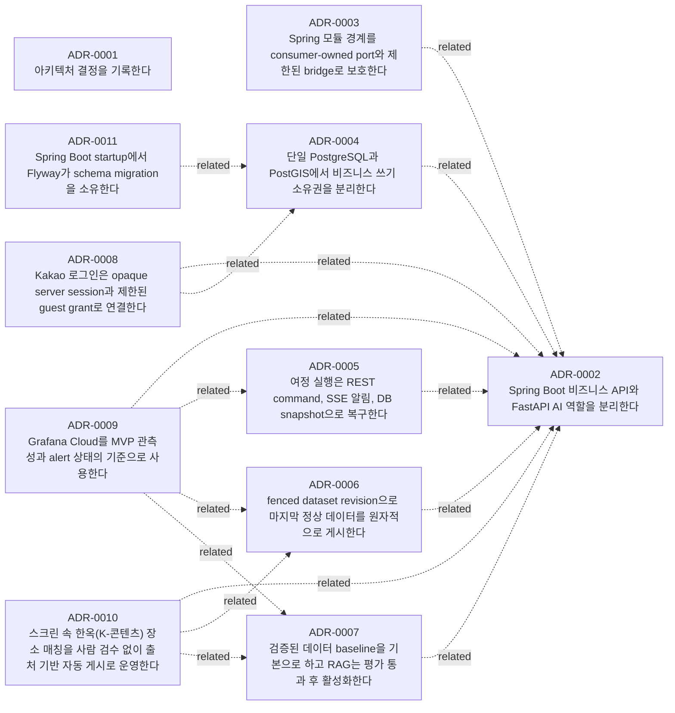

# 결정 기록

## 상태별

### 승인됨
- [ADR-0001 — 아키텍처 결정을 기록한다](0001-record-architecture-decisions.md)
- [ADR-0002 — Spring Boot 비즈니스 API와 FastAPI AI 역할을 분리한다](0002-spring-business-fastapi-ai.md)
- [ADR-0003 — Spring 모듈 경계를 consumer-owned port와 제한된 bridge로 보호한다](0003-module-boundaries.md)
- [ADR-0004 — 단일 PostgreSQL과 PostGIS에서 비즈니스 쓰기 소유권을 분리한다](0004-postgresql-ownership.md)
- [ADR-0005 — 여정 실행은 REST command, SSE 알림, DB snapshot으로 복구한다](0005-rest-sse-run-lifecycle.md)
- [ADR-0006 — fenced dataset revision으로 마지막 정상 데이터를 원자적으로 게시한다](0006-atomic-dataset-publication.md)
- [ADR-0007 — 검증된 데이터 baseline을 기본으로 하고 RAG는 평가 통과 후 활성화한다](0007-baseline-optional-rag.md)
- [ADR-0008 — Kakao 로그인은 opaque server session과 제한된 guest grant로 연결한다](0008-opaque-session-guest-grant.md)
- [ADR-0009 — Grafana Cloud를 MVP 관측성과 alert 상태의 기준으로 사용한다](0009-grafana-cloud-observability.md)
- [ADR-0010 — 스크린 속 한옥\(K-콘텐츠\) 장소 매칭을 사람 검수 없이 출처 기반 자동 게시로 운영한다](0010-screen-hanok-ai-auto-publish-without-review.md)

### 제안됨
- [ADR-0011 — Spring Boot startup에서 Flyway가 schema migration을 소유한다](0011-spring-boot-flyway-startup-migrations.md)

## 태그별

### ai
- [ADR-0007 — 검증된 데이터 baseline을 기본으로 하고 RAG는 평가 통과 후 활성화한다](0007-baseline-optional-rag.md)
- [ADR-0010 — 스크린 속 한옥\(K-콘텐츠\) 장소 매칭을 사람 검수 없이 출처 기반 자동 게시로 운영한다](0010-screen-hanok-ai-auto-publish-without-review.md)

### architecture
- [ADR-0003 — Spring 모듈 경계를 consumer-owned port와 제한된 bridge로 보호한다](0003-module-boundaries.md)

### authentication
- [ADR-0008 — Kakao 로그인은 opaque server session과 제한된 guest grant로 연결한다](0008-opaque-session-guest-grant.md)

### baseline
- [ADR-0007 — 검증된 데이터 baseline을 기본으로 하고 RAG는 평가 통과 후 활성화한다](0007-baseline-optional-rag.md)

### boundaries
- [ADR-0003 — Spring 모듈 경계를 consumer-owned port와 제한된 bridge로 보호한다](0003-module-boundaries.md)

### catalog
- [ADR-0010 — 스크린 속 한옥\(K-콘텐츠\) 장소 매칭을 사람 검수 없이 출처 기반 자동 게시로 운영한다](0010-screen-hanok-ai-auto-publish-without-review.md)

### data-ownership
- [ADR-0004 — 단일 PostgreSQL과 PostGIS에서 비즈니스 쓰기 소유권을 분리한다](0004-postgresql-ownership.md)

### database-migration
- [ADR-0011 — Spring Boot startup에서 Flyway가 schema migration을 소유한다](0011-spring-boot-flyway-startup-migrations.md)

### dataset-revision
- [ADR-0006 — fenced dataset revision으로 마지막 정상 데이터를 원자적으로 게시한다](0006-atomic-dataset-publication.md)

### evaluation
- [ADR-0007 — 검증된 데이터 baseline을 기본으로 하고 RAG는 평가 통과 후 활성화한다](0007-baseline-optional-rag.md)

### flyway
- [ADR-0011 — Spring Boot startup에서 Flyway가 schema migration을 소유한다](0011-spring-boot-flyway-startup-migrations.md)

### gemini
- [ADR-0010 — 스크린 속 한옥\(K-콘텐츠\) 장소 매칭을 사람 검수 없이 출처 기반 자동 게시로 운영한다](0010-screen-hanok-ai-auto-publish-without-review.md)

### grafana
- [ADR-0009 — Grafana Cloud를 MVP 관측성과 alert 상태의 기준으로 사용한다](0009-grafana-cloud-observability.md)

### ingestion
- [ADR-0006 — fenced dataset revision으로 마지막 정상 데이터를 원자적으로 게시한다](0006-atomic-dataset-publication.md)

### k-content
- [ADR-0010 — 스크린 속 한옥\(K-콘텐츠\) 장소 매칭을 사람 검수 없이 출처 기반 자동 게시로 운영한다](0010-screen-hanok-ai-auto-publish-without-review.md)

### modular-monolith
- [ADR-0003 — Spring 모듈 경계를 consumer-owned port와 제한된 bridge로 보호한다](0003-module-boundaries.md)

### observability
- [ADR-0009 — Grafana Cloud를 MVP 관측성과 alert 상태의 기준으로 사용한다](0009-grafana-cloud-observability.md)

### opentelemetry
- [ADR-0009 — Grafana Cloud를 MVP 관측성과 alert 상태의 기준으로 사용한다](0009-grafana-cloud-observability.md)

### operations
- [ADR-0011 — Spring Boot startup에서 Flyway가 schema migration을 소유한다](0011-spring-boot-flyway-startup-migrations.md)

### ownership
- [ADR-0002 — Spring Boot 비즈니스 API와 FastAPI AI 역할을 분리한다](0002-spring-business-fastapi-ai.md)
- [ADR-0008 — Kakao 로그인은 opaque server session과 제한된 guest grant로 연결한다](0008-opaque-session-guest-grant.md)

### postgis
- [ADR-0004 — 단일 PostgreSQL과 PostGIS에서 비즈니스 쓰기 소유권을 분리한다](0004-postgresql-ownership.md)

### postgresql
- [ADR-0004 — 단일 PostgreSQL과 PostGIS에서 비즈니스 쓰기 소유권을 분리한다](0004-postgresql-ownership.md)
- [ADR-0011 — Spring Boot startup에서 Flyway가 schema migration을 소유한다](0011-spring-boot-flyway-startup-migrations.md)

### process
- [ADR-0001 — 아키텍처 결정을 기록한다](0001-record-architecture-decisions.md)

### publication
- [ADR-0010 — 스크린 속 한옥\(K-콘텐츠\) 장소 매칭을 사람 검수 없이 출처 기반 자동 게시로 운영한다](0010-screen-hanok-ai-auto-publish-without-review.md)

### rag
- [ADR-0007 — 검증된 데이터 baseline을 기본으로 하고 RAG는 평가 통과 후 활성화한다](0007-baseline-optional-rag.md)

### reliability
- [ADR-0006 — fenced dataset revision으로 마지막 정상 데이터를 원자적으로 게시한다](0006-atomic-dataset-publication.md)

### rest
- [ADR-0005 — 여정 실행은 REST command, SSE 알림, DB snapshot으로 복구한다](0005-rest-sse-run-lifecycle.md)

### run-lifecycle
- [ADR-0005 — 여정 실행은 REST command, SSE 알림, DB snapshot으로 복구한다](0005-rest-sse-run-lifecycle.md)

### runtime
- [ADR-0002 — Spring Boot 비즈니스 API와 FastAPI AI 역할을 분리한다](0002-spring-business-fastapi-ai.md)

### screen-hanok
- [ADR-0010 — 스크린 속 한옥\(K-콘텐츠\) 장소 매칭을 사람 검수 없이 출처 기반 자동 게시로 운영한다](0010-screen-hanok-ai-auto-publish-without-review.md)

### session
- [ADR-0008 — Kakao 로그인은 opaque server session과 제한된 guest grant로 연결한다](0008-opaque-session-guest-grant.md)

### spring-boot
- [ADR-0011 — Spring Boot startup에서 Flyway가 schema migration을 소유한다](0011-spring-boot-flyway-startup-migrations.md)

### sse
- [ADR-0005 — 여정 실행은 REST command, SSE 알림, DB snapshot으로 복구한다](0005-rest-sse-run-lifecycle.md)

## 영향 경로별

### `AGENTS.md`
- [ADR-0002 — Spring Boot 비즈니스 API와 FastAPI AI 역할을 분리한다](0002-spring-business-fastapi-ai.md)

### `ai/`
- [ADR-0003 — Spring 모듈 경계를 consumer-owned port와 제한된 bridge로 보호한다](0003-module-boundaries.md)
- [ADR-0005 — 여정 실행은 REST command, SSE 알림, DB snapshot으로 복구한다](0005-rest-sse-run-lifecycle.md)
- [ADR-0007 — 검증된 데이터 baseline을 기본으로 하고 RAG는 평가 통과 후 활성화한다](0007-baseline-optional-rag.md)
- [ADR-0009 — Grafana Cloud를 MVP 관측성과 alert 상태의 기준으로 사용한다](0009-grafana-cloud-observability.md)
- [ADR-0010 — 스크린 속 한옥\(K-콘텐츠\) 장소 매칭을 사람 검수 없이 출처 기반 자동 게시로 운영한다](0010-screen-hanok-ai-auto-publish-without-review.md)

### `apps/spring-api/build.gradle.kts`
- [ADR-0011 — Spring Boot startup에서 Flyway가 schema migration을 소유한다](0011-spring-boot-flyway-startup-migrations.md)

### `apps/spring-api/src/main/java/com/yrootlab/onmaru/web/hanok/`
- [ADR-0010 — 스크린 속 한옥\(K-콘텐츠\) 장소 매칭을 사람 검수 없이 출처 기반 자동 게시로 운영한다](0010-screen-hanok-ai-auto-publish-without-review.md)

### `apps/spring-api/src/main/resources/application.yaml`
- [ADR-0011 — Spring Boot startup에서 Flyway가 schema migration을 소유한다](0011-spring-boot-flyway-startup-migrations.md)

### `apps/spring-api/src/main/resources/db/migration/`
- [ADR-0011 — Spring Boot startup에서 Flyway가 schema migration을 소유한다](0011-spring-boot-flyway-startup-migrations.md)

### `db/`
- [ADR-0004 — 단일 PostgreSQL과 PostGIS에서 비즈니스 쓰기 소유권을 분리한다](0004-postgresql-ownership.md)

### `docs/ai/`
- [ADR-0003 — Spring 모듈 경계를 consumer-owned port와 제한된 bridge로 보호한다](0003-module-boundaries.md)
- [ADR-0005 — 여정 실행은 REST command, SSE 알림, DB snapshot으로 복구한다](0005-rest-sse-run-lifecycle.md)
- [ADR-0007 — 검증된 데이터 baseline을 기본으로 하고 RAG는 평가 통과 후 활성화한다](0007-baseline-optional-rag.md)
- [ADR-0009 — Grafana Cloud를 MVP 관측성과 alert 상태의 기준으로 사용한다](0009-grafana-cloud-observability.md)
- [ADR-0010 — 스크린 속 한옥\(K-콘텐츠\) 장소 매칭을 사람 검수 없이 출처 기반 자동 게시로 운영한다](0010-screen-hanok-ai-auto-publish-without-review.md)

### `docs/architecture/`
- [ADR-0003 — Spring 모듈 경계를 consumer-owned port와 제한된 bridge로 보호한다](0003-module-boundaries.md)

### `docs/contracts/`
- [ADR-0005 — 여정 실행은 REST command, SSE 알림, DB snapshot으로 복구한다](0005-rest-sse-run-lifecycle.md)
- [ADR-0007 — 검증된 데이터 baseline을 기본으로 하고 RAG는 평가 통과 후 활성화한다](0007-baseline-optional-rag.md)
- [ADR-0008 — Kakao 로그인은 opaque server session과 제한된 guest grant로 연결한다](0008-opaque-session-guest-grant.md)

### `docs/database/`
- [ADR-0004 — 단일 PostgreSQL과 PostGIS에서 비즈니스 쓰기 소유권을 분리한다](0004-postgresql-ownership.md)
- [ADR-0006 — fenced dataset revision으로 마지막 정상 데이터를 원자적으로 게시한다](0006-atomic-dataset-publication.md)
- [ADR-0008 — Kakao 로그인은 opaque server session과 제한된 guest grant로 연결한다](0008-opaque-session-guest-grant.md)

### `docs/decisions/`
- [ADR-0001 — 아키텍처 결정을 기록한다](0001-record-architecture-decisions.md)

### `docs/operations/`
- [ADR-0004 — 단일 PostgreSQL과 PostGIS에서 비즈니스 쓰기 소유권을 분리한다](0004-postgresql-ownership.md)
- [ADR-0005 — 여정 실행은 REST command, SSE 알림, DB snapshot으로 복구한다](0005-rest-sse-run-lifecycle.md)
- [ADR-0006 — fenced dataset revision으로 마지막 정상 데이터를 원자적으로 게시한다](0006-atomic-dataset-publication.md)
- [ADR-0007 — 검증된 데이터 baseline을 기본으로 하고 RAG는 평가 통과 후 활성화한다](0007-baseline-optional-rag.md)
- [ADR-0009 — Grafana Cloud를 MVP 관측성과 alert 상태의 기준으로 사용한다](0009-grafana-cloud-observability.md)

### `docs/planning/`
- [ADR-0002 — Spring Boot 비즈니스 API와 FastAPI AI 역할을 분리한다](0002-spring-business-fastapi-ai.md)

### `docs/specs/backend-requirements/`
- [ADR-0010 — 스크린 속 한옥\(K-콘텐츠\) 장소 매칭을 사람 검수 없이 출처 기반 자동 게시로 운영한다](0010-screen-hanok-ai-auto-publish-without-review.md)

### `docs/spring/`
- [ADR-0003 — Spring 모듈 경계를 consumer-owned port와 제한된 bridge로 보호한다](0003-module-boundaries.md)
- [ADR-0004 — 단일 PostgreSQL과 PostGIS에서 비즈니스 쓰기 소유권을 분리한다](0004-postgresql-ownership.md)
- [ADR-0006 — fenced dataset revision으로 마지막 정상 데이터를 원자적으로 게시한다](0006-atomic-dataset-publication.md)
- [ADR-0008 — Kakao 로그인은 opaque server session과 제한된 guest grant로 연결한다](0008-opaque-session-guest-grant.md)
- [ADR-0009 — Grafana Cloud를 MVP 관측성과 alert 상태의 기준으로 사용한다](0009-grafana-cloud-observability.md)

### `gradle/libs.versions.toml`
- [ADR-0011 — Spring Boot startup에서 Flyway가 schema migration을 소유한다](0011-spring-boot-flyway-startup-migrations.md)

### `modules/catalog/`
- [ADR-0010 — 스크린 속 한옥\(K-콘텐츠\) 장소 매칭을 사람 검수 없이 출처 기반 자동 게시로 운영한다](0010-screen-hanok-ai-auto-publish-without-review.md)

### `spring/`
- [ADR-0003 — Spring 모듈 경계를 consumer-owned port와 제한된 bridge로 보호한다](0003-module-boundaries.md)
- [ADR-0004 — 단일 PostgreSQL과 PostGIS에서 비즈니스 쓰기 소유권을 분리한다](0004-postgresql-ownership.md)
- [ADR-0005 — 여정 실행은 REST command, SSE 알림, DB snapshot으로 복구한다](0005-rest-sse-run-lifecycle.md)
- [ADR-0006 — fenced dataset revision으로 마지막 정상 데이터를 원자적으로 게시한다](0006-atomic-dataset-publication.md)
- [ADR-0007 — 검증된 데이터 baseline을 기본으로 하고 RAG는 평가 통과 후 활성화한다](0007-baseline-optional-rag.md)
- [ADR-0008 — Kakao 로그인은 opaque server session과 제한된 guest grant로 연결한다](0008-opaque-session-guest-grant.md)
- [ADR-0009 — Grafana Cloud를 MVP 관측성과 alert 상태의 기준으로 사용한다](0009-grafana-cloud-observability.md)

## 시간순 (최신순)

- 2026-09-20 — [ADR-0011 — Spring Boot startup에서 Flyway가 schema migration을 소유한다](0011-spring-boot-flyway-startup-migrations.md)
- 2026-09-19 — [ADR-0010 — 스크린 속 한옥\(K-콘텐츠\) 장소 매칭을 사람 검수 없이 출처 기반 자동 게시로 운영한다](0010-screen-hanok-ai-auto-publish-without-review.md)
- 2026-09-13 — [ADR-0003 — Spring 모듈 경계를 consumer-owned port와 제한된 bridge로 보호한다](0003-module-boundaries.md)
- 2026-09-13 — [ADR-0004 — 단일 PostgreSQL과 PostGIS에서 비즈니스 쓰기 소유권을 분리한다](0004-postgresql-ownership.md)
- 2026-09-13 — [ADR-0005 — 여정 실행은 REST command, SSE 알림, DB snapshot으로 복구한다](0005-rest-sse-run-lifecycle.md)
- 2026-09-13 — [ADR-0006 — fenced dataset revision으로 마지막 정상 데이터를 원자적으로 게시한다](0006-atomic-dataset-publication.md)
- 2026-09-13 — [ADR-0007 — 검증된 데이터 baseline을 기본으로 하고 RAG는 평가 통과 후 활성화한다](0007-baseline-optional-rag.md)
- 2026-09-13 — [ADR-0008 — Kakao 로그인은 opaque server session과 제한된 guest grant로 연결한다](0008-opaque-session-guest-grant.md)
- 2026-09-13 — [ADR-0009 — Grafana Cloud를 MVP 관측성과 alert 상태의 기준으로 사용한다](0009-grafana-cloud-observability.md)
- 2026-09-09 — [ADR-0002 — Spring Boot 비즈니스 API와 FastAPI AI 역할을 분리한다](0002-spring-business-fastapi-ai.md)
- 2026-09-08 — [ADR-0001 — 아키텍처 결정을 기록한다](0001-record-architecture-decisions.md)

## 관계

### 대체 이력

### 관련

- ADR-0003 "Spring 모듈 경계를 consumer-owned port와 제한된 bridge로 보호한다" 관련: ADR-0002 "Spring Boot 비즈니스 API와 FastAPI AI 역할을 분리한다"
- ADR-0004 "단일 PostgreSQL과 PostGIS에서 비즈니스 쓰기 소유권을 분리한다" 관련: ADR-0002 "Spring Boot 비즈니스 API와 FastAPI AI 역할을 분리한다"
- ADR-0005 "여정 실행은 REST command, SSE 알림, DB snapshot으로 복구한다" 관련: ADR-0002 "Spring Boot 비즈니스 API와 FastAPI AI 역할을 분리한다"
- ADR-0006 "fenced dataset revision으로 마지막 정상 데이터를 원자적으로 게시한다" 관련: ADR-0002 "Spring Boot 비즈니스 API와 FastAPI AI 역할을 분리한다"
- ADR-0007 "검증된 데이터 baseline을 기본으로 하고 RAG는 평가 통과 후 활성화한다" 관련: ADR-0002 "Spring Boot 비즈니스 API와 FastAPI AI 역할을 분리한다"
- ADR-0008 "Kakao 로그인은 opaque server session과 제한된 guest grant로 연결한다" 관련: ADR-0002 "Spring Boot 비즈니스 API와 FastAPI AI 역할을 분리한다"
- ADR-0008 "Kakao 로그인은 opaque server session과 제한된 guest grant로 연결한다" 관련: ADR-0004 "단일 PostgreSQL과 PostGIS에서 비즈니스 쓰기 소유권을 분리한다"
- ADR-0009 "Grafana Cloud를 MVP 관측성과 alert 상태의 기준으로 사용한다" 관련: ADR-0002 "Spring Boot 비즈니스 API와 FastAPI AI 역할을 분리한다"
- ADR-0009 "Grafana Cloud를 MVP 관측성과 alert 상태의 기준으로 사용한다" 관련: ADR-0005 "여정 실행은 REST command, SSE 알림, DB snapshot으로 복구한다"
- ADR-0009 "Grafana Cloud를 MVP 관측성과 alert 상태의 기준으로 사용한다" 관련: ADR-0006 "fenced dataset revision으로 마지막 정상 데이터를 원자적으로 게시한다"
- ADR-0009 "Grafana Cloud를 MVP 관측성과 alert 상태의 기준으로 사용한다" 관련: ADR-0007 "검증된 데이터 baseline을 기본으로 하고 RAG는 평가 통과 후 활성화한다"
- ADR-0010 "스크린 속 한옥(K-콘텐츠) 장소 매칭을 사람 검수 없이 출처 기반 자동 게시로 운영한다" 관련: ADR-0002 "Spring Boot 비즈니스 API와 FastAPI AI 역할을 분리한다"
- ADR-0010 "스크린 속 한옥(K-콘텐츠) 장소 매칭을 사람 검수 없이 출처 기반 자동 게시로 운영한다" 관련: ADR-0006 "fenced dataset revision으로 마지막 정상 데이터를 원자적으로 게시한다"
- ADR-0010 "스크린 속 한옥(K-콘텐츠) 장소 매칭을 사람 검수 없이 출처 기반 자동 게시로 운영한다" 관련: ADR-0007 "검증된 데이터 baseline을 기본으로 하고 RAG는 평가 통과 후 활성화한다"
- ADR-0011 "Spring Boot startup에서 Flyway가 schema migration을 소유한다" 관련: ADR-0004 "단일 PostgreSQL과 PostGIS에서 비즈니스 쓰기 소유권을 분리한다"

