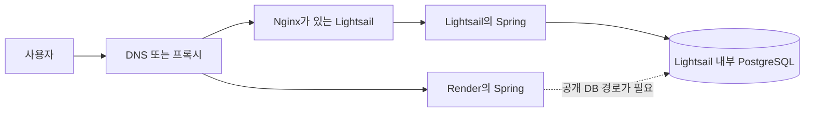
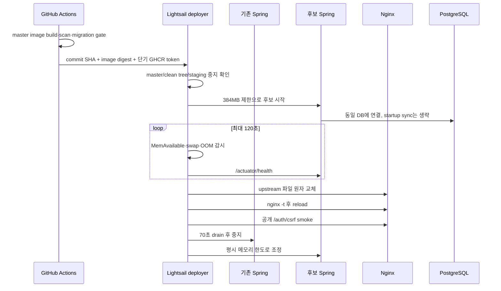
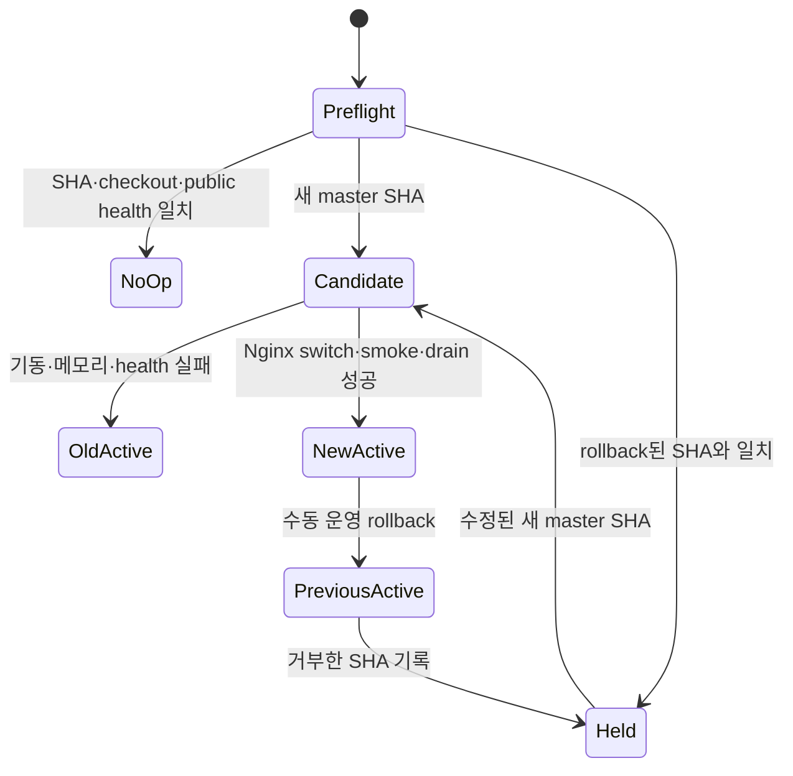

# 월 7달러 Lightsail에서 무중단 배포를 고민한 과정: 1GB RAM, PostgreSQL, swap으로 설계한 짧은 Blue-Green CD

서비스를 처음 만들 때의 배포 구조와, 실제 사용자가 생긴 뒤의 배포 구조는 꽤 다른 문제였습니다. 처음에는 Render에 Spring 서버를 올리고 Neon의 PostgreSQL을 연결했습니다. 애플리케이션과 데이터베이스를 직접 운영하지 않아도 되었고, Git 저장소에 코드를 반영하면 플랫폼이 새 인스턴스를 준비해 트래픽을 넘겨주었습니다. 작은 팀이 기능을 만드는 데 집중하기 좋은 구조였죠.

하지만 당시 사용하던 Neon 플랜에서 프로젝트당 데이터 저장 공간 0.5GB가 제약이 되었습니다. 이 수치는 현재 플랜을 설명하려는 것이 아니라, 이전을 결정하던 시점의 조건입니다. Neon은 2025년 사용량 기반 요금제를 소개하면서 Free 플랜을 프로젝트당 0.5GB로 설명했고, 2026년 10월에는 이를 1GB로 늘렸습니다. 즉 클라우드 플랜은 계속 변하고, 아키텍처 선택은 언제나 “그때의 가격과 제한” 위에서 이뤄집니다. ([Neon의 2025년 요금제 설명](https://neon.com/blog/new-usage-based-pricing), [2026년 Free 플랜 변경](https://neon.com/blog/neon-free-plan-1-gb-per-project))

결국 운영 환경을 월 7달러 Lightsail 한 대로 옮겼습니다. 현재 AWS 가격표 기준으로 이 번들은 Linux, 공인 IPv4 포함, 1GB RAM과 40GB SSD를 제공합니다. 그 안에 Nginx, Spring Boot, PostgreSQL/PostGIS를 함께 두었습니다. 다음 단계에서 만들 FastAPI는 별도 Lightsail에 배치하기로 했고요. 비용과 구조는 단순해졌지만, Render가 감춰 주던 배포 문제를 이제 제가 직접 풀어야 했습니다. ([AWS Lightsail 가격표](https://aws.amazon.com/lightsail/pricing/))

이 글은 “swap을 켜면 1GB에서도 무조건 Blue-Green이 된다”는 성공담이 아닙니다. 오히려 아주 작은 서버에서 무엇을 포기하고, 어떤 안전장치를 걸어야 짧은 중첩 배포를 시도할 수 있는지를 정리한 기록에 가깝습니다. 구현과 무부하 리허설은 마쳤지만, 실제 예약·명시적 운영 배포는 최초 bootstrap과 GitHub 운영 secret 설정을 마친 뒤 활성화할 예정입니다.

## 플랫폼이 해주던 일을 직접 떠안게 되었습니다

Render의 배포는 새 인스턴스가 준비되면 트래픽을 새 버전으로 전환하고, 이전 인스턴스에 종료 신호를 보내는 방식입니다. 플랫폼을 사용할 때는 “새 코드가 준비되는 시간”과 “현재 요청을 처리하는 시간”이 겹쳐도 이를 제가 직접 조절할 필요가 없었습니다. ([Render의 zero-downtime deploy 설명](https://render.com/docs/deploys))

반면 단일 Lightsail에서 평범하게 `docker compose up -d`를 실행하면 기존 Spring 컨테이너를 내리고 새 컨테이너를 띄우는 구간이 생깁니다. JVM 시작, Spring Context 생성, Flyway 확인, DB 연결, health check가 끝날 때까지 API는 응답하지 못합니다. 요청이 거의 없는 초기 서비스라도 로그인 callback이나 저장 요청이 그 짧은 순간과 겹치면 사용자에게는 그냥 장애입니다.

그래서 처음 떠올린 선택지는 두 가지였습니다.

하나는 기존 Render 서버를 Green으로 남겨 두고 Lightsail과 번갈아 쓰는 방법, 다른 하나는 Lightsail 안에서 Spring 컨테이너 두 개를 아주 잠깐 겹쳐 실행하는 방법이었습니다. 전자는 이미 있던 자원을 재활용한다는 점에서 매력적으로 보였습니다. 그런데 데이터베이스 경계까지 그려 보니 이야기가 달라졌습니다.

Render의 private network는 같은 workspace와 region 안의 Render 서비스 사이에서 동작합니다. Lightsail의 Docker 내부망에 있는 PostgreSQL로 바로 이어지는 전용 통로가 아닙니다. Render Spring을 Green으로 쓰려면 PostgreSQL 5432를 외부에 노출하거나, 별도의 사설 연결을 구성하거나, 다시 Neon을 병행해야 합니다. Render의 AWS PrivateLink도 선택지는 되지만 현재 문서상 Pro 이상에서 endpoint당 월 30달러가 붙습니다. 월 7달러 서버의 배포 순간을 해결하기 위해 이 경로를 추가하는 것은 비용 목적과 맞지 않았습니다. ([Render private network](https://render.com/docs/private-network), [Render PrivateLink](https://render.com/docs/private-link))

DB를 공개한다면 TLS, 방화벽, source allowlist, credential rotation이 모두 새 운영 책임이 됩니다. Render의 기본 outbound IP 범위는 서비스별 전용 IP가 아니라 region 내에서 공유되므로, 허용 범위도 생각보다 넓어질 수 있습니다. ([Render outbound IP](https://render.com/docs/outbound-ip-addresses)) 게다가 네트워크 왕복 시간이 늘고, 두 플랫폼의 환경 변수와 런타임 차이도 함께 관리해야 합니다.

예전 Neon DB를 Render 쪽에 그대로 둔 채 배포 때만 사용하면 더 위험합니다. Blue와 Green이 서로 다른 DB를 바라보는 순간, 이것은 무중단 배포가 아니라 두 개의 데이터 원본을 만드는 일이 됩니다. 트래픽을 되돌릴 때 회원, 세션, 후기 같은 쓰기 데이터까지 되돌릴 수는 없습니다. DNS 전환도 resolver와 CDN cache 때문에 모든 사용자가 동시에 움직인다는 보장이 없습니다. 애플리케이션 전환 문제를 데이터 정합성 문제로 키우는 셈이죠.

결론적으로 Render는 “공짜로 남아 있는 두 번째 컨테이너”가 아니었습니다. 네트워크, 보안, 관측, DB 일관성까지 포함하면 별도 failure domain 하나를 운영하는 선택이었습니다. 지금 규모에서는 한 호스트 안에서 DB를 공유하고 Nginx upstream만 원자적으로 바꾸는 편이 훨씬 단순했습니다.

## 40GB 디스크를 RAM처럼 쓸 수 있을까

Lightsail에는 40GB SSD가 있고 RAM은 1GB입니다. 여기서 자연스럽게 이런 생각이 들었습니다.

> 평소에는 Spring 하나만 실행하고, 배포할 때만 디스크 일부를 가상메모리로 써서 Spring 두 개를 겹치면 되지 않을까?

방향은 가능했지만, 정확히 말하면 “디스크가 RAM이 된다”는 표현은 위험했습니다. Linux의 가상메모리는 프로세스에 연속된 주소 공간을 보여주고, 실제 page를 RAM과 swap 사이에서 관리합니다. 메모리가 부족할 때 당장 활발히 쓰이지 않는 anonymous page를 swap으로 밀어내면 RAM에 여유를 만들 수 있습니다. 그러나 밀려난 page가 다시 필요해지면 major page fault가 발생하고 SSD에서 읽어 와야 합니다. 이 지연은 RAM 접근과 비교할 수 없을 만큼 큽니다.

핵심은 전체 할당량이 아니라 working set, 즉 지금 활발히 접근하는 page의 크기입니다. 두 JVM과 PostgreSQL의 working set이 물리 메모리보다 커지면 kernel은 page를 내보내고 곧 다시 읽는 일을 반복합니다. 이것이 thrashing이고, 이 상태에서는 CPU 사용률이 낮아 보여도 응답 시간이 급격히 나빠집니다. swap은 순간적인 봉우리를 흡수하는 완충재이지, 1GB 서버를 5GB 서버로 바꾸는 증설 수단이 아닙니다.

JVM의 메모리도 heap만 보면 안 됩니다. 컨테이너 RSS에는 heap 외에 metaspace, JIT code cache, thread stack, direct buffer, native library가 포함됩니다. `-Xmx`만 줄였는데도 OOM이 나는 이유가 여기에 있습니다. 그래서 후보 Spring 컨테이너에는 384MB cgroup memory limit을 두고 `MaxRAMPercentage=50`으로 heap 상한을 대략 192MB 수준에 묶었습니다. 두 JVM이 겹치는 동안에는 CPU도 각각 0.55로 제한해 PostgreSQL과 Nginx가 밀려나지 않도록 했습니다.

Linux cgroup v2는 memory와 swap 사용량을 별도로 관찰하고 제한할 수 있습니다. kernel 문서도 정상 workload가 상한을 계속 두드리는 상태를 기대하지 않습니다. 또한 `vm.swappiness`는 0부터 200까지의 상대적 I/O 비용 힌트이며 기본값은 60이지만, 모든 workload에 통하는 정답은 아닙니다. 그래서 이번 설계는 swappiness 값을 마법처럼 조정하는 대신 실제 `MemAvailable`, swap 증가량, 컨테이너의 `OOMKilled` 상태를 배포 gate로 사용했습니다. ([Linux cgroup v2 memory 문서](https://www.kernel.org/doc/html/latest/admin-guide/cgroup-v2.html), [Linux `vm.swappiness` 문서](https://kernel.org/doc/html/latest/admin-guide/sysctl/vm.html))

## 추측 대신 실제 운영 호스트에서 짧게 겹쳐 보았습니다

설계 전에 운영 서버 상태부터 측정했습니다. 1GB 상품에서 OS가 보고한 총 메모리는 약 909MB였습니다. 당시 사용량은 약 706MB, `MemAvailable`은 약 203MB였고, 4GB swap 중 약 334MB가 이미 사용 중이었습니다. 컨테이너별 사용량은 Spring 약 290.5MiB, PostgreSQL 약 63MiB, Nginx 약 9MiB였습니다. 최근 7일 OOM 기록은 없었습니다.

여기서 곧바로 라우팅을 바꾸지는 않았습니다. 현재 운영과 동일한 image를 384MB 제한으로 하나 더 띄우고, Nginx에는 연결하지 않은 채 health만 확인했습니다. startup 시 TourAPI와 Odii 전체 동기화도 비활성화했습니다. 새 버전 검증 때문에 두 컨테이너가 동시에 외부 데이터를 수집하고 DB에 게시한다면, 메모리뿐 아니라 데이터 변경까지 리허설에 섞이기 때문입니다.

| 관찰 항목 | 리허설 결과 |
| --- | ---: |
| 후보 Green health 도달 | 약 30초 |
| 후보 Green 메모리 | 약 212MB |
| swap 증가 | 약 114MB |
| 가장 낮은 `MemAvailable` | 약 156MB |
| 기존 Blue health | 계속 HTTP 200 |
| OOM 발생 | 없음 |
| 중첩 유지 | 60초 |

이 결과는 “트래픽이 있어도 안전하다”는 증명이 아닙니다. 무부하 상태에서 동일 image 두 개가 잠깐 공존할 수 있다는 최소 증거입니다. 그래서 측정값보다 보수적인 실패 조건을 코드에 넣었습니다. 배포 중 `MemAvailable`이 128MiB 아래로 내려가거나, 시작 시점보다 swap이 192MiB 넘게 증가하거나, 후보가 OOMKilled 되면 트래픽을 넘기지 않고 후보를 제거합니다.

swap 4GB를 전부 사용할 수 있는데 왜 192MiB에서 멈추느냐는 질문도 생길 수 있습니다. 남은 swap 용량과 서비스 지연 허용치는 다른 숫자이기 때문입니다. swap이 넉넉하다는 것은 OOM을 늦출 수 있다는 뜻이지, PostgreSQL과 현재 Spring의 active page를 밀어내도 괜찮다는 뜻은 아닙니다. 작은 서버에서는 “더 버틸 수 있음”보다 “악화되기 전에 포기함”이 중요한 운영 특성이라고 판단했습니다.

## Blue-Green의 범위를 짧게 만들었습니다

이번 구조는 Blue와 Green을 상시 실행하는 전통적인 이중화가 아닙니다. 새 Spring이 뜨고 health를 통과한 뒤 Nginx를 전환하고, 기존 요청이 빠질 시간만 기다렸다가 이전 Spring을 중지하는 bounded overlap입니다.

따라서 이것은 배포 시 애플리케이션 재기동 공백을 줄이는 장치이지, 고가용성(HA)은 아닙니다. 호스트 한 대, Nginx 하나, PostgreSQL 하나라는 single point of failure는 그대로 남습니다. Lightsail 자체나 디스크, DB가 멈추면 Blue와 Green도 함께 멈춥니다. 배포 가용성과 장애 가용성을 같은 말처럼 쓰지 않는 것이 이번 설계에서 가장 중요한 경계 중 하나였습니다.

GitHub Actions는 `master` push에서 Spring image를 만들고 검사하지만 이 사건만으로 운영 트래픽을 바꾸지는 않습니다. FastAPI image 단계는 `develop`의 스테이징 실행에만 남겨 두었습니다. 실제 배포는 트래픽이 낮은 `03:17 KST` 예약 실행 또는 제가 “온마루 운영 배포해줘”라고 명시적으로 요청한 수동 실행으로 제한했습니다. 두 경로 모두 취약점 검사와 migration gate를 다시 통과한 digest만 전달합니다. 서버는 tag가 아니라 immutable digest를 pull합니다. build에 사용한 commit SHA도 builder stage에서 끝내지 않고 최종 runner image의 환경 변수로 넘겨, 다음 배포가 현재 slot의 실제 출처를 검증할 수 있게 했습니다. SSH 계정도 일반 shell을 주지 않고 `status`, `deploy`, `rollback` 세 명령만 실행할 수 있게 제한했습니다. 서버에서는 checkout이 `master`인지, 작업 트리가 깨끗한지, 요청 SHA가 최신 `origin/master`인지 다시 확인합니다.

예약 실행에서는 이 순서가 조금 다릅니다. image를 다시 만들기 전에 먼저 `status <master-sha>`만 호출합니다. 서버의 배포 SHA, checkout SHA, 공개 health가 모두 같을 때만 `deployed`로 판단하고 build·scan·migration을 통째로 생략합니다. 단순히 상태 파일의 SHA만 같다고 믿지 않은 이유는 프로세스가 죽었거나 checkout이 어긋난 상태를 성공으로 오인하지 않기 위해서였습니다. 반대로 셋 중 하나라도 다르면 그때 immutable image를 만들기 시작합니다. 매일 같은 commit을 다시 빌드하지 않으면서도, “아마 배포되어 있을 것”을 no-op의 근거로 삼지 않는 방식입니다.

그다음 비활성 slot을 시작합니다. health가 통과하면 Nginx가 include하는 runtime upstream 파일을 임시 파일에서 `rename`하는 방식으로 교체합니다. `nginx -t`가 실패하거나 reload 뒤 공개 smoke가 실패하면 기존 upstream으로 되돌리고 후보를 중지합니다. 이전 컨테이너는 즉시 죽이지 않고 70초 동안 둡니다. 현재 API의 SSE 연결 최대 시간 60초보다 약간 긴 drain window입니다. 여기서 단순히 `sleep 70`으로 끝내면 전환 직후 후보가 OOM으로 죽어도 성공 처리할 수 있습니다. 그래서 drain 동안에도 2초마다 후보 health, OOM, 가용 RAM, swap 증가량을 다시 검사하고 마지막 공개 smoke까지 통과해야 상태를 확정합니다.

종료 처리도 happy path보다 중요했습니다. shell의 `set -e`만 믿으면 예상하지 못한 명령 하나가 실패했을 때 rollback 함수가 실행되지 않을 수 있습니다. 그래서 `EXIT`, `HUP`, `INT`, `TERM`에 공통 handler를 두고, 배포 성공 상태를 기록하기 전의 비정상 종료는 모두 rollback으로 보냅니다. 라우팅 전환 후 기존 컨테이너가 이미 멈췄다면 다시 시작하고 health를 확인한 뒤 upstream을 복구합니다. 여기서 health가 끝내 회복되지 않으면 route를 불건전한 이전 슬롯으로 되돌리거나 정상 후보를 끄지 않습니다. 자동 복구가 원래 장애보다 더 큰 outage를 만들지 않도록 가용한 route를 보존하고 실패를 운영자에게 넘깁니다.

## workflow가 실행조차 되지 않는 변수 범위를 뒤늦게 발견했습니다

CD 로직을 다시 검토하면서 가장 먼저 발견한 문제는 Docker나 Nginx가 아니라 GitHub Actions 변수의 평가 시점이었습니다. 처음 문서에는 `PRODUCTION_DEPLOY_ENABLED`를 `production` environment variable로 등록한다고 적혀 있었습니다. workflow의 production job도 `if: vars.PRODUCTION_DEPLOY_ENABLED == 'true'`로 막아 두었고요. 얼핏 보면 자연스러운 조합이었습니다.

그런데 job-level `if`는 job을 runner로 보낼지 결정하기 위해 먼저 평가됩니다. GitHub 문서상 environment-level configuration variable은 runner가 해당 environment를 선언한 뒤에야 사용할 수 있습니다. 아직 job이 시작되지 않았는데 그 job의 environment variable을 읽어 job 시작 여부를 판단하려 했던 셈입니다. 설정하지 않은 변수 참조는 빈 문자열이 되므로, 이 구조는 오류를 내며 멈추는 대신 production job이 조용히 skip될 가능성이 있었습니다. ([GitHub Actions contexts reference](https://docs.github.com/en/actions/reference/workflows-and-actions/contexts), [GitHub Actions variables 안내](https://docs.github.com/en/actions/how-tos/write-workflows/choose-what-workflows-do/use-variables))

그래서 활성화 스위치는 Repository Variable로 옮겼습니다. 반면 SSH private key와 webhook URL은 여전히 `production` environment secret에 둡니다. 둘의 차이는 보안 등급보다 **언제 값이 필요한가**에 있습니다. job을 만들지 말지 결정하는 비밀 아닌 feature flag는 repository scope, job이 시작된 뒤 원격 접속과 알림에 쓰는 민감 값은 environment secret입니다. 변수 scope는 정리 취향이 아니라 workflow의 제어 흐름이었습니다.

이 문제는 테스트에도 넣었습니다. 운영 가이드에 `Repository Variable`이 명시돼 있는지, workflow의 preflight가 image build 앞에 있는지, 제3자 action이 고정 SHA인지까지 문자열 계약으로 검증합니다. YAML이 문법적으로 맞는 것과 의도한 job이 실제로 실행되는 것은 다른 문제라서, 배포 코드에는 이런 작은 구조 테스트가 꽤 유용했습니다.

## rollback은 하나가 아니라 두 종류였습니다

처음 구현한 rollback은 배포 transaction 안에서만 동작했습니다. 후보가 뜨지 않거나 Nginx 전환 뒤 smoke가 실패하면 아직 성공하지 않은 작업을 원상복구합니다. 그런데 새 버전이 health check는 통과했지만 실제 기능에서 오류를 일으키는 경우는 다릅니다. workflow는 이미 성공했고, 10분 뒤 사용자가 문제를 발견할 수도 있습니다. 이때 필요한 것은 실패 처리의 연장이 아니라 별도의 운영 rollback입니다.

둘을 같은 함수로 다루지 않았습니다. transaction rollback은 현재 실행의 임시 파일과 upstream backup을 사용합니다. 운영 rollback은 마지막 성공 배포가 남긴 active slot, previous slot, 두 image digest와 두 commit SHA를 읽고, 중지된 이전 컨테이너를 다시 검증한 뒤 새로운 트래픽 전환으로 수행합니다. 첫 Blue-Green 배포 전의 `spring-api`도 `legacy`라는 이전 slot으로 기록해, 첫 전환 직후에도 되돌아갈 수 있게 했습니다. 이 다섯 값을 각각 `mv`하면 세 번째 파일에서 실패했을 때 절반만 새 상태가 되는 문제가 생깁니다. 그래서 한 generation directory에 완성된 snapshot을 쓴 뒤 `current` symlink 하나만 원자적으로 교체하도록 바꿨습니다. 1GB 서버에서 이전 slot 중지 실패를 경고로만 넘기면 두 JVM과 scheduler가 계속 겹칠 수 있으므로, 이전 slot을 정상 중지한 뒤에만 snapshot을 확정합니다. 중지나 snapshot 교체가 실패하면 transaction rollback이 이전 slot과 route를 복구합니다.

운영 rollback에도 같은 메모리 규칙을 적용했습니다. 이전 slot을 384MB/0.55 CPU로 시작하고 `MemAvailable`, swap 증가, OOM, 내부 health를 통과해야 upstream을 바꿉니다. 공개 smoke와 70초 drain 뒤에야 문제가 있던 slot을 중지합니다. rollback 자체가 1GB 서버를 다시 압박하는 또 하나의 배포이기 때문입니다.

여기서 예약 CD 특유의 문제가 하나 더 생겼습니다. 새 SHA를 새벽에 배포하고 낮에 수동 rollback했는데 `master`가 그대로라면, 다음 날 새벽 schedule은 같은 나쁜 SHA를 다시 배포할 수 있습니다. 그래서 성공한 운영 rollback은 거부한 SHA를 hold 파일에 기록합니다. preflight는 hold와 같은 SHA를 `held`로 거부하고 build조차 시작하지 않습니다. 수정 commit이 `master`에 들어오면 SHA가 달라져 다시 진행하고, 성공 시 hold를 제거합니다. 같은 SHA를 다시 쓰려면 관리자가 원인을 확인한 뒤 명시적으로 hold를 지워야 합니다. 자동화에 기억 장치를 하나 넣은 셈입니다.

물론 여기서도 DB는 되돌리지 않습니다. 애플리케이션 image와 route를 되돌릴 수 있을 뿐이고, 이전 코드가 현재 schema를 읽을 수 있어야 합니다. 그래서 expand-deploy-contract는 권장 패턴이 아니라 운영 rollback의 전제 조건이 되었습니다.

## 오래된 이미지를 지우는 일도 rollback 설계의 일부였습니다

40GB SSD는 당장은 넉넉해 보여도 image를 매번 쌓아 두면 결국 배포 실패 지점이 됩니다. 그렇다고 `docker system prune -a`처럼 넓은 정리를 자동화하면 되돌아갈 image까지 잃을 수 있습니다. 이번에는 성공한 배포와 rollback 뒤에 `docker image prune -f --filter until=168h`만 실행합니다. `-a`를 붙이지 않았기 때문에 대상은 오래된 dangling image로 제한됩니다. Docker는 컨테이너가 참조하는 image를 dangling으로 보지 않으므로, 중지된 이전 slot을 남기는 행위가 곧 직전 rollback image의 보존 장치가 됩니다. ([Docker image prune](https://docs.docker.com/reference/cli/docker/image/prune/), [Docker pruning guide](https://docs.docker.com/engine/manage-resources/pruning/))

정리 순서도 중요했습니다. traffic 전환과 상태 기록이 성공한 뒤 prune을 실행하고, prune만 실패하면 warning을 남깁니다. 디스크 청소 실패 때문에 이미 정상 전환된 서비스를 다시 rollback하는 편이 더 위험하기 때문입니다. 반대로 이전 컨테이너 자체를 자동 prune하지 않습니다. image 보존 여부가 container reference에 기대고 있으니 둘을 따로 생각할 수 없었습니다.

GitHub Actions의 action reference도 `@v4`, `@v6` 같은 tag에서 40자리 commit SHA로 고정했습니다. tag는 읽기 쉽지만 이동할 수 있고, workflow는 build context와 package token을 제3자 action에 넘깁니다. GitHub도 full-length commit SHA pinning을 immutable release를 사용하는 방법으로 안내합니다. 그래서 실행 값은 SHA로 고정하고 옆 주석에 사람이 읽을 version을 남겼습니다. ([GitHub Actions 보안 강화 안내](https://docs.github.com/en/actions/how-tos/security-for-github-actions/security-guides/security-hardening-for-github-actions), [repository Actions 정책](https://docs.github.com/en/repositories/managing-your-repositorys-settings-and-features/enabling-features-for-your-repository/managing-github-actions-settings-for-a-repository))

마지막으로 예약 실행은 사람이 보고 있지 않다는 사실을 코드에 반영했습니다. deploy 성공과 실패뿐 아니라 이미 배포된 SHA의 no-op, rollback, preflight 실패도 webhook으로 보냅니다. build나 migration에서 멈춘 실행도 단순 `deploy-skipped`로 뭉개지 않고 각 job 결과를 메시지에 넣었습니다. “아무 일도 하지 않았다”는 결과 역시 의도된 no-op인지 앞 단계 실패인지 구분되어야 했습니다. 다만 알림 실패는 서비스 상태와 별개이므로 run 결과에서 production 전환 결과와 notification 결과를 따로 읽도록 했습니다.

## 같은 PostgreSQL을 공유하면 스키마가 진짜 배포 경계가 됩니다

Blue-Green이라고 해서 DB까지 두 개로 복제하지는 않았습니다. 두 Spring은 같은 PostgreSQL을 바라봅니다. 덕분에 쓰기 데이터는 하나의 원본에 남지만, 짧은 시간 동안 구버전과 신버전이 같은 schema를 동시에 사용합니다.

따라서 migration은 expand-deploy-contract 순서를 지켜야 합니다. 먼저 양쪽 애플리케이션이 모두 견딜 수 있는 nullable column이나 새 table을 추가하고(expand), 새 코드를 배포한 뒤(deploy), 구버전이 완전히 사라지고 충분히 검증된 다음에 옛 column과 제약을 제거합니다(contract). column rename이나 즉시 `NOT NULL`, destructive migration을 한 번에 넣으면 health check는 통과해도 전환 직후 구버전 rollback이 불가능해질 수 있습니다.

이 때문에 자동 rollback의 범위도 애플리케이션 image와 Nginx route까지입니다. DB migration을 자동으로 역적용하지 않습니다. 실패 시 이전 image digest는 보존하지만, 이전 버전이 새 schema와 호환되는지 확인한 뒤 되돌려야 합니다. “컨테이너를 되돌릴 수 있다”와 “시스템 상태를 되돌릴 수 있다”는 같은 말이 아니었습니다.

## 스테이징은 같은 서버에 있지만 동시에 켜지 않기로 했습니다

현재 스테이징도 이 Lightsail에 있습니다. 운영과는 별도의 Spring, PostgreSQL volume, 계정, 환경 파일을 사용하고 FE 개발자가 필요할 때만 제한된 SSH 명령으로 켭니다. 두 시간 뒤에는 자동으로 내려갑니다.

1GB에서 운영 Blue, 운영 Green, 운영 PostgreSQL, 스테이징 Spring, 스테이징 PostgreSQL을 한꺼번에 실행하는 것은 swap 완충이라는 전제를 넘어섭니다. 그래서 운영 배포 스크립트는 이름이 `onmaru-staging`으로 시작하는 컨테이너가 하나라도 실행 중이면 즉시 실패합니다. 일정 조정으로 해결할 수 있는 경쟁을 기술적인 낙관으로 허용하지 않은 셈입니다.

배포 흐름도 분리했습니다. 여러 `feature/*`가 모이는 `develop`은 자동 운영 배포 대상이 아닙니다. 스테이징 image 준비는 운영자가 workflow를 수동 실행하고, 실제 스테이징 컨테이너 시작은 FE가 필요할 때 합니다. 반면 release branch 검증을 거쳐 `master`에 merge된 Spring만 운영 Blue-Green CD 대상입니다. 조만간 추가할 FastAPI는 이 메모리 예산에 끼워 넣지 않고 별도 Lightsail로 분리할 예정입니다.

## 월 12달러로 올리는 기준도 사용자 수 하나로 정할 수 없었습니다

“사용자가 몇 명이면 2GB로 올려야 할까?”라는 질문에 단일 숫자로 답하기는 어렵습니다. 같은 100명이라도 짧은 조회만 하는지, SSE를 오래 유지하는지, 동시에 무거운 검색과 동기화를 수행하는지에 따라 working set과 connection 수가 다릅니다. 그래서 현재 AWS 가격표의 2GB/60GB, 월 12달러 상품으로 올리는 기준을 가입자 수가 아니라 운영 신호로 잡는 편이 낫습니다.

예를 들면 평상시에도 `MemAvailable`이 지속적으로 128MiB 아래에 머무르거나, swap in/out과 major fault가 계속 발생하거나, GC pause와 p95 latency가 함께 악화되거나, Blue-Green 리허설이 메모리 gate에서 반복 실패할 때입니다. 스테이징을 켜지 않았는데도 OOM이 발생하거나, 배포 때마다 운영 응답 지연이 눈에 띄는 경우도 마찬가지입니다. 그때의 5달러 차이는 편의 비용이 아니라 안정성 예산입니다.

Lightsail Load Balancer와 인스턴스 두 대로 가는 진짜 Blue-Green도 다음 단계입니다. 다만 load balancer 자체 비용과 DB 분리, session·secret·migration 운영까지 고려해야 하므로 현재 트래픽에는 과했습니다. AWS 문서상 Lightsail load balancer는 별도 월 비용이 발생하고, 현재 FAQ에는 월 18달러로 안내되어 있습니다. ([Lightsail load balancer 개요](https://docs.aws.amazon.com/lightsail/latest/userguide/understanding-lightsail-load-balancers.html), [Lightsail 요금 FAQ](https://docs.aws.amazon.com/en_en/lightsail/latest/userguide/amazon-lightsail-frequently-asked-questions-faq-billing-and-account-management.html))

## 결국 swap을 선택한 것이 아니라 실패 경계를 선택했습니다

처음 질문은 “남는 40GB 디스크로 메모리를 늘릴 수 있을까?”였습니다. 구현을 마치고 보니 더 중요한 질문은 “메모리가 부족해지는 순간, 사용자 트래픽을 넘기기 전에 멈출 수 있는가?”였습니다.

이번 선택에서 swap은 주인공이 아닙니다. immutable image digest, 제한된 SSH 계정, clean `master` 확인, startup sync 억제, cgroup 제한, health check, 메모리·swap gate, Nginx의 원자적 upstream 전환, drain, rollback이 함께 있어야 비로소 작은 완충재 역할을 합니다. 하나라도 빠지면 4GB swap은 안전장치가 아니라 장애를 늦게 발견하게 만드는 장치가 될 수 있습니다.

현재 확인한 것은 여기까지입니다. 동일 운영 image로 후보 컨테이너를 겹쳐 띄운 무부하 실험은 통과했고, 기존 Spring은 실험 중에도 200을 반환했으며 OOM은 없었습니다. CD에는 build 전 no-op preflight, 배포 transaction 복구, 성공 후 수동 rollback과 hold, 결과 webhook, 168시간 image 정리, action SHA pinning을 추가했고 이 계약을 로컬 테스트로 검증했습니다. 다만 실제 새 버전의 트래픽 전환, 부하가 있는 상태의 tail latency, 첫 예약 또는 명시적 운영 배포는 아직 검증 전입니다. 최초 bootstrap과 production secret을 설정하고 첫 수동 배포를 관찰한 뒤, 메모리 그래프와 rollback drill까지 확인해야 이 설계의 마지막 문장을 쓸 수 있습니다.

작은 서버에서는 자원이 부족하다는 사실을 숨길 수 없습니다. 대신 그 부족함을 수치로 보고, 겹치는 시간을 짧게 만들고, 위험하면 전환 전에 포기하도록 설계할 수는 있습니다. 이번 Blue-Green CD는 무중단이라는 멋진 이름보다, 실패를 작고 되돌릴 수 있게 만드는 연습에 더 가까웠습니다. 아마 지금 단계의 OnMaru에는 그게 가장 현실적인 답이었습니다.
