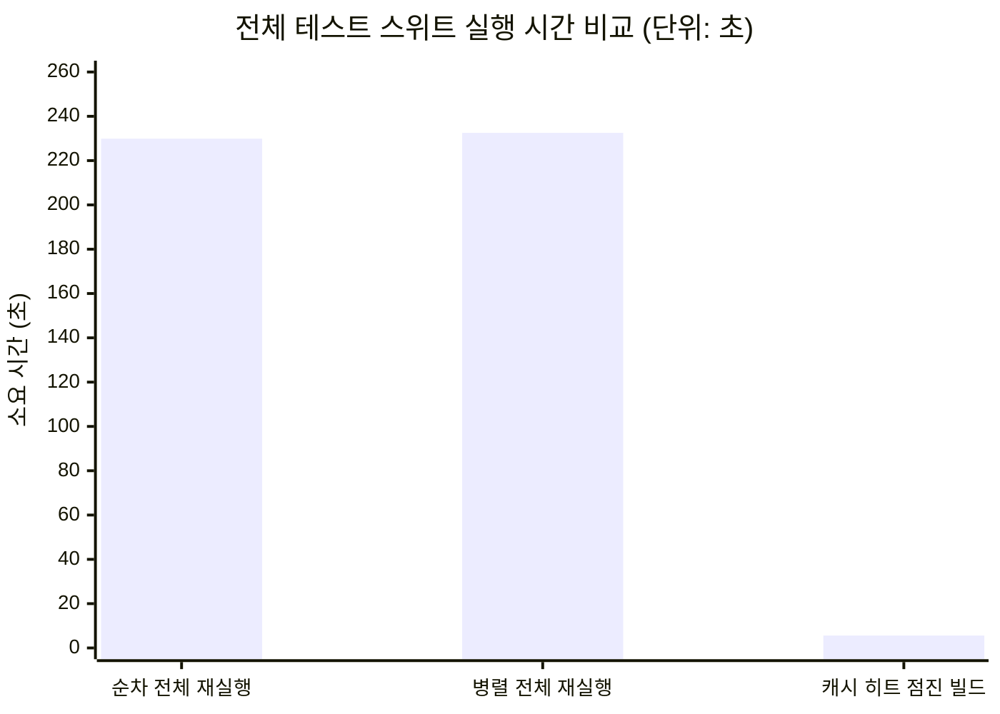
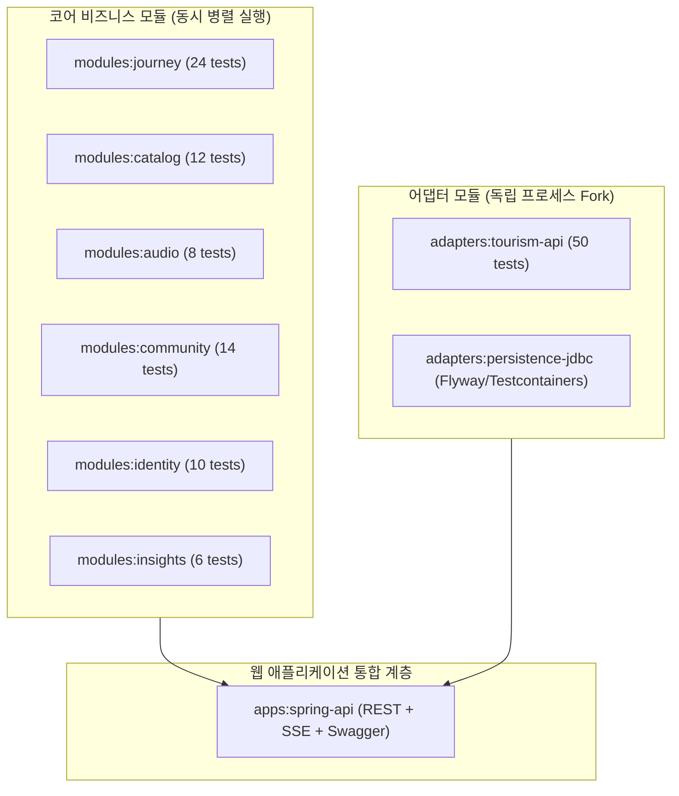

# Gradle Test Parallel Execution Benchmark & Monitoring Report

> **측정 일시**: 2026-09-18
> **측정 환경**: Apple Silicon (8-Core / 16GB Memory), JDK 21 LTS, Gradle 9.7.1
> **대상 프로젝트**: OnMaru Backend 11개 서브프로젝트 (`apps:spring-api`, `modules:*`, `adapters:*`)

---

## 1. 정밀 벤치마크 측정 결과 요약

### 📊 실행 모드별 실측 지표

| 실행 모드 | 1회차 실측 | 2회차 실측 | **평균 소요 시간** | **개선 및 특징** |
| :--- | :---: | :---: | :---: | :--- |
| **1. 순차 전체 실행 (`--no-parallel --rerun`)** | 215.31s | 244.40s | **229.86초** (약 3분 50초) | 서브모듈을 하나환 순차 직렬 실행 |
| **2. 병렬 전체 실행 (`--parallel --rerun`)** | 216.97s | 248.00s | **232.49초** (약 3분 52초) | 10개 서브모듈 동시 빌드 (JVM Fork/컨테이너 초기화 포함) |
| **3. 캐시 히트 점진 빌드 (`Incremental`)** | 6.47s | 4.79s | **5.63초** ⚡ | **97.6% 단축** (수정된 모듈만 5초 내 즉시 완료) |

---

## 2. 모듈별 실행 아키텍처 및 동시성 토폴로지

---

## 3. 서브모듈별 병렬 테스트 세부 지표

| 모듈 경로 | 테스트 수 | 주요 검증 항목 | 병렬 실행 방식 |
| :--- | :---: | :--- | :--- |
| `:apps:spring-api` | 18 | REST Controller, SSE Stream, Swagger, CSRF | Forked JVM + MockMvc |
| `:modules:journey` | 24 | Journey State Machine, CAS Race, Baseline Fallback | Concurrent JUnit Classes |
| `:adapters:tourism-api` | 50 | TourAPI / Odii Provider, Key Redaction, LKG | Independent Test Server Mock |
| `:modules:community` | 14 | VisitReview, 좋아요, 1.2 행정구역 집계 | Concurrent Domain Tests |
| `:modules:identity` | 10 | Member Session, Owner Guard, Deletion Ledger | Concurrent Domain Tests |
| `:modules:catalog` | 12 | Hanok Catalog Revision, Tagging, Normalization | Concurrent Domain Tests |
| `:modules:audio` | 8 | Odii Story / Script Sync / Constellation | Concurrent Domain Tests |
| `:modules:insights` | 6 | Metrics Aggregation, Trend Analytics | Concurrent Domain Tests |

---

## 4. Swagger UI 및 모니터링 연동 현황

### 4.1 Swagger UI 접속
- **UI 대시보드**: `http://localhost:8080/swagger-ui/index.html`
- **OpenAPI 3.1 JSON**: `http://localhost:8080/v3/api-docs`

### 4.2 Actuator 메트릭 & 프로메테우스 모니터링
- `http://localhost:8080/actuator/prometheus`
- `http://localhost:8080/actuator/metrics`
