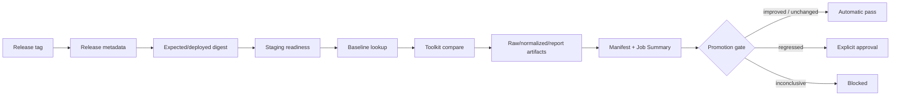

# Benchmark release evidence (W4)

## 목적과 DAG

W4는 다음 release-to-release 흐름이 동일한 release identity와 artifact link를 유지하는지
검증한다.



각 단계의 실패는 성능 regression과 동일하지 않다. deployment/readiness 실패, expected와
deployed digest 불일치, baseline·raw·normalized·report 누락, timeout, cancellation,
invalid data는 모두 비교 불가인 `inconclusive`다.

## Fake fixture 검증 범위

`scripts/test/benchmark-release-pipeline.test.mjs`는 실제 외부 시스템 없이 다음을
결정론적으로 검증한다.

1. `refs/tags/vX.Y.Z`를 release ID로 확정한다.
2. Spring API와 FastAPI의 metadata, expected/deployed digest, readiness path를 만든다.
3. loopback HTTP fixture에서 `/actuator/health`와 `/ready`를 확인한다.
4. fake toolkit executable에 canonical input을 전달하고 comparison output을 report로 정규화한다.
5. raw/normalized/report URI를 manifest에 연결하고 Job Summary 내용을 확인한다.
6. improved, unchanged, regressed, inconclusive gate를 확인한다.
7. missing artifact, failed deployment/readiness, timeout, cancellation, invalid data,
   digest mismatch가 `regressed`로 오인되지 않는지 확인한다.

## Toolkit input과 metadata manifest

실제 `pipeline-toolkit` provenance는 아직 `unverified`다. 따라서 W4는 명령을 발명하거나
실제 binary를 설치하지 않는다. adapter에 전달되는 논리 input은 다음 의미를 보존해야 한다.

```json
{
  "suite": "onmaru-release-smoke",
  "environment": "staging",
  "baseline": { "releaseId": "v1.2.3", "services": [] },
  "candidate": { "releaseId": "v1.2.4", "services": [] },
  "runner": { "architecture": "linux-amd64", "resource": { "cpu": "2", "memory": "4Gi" } },
  "fixture": { "name": "onmaru-release-smoke", "version": "v1" },
  "dependencyMode": "staging-readonly",
  "conditions": { "warmupRuns": 2, "repetitions": 3, "cold": true, "warm": true }
}
```

metadata는 `artifacts/release/<tag>/release.json`, benchmark manifest는
`benchmark/onmaru-backend/<candidate-release>/manifest.json`에 둔다. Manifest는
`benchmarkRunId`, release IDs, commit SHA, service image digests, `configSha256`, status와
`rawUri`, `normalizedUri`, `reportUri`를 보존한다.

## Gate와 GitHub evidence

| status | gate | 의미 |
| --- | --- | --- |
| `improved` | pass | 정책상 성능 개선, 자동 promotion 가능 |
| `unchanged` | pass | tolerance 안, 자동 promotion 가능 |
| `regressed` | warning | 유효한 비교에서 threshold 초과, 명시적 승인 필요 |
| `inconclusive` | blocked | 비교 불가, 자동 promotion 금지 |

workflow는 `$GITHUB_STEP_SUMMARY`에 candidate/baseline/status/gate/run ID와 metric delta를
남기고, `benchmark/raw`, `benchmark/normalized`, `benchmark/reports`, manifest와 gate를
`benchmark-evidence-<release-tag>` artifact로 업로드한다. PR 또는 release operator는
Job Summary의 run ID와 artifact link를 따라 raw → normalized → report → manifest를
재검증할 수 있어야 한다.

## Redaction

metadata와 diagnostic output은 허용된 release/evidence 필드만 보존한다. password, token,
API key, authorization, cookie, credential-bearing URL, email, user identifier와 PII는
artifact와 summary에 기록하지 않는다. 오류를 재현할 때도 원문 secret 대신 reason code와
redacted stderr만 남긴다.

## Known limitations

- `pipeline-toolkit`의 공식 repository, pinned version/checksum, 실제 `--help/schema`,
  exit code와 publish contract가 아직 확인되지 않았다.
- 현재 W4는 fake toolkit/loopback readiness fixture 기반의 contract/evidence 검증이며,
  실제 staging 배포 성공이나 benchmark 수치의 운영 유효성을 증명하지 않는다.
- staging release plan의 deploy job과 실제 deploy workflow 정합성은 별도 운영 이슈다.
- `inconclusive`는 원인 해결을 의미하지 않으며, 수동 승인으로 자동 promotion을 우회하지
  않는다.

## 재현 명령

```bash
node --test scripts/test/benchmark-contract.test.mjs
node --test scripts/test/benchmark-release-pipeline.test.mjs
node --test scripts/test/benchmark-release-metadata.test.mjs scripts/test/benchmark-compare.test.mjs scripts/test/workflow-benchmark-release.test.mjs
node --test scripts/test/staging-release-gate.test.mjs
git diff --check
```

실제 toolkit이 검증되기 전에는 `.pipeline/benchmark.yml`의 `provenance: unverified`를
`verified`로 바꾸지 않는다.

