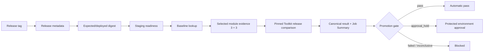

# Benchmark release evidence

## Release 3회 비교의 운영 경계 (#543)

Release Benchmark Gate의 정본은 `benchmark/reports/release-module-comparison.json`이며,
수치 판정은 Toolkit PR #130의 comparator를 포함하는 PR #132 병합 commit `9c6f0033a5ec2429085b29d56ebdb3caca94bbcd`가 소유한다.
baseline/candidate Release asset `release-module-evidence.json`의 사전 선택된 서로 다른
성공 run 각 3개를 비교한다. [입력 필드와 실패 모델](../../benchmark/contracts.md)을 따른다.
asset이 없으면 `inconclusive`로 기록한다. 일반 tag push 직후에는 아직 candidate asset이
없을 수 있으므로 검토된 asset을 준비한 뒤 해당 tag로 수동 workflow를 실행한다.

`classification=comparable`이고 `policy_outcome=approval_hold`인 **15% 초과** 회귀만
`benchmark-promotion` GitHub environment 승인을 요구한다. 정확히 15%는 통과한다.
`failed`/`inconclusive`는 승인 job을 만들지 않고 promotion-gate를 실패시킨다. 원본
scan·migration·staging readiness가 실패하거나 comparison이 실행되지 않아도 gate는 닫힌다.
환경의 required reviewers 설정은 저장소 운영자가 관리해야 하며 YAML만으로 보장되지 않는다.

Job Summary와 30일 artifact에 정본 JSON, 개별 값·중앙값·범위·delta, source Actions 실행과
manifest artifact link, 제외 사유가 남는다. 기존 GitHub Release가 있으면 정본 JSON을
Release asset에도 보관한다. 원시 입력의 추가 필드나 오류 원문은 게시하지 않는다.
Release asset의 작성 권한을 신뢰하는 입력 계약이며 source URL의 진위나 artifact checksum을
Actions API로 재검증하는 collector는 아직 없다. 원본 manifest가 만료되기 전에 선택 근거를
보존해야 한다. 이 작업에서는 실제 Actions 실행이나 release 변경을 수행하지 않았다.

W4의 5% latency 비교와 `trend-comparison`은 진단 전용이다. 아래 W4 문단과 fixture는
이전 evidence 형식을 설명하며 새 release approval의 판정 근거가 아니다.

## 목적과 DAG

현재 정본 흐름은 다음과 같다. 기존 W4는 동일 release identity와 artifact link를
유지하는 진단 경로로 병행한다.


```mermaid
flowchart LR
  A[Release tag] --> B[Release metadata]
  B --> C[Expected/deployed digest]
  C --> D[Staging readiness]
  D --> E[Baseline lookup]
  E --> F[Selected module evidence 3 + 3]
  F --> G[Pinned Toolkit release comparison]
  G --> H[Canonical result + Job Summary]
  H --> I{Promotion gate}
  I -->|pass| J[Automatic pass]
  I -->|approval_hold| K[Protected environment approval]
  I -->|failed / inconclusive| L[Blocked]
```

각 단계의 실패는 성능 regression과 동일하지 않다. deployment/readiness 실패, expected와
deployed digest 불일치, baseline·raw·normalized·report 누락, timeout, cancellation,
invalid data는 모두 비교 불가인 `inconclusive`다.

## Fake fixture 검증 범위

`scripts/test/benchmark-release-pipeline.test.mjs`는 실제 외부 시스템 없이 다음을
결정론적으로 검증한다.

1. `refs/tags/vX.Y.Z`를 release ID로 확정한다.
2. Spring API와 FastAPI의 metadata, expected/deployed digest, readiness path를 만든다.
3. loopback HTTP fixture에서 `/actuator/health`와 `/ready`를 확인한다.
4. fake toolkit executable에 canonical input을 전달하고 comparison output을 report로 정규화한다.
5. raw/normalized/report URI를 manifest에 연결하고 Job Summary 내용을 확인한다.
6. improved, unchanged, regressed, inconclusive gate를 확인한다.
7. missing artifact, failed deployment/readiness, timeout, cancellation, invalid data,
   digest mismatch가 `regressed`로 오인되지 않는지 확인한다.

## Toolkit input과 metadata manifest

기존 W4 가상 CLI provenance는 아직 `unverified`다. 따라서 W4는 명령을 발명하거나
실제 binary를 설치하지 않는다. adapter에 전달되는 논리 input은 다음 의미를 보존해야 한다.

```json
{
  "suite": "onmaru-release-smoke",
  "environment": "staging",
  "baseline": { "releaseId": "v1.2.3", "services": [] },
  "candidate": { "releaseId": "v1.2.4", "services": [] },
  "runner": { "architecture": "linux-amd64", "resource": { "cpu": "2", "memory": "4Gi" } },
  "fixture": { "name": "onmaru-release-smoke", "version": "v1" },
  "dependencyMode": "staging-readonly",
  "conditions": { "warmupRuns": 2, "repetitions": 3, "cold": true, "warm": true }
}
```

metadata는 `artifacts/release/<tag>/release.json`, benchmark manifest는
`benchmark/onmaru-backend/<candidate-release>/manifest.json`에 둔다. Manifest는
`benchmarkRunId`, release IDs, commit SHA, service image digests, `configSha256`, status와
`rawUri`, `normalizedUri`, `reportUri`를 보존한다.

## 기존 W4 진단 Gate와 GitHub evidence

| status | gate | 의미 |
| --- | --- | --- |
| `improved` | pass | 정책상 성능 개선, 자동 promotion 가능 |
| `unchanged` | pass | tolerance 안, 자동 promotion 가능 |
| `regressed` | warning | 유효한 비교에서 threshold 초과, 명시적 승인 필요 |
| `inconclusive` | blocked | 비교 불가, 자동 promotion 금지 |

workflow는 `$GITHUB_STEP_SUMMARY`에 candidate/baseline/status/gate/run ID와 metric delta를
남기고, `benchmark/raw`, `benchmark/normalized`, `benchmark/reports`, manifest와 gate를
`benchmark-evidence-<release-tag>` artifact로 업로드한다. PR 또는 release operator는
Job Summary의 run ID와 artifact link를 따라 raw → normalized → report → manifest를
재검증할 수 있어야 한다.

## Redaction

metadata와 diagnostic output은 허용된 release/evidence 필드만 보존한다. password, token,
API key, authorization, cookie, credential-bearing URL, email, user identifier와 PII는
artifact와 summary에 기록하지 않는다. 오류를 재현할 때도 원문 secret 대신 reason code와
redacted stderr만 남긴다.

## Known limitations

- module API는 고정 commit으로 확인했으나 안정된 release module CLI는 없다. adapter는
  고정 commit의 Python dataclass/API에 결합된다. 기존 W4 가상 CLI/publish contract는 미확인이다.
- 현재 W4는 fake toolkit/loopback readiness fixture 기반의 contract/evidence 검증이며,
  실제 staging 배포 성공이나 benchmark 수치의 운영 유효성을 증명하지 않는다.
- staging release plan의 deploy job과 실제 deploy workflow 정합성은 별도 운영 이슈다.
- `inconclusive`는 원인 해결을 의미하지 않으며, 수동 승인으로 자동 promotion을 우회하지
  않는다.

## 재현 명령

```bash
node --test scripts/test/benchmark-contract.test.mjs
node --test scripts/test/release-module-comparison.test.mjs scripts/test/workflow-benchmark-release.test.mjs
node --test scripts/test/benchmark-release-pipeline.test.mjs
node --test scripts/test/benchmark-release-metadata.test.mjs scripts/test/benchmark-compare.test.mjs scripts/test/workflow-benchmark-release.test.mjs
node --test scripts/test/staging-release-gate.test.mjs
git diff --check
```

실제 toolkit이 검증되기 전에는 `.pipeline/benchmark.yml`의 `provenance: unverified`를
`verified`로 바꾸지 않는다.
