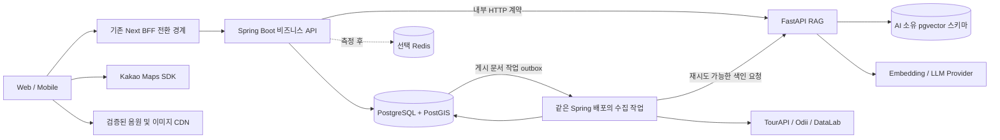
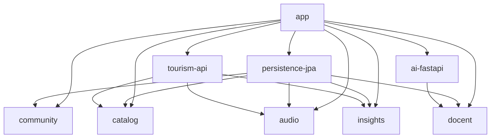

# OnMaru Architecture Blueprint

> 후속 제안: [이야기길 아키텍처 확장](journey-exploration/architecture-and-recommendation.md)은 다중 자원 콘텐츠와 선택 보존형 탐색 요구에 따라 content/discovery 경계를 추가한다. 아래 빈 recommendation 모듈 보류 판단은 최초 범위의 판단이며, 새 기능까지 제외한다는 뜻이 아니다.

상태: 검토용 제안 v0.1, 2026-09-09. 근거와 기술 문서: [설계 인덱스](README.md). 요구사항: [백엔드 PRD](backend-prd.md).

## 1. Executive Decision

**Spring Boot 단일 배포의 도메인 중심 Modular Monolith에 선택적 Hexagonal 경계와 Lightweight DDD를 적용하고, 순수 Java 코어를 Gradle로 보호하며, FastAPI RAG는 버전 계약을 가진 별도 배포로 연결한다.**

Spring과 Spring Boot는 경쟁 제품이 아니다. Spring Framework 위에서 자동 설정과 실행·운영 구성을 제공하는 Spring Boot로 서버를 만든다. 이 프로젝트는 사용 빈도 순위를 추정하는 대신 사용자가 선택한 Java 생태계, 트랜잭션, 테스트, Python AI 분리를 근거로 Boot를 사용한다. Java 21 + Boot 4.1 계열을 호환성 검증 시작점으로 삼고 최신 patch와 Gradle wrapper는 W1에서 고정한다. 공식 요구사항은 [Spring Boot 문서](https://docs.spring.io/spring-boot/system-requirements.html)를 따른다.

세 현실적 대안은 (A) 단일 Boot 프로젝트의 feature package, (B) 도메인 코어 모듈 + 기술 adapter 모듈, (C) feature별 domain/application/web/persistence 전부 모듈화다. A는 가장 빠르지만 코어 classpath에서 JPA를 배제하기 어렵다. C는 가장 강한 물리적 격리를 제공하지만 작은 변경에 여러 빌드 파일과 매핑이 따라온다. **B를 권고**한다. 코어 내부 domain/application은 패키지로 나누고 기술 classpath만 확실히 격리한다.

Clean Architecture를 또 하나의 폴더 구조로 덧씌우지 않는다. 의존성 역전·프레임워크 독립성·테스트 가능성 원칙을 그대로 적용한다. 관광 조회에는 단순 query service를 쓰고, 온기 작성 정책과 데이터 게시 상태처럼 불변식이 있는 곳에만 rich domain을 쓴다.

## 2. Architecture Principles

1. 실제 FE 사용 사례와 데이터 책임이 도메인 경계를 결정한다.
2. Domain과 Application은 JDK 기반이며 Spring, JPA, HTTP, LLM SDK를 import하지 않는다.
3. 외부 I/O는 사용 사례가 정의한 output port로 접근한다.
4. Input port는 공개 계약이 필요한 사용 사례에만 만들고 내부 helper에는 강제하지 않는다.
5. Gradle 모듈은 기술 classpath 또는 도메인 책임을 보호한다. 계층마다 모듈을 만들지 않는다.
6. 한 데이터의 원본 수정 책임은 한 모듈에 둔다. 외부 ID와 내부 ID를 분리한다.
7. 관광 API 장애·AI 장애 중에도 저장된 장소와 오디 콘텐츠는 조회 가능해야 한다.
8. DB 트랜잭션에서 원격 호출을 하지 않는다. 재시도에는 중복 방지와 시간 예산이 따른다.
9. 정규화·접근 패턴·실측 순으로 설계하고 도입한 경계는 CI에서 검증한다.
10. 초기 모듈 수보다 삭제·교체·장애 실험으로 변경 격리 효과를 평가한다.

## 3. System Context



PG와 VEC는 초기에는 한 PostgreSQL 인스턴스의 별도 schema/role이다. **공유 서버이지 공유 쓰기 모델이 아니다.** Spring은 AI 테이블에 직접 쓰지 않고 Python은 비즈니스 테이블에 직접 쓰지 않는다. Python 확장 부하가 DB를 압박하면 별도 인스턴스로 옮긴다.

첫 한옥 출시 시에는 Spring + PostgreSQL만 필요하다. FastAPI·vector·outbox는 AI 단계에서 활성화한다. Spring 배포의 scheduled task는 다중 replica에서도 DB lease로 한 실행만 선출한다. 오디오 파일은 Spring이 전체 프록시하지 않는다.

## 4. Domain Boundary

| Context / 모듈 | 책임과 소유 데이터 | 불변식 / 적용 깊이 |
|---|---|---|
| Catalog `:catalog` | Place, source identity, 한옥 상세, 이미지, 월별 큐레이션 | 원본 중복 방지, 게시 상태. 조회는 단순 DTO projection |
| Community `:community` | 온기 후기, 태그, 작성 주체와 소유권 | 100자, 점수 1~5, 본인 판정, 숨김 상태. Warmth aggregate |
| Audio `:audio` | Odii spot/story 언어별 원본, 자막 revision, place 매핑 | 언어 ID 보존, 대본 게시/삭제, 매핑 확정. Story aggregate |
| Tourism Insights `:insights` | 일별 지역 방문자 및 관광지 집중률 관측 | 관측 단위/기준일/출처를 혼합하지 않음. 계산 policy |
| Docent `:docent` | 질문 사용 사례, quota 정책, 근거 문서 허용 범위 | 서버 검증 context만 전달, 결과 근거 검증. 공급자와 독립 |
| AI 내부 Python | 문서 revision별 chunk, embedding, retrieval, 생성 | 검증된 corpus만 검색, cited evidence, model/index version |

`user`, `trip`, `recommendation`, `content`를 예시 이름 때문에 생성하지 않는다. 초기 identity는 community에서 필요한 opaque actor와 보안 adapter로 충분하다. 계정 lifecycle·북마크·개인화가 독립적으로 복잡해지면 identity를 승격한다. 월별 큐레이션은 catalog 내부 package다. 오디오를 장소의 자식 엔티티 하나로 축소하지 않는다. 하나의 Odii spot은 여러 장소와 관계를 가질 수 있고 매핑이 없어도 오디오를 제공할 수 있다.

사용자 제안과 달리 이미 Python은 별도 deployable이므로 전체 시스템을 엄밀하게 단일 monolith라 부르지 않는다. **Spring 비즈니스 영역이 modular monolith**이고 AI는 격리된 보조 시스템이다.

## 5. Gradle Module Design

| Gradle module / 경로 | responsibility | dependencies | forbidden dependencies |
|---|---|---|---|
| `:app` / `apps/spring-api` | web/security/transaction wrapper, composition, cross-context bridge, scheduler | 모든 필요한 core와 adapter | domain policy 직접 구현 |
| `:catalog` / `modules/catalog` | catalog domain/application/api/port | JDK | Spring/JPA, 타 core internal, adapters |
| `:community` / `modules/community` | 온기와 actor policy | JDK | 위와 동일 |
| `:audio` / `modules/audio` | 이야기·대본 사용 사례 | JDK | 위와 동일 |
| `:insights` / `modules/insights` | 관측 데이터/혼잡 해석 | JDK | 위와 동일 |
| `:docent` / `modules/docent` | 질문·근거·쿼터 계약 | JDK | 위와 동일, Reactor/FastAPI DTO |
| `:persistence-jpa` / `adapters/persistence-jpa` | core별 persistence adapter와 migration | 해당 core, JPA/JDBC/PostGIS 기술 | web, AI/TourAPI adapter, 타 context persistence internal |
| `:tourism-api` / `adapters/tourism-api` | 외부 관광 DTO 해석과 호출 | catalog/audio/insights port | DB 구현체와 web |
| `:ai-fastapi` / `adapters/ai-fastapi` | Docent port를 내부 HTTP로 구현 | docent port, HTTP client | 다른 adapter 및 비즈니스 DB |

이는 최종 목표 구성이다. W1 첫 골격은 app/catalog/persistence-jpa/tourism-api만 만든다. 나머지 core와 ai adapter는 해당 기능 Issue에서 추가한다. Redis는 실제 사용 시 새 adapter 또는 app 내부 기술 package로 시작한다.

단일 persistence 모듈은 migration·JPA 설정을 공유하여 파일 수를 줄이지만 모든 context를 볼 수 있다. 따라서 package allowlist로 `persistence.community`가 `catalog.domain`이나 `persistence.audio`를 import하지 못하게 한다. 이것이 반복적으로 깨지거나 독립 변경/빌드가 실제로 필요하면 context별 persistence 모듈로 승격한다. DB 엔진을 교체해도 도메인은 보호되지만 SQL·PostGIS·migration의 교체 비용은 남는다.

## 6. Dependency Graph

다음 화살표는 **컴파일 의존성**이다. 앞의 context 그림은 런타임 호출이며 두 방향을 혼동하지 않는다.



Core 간 직접 Gradle 의존성을 초기에는 두지 않는다. community가 장소 유효성 확인을 필요로 하면 community의 `PlaceLookupPort`를 app의 `CatalogPlaceLookupBridge`가 구현하고 catalog의 공개 API에 위임한다. docent의 story context도 동일하다. 같은 JVM의 보통 메서드 호출이며 내부 HTTP가 아니다. 각 consumer의 작은 DTO로 mapping한다.

이 bridge는 외부 교체 가능성과 순환 방지를 위해 필요한 두세 경계에 한정한다. 모든 내부 메서드를 interface로 바꾸지 않는다. 새 core 간 직접 공개 API 의존성은 DAG 유지와 소유권을 검토한 ADR 변경으로 허용할 수 있다.

## 7. Hexagonal Mapping

| Context | Domain | Application / Input | Output Port | Inbound Adapter | Outbound Adapter |
|---|---|---|---|---|---|
| catalog | PlaceId, category, publication policy | CatalogQueries, SyncPlaces | PlaceQueryPort, PlaceStore, TourismSourcePort | HanokController, sync scheduler | JPA/JDBC catalog, tourism client |
| community | Warmth, Mood, ReviewText | PublishWarmth, WarmthQueries | WarmthStore, PlaceLookupPort, Clock | WarmthController + transaction wrapper | JPA warmth, catalog bridge |
| audio | StoryRevision, LanguageIdentity | AudioQueries, PublishStory | StoryStore, AudioSourcePort | OdiiController, scheduler | audio persistence, Odii client |
| insights | Observation, metric policy | GetHeatmap, ImportObservations | ObservationStore, ConcentrationSourcePort | HeatmapController, scheduler | observation SQL, DataLab client |
| docent | Question, EvidenceRef, AnswerOutcome | AskDocent input contract | StoryContextPort, DocentAnswerPort, QuotaPort | AskController / SSE adapter | audio bridge, FastAPI adapter, quota store |

Input facade는 조회 전용 concrete class여도 된다. 외부 I/O port는 테스트 fake와 구현 교체라는 이유가 있다. Domain Service는 하나의 entity에 귀속되지 않는 규칙이 있을 때만 만든다. Event 역시 실제 소비자가 있어야 정의한다.

## 8. Package Structure

```text
apps/spring-api/src/main/java/kr/onmaru/
  boot/OnMaruApplication.java
  configuration/CatalogConfiguration.java
  web/catalog/HanokController.java
  web/community/WarmthController.java
  web/docent/AskController.java
  transaction/community/TransactionalPublishWarmth.java
  integration/community/CatalogPlaceLookupBridge.java
  integration/docent/AudioStoryContextBridge.java
  security/
  scheduling/
modules/community/src/main/java/kr/onmaru/community/
  api/PublishWarmth.java
  api/PublishWarmthRequest.java
  api/WarmthView.java
  application/PublishWarmthService.java
  application/port/WarmthStore.java
  application/port/PlaceLookupPort.java
  domain/Warmth.java
  domain/ReviewText.java
adapters/persistence-jpa/src/main/java/kr/onmaru/persistence/
  community/WarmthJpaAdapter.java
  community/WarmthJpaEntity.java
  community/SpringDataWarmthRepository.java
  catalog/
adapters/ai-fastapi/src/main/java/kr/onmaru/aifastapi/
  FastApiDocentAdapter.java
  transport/
apps/ai-api/
  pyproject.toml
  src/onmaru_ai/main.py
  src/onmaru_ai/api/
  src/onmaru_ai/application/
  src/onmaru_ai/retrieval/
  src/onmaru_ai/providers/
  src/onmaru_ai/persistence/
  migrations/
  tests/
contracts/openapi/
infra/
```

Python 모듈을 `apps/ai-api`와 별도 `python/` 트리에 중복 배치하지 않는다. 하나의 Python package로 시작한다. Java 작은 query는 `api/CatalogQueries`, `application/port/PlaceQueryPort` 정도면 충분하다. `port/in`과 `port/out`의 깊이를 기계적으로 만들지 않는다. package 이름·클래스는 설계 예이며 W1에서 실제 source tree를 확정한다.

## 9. Spring ↔ FastAPI Architecture

| 항목 | 결정 제안 |
|---|---|
| 방향 | FE → Spring → FastAPI. Python은 요청 처리 중 Spring callback 안 함 |
| 계약 | HTTP REST JSON + 선택 SSE, `contracts/openapi/ai-internal-v1.yaml`을 공동 리뷰. gRPC/Protobuf는 보류 |
| 소유권 | Spring: story 권한·revision·질문·quota·에러 의미. Python: retrieval/모델 구현. wire schema 변경은 양쪽 contract test 필수 |
| 입력 | requestId, question, language, documentId, revision, contentHash. FE scriptContext와 storyTitle은 권위 있는 근거로 사용 안 함 |
| 출력 | status, answer 또는 events, citations(documentId/revision/chunkId/offset), usage, indexVersion, modelVersion |
| timeout 제안 | connect 1s, first event 8s, idle 10s, 전체 30s. public proxy는 여유를 두되 전체 요청 deadline을 전파 |
| retry | 사용자 생성 요청 자동 retry 0회. 색인 PUT은 idempotency 기반 지수 backoff+jitter, 최대 3회 후 pending/실패 기록 |
| circuit breaker | HTTP adapter에 배치. 예시: 최근 20건 이상에서 50% 실패 시 30s open, half-open 2개. 4xx는 실패율에서 제외 |
| bulkhead | 초기 동시 AI 8건/인스턴스, 무한 queue 금지. 포화 시 429/503. 수치는 부하 실험으로 조정 |
| error mapping | 잘못된 질문 400, 없는 story 404, 권한 403, quota 429, AI unavailable 503, timeout 504, 검색 근거 부족은 `insufficient_evidence` |
| 관측 | traceparent/requestId, 모델 latency, time-to-first-event, tokens, circuit 상태, index lag. 질문 원문·위치·비밀키는 기본 로그 제외 |
| 버전 | URL major v1, optional 필드 추가 허용, enum/필수 필드 변경은 consumer 검증. N/N-1 호환 후 배포 |

첫 답변 이벤트 후 실패하면 HTTP status를 바꿀 수 없다. SSE `error`와 `done`으로 종료하고 완료 답변으로 저장하지 않는다. 브라우저 `EventSource`는 POST 본문을 보낼 수 없으므로 기존 `POST /odii/ask`는 fetch streaming으로 소비한다. FE 연결 해제 시 Python/LLM 작업 취소를 전파한다.

Java contract는 `Flow.Publisher<AnswerEvent>`와 같은 JDK 타입으로 표현할 수 있다. JSON은 event를 최종 Answer로 모아 반환한다. Reactor, HTTP Response, Pydantic, provider token callback은 core로 노출하지 않는다. JSON부터 검증하고 SSE는 소비자 요구와 backpressure 테스트 후 추가한다.

RAG 모델 응답을 일반 문자열 port로만 감추면 출처·중단·과금 의미가 사라진다. 따라서 `DocentAnswerPort`는 `AnswerOutcome`, `EvidenceRef`, `Usage`라는 업무 의미를 보존한다. 추천이 실제 도입될 때 `RecommendationPort`를 별도로 만든다.

## 10. Transaction Boundary

Domain/Application을 framework-free로 유지하므로 `@Transactional`은 app의 use-case wrapper에 둔다. Wrapper가 공개 input port를 구현하고 순수 service에 위임한다. 코어 service와 wrapper를 모두 동일 port bean으로 자동 등록하지 않고 configuration에서 명시적으로 조립한다.

```java
// apps/spring-api: illustrative, not implemented
public class TransactionalPublishWarmth implements PublishWarmth {
    private final PublishWarmth delegate;

    TransactionalPublishWarmth(PublishWarmth delegate) {
        this.delegate = delegate;
    }

    @org.springframework.transaction.annotation.Transactional
    public WarmthView publish(PublishWarmthRequest request) {
        return delegate.publish(request);
    }
}
```

Wrapper는 Spring bean을 통한 외부 호출이어야 한다. 클래스 기반 proxy를 사용할 수 있도록 wrapper 클래스와 대상 메서드를 final로 만들지 않는다. 같은 객체 내부 호출은 프록시를 거치지 않는다는 [Spring 트랜잭션 제약](https://docs.spring.io/spring-framework/reference/data-access/transaction/declarative/annotations.html)을 테스트한다. rollback 정책은 unchecked business exception을 기본으로 하고 checked exception 필요 시 명시한다.

- Aggregate 한 번의 변경과 그에 따른 outbox insert는 한 로컬 DB 트랜잭션이다.
- 조회 DTO는 transaction 안에서 완전히 materialize한다. OSIV는 끄고 lazy entity를 web에 반환하지 않는다.
- Community 작성 시 catalog bridge는 같은 DB의 가벼운 조회만 한다. 모든 원격 검증은 transaction 밖이다. 장소 삭제와 경쟁하면 FK와 게시 상태 정책으로 보호한다.
- 강한 정합성이 필요한 cross-domain 작업은 app orchestration + 하나의 transaction manager에서 공개 API만 호출한다. 다른 모듈 repository를 직접 사용하지 않는다. 필요하면 READ COMMITTED보다 강한 잠금/낙관 version 조건을 해당 규칙에만 적용한다.
- HTTP/LLM 호출은 read snapshot → transaction 종료 → 원격 처리 → 필요한 결과만 별도 저장 순서다. 네트워크 I/O 중 DB connection을 점유하지 않는다.
- 중요하지 않은 local notification은 after-commit. **after-commit listener는 내구성을 보장하지 않는다.** 대본 색인처럼 유실되면 안 되는 일은 같은 transaction에 outbox를 기록하고 at-least-once 전달한다.
- 삭제/revision 갱신은 tombstone과 monotonic version으로 전파한다. 역순 도착한 이전 revision이 최신 문서를 복원하지 못하게 한다.

## 11. Persistence Strategy

핵심 entity는 순수 Java, JPA entity는 persistence module에 분리한다. Community의 Warmth 불변식과 Audio revision에는 수동 mapper가 명확하다. 모든 read에 domain entity를 복원하지 않고 `PlaceQueryPort`가 projection DTO를 반환하게 하여 중복 객체 비용을 줄인다.

Repository port는 `JpaRepository<T, ID>`의 복제가 아니다. `save`, `findById`나 업무에 필요한 `findPublishedNearby` 등 제한된 연산을 정의한다. `Pageable`, `Specification`, `EntityManager`는 외부로 내보내지 않는다. immutable PageQuery/PageResult가 필요하면 context 내부 공개 타입으로 둔다.

단순 reference/code 조회는 JDBC projection도 허용한다. 공간 SQL은 persistence 내부에 집중한다. mapper 생성 라이브러리는 실제 반복 비용을 측정한 뒤 도입한다. 한 개 JPA entity에 domain까지 합치면 파일 수는 줄지만 사용자 요구인 framework independence가 깨지므로 선택하지 않는다.

PostgreSQL + PostGIS가 공간 검색과 정합성을 한 곳에서 제공한다. AI 단계에서 pgvector를 같은 서버의 독립 schema에 추가한다. MySQL도 RDBMS 후보이나 이 프로젝트의 공간·벡터 조합을 위해 추가 기술이 늘어날 수 있다. Supabase는 PostgreSQL을 대체하는 엔진이 아니라 hosting/Auth 선택이며 별도 판단한다. Redis는 저장소의 정답이 아니다. 상세 모델은 [데이터 설계](data-api-design.md)를 따른다.

## 12. Architecture Enforcement

| 규칙 | 강제 방법 | 실패 fixture |
|---|---|---|
| core production classpath JDK만 | Gradle java-library + 승인된 dependency allowlist | Spring 의존성 추가 시 verification 실패 |
| Domain → Application/API/adapter 금지 | ArchUnit package rule | Domain에서 use case import |
| Application → framework/adapter 금지 | ArchUnit, core compile | `@Service`, JPA annotation 추가 |
| 다른 core internal 접근 금지 | compile classpath + 공개 api/port package allowlist | bridge에서 catalog.domain 참조 |
| persistence context 간 import 금지 | ArchUnit explicit allowedDependencies | warmth mapper에서 audio entity 참조 |
| cycle 금지 | Gradle project graph 검사 + ArchUnit slices | adapter↔app, package cycle |
| web이 repository 직접 호출 금지 | controller는 core api/DTO만 접근 | SpringDataRepository 주입 |
| port 구현은 adapter/wrapper에서만 | ArchUnit assignability rule | core에서 HTTP 구현 |
| migration/contract 변경 검증 | CI 별도 schema/contract jobs | 잘못된 FK, 응답 필수 필드 삭제 |

Configuration과 transaction wrapper는 port와 구현을 조립해야 하므로 명시적인 composition-root 예외다. “Adapter는 port만 본다”를 문자 그대로 적용하면 mapper가 domain을 복원하지 못한다. outbound persistence에 한해 해당 context의 domain과 port 접근을 허용하고 web은 공개 API만 본다.

[ArchUnit](https://www.archunit.org/userguide/html/000_Index.html)으로 클래스 접근을 검증하고 [Gradle](https://docs.gradle.org/current/userguide/multi_project_builds.html)로 classpath를 제한한다. 멀티 모듈만으로 package-private API가 생기는 것은 아니다. JPMS는 추가하지 않는다. Spring Modulith는 필요 시 test scope에서 [구조 검증](https://docs.spring.io/spring-modulith/reference/verification.html)에 활용하며 source package가 현재 module 모델과 맞는지 먼저 실험한다.

모든 모듈을 무작정 클래스 스캔하는 테스트는 빈 모듈을 통과시킬 수 있다. W1에서는 의도적 금지 dependency fixture가 실제 실패하는지 확인한다. 현재 hygiene CI에는 이러한 보장이 아직 없다.

## 13. Testing Strategy

| 계층 | 검증 | Test double / 실제 환경 |
|---|---|---|
| Domain | ReviewText 문자 수, 점수 범위, 상태 전이, revision 비교 | JUnit, 고정 Clock, Spring 없이 |
| Application | 소유권, 없는 장소, quota, 저장 실패, evidence 없음 | port fake, call count 검증, transaction 보장은 여기서 주장 안 함 |
| Persistence adapter | PK/FK/unique, 좌표, SQL projection, paging, optimistic lock | 실제 PostgreSQL + PostGIS Testcontainers |
| External adapter | singleton/list/null, HTTP 200 내부 에러, 429, timeout, 잘못된 DTO | WireMock 또는 mock HTTP server, 저장된 redacted fixture |
| AI adapter | request/response/stream schema, cancel, timeout, provider exception 변환 | stub FastAPI/provider + 계약 fixture |
| Integration | 실제 wrapper rollback, outbox 유실/중복, 다중 replica lease | Boot + PostgreSQL container |
| Architecture | 위 12절의 dependency 규칙 | ArchUnit + Gradle 검사 |
| End-to-end | 한옥 목록→상세, 후기 작성→조회, 오디오→질문→근거, AI outage 중 조회 | 두 서버 + DB, provider stub; 선택 live smoke |

Python은 pytest로 retrieval/청킹/정규화·에러 변환을 검증하고 실제 pgvector가 있는 container로 metadata filter와 revision invalidation을 검증한다. H2/SQLite를 PostgreSQL 공간·벡터 테스트 대용으로 쓰지 않는다. 매 PR live LLM 호출은 재현성과 비용 때문에 필수가 아니다. 모델 변경 시 고정 eval dataset 평가를 별도 실행한다.

## 14. Overengineering Review

| 분류 | 항목 | 이유 |
|---|---|---|
| KEEP | core classpath 격리, 명시 ID, API 계약, migration | 뒤늦게 정리하면 모든 소비자·데이터가 영향 받음 |
| KEEP | AI deadline/cancel/quota, 검증 corpus, outbox at AI 단계 | 비용·장애·근거 오염을 직접 방지 |
| SIMPLIFY | Domain/Application 하나의 Gradle core, read DTO projection | 계층 모듈과 mapper의 곱 증가 방지 |
| SIMPLIFY | feature 단위 web package와 단일 persistence module | 초기에 20~40개 Gradle 모듈이 되는 것 방지 |
| SIMPLIFY | JWT/session 검증 adapter와 opaque actor | 아직 계정 도메인 전체를 만들 근거 부족 |
| DEFER | Redis, H3, materialized view, ANN, reranker | 데이터 크기·병목·품질 개선 측정 후 |
| DEFER | Modulith 이벤트 registry, broker, 독립 batch 서비스 | outbox/lease 규모와 운영 필요가 입증되면 |
| REMOVE | 모든 CRUD의 Command/Handler/Factory/Specification 세트 | 검증할 추가 업무 규칙이 없음 |
| REMOVE | 빈 trip/recommendation module, 중복 Python 트리 | 현재 요구사항에 없는 구조 |
| REMOVE | provider DTO를 core 계약으로 사용, DB engine 완전 무비용 교체 약속 | 변경 격리의 실제 한계를 숨김 |

개발 속도를 가장 늦출 위험은 entity 3중 복제, 너무 이른 multi-service 운영, “공통” 모듈로 모든 DTO를 모으는 일이다. 위험 지표는 작은 endpoint 추가에 손대는 Gradle 모듈 수, 불변식 없는 wrapper/mapper 수, build 시간, 통합 오류 빈도다. 파일 수 자체를 품질 점수로 사용하지 않는다.

## 15. Evolution Strategy

Package → Gradle 승격은 서로 다른 기술 의존성, 반복되는 금지 접근, 독립 테스트/ownership이 생겼을 때 한다. 서비스 분리는 최소한 데이터 쓰기 소유권·버전 계약·실패 처리·운영 담당자가 분명해야 한다.

| 신호 | 분리 전 검증 | 후보 |
|---|---|---|
| AI 부하가 DB/CPU 예산 잠식 | pool·bulkhead·query 측정 후에도 핵심 API SLO 침해 | AI DB 및 embedding worker |
| 수집 작업이 API 배포/메모리와 충돌 | 배치 한도·chunk size·lease 개선 후 재측정 | 같은 코드의 독립 sync deployable |
| 특정 도메인 트래픽·배포 주기 독립 | cross-table query와 transaction 제거, 계약 N/N-1 | insights/read 서비스 |
| 팀 ownership 실제 분리 | 온콜·배포·데이터 변경 책임까지 독립 | 해당 business context |

분리 순서: 소유권 확인 → 내부 port와 projection 안정화 → 데이터 export/backfill → shadow compare → 읽기 전환 → 단일 writer 전환 → 기존 FK/직접 조회 제거. dual-write를 임의로 도입하지 않는다. MSA는 목표 단계가 아니라 비용을 감수할 필요가 생긴 경우의 선택이다.

## 평가표

정적 설계 평가이며 실제 성능 검증 점수가 아니다.

| Criterion | /5 | 근거와 감점 |
|---|---:|---|
| Modularity | 4 | core는 물리 분리, app/persistence는 일부 공통 경계 |
| Low Coupling | 4 | port/ID 중심, 하나의 DB와 composition 변경 결합 남음 |
| High Cohesion | 4 | 실제 FE capability와 데이터 ownership 기반, catalog 성장 관찰 필요 |
| Testability | 5 | pure core, fake ports, 실제 DB/HTTP 계약 테스트 경로 명확 |
| Framework Independence | 5 | domain/application classpath 보호; adapter는 의도적으로 종속 |
| Replaceability | 4 | provider 교체 가능, SQL/embedding 재색인 비용은 존재 |
| Scalability | 3 | 단일 business DB, 초기 소규모 운영 목표 |
| Developer Productivity | 4 | 조회 단순화, transaction wrapper와 두 언어 학습 비용 |
| Simplicity | 3 | 단일 Boot보다 구조가 많고 AI에 별도 운영 필요 |
| Maintainability | 4 | 계약·소유권·CI 규칙 명시, 실무 적용 결과 미검증 |

## 35개 질문 추적

| 번호 | 직접 답변 | 상세 |
|---|---|---|
| 1 | 외부 관광·AI·DB 경계에 Hexagonal 적절 | 1, 7 |
| 2 | Clean은 원칙만, 중복 구조 없음 | 1 |
| 3 | 온기 불변식·대본 revision 위주 Lightweight DDD | 4, 7 |
| 4 | Spring 영역 Modular Monolith 적절 | 1, 3 |
| 5 | 코드표·목록·큐레이션 조회에 단순 layered 흐름 | 7, 11 |
| 6 | 도메인 core와 기술 adapter 중심 | 5 |
| 7 | 책임이 확인된 domain만 module | 4, 5 |
| 8 | domain/application은 합치고 adapter classpath 분리 | 5 |
| 9 | 큐레이션·identity 초기·web·각 core 내부는 package | 4, 8 |
| 10 | JPA, 관광 HTTP, FastAPI 경계는 독립 adapter | 5 |
| 11 | app → adapters/core, adapters → core | 6 |
| 12 | core → framework/adapter, context internal 참조 금지 | 12 |
| 13 | DAG + package cycle CI, bridge로 역방향 차단 | 6, 12 |
| 14 | 즉시 결과 필요 시 공개 API에 local bridge 위임 | 6 |
| 15 | 같은 transaction 정합성은 동기, 지연 가능 부작용은 durable event | 10 |
| 16 | annotation은 app/adapter만 허용 | 10, 12 |
| 17 | 사용자 변경 격리 목표에 따라 pure POJO 유지 | 2, 11 |
| 18 | app use-case transaction wrapper | 10 |
| 19 | 분리하되 조회마다 domain 복원은 생략 | 11 |
| 20 | Modulith는 필요 시 test scope, 필수 아님 | 12 |
| 21 | 별도 deployable + 내부 계약, DB 쓰기 분리 | 3, 9 |
| 22 | REST JSON 우선, SSE 선택, gRPC/broker 보류 | 9 |
| 23 | deadline/bulkhead/circuit + AI 불가 응답, 핵심 조회 독립 | 9 |
| 24 | timeout/retry/circuit은 network adapter | 9 |
| 25 | 질문·근거·usage·결과를 가진 capability port | 9 |
| 26 | 불변식·상태·순수 계산, DB 검증 제외 | 13 |
| 27 | I/O port와 Clock fake, 내부 domain mock 안 함 | 13 |
| 28 | DB, 외부 HTTP, AI 계약 suite 분리 | 13 |
| 29 | PostgreSQL/PostGIS/pgvector와 transaction 통합 | 13 |
| 30 | imports, public API, context ownership, DAG | 12 |
| 31 | 과도한 모듈 곱과 두 언어 운영 | 14 |
| 32 | CRUD handler/input port/mapper의 기계적 추가 | 14 |
| 33 | 전 기능 scaffold·MSA·generic framework 선행 | 14 |
| 34 | ID/소유권/권한/원본 provenance/계약/revision | 11, 14 |
| 35 | 지금 경계·실제 조회·검증, 나중 캐시·분산·ANN | 14, 15 |
