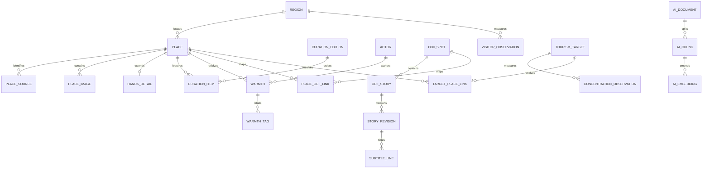
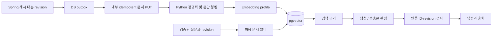

# 데이터 모델·API·RAG 설계

> 후속 정정: 실제 FE 도슨트는 `question+filters` 계약이다. [FE 감사](journey-exploration/fe-data-audit.md), [추천·관계 데이터 확장](journey-exploration/architecture-and-recommendation.md), [새 탐색 API/SSE](journey-exploration/fe-api-handoff.md)를 함께 읽는다. 선택 이야기 Q&A 제안과 현재 구현을 구분하며, durable exploration run은 기존 단일 요청의 취소 정책과 별도다.

검토용 제안. 실행 DDL과 OpenAPI는 W0/W2에서 확정한다. 이 문서는 필드/관계와 인수 기준을 제공하며 현재 배포된 스키마라고 주장하지 않는다.

## 먼저 해소할 데이터 차이

| 발견 | 근거 | 설계 조치 |
|---|---|---|
| 내부 UUID/contentId/stid 혼용 | FE canonical 계약 및 기존 스키마 가이드 | 내부 UUID, 원본 식별자 namespace 분리 |
| stlid를 한국어=1로 설명 | FE audio 계약. 저장된 API 샘플에는 여러 stlid 값 | stlid는 언어 레코드 ID로 보존, langCode와 별도 |
| “LRC 자막”과 실제 구현 차이 | FE `scriptParser.ts`: 줄 수로 전체 시간을 나눔, id는 1부터 | `timingMode=estimated/verified/none`, 실제 타임코드 여부 확인 |
| “실시간 혼잡도”와 지역 일 집계 | 방문자 API 분석 §6 | `basisDate`, `spatialLevel`, `metricType`, `observedAt` 구분 |
| TourAPI operation 1/2와 category 상충 | handoff/integration 문서 vs API 분석·FE 코드 | adapter별 명시 operation, live code fixture와 mappingVersion |
| source lat/lng 범위만으로 국내 판정 | FE는 단순 bounding box | worldwide 수치 유효성 검사와 국내 서비스 정책 분리, 경계 밖 quarantine |
| mine의 로컬 판정 | warmthRepo localStorage | 서버 인증 주체로 계산 |
| 월별 큐레이션 API는 콘텐츠 구조 미완성 | BE-REQ-003 | editorial record와 FE 응답 예제를 별도로 확정 |
| 상세/nearby 응답 표준의 필드 차이 | Village는 lat/lng, CanonicalPlace는 latitude/longitude | FE compatibility mapper, 하나로 억지 통합 안 함 |

결측을 0명·한적·전통건물 true로 바꾸지 않는다. HTTP 이미지 URL의 https 치환만으로 실제 접근을 보장할 수 없다. 허용 host와 실제 HTTPS 가용성 확인 후 사용하고, URL 유효성 실패는 placeholder로 표시한다. 외부 HTML은 sanitize한 텍스트/허용 링크로 내보낸다.

## DB 선정

**PostgreSQL + PostGIS**를 비즈니스 DB로 권고한다. 관계 제약, 근거리 쿼리, 복합 원본 키, batch upsert를 함께 처리한다. pgvector는 AI 단계의 retrieval 저장소로 추가한다. MySQL + 별도 vector store는 팀의 운영 경험 또는 기존 인프라가 강할 때 대안이다. PostgreSQL + 별도 vector DB는 vector 작업량·격리 필요가 실제로 커졌을 때 대안이다.

Supabase는 관리형 PostgreSQL/Auth 후보일 뿐 확정이 아니다. 선택해도 Spring이 비즈니스 쓰기 권한과 invariants의 진입점이다. DB 접속 경로와 role/RLS 적용 대상은 배포 설계에서 명확히 한다. 브라우저에 DB 관리 권한을 노출하지 않는다.

비즈니스 schema 예: `catalog`, `community`, `audio`, `insights`, `operations`. AI는 `ai` schema와 별도 role. migration owner, Spring runtime, AI runtime, readonly 운영 role을 분리한다. 같은 Spring 프로세스의 context간 쓰기 소유권은 코드/CI로 강제하며 DB role만으로 완전 격리했다고 주장하지 않는다.

## 관계 모델



STORY_REVISION→AI_DOCUMENTはHTTP契約の論理参照でありDB FKではない。SpringとPythonの独立 migrationを保つためである。AI結果は現在の許可revisionに一致する場合のみ採用する。

### テーブルごとの責任と制約

以下の名前・型は論理/物理設計の候補。UUID生成はサーバー、時刻は `timestamptz`、日付統計は `date`。API文字列とDB型を混同しない。

| Table | key / 主な属性 | FK・制約・cardinality |
|---|---|---|
| catalog.regions | id, display_name | id PK。原本行政コードは source namespaceごとのmapping |
| catalog.places | UUID id, region_id, name, category, address, location geography(Point,4326), overview, publication_status, version | region FK、name非空、座標欠損可。categoryと伝統判定は根拠を持つ |
| catalog.place_sources | id, place_id, provider, dataset, external_id, language, observed_at, fetched_at, payload_hash | place FK、UNIQUE(provider,dataset,external_id,language)。language未指定は空文字など単一正規値 |
| catalog.place_images | id, place_id, url, caption, position, source_ref | place FK、UNIQUE(place_id,position)、position>=0 |
| catalog.hanok_details | place_id, type, hours, parking, homepage | place_id PK/FK。既知でない情報はNULL、作り話で埋めない |
| catalog.curation_editions | id, month, locale, title, body, status | UNIQUE(month,locale)、月初日、DRAFT/PUBLISHED |
| catalog.curation_items | edition_id, place_id, position, editorial_text | 両FK、PK(edition_id,place_id)、UNIQUE(edition_id,position) |
| community.actors | UUID id, issuer, subject, status | UNIQUE(issuer,subject)。auth.usersへの固定依存を作らない |
| community.warmths | UUID id, place_id, actor_id, text, mood, score, status, created_at | 両FK RESTRICT、100 code points以内のtrim済非空、mood BUSY/QUIET、score NULLまたは1..5 |
| community.warmth_tags | warmth_id, tag | PK(warmth_id,tag)、FK、タグ数・長さはapplication制限 |
| community.idempotency_records | actor_id, operation, key, request_hash, resource_id, expires_at | UNIQUE(actor_id,operation,key)、actor FK。同じkey違う内容は409 |
| audio.odii_spots | UUID id, provider, tid, tlid, lang_code, title, location, status | UNIQUE(provider,tid,tlid)。言語が別でも上書きしない |
| audio.odii_stories | UUID id, spot_id, provider, stid, stlid, lang_code, title, audio_url, duration_seconds, status | spot FK、UNIQUE(provider,stid,stlid)、duration>=0またはNULL |
| audio.place_odii_links | place_id, spot_id, match_method, confidence, verified_at | 両FK、PK(place_id,spot_id)。名前/距離だけの推測を確定linkにしない |
| audio.story_revisions | UUID id, story_id, revision, script, content_hash, published_at, status | story FK、UNIQUE(story_id,revision)、不変な本文revision |
| audio.subtitle_lines | revision_id, position, start_seconds, text, timing_mode | PK(revision_id,position)、FK、非負時刻、順序単調はimport時検証 |
| insights.visitor_observations | provider, region_id, basis_date, visitor_type, count, fetched_at | 複合PK(provider,region_id,basis_date,visitor_type)、region FK、count>=0 |
| insights.tourism_targets | UUID id, provider, source_target_key, region_id, source_name | UNIQUE(provider,source_target_key)、region FK。原本IDがない場合は正規キーを版管理 |
| insights.target_place_links | target_id, place_id, match_method, verified_at | target PK/FK、place FK。未解決はlinkなし |
| insights.concentration_observations | target_id, basis_date, metric_type, value, fetched_at | PK(target_id,basis_date,metric_type)、target FK。原本値と変換指標を区別 |
| operations.sync_runs | id, source, dataset, status, checkpoint, lease_until, counts, error_code | RUNNING/SUCCEEDED/FAILED、完走時のみ成功watermark前進 |
| operations.outbox_events | UUID event_id, document_id, revision, event_type, payload, available_at, attempts, delivered_at | event_id PK、delivery可視化、revisionをpayload契約に含める |
| ai.documents | document_id, revision, content_hash, active, source metadata | PK(document_id,revision)、corpus契約に由来。business FKなし |
| ai.chunks | chunk_id, document_id, revision, position, text, offsets | document複合FK、UNIQUE(document_id,revision,position) |
| ai.embeddings | chunk_id, embedding_profile_id, vector | 複合PK(chunk_id,embedding_profile_id)、chunk FK。profileはモデル/次元/距離関数を固定 |

모든 FK 삭제 기본은 RESTRICT이며, 완전한 소유 자식(자막/후기 태그)만 명시적 cascade 후보로 한다. 장소 폐기 시 후기를 무조건 물리 삭제하지 않고 게시 상태를 먼저 변경한다. 개인정보 보존/삭제 정책은 W5에서 확정하고 식별자 pseudonymization과 공개 콘텐츠 처리를 구분한다.

### 정규화 검토

1NF: 반복 이미지·태그·큐레이션 항목을 행으로 분리한다. raw 외부 payload는 별도 staging JSON으로 보관할 수 있으나 canonical relation을 대체하지 않는다.

2NF: (provider,region,date,visitor_type) 전체 키에 count가 종속되고, region 이름은 region에 둔다. story language별 원본 ID를 단일 stid PK로 축소하지 않는다.

3NF: place의 region 이름/관측 count를 warmth에 복제하지 않는다. `mine`, `hasImage`, `placeName`, `lat/lng`는 read projection에서 조합한다. 좌표 정답은 geography 하나이며 별도의 수정 가능한 latitude/longitude 칼럼은 만들지 않는다.

BCNF: source natural key와 curation position 후보키의 결정 종속성을 W2에서 fixture와 함께 검토한다. 현재 문서만으로 모든 업무 종속성을 증명할 수 없다. 영속 AI chunk는 재생성 가능한 검색 표현이며 사용자 콘텐츠 정답과 분리한다. 이는 검색 기능의 표현이지 성능 근거 없는 비즈니스 반정규화가 아니다.

## 접근 패턴과 인덱스

| Query | 초기 인덱스 후보 | 검증 |
|---|---|---|
| published 한옥 region/type/page | B-tree(region_id,category,id), 필요 시 published partial | 필터 선택도/정렬/total 쿼리 각각 EXPLAIN |
| 5km 주변 장소 | GiST(location), ST_DWithin geography | 경계점 포함, 날짜변경선과 무관한 좌표축 순서 확인 |
| 공개 후기 cursor | (place_id,created_at DESC,id DESC) partial published | 동시간 id tie-breaker, 다음 page 누락/중복 없음 |
| 원본 upsert | source 복합 unique | 같은 원본 재수집 시 count 증가 없음 |
| 언어별 story 목록 | (lang_code,status,id), spot_id FK index 후보 | 충분한 fixture로 planner 선택 확인 |
| 최근 7일 방문자 | PK의 provider/region/date prefix | 조회와 중복 정정 upsert 검사 |
| outbox 재시도 | (available_at,event_id) partial undelivered | 여러 worker claim의 중복/lease 만료 검사 |
| RAG 선택 story revision | document/revision metadata B-tree + exact vector distance | 한국어 recall baseline, ANN 도입 전 비교 |

예시 query, runtime migration 아님:

```sql
SELECT id, name,
       ST_Distance(location, ST_SetSRID(ST_MakePoint(:lng, :lat),4326)::geography) AS distance_m
FROM catalog.places
WHERE publication_status = 'PUBLISHED'
  AND ST_DWithin(location, ST_SetSRID(ST_MakePoint(:lng, :lat),4326)::geography, :radius_m)
ORDER BY distance_m, id
LIMIT :limit;
```

거리 단위는 [PostGIS geography ST_DWithin](https://postgis.net/docs/ST_DWithin.html)에 따라 미터다. 사용자 radius는 기본 5000, 최대 20000을 제안하며 page size 최대 100, 주변 결과 최대 200을 계약에서 고정한다. 잘린 결과를 전체라고 표시하지 않는다.

실행 DB가 아직 없어 최적화 실측은 없다. W2에서 database-designer `schema_analyzer.py`로 DDL 관계를 점검하고, Testcontainers로 실제 DDL을 실행한다. 운영 query 최적화는 database-optimizer에 따라 EXPLAIN(ANALYZE,BUFFERS) 기준선 → index/query 수정 → 재측정 순서다. analyzer의 휴리스틱 결과는 정규화의 수학적 증명이 아니다. 처음 빈 DB에 만드는 index는 일반 CREATE INDEX, live 대형 table은 transaction 제약을 고려한 CONCURRENTLY migration을 검토한다.

schema version은 Spring Flyway 계열 migration을 제안한다. AI schema는 Python 소유 migration runner로 분리한다. 도구/버전은 W1에서 선택하고 한 schema에 두 runner가 동시에 쓰지 않는다. 이미 배포한 migration은 수정하지 않고 expand→backfill→consumer 전환→contract한다. destructive down migration으로 운영 rollback을 자동화하지 않는다.

## Public API와 FE 전환

| Endpoint | 계약 핵심 | 오류/정책 |
|---|---|---|
| GET /api/v1/hanoks | region,type,hasImage,keyword,page(1),size(20). `{data: Village[], meta}` | page>=1, size<=100, generatedAt은 응답 생성시각, sourceUpdatedAt은 별도 |
| GET /api/v1/hanoks/{id} | canonical UUID. Village 호환 필드 + 상세 | 404, 알려지지 않은 hours/parking은 null |
| GET /api/v1/hanoks/curation/monthly | month=YYYY-MM, locale. `{data:[{place, editorialText,position}],meta}` | draft 제외, API 후보 보완 필요 |
| GET /api/v1/places/nearby | lat,lng,radius,category. 기존 CanonicalPlace[] 형태 우선 | metadata/header 확장은 FE decoder 검증 후, distanceMeters는 명시 단위 |
| GET /api/v1/places/{id} | 지도 상세 CanonicalPlace | 기존 BE-REQ-004의 상세 조회 공백 보완 |
| GET /api/v1/places/{id}/warmths | cursor,limit. `{data:Warmth[],nextCursor}` | mine은 optional actor 기준, visitorCount는 지역 통계로 분리 |
| POST /api/v1/places/{id}/warmths | `{text,mood,score?,tags?}`, Idempotency-Key | 201 + Location. Unicode code points 100, tags<=5 각20 초안 |
| GET /api/v1/map/congestion/heatmap | bbox,date,metricType,region. `{data,meta}` | 각 항목 basisDate/spatialLevel/source/status. 결측 score는 null |
| GET /api/v1/odii/stories | language,category,placeId?,cursor,limit | 원본 tid/tlid/stid/stlid 보존 + canonical storyId/revision |
| POST /api/v1/odii/ask | storyId,language,question. Accept JSON/SSE | FE title/scriptContext는 무시·deprecated, 서버가 revision 결정 |

v1의 공통 오류 후보는 `{code,message,requestId,details?}`다. stack trace와 upstream credential은 제외한다. auth required 401, forbidden 403, absent 404, conflict 409, rate limit 429, dependency 503/504를 구분한다. 검색 결과 없음은 200 빈 결과다. upstream 장애와 빈 데이터가 같은 의미가 되지 않게 한다.

FE `/api/tourapi`의 `{villages,meta}`와 새 `{data,meta}`는 동일하지 않다. 기존 BFF에 compatibility mapper를 두고 feature flag로 전환한다. `Village.id`에 canonical UUID를 내려주려면 그 목록으로 열리는 상세 요청도 같은 배포에서 바꾼다. 기존 TourAPI ID는 명시적 legacy resolver에서만 변환하며 ambiguous한 UUID/contentId 추정을 모든 endpoint에 넣지 않는다.

Odii의 `stid`는 유지하되 Ask에는 `storyId`를 사용한다. locale 하나로 여러 `stlid`를 잘못 합치지 않는다. 자막 legacy id는 FE 현재 구현(1-based)을 호환시키고 새 sequence는 계약에서 일관되게 정의한다. 정확한 강제 정렬/forced alignment 기능은 별도 요구가 될 때 구현한다.

온기 `mood`는 FE 북적/한적을 wire에서 유지하고 core BUSY/QUIET로 mapping한다. `text` 길이는 Java UTF-16 length와 브라우저 length가 다를 수 있으므로 code-point 기준을 양쪽 fixture로 검증한다. 기존 localStorage 후기는 서버 actor 소유 증거가 아니므로 자동 업로드하지 않는다.

## 수집과 게시 파이프라인

1. source/dataset/operation별 실행 lease를 획득하고 run ID를 만든다.
2. HTTP 호출은 DB transaction 밖에서 한다. connect 1s, 전체 5s, retry 2회 이내 예산 초안을 사용한다. 429는 Retry-After/쿼터 reset을 존중한다.
3. HTTP 200이어도 원본 header 오류를 검사한다. item object/list/null을 정상화한다. service key 중복 인코딩을 막고 URL query를 로그에서 지운다.
4. provider,dataset,external_id,language로 중복 방지한다. category/좌표/숫자/날짜를 검증하고 실패 row는 quarantine한다.
5. 한 page씩 짧은 transaction으로 stage/upsert한다. 부분 실패는 완료 watermark를 전진시키지 않는다. 마지막 정상 공개 snapshot은 유지한다.
6. full sync에서 “못 본 항목”은 전체 pagination이 성공한 뒤에만 삭제 후보로 본다. sync D는 tombstone으로 기록하고 조회 제외한다.
7. 명시적 source 수정일을 비교해 오래된 재시도가 최신 데이터를 덮어쓰지 않게 한다. page 단위 checkpoint와 재수집 겹침 window로 누락을 방지한다.
8. 대본 게시/삭제에서 outbox를 쓰고 AI revision 색인을 재시도한다. catalog만 출시하는 시점에는 AI outbox를 먼저 만들지 않는다.

TourAPI/Odii/DataLab은 하나의 generic DTO로 통합하지 않는다. 국문 정보는 장소, Odii는 언어별 이야기, DataLab은 관측치라는 다른 source model이다. 이름이 같은 장소를 자동 병합하지 않고 주소·좌표·공식 키와 검토 상태를 남긴다. 행안부 TM 좌표는 공급자 CRS 확인 후 변환하며 임의 EPSG 추정으로 적재하지 않는다.

## RAG 파이프라인

첫 대상은 **선택한 오디 이야기의 검증된 대본**이다. 전체 웹 검색이나 모든 관광 데이터 ingestion은 초기 요구가 아니다. 짧은 대본은 통째로 context로 사용하는 baseline과 chunk retrieval을 비교한다.



`PUT /internal/v1/documents/{documentId}/revisions/{revision}`는 contentHash/문서/언어/출처와 operation ID를 받는다. 동일 revision+hash는 no-op, 동일 revision+다른 hash는409. 최신 활성 revision pointer는 더 큰 revision으로만 전진한다. 삭제는 더 높은 tombstone revision으로 보내 늦게 도착한 update를 차단한다.

Spring이 질문 시 전달한 revision이 indexed 상태가 아니면 Python은 이전 version을 조용히 검색하지 않는다. `CONTEXT_NOT_INDEXED`를 반환한다. Spring은 검증한 전체 짧은 대본 기반 fallback을 명시적으로 지원하거나 일시 준비 중 응답을 보낸다. 첫 구현은 준비 중 응답을 제안하여 복잡성을 줄인다.

문단/문장 경계 기반 300~600 token, overlap 50~100을 실험 시작점으로 한다. 한국어 토크나이저와 대본 길이에 따라 조정한다. chunk는 문서 ID·revision·본문 offset·source URL을 가진다. 임베딩 profile은 provider/model/dimension/distance/normalization/chunkerVersion을 고정하며 서로 다른 profile의 벡터를 직접 비교하지 않는다. 모델 변경은 shadow index→eval→active pointer 전환으로 수행한다.

초기 검색은 story/revision metadata filter + exact vector similarity다. 고유명사 검색은 한국어 fixture에 대한 keyword baseline과 비교한다. PostgreSQL 기본 FTS를 한국어 BM25라고 부르지 않는다. hybrid/reranker는 평가상 개선이 확인될 때 추가한다. [pgvector](https://github.com/pgvector/pgvector)의 ANN에서는 필터 후 결과 부족과 recall 저하를 점검해야 하므로 HNSW를 무조건 켜지 않는다.

LLM 입력은 시스템 지시와 source text를 분리한다. source text의 “이전 지시 무시”는 데이터로 취급한다. 외부 URL 자유 fetch/임의 SQL/tool execution은 제공하지 않는다. snippet·토큰·동시성·출력 길이를 제한한다. citation은 현재 허용된 chunk 집합에 포함되는지 서버에서 검증하며, reference가 존재한다는 것만으로 답변의 모든 주장이 사실이라고 인증하지 않는다.

| 평가 | 초기 출시 기준 제안 |
|---|---|
| 데이터셋 | 한국어 50문항 이상, 답 가능/없음/장소 혼동/언어/삭제 revision/adversarial 포함. 개발용/held-out 분리 |
| retrieval | 답 가능 문항 evidence recall@5 >=0.85 목표 |
| citation | 형식과 허용 revision 일치 100%, 사람의 근거 지원 판정 >=0.90 목표 |
| abstention | 근거 없음 문항 적절한 거절 >=0.90 목표 |
| hallucination | unsupported claim rate를 사람이 표본 평가, 기준선 대비 회귀 금지 |
| 비용 | request별 tokens/추정비용 기록, per-actor 및 일일 총액 한도. 예산 미정이면 production LLM gate 유지 |
| 장애 | provider timeout·429·취소·부분 stream에서 핵심 조회 정상, 자동 생성 retry 없음 |

FastAPI API와 retrieval 함수는 분리하고 lifespan에서 HTTP pool을 만들고 종료한다. embedding의 CPU 작업을 async route에서 직접 장시간 실행하지 않는다. 초기에는 별도 제한된 worker task/process를 같은 Python 코드 패키지에서 실행한다. 프로세스 종료 시 사라지는 BackgroundTasks만으로 durable ingestion을 보장하지 않는다. 입력 job 상태/재시도는 DB와 outbox 계약으로 복원 가능하게 한다.

## 보안·운영 경계

Spring이 actor를 검증하고 내부 AI는 service credential과 private ingress로 제한한다. browser가 만든 actor ID/권한/corpus filter를 신뢰하지 않는다. cookie session 선택 시 CSRF와 SameSite 정책을, bearer 선택 시 issuer/audience/expiry/key rotation을 계약에 명시한다. 위치는 장소 검색에 필요한 일회 요청값을 기본으로 하며 개인 이동 이력을 자동 축적하지 않는다.

Secret은 환경/secret store에만 둔다. `.gitignore`는 저장 방지 보조이며 runtime 접근 제어가 아니다. Python에는 LLM 키, Spring에는 공공 API/DB 자격을 필요한 만큼만 준다. health는 DB readiness와 process liveness를 분리하며, AI 장애만으로 Spring liveness를 실패시키지 않는다. Redis 도입 시 실패가 영속 원본 손실로 이어지지 않게 한다.

관측 항목은 source 마지막 성공/실패/격리 row 수, API p95/error, DB pool wait, outbox oldest age, AI inflight/time-to-first-event/token, backup 성공/복구 시간이다. 경고 threshold는 초기 환경 측정 후 정한다. 공개 콘텐츠와 사용자 후기 보존, 공급자 재사용 조건은 실제 source 선정 단계에서 확인한다.
