# Backend GitHub Issue 발행 목록

이 문서는 GitHub 생성 직전 검토 목록이다. 실제 번호는 생성 후 ID 옆에 기록한다.

## 규모와 우선순위

- Mega Root 1개
- Track control issue 8개
- 구현 Leaf 80개
- 총 GitHub Issue 89개

- P0: 27개
- P1: 25개
- P2: 25개
- P3: 3개

## Track별 목록

### Track A — 기반·계약·개발환경

| ID | Priority | Wave | 제목 | blocked-by |
|---|---:|---:|---|---|
| F01 | P0 | 0 | Java 21·Spring Boot·Gradle Wrapper 멀티모듈 골격 구축 | 없음 |
| F02 | P0 | 1 | Spring 모듈 port·adapter 경계와 ArchUnit 규칙 구현 | F01 |
| F03 | P0 | 0 | FastAPI Python 서비스 실행·테스트 골격 구축 | 없음 |
| F04 | P0 | 0 | PostgreSQL·PostGIS 로컬 통합 테스트 환경 구축 | 없음 |
| F05 | P0 | 1 | OpenAPI·JSON Schema·DBML 검증 CI 구축 | F01, F03 |
| F06 | P0 | 1 | Spring 공통 오류·cursor·멱등 command web 기반 구현 | F01 |
| F07 | P0 | 0 | Backend 설계 입력 snapshot·provenance manifest 고정 | 없음 |
| F08 | P0 | 3 | 공개 API rate-limit·IP/member admission 기반 구현 | F06, D07 |
| F09 | P0 | 1 | 인증·회원·SavedResource OpenAPI·fixture 동결 | F07 |

### Track B — 데이터베이스·관광공사 수집

| ID | Priority | Wave | 제목 | blocked-by |
|---|---:|---:|---|---|
| D01 | P0 | 1 | Flyway migration 소유권·버전·baseline 체계 구현 | F01, F04 |
| D02 | P0 | 2 | Catalog canonical place·source·revision schema 구현 | D01 |
| D03 | P0 | 2 | Member·OAuth identity·session·guest grant schema 구현 | D01 |
| D04 | P1 | 2 | Exploration·run·saved journey·saved resource schema 구현 | D01 |
| D05 | P1 | 2 | VisitReview·like·report·moderation schema 구현 | D01 |
| D06 | P1 | 2 | Odii spot·story·language·transcript revision schema 구현 | D01 |
| D07 | P0 | 2 | Sync run·lease·checkpoint·quarantine·outbox schema 구현 | D01 |
| D08 | P0 | 4 | 전체 migration·동시성·rollback 계약 테스트 완성 | D02, D03, D04, D05, D06, D07, D09 |
| D09 | P0 | 3 | Insights 관측·target link 실행 migration 구현 | D01, D02 |
| P01 | P0 | 0 | 관광공사 API 실제 응답·quota·license qualification | 없음 |
| P02 | P0 | 1 | TourAPI HTTP client·envelope parser 구현 | F01, P01 |
| P03 | P0 | 3 | 03:00 KST sync scheduler·lease·checkpoint 구현 | D02, D07, P02 |
| P04 | P0 | 3 | Source validation·category mapping·quarantine 구현 | D02, D07, P02 |
| P05 | P0 | 4 | Dataset revision 원자 게시·watermark·tombstone 구현 | P03, P04 |
| P06 | P2 | 4 | 관광 관측 DataLab 실제 계약·adapter 구현 | F01, D02, D07, D09, P07 |
| P07 | P1 | 3 | 행정구역 경계 source qualification·revision import 구현 | D02, D07, F07 |

### Track C — 한옥·장소 공개 API

| ID | Priority | Wave | 제목 | blocked-by |
|---|---:|---:|---|---|
| C01 | P0 | 0 | R1 한옥·장소·찜 OpenAPI와 fixture 동결 | 없음 |
| C02 | P1 | 5 | 한옥 목록 검색·필터·cursor API 구현 | P05, C01, F06 |
| C03 | P1 | 5 | Canonical place·한옥 상세 API 구현 | P05, C01, F06 |
| C04 | P1 | 3 | 월별 한옥 editorial edition·placement API 구현 | D02, C01, F06 |
| C05 | P1 | 5 | 주변·지도 canonical 장소 조회 API 구현 | P05, C01, F06 |
| C06 | P1 | 7 | R1 serializer·OpenAPI·LKG 통합 게이트 | C02, C03, C04, I05, F05 |

### Track D — 인증·개인 저장

| ID | Priority | Wave | 제목 | blocked-by |
|---|---:|---:|---|---|
| I01 | P0 | 4 | Kakao OAuth state·callback·opaque session 구현 | D03, F06, O03, F08, F09 |
| I02 | P0 | 5 | Guest grant·exploration 소유권 승계 구현 | I01, D04 |
| I03 | P0 | 3 | CSRF·cookie·인가·private cache 보안 경계 구현 | F06, D03, O03 |
| I04 | P1 | 5 | 회원 조회·logout·탈퇴·보존 lifecycle 구현 | I01, I03, D04, F09 |
| I05 | P1 | 6 | Canonical 관광 장소 찜 PUT·DELETE 구현 | D04, C03, I01, I03, F09 |
| I06 | P1 | 7 | Odii story 저장과 saved-resource 목록 구현 | D04, A03, I01, I03, F09 |
| I07 | P1 | 11 | 내 월간 활동 타임라인 read model 구현 | I05, I06, J08, M03, F09 |

### Track E — 후기·지도·Odii

| ID | Priority | Wave | 제목 | blocked-by |
|---|---:|---:|---|---|
| M01 | P1 | 5 | 행정구역 resolve·VisitReview 지역 집계 API 구현 | D02, D05, P05, F06, P07, M06 |
| M02 | P1 | 6 | VisitReview ALL·REGION·place 목록과 cursor 구현 | D05, C03, F06 |
| M03 | P1 | 7 | VisitReview 작성·본인 삭제·멱등성 구현 | M02, I03, F08 |
| M04 | P1 | 8 | VisitReview 좋아요 desired-state API 구현 | M03 |
| M05 | P1 | 8 | VisitReview 신고·moderation audit·운영 명령 구현 | M03, I03, F08 |
| M06 | P1 | 1 | 지도·Odii·관광 관측 R2 OpenAPI·fixture 동결 | F07, C01 |
| M07 | P1 | 5 | 방문자·관광지 집중률 공개 조회 API 구현 | D09, P06, M06, F06 |
| M08 | P1 | 9 | 보호된 moderation queue·operator drill·runbook 구현 | M05, O02 |
| M09 | P1 | 10 | R2 지도·후기·Odii·찜 통합 계약 E2E 게이트 | M01, M04, M07, M08, A03, A04, I05, I06, F05 |
| A01 | P0 | 0 | Odii API 실제 응답·언어·음원 license qualification | 없음 |
| A02 | P1 | 5 | Odii 수집·revision·tombstone publish 구현 | A01, D06, D07, P03, P05 |
| A03 | P1 | 6 | Odii story·음원·대본 공개 API 구현 | A02, F06, M06 |
| A04 | P1 | 6 | Odii–canonical place 검수 연결과 projection 구현 | A02, C03 |

### Track F — FastAPI AI 서버

| ID | Priority | Wave | 제목 | blocked-by |
|---|---:|---:|---|---|
| AI01 | P0 | 2 | Spring↔FastAPI 내부 계약과 서비스 인증 구현 | F01, F03, O03 |
| AI02 | P2 | 3 | FastAPI intake normalization·privacy·safety guardrail 구현 | AI01 |
| AI03 | P2 | 5 | 검증 데이터 deterministic baseline 검색·ranking 구현 | F03, P05, AI01 |
| AI04 | P2 | 4 | Gemini provider adapter·timeout·usage 계측 구현 | AI02, AI01 |
| AI05 | P2 | 6 | AI proposal schema·evidence allowlist validator 구현 | AI03, AI04 |
| AI06 | P2 | 7 | AI 품질·안전·비용·latency 평가 harness 구축 | AI05 |
| AI07 | P3 | 6 | Revision-pinned corpus export·manifest sync 구현 | AI01, P05, A02 |
| AI08 | P3 | 7 | FastAPI private corpus embedding·retrieval 구현 | AI07 |
| AI09 | P3 | 8 | Optional RAG 비교 평가·activation gate 구현 | AI06, AI08 |

### Track G — 여정 실행

| ID | Priority | Wave | 제목 | blocked-by |
|---|---:|---:|---|---|
| J01 | P2 | 6 | Exploration 생성·조회·turn intake와 소유권 구현 | D04, I02, I03, F06, F08, J11 |
| J02 | P2 | 7 | Durable run 상태 머신·command idempotency 구현 | J01 |
| J03 | P2 | 8 | Spring journey worker·FastAPI baseline orchestration 구현 | J02, AI03, AI05 |
| J04 | P2 | 8 | Exploration·run snapshot DTO와 복구 조회 구현 | J02, C03 |
| J05 | P2 | 8 | SSE stage·terminal·heartbeat·replay/reset 구현 | J02, I03 |
| J06 | P2 | 9 | PIN·EXCLUDE·proposal action과 stateVersion 구현 | J03, J04, J11 |
| J07 | P2 | 9 | Run cancel·20초 deadline·sweeper 구현 | J03, J05 |
| J08 | P2 | 10 | Saved journey 생성·목록·상세·재개·삭제 구현 | J06, I01, I03, J11 |
| J09 | P2 | 8 | Guest·member AI 일일 quota와 admission 구현 | J02, I01 |
| J10 | P2 | 11 | Journey REST·SSE·FastAPI 전체 계약 E2E 게이트 | J05, J06, J07, J08, J09, AI06, F05 |
| J11 | P2 | 2 | Journey actions·SavedJourney OpenAPI·fixture 완성 | F07, F09 |

### Track H — 운영·출시

| ID | Priority | Wave | 제목 | blocked-by |
|---|---:|---:|---|---|
| O01 | P2 | 1 | Spring·FastAPI 구조화 로그와 OpenTelemetry 계측 구현 | F01, F03 |
| O02 | P2 | 2 | Grafana Cloud dashboard·alert·resolve 통지 구성 | O01 |
| O03 | P0 | 1 | Server-only secret loading·rotation·redaction 정책 구현 | F01, F03 |
| O04 | P2 | 5 | PostgreSQL backup·PITR·restore drill 자동화 | D08, O03 |
| O05 | P2 | 12 | API·DB·SSE 부하·성능 예산 검증 | C06, M01, M02, J10 |
| O06 | P2 | 12 | TourAPI·Odii·FastAPI·SSE 장애 복구 리허설 | P05, A03, J10, O01 |
| O07 | P2 | 2 | Spring·FastAPI container·staging·release/rollback pipeline 구현 | F05, O03 |
| O08 | P2 | 10 | TTL·revision GC·회원 탈퇴 cleanup·복원 삭제 ledger 구현 | I04, J07, D08, P05 |
| O09 | P2 | 13 | Backend 전체 staging release gate와 운영 인수 완료 | C06, I07, M09, J10, O02, O04, O05, O06, O07, O08 |

## Execution Waves

- Wave 0: F01, F03, F04, F07, P01, C01, A01
- Wave 1: F02, F05, F06, F09, D01, P02, M06, O01, O03
- Wave 2: D02, D03, D04, D05, D06, D07, AI01, J11, O02, O07
- Wave 3: F08, D09, P03, P04, P07, C04, I03, AI02
- Wave 4: D08, P05, P06, I01, AI04
- Wave 5: C02, C03, C05, I02, I04, M01, M07, A02, AI03, O04
- Wave 6: I05, M02, A03, A04, AI05, AI07, J01
- Wave 7: C06, I06, M03, AI06, AI08, J02
- Wave 8: M04, M05, AI09, J03, J04, J05, J09
- Wave 9: M08, J06, J07
- Wave 10: M09, J08, O08
- Wave 11: I07, J10
- Wave 12: O05, O06
- Wave 13: O09

## Dependency Graph

```mermaid
flowchart LR
  subgraph Wave0
    F01["F01: Java 21·Spring Boot·Gradle Wrapper 멀티모듈 골격 구축"]
    F03["F03: FastAPI Python 서비스 실행·테스트 골격 구축"]
    F04["F04: PostgreSQL·PostGIS 로컬 통합 테스트 환경 구축"]
    F07["F07: Backend 설계 입력 snapshot·provenance manifest 고정"]
    P01["P01: 관광공사 API 실제 응답·quota·license qualification"]
    C01["C01: R1 한옥·장소·찜 OpenAPI와 fixture 동결"]
    A01["A01: Odii API 실제 응답·언어·음원 license qualification"]
  end
  subgraph Wave1
    F02["F02: Spring 모듈 port·adapter 경계와 ArchUnit 규칙 구현"]
    F05["F05: OpenAPI·JSON Schema·DBML 검증 CI 구축"]
    F06["F06: Spring 공통 오류·cursor·멱등 command web 기반 구현"]
    F09["F09: 인증·회원·SavedResource OpenAPI·fixture 동결"]
    D01["D01: Flyway migration 소유권·버전·baseline 체계 구현"]
    P02["P02: TourAPI HTTP client·envelope parser 구현"]
    M06["M06: 지도·Odii·관광 관측 R2 OpenAPI·fixture 동결"]
    O01["O01: Spring·FastAPI 구조화 로그와 OpenTelemetry 계측 구현"]
    O03["O03: Server-only secret loading·rotation·redaction 정책 구현"]
  end
  subgraph Wave2
    D02["D02: Catalog canonical place·source·revision schema 구현"]
    D03["D03: Member·OAuth identity·session·guest grant schema 구현"]
    D04["D04: Exploration·run·saved journey·saved resource schema 구현"]
    D05["D05: VisitReview·like·report·moderation schema 구현"]
    D06["D06: Odii spot·story·language·transcript revision schema 구현"]
    D07["D07: Sync run·lease·checkpoint·quarantine·outbox schema 구현"]
    AI01["AI01: Spring↔FastAPI 내부 계약과 서비스 인증 구현"]
    J11["J11: Journey actions·SavedJourney OpenAPI·fixture 완성"]
    O02["O02: Grafana Cloud dashboard·alert·resolve 통지 구성"]
    O07["O07: Spring·FastAPI container·staging·release/rollback pipeline 구현"]
  end
  subgraph Wave3
    F08["F08: 공개 API rate-limit·IP/member admission 기반 구현"]
    D09["D09: Insights 관측·target link 실행 migration 구현"]
    P03["P03: 03:00 KST sync scheduler·lease·checkpoint 구현"]
    P04["P04: Source validation·category mapping·quarantine 구현"]
    P07["P07: 행정구역 경계 source qualification·revision import 구현"]
    C04["C04: 월별 한옥 editorial edition·placement API 구현"]
    I03["I03: CSRF·cookie·인가·private cache 보안 경계 구현"]
    AI02["AI02: FastAPI intake normalization·privacy·safety guardrail 구현"]
  end
  subgraph Wave4
    D08["D08: 전체 migration·동시성·rollback 계약 테스트 완성"]
    P05["P05: Dataset revision 원자 게시·watermark·tombstone 구현"]
    P06["P06: 관광 관측 DataLab 실제 계약·adapter 구현"]
    I01["I01: Kakao OAuth state·callback·opaque session 구현"]
    AI04["AI04: Gemini provider adapter·timeout·usage 계측 구현"]
  end
  subgraph Wave5
    C02["C02: 한옥 목록 검색·필터·cursor API 구현"]
    C03["C03: Canonical place·한옥 상세 API 구현"]
    C05["C05: 주변·지도 canonical 장소 조회 API 구현"]
    I02["I02: Guest grant·exploration 소유권 승계 구현"]
    I04["I04: 회원 조회·logout·탈퇴·보존 lifecycle 구현"]
    M01["M01: 행정구역 resolve·VisitReview 지역 집계 API 구현"]
    M07["M07: 방문자·관광지 집중률 공개 조회 API 구현"]
    A02["A02: Odii 수집·revision·tombstone publish 구현"]
    AI03["AI03: 검증 데이터 deterministic baseline 검색·ranking 구현"]
    O04["O04: PostgreSQL backup·PITR·restore drill 자동화"]
  end
  subgraph Wave6
    I05["I05: Canonical 관광 장소 찜 PUT·DELETE 구현"]
    M02["M02: VisitReview ALL·REGION·place 목록과 cursor 구현"]
    A03["A03: Odii story·음원·대본 공개 API 구현"]
    A04["A04: Odii–canonical place 검수 연결과 projection 구현"]
    AI05["AI05: AI proposal schema·evidence allowlist validator 구현"]
    AI07["AI07: Revision-pinned corpus export·manifest sync 구현"]
    J01["J01: Exploration 생성·조회·turn intake와 소유권 구현"]
  end
  subgraph Wave7
    C06["C06: R1 serializer·OpenAPI·LKG 통합 게이트"]
    I06["I06: Odii story 저장과 saved-resource 목록 구현"]
    M03["M03: VisitReview 작성·본인 삭제·멱등성 구현"]
    AI06["AI06: AI 품질·안전·비용·latency 평가 harness 구축"]
    AI08["AI08: FastAPI private corpus embedding·retrieval 구현"]
    J02["J02: Durable run 상태 머신·command idempotency 구현"]
  end
  subgraph Wave8
    M04["M04: VisitReview 좋아요 desired-state API 구현"]
    M05["M05: VisitReview 신고·moderation audit·운영 명령 구현"]
    AI09["AI09: Optional RAG 비교 평가·activation gate 구현"]
    J03["J03: Spring journey worker·FastAPI baseline orchestration 구현"]
    J04["J04: Exploration·run snapshot DTO와 복구 조회 구현"]
    J05["J05: SSE stage·terminal·heartbeat·replay/reset 구현"]
    J09["J09: Guest·member AI 일일 quota와 admission 구현"]
  end
  subgraph Wave9
    M08["M08: 보호된 moderation queue·operator drill·runbook 구현"]
    J06["J06: PIN·EXCLUDE·proposal action과 stateVersion 구현"]
    J07["J07: Run cancel·20초 deadline·sweeper 구현"]
  end
  subgraph Wave10
    M09["M09: R2 지도·후기·Odii·찜 통합 계약 E2E 게이트"]
    J08["J08: Saved journey 생성·목록·상세·재개·삭제 구현"]
    O08["O08: TTL·revision GC·회원 탈퇴 cleanup·복원 삭제 ledger 구현"]
  end
  subgraph Wave11
    I07["I07: 내 월간 활동 타임라인 read model 구현"]
    J10["J10: Journey REST·SSE·FastAPI 전체 계약 E2E 게이트"]
  end
  subgraph Wave12
    O05["O05: API·DB·SSE 부하·성능 예산 검증"]
    O06["O06: TourAPI·Odii·FastAPI·SSE 장애 복구 리허설"]
  end
  subgraph Wave13
    O09["O09: Backend 전체 staging release gate와 운영 인수 완료"]
  end
  F01 --> F02
  F01 --> F05
  F03 --> F05
  F01 --> F06
  F06 --> F08
  D07 --> F08
  F07 --> F09
  F01 --> D01
  F04 --> D01
  D01 --> D02
  D01 --> D03
  D01 --> D04
  D01 --> D05
  D01 --> D06
  D01 --> D07
  D02 --> D08
  D03 --> D08
  D04 --> D08
  D05 --> D08
  D06 --> D08
  D07 --> D08
  D09 --> D08
  D01 --> D09
  D02 --> D09
  F01 --> P02
  P01 --> P02
  D02 --> P03
  D07 --> P03
  P02 --> P03
  D02 --> P04
  D07 --> P04
  P02 --> P04
  P03 --> P05
  P04 --> P05
  F01 --> P06
  D02 --> P06
  D07 --> P06
  D09 --> P06
  P07 --> P06
  D02 --> P07
  D07 --> P07
  F07 --> P07
  P05 --> C02
  C01 --> C02
  F06 --> C02
  P05 --> C03
  C01 --> C03
  F06 --> C03
  D02 --> C04
  C01 --> C04
  F06 --> C04
  P05 --> C05
  C01 --> C05
  F06 --> C05
  C02 --> C06
  C03 --> C06
  C04 --> C06
  I05 --> C06
  F05 --> C06
  D03 --> I01
  F06 --> I01
  O03 --> I01
  F08 --> I01
  F09 --> I01
  I01 --> I02
  D04 --> I02
  F06 --> I03
  D03 --> I03
  O03 --> I03
  I01 --> I04
  I03 --> I04
  D04 --> I04
  F09 --> I04
  D04 --> I05
  C03 --> I05
  I01 --> I05
  I03 --> I05
  F09 --> I05
  D04 --> I06
  A03 --> I06
  I01 --> I06
  I03 --> I06
  F09 --> I06
  I05 --> I07
  I06 --> I07
  J08 --> I07
  M03 --> I07
  F09 --> I07
  D02 --> M01
  D05 --> M01
  P05 --> M01
  F06 --> M01
  P07 --> M01
  M06 --> M01
  D05 --> M02
  C03 --> M02
  F06 --> M02
  M02 --> M03
  I03 --> M03
  F08 --> M03
  M03 --> M04
  M03 --> M05
  I03 --> M05
  F08 --> M05
  F07 --> M06
  C01 --> M06
  D09 --> M07
  P06 --> M07
  M06 --> M07
  F06 --> M07
  M05 --> M08
  O02 --> M08
  M01 --> M09
  M04 --> M09
  M07 --> M09
  M08 --> M09
  A03 --> M09
  A04 --> M09
  I05 --> M09
  I06 --> M09
  F05 --> M09
  A01 --> A02
  D06 --> A02
  D07 --> A02
  P03 --> A02
  P05 --> A02
  A02 --> A03
  F06 --> A03
  M06 --> A03
  A02 --> A04
  C03 --> A04
  F01 --> AI01
  F03 --> AI01
  O03 --> AI01
  AI01 --> AI02
  F03 --> AI03
  P05 --> AI03
  AI01 --> AI03
  AI02 --> AI04
  AI01 --> AI04
  AI03 --> AI05
  AI04 --> AI05
  AI05 --> AI06
  AI01 --> AI07
  P05 --> AI07
  A02 --> AI07
  AI07 --> AI08
  AI06 --> AI09
  AI08 --> AI09
  D04 --> J01
  I02 --> J01
  I03 --> J01
  F06 --> J01
  F08 --> J01
  J11 --> J01
  J01 --> J02
  J02 --> J03
  AI03 --> J03
  AI05 --> J03
  J02 --> J04
  C03 --> J04
  J02 --> J05
  I03 --> J05
  J03 --> J06
  J04 --> J06
  J11 --> J06
  J03 --> J07
  J05 --> J07
  J06 --> J08
  I01 --> J08
  I03 --> J08
  J11 --> J08
  J02 --> J09
  I01 --> J09
  J05 --> J10
  J06 --> J10
  J07 --> J10
  J08 --> J10
  J09 --> J10
  AI06 --> J10
  F05 --> J10
  F07 --> J11
  F09 --> J11
  F01 --> O01
  F03 --> O01
  O01 --> O02
  F01 --> O03
  F03 --> O03
  D08 --> O04
  O03 --> O04
  C06 --> O05
  M01 --> O05
  M02 --> O05
  J10 --> O05
  P05 --> O06
  A03 --> O06
  J10 --> O06
  O01 --> O06
  F05 --> O07
  O03 --> O07
  I04 --> O08
  J07 --> O08
  D08 --> O08
  P05 --> O08
  C06 --> O09
  I07 --> O09
  M09 --> O09
  J10 --> O09
  O02 --> O09
  O04 --> O09
  O05 --> O09
  O06 --> O09
  O07 --> O09
  O08 --> O09
```

