# Backend GitHub Issue 본문 초안

GitHub 번호 발급 전에는 안정 ID를 사용한다. 생성 후 ID를 실제 `#번호`로 치환한다.

## Mega Root

### Goal

문서로 확정한 Spring Boot business API와 FastAPI AI를 검증 가능한 단계로 구축한다.

### Scope

Spring/FastAPI 기반, PostgreSQL/PostGIS, 관광공사 수집, 한옥·지도·후기·Odii·인증·찜·여정, 관측·복구·출시.

### Out of Scope

FE 컴포넌트, 예약·결제·소셜 관계·체크인·정-길·비밀번호 로그인·관리자 UI·웹 검색·개인화.

### Success Criteria

- [ ] BE-REQ-001~010의 leaf 추적과 독립 검증
- [ ] 외부 API·AI 장애 중 LKG/baseline 핵심 경로 유지
- [ ] migration·동시성·contract·restore·release gate 통과

### Child Tracks

- [ ] TA: Track A — 기반·계약·개발환경
- [ ] TB: Track B — 데이터베이스·관광공사 수집
- [ ] TC: Track C — 한옥·장소 공개 API
- [ ] TD: Track D — 인증·개인 저장
- [ ] TE: Track E — 후기·지도·Odii
- [ ] TF: Track F — FastAPI AI 서버
- [ ] TG: Track G — 여정 실행
- [ ] TH: Track H — 운영·출시

### Dependency Graph

```mermaid
flowchart LR
  subgraph Wave0
    F01["F01: Java 21·Spring Boot·Gradle Wrapper 멀티모듈 골격 구축"]
    F03["F03: FastAPI Python 서비스 실행·테스트 골격 구축"]
    F04["F04: PostgreSQL·PostGIS 로컬 통합 테스트 환경 구축"]
    F07["F07: Backend 설계 입력 snapshot·provenance manifest 고정"]
    P01["P01: 관광공사 API 실제 응답·quota·license qualification"]
    C01["C01: R1 한옥·장소·찜 OpenAPI와 fixture 동결"]
    A01["A01: Odii API 실제 응답·언어·음원 license qualification"]
  end
  subgraph Wave1
    F02["F02: Spring 모듈 port·adapter 경계와 ArchUnit 규칙 구현"]
    F05["F05: OpenAPI·JSON Schema·DBML 검증 CI 구축"]
    F06["F06: Spring 공통 오류·cursor·멱등 command web 기반 구현"]
    F09["F09: 인증·회원·SavedResource OpenAPI·fixture 동결"]
    D01["D01: Flyway migration 소유권·버전·baseline 체계 구현"]
    P02["P02: TourAPI HTTP client·envelope parser 구현"]
    M06["M06: 지도·Odii·관광 관측 R2 OpenAPI·fixture 동결"]
    O01["O01: Spring·FastAPI 구조화 로그와 OpenTelemetry 계측 구현"]
    O03["O03: Server-only secret loading·rotation·redaction 정책 구현"]
  end
  subgraph Wave2
    D02["D02: Catalog canonical place·source·revision schema 구현"]
    D03["D03: Member·OAuth identity·session·guest grant schema 구현"]
    D04["D04: Exploration·run·saved journey·saved resource schema 구현"]
    D05["D05: VisitReview·like·report·moderation schema 구현"]
    D06["D06: Odii spot·story·language·transcript revision schema 구현"]
    D07["D07: Sync run·lease·checkpoint·quarantine·outbox schema 구현"]
    AI01["AI01: Spring↔FastAPI 내부 계약과 서비스 인증 구현"]
    J11["J11: Journey actions·SavedJourney OpenAPI·fixture 완성"]
    O02["O02: Grafana Cloud dashboard·alert·resolve 통지 구성"]
    O07["O07: Spring·FastAPI container·staging·release/rollback pipeline 구현"]
  end
  subgraph Wave3
    F08["F08: 공개 API rate-limit·IP/member admission 기반 구현"]
    D09["D09: Insights 관측·target link 실행 migration 구현"]
    P03["P03: 03:00 KST sync scheduler·lease·checkpoint 구현"]
    P04["P04: Source validation·category mapping·quarantine 구현"]
    P07["P07: 행정구역 경계 source qualification·revision import 구현"]
    C04["C04: 월별 한옥 editorial edition·placement API 구현"]
    I03["I03: CSRF·cookie·인가·private cache 보안 경계 구현"]
    AI02["AI02: FastAPI intake normalization·privacy·safety guardrail 구현"]
  end
  subgraph Wave4
    D08["D08: 전체 migration·동시성·rollback 계약 테스트 완성"]
    P05["P05: Dataset revision 원자 게시·watermark·tombstone 구현"]
    P06["P06: 관광 관측 DataLab 실제 계약·adapter 구현"]
    I01["I01: Kakao OAuth state·callback·opaque session 구현"]
    AI04["AI04: Gemini provider adapter·timeout·usage 계측 구현"]
  end
  subgraph Wave5
    C02["C02: 한옥 목록 검색·필터·cursor API 구현"]
    C03["C03: Canonical place·한옥 상세 API 구현"]
    C05["C05: 주변·지도 canonical 장소 조회 API 구현"]
    I02["I02: Guest grant·exploration 소유권 승계 구현"]
    I04["I04: 회원 조회·logout·탈퇴·보존 lifecycle 구현"]
    M01["M01: 행정구역 resolve·VisitReview 지역 집계 API 구현"]
    M07["M07: 방문자·관광지 집중률 공개 조회 API 구현"]
    A02["A02: Odii 수집·revision·tombstone publish 구현"]
    AI03["AI03: 검증 데이터 deterministic baseline 검색·ranking 구현"]
    O04["O04: PostgreSQL backup·PITR·restore drill 자동화"]
  end
  subgraph Wave6
    I05["I05: Canonical 관광 장소 찜 PUT·DELETE 구현"]
    M02["M02: VisitReview ALL·REGION·place 목록과 cursor 구현"]
    A03["A03: Odii story·음원·대본 공개 API 구현"]
    A04["A04: Odii–canonical place 검수 연결과 projection 구현"]
    AI05["AI05: AI proposal schema·evidence allowlist validator 구현"]
    AI07["AI07: Revision-pinned corpus export·manifest sync 구현"]
    J01["J01: Exploration 생성·조회·turn intake와 소유권 구현"]
  end
  subgraph Wave7
    C06["C06: R1 serializer·OpenAPI·LKG 통합 게이트"]
    I06["I06: Odii story 저장과 saved-resource 목록 구현"]
    M03["M03: VisitReview 작성·본인 삭제·멱등성 구현"]
    AI06["AI06: AI 품질·안전·비용·latency 평가 harness 구축"]
    AI08["AI08: FastAPI private corpus embedding·retrieval 구현"]
    J02["J02: Durable run 상태 머신·command idempotency 구현"]
  end
  subgraph Wave8
    M04["M04: VisitReview 좋아요 desired-state API 구현"]
    M05["M05: VisitReview 신고·moderation audit·운영 명령 구현"]
    AI09["AI09: Optional RAG 비교 평가·activation gate 구현"]
    J03["J03: Spring journey worker·FastAPI baseline orchestration 구현"]
    J04["J04: Exploration·run snapshot DTO와 복구 조회 구현"]
    J05["J05: SSE stage·terminal·heartbeat·replay/reset 구현"]
    J09["J09: Guest·member AI 일일 quota와 admission 구현"]
  end
  subgraph Wave9
    M08["M08: 보호된 moderation queue·operator drill·runbook 구현"]
    J06["J06: PIN·EXCLUDE·proposal action과 stateVersion 구현"]
    J07["J07: Run cancel·20초 deadline·sweeper 구현"]
  end
  subgraph Wave10
    M09["M09: R2 지도·후기·Odii·찜 통합 계약 E2E 게이트"]
    J08["J08: Saved journey 생성·목록·상세·재개·삭제 구현"]
    O08["O08: TTL·revision GC·회원 탈퇴 cleanup·복원 삭제 ledger 구현"]
  end
  subgraph Wave11
    I07["I07: 내 월간 활동 타임라인 read model 구현"]
    J10["J10: Journey REST·SSE·FastAPI 전체 계약 E2E 게이트"]
  end
  subgraph Wave12
    O05["O05: API·DB·SSE 부하·성능 예산 검증"]
    O06["O06: TourAPI·Odii·FastAPI·SSE 장애 복구 리허설"]
  end
  subgraph Wave13
    O09["O09: Backend 전체 staging release gate와 운영 인수 완료"]
  end
  F01 --> F02
  F01 --> F05
  F03 --> F05
  F01 --> F06
  F06 --> F08
  D07 --> F08
  F07 --> F09
  F01 --> D01
  F04 --> D01
  D01 --> D02
  D01 --> D03
  D01 --> D04
  D01 --> D05
  D01 --> D06
  D01 --> D07
  D02 --> D08
  D03 --> D08
  D04 --> D08
  D05 --> D08
  D06 --> D08
  D07 --> D08
  D09 --> D08
  D01 --> D09
  D02 --> D09
  F01 --> P02
  P01 --> P02
  D02 --> P03
  D07 --> P03
  P02 --> P03
  D02 --> P04
  D07 --> P04
  P02 --> P04
  P03 --> P05
  P04 --> P05
  F01 --> P06
  D02 --> P06
  D07 --> P06
  D09 --> P06
  P07 --> P06
  D02 --> P07
  D07 --> P07
  F07 --> P07
  P05 --> C02
  C01 --> C02
  F06 --> C02
  P05 --> C03
  C01 --> C03
  F06 --> C03
  D02 --> C04
  C01 --> C04
  F06 --> C04
  P05 --> C05
  C01 --> C05
  F06 --> C05
  C02 --> C06
  C03 --> C06
  C04 --> C06
  I05 --> C06
  F05 --> C06
  D03 --> I01
  F06 --> I01
  O03 --> I01
  F08 --> I01
  F09 --> I01
  I01 --> I02
  D04 --> I02
  F06 --> I03
  D03 --> I03
  O03 --> I03
  I01 --> I04
  I03 --> I04
  D04 --> I04
  F09 --> I04
  D04 --> I05
  C03 --> I05
  I01 --> I05
  I03 --> I05
  F09 --> I05
  D04 --> I06
  A03 --> I06
  I01 --> I06
  I03 --> I06
  F09 --> I06
  I05 --> I07
  I06 --> I07
  J08 --> I07
  M03 --> I07
  F09 --> I07
  D02 --> M01
  D05 --> M01
  P05 --> M01
  F06 --> M01
  P07 --> M01
  M06 --> M01
  D05 --> M02
  C03 --> M02
  F06 --> M02
  M02 --> M03
  I03 --> M03
  F08 --> M03
  M03 --> M04
  M03 --> M05
  I03 --> M05
  F08 --> M05
  F07 --> M06
  C01 --> M06
  D09 --> M07
  P06 --> M07
  M06 --> M07
  F06 --> M07
  M05 --> M08
  O02 --> M08
  M01 --> M09
  M04 --> M09
  M07 --> M09
  M08 --> M09
  A03 --> M09
  A04 --> M09
  I05 --> M09
  I06 --> M09
  F05 --> M09
  A01 --> A02
  D06 --> A02
  D07 --> A02
  P03 --> A02
  P05 --> A02
  A02 --> A03
  F06 --> A03
  M06 --> A03
  A02 --> A04
  C03 --> A04
  F01 --> AI01
  F03 --> AI01
  O03 --> AI01
  AI01 --> AI02
  F03 --> AI03
  P05 --> AI03
  AI01 --> AI03
  AI02 --> AI04
  AI01 --> AI04
  AI03 --> AI05
  AI04 --> AI05
  AI05 --> AI06
  AI01 --> AI07
  P05 --> AI07
  A02 --> AI07
  AI07 --> AI08
  AI06 --> AI09
  AI08 --> AI09
  D04 --> J01
  I02 --> J01
  I03 --> J01
  F06 --> J01
  F08 --> J01
  J11 --> J01
  J01 --> J02
  J02 --> J03
  AI03 --> J03
  AI05 --> J03
  J02 --> J04
  C03 --> J04
  J02 --> J05
  I03 --> J05
  J03 --> J06
  J04 --> J06
  J11 --> J06
  J03 --> J07
  J05 --> J07
  J06 --> J08
  I01 --> J08
  I03 --> J08
  J11 --> J08
  J02 --> J09
  I01 --> J09
  J05 --> J10
  J06 --> J10
  J07 --> J10
  J08 --> J10
  J09 --> J10
  AI06 --> J10
  F05 --> J10
  F07 --> J11
  F09 --> J11
  F01 --> O01
  F03 --> O01
  O01 --> O02
  F01 --> O03
  F03 --> O03
  D08 --> O04
  O03 --> O04
  C06 --> O05
  M01 --> O05
  M02 --> O05
  J10 --> O05
  P05 --> O06
  A03 --> O06
  J10 --> O06
  O01 --> O06
  F05 --> O07
  O03 --> O07
  I04 --> O08
  J07 --> O08
  D08 --> O08
  P05 --> O08
  C06 --> O09
  I07 --> O09
  M09 --> O09
  J10 --> O09
  O02 --> O09
  O04 --> O09
  O05 --> O09
  O06 --> O09
  O07 --> O09
  O08 --> O09
```

## TA. Track A — 기반·계약·개발환경

### Objective

이 Track의 9개 Leaf 진행과 통합 상태를 추적한다. 직접 구현 코드를 포함하지 않는다.

### Child Issues

- [ ] F01: Java 21·Spring Boot·Gradle Wrapper 멀티모듈 골격 구축
- [ ] F02: Spring 모듈 port·adapter 경계와 ArchUnit 규칙 구현
- [ ] F03: FastAPI Python 서비스 실행·테스트 골격 구축
- [ ] F04: PostgreSQL·PostGIS 로컬 통합 테스트 환경 구축
- [ ] F05: OpenAPI·JSON Schema·DBML 검증 CI 구축
- [ ] F06: Spring 공통 오류·cursor·멱등 command web 기반 구현
- [ ] F07: Backend 설계 입력 snapshot·provenance manifest 고정
- [ ] F08: 공개 API rate-limit·IP/member admission 기반 구현
- [ ] F09: 인증·회원·SavedResource OpenAPI·fixture 동결

### Definition of Done

- [ ] 모든 필수 Leaf의 Acceptance Criteria와 merge 상태를 확인했다.
- [ ] Track 내 통합 검증 결과를 연결했다.

## TB. Track B — 데이터베이스·관광공사 수집

### Objective

이 Track의 16개 Leaf 진행과 통합 상태를 추적한다. 직접 구현 코드를 포함하지 않는다.

### Child Issues

- [ ] D01: Flyway migration 소유권·버전·baseline 체계 구현
- [ ] D02: Catalog canonical place·source·revision schema 구현
- [ ] D03: Member·OAuth identity·session·guest grant schema 구현
- [ ] D04: Exploration·run·saved journey·saved resource schema 구현
- [ ] D05: VisitReview·like·report·moderation schema 구현
- [ ] D06: Odii spot·story·language·transcript revision schema 구현
- [ ] D07: Sync run·lease·checkpoint·quarantine·outbox schema 구현
- [ ] D08: 전체 migration·동시성·rollback 계약 테스트 완성
- [ ] D09: Insights 관측·target link 실행 migration 구현
- [ ] P01: 관광공사 API 실제 응답·quota·license qualification
- [ ] P02: TourAPI HTTP client·envelope parser 구현
- [ ] P03: 03:00 KST sync scheduler·lease·checkpoint 구현
- [ ] P04: Source validation·category mapping·quarantine 구현
- [ ] P05: Dataset revision 원자 게시·watermark·tombstone 구현
- [ ] P06: 관광 관측 DataLab 실제 계약·adapter 구현
- [ ] P07: 행정구역 경계 source qualification·revision import 구현

### Definition of Done

- [ ] 모든 필수 Leaf의 Acceptance Criteria와 merge 상태를 확인했다.
- [ ] Track 내 통합 검증 결과를 연결했다.

## TC. Track C — 한옥·장소 공개 API

### Objective

이 Track의 6개 Leaf 진행과 통합 상태를 추적한다. 직접 구현 코드를 포함하지 않는다.

### Child Issues

- [ ] C01: R1 한옥·장소·찜 OpenAPI와 fixture 동결
- [ ] C02: 한옥 목록 검색·필터·cursor API 구현
- [ ] C03: Canonical place·한옥 상세 API 구현
- [ ] C04: 월별 한옥 editorial edition·placement API 구현
- [ ] C05: 주변·지도 canonical 장소 조회 API 구현
- [ ] C06: R1 serializer·OpenAPI·LKG 통합 게이트

### Definition of Done

- [ ] 모든 필수 Leaf의 Acceptance Criteria와 merge 상태를 확인했다.
- [ ] Track 내 통합 검증 결과를 연결했다.

## TD. Track D — 인증·개인 저장

### Objective

이 Track의 7개 Leaf 진행과 통합 상태를 추적한다. 직접 구현 코드를 포함하지 않는다.

### Child Issues

- [ ] I01: Kakao OAuth state·callback·opaque session 구현
- [ ] I02: Guest grant·exploration 소유권 승계 구현
- [ ] I03: CSRF·cookie·인가·private cache 보안 경계 구현
- [ ] I04: 회원 조회·logout·탈퇴·보존 lifecycle 구현
- [ ] I05: Canonical 관광 장소 찜 PUT·DELETE 구현
- [ ] I06: Odii story 저장과 saved-resource 목록 구현
- [ ] I07: 내 월간 활동 타임라인 read model 구현

### Definition of Done

- [ ] 모든 필수 Leaf의 Acceptance Criteria와 merge 상태를 확인했다.
- [ ] Track 내 통합 검증 결과를 연결했다.

## TE. Track E — 후기·지도·Odii

### Objective

이 Track의 13개 Leaf 진행과 통합 상태를 추적한다. 직접 구현 코드를 포함하지 않는다.

### Child Issues

- [ ] M01: 행정구역 resolve·VisitReview 지역 집계 API 구현
- [ ] M02: VisitReview ALL·REGION·place 목록과 cursor 구현
- [ ] M03: VisitReview 작성·본인 삭제·멱등성 구현
- [ ] M04: VisitReview 좋아요 desired-state API 구현
- [ ] M05: VisitReview 신고·moderation audit·운영 명령 구현
- [ ] M06: 지도·Odii·관광 관측 R2 OpenAPI·fixture 동결
- [ ] M07: 방문자·관광지 집중률 공개 조회 API 구현
- [ ] M08: 보호된 moderation queue·operator drill·runbook 구현
- [ ] M09: R2 지도·후기·Odii·찜 통합 계약 E2E 게이트
- [ ] A01: Odii API 실제 응답·언어·음원 license qualification
- [ ] A02: Odii 수집·revision·tombstone publish 구현
- [ ] A03: Odii story·음원·대본 공개 API 구현
- [ ] A04: Odii–canonical place 검수 연결과 projection 구현

### Definition of Done

- [ ] 모든 필수 Leaf의 Acceptance Criteria와 merge 상태를 확인했다.
- [ ] Track 내 통합 검증 결과를 연결했다.

## TF. Track F — FastAPI AI 서버

### Objective

이 Track의 9개 Leaf 진행과 통합 상태를 추적한다. 직접 구현 코드를 포함하지 않는다.

### Child Issues

- [ ] AI01: Spring↔FastAPI 내부 계약과 서비스 인증 구현
- [ ] AI02: FastAPI intake normalization·privacy·safety guardrail 구현
- [ ] AI03: 검증 데이터 deterministic baseline 검색·ranking 구현
- [ ] AI04: Gemini provider adapter·timeout·usage 계측 구현
- [ ] AI05: AI proposal schema·evidence allowlist validator 구현
- [ ] AI06: AI 품질·안전·비용·latency 평가 harness 구축
- [ ] AI07: Revision-pinned corpus export·manifest sync 구현
- [ ] AI08: FastAPI private corpus embedding·retrieval 구현
- [ ] AI09: Optional RAG 비교 평가·activation gate 구현

### Definition of Done

- [ ] 모든 필수 Leaf의 Acceptance Criteria와 merge 상태를 확인했다.
- [ ] Track 내 통합 검증 결과를 연결했다.

## TG. Track G — 여정 실행

### Objective

이 Track의 11개 Leaf 진행과 통합 상태를 추적한다. 직접 구현 코드를 포함하지 않는다.

### Child Issues

- [ ] J01: Exploration 생성·조회·turn intake와 소유권 구현
- [ ] J02: Durable run 상태 머신·command idempotency 구현
- [ ] J03: Spring journey worker·FastAPI baseline orchestration 구현
- [ ] J04: Exploration·run snapshot DTO와 복구 조회 구현
- [ ] J05: SSE stage·terminal·heartbeat·replay/reset 구현
- [ ] J06: PIN·EXCLUDE·proposal action과 stateVersion 구현
- [ ] J07: Run cancel·20초 deadline·sweeper 구현
- [ ] J08: Saved journey 생성·목록·상세·재개·삭제 구현
- [ ] J09: Guest·member AI 일일 quota와 admission 구현
- [ ] J10: Journey REST·SSE·FastAPI 전체 계약 E2E 게이트
- [ ] J11: Journey actions·SavedJourney OpenAPI·fixture 완성

### Definition of Done

- [ ] 모든 필수 Leaf의 Acceptance Criteria와 merge 상태를 확인했다.
- [ ] Track 내 통합 검증 결과를 연결했다.

## TH. Track H — 운영·출시

### Objective

이 Track의 9개 Leaf 진행과 통합 상태를 추적한다. 직접 구현 코드를 포함하지 않는다.

### Child Issues

- [ ] O01: Spring·FastAPI 구조화 로그와 OpenTelemetry 계측 구현
- [ ] O02: Grafana Cloud dashboard·alert·resolve 통지 구성
- [ ] O03: Server-only secret loading·rotation·redaction 정책 구현
- [ ] O04: PostgreSQL backup·PITR·restore drill 자동화
- [ ] O05: API·DB·SSE 부하·성능 예산 검증
- [ ] O06: TourAPI·Odii·FastAPI·SSE 장애 복구 리허설
- [ ] O07: Spring·FastAPI container·staging·release/rollback pipeline 구현
- [ ] O08: TTL·revision GC·회원 탈퇴 cleanup·복원 삭제 ledger 구현
- [ ] O09: Backend 전체 staging release gate와 운영 인수 완료

### Definition of Done

- [ ] 모든 필수 Leaf의 Acceptance Criteria와 merge 상태를 확인했다.
- [ ] Track 내 통합 검증 결과를 연결했다.

## F01. Java 21·Spring Boot·Gradle Wrapper 멀티모듈 골격 구축

**Priority:** P0

**Wave:** 0

**Parent Track:** TA

### Objective

새 checkout에서 Spring API를 동일 버전으로 boot·test할 수 있는 기반을 만든다.

### Context

ADR-0002/0003 기반 Spring business runtime의 시작점이며 전역 Spring/Gradle 설치에 의존하지 않는다.

### Scope

Java 21 toolchain, 검증된 Spring Boot/Gradle 정확 버전, wrapper, dependency lock, spring-api와 최소 모듈, health, repository gitignore

### Out of Scope

업무 endpoint

### Implementation Notes

공통 build와 .gitignore는 이 Issue만 소유한다. Gradle Wrapper jar/properties는 커밋하고 secret/local env는 제외한다.

### Related Code / Modules

settings.gradle.kts, build.gradle.kts, gradlew, gradle/wrapper/, apps/spring-api/, .gitignore

### Dependencies (blocked-by)

- 없음 (즉시 Ready 후보)

### Blocks

- F02: Spring 모듈 port·adapter 경계와 ArchUnit 규칙 구현
- F05: OpenAPI·JSON Schema·DBML 검증 CI 구축
- F06: Spring 공통 오류·cursor·멱등 command web 기반 구현
- D01: Flyway migration 소유권·버전·baseline 체계 구현
- P02: TourAPI HTTP client·envelope parser 구현
- P06: 관광 관측 DataLab 실제 계약·adapter 구현
- AI01: Spring↔FastAPI 내부 계약과 서비스 인증 구현
- O01: Spring·FastAPI 구조화 로그와 OpenTelemetry 계측 구현
- O03: Server-only secret loading·rotation·redaction 정책 구현

### Position in Graph

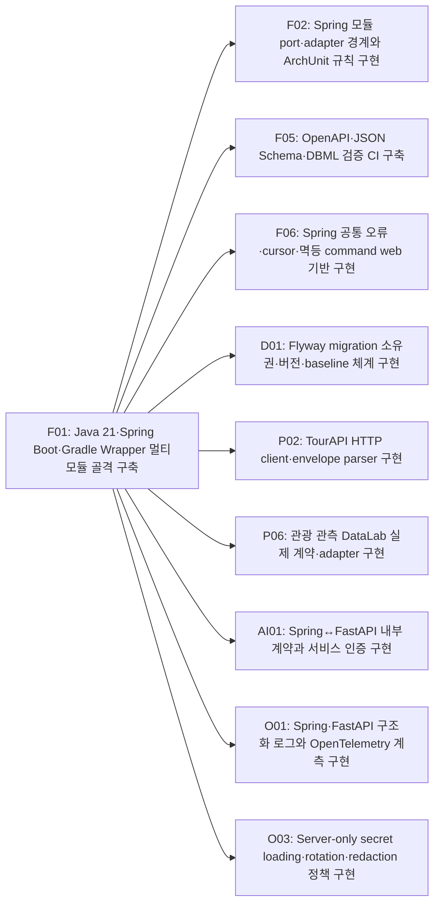
```mermaid
flowchart LR
  F01["F01: Java 21·Spring Boot·Gradle Wrapper 멀티모듈 골격 구축"]
  F02["F02: Spring 모듈 port·adapter 경계와 ArchUnit 규칙 구현"]
  F05["F05: OpenAPI·JSON Schema·DBML 검증 CI 구축"]
  F06["F06: Spring 공통 오류·cursor·멱등 command web 기반 구현"]
  D01["D01: Flyway migration 소유권·버전·baseline 체계 구현"]
  P02["P02: TourAPI HTTP client·envelope parser 구현"]
  P06["P06: 관광 관측 DataLab 실제 계약·adapter 구현"]
  AI01["AI01: Spring↔FastAPI 내부 계약과 서비스 인증 구현"]
  O01["O01: Spring·FastAPI 구조화 로그와 OpenTelemetry 계측 구현"]
  O03["O03: Server-only secret loading·rotation·redaction 정책 구현"]
  F01 --> F02
  F01 --> F05
  F01 --> F06
  F01 --> D01
  F01 --> P02
  F01 --> P06
  F01 --> AI01
  F01 --> O01
  F01 --> O03
```

### Expected Touch Points

- `settings.gradle.kts`
- `build.gradle.kts`
- `gradlew`
- `gradle/wrapper`
- `apps/spring-api/build.gradle.kts`
- `.gitignore`

### Parallel Safety / Conflict Notes

공통 Gradle wiring과 repository ignore 규칙의 단일 소유자.

### Acceptance Criteria

- [ ] 깨끗한 checkout에서 전역 Gradle 없이 ./gradlew --version과 ./gradlew check 통과
- [ ] Java toolchain·Spring Boot·Gradle 버전이 파일에 고정되고 Spring context/health smoke 통과
- [ ] .gitignore가 build/.gradle, Python .venv/cache, IDE/OS, .env와 secret 파일을 제외하며 안전한 예제 설정은 추적

### Verification Method

clean checkout Gradle Wrapper check, Boot smoke, git check-ignore fixture

### Agent Session State

- blocked-by가 모두 Closed이면 `Ready`.
- 담당자 또는 연결된 열린 PR이 있으면 `In progress`.
- blocked-by가 하나라도 Open이면 `Waiting`이며 구현을 시작하지 않는다.
- PR CI·review 중에는 `Review`; merge와 AC 확인 후에만 `Done`으로 닫는다.

## F02. Spring 모듈 port·adapter 경계와 ArchUnit 규칙 구현

**Priority:** P0

**Wave:** 1

**Parent Track:** TA

### Objective

core의 framework 독립성과 module DAG를 CI에서 강제한다.

### Context

ADR-0003과 module-boundaries의 consumer-owned port 규칙을 실행한다.

### Scope

package 규칙, 금지 import/cycle fixture, composition bridge

### Out of Scope

도메인 기능

### Implementation Notes

의도적 위반 fixture가 실제 실패해야 한다.

### Related Code / Modules

apps/spring-api/src/test/java/com/yrootlab/onmaru/architecture, build-logic/

### Dependencies (blocked-by)

- F01: Java 21·Spring Boot·Gradle Wrapper 멀티모듈 골격 구축

### Blocks

- 없음

### Position in Graph

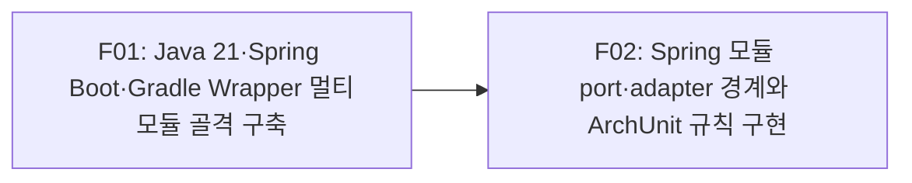
```mermaid
flowchart LR
  F01["F01: Java 21·Spring Boot·Gradle Wrapper 멀티모듈 골격 구축"]
  F02["F02: Spring 모듈 port·adapter 경계와 ArchUnit 규칙 구현"]
  F01 --> F02
```

### Expected Touch Points

- `apps/spring-api/src/test/java/com/yrootlab/onmaru/architecture`
- `build-logic/architecture`

### Parallel Safety / Conflict Notes

F01 이후 전용 test/build-logic만 수정.

### Acceptance Criteria

- [ ] Spring/JPA import가 core에서 거부됨
- [ ] module cycle fixture 실패 및 정상 DAG 통과

### Verification Method

ArchUnit negative/positive tests

### Agent Session State

- blocked-by가 모두 Closed이면 `Ready`.
- 담당자 또는 연결된 열린 PR이 있으면 `In progress`.
- blocked-by가 하나라도 Open이면 `Waiting`이며 구현을 시작하지 않는다.
- PR CI·review 중에는 `Review`; merge와 AC 확인 후에만 `Done`으로 닫는다.

## F03. FastAPI Python 서비스 실행·테스트 골격 구축

**Priority:** P0

**Wave:** 0

**Parent Track:** TA

### Objective

Spring과 독립 배포되는 AI service skeleton을 만든다.

### Context

ADR-0002의 별도 Python runtime을 구현한다.

### Scope

pyproject, app factory, health/readiness, lint/type/test

### Out of Scope

모델 호출

### Implementation Notes

DB credential 없이 시작한다.

### Related Code / Modules

ai/pyproject.toml, ai/src/onmaru_ai, ai/tests

### Dependencies (blocked-by)

- 없음 (즉시 Ready 후보)

### Blocks

- F05: OpenAPI·JSON Schema·DBML 검증 CI 구축
- AI01: Spring↔FastAPI 내부 계약과 서비스 인증 구현
- AI03: 검증 데이터 deterministic baseline 검색·ranking 구현
- O01: Spring·FastAPI 구조화 로그와 OpenTelemetry 계측 구현
- O03: Server-only secret loading·rotation·redaction 정책 구현

### Position in Graph

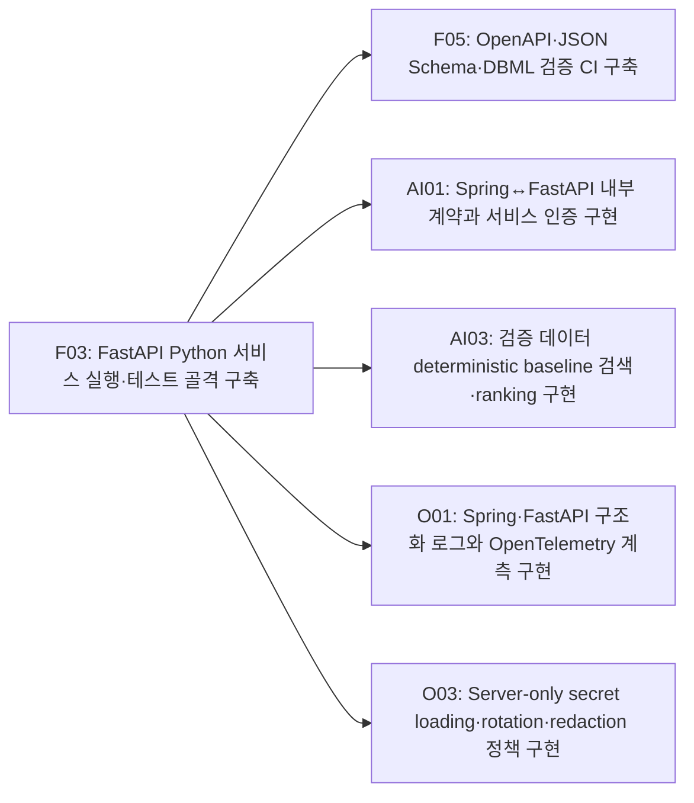
```mermaid
flowchart LR
  F03["F03: FastAPI Python 서비스 실행·테스트 골격 구축"]
  F05["F05: OpenAPI·JSON Schema·DBML 검증 CI 구축"]
  AI01["AI01: Spring↔FastAPI 내부 계약과 서비스 인증 구현"]
  AI03["AI03: 검증 데이터 deterministic baseline 검색·ranking 구현"]
  O01["O01: Spring·FastAPI 구조화 로그와 OpenTelemetry 계측 구현"]
  O03["O03: Server-only secret loading·rotation·redaction 정책 구현"]
  F03 --> F05
  F03 --> AI01
  F03 --> AI03
  F03 --> O01
  F03 --> O03
```

### Expected Touch Points

- `ai/pyproject.toml`
- `ai/src/onmaru_ai/bootstrap`
- `ai/tests/bootstrap`

### Parallel Safety / Conflict Notes

Spring 파일과 분리되어 병렬 안전.

### Acceptance Criteria

- [ ] lint/typecheck/pytest 통과
- [ ] health와 readiness 상태가 분리됨

### Verification Method

Python CI와 ASGI smoke

### Agent Session State

- blocked-by가 모두 Closed이면 `Ready`.
- 담당자 또는 연결된 열린 PR이 있으면 `In progress`.
- blocked-by가 하나라도 Open이면 `Waiting`이며 구현을 시작하지 않는다.
- PR CI·review 중에는 `Review`; merge와 AC 확인 후에만 `Done`으로 닫는다.

## F04. PostgreSQL·PostGIS 로컬 통합 테스트 환경 구축

**Priority:** P0

**Wave:** 0

**Parent Track:** TA

### Objective

migration과 공간 SQL을 실제 DB에서 검증할 기반을 만든다.

### Context

ADR-0004는 환경당 DB 하나와 PostGIS를 선택한다.

### Scope

Testcontainers, local compose, readiness, test DB reset

### Out of Scope

운영 hosting 선택

### Implementation Notes

in-memory DB 대체를 허용하지 않는다.

### Related Code / Modules

infra/local/, testing/postgres/

### Dependencies (blocked-by)

- 없음 (즉시 Ready 후보)

### Blocks

- D01: Flyway migration 소유권·버전·baseline 체계 구현

### Position in Graph

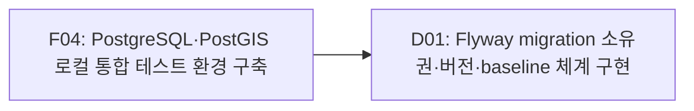
```mermaid
flowchart LR
  F04["F04: PostgreSQL·PostGIS 로컬 통합 테스트 환경 구축"]
  D01["D01: Flyway migration 소유권·버전·baseline 체계 구현"]
  F04 --> D01
```

### Expected Touch Points

- `infra/local/postgres`
- `testing/postgres`

### Parallel Safety / Conflict Notes

runtime source와 분리.

### Acceptance Criteria

- [ ] PostGIS extension 포함 container test 통과
- [ ] 반복 실행 시 깨끗한 DB 보장

### Verification Method

container integration smoke

### Agent Session State

- blocked-by가 모두 Closed이면 `Ready`.
- 담당자 또는 연결된 열린 PR이 있으면 `In progress`.
- blocked-by가 하나라도 Open이면 `Waiting`이며 구현을 시작하지 않는다.
- PR CI·review 중에는 `Review`; merge와 AC 확인 후에만 `Done`으로 닫는다.

## F05. OpenAPI·JSON Schema·DBML 검증 CI 구축

**Priority:** P0

**Wave:** 1

**Parent Track:** TA

### Objective

계약과 schema drift를 PR에서 차단한다.

### Context

현재 prose 검토만으로 구현 완료를 판단할 수 없다.

### Scope

OpenAPI lint, JSON fixture/schema, DBML compile, generated artifact diff

### Out of Scope

endpoint 구현

### Implementation Notes

기존 CI의 계약 검증 job을 이 Issue만 소유한다.

### Related Code / Modules

.github/workflows/ci.yml, scripts/verify-contracts

### Dependencies (blocked-by)

- F01: Java 21·Spring Boot·Gradle Wrapper 멀티모듈 골격 구축
- F03: FastAPI Python 서비스 실행·테스트 골격 구축

### Blocks

- C06: R1 serializer·OpenAPI·LKG 통합 게이트
- M09: R2 지도·후기·Odii·찜 통합 계약 E2E 게이트
- J10: Journey REST·SSE·FastAPI 전체 계약 E2E 게이트
- O07: Spring·FastAPI container·staging·release/rollback pipeline 구현

### Position in Graph

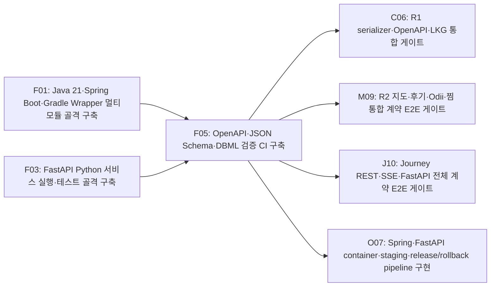
```mermaid
flowchart LR
  F01["F01: Java 21·Spring Boot·Gradle Wrapper 멀티모듈 골격 구축"]
  F03["F03: FastAPI Python 서비스 실행·테스트 골격 구축"]
  F05["F05: OpenAPI·JSON Schema·DBML 검증 CI 구축"]
  C06["C06: R1 serializer·OpenAPI·LKG 통합 게이트"]
  M09["M09: R2 지도·후기·Odii·찜 통합 계약 E2E 게이트"]
  J10["J10: Journey REST·SSE·FastAPI 전체 계약 E2E 게이트"]
  O07["O07: Spring·FastAPI container·staging·release/rollback pipeline 구현"]
  F01 --> F05
  F03 --> F05
  F05 --> C06
  F05 --> M09
  F05 --> J10
  F05 --> O07
```

### Expected Touch Points

- `.github/workflows/ci.yml`
- `scripts/verify-contracts`

### Parallel Safety / Conflict Notes

CI 파일 단일 소유.

### Acceptance Criteria

- [ ] 유효 계약 통과와 깨진 fixture 실패
- [ ] 생성물 stale 상태 실패

### Verification Method

CI positive/negative fixture

### Agent Session State

- blocked-by가 모두 Closed이면 `Ready`.
- 담당자 또는 연결된 열린 PR이 있으면 `In progress`.
- blocked-by가 하나라도 Open이면 `Waiting`이며 구현을 시작하지 않는다.
- PR CI·review 중에는 `Review`; merge와 AC 확인 후에만 `Done`으로 닫는다.

## F06. Spring 공통 오류·cursor·멱등 command web 기반 구현

**Priority:** P0

**Wave:** 1

**Parent Track:** TA

### Objective

모든 공개 API가 동일 오류·paging·idempotency 규칙을 사용하게 한다.

### Context

rest-api 공통 계약의 schemaVersion 1.2와 error code를 구현한다.

### Scope

error envelope, requestId, validation, cursor codec, Idempotency-Key storage port

### Out of Scope

도메인 endpoint

### Implementation Notes

인증·소유권 재검증 전 저장 응답 반환 금지.

### Related Code / Modules

apps/spring-api/src/main/java/com/yrootlab/onmaru/web/common, modules/shared-web

### Dependencies (blocked-by)

- F01: Java 21·Spring Boot·Gradle Wrapper 멀티모듈 골격 구축

### Blocks

- F08: 공개 API rate-limit·IP/member admission 기반 구현
- C02: 한옥 목록 검색·필터·cursor API 구현
- C03: Canonical place·한옥 상세 API 구현
- C04: 월별 한옥 editorial edition·placement API 구현
- C05: 주변·지도 canonical 장소 조회 API 구현
- I01: Kakao OAuth state·callback·opaque session 구현
- I03: CSRF·cookie·인가·private cache 보안 경계 구현
- M01: 행정구역 resolve·VisitReview 지역 집계 API 구현
- M02: VisitReview ALL·REGION·place 목록과 cursor 구현
- M07: 방문자·관광지 집중률 공개 조회 API 구현
- A03: Odii story·음원·대본 공개 API 구현
- J01: Exploration 생성·조회·turn intake와 소유권 구현

### Position in Graph

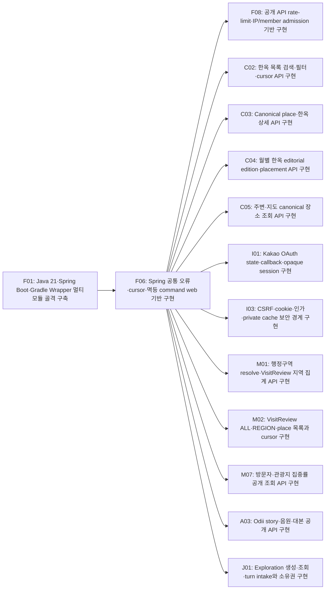
```mermaid
flowchart LR
  F01["F01: Java 21·Spring Boot·Gradle Wrapper 멀티모듈 골격 구축"]
  F06["F06: Spring 공통 오류·cursor·멱등 command web 기반 구현"]
  F08["F08: 공개 API rate-limit·IP/member admission 기반 구현"]
  C02["C02: 한옥 목록 검색·필터·cursor API 구현"]
  C03["C03: Canonical place·한옥 상세 API 구현"]
  C04["C04: 월별 한옥 editorial edition·placement API 구현"]
  C05["C05: 주변·지도 canonical 장소 조회 API 구현"]
  I01["I01: Kakao OAuth state·callback·opaque session 구현"]
  I03["I03: CSRF·cookie·인가·private cache 보안 경계 구현"]
  M01["M01: 행정구역 resolve·VisitReview 지역 집계 API 구현"]
  M02["M02: VisitReview ALL·REGION·place 목록과 cursor 구현"]
  M07["M07: 방문자·관광지 집중률 공개 조회 API 구현"]
  A03["A03: Odii story·음원·대본 공개 API 구현"]
  J01["J01: Exploration 생성·조회·turn intake와 소유권 구현"]
  F01 --> F06
  F06 --> F08
  F06 --> C02
  F06 --> C03
  F06 --> C04
  F06 --> C05
  F06 --> I01
  F06 --> I03
  F06 --> M01
  F06 --> M02
  F06 --> M07
  F06 --> A03
  F06 --> J01
```

### Expected Touch Points

- `apps/spring-api/src/main/java/com/yrootlab/onmaru/web/common`
- `modules/shared-web`

### Parallel Safety / Conflict Notes

공통 web primitive 단일 소유.

### Acceptance Criteria

- [ ] 오류·cursor 만료/변조 contract test 통과
- [ ] 동일 key/동일 payload replay와 다른 payload 409

### Verification Method

MockMvc와 concurrency test

### Agent Session State

- blocked-by가 모두 Closed이면 `Ready`.
- 담당자 또는 연결된 열린 PR이 있으면 `In progress`.
- blocked-by가 하나라도 Open이면 `Waiting`이며 구현을 시작하지 않는다.
- PR CI·review 중에는 `Review`; merge와 AC 확인 후에만 `Done`으로 닫는다.

## F07. Backend 설계 입력 snapshot·provenance manifest 고정

**Priority:** P0

**Wave:** 0

**Parent Track:** TA

### Objective

개인 절대경로 없이 모든 Agent와 CI가 동일한 backend 입력 문서를 재현한다.

### Context

docs/specs와 backend schema guide가 현재 개인 개발 경로 symlink라 다른 checkout에서 내용이 달라지거나 사라질 수 있다.

### Scope

allowlisted repository-local snapshot, upstream repository/commit/path/hash manifest, 갱신 절차, secret scan

### Out of Scope

FE 컴포넌트 구현·원본 repository 자동 동기화

### Implementation Notes

복사한 입력은 원본 commit과 SHA-256을 기록하고 민감정보를 포함하지 않는다.

### Related Code / Modules

docs/reference-snapshots/planning-inputs, scripts/verify-planning-inputs

### Dependencies (blocked-by)

- 없음 (즉시 Ready 후보)

### Blocks

- F09: 인증·회원·SavedResource OpenAPI·fixture 동결
- P07: 행정구역 경계 source qualification·revision import 구현
- M06: 지도·Odii·관광 관측 R2 OpenAPI·fixture 동결
- J11: Journey actions·SavedJourney OpenAPI·fixture 완성

### Position in Graph

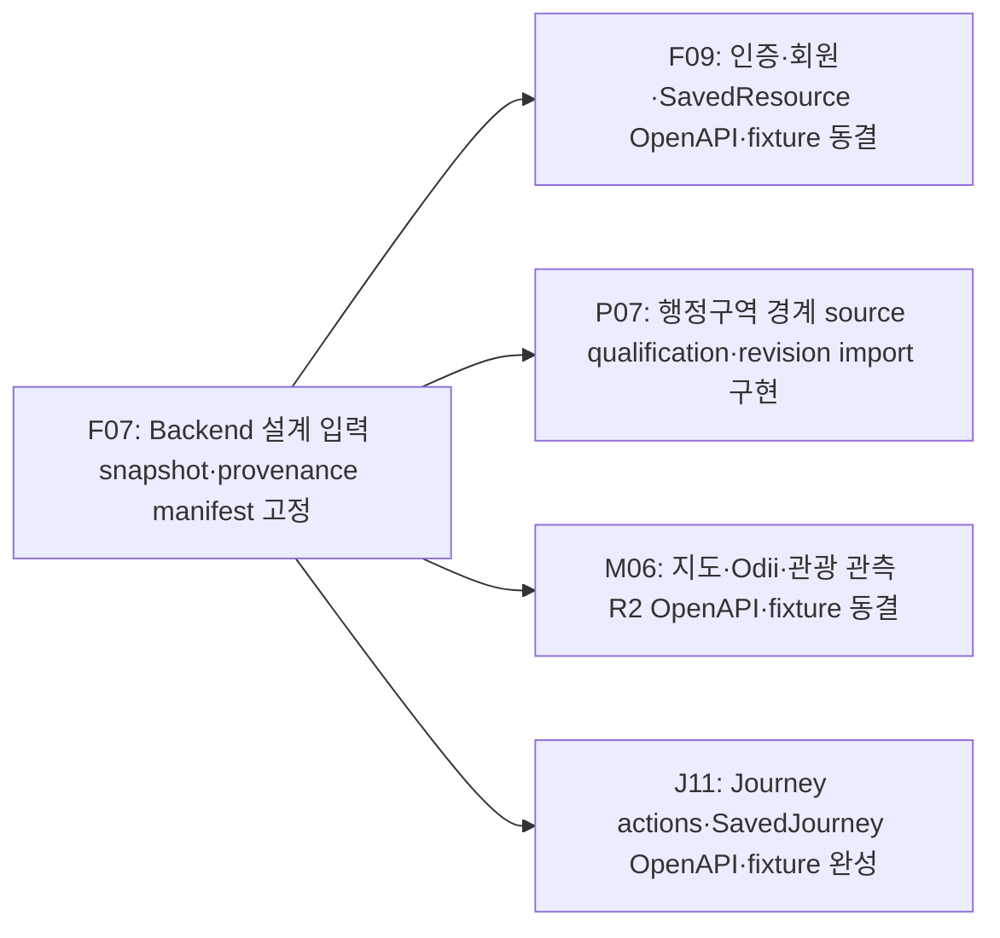
```mermaid
flowchart LR
  F07["F07: Backend 설계 입력 snapshot·provenance manifest 고정"]
  F09["F09: 인증·회원·SavedResource OpenAPI·fixture 동결"]
  P07["P07: 행정구역 경계 source qualification·revision import 구현"]
  M06["M06: 지도·Odii·관광 관측 R2 OpenAPI·fixture 동결"]
  J11["J11: Journey actions·SavedJourney OpenAPI·fixture 완성"]
  F07 --> F09
  F07 --> P07
  F07 --> M06
  F07 --> J11
```

### Expected Touch Points

- `docs/reference-snapshots/planning-inputs`
- `scripts/verify-planning-inputs`

### Parallel Safety / Conflict Notes

runtime·DB 파일을 수정하지 않는 문서 입력 전용 작업.

### Acceptance Criteria

- [ ] 원본 checkout 없이 manifest 검증과 backend 요구 추출 가능
- [ ] 내용 변조·누락·secret fixture에서 CI 실패

### Verification Method

clean checkout manifest/hash/secret-scan tests

### Agent Session State

- blocked-by가 모두 Closed이면 `Ready`.
- 담당자 또는 연결된 열린 PR이 있으면 `In progress`.
- blocked-by가 하나라도 Open이면 `Waiting`이며 구현을 시작하지 않는다.
- PR CI·review 중에는 `Review`; merge와 AC 확인 후에만 `Done`으로 닫는다.

## F08. 공개 API rate-limit·IP/member admission 기반 구현

**Priority:** P0

**Wave:** 3

**Parent Track:** TA

### Objective

로그인·작성·신고·여정 command의 남용을 원자적으로 제한하고 일관된 429를 반환한다.

### Context

AI quota 외에도 public command별 IP/member 예산과 proxy 신뢰 경계가 필요하다.

### Scope

trusted proxy client identity, operation budget policy, atomic admission store, Retry-After, metrics

### Out of Scope

결제 quota·WAF vendor 종속 설정

### Implementation Notes

X-Forwarded-For는 allowlisted proxy에서만 신뢰하고 AI 일일 quota는 J09가 소유한다.

### Related Code / Modules

modules/operations/admission, apps/spring-api/web/admission

### Dependencies (blocked-by)

- F06: Spring 공통 오류·cursor·멱등 command web 기반 구현
- D07: Sync run·lease·checkpoint·quarantine·outbox schema 구현

### Blocks

- I01: Kakao OAuth state·callback·opaque session 구현
- M03: VisitReview 작성·본인 삭제·멱등성 구현
- M05: VisitReview 신고·moderation audit·운영 명령 구현
- J01: Exploration 생성·조회·turn intake와 소유권 구현

### Position in Graph

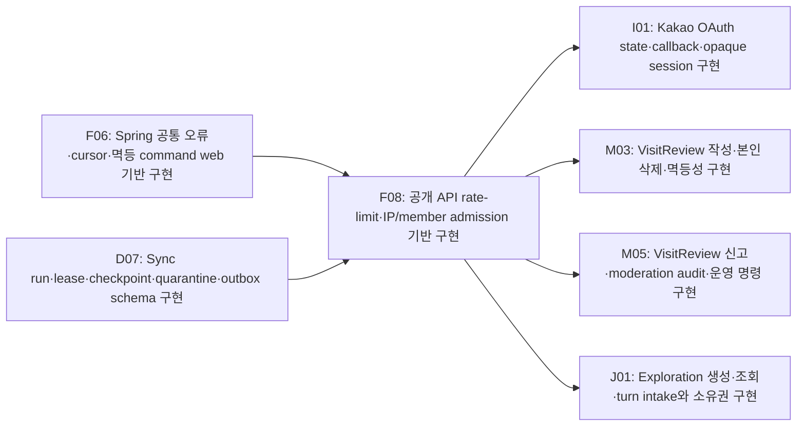
```mermaid
flowchart LR
  F06["F06: Spring 공통 오류·cursor·멱등 command web 기반 구현"]
  D07["D07: Sync run·lease·checkpoint·quarantine·outbox schema 구현"]
  F08["F08: 공개 API rate-limit·IP/member admission 기반 구현"]
  I01["I01: Kakao OAuth state·callback·opaque session 구현"]
  M03["M03: VisitReview 작성·본인 삭제·멱등성 구현"]
  M05["M05: VisitReview 신고·moderation audit·운영 명령 구현"]
  J01["J01: Exploration 생성·조회·turn intake와 소유권 구현"]
  F06 --> F08
  D07 --> F08
  F08 --> I01
  F08 --> M03
  F08 --> M05
  F08 --> J01
```

### Expected Touch Points

- `modules/operations/src/main/java/com/yrootlab/onmaru/operations/admission`
- `apps/spring-api/src/main/java/com/yrootlab/onmaru/web/admission`

### Parallel Safety / Conflict Notes

공통 web primitive와 operations schema가 완료된 뒤 admission package만 소유.

### Acceptance Criteria

- [ ] 동시 요청에서도 operation별 한도 초과 승인 0
- [ ] 비신뢰 forwarded header 위조 거부와 429 Retry-After contract 통과

### Verification Method

fake clock·proxy header·DB concurrency integration tests

### Agent Session State

- blocked-by가 모두 Closed이면 `Ready`.
- 담당자 또는 연결된 열린 PR이 있으면 `In progress`.
- blocked-by가 하나라도 Open이면 `Waiting`이며 구현을 시작하지 않는다.
- PR CI·review 중에는 `Review`; merge와 AC 확인 후에만 `Done`으로 닫는다.

## F09. 인증·회원·SavedResource OpenAPI·fixture 동결

**Priority:** P0

**Wave:** 1

**Parent Track:** TA

### Objective

session·CSRF·회원 lifecycle·개인 저장 API를 구현 전에 기계 판독 계약으로 고정한다.

### Context

rest-api prose에는 endpoint가 있지만 현재 OpenAPI는 인증·회원·saved resource를 포함하지 않는다.

### Scope

auth/login/callback/logout/csrf, members/me, place/Odii save, saved list, timeline schemas and fixtures

### Out of Scope

endpoint runtime 구현·FE 컴포넌트

### Implementation Notes

cookie, redirect, no-store, 401/403/404/409와 savedByMe 익명/회원 차이를 예제로 고정한다.

### Related Code / Modules

docs/contracts/openapi/identity-saved.openapi.yaml, docs/contracts/fixtures/identity-saved

### Dependencies (blocked-by)

- F07: Backend 설계 입력 snapshot·provenance manifest 고정

### Blocks

- I01: Kakao OAuth state·callback·opaque session 구현
- I04: 회원 조회·logout·탈퇴·보존 lifecycle 구현
- I05: Canonical 관광 장소 찜 PUT·DELETE 구현
- I06: Odii story 저장과 saved-resource 목록 구현
- I07: 내 월간 활동 타임라인 read model 구현
- J11: Journey actions·SavedJourney OpenAPI·fixture 완성

### Position in Graph

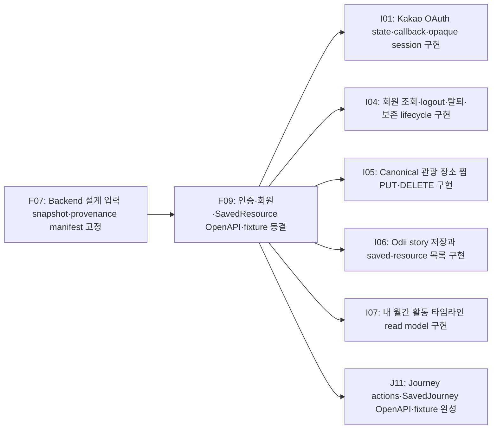
```mermaid
flowchart LR
  F07["F07: Backend 설계 입력 snapshot·provenance manifest 고정"]
  F09["F09: 인증·회원·SavedResource OpenAPI·fixture 동결"]
  I01["I01: Kakao OAuth state·callback·opaque session 구현"]
  I04["I04: 회원 조회·logout·탈퇴·보존 lifecycle 구현"]
  I05["I05: Canonical 관광 장소 찜 PUT·DELETE 구현"]
  I06["I06: Odii story 저장과 saved-resource 목록 구현"]
  I07["I07: 내 월간 활동 타임라인 read model 구현"]
  J11["J11: Journey actions·SavedJourney OpenAPI·fixture 완성"]
  F07 --> F09
  F09 --> I01
  F09 --> I04
  F09 --> I05
  F09 --> I06
  F09 --> I07
  F09 --> J11
```

### Expected Touch Points

- `docs/contracts/openapi/identity-saved.openapi.yaml`
- `docs/contracts/fixtures/identity-saved`

### Parallel Safety / Conflict Notes

R1·R2·Journey 계약 파일과 분리된 identity/saved bundle.

### Acceptance Criteria

- [ ] rest-api의 인증·회원·저장 endpoint 누락 0
- [ ] OpenAPI lint와 정상·권한·멱등 fixture schema 검증 통과

### Verification Method

OpenAPI validator and fixture schema tests

### Agent Session State

- blocked-by가 모두 Closed이면 `Ready`.
- 담당자 또는 연결된 열린 PR이 있으면 `In progress`.
- blocked-by가 하나라도 Open이면 `Waiting`이며 구현을 시작하지 않는다.
- PR CI·review 중에는 `Review`; merge와 AC 확인 후에만 `Done`으로 닫는다.

## D01. Flyway migration 소유권·버전·baseline 체계 구현

**Priority:** P0

**Wave:** 1

**Parent Track:** TB

### Objective

빈 DB와 기존 DB를 동일 schema로 올리는 실행 migration 기준을 만든다.

### Context

문서 DBML은 제안이며 executable DDL이 필요하다.

### Scope

schema namespace, version registry, baseline, migration checksum policy, database role grants

### Out of Scope

모든 업무 table

### Implementation Notes

전역 migration version은 이 Issue가 예약 규칙을 소유한다.

### Related Code / Modules

db/migration/, docs/database/README.md

### Dependencies (blocked-by)

- F01: Java 21·Spring Boot·Gradle Wrapper 멀티모듈 골격 구축
- F04: PostgreSQL·PostGIS 로컬 통합 테스트 환경 구축

### Blocks

- D02: Catalog canonical place·source·revision schema 구현
- D03: Member·OAuth identity·session·guest grant schema 구현
- D04: Exploration·run·saved journey·saved resource schema 구현
- D05: VisitReview·like·report·moderation schema 구현
- D06: Odii spot·story·language·transcript revision schema 구현
- D07: Sync run·lease·checkpoint·quarantine·outbox schema 구현
- D09: Insights 관측·target link 실행 migration 구현

### Position in Graph

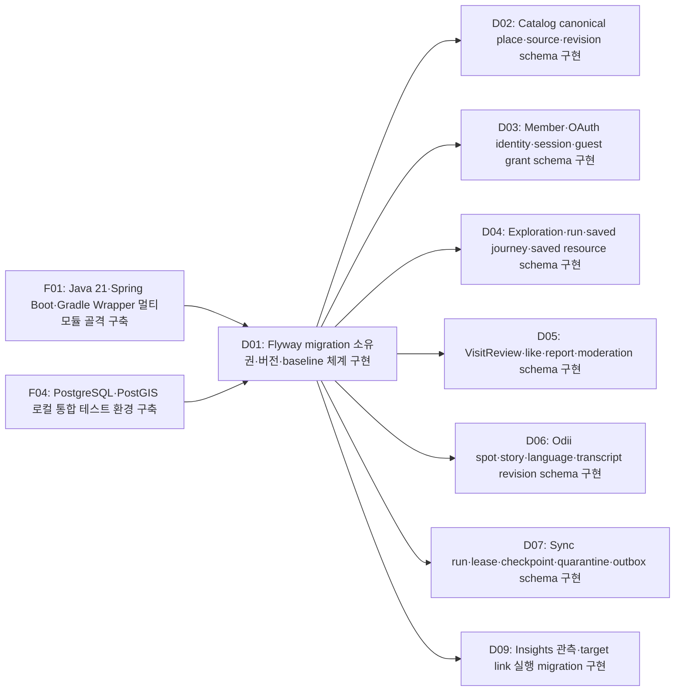
```mermaid
flowchart LR
  F01["F01: Java 21·Spring Boot·Gradle Wrapper 멀티모듈 골격 구축"]
  F04["F04: PostgreSQL·PostGIS 로컬 통합 테스트 환경 구축"]
  D01["D01: Flyway migration 소유권·버전·baseline 체계 구현"]
  D02["D02: Catalog canonical place·source·revision schema 구현"]
  D03["D03: Member·OAuth identity·session·guest grant schema 구현"]
  D04["D04: Exploration·run·saved journey·saved resource schema 구현"]
  D05["D05: VisitReview·like·report·moderation schema 구현"]
  D06["D06: Odii spot·story·language·transcript revision schema 구현"]
  D07["D07: Sync run·lease·checkpoint·quarantine·outbox schema 구현"]
  D09["D09: Insights 관측·target link 실행 migration 구현"]
  F01 --> D01
  F04 --> D01
  D01 --> D02
  D01 --> D03
  D01 --> D04
  D01 --> D05
  D01 --> D06
  D01 --> D07
  D01 --> D09
```

### Expected Touch Points

- `db/migration/registry`
- `db/migration/baseline`

### Parallel Safety / Conflict Notes

후속 context는 예약된 범위만 사용.

### Acceptance Criteria

- [ ] empty migrate와 baseline upgrade 통과
- [ ] 중복 version/checksum 변경 CI 실패
- [ ] migration/runtime/readonly/backup role이 분리되고 runtime role의 DDL이 거부됨

### Verification Method

Flyway Testcontainers matrix

### Agent Session State

- blocked-by가 모두 Closed이면 `Ready`.
- 담당자 또는 연결된 열린 PR이 있으면 `In progress`.
- blocked-by가 하나라도 Open이면 `Waiting`이며 구현을 시작하지 않는다.
- PR CI·review 중에는 `Review`; merge와 AC 확인 후에만 `Done`으로 닫는다.

## D02. Catalog canonical place·source·revision schema 구현

**Priority:** P0

**Wave:** 2

**Parent Track:** TB

### Objective

공급자 ID와 안정된 placeId, versioned projection을 저장한다.

### Context

원본 contentId를 public identity로 쓰지 않는다.

### Scope

region/place/source identity, source refs, dataset/place versions, PostGIS indexes

### Out of Scope

수집 worker

### Implementation Notes

provider+dataset+externalId+language unique와 revision FK 강제.

### Related Code / Modules

db/migration/catalog, adapters/persistence-jpa/catalog

### Dependencies (blocked-by)

- D01: Flyway migration 소유권·버전·baseline 체계 구현

### Blocks

- D08: 전체 migration·동시성·rollback 계약 테스트 완성
- D09: Insights 관측·target link 실행 migration 구현
- P03: 03:00 KST sync scheduler·lease·checkpoint 구현
- P04: Source validation·category mapping·quarantine 구현
- P06: 관광 관측 DataLab 실제 계약·adapter 구현
- P07: 행정구역 경계 source qualification·revision import 구현
- C04: 월별 한옥 editorial edition·placement API 구현
- M01: 행정구역 resolve·VisitReview 지역 집계 API 구현

### Position in Graph

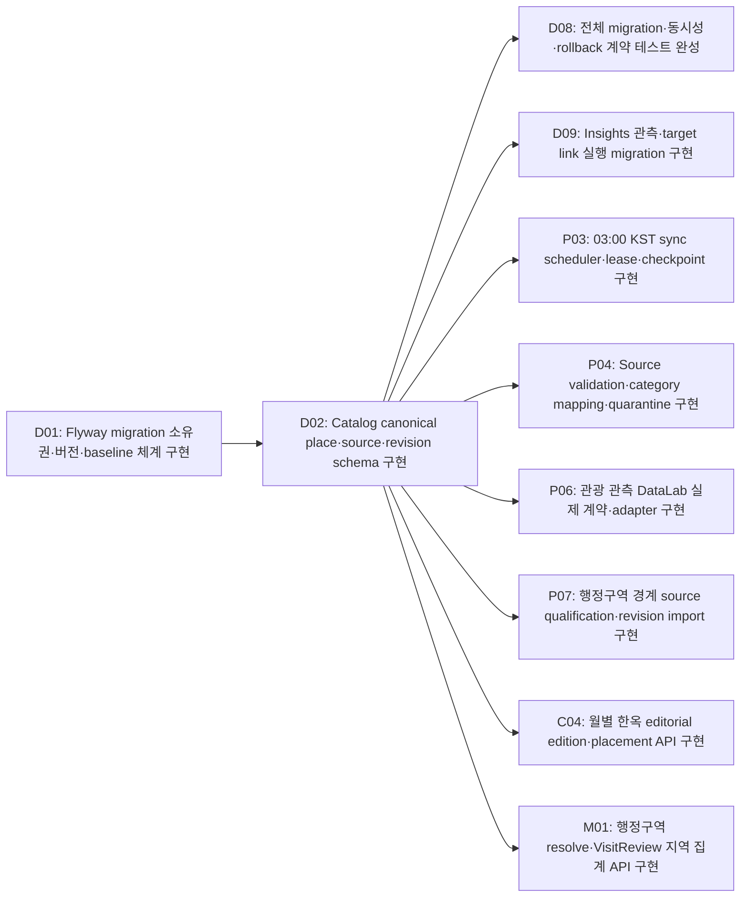
```mermaid
flowchart LR
  D01["D01: Flyway migration 소유권·버전·baseline 체계 구현"]
  D02["D02: Catalog canonical place·source·revision schema 구현"]
  D08["D08: 전체 migration·동시성·rollback 계약 테스트 완성"]
  D09["D09: Insights 관측·target link 실행 migration 구현"]
  P03["P03: 03:00 KST sync scheduler·lease·checkpoint 구현"]
  P04["P04: Source validation·category mapping·quarantine 구현"]
  P06["P06: 관광 관측 DataLab 실제 계약·adapter 구현"]
  P07["P07: 행정구역 경계 source qualification·revision import 구현"]
  C04["C04: 월별 한옥 editorial edition·placement API 구현"]
  M01["M01: 행정구역 resolve·VisitReview 지역 집계 API 구현"]
  D01 --> D02
  D02 --> D08
  D02 --> D09
  D02 --> P03
  D02 --> P04
  D02 --> P06
  D02 --> P07
  D02 --> C04
  D02 --> M01
```

### Expected Touch Points

- `db/migration/catalog`
- `adapters/persistence-jpa/src/main/java/com/yrootlab/onmaru/persistence/catalog`

### Parallel Safety / Conflict Notes

catalog migration 예약 범위 사용.

### Acceptance Criteria

- [ ] 동일 source 중복 차단과 provider 충돌 분리
- [ ] 좌표·revision FK와 GiST 검증

### Verification Method

PostGIS repository integration tests

### Agent Session State

- blocked-by가 모두 Closed이면 `Ready`.
- 담당자 또는 연결된 열린 PR이 있으면 `In progress`.
- blocked-by가 하나라도 Open이면 `Waiting`이며 구현을 시작하지 않는다.
- PR CI·review 중에는 `Review`; merge와 AC 확인 후에만 `Done`으로 닫는다.

## D03. Member·OAuth identity·session·guest grant schema 구현

**Priority:** P0

**Wave:** 2

**Parent Track:** TB

### Objective

provider 독립 회원과 opaque 인증 상태를 저장한다.

### Context

ADR-0008은 Kakao subject와 OnMaru member ID를 분리한다.

### Scope

members, oauth identities, sessions, login state, guest grants, deletion ledger

### Out of Scope

비밀번호 로그인

### Implementation Notes

issuer+subject unique와 token hash만 저장.

### Related Code / Modules

db/migration/identity, adapters/persistence-jpa/identity

### Dependencies (blocked-by)

- D01: Flyway migration 소유권·버전·baseline 체계 구현

### Blocks

- D08: 전체 migration·동시성·rollback 계약 테스트 완성
- I01: Kakao OAuth state·callback·opaque session 구현
- I03: CSRF·cookie·인가·private cache 보안 경계 구현

### Position in Graph

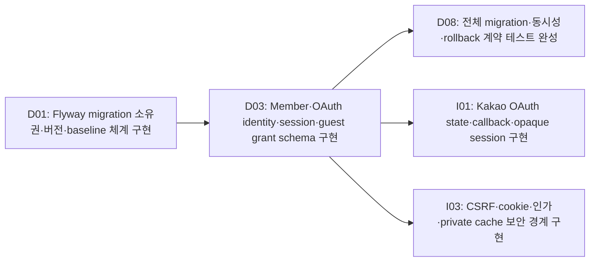
```mermaid
flowchart LR
  D01["D01: Flyway migration 소유권·버전·baseline 체계 구현"]
  D03["D03: Member·OAuth identity·session·guest grant schema 구현"]
  D08["D08: 전체 migration·동시성·rollback 계약 테스트 완성"]
  I01["I01: Kakao OAuth state·callback·opaque session 구현"]
  I03["I03: CSRF·cookie·인가·private cache 보안 경계 구현"]
  D01 --> D03
  D03 --> D08
  D03 --> I01
  D03 --> I03
```

### Expected Touch Points

- `db/migration/identity`
- `adapters/persistence-jpa/src/main/java/com/yrootlab/onmaru/persistence/identity`

### Parallel Safety / Conflict Notes

identity 전용 migration.

### Acceptance Criteria

- [ ] 동시 최초 로그인에도 member 한 명
- [ ] 만료·폐기 token으로 조회 불가

### Verification Method

DB constraint/concurrency tests

### Agent Session State

- blocked-by가 모두 Closed이면 `Ready`.
- 담당자 또는 연결된 열린 PR이 있으면 `In progress`.
- blocked-by가 하나라도 Open이면 `Waiting`이며 구현을 시작하지 않는다.
- PR CI·review 중에는 `Review`; merge와 AC 확인 후에만 `Done`으로 닫는다.

## D04. Exploration·run·saved journey·saved resource schema 구현

**Priority:** P1

**Wave:** 2

**Parent Track:** TB

### Objective

여정 실행과 개인 저장의 durable truth를 만든다.

### Context

REST/SSE의 정답은 PostgreSQL snapshot이다.

### Scope

exploration, turns, runs, proposals, idempotency, saved journeys/resources

### Out of Scope

AI 호출

### Implementation Notes

terminal CAS, member/resource unique, version constraint를 DDL로 강제.

### Related Code / Modules

db/migration/journey, adapters/persistence-jpa/journey

### Dependencies (blocked-by)

- D01: Flyway migration 소유권·버전·baseline 체계 구현

### Blocks

- D08: 전체 migration·동시성·rollback 계약 테스트 완성
- I02: Guest grant·exploration 소유권 승계 구현
- I04: 회원 조회·logout·탈퇴·보존 lifecycle 구현
- I05: Canonical 관광 장소 찜 PUT·DELETE 구현
- I06: Odii story 저장과 saved-resource 목록 구현
- J01: Exploration 생성·조회·turn intake와 소유권 구현

### Position in Graph

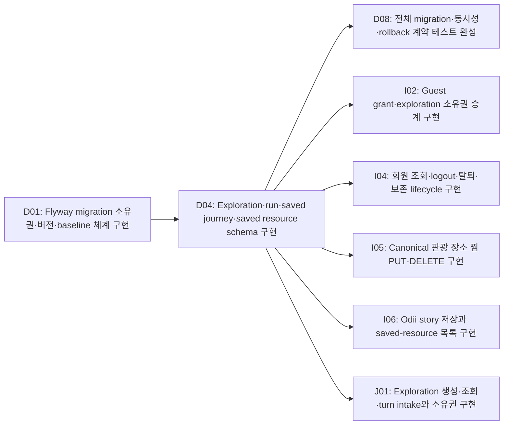
```mermaid
flowchart LR
  D01["D01: Flyway migration 소유권·버전·baseline 체계 구현"]
  D04["D04: Exploration·run·saved journey·saved resource schema 구현"]
  D08["D08: 전체 migration·동시성·rollback 계약 테스트 완성"]
  I02["I02: Guest grant·exploration 소유권 승계 구현"]
  I04["I04: 회원 조회·logout·탈퇴·보존 lifecycle 구현"]
  I05["I05: Canonical 관광 장소 찜 PUT·DELETE 구현"]
  I06["I06: Odii story 저장과 saved-resource 목록 구현"]
  J01["J01: Exploration 생성·조회·turn intake와 소유권 구현"]
  D01 --> D04
  D04 --> D08
  D04 --> I02
  D04 --> I04
  D04 --> I05
  D04 --> I06
  D04 --> J01
```

### Expected Touch Points

- `db/migration/journey`
- `adapters/persistence-jpa/src/main/java/com/yrootlab/onmaru/persistence/journey`

### Parallel Safety / Conflict Notes

journey 전용 migration.

### Acceptance Criteria

- [ ] terminal 상태 하나와 version 충돌 보장
- [ ] 동일 회원·resource 중복 저장 차단

### Verification Method

transaction/concurrency Testcontainers

### Agent Session State

- blocked-by가 모두 Closed이면 `Ready`.
- 담당자 또는 연결된 열린 PR이 있으면 `In progress`.
- blocked-by가 하나라도 Open이면 `Waiting`이며 구현을 시작하지 않는다.
- PR CI·review 중에는 `Review`; merge와 AC 확인 후에만 `Done`으로 닫는다.

## D05. VisitReview·like·report·moderation schema 구현

**Priority:** P1

**Wave:** 2

**Parent Track:** TB

### Objective

방문 후기와 운영 판정을 원자적으로 저장한다.

### Context

기존 온기와 별도인 VisitReview 모델이다.

### Scope

reviews, likes, reports, moderation audit, partial indexes

### Out of Scope

댓글·사진·별점

### Implementation Notes

review/member like unique와 열린 report unique 강제.

### Related Code / Modules

db/migration/community, adapters/persistence-jpa/community

### Dependencies (blocked-by)

- D01: Flyway migration 소유권·버전·baseline 체계 구현

### Blocks

- D08: 전체 migration·동시성·rollback 계약 테스트 완성
- M01: 행정구역 resolve·VisitReview 지역 집계 API 구현
- M02: VisitReview ALL·REGION·place 목록과 cursor 구현

### Position in Graph

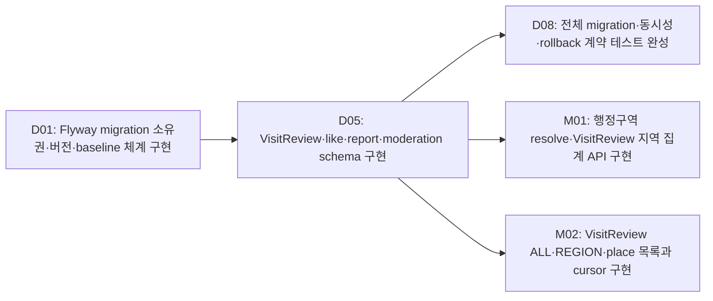
```mermaid
flowchart LR
  D01["D01: Flyway migration 소유권·버전·baseline 체계 구현"]
  D05["D05: VisitReview·like·report·moderation schema 구현"]
  D08["D08: 전체 migration·동시성·rollback 계약 테스트 완성"]
  M01["M01: 행정구역 resolve·VisitReview 지역 집계 API 구현"]
  M02["M02: VisitReview ALL·REGION·place 목록과 cursor 구현"]
  D01 --> D05
  D05 --> D08
  D05 --> M01
  D05 --> M02
```

### Expected Touch Points

- `db/migration/community`
- `adapters/persistence-jpa/src/main/java/com/yrootlab/onmaru/persistence/community`

### Parallel Safety / Conflict Notes

community 전용 migration.

### Acceptance Criteria

- [ ] 중복 like/report 방지
- [ ] 상태 변경 audit append-only 검증

### Verification Method

DB constraints and repository tests

### Agent Session State

- blocked-by가 모두 Closed이면 `Ready`.
- 담당자 또는 연결된 열린 PR이 있으면 `In progress`.
- blocked-by가 하나라도 Open이면 `Waiting`이며 구현을 시작하지 않는다.
- PR CI·review 중에는 `Review`; merge와 AC 확인 후에만 `Done`으로 닫는다.

## D06. Odii spot·story·language·transcript revision schema 구현

**Priority:** P1

**Wave:** 2

**Parent Track:** TB

### Objective

언어별 Odii identity와 대본 provenance를 저장한다.

### Context

spot/story와 언어 ID를 섞지 않고 tombstone을 보존한다.

### Scope

audio identities, versions, transcripts, place links

### Out of Scope

TTS·forced alignment

### Implementation Notes

provider IDs와 revision 복합 FK를 강제.

### Related Code / Modules

db/migration/audio, adapters/persistence-jpa/audio

### Dependencies (blocked-by)

- D01: Flyway migration 소유권·버전·baseline 체계 구현

### Blocks

- D08: 전체 migration·동시성·rollback 계약 테스트 완성
- A02: Odii 수집·revision·tombstone publish 구현

### Position in Graph

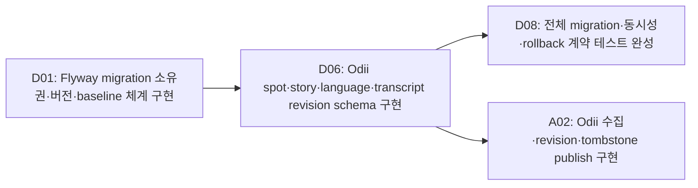
```mermaid
flowchart LR
  D01["D01: Flyway migration 소유권·버전·baseline 체계 구현"]
  D06["D06: Odii spot·story·language·transcript revision schema 구현"]
  D08["D08: 전체 migration·동시성·rollback 계약 테스트 완성"]
  A02["A02: Odii 수집·revision·tombstone publish 구현"]
  D01 --> D06
  D06 --> D08
  D06 --> A02
```

### Expected Touch Points

- `db/migration/audio`
- `adapters/persistence-jpa/src/main/java/com/yrootlab/onmaru/persistence/audio`

### Parallel Safety / Conflict Notes

audio 전용 migration.

### Acceptance Criteria

- [ ] 언어별 ID collision 없음
- [ ] 삭제 tombstone과 revision FK 검증

### Verification Method

audio repository integration tests

### Agent Session State

- blocked-by가 모두 Closed이면 `Ready`.
- 담당자 또는 연결된 열린 PR이 있으면 `In progress`.
- blocked-by가 하나라도 Open이면 `Waiting`이며 구현을 시작하지 않는다.
- PR CI·review 중에는 `Review`; merge와 AC 확인 후에만 `Done`으로 닫는다.

## D07. Sync run·lease·checkpoint·quarantine·outbox schema 구현

**Priority:** P0

**Wave:** 2

**Parent Track:** TB

### Objective

수집 실패 복구와 원자 게시를 위한 operations 저장소를 만든다.

### Context

ADR-0006의 fenced dataset publication 기반이다.

### Scope

schedules, runs, leases, checkpoints, watermarks, quarantine, outbox

### Out of Scope

provider HTTP client

### Implementation Notes

lease generation fencing과 schedule attempt unique 강제.

### Related Code / Modules

db/migration/operations, adapters/persistence-jpa/operations

### Dependencies (blocked-by)

- D01: Flyway migration 소유권·버전·baseline 체계 구현

### Blocks

- F08: 공개 API rate-limit·IP/member admission 기반 구현
- D08: 전체 migration·동시성·rollback 계약 테스트 완성
- P03: 03:00 KST sync scheduler·lease·checkpoint 구현
- P04: Source validation·category mapping·quarantine 구현
- P06: 관광 관측 DataLab 실제 계약·adapter 구현
- P07: 행정구역 경계 source qualification·revision import 구현
- A02: Odii 수집·revision·tombstone publish 구현

### Position in Graph

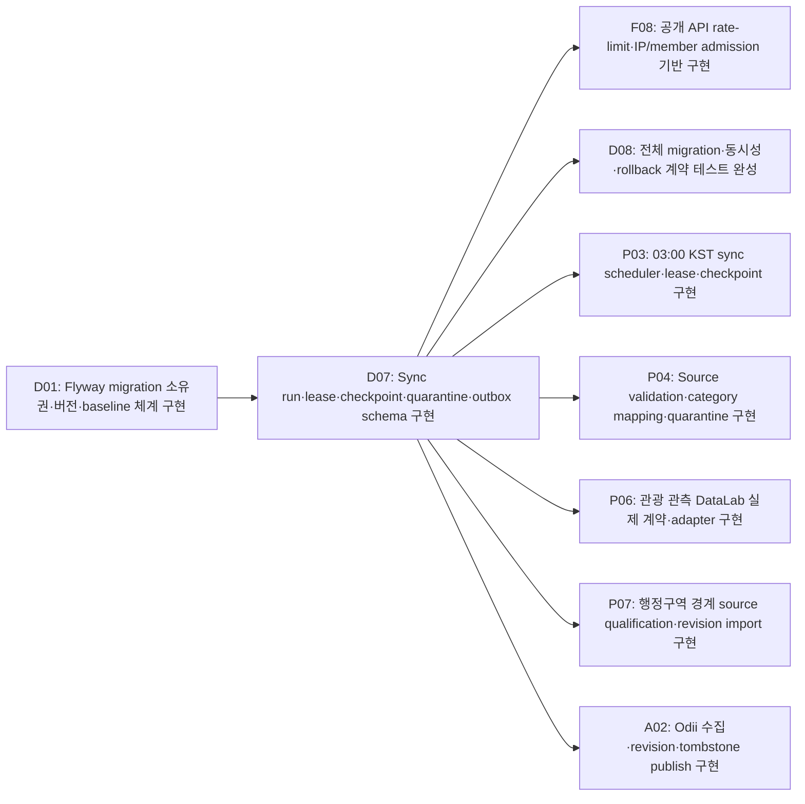
```mermaid
flowchart LR
  D01["D01: Flyway migration 소유권·버전·baseline 체계 구현"]
  D07["D07: Sync run·lease·checkpoint·quarantine·outbox schema 구현"]
  F08["F08: 공개 API rate-limit·IP/member admission 기반 구현"]
  D08["D08: 전체 migration·동시성·rollback 계약 테스트 완성"]
  P03["P03: 03:00 KST sync scheduler·lease·checkpoint 구현"]
  P04["P04: Source validation·category mapping·quarantine 구현"]
  P06["P06: 관광 관측 DataLab 실제 계약·adapter 구현"]
  P07["P07: 행정구역 경계 source qualification·revision import 구현"]
  A02["A02: Odii 수집·revision·tombstone publish 구현"]
  D01 --> D07
  D07 --> F08
  D07 --> D08
  D07 --> P03
  D07 --> P04
  D07 --> P06
  D07 --> P07
  D07 --> A02
```

### Expected Touch Points

- `db/migration/operations`
- `adapters/persistence-jpa/src/main/java/com/yrootlab/onmaru/persistence/operations`

### Parallel Safety / Conflict Notes

operations 전용 migration.

### Acceptance Criteria

- [ ] lease 상실 writer 차단
- [ ] checkpoint와 staged page atomic 저장

### Verification Method

DB concurrency tests

### Agent Session State

- blocked-by가 모두 Closed이면 `Ready`.
- 담당자 또는 연결된 열린 PR이 있으면 `In progress`.
- blocked-by가 하나라도 Open이면 `Waiting`이며 구현을 시작하지 않는다.
- PR CI·review 중에는 `Review`; merge와 AC 확인 후에만 `Done`으로 닫는다.

## D08. 전체 migration·동시성·rollback 계약 테스트 완성

**Priority:** P0

**Wave:** 4

**Parent Track:** TB

### Objective

context schema를 함께 올리고 핵심 race를 증명한다.

### Context

개별 migration 성공은 전체 upgrade 안전성을 보장하지 않는다.

### Scope

empty/upgrade/downgrade policy, concurrent login/save/like/run/publish matrix

### Out of Scope

운영 restore

### Implementation Notes

실제 PostgreSQL/PostGIS만 사용.

### Related Code / Modules

testing/database-contracts

### Dependencies (blocked-by)

- D02: Catalog canonical place·source·revision schema 구현
- D03: Member·OAuth identity·session·guest grant schema 구현
- D04: Exploration·run·saved journey·saved resource schema 구현
- D05: VisitReview·like·report·moderation schema 구현
- D06: Odii spot·story·language·transcript revision schema 구현
- D07: Sync run·lease·checkpoint·quarantine·outbox schema 구현
- D09: Insights 관측·target link 실행 migration 구현

### Blocks

- O04: PostgreSQL backup·PITR·restore drill 자동화
- O08: TTL·revision GC·회원 탈퇴 cleanup·복원 삭제 ledger 구현

### Position in Graph

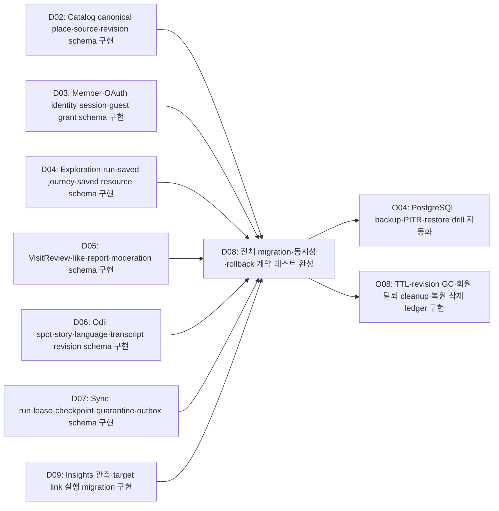
```mermaid
flowchart LR
  D02["D02: Catalog canonical place·source·revision schema 구현"]
  D03["D03: Member·OAuth identity·session·guest grant schema 구현"]
  D04["D04: Exploration·run·saved journey·saved resource schema 구현"]
  D05["D05: VisitReview·like·report·moderation schema 구현"]
  D06["D06: Odii spot·story·language·transcript revision schema 구현"]
  D07["D07: Sync run·lease·checkpoint·quarantine·outbox schema 구현"]
  D09["D09: Insights 관측·target link 실행 migration 구현"]
  D08["D08: 전체 migration·동시성·rollback 계약 테스트 완성"]
  O04["O04: PostgreSQL backup·PITR·restore drill 자동화"]
  O08["O08: TTL·revision GC·회원 탈퇴 cleanup·복원 삭제 ledger 구현"]
  D02 --> D08
  D03 --> D08
  D04 --> D08
  D05 --> D08
  D06 --> D08
  D07 --> D08
  D09 --> D08
  D08 --> O04
  D08 --> O08
```

### Expected Touch Points

- `testing/database-contracts`

### Parallel Safety / Conflict Notes

모든 schema 이후 통합 test만 추가.

### Acceptance Criteria

- [ ] empty와 이전 baseline upgrade 통과
- [ ] 문서의 필수 concurrency matrix 통과

### Verification Method

Testcontainers full matrix

### Agent Session State

- blocked-by가 모두 Closed이면 `Ready`.
- 담당자 또는 연결된 열린 PR이 있으면 `In progress`.
- blocked-by가 하나라도 Open이면 `Waiting`이며 구현을 시작하지 않는다.
- PR CI·review 중에는 `Review`; merge와 AC 확인 후에만 `Done`으로 닫는다.

## D09. Insights 관측·target link 실행 migration 구현

**Priority:** P0

**Wave:** 3

**Parent Track:** TB

### Objective

방문자·관광지 집중률 관측을 provenance와 공간 단위가 보존되는 executable schema에 저장한다.

### Context

DBML에는 insights 테이블이 있으나 기존 D01~D08에 이를 실행 migration으로 소유하는 Leaf가 없다.

### Scope

visitor observations, tourism targets, target-place links, concentration observations, keys/indexes/checks

### Out of Scope

provider HTTP·public heatmap query

### Implementation Notes

basis date, revision, region/target와 metric unit을 DB constraint로 강제하고 결측을 0으로 저장하지 않는다.

### Related Code / Modules

db/migration/insights, adapters/persistence-jpa/insights

### Dependencies (blocked-by)

- D01: Flyway migration 소유권·버전·baseline 체계 구현
- D02: Catalog canonical place·source·revision schema 구현

### Blocks

- D08: 전체 migration·동시성·rollback 계약 테스트 완성
- P06: 관광 관측 DataLab 실제 계약·adapter 구현
- M07: 방문자·관광지 집중률 공개 조회 API 구현

### Position in Graph

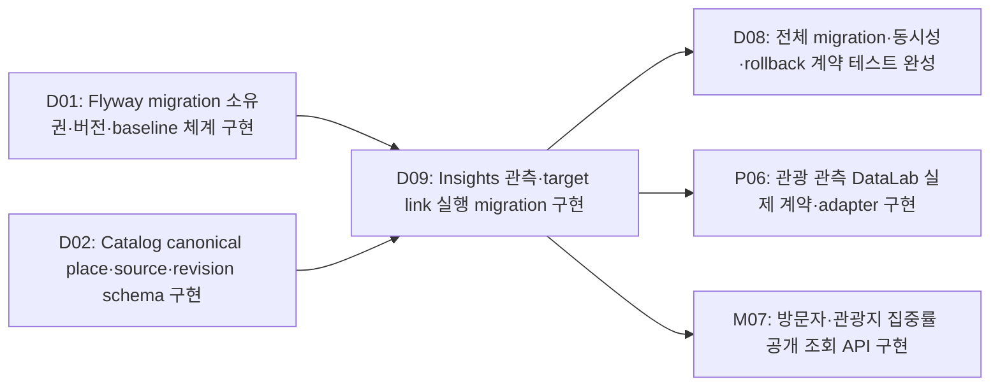
```mermaid
flowchart LR
  D01["D01: Flyway migration 소유권·버전·baseline 체계 구현"]
  D02["D02: Catalog canonical place·source·revision schema 구현"]
  D09["D09: Insights 관측·target link 실행 migration 구현"]
  D08["D08: 전체 migration·동시성·rollback 계약 테스트 완성"]
  P06["P06: 관광 관측 DataLab 실제 계약·adapter 구현"]
  M07["M07: 방문자·관광지 집중률 공개 조회 API 구현"]
  D01 --> D09
  D02 --> D09
  D09 --> D08
  D09 --> P06
  D09 --> M07
```

### Expected Touch Points

- `db/migration/insights`
- `adapters/persistence-jpa/src/main/java/com/yrootlab/onmaru/persistence/insights`

### Parallel Safety / Conflict Notes

insights 전용 migration 범위로 다른 context migration과 병렬 가능.

### Acceptance Criteria

- [ ] DBML의 insights 네 테이블과 FK·unique·range constraint가 migration으로 재현됨
- [ ] clean/upgrade migration과 잘못된 단위·음수·고아 revision 거부 test 통과

### Verification Method

PostgreSQL/PostGIS repository migration tests

### Agent Session State

- blocked-by가 모두 Closed이면 `Ready`.
- 담당자 또는 연결된 열린 PR이 있으면 `In progress`.
- blocked-by가 하나라도 Open이면 `Waiting`이며 구현을 시작하지 않는다.
- PR CI·review 중에는 `Review`; merge와 AC 확인 후에만 `Done`으로 닫는다.

## P01. 관광공사 API 실제 응답·quota·license qualification

**Priority:** P0

**Wave:** 0

**Parent Track:** TB

### Objective

서버 호출 가능한 operation과 공개 가능한 필드를 증거로 고정한다.

### Context

FE 호출 성공은 서버 pagination·quota·license 계약의 증거가 아니다.

### Scope

국문/위치/상세 API live capture, quota/header, 이용약관·출처, redacted fixtures

### Out of Scope

서비스 key 기록

### Implementation Notes

확인 실패 항목은 LIVE_CANONICAL blocker로 남긴다.

### Related Code / Modules

docs/reference-snapshots/tourapi, testing/fixtures/provider

### Dependencies (blocked-by)

- 없음 (즉시 Ready 후보)

### Blocks

- P02: TourAPI HTTP client·envelope parser 구현

### Position in Graph

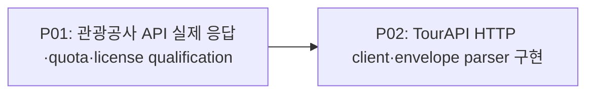
```mermaid
flowchart LR
  P01["P01: 관광공사 API 실제 응답·quota·license qualification"]
  P02["P02: TourAPI HTTP client·envelope parser 구현"]
  P01 --> P02
```

### Expected Touch Points

- `docs/reference-snapshots/tourapi`
- `testing/fixtures/provider/tourapi`

### Parallel Safety / Conflict Notes

코드 scaffold와 독립 조사 가능.

### Acceptance Criteria

- [ ] 정상·빈·마지막 page·200 오류·4xx/5xx/429 fixture 확보
- [ ] quota와 license/attribution 근거 기록

### Verification Method

redacted live capture manifest와 schema check

### Agent Session State

- blocked-by가 모두 Closed이면 `Ready`.
- 담당자 또는 연결된 열린 PR이 있으면 `In progress`.
- blocked-by가 하나라도 Open이면 `Waiting`이며 구현을 시작하지 않는다.
- PR CI·review 중에는 `Review`; merge와 AC 확인 후에만 `Done`으로 닫는다.

## P02. TourAPI HTTP client·envelope parser 구현

**Priority:** P0

**Wave:** 1

**Parent Track:** TB

### Objective

외부 응답을 typed source record 또는 명시 오류로 변환한다.

### Context

HTTP 200 error envelope와 singleton/list 변형을 성공으로 세면 안 된다.

### Scope

timeouts, retry classification, content type, XML/JSON envelope, pagination

### Out of Scope

DB publish

### Implementation Notes

connect1s/attempt5s/page12s/retry2 기본을 configuration으로 둔다.

### Related Code / Modules

adapters/tourism-api/src/main/java/com/yrootlab/onmaru/tourism/catalog

### Dependencies (blocked-by)

- F01: Java 21·Spring Boot·Gradle Wrapper 멀티모듈 골격 구축
- P01: 관광공사 API 실제 응답·quota·license qualification

### Blocks

- P03: 03:00 KST sync scheduler·lease·checkpoint 구현
- P04: Source validation·category mapping·quarantine 구현

### Position in Graph

```mermaid
flowchart LR
  F01["F01: Java 21·Spring Boot·Gradle Wrapper 멀티모듈 골격 구축"]
  P01["P01: 관광공사 API 실제 응답·quota·license qualification"]
  P02["P02: TourAPI HTTP client·envelope parser 구현"]
  P03["P03: 03:00 KST sync scheduler·lease·checkpoint 구현"]
  P04["P04: Source validation·category mapping·quarantine 구현"]
  F01 --> P02
  P01 --> P02
  P02 --> P03
  P02 --> P04
```

### Expected Touch Points

- `adapters/tourism-api/src/main/java/com/yrootlab/onmaru/tourism/catalog/client`

### Parallel Safety / Conflict Notes

provider client package 단독.

### Acceptance Criteria

- [ ] qualification fixture 전부 typed parse
- [ ] 429 Retry-After와 non-retryable auth/schema drift 분류

### Verification Method

mock HTTP contract tests

### Agent Session State

- blocked-by가 모두 Closed이면 `Ready`.
- 담당자 또는 연결된 열린 PR이 있으면 `In progress`.
- blocked-by가 하나라도 Open이면 `Waiting`이며 구현을 시작하지 않는다.
- PR CI·review 중에는 `Review`; merge와 AC 확인 후에만 `Done`으로 닫는다.

## P03. 03:00 KST sync scheduler·lease·checkpoint 구현

**Priority:** P0

**Wave:** 3

**Parent Track:** TB

### Objective

누락 일정을 복구하며 dataset 작업을 중복 실행하지 않는다.

### Context

worker1·HTTP concurrency1·dataset 순차·30분 budget 정책이다.

### Scope

schedule catch-up, fenced lease heartbeat, page checkpoint, retry schedule

### Out of Scope

publish 전환

### Implementation Notes

외부 HTTP 중 DB transaction을 잡지 않는다.

### Related Code / Modules

modules/catalog/application/sync, apps/spring-api/scheduling/catalog

### Dependencies (blocked-by)

- D02: Catalog canonical place·source·revision schema 구현
- D07: Sync run·lease·checkpoint·quarantine·outbox schema 구현
- P02: TourAPI HTTP client·envelope parser 구현

### Blocks

- P05: Dataset revision 원자 게시·watermark·tombstone 구현
- A02: Odii 수집·revision·tombstone publish 구현

### Position in Graph

```mermaid
flowchart LR
  D02["D02: Catalog canonical place·source·revision schema 구현"]
  D07["D07: Sync run·lease·checkpoint·quarantine·outbox schema 구현"]
  P02["P02: TourAPI HTTP client·envelope parser 구현"]
  P03["P03: 03:00 KST sync scheduler·lease·checkpoint 구현"]
  P05["P05: Dataset revision 원자 게시·watermark·tombstone 구현"]
  A02["A02: Odii 수집·revision·tombstone publish 구현"]
  D02 --> P03
  D07 --> P03
  P02 --> P03
  P03 --> P05
  P03 --> A02
```

### Expected Touch Points

- `modules/catalog/src/main/java/com/yrootlab/onmaru/catalog/application/sync`
- `apps/spring-api/src/main/java/com/yrootlab/onmaru/scheduling/catalog`

### Parallel Safety / Conflict Notes

publish 로직과 package 분리.

### Acceptance Criteria

- [ ] 03시 sleep 후 재기동 시 일정 한 번 실행
- [ ] page 실패 재개와 lease loss late write 0

### Verification Method

fake clock + DB + mock source tests

### Agent Session State

- blocked-by가 모두 Closed이면 `Ready`.
- 담당자 또는 연결된 열린 PR이 있으면 `In progress`.
- blocked-by가 하나라도 Open이면 `Waiting`이며 구현을 시작하지 않는다.
- PR CI·review 중에는 `Review`; merge와 AC 확인 후에만 `Done`으로 닫는다.

## P04. Source validation·category mapping·quarantine 구현

**Priority:** P0

**Wave:** 3

**Parent Track:** TB

### Objective

허용 category만 canonical 후보로 만들고 잘못된 row를 격리한다.

### Context

매핑 불명확한 source row를 추정 공개하지 않는다.

### Scope

schema validation, normalized hash, allowlist version, quarantine redaction

### Out of Scope

revision activation

### Implementation Notes

HANOK/STAY/CAFE/EXPERIENCE/MARKET와 승인 관광지 매핑을 fixture로 검증.

### Related Code / Modules

modules/catalog/application/qualification, adapters/tourism-api/catalog/mapping

### Dependencies (blocked-by)

- D02: Catalog canonical place·source·revision schema 구현
- D07: Sync run·lease·checkpoint·quarantine·outbox schema 구현
- P02: TourAPI HTTP client·envelope parser 구현

### Blocks

- P05: Dataset revision 원자 게시·watermark·tombstone 구현

### Position in Graph

```mermaid
flowchart LR
  D02["D02: Catalog canonical place·source·revision schema 구현"]
  D07["D07: Sync run·lease·checkpoint·quarantine·outbox schema 구현"]
  P02["P02: TourAPI HTTP client·envelope parser 구현"]
  P04["P04: Source validation·category mapping·quarantine 구현"]
  P05["P05: Dataset revision 원자 게시·watermark·tombstone 구현"]
  D02 --> P04
  D07 --> P04
  P02 --> P04
  P04 --> P05
```

### Expected Touch Points

- `modules/catalog/src/main/java/com/yrootlab/onmaru/catalog/application/qualification`
- `adapters/tourism-api/src/main/java/com/yrootlab/onmaru/tourism/catalog/mapping`

### Parallel Safety / Conflict Notes

P03 scheduler와 파일 분리.

### Acceptance Criteria

- [ ] 미지원/결측/잘못된 좌표 row 비공개
- [ ] quarantine에 key/token 원문 없음

### Verification Method

mapping fixtures and redaction tests

### Agent Session State

- blocked-by가 모두 Closed이면 `Ready`.
- 담당자 또는 연결된 열린 PR이 있으면 `In progress`.
- blocked-by가 하나라도 Open이면 `Waiting`이며 구현을 시작하지 않는다.
- PR CI·review 중에는 `Review`; merge와 AC 확인 후에만 `Done`으로 닫는다.

## P05. Dataset revision 원자 게시·watermark·tombstone 구현

**Priority:** P0

**Wave:** 4

**Parent Track:** TB

### Objective

완주한 revision만 공개하고 실패 시 LKG를 유지한다.

### Context

ADR-0006은 partial dataset 노출을 금지한다.

### Scope

stage validation, publish CAS, watermark advance, deletion/tombstone, revision GC hook

### Out of Scope

GC 운영 schedule

### Implementation Notes

빈 full sync와 delta delete를 구분한다.

### Related Code / Modules

modules/catalog/application/publication, adapters/persistence-jpa/publication

### Dependencies (blocked-by)

- P03: 03:00 KST sync scheduler·lease·checkpoint 구현
- P04: Source validation·category mapping·quarantine 구현

### Blocks

- C02: 한옥 목록 검색·필터·cursor API 구현
- C03: Canonical place·한옥 상세 API 구현
- C05: 주변·지도 canonical 장소 조회 API 구현
- M01: 행정구역 resolve·VisitReview 지역 집계 API 구현
- A02: Odii 수집·revision·tombstone publish 구현
- AI03: 검증 데이터 deterministic baseline 검색·ranking 구현
- AI07: Revision-pinned corpus export·manifest sync 구현
- O06: TourAPI·Odii·FastAPI·SSE 장애 복구 리허설
- O08: TTL·revision GC·회원 탈퇴 cleanup·복원 삭제 ledger 구현

### Position in Graph

```mermaid
flowchart LR
  P03["P03: 03:00 KST sync scheduler·lease·checkpoint 구현"]
  P04["P04: Source validation·category mapping·quarantine 구현"]
  P05["P05: Dataset revision 원자 게시·watermark·tombstone 구현"]
  C02["C02: 한옥 목록 검색·필터·cursor API 구현"]
  C03["C03: Canonical place·한옥 상세 API 구현"]
  C05["C05: 주변·지도 canonical 장소 조회 API 구현"]
  M01["M01: 행정구역 resolve·VisitReview 지역 집계 API 구현"]
  A02["A02: Odii 수집·revision·tombstone publish 구현"]
  AI03["AI03: 검증 데이터 deterministic baseline 검색·ranking 구현"]
  AI07["AI07: Revision-pinned corpus export·manifest sync 구현"]
  O06["O06: TourAPI·Odii·FastAPI·SSE 장애 복구 리허설"]
  O08["O08: TTL·revision GC·회원 탈퇴 cleanup·복원 삭제 ledger 구현"]
  P03 --> P05
  P04 --> P05
  P05 --> C02
  P05 --> C03
  P05 --> C05
  P05 --> M01
  P05 --> A02
  P05 --> AI03
  P05 --> AI07
  P05 --> O06
  P05 --> O08
```

### Expected Touch Points

- `modules/catalog/src/main/java/com/yrootlab/onmaru/catalog/application/publication`
- `adapters/persistence-jpa/src/main/java/com/yrootlab/onmaru/persistence/publication`

### Parallel Safety / Conflict Notes

qualification 이후 직렬.

### Acceptance Criteria

- [ ] 마지막 page 실패 시 active revision/watermark 불변
- [ ] 두 번 publish와 stale lease writer가 결과를 바꾸지 않음

### Verification Method

publication concurrency integration tests

### Agent Session State

- blocked-by가 모두 Closed이면 `Ready`.
- 담당자 또는 연결된 열린 PR이 있으면 `In progress`.
- blocked-by가 하나라도 Open이면 `Waiting`이며 구현을 시작하지 않는다.
- PR CI·review 중에는 `Review`; merge와 AC 확인 후에만 `Done`으로 닫는다.

## P06. 관광 관측 DataLab 실제 계약·adapter 구현

**Priority:** P2

**Wave:** 4

**Parent Track:** TB

### Objective

날짜·공간 단위가 명확한 관측만 typed observation으로 저장한다.

### Context

지역 방문자 수를 장소 실시간 인원으로 표현하지 않는다.

### Scope

live qualification, response fixture, adapter, observation provenance/status

### Out of Scope

근거 없는 crowd score

### Implementation Notes

mapping 불가 target은 UNKNOWN으로 둔다.

### Related Code / Modules

adapters/tourism-api/insights, modules/insights

### Dependencies (blocked-by)

- F01: Java 21·Spring Boot·Gradle Wrapper 멀티모듈 골격 구축
- D02: Catalog canonical place·source·revision schema 구현
- D07: Sync run·lease·checkpoint·quarantine·outbox schema 구현
- D09: Insights 관측·target link 실행 migration 구현
- P07: 행정구역 경계 source qualification·revision import 구현

### Blocks

- M07: 방문자·관광지 집중률 공개 조회 API 구현

### Position in Graph

```mermaid
flowchart LR
  F01["F01: Java 21·Spring Boot·Gradle Wrapper 멀티모듈 골격 구축"]
  D02["D02: Catalog canonical place·source·revision schema 구현"]
  D07["D07: Sync run·lease·checkpoint·quarantine·outbox schema 구현"]
  D09["D09: Insights 관측·target link 실행 migration 구현"]
  P07["P07: 행정구역 경계 source qualification·revision import 구현"]
  P06["P06: 관광 관측 DataLab 실제 계약·adapter 구현"]
  M07["M07: 방문자·관광지 집중률 공개 조회 API 구현"]
  F01 --> P06
  D02 --> P06
  D07 --> P06
  D09 --> P06
  P07 --> P06
  P06 --> M07
```

### Expected Touch Points

- `adapters/tourism-api/src/main/java/com/yrootlab/onmaru/tourism/insights`
- `modules/insights`

### Parallel Safety / Conflict Notes

catalog sync와 별도 dataset/package.

### Acceptance Criteria

- [ ] basisDate/spatialLevel/source/status 보존
- [ ] 결측을 0 또는 실시간으로 변환하지 않음

### Verification Method

provider fixture and DB integration tests

### Agent Session State

- blocked-by가 모두 Closed이면 `Ready`.
- 담당자 또는 연결된 열린 PR이 있으면 `In progress`.
- blocked-by가 하나라도 Open이면 `Waiting`이며 구현을 시작하지 않는다.
- PR CI·review 중에는 `Review`; merge와 AC 확인 후에만 `Done`으로 닫는다.

## P07. 행정구역 경계 source qualification·revision import 구현

**Priority:** P1

**Wave:** 3

**Parent Track:** TB

### Objective

좌표 resolve와 지역 관측에 사용할 행정경계를 출처·권리·revision과 함께 안전하게 적재한다.

### Context

검증된 경계 자료가 없으면 좌표→지역 기능을 활성화할 수 없다.

### Scope

source/license qualification, SIDO/SIGUNGU code mapping, MultiPolygon validation, revision import/activation

### Out of Scope

FE GeoJSON 렌더링·반경 검색

### Implementation Notes

유효하지 않은 geometry와 부모 없는 code를 quarantine하고 원본 출처·관측시각을 보존한다.

### Related Code / Modules

docs/reference-snapshots/region-boundaries, modules/catalog/region-boundary, apps/spring-api/scheduling/region-boundary

### Dependencies (blocked-by)

- D02: Catalog canonical place·source·revision schema 구현
- D07: Sync run·lease·checkpoint·quarantine·outbox schema 구현
- F07: Backend 설계 입력 snapshot·provenance manifest 고정

### Blocks

- P06: 관광 관측 DataLab 실제 계약·adapter 구현
- M01: 행정구역 resolve·VisitReview 지역 집계 API 구현

### Position in Graph

```mermaid
flowchart LR
  D02["D02: Catalog canonical place·source·revision schema 구현"]
  D07["D07: Sync run·lease·checkpoint·quarantine·outbox schema 구현"]
  F07["F07: Backend 설계 입력 snapshot·provenance manifest 고정"]
  P07["P07: 행정구역 경계 source qualification·revision import 구현"]
  P06["P06: 관광 관측 DataLab 실제 계약·adapter 구현"]
  M01["M01: 행정구역 resolve·VisitReview 지역 집계 API 구현"]
  D02 --> P07
  D07 --> P07
  F07 --> P07
  P07 --> P06
  P07 --> M01
```

### Expected Touch Points

- `docs/reference-snapshots/region-boundaries`
- `modules/catalog/src/main/java/com/yrootlab/onmaru/catalog/regionboundary`
- `apps/spring-api/src/main/java/com/yrootlab/onmaru/scheduling/regionboundary`

### Parallel Safety / Conflict Notes

TourAPI place ingestion과 별도 dataset·scheduler package를 사용.

### Acceptance Criteria

- [ ] 경계 source URL·license·attribution·revision hash 증거 기록
- [ ] 서울/부산 동명 구·구 없는 시군·경계점 fixture와 invalid geometry quarantine 통과

### Verification Method

source manifest, PostGIS import and boundary resolution tests

### Agent Session State

- blocked-by가 모두 Closed이면 `Ready`.
- 담당자 또는 연결된 열린 PR이 있으면 `In progress`.
- blocked-by가 하나라도 Open이면 `Waiting`이며 구현을 시작하지 않는다.
- PR CI·review 중에는 `Review`; merge와 AC 확인 후에만 `Done`으로 닫는다.

## C01. R1 한옥·장소·찜 OpenAPI와 fixture 동결

**Priority:** P0

**Wave:** 0

**Parent Track:** TC

### Objective

Spring과 FE가 공유할 R1 기계 계약을 완성한다.

### Context

현재 Journey/VisitReview 외 한옥·저장 OpenAPI가 없다.

### Scope

hanok list/detail/monthly, place detail, saved place/list/timeline schemas and examples

### Out of Scope

endpoint code

### Implementation Notes

원본 contentId/pageNo/key는 public schema에 넣지 않는다.

### Related Code / Modules

docs/contracts/openapi/r1.openapi.yaml, docs/contracts/fixtures/r1

### Dependencies (blocked-by)

- 없음 (즉시 Ready 후보)

### Blocks

- C02: 한옥 목록 검색·필터·cursor API 구현
- C03: Canonical place·한옥 상세 API 구현
- C04: 월별 한옥 editorial edition·placement API 구현
- C05: 주변·지도 canonical 장소 조회 API 구현
- M06: 지도·Odii·관광 관측 R2 OpenAPI·fixture 동결

### Position in Graph

```mermaid
flowchart LR
  C01["C01: R1 한옥·장소·찜 OpenAPI와 fixture 동결"]
  C02["C02: 한옥 목록 검색·필터·cursor API 구현"]
  C03["C03: Canonical place·한옥 상세 API 구현"]
  C04["C04: 월별 한옥 editorial edition·placement API 구현"]
  C05["C05: 주변·지도 canonical 장소 조회 API 구현"]
  M06["M06: 지도·Odii·관광 관측 R2 OpenAPI·fixture 동결"]
  C01 --> C02
  C01 --> C03
  C01 --> C04
  C01 --> C05
  C01 --> M06
```

### Expected Touch Points

- `docs/contracts/openapi/r1.openapi.yaml`
- `docs/contracts/fixtures/r1`

### Parallel Safety / Conflict Notes

계약 파일 단일 소유.

### Acceptance Criteria

- [ ] 정상·빈·404·cursor·auth·unavailable 예제 schema 통과
- [ ] 한옥/지도/Odii 카드가 동일 placeId 사용

### Verification Method

OpenAPI lint and example validation

### Agent Session State

- blocked-by가 모두 Closed이면 `Ready`.
- 담당자 또는 연결된 열린 PR이 있으면 `In progress`.
- blocked-by가 하나라도 Open이면 `Waiting`이며 구현을 시작하지 않는다.
- PR CI·review 중에는 `Review`; merge와 AC 확인 후에만 `Done`으로 닫는다.

## C02. 한옥 목록 검색·필터·cursor API 구현

**Priority:** P1

**Wave:** 5

**Parent Track:** TC

### Objective

published snapshot에서 한옥 후보를 안정적으로 조회한다.

### Context

R1은 외부 API 실시간 호출 없이 작동해야 한다.

### Scope

keyword/region/category/hasImage, stable cursor, count/page response

### Out of Scope

monthly editorial

### Implementation Notes

NFC/trim과 deterministic sort를 적용한다.

### Related Code / Modules

modules/catalog/application/query/hanok, apps/spring-api/web/hanok

### Dependencies (blocked-by)

- P05: Dataset revision 원자 게시·watermark·tombstone 구현
- C01: R1 한옥·장소·찜 OpenAPI와 fixture 동결
- F06: Spring 공통 오류·cursor·멱등 command web 기반 구현

### Blocks

- C06: R1 serializer·OpenAPI·LKG 통합 게이트

### Position in Graph

```mermaid
flowchart LR
  P05["P05: Dataset revision 원자 게시·watermark·tombstone 구현"]
  C01["C01: R1 한옥·장소·찜 OpenAPI와 fixture 동결"]
  F06["F06: Spring 공통 오류·cursor·멱등 command web 기반 구현"]
  C02["C02: 한옥 목록 검색·필터·cursor API 구현"]
  C06["C06: R1 serializer·OpenAPI·LKG 통합 게이트"]
  P05 --> C02
  C01 --> C02
  F06 --> C02
  C02 --> C06
```

### Expected Touch Points

- `modules/catalog/src/main/java/com/yrootlab/onmaru/catalog/application/query/hanok`
- `apps/spring-api/src/main/java/com/yrootlab/onmaru/web/hanok/list`

### Parallel Safety / Conflict Notes

detail/monthly package와 분리.

### Acceptance Criteria

- [ ] 필터 조합·동률·cursor 만료/변조 테스트
- [ ] source 중단 중 동일 snapshot 응답

### Verification Method

MockMvc + PostGIS fixture tests

### Agent Session State

- blocked-by가 모두 Closed이면 `Ready`.
- 담당자 또는 연결된 열린 PR이 있으면 `In progress`.
- blocked-by가 하나라도 Open이면 `Waiting`이며 구현을 시작하지 않는다.
- PR CI·review 중에는 `Review`; merge와 AC 확인 후에만 `Done`으로 닫는다.

## C03. Canonical place·한옥 상세 API 구현

**Priority:** P1

**Wave:** 5

**Parent Track:** TC

### Objective

공개 가능한 현재 projection과 savedByMe를 상세 DTO로 제공한다.

### Context

raw provider row가 아니라 canonical placeId가 공개 정답이다.

### Scope

place/hanok detail, nullable provenance fields, eligibility, optional auth saved state

### Out of Scope

review list

### Implementation Notes

비공개·삭제·모호한 mapping은 404.

### Related Code / Modules

modules/catalog/application/query/detail, apps/spring-api/web/place

### Dependencies (blocked-by)

- P05: Dataset revision 원자 게시·watermark·tombstone 구현
- C01: R1 한옥·장소·찜 OpenAPI와 fixture 동결
- F06: Spring 공통 오류·cursor·멱등 command web 기반 구현

### Blocks

- C06: R1 serializer·OpenAPI·LKG 통합 게이트
- I05: Canonical 관광 장소 찜 PUT·DELETE 구현
- M02: VisitReview ALL·REGION·place 목록과 cursor 구현
- A04: Odii–canonical place 검수 연결과 projection 구현
- J04: Exploration·run snapshot DTO와 복구 조회 구현

### Position in Graph

```mermaid
flowchart LR
  P05["P05: Dataset revision 원자 게시·watermark·tombstone 구현"]
  C01["C01: R1 한옥·장소·찜 OpenAPI와 fixture 동결"]
  F06["F06: Spring 공통 오류·cursor·멱등 command web 기반 구현"]
  C03["C03: Canonical place·한옥 상세 API 구현"]
  C06["C06: R1 serializer·OpenAPI·LKG 통합 게이트"]
  I05["I05: Canonical 관광 장소 찜 PUT·DELETE 구현"]
  M02["M02: VisitReview ALL·REGION·place 목록과 cursor 구현"]
  A04["A04: Odii–canonical place 검수 연결과 projection 구현"]
  J04["J04: Exploration·run snapshot DTO와 복구 조회 구현"]
  P05 --> C03
  C01 --> C03
  F06 --> C03
  C03 --> C06
  C03 --> I05
  C03 --> M02
  C03 --> A04
  C03 --> J04
```

### Expected Touch Points

- `modules/catalog/src/main/java/com/yrootlab/onmaru/catalog/application/query/detail`
- `apps/spring-api/src/main/java/com/yrootlab/onmaru/web/place/detail`

### Parallel Safety / Conflict Notes

목록과 query package 분리.

### Acceptance Criteria

- [ ] 결측 필드를 조작하지 않고 null/상태로 표현
- [ ] 비공개/없는 place 404와 source outage 조회 통과

### Verification Method

API contract integration tests

### Agent Session State

- blocked-by가 모두 Closed이면 `Ready`.
- 담당자 또는 연결된 열린 PR이 있으면 `In progress`.
- blocked-by가 하나라도 Open이면 `Waiting`이며 구현을 시작하지 않는다.
- PR CI·review 중에는 `Review`; merge와 AC 확인 후에만 `Done`으로 닫는다.

## C04. 월별 한옥 editorial edition·placement API 구현

**Priority:** P1

**Wave:** 3

**Parent Track:** TC

### Objective

사람이 게시한 월별 순서와 이야기를 재현 가능하게 제공한다.

### Context

AI 큐레이션이 아닌 versioned editorial이 R1 기준이다.

### Scope

edition/placement persistence, publish validation, monthly query

### Out of Scope

관리자 UI·인기 자동 순위

### Implementation Notes

비공개 place 참조를 publish 시 거부한다.

### Related Code / Modules

modules/catalog/editorial, apps/spring-api/web/editorial, db/migration/catalog-editorial

### Dependencies (blocked-by)

- D02: Catalog canonical place·source·revision schema 구현
- C01: R1 한옥·장소·찜 OpenAPI와 fixture 동결
- F06: Spring 공통 오류·cursor·멱등 command web 기반 구현

### Blocks

- C06: R1 serializer·OpenAPI·LKG 통합 게이트

### Position in Graph

```mermaid
flowchart LR
  D02["D02: Catalog canonical place·source·revision schema 구현"]
  C01["C01: R1 한옥·장소·찜 OpenAPI와 fixture 동결"]
  F06["F06: Spring 공통 오류·cursor·멱등 command web 기반 구현"]
  C04["C04: 월별 한옥 editorial edition·placement API 구현"]
  C06["C06: R1 serializer·OpenAPI·LKG 통합 게이트"]
  D02 --> C04
  C01 --> C04
  F06 --> C04
  C04 --> C06
```

### Expected Touch Points

- `modules/catalog/src/main/java/com/yrootlab/onmaru/catalog/editorial`
- `apps/spring-api/src/main/java/com/yrootlab/onmaru/web/editorial`
- `db/migration/catalog_editorial`

### Parallel Safety / Conflict Notes

source ingestion과 별도 editorial aggregate.

### Acceptance Criteria

- [ ] 월 없음은 빈 배열
- [ ] published placement 순서와 revision 재현

### Verification Method

domain + API + DB tests

### Agent Session State

- blocked-by가 모두 Closed이면 `Ready`.
- 담당자 또는 연결된 열린 PR이 있으면 `In progress`.
- blocked-by가 하나라도 Open이면 `Waiting`이며 구현을 시작하지 않는다.
- PR CI·review 중에는 `Review`; merge와 AC 확인 후에만 `Done`으로 닫는다.

## C05. 주변·지도 canonical 장소 조회 API 구현

**Priority:** P1

**Wave:** 5

**Parent Track:** TC

### Objective

공개 장소를 반경·거리순으로 안전하게 조회한다.

### Context

지도 drag 자체는 후기 본문 요청을 만들지 않지만 장소 탐색은 canonical catalog를 사용한다.

### Scope

nearby, category filter, coordinate validation, distance projection

### Out of Scope

viewport 후기·실시간 혼잡

### Implementation Notes

geography와 lon/lat 축을 고정한다.

### Related Code / Modules

modules/catalog/application/query/spatial, apps/spring-api/web/map/place

### Dependencies (blocked-by)

- P05: Dataset revision 원자 게시·watermark·tombstone 구현
- C01: R1 한옥·장소·찜 OpenAPI와 fixture 동결
- F06: Spring 공통 오류·cursor·멱등 command web 기반 구현

### Blocks

- 없음

### Position in Graph

```mermaid
flowchart LR
  P05["P05: Dataset revision 원자 게시·watermark·tombstone 구현"]
  C01["C01: R1 한옥·장소·찜 OpenAPI와 fixture 동결"]
  F06["F06: Spring 공통 오류·cursor·멱등 command web 기반 구현"]
  C05["C05: 주변·지도 canonical 장소 조회 API 구현"]
  P05 --> C05
  C01 --> C05
  F06 --> C05
```

### Expected Touch Points

- `modules/catalog/src/main/java/com/yrootlab/onmaru/catalog/application/query/spatial`
- `apps/spring-api/src/main/java/com/yrootlab/onmaru/web/map/place`

### Parallel Safety / Conflict Notes

한옥 query와 별도 spatial package.

### Acceptance Criteria

- [ ] 반경 경계·거리순·축 fixture 통과
- [ ] 비공개/좌표 없음 제외와 limit 준수

### Verification Method

PostGIS API integration tests

### Agent Session State

- blocked-by가 모두 Closed이면 `Ready`.
- 담당자 또는 연결된 열린 PR이 있으면 `In progress`.
- blocked-by가 하나라도 Open이면 `Waiting`이며 구현을 시작하지 않는다.
- PR CI·review 중에는 `Review`; merge와 AC 확인 후에만 `Done`으로 닫는다.

## C06. R1 serializer·OpenAPI·LKG 통합 게이트

**Priority:** P1

**Wave:** 7

**Parent Track:** TC

### Objective

한옥 R1을 FE 전달 가능한 실행 계약으로 증명한다.

### Context

문서와 구현의 drift를 endpoint별 contract test로 차단한다.

### Scope

serializer examples, fixture seed, source outage E2E, Swagger publication, place save/savedByMe

### Out of Scope

FE component test

### Implementation Notes

OpenAPI generated diff를 CI에 연결한다.

### Related Code / Modules

apps/spring-api/src/test/java/com/yrootlab/onmaru/r1, docs/contracts/openapi/r1.openapi.yaml

### Dependencies (blocked-by)

- C02: 한옥 목록 검색·필터·cursor API 구현
- C03: Canonical place·한옥 상세 API 구현
- C04: 월별 한옥 editorial edition·placement API 구현
- I05: Canonical 관광 장소 찜 PUT·DELETE 구현
- F05: OpenAPI·JSON Schema·DBML 검증 CI 구축

### Blocks

- O05: API·DB·SSE 부하·성능 예산 검증
- O09: Backend 전체 staging release gate와 운영 인수 완료

### Position in Graph

```mermaid
flowchart LR
  C02["C02: 한옥 목록 검색·필터·cursor API 구현"]
  C03["C03: Canonical place·한옥 상세 API 구현"]
  C04["C04: 월별 한옥 editorial edition·placement API 구현"]
  I05["I05: Canonical 관광 장소 찜 PUT·DELETE 구현"]
  F05["F05: OpenAPI·JSON Schema·DBML 검증 CI 구축"]
  C06["C06: R1 serializer·OpenAPI·LKG 통합 게이트"]
  O05["O05: API·DB·SSE 부하·성능 예산 검증"]
  O09["O09: Backend 전체 staging release gate와 운영 인수 완료"]
  C02 --> C06
  C03 --> C06
  C04 --> C06
  I05 --> C06
  F05 --> C06
  C06 --> O05
  C06 --> O09
```

### Expected Touch Points

- `apps/spring-api/src/test/java/com/yrootlab/onmaru/r1`

### Parallel Safety / Conflict Notes

R1 endpoints와 장소 찜 완료 후 통합 tests만 소유.

### Acceptance Criteria

- [ ] Swagger와 runtime response schema 일치
- [ ] TourAPI 차단 상태에서 목록·상세·월별·장소 찜 E2E 통과
- [ ] 익명/회원 savedByMe와 반복 PUT/DELETE fixture 통과

### Verification Method

contract + E2E suite

### Agent Session State

- blocked-by가 모두 Closed이면 `Ready`.
- 담당자 또는 연결된 열린 PR이 있으면 `In progress`.
- blocked-by가 하나라도 Open이면 `Waiting`이며 구현을 시작하지 않는다.
- PR CI·review 중에는 `Review`; merge와 AC 확인 후에만 `Done`으로 닫는다.

## I01. Kakao OAuth state·callback·opaque session 구현

**Priority:** P0

**Wave:** 4

**Parent Track:** TD

### Objective

provider token을 브라우저에 저장하지 않는 회원 로그인을 제공한다.

### Context

ADR-0008에 따라 server session cookie를 발급한다.

### Scope

login redirect, state PKCE/nonce policy, callback, identity link, session rotate

### Out of Scope

다른 provider·비밀번호

### Implementation Notes

callback 실패가 guest data를 삭제하지 않게 한다.

### Related Code / Modules

modules/identity, apps/spring-api/security/oauth/kakao

### Dependencies (blocked-by)

- D03: Member·OAuth identity·session·guest grant schema 구현
- F06: Spring 공통 오류·cursor·멱등 command web 기반 구현
- O03: Server-only secret loading·rotation·redaction 정책 구현
- F08: 공개 API rate-limit·IP/member admission 기반 구현
- F09: 인증·회원·SavedResource OpenAPI·fixture 동결

### Blocks

- I02: Guest grant·exploration 소유권 승계 구현
- I04: 회원 조회·logout·탈퇴·보존 lifecycle 구현
- I05: Canonical 관광 장소 찜 PUT·DELETE 구현
- I06: Odii story 저장과 saved-resource 목록 구현
- J08: Saved journey 생성·목록·상세·재개·삭제 구현
- J09: Guest·member AI 일일 quota와 admission 구현

### Position in Graph

```mermaid
flowchart LR
  D03["D03: Member·OAuth identity·session·guest grant schema 구현"]
  F06["F06: Spring 공통 오류·cursor·멱등 command web 기반 구현"]
  O03["O03: Server-only secret loading·rotation·redaction 정책 구현"]
  F08["F08: 공개 API rate-limit·IP/member admission 기반 구현"]
  F09["F09: 인증·회원·SavedResource OpenAPI·fixture 동결"]
  I01["I01: Kakao OAuth state·callback·opaque session 구현"]
  I02["I02: Guest grant·exploration 소유권 승계 구현"]
  I04["I04: 회원 조회·logout·탈퇴·보존 lifecycle 구현"]
  I05["I05: Canonical 관광 장소 찜 PUT·DELETE 구현"]
  I06["I06: Odii story 저장과 saved-resource 목록 구현"]
  J08["J08: Saved journey 생성·목록·상세·재개·삭제 구현"]
  J09["J09: Guest·member AI 일일 quota와 admission 구현"]
  D03 --> I01
  F06 --> I01
  O03 --> I01
  F08 --> I01
  F09 --> I01
  I01 --> I02
  I01 --> I04
  I01 --> I05
  I01 --> I06
  I01 --> J08
  I01 --> J09
```

### Expected Touch Points

- `modules/identity/src/main/java/com/yrootlab/onmaru/identity/oauth`
- `apps/spring-api/src/main/java/com/yrootlab/onmaru/security/oauth/kakao`

### Parallel Safety / Conflict Notes

session/CSRF 후속과 직렬.

### Acceptance Criteria

- [ ] state 재사용·변조·issuer 혼동 거부
- [ ] 동시 callback에도 고아 member 0

### Verification Method

OAuth mock + DB security tests

### Agent Session State

- blocked-by가 모두 Closed이면 `Ready`.
- 담당자 또는 연결된 열린 PR이 있으면 `In progress`.
- blocked-by가 하나라도 Open이면 `Waiting`이며 구현을 시작하지 않는다.
- PR CI·review 중에는 `Review`; merge와 AC 확인 후에만 `Done`으로 닫는다.

## I02. Guest grant·exploration 소유권 승계 구현

**Priority:** P0

**Wave:** 5

**Parent Track:** TD

### Objective

로그인 전 탐색 소유권을 제한된 grant로 안전하게 연결한다.

### Context

guest token은 member ID나 저장 권한이 아니다.

### Scope

guest cookie hash, grant expiry/scope, login claim, replay prevention

### Out of Scope

자동 장소 찜

### Implementation Notes

로그인 성공 자체로 resource를 저장하지 않는다.

### Related Code / Modules

modules/identity/guest, modules/journey/ownership

### Dependencies (blocked-by)

- I01: Kakao OAuth state·callback·opaque session 구현
- D04: Exploration·run·saved journey·saved resource schema 구현

### Blocks

- J01: Exploration 생성·조회·turn intake와 소유권 구현

### Position in Graph

```mermaid
flowchart LR
  I01["I01: Kakao OAuth state·callback·opaque session 구현"]
  D04["D04: Exploration·run·saved journey·saved resource schema 구현"]
  I02["I02: Guest grant·exploration 소유권 승계 구현"]
  J01["J01: Exploration 생성·조회·turn intake와 소유권 구현"]
  I01 --> I02
  D04 --> I02
  I02 --> J01
```

### Expected Touch Points

- `modules/identity/src/main/java/com/yrootlab/onmaru/identity/guest`
- `modules/journey/src/main/java/com/yrootlab/onmaru/journey/ownership`

### Parallel Safety / Conflict Notes

Kakao callback 이후 별도 use case.

### Acceptance Criteria

- [ ] 타 actor grant 404와 만료 거부
- [ ] 성공 claim 한 번, 재사용 0

### Verification Method

ownership integration tests

### Agent Session State

- blocked-by가 모두 Closed이면 `Ready`.
- 담당자 또는 연결된 열린 PR이 있으면 `In progress`.
- blocked-by가 하나라도 Open이면 `Waiting`이며 구현을 시작하지 않는다.
- PR CI·review 중에는 `Review`; merge와 AC 확인 후에만 `Done`으로 닫는다.

## I03. CSRF·cookie·인가·private cache 보안 경계 구현

**Priority:** P0

**Wave:** 3

**Parent Track:** TD

### Objective

unsafe request와 개인 응답의 browser 보안 정책을 강제한다.

### Context

same-origin HttpOnly/Secure session과 CSRF header가 기본이다.

### Scope

csrf token API, cookie flags, CORS, no-store, ownership 404, security headers

### Out of Scope

OAuth provider flow

### Implementation Notes

실제 key/token/query를 로그에 남기지 않는다.

### Related Code / Modules

apps/spring-api/security/web

### Dependencies (blocked-by)

- F06: Spring 공통 오류·cursor·멱등 command web 기반 구현
- D03: Member·OAuth identity·session·guest grant schema 구현
- O03: Server-only secret loading·rotation·redaction 정책 구현

### Blocks

- I04: 회원 조회·logout·탈퇴·보존 lifecycle 구현
- I05: Canonical 관광 장소 찜 PUT·DELETE 구현
- I06: Odii story 저장과 saved-resource 목록 구현
- M03: VisitReview 작성·본인 삭제·멱등성 구현
- M05: VisitReview 신고·moderation audit·운영 명령 구현
- J01: Exploration 생성·조회·turn intake와 소유권 구현
- J05: SSE stage·terminal·heartbeat·replay/reset 구현
- J08: Saved journey 생성·목록·상세·재개·삭제 구현

### Position in Graph

```mermaid
flowchart LR
  F06["F06: Spring 공통 오류·cursor·멱등 command web 기반 구현"]
  D03["D03: Member·OAuth identity·session·guest grant schema 구현"]
  O03["O03: Server-only secret loading·rotation·redaction 정책 구현"]
  I03["I03: CSRF·cookie·인가·private cache 보안 경계 구현"]
  I04["I04: 회원 조회·logout·탈퇴·보존 lifecycle 구현"]
  I05["I05: Canonical 관광 장소 찜 PUT·DELETE 구현"]
  I06["I06: Odii story 저장과 saved-resource 목록 구현"]
  M03["M03: VisitReview 작성·본인 삭제·멱등성 구현"]
  M05["M05: VisitReview 신고·moderation audit·운영 명령 구현"]
  J01["J01: Exploration 생성·조회·turn intake와 소유권 구현"]
  J05["J05: SSE stage·terminal·heartbeat·replay/reset 구현"]
  J08["J08: Saved journey 생성·목록·상세·재개·삭제 구현"]
  F06 --> I03
  D03 --> I03
  O03 --> I03
  I03 --> I04
  I03 --> I05
  I03 --> I06
  I03 --> M03
  I03 --> M05
  I03 --> J01
  I03 --> J05
  I03 --> J08
```

### Expected Touch Points

- `apps/spring-api/src/main/java/com/yrootlab/onmaru/security/web`

### Parallel Safety / Conflict Notes

OAuth package와 분리.

### Acceptance Criteria

- [ ] CSRF 없음/틀림 403과 타인 resource 404
- [ ] 개인 응답 no-store와 cookie flags 검증

### Verification Method

MockMvc security negative tests

### Agent Session State

- blocked-by가 모두 Closed이면 `Ready`.
- 담당자 또는 연결된 열린 PR이 있으면 `In progress`.
- blocked-by가 하나라도 Open이면 `Waiting`이며 구현을 시작하지 않는다.
- PR CI·review 중에는 `Review`; merge와 AC 확인 후에만 `Done`으로 닫는다.

## I04. 회원 조회·logout·탈퇴·보존 lifecycle 구현

**Priority:** P1

**Wave:** 5

**Parent Track:** TD

### Objective

회원 세션 폐기와 비동기 탈퇴를 재노출 없이 처리한다.

### Context

탈퇴는 active run 취소와 late result 차단을 포함한다.

### Scope

members/me, logout, DELETING, cleanup command, deletion ledger

### Out of Scope

프로필 편집

### Implementation Notes

backup 복원 후 삭제 재적용 근거를 남긴다.

### Related Code / Modules

modules/identity/member-lifecycle, apps/spring-api/web/member

### Dependencies (blocked-by)

- I01: Kakao OAuth state·callback·opaque session 구현
- I03: CSRF·cookie·인가·private cache 보안 경계 구현
- D04: Exploration·run·saved journey·saved resource schema 구현
- F09: 인증·회원·SavedResource OpenAPI·fixture 동결

### Blocks

- O08: TTL·revision GC·회원 탈퇴 cleanup·복원 삭제 ledger 구현

### Position in Graph

```mermaid
flowchart LR
  I01["I01: Kakao OAuth state·callback·opaque session 구현"]
  I03["I03: CSRF·cookie·인가·private cache 보안 경계 구현"]
  D04["D04: Exploration·run·saved journey·saved resource schema 구현"]
  F09["F09: 인증·회원·SavedResource OpenAPI·fixture 동결"]
  I04["I04: 회원 조회·logout·탈퇴·보존 lifecycle 구현"]
  O08["O08: TTL·revision GC·회원 탈퇴 cleanup·복원 삭제 ledger 구현"]
  I01 --> I04
  I03 --> I04
  D04 --> I04
  F09 --> I04
  I04 --> O08
```

### Expected Touch Points

- `modules/identity/src/main/java/com/yrootlab/onmaru/identity/lifecycle`
- `apps/spring-api/src/main/java/com/yrootlab/onmaru/web/member`

### Parallel Safety / Conflict Notes

저장 기능과 별도 lifecycle package.

### Acceptance Criteria

- [ ] logout 즉시 세션 무효
- [ ] DELETING 회원 late run/save 재생성 0

### Verification Method

lifecycle integration tests

### Agent Session State

- blocked-by가 모두 Closed이면 `Ready`.
- 담당자 또는 연결된 열린 PR이 있으면 `In progress`.
- blocked-by가 하나라도 Open이면 `Waiting`이며 구현을 시작하지 않는다.
- PR CI·review 중에는 `Review`; merge와 AC 확인 후에만 `Done`으로 닫는다.

## I05. Canonical 관광 장소 찜 PUT·DELETE 구현

**Priority:** P1

**Wave:** 6

**Parent Track:** TD

### Objective

한옥·지도·Odii 연결 카드가 동일 placeId 저장 상태를 공유한다.

### Context

원본 contentId나 운영정보 row를 저장하지 않는다.

### Scope

save/unsave place, eligibility port, idempotent desired state, savedByMe projection

### Out of Scope

컬렉션·메모

### Implementation Notes

현재 public projection을 command마다 재검증.

### Related Code / Modules

modules/journey/saved-resource/place, apps/spring-api/web/saved/place

### Dependencies (blocked-by)

- D04: Exploration·run·saved journey·saved resource schema 구현
- C03: Canonical place·한옥 상세 API 구현
- I01: Kakao OAuth state·callback·opaque session 구현
- I03: CSRF·cookie·인가·private cache 보안 경계 구현
- F09: 인증·회원·SavedResource OpenAPI·fixture 동결

### Blocks

- C06: R1 serializer·OpenAPI·LKG 통합 게이트
- I07: 내 월간 활동 타임라인 read model 구현
- M09: R2 지도·후기·Odii·찜 통합 계약 E2E 게이트

### Position in Graph

```mermaid
flowchart LR
  D04["D04: Exploration·run·saved journey·saved resource schema 구현"]
  C03["C03: Canonical place·한옥 상세 API 구현"]
  I01["I01: Kakao OAuth state·callback·opaque session 구현"]
  I03["I03: CSRF·cookie·인가·private cache 보안 경계 구현"]
  F09["F09: 인증·회원·SavedResource OpenAPI·fixture 동결"]
  I05["I05: Canonical 관광 장소 찜 PUT·DELETE 구현"]
  C06["C06: R1 serializer·OpenAPI·LKG 통합 게이트"]
  I07["I07: 내 월간 활동 타임라인 read model 구현"]
  M09["M09: R2 지도·후기·Odii·찜 통합 계약 E2E 게이트"]
  D04 --> I05
  C03 --> I05
  I01 --> I05
  I03 --> I05
  F09 --> I05
  I05 --> C06
  I05 --> I07
  I05 --> M09
```

### Expected Touch Points

- `modules/journey/src/main/java/com/yrootlab/onmaru/journey/saved/place`
- `apps/spring-api/src/main/java/com/yrootlab/onmaru/web/saved/place`

### Parallel Safety / Conflict Notes

Odii 저장과 resource type package 분리.

### Acceptance Criteria

- [ ] 동일 PUT 중복 한 row와 반복 DELETE 성공
- [ ] 비공개/삭제/불명확 place 404

### Verification Method

concurrent API/DB tests

### Agent Session State

- blocked-by가 모두 Closed이면 `Ready`.
- 담당자 또는 연결된 열린 PR이 있으면 `In progress`.
- blocked-by가 하나라도 Open이면 `Waiting`이며 구현을 시작하지 않는다.
- PR CI·review 중에는 `Review`; merge와 AC 확인 후에만 `Done`으로 닫는다.

## I06. Odii story 저장과 saved-resource 목록 구현

**Priority:** P1

**Wave:** 7

**Parent Track:** TD

### Objective

보조 재생 저장과 type별 개인 목록을 제공한다.

### Context

ODII_STORY는 연결 장소 PLACE 찜을 대체하지 않는다.

### Scope

Odii PUT/DELETE, type-required list, cursor, current hydration

### Out of Scope

자동 place 저장

### Implementation Notes

PLACE와 ODII_STORY를 type 생략으로 섞지 않는다.

### Related Code / Modules

modules/journey/saved-resource/odii, apps/spring-api/web/saved/list

### Dependencies (blocked-by)

- D04: Exploration·run·saved journey·saved resource schema 구현
- A03: Odii story·음원·대본 공개 API 구현
- I01: Kakao OAuth state·callback·opaque session 구현
- I03: CSRF·cookie·인가·private cache 보안 경계 구현
- F09: 인증·회원·SavedResource OpenAPI·fixture 동결

### Blocks

- I07: 내 월간 활동 타임라인 read model 구현
- M09: R2 지도·후기·Odii·찜 통합 계약 E2E 게이트

### Position in Graph

```mermaid
flowchart LR
  D04["D04: Exploration·run·saved journey·saved resource schema 구현"]
  A03["A03: Odii story·음원·대본 공개 API 구현"]
  I01["I01: Kakao OAuth state·callback·opaque session 구현"]
  I03["I03: CSRF·cookie·인가·private cache 보안 경계 구현"]
  F09["F09: 인증·회원·SavedResource OpenAPI·fixture 동결"]
  I06["I06: Odii story 저장과 saved-resource 목록 구현"]
  I07["I07: 내 월간 활동 타임라인 read model 구현"]
  M09["M09: R2 지도·후기·Odii·찜 통합 계약 E2E 게이트"]
  D04 --> I06
  A03 --> I06
  I01 --> I06
  I03 --> I06
  F09 --> I06
  I06 --> I07
  I06 --> M09
```

### Expected Touch Points

- `modules/journey/src/main/java/com/yrootlab/onmaru/journey/saved/odii`
- `apps/spring-api/src/main/java/com/yrootlab/onmaru/web/saved/list`

### Parallel Safety / Conflict Notes

I05와 package/endpoint 분리.

### Acceptance Criteria

- [ ] type별 stable cursor와 current public hydration
- [ ] 비공개 story 제외 및 중복 저장 없음

### Verification Method

API contract tests

### Agent Session State

- blocked-by가 모두 Closed이면 `Ready`.
- 담당자 또는 연결된 열린 PR이 있으면 `In progress`.
- blocked-by가 하나라도 Open이면 `Waiting`이며 구현을 시작하지 않는다.
- PR CI·review 중에는 `Review`; merge와 AC 확인 후에만 `Done`으로 닫는다.

## I07. 내 월간 활동 타임라인 read model 구현

**Priority:** P1

**Wave:** 11

**Parent Track:** TD

### Objective

월별 찜·여정·후기 활동을 날짜 그룹으로 제공한다.

### Context

별도 event table보다 source savedAt/createdAt projection을 우선한다.

### Scope

KST month, day groups, target union, unavailableCount, cursor

### Out of Scope

타 회원 공개·분석 dashboard

### Implementation Notes

비공개 resource의 stale title을 노출하지 않는다.

### Related Code / Modules

modules/journey/timeline, apps/spring-api/web/me/timeline

### Dependencies (blocked-by)

- I05: Canonical 관광 장소 찜 PUT·DELETE 구현
- I06: Odii story 저장과 saved-resource 목록 구현
- J08: Saved journey 생성·목록·상세·재개·삭제 구현
- M03: VisitReview 작성·본인 삭제·멱등성 구현
- F09: 인증·회원·SavedResource OpenAPI·fixture 동결

### Blocks

- O09: Backend 전체 staging release gate와 운영 인수 완료

### Position in Graph

```mermaid
flowchart LR
  I05["I05: Canonical 관광 장소 찜 PUT·DELETE 구현"]
  I06["I06: Odii story 저장과 saved-resource 목록 구현"]
  J08["J08: Saved journey 생성·목록·상세·재개·삭제 구현"]
  M03["M03: VisitReview 작성·본인 삭제·멱등성 구현"]
  F09["F09: 인증·회원·SavedResource OpenAPI·fixture 동결"]
  I07["I07: 내 월간 활동 타임라인 read model 구현"]
  O09["O09: Backend 전체 staging release gate와 운영 인수 완료"]
  I05 --> I07
  I06 --> I07
  J08 --> I07
  M03 --> I07
  F09 --> I07
  I07 --> O09
```

### Expected Touch Points

- `modules/journey/src/main/java/com/yrootlab/onmaru/journey/timeline`
- `apps/spring-api/src/main/java/com/yrootlab/onmaru/web/me/timeline`

### Parallel Safety / Conflict Notes

모든 source event API 후 read model.

### Acceptance Criteria

- [ ] KST 월 경계·동률 cursor·day grouping 검증
- [ ] unavailable resource는 count만 증가

### Verification Method

projection integration tests

### Agent Session State

- blocked-by가 모두 Closed이면 `Ready`.
- 담당자 또는 연결된 열린 PR이 있으면 `In progress`.
- blocked-by가 하나라도 Open이면 `Waiting`이며 구현을 시작하지 않는다.
- PR CI·review 중에는 `Review`; merge와 AC 확인 후에만 `Done`으로 닫는다.

## M01. 행정구역 resolve·VisitReview 지역 집계 API 구현

**Priority:** P1

**Wave:** 5

**Parent Track:** TE

### Objective

좌표 후보 지역과 공개 후기 수를 계층적으로 제공한다.

### Context

지도는 지역 선택 전 후기 본문을 자동 조회하지 않는다.

### Scope

regions/resolve, sido/sigungu counts, regionRevision, unassignedCount

### Out of Scope

viewport review query

### Implementation Notes

경계 자료 미확보 지역은 resolve 활성화 금지.

### Related Code / Modules

modules/community/region-read, apps/spring-api/web/map/region

### Dependencies (blocked-by)

- D02: Catalog canonical place·source·revision schema 구현
- D05: VisitReview·like·report·moderation schema 구현
- P05: Dataset revision 원자 게시·watermark·tombstone 구현
- F06: Spring 공통 오류·cursor·멱등 command web 기반 구현
- P07: 행정구역 경계 source qualification·revision import 구현
- M06: 지도·Odii·관광 관측 R2 OpenAPI·fixture 동결

### Blocks

- M09: R2 지도·후기·Odii·찜 통합 계약 E2E 게이트
- O05: API·DB·SSE 부하·성능 예산 검증

### Position in Graph

```mermaid
flowchart LR
  D02["D02: Catalog canonical place·source·revision schema 구현"]
  D05["D05: VisitReview·like·report·moderation schema 구현"]
  P05["P05: Dataset revision 원자 게시·watermark·tombstone 구현"]
  F06["F06: Spring 공통 오류·cursor·멱등 command web 기반 구현"]
  P07["P07: 행정구역 경계 source qualification·revision import 구현"]
  M06["M06: 지도·Odii·관광 관측 R2 OpenAPI·fixture 동결"]
  M01["M01: 행정구역 resolve·VisitReview 지역 집계 API 구현"]
  M09["M09: R2 지도·후기·Odii·찜 통합 계약 E2E 게이트"]
  O05["O05: API·DB·SSE 부하·성능 예산 검증"]
  D02 --> M01
  D05 --> M01
  P05 --> M01
  F06 --> M01
  P07 --> M01
  M06 --> M01
  M01 --> M09
  M01 --> O05
```

### Expected Touch Points

- `modules/community/src/main/java/com/yrootlab/onmaru/community/region`
- `apps/spring-api/src/main/java/com/yrootlab/onmaru/web/map/region`

### Parallel Safety / Conflict Notes

review CRUD와 read package 분리.

### Acceptance Criteria

- [ ] 부모 없는 구·동명 구·경계점 fixture
- [ ] published review만 count, unresolved는 unassigned

### Verification Method

PostGIS + API tests

### Agent Session State

- blocked-by가 모두 Closed이면 `Ready`.
- 담당자 또는 연결된 열린 PR이 있으면 `In progress`.
- blocked-by가 하나라도 Open이면 `Waiting`이며 구현을 시작하지 않는다.
- PR CI·review 중에는 `Review`; merge와 AC 확인 후에만 `Done`으로 닫는다.

## M02. VisitReview ALL·REGION·place 목록과 cursor 구현

**Priority:** P1

**Wave:** 6

**Parent Track:** TE

### Objective

공개 후기 목록을 scope별 안정 순서로 조회한다.

### Context

NEARBY/VIEWPORT/radius/bbox는 1.2에서 400이다.

### Scope

ALL, REGION, place filter, limit+1 cursor, mine/likedByMe

### Out of Scope

작성·집계

### Implementation Notes

초과 row가 아니라 반환 마지막 item으로 cursor 생성.

### Related Code / Modules

modules/community/review-query, apps/spring-api/web/review/query

### Dependencies (blocked-by)

- D05: VisitReview·like·report·moderation schema 구현
- C03: Canonical place·한옥 상세 API 구현
- F06: Spring 공통 오류·cursor·멱등 command web 기반 구현

### Blocks

- M03: VisitReview 작성·본인 삭제·멱등성 구현
- O05: API·DB·SSE 부하·성능 예산 검증

### Position in Graph

```mermaid
flowchart LR
  D05["D05: VisitReview·like·report·moderation schema 구현"]
  C03["C03: Canonical place·한옥 상세 API 구현"]
  F06["F06: Spring 공통 오류·cursor·멱등 command web 기반 구현"]
  M02["M02: VisitReview ALL·REGION·place 목록과 cursor 구현"]
  M03["M03: VisitReview 작성·본인 삭제·멱등성 구현"]
  O05["O05: API·DB·SSE 부하·성능 예산 검증"]
  D05 --> M02
  C03 --> M02
  F06 --> M02
  M02 --> M03
  M02 --> O05
```

### Expected Touch Points

- `modules/community/src/main/java/com/yrootlab/onmaru/community/query`
- `apps/spring-api/src/main/java/com/yrootlab/onmaru/web/review/query`

### Parallel Safety / Conflict Notes

write package와 분리.

### Acceptance Criteria

- [ ] 정확한 배수·동일 createdAt·삭제 중 cursor 무누락
- [ ] 지원하지 않는 scope parameter 400

### Verification Method

API/DB paging tests

### Agent Session State

- blocked-by가 모두 Closed이면 `Ready`.
- 담당자 또는 연결된 열린 PR이 있으면 `In progress`.
- blocked-by가 하나라도 Open이면 `Waiting`이며 구현을 시작하지 않는다.
- PR CI·review 중에는 `Review`; merge와 AC 확인 후에만 `Done`으로 닫는다.

## M03. VisitReview 작성·본인 삭제·멱등성 구현

**Priority:** P1

**Wave:** 7

**Parent Track:** TE

### Objective

회원이 eligible 장소에 짧은 후기를 안전하게 작성·삭제한다.

### Context

300 code points/5줄, 사진·댓글·별점 없음이다.

### Scope

POST place review, DELETE own review, text validation, idempotency

### Out of Scope

방문 인증

### Implementation Notes

actor/mine을 request body에서 받지 않는다.

### Related Code / Modules

modules/community/review-command, apps/spring-api/web/review/command

### Dependencies (blocked-by)

- M02: VisitReview ALL·REGION·place 목록과 cursor 구현
- I03: CSRF·cookie·인가·private cache 보안 경계 구현
- F08: 공개 API rate-limit·IP/member admission 기반 구현

### Blocks

- I07: 내 월간 활동 타임라인 read model 구현
- M04: VisitReview 좋아요 desired-state API 구현
- M05: VisitReview 신고·moderation audit·운영 명령 구현

### Position in Graph

```mermaid
flowchart LR
  M02["M02: VisitReview ALL·REGION·place 목록과 cursor 구현"]
  I03["I03: CSRF·cookie·인가·private cache 보안 경계 구현"]
  F08["F08: 공개 API rate-limit·IP/member admission 기반 구현"]
  M03["M03: VisitReview 작성·본인 삭제·멱등성 구현"]
  I07["I07: 내 월간 활동 타임라인 read model 구현"]
  M04["M04: VisitReview 좋아요 desired-state API 구현"]
  M05["M05: VisitReview 신고·moderation audit·운영 명령 구현"]
  M02 --> M03
  I03 --> M03
  F08 --> M03
  M03 --> I07
  M03 --> M04
  M03 --> M05
```

### Expected Touch Points

- `modules/community/src/main/java/com/yrootlab/onmaru/community/command/review`
- `apps/spring-api/src/main/java/com/yrootlab/onmaru/web/review/command`

### Parallel Safety / Conflict Notes

query 완료 후 command 추가.

### Acceptance Criteria

- [ ] NFC/trim/CRLF/길이·개행 validation
- [ ] 타인 삭제 404와 동일 POST replay 한 건

### Verification Method

security/idempotency integration tests

### Agent Session State

- blocked-by가 모두 Closed이면 `Ready`.
- 담당자 또는 연결된 열린 PR이 있으면 `In progress`.
- blocked-by가 하나라도 Open이면 `Waiting`이며 구현을 시작하지 않는다.
- PR CI·review 중에는 `Review`; merge와 AC 확인 후에만 `Done`으로 닫는다.

## M04. VisitReview 좋아요 desired-state API 구현

**Priority:** P1

**Wave:** 8

**Parent Track:** TE

### Objective

toggle race 없이 본인 좋아요 상태와 count를 갱신한다.

### Context

PUT/DELETE와 unique(review,member)를 사용한다.

### Scope

like/unlike, self-like prohibition, atomic count

### Out of Scope

인기 ranking

### Implementation Notes

review/member lock 순서를 고정한다.

### Related Code / Modules

modules/community/review-like, apps/spring-api/web/review/like

### Dependencies (blocked-by)

- M03: VisitReview 작성·본인 삭제·멱등성 구현

### Blocks

- M09: R2 지도·후기·Odii·찜 통합 계약 E2E 게이트

### Position in Graph

```mermaid
flowchart LR
  M03["M03: VisitReview 작성·본인 삭제·멱등성 구현"]
  M04["M04: VisitReview 좋아요 desired-state API 구현"]
  M09["M09: R2 지도·후기·Odii·찜 통합 계약 E2E 게이트"]
  M03 --> M04
  M04 --> M09
```

### Expected Touch Points

- `modules/community/src/main/java/com/yrootlab/onmaru/community/like`
- `apps/spring-api/src/main/java/com/yrootlab/onmaru/web/review/like`

### Parallel Safety / Conflict Notes

report package와 분리.

### Acceptance Criteria

- [ ] 동시 PUT에도 like 한 건과 정확 count
- [ ] self-like 403, hidden/deleted 404

### Verification Method

concurrency API tests

### Agent Session State

- blocked-by가 모두 Closed이면 `Ready`.
- 담당자 또는 연결된 열린 PR이 있으면 `In progress`.
- blocked-by가 하나라도 Open이면 `Waiting`이며 구현을 시작하지 않는다.
- PR CI·review 중에는 `Review`; merge와 AC 확인 후에만 `Done`으로 닫는다.

## M05. VisitReview 신고·moderation audit·운영 명령 구현

**Priority:** P1

**Wave:** 8

**Parent Track:** TE

### Objective

신고와 운영 판정을 권한·감사 기록과 함께 처리한다.

### Context

신고 수만으로 자동 숨김하지 않는다.

### Scope

report dedupe, PUBLISHED/HIDDEN/REMOVED transition, operator command, audit

### Out of Scope

관리자 UI

### Implementation Notes

moderation detail은 일반 회원에게 숨긴다.

### Related Code / Modules

modules/community/moderation, apps/spring-api/operations/moderation

### Dependencies (blocked-by)

- M03: VisitReview 작성·본인 삭제·멱등성 구현
- I03: CSRF·cookie·인가·private cache 보안 경계 구현
- F08: 공개 API rate-limit·IP/member admission 기반 구현

### Blocks

- M08: 보호된 moderation queue·operator drill·runbook 구현

### Position in Graph

```mermaid
flowchart LR
  M03["M03: VisitReview 작성·본인 삭제·멱등성 구현"]
  I03["I03: CSRF·cookie·인가·private cache 보안 경계 구현"]
  F08["F08: 공개 API rate-limit·IP/member admission 기반 구현"]
  M05["M05: VisitReview 신고·moderation audit·운영 명령 구현"]
  M08["M08: 보호된 moderation queue·operator drill·runbook 구현"]
  M03 --> M05
  I03 --> M05
  F08 --> M05
  M05 --> M08
```

### Expected Touch Points

- `modules/community/src/main/java/com/yrootlab/onmaru/community/moderation`
- `apps/spring-api/src/main/java/com/yrootlab/onmaru/operations/moderation`

### Parallel Safety / Conflict Notes

likes와 다른 aggregate/package.

### Acceptance Criteria

- [ ] 중복 open report는 기존 상태 반환
- [ ] 모든 상태 전환 actor/reason/before/after audit

### Verification Method

authorization/domain/DB tests

### Agent Session State

- blocked-by가 모두 Closed이면 `Ready`.
- 담당자 또는 연결된 열린 PR이 있으면 `In progress`.
- blocked-by가 하나라도 Open이면 `Waiting`이며 구현을 시작하지 않는다.
- PR CI·review 중에는 `Review`; merge와 AC 확인 후에만 `Done`으로 닫는다.

## M06. 지도·Odii·관광 관측 R2 OpenAPI·fixture 동결

**Priority:** P1

**Wave:** 1

**Parent Track:** TE

### Objective

R2 public query와 연결 resource DTO를 기능 구현 전에 기계 판독 계약으로 고정한다.

### Context

VisitReview OpenAPI는 존재하지만 지도 장소·행정구역·Odii·insights 계약은 prose와 개별 문서에 흩어져 있다.

### Scope

map place, region resolve/count, Odii story, observation/heatmap paths and schemas, shared fixtures

### Out of Scope

runtime endpoint 구현·FE component

### Implementation Notes

기존 visit-reviews OpenAPI를 참조하고 중복 schema는 shared component로 정리한다.

### Related Code / Modules

docs/contracts/openapi/r2-map-audio-insights.openapi.yaml, docs/contracts/fixtures/r2

### Dependencies (blocked-by)

- F07: Backend 설계 입력 snapshot·provenance manifest 고정
- C01: R1 한옥·장소·찜 OpenAPI와 fixture 동결

### Blocks

- M01: 행정구역 resolve·VisitReview 지역 집계 API 구현
- M07: 방문자·관광지 집중률 공개 조회 API 구현
- A03: Odii story·음원·대본 공개 API 구현

### Position in Graph

```mermaid
flowchart LR
  F07["F07: Backend 설계 입력 snapshot·provenance manifest 고정"]
  C01["C01: R1 한옥·장소·찜 OpenAPI와 fixture 동결"]
  M06["M06: 지도·Odii·관광 관측 R2 OpenAPI·fixture 동결"]
  M01["M01: 행정구역 resolve·VisitReview 지역 집계 API 구현"]
  M07["M07: 방문자·관광지 집중률 공개 조회 API 구현"]
  A03["A03: Odii story·음원·대본 공개 API 구현"]
  F07 --> M06
  C01 --> M06
  M06 --> M01
  M06 --> M07
  M06 --> A03
```

### Expected Touch Points

- `docs/contracts/openapi/r2-map-audio-insights.openapi.yaml`
- `docs/contracts/fixtures/r2`

### Parallel Safety / Conflict Notes

identity와 Journey 계약 파일을 수정하지 않는 R2 전용 bundle.

### Acceptance Criteria

- [ ] R2 public read endpoint·결측/언어/coverage status 누락 0
- [ ] OpenAPI lint와 지도·Odii·관측 정상/결측/error fixture 검증 통과

### Verification Method

OpenAPI validator and fixture schema tests

### Agent Session State

- blocked-by가 모두 Closed이면 `Ready`.
- 담당자 또는 연결된 열린 PR이 있으면 `In progress`.
- blocked-by가 하나라도 Open이면 `Waiting`이며 구현을 시작하지 않는다.
- PR CI·review 중에는 `Review`; merge와 AC 확인 후에만 `Done`으로 닫는다.

## M07. 방문자·관광지 집중률 공개 조회 API 구현

**Priority:** P1

**Wave:** 5

**Parent Track:** TE

### Objective

관측 날짜·공간 단위·결측 상태가 명확한 지도 insights를 제공한다.

### Context

BE-REQ-005는 지연 관측을 실시간 혼잡도로 오인하지 않는 public heatmap 계약을 요구한다.

### Scope

regional visitor observation query, tourism target concentration query, basisDate/spatialLevel/unit/status projection

### Out of Scope

실시간 crowd score·개인 위치 추적·예측 모델

### Implementation Notes

관측이 없으면 0을 합성하지 않고 NOT_AVAILABLE/STALE 등 계약된 상태를 반환한다.

### Related Code / Modules

modules/insights/query, apps/spring-api/web/insights

### Dependencies (blocked-by)

- D09: Insights 관측·target link 실행 migration 구현
- P06: 관광 관측 DataLab 실제 계약·adapter 구현
- M06: 지도·Odii·관광 관측 R2 OpenAPI·fixture 동결
- F06: Spring 공통 오류·cursor·멱등 command web 기반 구현

### Blocks

- M09: R2 지도·후기·Odii·찜 통합 계약 E2E 게이트

### Position in Graph

```mermaid
flowchart LR
  D09["D09: Insights 관측·target link 실행 migration 구현"]
  P06["P06: 관광 관측 DataLab 실제 계약·adapter 구현"]
  M06["M06: 지도·Odii·관광 관측 R2 OpenAPI·fixture 동결"]
  F06["F06: Spring 공통 오류·cursor·멱등 command web 기반 구현"]
  M07["M07: 방문자·관광지 집중률 공개 조회 API 구현"]
  M09["M09: R2 지도·후기·Odii·찜 통합 계약 E2E 게이트"]
  D09 --> M07
  P06 --> M07
  M06 --> M07
  F06 --> M07
  M07 --> M09
```

### Expected Touch Points

- `modules/insights/src/main/java/com/yrootlab/onmaru/insights/query`
- `apps/spring-api/src/main/java/com/yrootlab/onmaru/web/insights`

### Parallel Safety / Conflict Notes

VisitReview 지역 집계와 다른 insights read package를 소유.

### Acceptance Criteria

- [ ] basisDate·spatialLevel·unit·source status가 모든 item에 보존됨
- [ ] 결측·stale 관측을 0이나 실시간으로 표시하지 않고 OpenAPI serializer test 통과

### Verification Method

MockMvc + PostgreSQL fixture contract tests

### Agent Session State

- blocked-by가 모두 Closed이면 `Ready`.
- 담당자 또는 연결된 열린 PR이 있으면 `In progress`.
- blocked-by가 하나라도 Open이면 `Waiting`이며 구현을 시작하지 않는다.
- PR CI·review 중에는 `Review`; merge와 AC 확인 후에만 `Done`으로 닫는다.

## M08. 보호된 moderation queue·operator drill·runbook 구현

**Priority:** P1

**Wave:** 9

**Parent Track:** TE

### Objective

운영자가 공개 DB 직접 수정 없이 신고를 처리하고 숨김 데이터 재노출을 검증한다.

### Context

moderation 문서는 보호된 queue, SLA, alert 연결과 public write 전 synthetic drill을 요구한다.

### Scope

internal queue query, operator authorization, SLA/age projection, runbook, synthetic report/hide/restore/remove drill

### Out of Scope

일반 공개 관리자 UI·별도 workflow engine

### Implementation Notes

reporter identity와 private note를 public DTO·telemetry에서 제외하고 모든 disposition은 M05 command를 사용한다.

### Related Code / Modules

apps/spring-api/operations/moderation/queue, docs/operations/runbooks/moderation.md, testing/e2e/moderation

### Dependencies (blocked-by)

- M05: VisitReview 신고·moderation audit·운영 명령 구현
- O02: Grafana Cloud dashboard·alert·resolve 통지 구성

### Blocks

- M09: R2 지도·후기·Odii·찜 통합 계약 E2E 게이트

### Position in Graph

```mermaid
flowchart LR
  M05["M05: VisitReview 신고·moderation audit·운영 명령 구현"]
  O02["O02: Grafana Cloud dashboard·alert·resolve 통지 구성"]
  M08["M08: 보호된 moderation queue·operator drill·runbook 구현"]
  M09["M09: R2 지도·후기·Odii·찜 통합 계약 E2E 게이트"]
  M05 --> M08
  O02 --> M08
  M08 --> M09
```

### Expected Touch Points

- `apps/spring-api/src/main/java/com/yrootlab/onmaru/operations/moderation/queue`
- `docs/operations/runbooks/moderation.md`
- `testing/e2e/moderation`

### Parallel Safety / Conflict Notes

M07 insights query와 파일·도메인 경계가 분리됨.

### Acceptance Criteria

- [ ] 비운영자 queue 접근 거부와 reporter identity/public telemetry 노출 0
- [ ] 모든 reason·중복 신고·PII hide·false positive restore·remove·audit·public cache 배제 drill 통과

### Verification Method

authorization integration tests and recorded synthetic operator drill

### Agent Session State

- blocked-by가 모두 Closed이면 `Ready`.
- 담당자 또는 연결된 열린 PR이 있으면 `In progress`.
- blocked-by가 하나라도 Open이면 `Waiting`이며 구현을 시작하지 않는다.
- PR CI·review 중에는 `Review`; merge와 AC 확인 후에만 `Done`으로 닫는다.

## M09. R2 지도·후기·Odii·찜 통합 계약 E2E 게이트

**Priority:** P1

**Wave:** 10

**Parent Track:** TE

### Objective

R2 기능을 독립 unit이 아니라 사용자 흐름과 runtime 계약으로 출시 가능하게 검증한다.

### Context

현재 최종 O09 전에는 지도·후기·Odii·찜을 묶는 명시적 R2 gate가 없다.

### Scope

region select, place/review read-write-like-report, Odii link/save, insights missing/stale, authorization, serializer drift

### Out of Scope

FE component automation·Journey R3

### Implementation Notes

provider는 고정 fixture를 사용하고 OpenAPI response와 runtime serializer를 같은 suite에서 검사한다.

### Related Code / Modules

testing/e2e/r2, docs/operations/release-evidence/r2

### Dependencies (blocked-by)

- M01: 행정구역 resolve·VisitReview 지역 집계 API 구현
- M04: VisitReview 좋아요 desired-state API 구현
- M07: 방문자·관광지 집중률 공개 조회 API 구현
- M08: 보호된 moderation queue·operator drill·runbook 구현
- A03: Odii story·음원·대본 공개 API 구현
- A04: Odii–canonical place 검수 연결과 projection 구현
- I05: Canonical 관광 장소 찜 PUT·DELETE 구현
- I06: Odii story 저장과 saved-resource 목록 구현
- F05: OpenAPI·JSON Schema·DBML 검증 CI 구축

### Blocks

- O09: Backend 전체 staging release gate와 운영 인수 완료

### Position in Graph

```mermaid
flowchart LR
  M01["M01: 행정구역 resolve·VisitReview 지역 집계 API 구현"]
  M04["M04: VisitReview 좋아요 desired-state API 구현"]
  M07["M07: 방문자·관광지 집중률 공개 조회 API 구현"]
  M08["M08: 보호된 moderation queue·operator drill·runbook 구현"]
  A03["A03: Odii story·음원·대본 공개 API 구현"]
  A04["A04: Odii–canonical place 검수 연결과 projection 구현"]
  I05["I05: Canonical 관광 장소 찜 PUT·DELETE 구현"]
  I06["I06: Odii story 저장과 saved-resource 목록 구현"]
  F05["F05: OpenAPI·JSON Schema·DBML 검증 CI 구축"]
  M09["M09: R2 지도·후기·Odii·찜 통합 계약 E2E 게이트"]
  O09["O09: Backend 전체 staging release gate와 운영 인수 완료"]
  M01 --> M09
  M04 --> M09
  M07 --> M09
  M08 --> M09
  A03 --> M09
  A04 --> M09
  I05 --> M09
  I06 --> M09
  F05 --> M09
  M09 --> O09
```

### Expected Touch Points

- `testing/e2e/r2`
- `docs/operations/release-evidence/r2`

### Parallel Safety / Conflict Notes

모든 R2 leaf 완료 후 통합 evidence만 소유.

### Acceptance Criteria

- [ ] 정상·비회원·비공개·source outage·관측 결측 R2 E2E 통과
- [ ] R2 OpenAPI/fixture/runtime drift 0과 moderation hidden text 재노출 0

### Verification Method

Spring+PostgreSQL provider-fixture E2E suite

### Agent Session State

- blocked-by가 모두 Closed이면 `Ready`.
- 담당자 또는 연결된 열린 PR이 있으면 `In progress`.
- blocked-by가 하나라도 Open이면 `Waiting`이며 구현을 시작하지 않는다.
- PR CI·review 중에는 `Review`; merge와 AC 확인 후에만 `Done`으로 닫는다.

## A01. Odii API 실제 응답·언어·음원 license qualification

**Priority:** P0

**Wave:** 0

**Parent Track:** TE

### Objective

spot/story/language/audio/script 계약과 재사용 범위를 실제 fixture로 고정한다.

### Context

원본 ID 계층과 대본 존재 여부가 문서만으로 확정되지 않았다.

### Scope

live capture, pagination/error/quota, language mapping, audio/script rights

### Out of Scope

key·원문 민감 query 저장

### Implementation Notes

estimated transcript와 official transcript를 구분한다.

### Related Code / Modules

docs/reference-snapshots/odii, testing/fixtures/provider/odii

### Dependencies (blocked-by)

- 없음 (즉시 Ready 후보)

### Blocks

- A02: Odii 수집·revision·tombstone publish 구현

### Position in Graph

```mermaid
flowchart LR
  A01["A01: Odii API 실제 응답·언어·음원 license qualification"]
  A02["A02: Odii 수집·revision·tombstone publish 구현"]
  A01 --> A02
```

### Expected Touch Points

- `docs/reference-snapshots/odii`
- `testing/fixtures/provider/odii`

### Parallel Safety / Conflict Notes

TourAPI qualification과 dataset 분리.

### Acceptance Criteria

- [ ] spot/story/언어/빈 대본/오류 fixture 확보
- [ ] 음원·대본 attribution/license 근거 기록

### Verification Method

redacted capture manifest validation

### Agent Session State

- blocked-by가 모두 Closed이면 `Ready`.
- 담당자 또는 연결된 열린 PR이 있으면 `In progress`.
- blocked-by가 하나라도 Open이면 `Waiting`이며 구현을 시작하지 않는다.
- PR CI·review 중에는 `Review`; merge와 AC 확인 후에만 `Done`으로 닫는다.

## A02. Odii 수집·revision·tombstone publish 구현

**Priority:** P1

**Wave:** 5

**Parent Track:** TE

### Objective

spot/story를 같은 dataset revision으로 LKG 게시한다.

### Context

Odii는 place 연결 실패와 무관하게 audio로 게시 가능하다.

### Scope

Odii client/parser, multilingual mapping, transcript provenance, sync/publish

### Out of Scope

public API

### Implementation Notes

공통 lease/checkpoint/publication port를 재사용한다.

### Related Code / Modules

adapters/tourism-api/audio, modules/audio/sync

### Dependencies (blocked-by)

- A01: Odii API 실제 응답·언어·음원 license qualification
- D06: Odii spot·story·language·transcript revision schema 구현
- D07: Sync run·lease·checkpoint·quarantine·outbox schema 구현
- P03: 03:00 KST sync scheduler·lease·checkpoint 구현
- P05: Dataset revision 원자 게시·watermark·tombstone 구현

### Blocks

- A03: Odii story·음원·대본 공개 API 구현
- A04: Odii–canonical place 검수 연결과 projection 구현
- AI07: Revision-pinned corpus export·manifest sync 구현

### Position in Graph

```mermaid
flowchart LR
  A01["A01: Odii API 실제 응답·언어·음원 license qualification"]
  D06["D06: Odii spot·story·language·transcript revision schema 구현"]
  D07["D07: Sync run·lease·checkpoint·quarantine·outbox schema 구현"]
  P03["P03: 03:00 KST sync scheduler·lease·checkpoint 구현"]
  P05["P05: Dataset revision 원자 게시·watermark·tombstone 구현"]
  A02["A02: Odii 수집·revision·tombstone publish 구현"]
  A03["A03: Odii story·음원·대본 공개 API 구현"]
  A04["A04: Odii–canonical place 검수 연결과 projection 구현"]
  AI07["AI07: Revision-pinned corpus export·manifest sync 구현"]
  A01 --> A02
  D06 --> A02
  D07 --> A02
  P03 --> A02
  P05 --> A02
  A02 --> A03
  A02 --> A04
  A02 --> AI07
```

### Expected Touch Points

- `adapters/tourism-api/src/main/java/com/yrootlab/onmaru/tourism/audio`
- `modules/audio/src/main/java/com/yrootlab/onmaru/audio/sync`

### Parallel Safety / Conflict Notes

catalog dataset과 별도 모듈.

### Acceptance Criteria

- [ ] spot/story partial publish 없음
- [ ] 언어별 identity·삭제 tombstone·LKG 유지

### Verification Method

mock provider + DB publication tests

### Agent Session State

- blocked-by가 모두 Closed이면 `Ready`.
- 담당자 또는 연결된 열린 PR이 있으면 `In progress`.
- blocked-by가 하나라도 Open이면 `Waiting`이며 구현을 시작하지 않는다.
- PR CI·review 중에는 `Review`; merge와 AC 확인 후에만 `Done`으로 닫는다.

## A03. Odii story·음원·대본 공개 API 구현

**Priority:** P1

**Wave:** 6

**Parent Track:** TE

### Objective

언어·revision·자막 정확도를 보존한 audio 조회를 제공한다.

### Context

추정 자막은 estimated로 표시하고 사실처럼 숨기지 않는다.

### Scope

story list/detail, audio metadata URL policy, transcript segments/status

### Out of Scope

AI 생성 대본·TTS

### Implementation Notes

브라우저에 provider secret URL을 노출하지 않는다.

### Related Code / Modules

modules/audio/query, apps/spring-api/web/audio

### Dependencies (blocked-by)

- A02: Odii 수집·revision·tombstone publish 구현
- F06: Spring 공통 오류·cursor·멱등 command web 기반 구현
- M06: 지도·Odii·관광 관측 R2 OpenAPI·fixture 동결

### Blocks

- I06: Odii story 저장과 saved-resource 목록 구현
- M09: R2 지도·후기·Odii·찜 통합 계약 E2E 게이트
- O06: TourAPI·Odii·FastAPI·SSE 장애 복구 리허설

### Position in Graph

```mermaid
flowchart LR
  A02["A02: Odii 수집·revision·tombstone publish 구현"]
  F06["F06: Spring 공통 오류·cursor·멱등 command web 기반 구현"]
  M06["M06: 지도·Odii·관광 관측 R2 OpenAPI·fixture 동결"]
  A03["A03: Odii story·음원·대본 공개 API 구현"]
  I06["I06: Odii story 저장과 saved-resource 목록 구현"]
  M09["M09: R2 지도·후기·Odii·찜 통합 계약 E2E 게이트"]
  O06["O06: TourAPI·Odii·FastAPI·SSE 장애 복구 리허설"]
  A02 --> A03
  F06 --> A03
  M06 --> A03
  A03 --> I06
  A03 --> M09
  A03 --> O06
```

### Expected Touch Points

- `modules/audio/src/main/java/com/yrootlab/onmaru/audio/query`
- `apps/spring-api/src/main/java/com/yrootlab/onmaru/web/audio`

### Parallel Safety / Conflict Notes

place link command와 분리.

### Acceptance Criteria

- [ ] 언어 fallback과 missing transcript 상태 검증
- [ ] 비공개/tombstone story 404

### Verification Method

OpenAPI/API integration tests

### Agent Session State

- blocked-by가 모두 Closed이면 `Ready`.
- 담당자 또는 연결된 열린 PR이 있으면 `In progress`.
- blocked-by가 하나라도 Open이면 `Waiting`이며 구현을 시작하지 않는다.
- PR CI·review 중에는 `Review`; merge와 AC 확인 후에만 `Done`으로 닫는다.

## A04. Odii–canonical place 검수 연결과 projection 구현

**Priority:** P1

**Wave:** 6

**Parent Track:** TE

### Objective

Odii에서 발견한 실제 장소를 canonical placeId로 연결한다.

### Context

원본 이름 유사도만으로 자동 공개하지 않는다.

### Scope

link candidate, review status, approved projection, linked place hydration

### Out of Scope

관리자 UI·자동 찜

### Implementation Notes

ambiguous/unapproved link는 public response에서 제외.

### Related Code / Modules

modules/audio/place-link, apps/spring-api/operations/audio-link

### Dependencies (blocked-by)

- A02: Odii 수집·revision·tombstone publish 구현
- C03: Canonical place·한옥 상세 API 구현

### Blocks

- M09: R2 지도·후기·Odii·찜 통합 계약 E2E 게이트

### Position in Graph

```mermaid
flowchart LR
  A02["A02: Odii 수집·revision·tombstone publish 구현"]
  C03["C03: Canonical place·한옥 상세 API 구현"]
  A04["A04: Odii–canonical place 검수 연결과 projection 구현"]
  M09["M09: R2 지도·후기·Odii·찜 통합 계약 E2E 게이트"]
  A02 --> A04
  C03 --> A04
  A04 --> M09
```

### Expected Touch Points

- `modules/audio/src/main/java/com/yrootlab/onmaru/audio/placelink`
- `apps/spring-api/src/main/java/com/yrootlab/onmaru/operations/audiolink`

### Parallel Safety / Conflict Notes

audio query와 별도 link aggregate.

### Acceptance Criteria

- [ ] 동명·좌표 없음·삭제 place fixture에서 오연결 0
- [ ] 승인 link만 canonical place card 노출

### Verification Method

matching fixture and projection tests

### Agent Session State

- blocked-by가 모두 Closed이면 `Ready`.
- 담당자 또는 연결된 열린 PR이 있으면 `In progress`.
- blocked-by가 하나라도 Open이면 `Waiting`이며 구현을 시작하지 않는다.
- PR CI·review 중에는 `Review`; merge와 AC 확인 후에만 `Done`으로 닫는다.

## AI01. Spring↔FastAPI 내부 계약과 서비스 인증 구현

**Priority:** P0

**Wave:** 2

**Parent Track:** TF

### Objective

외부에 노출되지 않는 typed AI 요청 경계를 만든다.

### Context

FastAPI는 DB를 읽지 않고 Spring이 보낸 candidate/evidence만 처리한다.

### Scope

internal OpenAPI/schema, token audience/scope, rotation overlap, requestId/trace propagation

### Out of Scope

public journey endpoint

### Implementation Notes

body/query/token을 telemetry에 기록하지 않는다.

### Related Code / Modules

docs/contracts/openapi/internal-ai.yaml, ai/src/onmaru_ai/security, apps/spring-api/integration/ai/security

### Dependencies (blocked-by)

- F01: Java 21·Spring Boot·Gradle Wrapper 멀티모듈 골격 구축
- F03: FastAPI Python 서비스 실행·테스트 골격 구축
- O03: Server-only secret loading·rotation·redaction 정책 구현

### Blocks

- AI02: FastAPI intake normalization·privacy·safety guardrail 구현
- AI03: 검증 데이터 deterministic baseline 검색·ranking 구현
- AI04: Gemini provider adapter·timeout·usage 계측 구현
- AI07: Revision-pinned corpus export·manifest sync 구현

### Position in Graph

```mermaid
flowchart LR
  F01["F01: Java 21·Spring Boot·Gradle Wrapper 멀티모듈 골격 구축"]
  F03["F03: FastAPI Python 서비스 실행·테스트 골격 구축"]
  O03["O03: Server-only secret loading·rotation·redaction 정책 구현"]
  AI01["AI01: Spring↔FastAPI 내부 계약과 서비스 인증 구현"]
  AI02["AI02: FastAPI intake normalization·privacy·safety guardrail 구현"]
  AI03["AI03: 검증 데이터 deterministic baseline 검색·ranking 구현"]
  AI04["AI04: Gemini provider adapter·timeout·usage 계측 구현"]
  AI07["AI07: Revision-pinned corpus export·manifest sync 구현"]
  F01 --> AI01
  F03 --> AI01
  O03 --> AI01
  AI01 --> AI02
  AI01 --> AI03
  AI01 --> AI04
  AI01 --> AI07
```

### Expected Touch Points

- `docs/contracts/openapi/internal-ai.yaml`
- `ai/src/onmaru_ai/security`
- `apps/spring-api/src/main/java/com/yrootlab/onmaru/integration/ai/security`

### Parallel Safety / Conflict Notes

internal contract 단일 소유.

### Acceptance Criteria

- [ ] 잘못된 audience/scope/expired token 거부
- [ ] 회전 overlap과 trace/requestId 전달 검증

### Verification Method

two-service auth contract tests

### Agent Session State

- blocked-by가 모두 Closed이면 `Ready`.
- 담당자 또는 연결된 열린 PR이 있으면 `In progress`.
- blocked-by가 하나라도 Open이면 `Waiting`이며 구현을 시작하지 않는다.
- PR CI·review 중에는 `Review`; merge와 AC 확인 후에만 `Done`으로 닫는다.

## AI02. FastAPI intake normalization·privacy·safety guardrail 구현

**Priority:** P2

**Wave:** 3

**Parent Track:** TF

### Objective

모델 호출 전 입력을 결정론적으로 허용·거절한다.

### Context

NFC/trim/길이/locale/지역/PII/safety 정책을 provider와 분리한다.

### Scope

typed intake, unsupported scope, privacy redact required, safety block

### Out of Scope

검색·모델 호출

### Implementation Notes

422 거절은 Spring run/원문 turn 저장 전 판정 가능해야 한다.

### Related Code / Modules

ai/src/onmaru_ai/intake, ai/tests/intake

### Dependencies (blocked-by)

- AI01: Spring↔FastAPI 내부 계약과 서비스 인증 구현

### Blocks

- AI04: Gemini provider adapter·timeout·usage 계측 구현

### Position in Graph

```mermaid
flowchart LR
  AI01["AI01: Spring↔FastAPI 내부 계약과 서비스 인증 구현"]
  AI02["AI02: FastAPI intake normalization·privacy·safety guardrail 구현"]
  AI04["AI04: Gemini provider adapter·timeout·usage 계측 구현"]
  AI01 --> AI02
  AI02 --> AI04
```

### Expected Touch Points

- `ai/src/onmaru_ai/intake`
- `ai/tests/intake`

### Parallel Safety / Conflict Notes

retrieval/provider와 package 분리.

### Acceptance Criteria

- [ ] 정상 지명·HTML·prompt injection·PII fixture 판정
- [ ] provider 호출 0인 거절 경로

### Verification Method

pure pytest fixture matrix

### Agent Session State

- blocked-by가 모두 Closed이면 `Ready`.
- 담당자 또는 연결된 열린 PR이 있으면 `In progress`.
- blocked-by가 하나라도 Open이면 `Waiting`이며 구현을 시작하지 않는다.
- PR CI·review 중에는 `Review`; merge와 AC 확인 후에만 `Done`으로 닫는다.

## AI03. 검증 데이터 deterministic baseline 검색·ranking 구현

**Priority:** P2

**Wave:** 5

**Parent Track:** TF

### Objective

LLM/RAG 없이 후보를 재현 가능하게 선택한다.

### Context

ADR-0007은 baseline을 기본 engine으로 둔다.

### Scope

region resolution input, candidate allowlist, rank30→12→3, ranking version

### Out of Scope

생성 문장·embedding

### Implementation Notes

검색 데이터는 Spring payload 또는 revision export만 사용.

### Related Code / Modules

ai/src/onmaru_ai/retrieval/baseline, ai/tests/retrieval

### Dependencies (blocked-by)

- F03: FastAPI Python 서비스 실행·테스트 골격 구축
- P05: Dataset revision 원자 게시·watermark·tombstone 구현
- AI01: Spring↔FastAPI 내부 계약과 서비스 인증 구현

### Blocks

- AI05: AI proposal schema·evidence allowlist validator 구현
- J03: Spring journey worker·FastAPI baseline orchestration 구현

### Position in Graph

```mermaid
flowchart LR
  F03["F03: FastAPI Python 서비스 실행·테스트 골격 구축"]
  P05["P05: Dataset revision 원자 게시·watermark·tombstone 구현"]
  AI01["AI01: Spring↔FastAPI 내부 계약과 서비스 인증 구현"]
  AI03["AI03: 검증 데이터 deterministic baseline 검색·ranking 구현"]
  AI05["AI05: AI proposal schema·evidence allowlist validator 구현"]
  J03["J03: Spring journey worker·FastAPI baseline orchestration 구현"]
  F03 --> AI03
  P05 --> AI03
  AI01 --> AI03
  AI03 --> AI05
  AI03 --> J03
```

### Expected Touch Points

- `ai/src/onmaru_ai/retrieval/baseline`
- `ai/tests/retrieval/baseline`

### Parallel Safety / Conflict Notes

intake와 별도 package.

### Acceptance Criteria

- [ ] 같은 revision/input에 같은 후보/순서
- [ ] region mismatch·exclude·결측 evidence 제외

### Verification Method

held-out retrieval fixtures

### Agent Session State

- blocked-by가 모두 Closed이면 `Ready`.
- 담당자 또는 연결된 열린 PR이 있으면 `In progress`.
- blocked-by가 하나라도 Open이면 `Waiting`이며 구현을 시작하지 않는다.
- PR CI·review 중에는 `Review`; merge와 AC 확인 후에만 `Done`으로 닫는다.

## AI04. Gemini provider adapter·timeout·usage 계측 구현

**Priority:** P2

**Wave:** 4

**Parent Track:** TF

### Objective

모델을 untrusted typed proposal source로 격리한다.

### Context

provider 실패가 baseline 후보 제공을 막지 않는다.

### Scope

prompt package, structured output, timeout/cancel, usage/cost, error mapping

### Out of Scope

provider-selected tools

### Implementation Notes

임시 무료 key와 production secret 정책을 분리.

### Related Code / Modules

ai/src/onmaru_ai/providers/gemini, ai/tests/providers

### Dependencies (blocked-by)

- AI02: FastAPI intake normalization·privacy·safety guardrail 구현
- AI01: Spring↔FastAPI 내부 계약과 서비스 인증 구현

### Blocks

- AI05: AI proposal schema·evidence allowlist validator 구현

### Position in Graph

```mermaid
flowchart LR
  AI02["AI02: FastAPI intake normalization·privacy·safety guardrail 구현"]
  AI01["AI01: Spring↔FastAPI 내부 계약과 서비스 인증 구현"]
  AI04["AI04: Gemini provider adapter·timeout·usage 계측 구현"]
  AI05["AI05: AI proposal schema·evidence allowlist validator 구현"]
  AI02 --> AI04
  AI01 --> AI04
  AI04 --> AI05
```

### Expected Touch Points

- `ai/src/onmaru_ai/providers/gemini`
- `ai/tests/providers/gemini`

### Parallel Safety / Conflict Notes

baseline 검색과 독립 adapter.

### Acceptance Criteria

- [ ] timeout/429/invalid JSON을 typed failure로 변환
- [ ] raw prompt/token/evidence telemetry 미기록

### Verification Method

fake provider + bounded live smoke

### Agent Session State

- blocked-by가 모두 Closed이면 `Ready`.
- 담당자 또는 연결된 열린 PR이 있으면 `In progress`.
- blocked-by가 하나라도 Open이면 `Waiting`이며 구현을 시작하지 않는다.
- PR CI·review 중에는 `Review`; merge와 AC 확인 후에만 `Done`으로 닫는다.

## AI05. AI proposal schema·evidence allowlist validator 구현

**Priority:** P2

**Wave:** 6

**Parent Track:** TF

### Objective

모델 출력을 canonical 후보와 근거 범위 안에서만 수용한다.

### Context

AI는 place ID·이동시간·사실을 새로 만들 권한이 없다.

### Scope

ordered refs, rationale/evidence validation, duplicate/unknown ref, insufficient evidence

### Out of Scope

DB hydration

### Implementation Notes

실패하면 baseline proposal 또는 typed degraded reason.

### Related Code / Modules

ai/src/onmaru_ai/proposal, ai/tests/proposal

### Dependencies (blocked-by)

- AI03: 검증 데이터 deterministic baseline 검색·ranking 구현
- AI04: Gemini provider adapter·timeout·usage 계측 구현

### Blocks

- AI06: AI 품질·안전·비용·latency 평가 harness 구축
- J03: Spring journey worker·FastAPI baseline orchestration 구현

### Position in Graph

```mermaid
flowchart LR
  AI03["AI03: 검증 데이터 deterministic baseline 검색·ranking 구현"]
  AI04["AI04: Gemini provider adapter·timeout·usage 계측 구현"]
  AI05["AI05: AI proposal schema·evidence allowlist validator 구현"]
  AI06["AI06: AI 품질·안전·비용·latency 평가 harness 구축"]
  J03["J03: Spring journey worker·FastAPI baseline orchestration 구현"]
  AI03 --> AI05
  AI04 --> AI05
  AI05 --> AI06
  AI05 --> J03
```

### Expected Touch Points

- `ai/src/onmaru_ai/proposal`
- `ai/tests/proposal`

### Parallel Safety / Conflict Notes

provider 응답 후 순차 validator.

### Acceptance Criteria

- [ ] allowlist 밖 ref/evidence 수용 0
- [ ] 중복·누락·과대 길이 typed rejection

### Verification Method

property and adversarial tests

### Agent Session State

- blocked-by가 모두 Closed이면 `Ready`.
- 담당자 또는 연결된 열린 PR이 있으면 `In progress`.
- blocked-by가 하나라도 Open이면 `Waiting`이며 구현을 시작하지 않는다.
- PR CI·review 중에는 `Review`; merge와 AC 확인 후에만 `Done`으로 닫는다.

## AI06. AI 품질·안전·비용·latency 평가 harness 구축

**Priority:** P2

**Wave:** 7

**Parent Track:** TF

### Objective

baseline과 모델 제안의 출시 기준을 재현 가능하게 측정한다.

### Context

모델명 선택보다 held-out 평가 결과가 activation 근거다.

### Scope

gold set, retrieval recall, nDCG, evidence faithfulness, safety, p95, cost report

### Out of Scope

RAG activation

### Implementation Notes

prompt/model/rank/dataset version을 결과에 고정.

### Related Code / Modules

ai/evals, scripts/run-ai-evals

### Dependencies (blocked-by)

- AI05: AI proposal schema·evidence allowlist validator 구현

### Blocks

- AI09: Optional RAG 비교 평가·activation gate 구현
- J10: Journey REST·SSE·FastAPI 전체 계약 E2E 게이트

### Position in Graph

```mermaid
flowchart LR
  AI05["AI05: AI proposal schema·evidence allowlist validator 구현"]
  AI06["AI06: AI 품질·안전·비용·latency 평가 harness 구축"]
  AI09["AI09: Optional RAG 비교 평가·activation gate 구현"]
  J10["J10: Journey REST·SSE·FastAPI 전체 계약 E2E 게이트"]
  AI05 --> AI06
  AI06 --> AI09
  AI06 --> J10
```

### Expected Touch Points

- `ai/evals`
- `scripts/run-ai-evals`

### Parallel Safety / Conflict Notes

runtime package와 분리된 harness.

### Acceptance Criteria

- [ ] 같은 fixture 재실행 결과 비교 가능
- [ ] 품질·안전·비용·latency gate별 pass/fail 출력

### Verification Method

offline eval command and report schema

### Agent Session State

- blocked-by가 모두 Closed이면 `Ready`.
- 담당자 또는 연결된 열린 PR이 있으면 `In progress`.
- blocked-by가 하나라도 Open이면 `Waiting`이며 구현을 시작하지 않는다.
- PR CI·review 중에는 `Review`; merge와 AC 확인 후에만 `Done`으로 닫는다.

## AI07. Revision-pinned corpus export·manifest sync 구현

**Priority:** P3

**Wave:** 6

**Parent Track:** TF

### Objective

Spring canonical 문서를 hash manifest로 FastAPI에 전달한다.

### Context

서비스가 서로의 DB schema를 직접 읽지 않는다.

### Scope

Spring export, manifest/doc hash, tombstone, FastAPI pull/ACK/idempotency

### Out of Scope

embedding/retrieval

### Implementation Notes

partial fetch는 active pointer를 바꾸지 않는다.

### Related Code / Modules

apps/spring-api/internal/corpus, ai/src/onmaru_ai/corpus/sync

### Dependencies (blocked-by)

- AI01: Spring↔FastAPI 내부 계약과 서비스 인증 구현
- P05: Dataset revision 원자 게시·watermark·tombstone 구현
- A02: Odii 수집·revision·tombstone publish 구현

### Blocks

- AI08: FastAPI private corpus embedding·retrieval 구현

### Position in Graph

```mermaid
flowchart LR
  AI01["AI01: Spring↔FastAPI 내부 계약과 서비스 인증 구현"]
  P05["P05: Dataset revision 원자 게시·watermark·tombstone 구현"]
  A02["A02: Odii 수집·revision·tombstone publish 구현"]
  AI07["AI07: Revision-pinned corpus export·manifest sync 구현"]
  AI08["AI08: FastAPI private corpus embedding·retrieval 구현"]
  AI01 --> AI07
  P05 --> AI07
  A02 --> AI07
  AI07 --> AI08
```

### Expected Touch Points

- `apps/spring-api/src/main/java/com/yrootlab/onmaru/internal/corpus`
- `ai/src/onmaru_ai/corpus/sync`

### Parallel Safety / Conflict Notes

P3 optional 경로로 core launch를 막지 않음.

### Acceptance Criteria

- [ ] duplicate pull chunk 중복 0과 hash mismatch reject
- [ ] out-of-order manifest가 active revision rollback 못함

### Verification Method

two-service corpus fixtures

### Agent Session State

- blocked-by가 모두 Closed이면 `Ready`.
- 담당자 또는 연결된 열린 PR이 있으면 `In progress`.
- blocked-by가 하나라도 Open이면 `Waiting`이며 구현을 시작하지 않는다.
- PR CI·review 중에는 `Review`; merge와 AC 확인 후에만 `Done`으로 닫는다.

## AI08. FastAPI private corpus embedding·retrieval 구현

**Priority:** P3

**Wave:** 7

**Parent Track:** TF

### Objective

비활성 revision에서 chunk/embedding을 완성하고 allowlist 검색한다.

### Context

FastAPI가 corpus schema/migration과 active pointer를 소유한다.

### Scope

chunking, embeddings, private store, promotion, candidate/revision filter

### Out of Scope

자동 activation

### Implementation Notes

실패 revision은 old pointer를 유지.

### Related Code / Modules

ai/src/onmaru_ai/corpus/index, ai/migrations, ai/tests/corpus

### Dependencies (blocked-by)

- AI07: Revision-pinned corpus export·manifest sync 구현

### Blocks

- AI09: Optional RAG 비교 평가·activation gate 구현

### Position in Graph

```mermaid
flowchart LR
  AI07["AI07: Revision-pinned corpus export·manifest sync 구현"]
  AI08["AI08: FastAPI private corpus embedding·retrieval 구현"]
  AI09["AI09: Optional RAG 비교 평가·activation gate 구현"]
  AI07 --> AI08
  AI08 --> AI09
```

### Expected Touch Points

- `ai/src/onmaru_ai/corpus/index`
- `ai/migrations`
- `ai/tests/corpus`

### Parallel Safety / Conflict Notes

baseline runtime과 별도 optional package.

### Acceptance Criteria

- [ ] failed index old active 유지와 tombstone 제거
- [ ] candidate allowlist 위반 검색 결과 0

### Verification Method

corpus integration tests

### Agent Session State

- blocked-by가 모두 Closed이면 `Ready`.
- 담당자 또는 연결된 열린 PR이 있으면 `In progress`.
- blocked-by가 하나라도 Open이면 `Waiting`이며 구현을 시작하지 않는다.
- PR CI·review 중에는 `Review`; merge와 AC 확인 후에만 `Done`으로 닫는다.

## AI09. Optional RAG 비교 평가·activation gate 구현

**Priority:** P3

**Wave:** 8

**Parent Track:** TF

### Objective

baseline보다 유의미할 때만 RAG를 활성화한다.

### Context

ADR-0007은 RAG 기본 활성화를 금지한다.

### Scope

A/B offline eval, quality/cost/latency thresholds, feature flag, rollback

### Out of Scope

항상-on RAG

### Implementation Notes

미통과는 정상 결과이며 baseline 유지 근거를 남긴다.

### Related Code / Modules

ai/src/onmaru_ai/rag, ai/evals/rag, config/rag

### Dependencies (blocked-by)

- AI06: AI 품질·안전·비용·latency 평가 harness 구축
- AI08: FastAPI private corpus embedding·retrieval 구현

### Blocks

- 없음

### Position in Graph

```mermaid
flowchart LR
  AI06["AI06: AI 품질·안전·비용·latency 평가 harness 구축"]
  AI08["AI08: FastAPI private corpus embedding·retrieval 구현"]
  AI09["AI09: Optional RAG 비교 평가·activation gate 구현"]
  AI06 --> AI09
  AI08 --> AI09
```

### Expected Touch Points

- `ai/src/onmaru_ai/rag`
- `ai/evals/rag`
- `config/rag`

### Parallel Safety / Conflict Notes

전체 출시를 막지 않는 조건부 leaf.

### Acceptance Criteria

- [ ] gate 미통과 시 RAG 호출 0
- [ ] 활성/rollback이 corpus revision과 함께 기록

### Verification Method

eval report + feature flag E2E

### Agent Session State

- blocked-by가 모두 Closed이면 `Ready`.
- 담당자 또는 연결된 열린 PR이 있으면 `In progress`.
- blocked-by가 하나라도 Open이면 `Waiting`이며 구현을 시작하지 않는다.
- PR CI·review 중에는 `Review`; merge와 AC 확인 후에만 `Done`으로 닫는다.

## J01. Exploration 생성·조회·turn intake와 소유권 구현

**Priority:** P2

**Wave:** 6

**Parent Track:** TG

### Objective

guest/member가 공개 후보 탐색을 시작하고 이어간다.

### Context

지역 미확정은 모델 호출 없이 clarification outcome이다.

### Scope

POST/GET exploration, turn command, ownership, input persistence policy

### Out of Scope

run worker·SSE

### Implementation Notes

422 거절은 exploration/원문 turn을 만들지 않는다.

### Related Code / Modules

modules/journey/exploration, apps/spring-api/web/exploration

### Dependencies (blocked-by)

- D04: Exploration·run·saved journey·saved resource schema 구현
- I02: Guest grant·exploration 소유권 승계 구현
- I03: CSRF·cookie·인가·private cache 보안 경계 구현
- F06: Spring 공통 오류·cursor·멱등 command web 기반 구현
- F08: 공개 API rate-limit·IP/member admission 기반 구현
- J11: Journey actions·SavedJourney OpenAPI·fixture 완성

### Blocks

- J02: Durable run 상태 머신·command idempotency 구현

### Position in Graph

```mermaid
flowchart LR
  D04["D04: Exploration·run·saved journey·saved resource schema 구현"]
  I02["I02: Guest grant·exploration 소유권 승계 구현"]
  I03["I03: CSRF·cookie·인가·private cache 보안 경계 구현"]
  F06["F06: Spring 공통 오류·cursor·멱등 command web 기반 구현"]
  F08["F08: 공개 API rate-limit·IP/member admission 기반 구현"]
  J11["J11: Journey actions·SavedJourney OpenAPI·fixture 완성"]
  J01["J01: Exploration 생성·조회·turn intake와 소유권 구현"]
  J02["J02: Durable run 상태 머신·command idempotency 구현"]
  D04 --> J01
  I02 --> J01
  I03 --> J01
  F06 --> J01
  F08 --> J01
  J11 --> J01
  J01 --> J02
```

### Expected Touch Points

- `modules/journey/src/main/java/com/yrootlab/onmaru/journey/exploration`
- `apps/spring-api/src/main/java/com/yrootlab/onmaru/web/exploration`

### Parallel Safety / Conflict Notes

run engine과 command package 분리.

### Acceptance Criteria

- [ ] 타 actor 접근 404와 guest/member 정상 흐름
- [ ] 지역 없음 clarification에서 AI 호출 0

### Verification Method

API ownership/intake tests

### Agent Session State

- blocked-by가 모두 Closed이면 `Ready`.
- 담당자 또는 연결된 열린 PR이 있으면 `In progress`.
- blocked-by가 하나라도 Open이면 `Waiting`이며 구현을 시작하지 않는다.
- PR CI·review 중에는 `Review`; merge와 AC 확인 후에만 `Done`으로 닫는다.

## J02. Durable run 상태 머신·command idempotency 구현

**Priority:** P2

**Wave:** 7

**Parent Track:** TG

### Objective

QUEUED→RUNNING→단일 terminal과 재전송을 보장한다.

### Context

run/snapshot 정답은 DB이며 SSE가 아니다.

### Scope

run create/claim/CAS, stage, terminal, idempotency, active run rule

### Out of Scope

AI 호출·events

### Implementation Notes

같은 exploration active run 하나.

### Related Code / Modules

modules/journey/run, adapters/persistence-jpa/journey/run

### Dependencies (blocked-by)

- J01: Exploration 생성·조회·turn intake와 소유권 구현

### Blocks

- J03: Spring journey worker·FastAPI baseline orchestration 구현
- J04: Exploration·run snapshot DTO와 복구 조회 구현
- J05: SSE stage·terminal·heartbeat·replay/reset 구현
- J09: Guest·member AI 일일 quota와 admission 구현

### Position in Graph

```mermaid
flowchart LR
  J01["J01: Exploration 생성·조회·turn intake와 소유권 구현"]
  J02["J02: Durable run 상태 머신·command idempotency 구현"]
  J03["J03: Spring journey worker·FastAPI baseline orchestration 구현"]
  J04["J04: Exploration·run snapshot DTO와 복구 조회 구현"]
  J05["J05: SSE stage·terminal·heartbeat·replay/reset 구현"]
  J09["J09: Guest·member AI 일일 quota와 admission 구현"]
  J01 --> J02
  J02 --> J03
  J02 --> J04
  J02 --> J05
  J02 --> J09
```

### Expected Touch Points

- `modules/journey/src/main/java/com/yrootlab/onmaru/journey/run`
- `adapters/persistence-jpa/src/main/java/com/yrootlab/onmaru/persistence/journey/run`

### Parallel Safety / Conflict Notes

J01 후 durable engine.

### Acceptance Criteria

- [ ] 취소/완료 race terminal 하나
- [ ] 동일 key replay와 payload mismatch 409

### Verification Method

transaction concurrency tests

### Agent Session State

- blocked-by가 모두 Closed이면 `Ready`.
- 담당자 또는 연결된 열린 PR이 있으면 `In progress`.
- blocked-by가 하나라도 Open이면 `Waiting`이며 구현을 시작하지 않는다.
- PR CI·review 중에는 `Review`; merge와 AC 확인 후에만 `Done`으로 닫는다.

## J03. Spring journey worker·FastAPI baseline orchestration 구현

**Priority:** P2

**Wave:** 8

**Parent Track:** TG

### Objective

candidate retrieval과 FastAPI proposal을 deadline 안에 조율한다.

### Context

Spring이 canonical hydrate와 최종 persistence를 소유한다.

### Scope

worker claim, candidate payload, internal call, baseline fallback, result persist

### Out of Scope

SSE transport

### Implementation Notes

늦은 AI 결과는 terminal 상태를 덮지 못한다.

### Related Code / Modules

apps/spring-api/journey-worker, adapters/ai-fastapi

### Dependencies (blocked-by)

- J02: Durable run 상태 머신·command idempotency 구현
- AI03: 검증 데이터 deterministic baseline 검색·ranking 구현
- AI05: AI proposal schema·evidence allowlist validator 구현

### Blocks

- J06: PIN·EXCLUDE·proposal action과 stateVersion 구현
- J07: Run cancel·20초 deadline·sweeper 구현

### Position in Graph

```mermaid
flowchart LR
  J02["J02: Durable run 상태 머신·command idempotency 구현"]
  AI03["AI03: 검증 데이터 deterministic baseline 검색·ranking 구현"]
  AI05["AI05: AI proposal schema·evidence allowlist validator 구현"]
  J03["J03: Spring journey worker·FastAPI baseline orchestration 구현"]
  J06["J06: PIN·EXCLUDE·proposal action과 stateVersion 구현"]
  J07["J07: Run cancel·20초 deadline·sweeper 구현"]
  J02 --> J03
  AI03 --> J03
  AI05 --> J03
  J03 --> J06
  J03 --> J07
```

### Expected Touch Points

- `apps/spring-api/src/main/java/com/yrootlab/onmaru/journeyworker`
- `adapters/ai-fastapi`

### Parallel Safety / Conflict Notes

snapshot/SSE와 결과 port로 통신.

### Acceptance Criteria

- [ ] AI timeout/quota에 BASELINE 완료
- [ ] cancel/expiry 뒤 late result write 0

### Verification Method

two-service fake/real contract tests

### Agent Session State

- blocked-by가 모두 Closed이면 `Ready`.
- 담당자 또는 연결된 열린 PR이 있으면 `In progress`.
- blocked-by가 하나라도 Open이면 `Waiting`이며 구현을 시작하지 않는다.
- PR CI·review 중에는 `Review`; merge와 AC 확인 후에만 `Done`으로 닫는다.

## J04. Exploration·run snapshot DTO와 복구 조회 구현

**Priority:** P2

**Wave:** 8

**Parent Track:** TG

### Objective

새로고침·재접속 시 DB 상태로 화면을 복구한다.

### Context

board/pins/excluded/proposal/latestRun/execution revision을 함께 제공한다.

### Scope

exploration snapshot, run snapshot, public hydration, unavailable refs

### Out of Scope

event streaming

### Implementation Notes

private no-store와 current authorization 재검증.

### Related Code / Modules

modules/journey/snapshot, apps/spring-api/web/exploration/snapshot

### Dependencies (blocked-by)

- J02: Durable run 상태 머신·command idempotency 구현
- C03: Canonical place·한옥 상세 API 구현

### Blocks

- J06: PIN·EXCLUDE·proposal action과 stateVersion 구현

### Position in Graph

```mermaid
flowchart LR
  J02["J02: Durable run 상태 머신·command idempotency 구현"]
  C03["C03: Canonical place·한옥 상세 API 구현"]
  J04["J04: Exploration·run snapshot DTO와 복구 조회 구현"]
  J06["J06: PIN·EXCLUDE·proposal action과 stateVersion 구현"]
  J02 --> J04
  C03 --> J04
  J04 --> J06
```

### Expected Touch Points

- `modules/journey/src/main/java/com/yrootlab/onmaru/journey/snapshot`
- `apps/spring-api/src/main/java/com/yrootlab/onmaru/web/exploration/snapshot`

### Parallel Safety / Conflict Notes

SSE와 별도 read API.

### Acceptance Criteria

- [ ] 모든 run status/outcome invariant schema 통과
- [ ] 비공개 place unavailable 처리와 타 actor 404

### Verification Method

OpenAPI serializer tests

### Agent Session State

- blocked-by가 모두 Closed이면 `Ready`.
- 담당자 또는 연결된 열린 PR이 있으면 `In progress`.
- blocked-by가 하나라도 Open이면 `Waiting`이며 구현을 시작하지 않는다.
- PR CI·review 중에는 `Review`; merge와 AC 확인 후에만 `Done`으로 닫는다.

## J05. SSE stage·terminal·heartbeat·replay/reset 구현

**Priority:** P2

**Wave:** 8

**Parent Track:** TG

### Objective

진행 알림을 제공하고 공백 시 snapshot 복구를 지시한다.

### Context

SSE는 결과 본문이나 상태 truth가 아니다.

### Scope

event IDs, replay buffer, heartbeat15s, Last-Event-ID, reset, auth close

### Out of Scope

model token streaming

### Implementation Notes

연결 종료는 run cancel이 아니다.

### Related Code / Modules

apps/spring-api/web/exploration/sse, modules/journey/events

### Dependencies (blocked-by)

- J02: Durable run 상태 머신·command idempotency 구현
- I03: CSRF·cookie·인가·private cache 보안 경계 구현

### Blocks

- J07: Run cancel·20초 deadline·sweeper 구현
- J10: Journey REST·SSE·FastAPI 전체 계약 E2E 게이트

### Position in Graph

```mermaid
flowchart LR
  J02["J02: Durable run 상태 머신·command idempotency 구현"]
  I03["I03: CSRF·cookie·인가·private cache 보안 경계 구현"]
  J05["J05: SSE stage·terminal·heartbeat·replay/reset 구현"]
  J07["J07: Run cancel·20초 deadline·sweeper 구현"]
  J10["J10: Journey REST·SSE·FastAPI 전체 계약 E2E 게이트"]
  J02 --> J05
  I03 --> J05
  J05 --> J07
  J05 --> J10
```

### Expected Touch Points

- `apps/spring-api/src/main/java/com/yrootlab/onmaru/web/exploration/sse`
- `modules/journey/src/main/java/com/yrootlab/onmaru/journey/events`

### Parallel Safety / Conflict Notes

snapshot read와 분리.

### Acceptance Criteria

- [ ] sequence 단조·replay·buffer miss reset fixture
- [ ] terminal 후 연결 종료와 권한 만료 시 data 0

### Verification Method

parsed-frame schema and reconnect tests

### Agent Session State

- blocked-by가 모두 Closed이면 `Ready`.
- 담당자 또는 연결된 열린 PR이 있으면 `In progress`.
- blocked-by가 하나라도 Open이면 `Waiting`이며 구현을 시작하지 않는다.
- PR CI·review 중에는 `Review`; merge와 AC 확인 후에만 `Done`으로 닫는다.

## J06. PIN·EXCLUDE·proposal action과 stateVersion 구현

**Priority:** P2

**Wave:** 9

**Parent Track:** TG

### Objective

사용자 선택을 optimistic concurrency로 원자 변경한다.

### Context

AI proposal은 자동으로 board를 덮지 않는다.

### Scope

PIN/UNPIN/EXCLUDE/UNEXCLUDE/APPLY/DISMISS, version, invalidation, leg recalc

### Out of Scope

새 AI run

### Implementation Notes

pinned exclude는 409, no-op은 version 불변.

### Related Code / Modules

modules/journey/actions, apps/spring-api/web/exploration/actions

### Dependencies (blocked-by)

- J03: Spring journey worker·FastAPI baseline orchestration 구현
- J04: Exploration·run snapshot DTO와 복구 조회 구현
- J11: Journey actions·SavedJourney OpenAPI·fixture 완성

### Blocks

- J08: Saved journey 생성·목록·상세·재개·삭제 구현
- J10: Journey REST·SSE·FastAPI 전체 계약 E2E 게이트

### Position in Graph

```mermaid
flowchart LR
  J03["J03: Spring journey worker·FastAPI baseline orchestration 구현"]
  J04["J04: Exploration·run snapshot DTO와 복구 조회 구현"]
  J11["J11: Journey actions·SavedJourney OpenAPI·fixture 완성"]
  J06["J06: PIN·EXCLUDE·proposal action과 stateVersion 구현"]
  J08["J08: Saved journey 생성·목록·상세·재개·삭제 구현"]
  J10["J10: Journey REST·SSE·FastAPI 전체 계약 E2E 게이트"]
  J03 --> J06
  J04 --> J06
  J11 --> J06
  J06 --> J08
  J06 --> J10
```

### Expected Touch Points

- `modules/journey/src/main/java/com/yrootlab/onmaru/journey/actions`
- `apps/spring-api/src/main/java/com/yrootlab/onmaru/web/exploration/actions`

### Parallel Safety / Conflict Notes

worker 결과 이후 action aggregate.

### Acceptance Criteria

- [ ] stale baseVersion 409와 pinned exclude 409
- [ ] APPLY가 순서·공개상태 재검증 후 단일 transaction

### Verification Method

domain/property/DB tests

### Agent Session State

- blocked-by가 모두 Closed이면 `Ready`.
- 담당자 또는 연결된 열린 PR이 있으면 `In progress`.
- blocked-by가 하나라도 Open이면 `Waiting`이며 구현을 시작하지 않는다.
- PR CI·review 중에는 `Review`; merge와 AC 확인 후에만 `Done`으로 닫는다.

## J07. Run cancel·20초 deadline·sweeper 구현

**Priority:** P2

**Wave:** 9

**Parent Track:** TG

### Objective

중단·만료 run을 terminal로 수렴시키고 자원을 회수한다.

### Context

SSE 연결과 run lifecycle은 독립이다.

### Scope

cancel endpoint, cooperative cancel, deadline, lease expiry, sweeper

### Out of Scope

quota 정책

### Implementation Notes

terminal 재취소는 기존 snapshot 반환.

### Related Code / Modules

modules/journey/cancellation, apps/spring-api/scheduling/run

### Dependencies (blocked-by)

- J03: Spring journey worker·FastAPI baseline orchestration 구현
- J05: SSE stage·terminal·heartbeat·replay/reset 구현

### Blocks

- J10: Journey REST·SSE·FastAPI 전체 계약 E2E 게이트
- O08: TTL·revision GC·회원 탈퇴 cleanup·복원 삭제 ledger 구현

### Position in Graph

```mermaid
flowchart LR
  J03["J03: Spring journey worker·FastAPI baseline orchestration 구현"]
  J05["J05: SSE stage·terminal·heartbeat·replay/reset 구현"]
  J07["J07: Run cancel·20초 deadline·sweeper 구현"]
  J10["J10: Journey REST·SSE·FastAPI 전체 계약 E2E 게이트"]
  O08["O08: TTL·revision GC·회원 탈퇴 cleanup·복원 삭제 ledger 구현"]
  J03 --> J07
  J05 --> J07
  J07 --> J10
  J07 --> O08
```

### Expected Touch Points

- `modules/journey/src/main/java/com/yrootlab/onmaru/journey/cancellation`
- `apps/spring-api/src/main/java/com/yrootlab/onmaru/scheduling/run`

### Parallel Safety / Conflict Notes

actions와 별도 lifecycle.

### Acceptance Criteria

- [ ] cancel/complete/deadline race terminal 하나
- [ ] 서버 재시작 후 orphan RUNNING 회수

### Verification Method

fake clock concurrency tests

### Agent Session State

- blocked-by가 모두 Closed이면 `Ready`.
- 담당자 또는 연결된 열린 PR이 있으면 `In progress`.
- blocked-by가 하나라도 Open이면 `Waiting`이며 구현을 시작하지 않는다.
- PR CI·review 중에는 `Review`; merge와 AC 확인 후에만 `Done`으로 닫는다.

## J08. Saved journey 생성·목록·상세·재개·삭제 구현

**Priority:** P2

**Wave:** 10

**Parent Track:** TG

### Objective

확정 board snapshot을 회원이 장기 저장하고 복사 재개한다.

### Context

saved journey는 현재 place projection을 가리키는 찜과 다르다.

### Scope

save, list cursor, read-only detail, resume copy, unavailableRefs, delete

### Out of Scope

공유 링크

### Implementation Notes

active run 중 save 409, 동일 source version은 기존 저장 반환.

### Related Code / Modules

modules/journey/saved-journey, apps/spring-api/web/saved-journey

### Dependencies (blocked-by)

- J06: PIN·EXCLUDE·proposal action과 stateVersion 구현
- I01: Kakao OAuth state·callback·opaque session 구현
- I03: CSRF·cookie·인가·private cache 보안 경계 구현
- J11: Journey actions·SavedJourney OpenAPI·fixture 완성

### Blocks

- I07: 내 월간 활동 타임라인 read model 구현
- J10: Journey REST·SSE·FastAPI 전체 계약 E2E 게이트

### Position in Graph

```mermaid
flowchart LR
  J06["J06: PIN·EXCLUDE·proposal action과 stateVersion 구현"]
  I01["I01: Kakao OAuth state·callback·opaque session 구현"]
  I03["I03: CSRF·cookie·인가·private cache 보안 경계 구현"]
  J11["J11: Journey actions·SavedJourney OpenAPI·fixture 완성"]
  J08["J08: Saved journey 생성·목록·상세·재개·삭제 구현"]
  I07["I07: 내 월간 활동 타임라인 read model 구현"]
  J10["J10: Journey REST·SSE·FastAPI 전체 계약 E2E 게이트"]
  J06 --> J08
  I01 --> J08
  I03 --> J08
  J11 --> J08
  J08 --> I07
  J08 --> J10
```

### Expected Touch Points

- `modules/journey/src/main/java/com/yrootlab/onmaru/journey/savedjourney`
- `apps/spring-api/src/main/java/com/yrootlab/onmaru/web/savedjourney`

### Parallel Safety / Conflict Notes

quota/cancel과 package 분리.

### Acceptance Criteria

- [ ] 본인 목록/상세/삭제와 타인 404
- [ ] resume 새 exploration과 unavailableRefs 정확

### Verification Method

API ownership and snapshot tests

### Agent Session State

- blocked-by가 모두 Closed이면 `Ready`.
- 담당자 또는 연결된 열린 PR이 있으면 `In progress`.
- blocked-by가 하나라도 Open이면 `Waiting`이며 구현을 시작하지 않는다.
- PR CI·review 중에는 `Review`; merge와 AC 확인 후에만 `Done`으로 닫는다.

## J09. Guest·member AI 일일 quota와 admission 구현

**Priority:** P2

**Wave:** 8

**Parent Track:** TG

### Objective

KST 일일 한도와 동시 run admission을 원자 적용한다.

### Context

비회원 2회·회원 5회 초기 정책과 baseline degraded 처리를 구분한다.

### Scope

quota counter, KST boundary, retryAfter, concurrent admission, usage audit

### Out of Scope

결제 quota

### Implementation Notes

실패/거절별 차감 정책을 fixture에 고정.

### Related Code / Modules

modules/journey/quota, adapters/persistence-jpa/journey/quota

### Dependencies (blocked-by)

- J02: Durable run 상태 머신·command idempotency 구현
- I01: Kakao OAuth state·callback·opaque session 구현

### Blocks

- J10: Journey REST·SSE·FastAPI 전체 계약 E2E 게이트

### Position in Graph

```mermaid
flowchart LR
  J02["J02: Durable run 상태 머신·command idempotency 구현"]
  I01["I01: Kakao OAuth state·callback·opaque session 구현"]
  J09["J09: Guest·member AI 일일 quota와 admission 구현"]
  J10["J10: Journey REST·SSE·FastAPI 전체 계약 E2E 게이트"]
  J02 --> J09
  I01 --> J09
  J09 --> J10
```

### Expected Touch Points

- `modules/journey/src/main/java/com/yrootlab/onmaru/journey/quota`
- `adapters/persistence-jpa/src/main/java/com/yrootlab/onmaru/persistence/journey/quota`

### Parallel Safety / Conflict Notes

worker와 port로만 연결.

### Acceptance Criteria

- [ ] KST 자정·동시 요청에서 한도 초과 없음
- [ ] 429 Retry-After와 baseline degraded reason 구분

### Verification Method

fake clock concurrency tests

### Agent Session State

- blocked-by가 모두 Closed이면 `Ready`.
- 담당자 또는 연결된 열린 PR이 있으면 `In progress`.
- blocked-by가 하나라도 Open이면 `Waiting`이며 구현을 시작하지 않는다.
- PR CI·review 중에는 `Review`; merge와 AC 확인 후에만 `Done`으로 닫는다.

## J10. Journey REST·SSE·FastAPI 전체 계약 E2E 게이트

**Priority:** P2

**Wave:** 11

**Parent Track:** TG

### Objective

두 runtime에서 초기 탐색·수정·복구·저장 흐름을 증명한다.

### Context

개별 unit 통과만으로 reconnect와 race 안전성을 보장할 수 없다.

### Scope

clarification, board, proposal, reconnect/reset, cancel, quota/fallback, save/resume

### Out of Scope

FE component 자동화

### Implementation Notes

OpenAPI/fixture와 runtime serializer를 같은 suite에서 검사.

### Related Code / Modules

testing/e2e/journey

### Dependencies (blocked-by)

- J05: SSE stage·terminal·heartbeat·replay/reset 구현
- J06: PIN·EXCLUDE·proposal action과 stateVersion 구현
- J07: Run cancel·20초 deadline·sweeper 구현
- J08: Saved journey 생성·목록·상세·재개·삭제 구현
- J09: Guest·member AI 일일 quota와 admission 구현
- AI06: AI 품질·안전·비용·latency 평가 harness 구축
- F05: OpenAPI·JSON Schema·DBML 검증 CI 구축

### Blocks

- O05: API·DB·SSE 부하·성능 예산 검증
- O06: TourAPI·Odii·FastAPI·SSE 장애 복구 리허설
- O09: Backend 전체 staging release gate와 운영 인수 완료

### Position in Graph

```mermaid
flowchart LR
  J05["J05: SSE stage·terminal·heartbeat·replay/reset 구현"]
  J06["J06: PIN·EXCLUDE·proposal action과 stateVersion 구현"]
  J07["J07: Run cancel·20초 deadline·sweeper 구현"]
  J08["J08: Saved journey 생성·목록·상세·재개·삭제 구현"]
  J09["J09: Guest·member AI 일일 quota와 admission 구현"]
  AI06["AI06: AI 품질·안전·비용·latency 평가 harness 구축"]
  F05["F05: OpenAPI·JSON Schema·DBML 검증 CI 구축"]
  J10["J10: Journey REST·SSE·FastAPI 전체 계약 E2E 게이트"]
  O05["O05: API·DB·SSE 부하·성능 예산 검증"]
  O06["O06: TourAPI·Odii·FastAPI·SSE 장애 복구 리허설"]
  O09["O09: Backend 전체 staging release gate와 운영 인수 완료"]
  J05 --> J10
  J06 --> J10
  J07 --> J10
  J08 --> J10
  J09 --> J10
  AI06 --> J10
  F05 --> J10
  J10 --> O05
  J10 --> O06
  J10 --> O09
```

### Expected Touch Points

- `testing/e2e/journey`

### Parallel Safety / Conflict Notes

모든 journey leaf 후 통합 tests만 추가.

### Acceptance Criteria

- [ ] 정상·AI down·network reset·stale version E2E 통과
- [ ] 문서 OpenAPI/SSE fixture와 runtime drift 0

### Verification Method

Spring+FastAPI+Postgres E2E

### Agent Session State

- blocked-by가 모두 Closed이면 `Ready`.
- 담당자 또는 연결된 열린 PR이 있으면 `In progress`.
- blocked-by가 하나라도 Open이면 `Waiting`이며 구현을 시작하지 않는다.
- PR CI·review 중에는 `Review`; merge와 AC 확인 후에만 `Done`으로 닫는다.

## J11. Journey actions·SavedJourney OpenAPI·fixture 완성

**Priority:** P2

**Wave:** 2

**Parent Track:** TG

### Objective

여정의 모든 public command·snapshot·saved journey 계약을 구현 전에 기계 판독 가능하게 완성한다.

### Context

현재 Journey OpenAPI는 exploration 기본 run·SSE·cancel만 포함하고 actions와 saved journey endpoint가 빠져 있다.

### Scope

actions, proposal/version errors, saved journey create/list/detail/resume/delete, shared snapshot schema and fixtures

### Out of Scope

runtime implementation·FE reducer 구현

### Implementation Notes

기존 journey.openapi.yaml과 SSE schema를 확장하고 identity/session schema는 F09를 참조한다.

### Related Code / Modules

docs/contracts/openapi/journey.openapi.yaml, docs/contracts/fixtures/journey

### Dependencies (blocked-by)

- F07: Backend 설계 입력 snapshot·provenance manifest 고정
- F09: 인증·회원·SavedResource OpenAPI·fixture 동결

### Blocks

- J01: Exploration 생성·조회·turn intake와 소유권 구현
- J06: PIN·EXCLUDE·proposal action과 stateVersion 구현
- J08: Saved journey 생성·목록·상세·재개·삭제 구현

### Position in Graph

```mermaid
flowchart LR
  F07["F07: Backend 설계 입력 snapshot·provenance manifest 고정"]
  F09["F09: 인증·회원·SavedResource OpenAPI·fixture 동결"]
  J11["J11: Journey actions·SavedJourney OpenAPI·fixture 완성"]
  J01["J01: Exploration 생성·조회·turn intake와 소유권 구현"]
  J06["J06: PIN·EXCLUDE·proposal action과 stateVersion 구현"]
  J08["J08: Saved journey 생성·목록·상세·재개·삭제 구현"]
  F07 --> J11
  F09 --> J11
  J11 --> J01
  J11 --> J06
  J11 --> J08
```

### Expected Touch Points

- `docs/contracts/openapi/journey.openapi.yaml`
- `docs/contracts/fixtures/journey`

### Parallel Safety / Conflict Notes

R2와 identity 계약 파일을 수정하지 않는 Journey 전용 bundle.

### Acceptance Criteria

- [ ] rest-api Journey actions·saved-journeys endpoint 누락 0
- [ ] stateVersion·idempotency·409·resume unavailableRefs fixture와 OpenAPI lint 통과

### Verification Method

OpenAPI validator, JSON Schema and scenario fixture tests

### Agent Session State

- blocked-by가 모두 Closed이면 `Ready`.
- 담당자 또는 연결된 열린 PR이 있으면 `In progress`.
- blocked-by가 하나라도 Open이면 `Waiting`이며 구현을 시작하지 않는다.
- PR CI·review 중에는 `Review`; merge와 AC 확인 후에만 `Done`으로 닫는다.

## O01. Spring·FastAPI 구조화 로그와 OpenTelemetry 계측 구현

**Priority:** P2

**Wave:** 1

**Parent Track:** TH

### Objective

request/run/revision을 두 runtime에서 상관 분석한다.

### Context

ADR-0009는 Grafana Cloud OTLP를 관측 backend로 선택한다.

### Scope

requestId/traceId/runId/revision, metrics/traces/logs, redaction, low-cardinality labels

### Out of Scope

dashboard

### Implementation Notes

query/location/cookie/token/evidence body 금지.

### Related Code / Modules

apps/spring-api/observability, ai/src/onmaru_ai/observability

### Dependencies (blocked-by)

- F01: Java 21·Spring Boot·Gradle Wrapper 멀티모듈 골격 구축
- F03: FastAPI Python 서비스 실행·테스트 골격 구축

### Blocks

- O02: Grafana Cloud dashboard·alert·resolve 통지 구성
- O06: TourAPI·Odii·FastAPI·SSE 장애 복구 리허설

### Position in Graph

```mermaid
flowchart LR
  F01["F01: Java 21·Spring Boot·Gradle Wrapper 멀티모듈 골격 구축"]
  F03["F03: FastAPI Python 서비스 실행·테스트 골격 구축"]
  O01["O01: Spring·FastAPI 구조화 로그와 OpenTelemetry 계측 구현"]
  O02["O02: Grafana Cloud dashboard·alert·resolve 통지 구성"]
  O06["O06: TourAPI·Odii·FastAPI·SSE 장애 복구 리허설"]
  F01 --> O01
  F03 --> O01
  O01 --> O02
  O01 --> O06
```

### Expected Touch Points

- `apps/spring-api/src/main/java/com/yrootlab/onmaru/observability`
- `ai/src/onmaru_ai/observability`

### Parallel Safety / Conflict Notes

업무 모듈과 instrumentation port로 연결.

### Acceptance Criteria

- [ ] cross-service trace correlation
- [ ] 민감 fixture가 log/metric/trace에 없음

### Verification Method

OTLP test collector assertions

### Agent Session State

- blocked-by가 모두 Closed이면 `Ready`.
- 담당자 또는 연결된 열린 PR이 있으면 `In progress`.
- blocked-by가 하나라도 Open이면 `Waiting`이며 구현을 시작하지 않는다.
- PR CI·review 중에는 `Review`; merge와 AC 확인 후에만 `Done`으로 닫는다.

## O02. Grafana Cloud dashboard·alert·resolve 통지 구성

**Priority:** P2

**Wave:** 2

**Parent Track:** TH

### Objective

API·sync·AI·SSE·moderation·backup 상태를 한 곳에서 운영한다.

### Context

Discord는 통지 경로이며 alert state 정답이 아니다.

### Scope

dashboards, warning/critical rules, notification route, resolve message

### Out of Scope

self-hosted Grafana stack

### Implementation Notes

IaC/export 가능한 dashboard와 alert definition을 저장.

### Related Code / Modules

observability/grafana

### Dependencies (blocked-by)

- O01: Spring·FastAPI 구조화 로그와 OpenTelemetry 계측 구현

### Blocks

- M08: 보호된 moderation queue·operator drill·runbook 구현
- O09: Backend 전체 staging release gate와 운영 인수 완료

### Position in Graph

```mermaid
flowchart LR
  O01["O01: Spring·FastAPI 구조화 로그와 OpenTelemetry 계측 구현"]
  O02["O02: Grafana Cloud dashboard·alert·resolve 통지 구성"]
  M08["M08: 보호된 moderation queue·operator drill·runbook 구현"]
  O09["O09: Backend 전체 staging release gate와 운영 인수 완료"]
  O01 --> O02
  O02 --> M08
  O02 --> O09
```

### Expected Touch Points

- `observability/grafana`

### Parallel Safety / Conflict Notes

runtime 계측 이후 외부 config.

### Acceptance Criteria

- [ ] staging warning/critical/resolve 시험
- [ ] sync lag·AI failure·SSE·moderation·backup panel 표시

### Verification Method

synthetic alerts and dashboard checklist

### Agent Session State

- blocked-by가 모두 Closed이면 `Ready`.
- 담당자 또는 연결된 열린 PR이 있으면 `In progress`.
- blocked-by가 하나라도 Open이면 `Waiting`이며 구현을 시작하지 않는다.
- PR CI·review 중에는 `Review`; merge와 AC 확인 후에만 `Done`으로 닫는다.

## O03. Server-only secret loading·rotation·redaction 정책 구현

**Priority:** P0

**Wave:** 1

**Parent Track:** TH

### Objective

TourAPI/Odii/Gemini/OAuth/OTLP secret을 browser와 repository에서 격리한다.

### Context

FE 노출 key는 평가·회전 후 폐기 증거가 필요하다.

### Scope

config binding, secret provider interface, startup validation, rotation overlap, log redaction

### Out of Scope

실제 secret 값 기록

### Implementation Notes

dev/test fake secret과 production source를 분리.

### Related Code / Modules

apps/spring-api/config/secrets, ai/src/onmaru_ai/config/secrets, docs/operations/runbooks/secrets.md

### Dependencies (blocked-by)

- F01: Java 21·Spring Boot·Gradle Wrapper 멀티모듈 골격 구축
- F03: FastAPI Python 서비스 실행·테스트 골격 구축

### Blocks

- I01: Kakao OAuth state·callback·opaque session 구현
- I03: CSRF·cookie·인가·private cache 보안 경계 구현
- AI01: Spring↔FastAPI 내부 계약과 서비스 인증 구현
- O04: PostgreSQL backup·PITR·restore drill 자동화
- O07: Spring·FastAPI container·staging·release/rollback pipeline 구현

### Position in Graph

```mermaid
flowchart LR
  F01["F01: Java 21·Spring Boot·Gradle Wrapper 멀티모듈 골격 구축"]
  F03["F03: FastAPI Python 서비스 실행·테스트 골격 구축"]
  O03["O03: Server-only secret loading·rotation·redaction 정책 구현"]
  I01["I01: Kakao OAuth state·callback·opaque session 구현"]
  I03["I03: CSRF·cookie·인가·private cache 보안 경계 구현"]
  AI01["AI01: Spring↔FastAPI 내부 계약과 서비스 인증 구현"]
  O04["O04: PostgreSQL backup·PITR·restore drill 자동화"]
  O07["O07: Spring·FastAPI container·staging·release/rollback pipeline 구현"]
  F01 --> O03
  F03 --> O03
  O03 --> I01
  O03 --> I03
  O03 --> AI01
  O03 --> O04
  O03 --> O07
```

### Expected Touch Points

- `apps/spring-api/src/main/java/com/yrootlab/onmaru/config/secrets`
- `ai/src/onmaru_ai/config/secrets`
- `docs/operations/runbooks/secrets.md`

### Parallel Safety / Conflict Notes

인증/provider가 소비하는 선행 port.

### Acceptance Criteria

- [ ] 필수 secret 누락 시 안전한 startup 실패
- [ ] rotation 전후 key와 log redaction test

### Verification Method

configuration negative tests and runbook drill

### Agent Session State

- blocked-by가 모두 Closed이면 `Ready`.
- 담당자 또는 연결된 열린 PR이 있으면 `In progress`.
- blocked-by가 하나라도 Open이면 `Waiting`이며 구현을 시작하지 않는다.
- PR CI·review 중에는 `Review`; merge와 AC 확인 후에만 `Done`으로 닫는다.

## O04. PostgreSQL backup·PITR·restore drill 자동화

**Priority:** P2

**Wave:** 5

**Parent Track:** TH

### Objective

RPO 24h/RTO 4h 초안을 실제 복원 증거로 검증한다.

### Context

backup 성공 로그만으로 복구 가능성을 증명할 수 없다.

### Scope

backup policy, encrypted storage, restore order, integrity query, deletion ledger replay

### Out of Scope

멀티리전 HA

### Implementation Notes

격리된 restore target에서 반복 실행.

### Related Code / Modules

infra/backup, docs/operations/runbooks/restore.md

### Dependencies (blocked-by)

- D08: 전체 migration·동시성·rollback 계약 테스트 완성
- O03: Server-only secret loading·rotation·redaction 정책 구현

### Blocks

- O09: Backend 전체 staging release gate와 운영 인수 완료

### Position in Graph

```mermaid
flowchart LR
  D08["D08: 전체 migration·동시성·rollback 계약 테스트 완성"]
  O03["O03: Server-only secret loading·rotation·redaction 정책 구현"]
  O04["O04: PostgreSQL backup·PITR·restore drill 자동화"]
  O09["O09: Backend 전체 staging release gate와 운영 인수 완료"]
  D08 --> O04
  O03 --> O04
  O04 --> O09
```

### Expected Touch Points

- `infra/backup`
- `docs/operations/runbooks/restore.md`

### Parallel Safety / Conflict Notes

업무 API와 독립 운영 시험.

### Acceptance Criteria

- [ ] 최근 backup을 새 DB에 복원하고 integrity suite 통과
- [ ] 측정 RPO/RTO와 삭제 재노출 0 기록

### Verification Method

recorded restore drill

### Agent Session State

- blocked-by가 모두 Closed이면 `Ready`.
- 담당자 또는 연결된 열린 PR이 있으면 `In progress`.
- blocked-by가 하나라도 Open이면 `Waiting`이며 구현을 시작하지 않는다.
- PR CI·review 중에는 `Review`; merge와 AC 확인 후에만 `Done`으로 닫는다.

## O05. API·DB·SSE 부하·성능 예산 검증

**Priority:** P2

**Wave:** 12

**Parent Track:** TH

### Objective

문서 p95와 timeout 목표를 실제 부하에서 측정한다.

### Context

목표값은 트래픽 가정이 아니라 출시 gate다.

### Scope

hanok/review/region/journey/SSE scenarios, EXPLAIN baselines, connection budgets

### Out of Scope

근거 없는 Redis 도입

### Implementation Notes

병목 증거가 있을 때만 최적화 Issue를 추가.

### Related Code / Modules

testing/performance, docs/operations/performance

### Dependencies (blocked-by)

- C06: R1 serializer·OpenAPI·LKG 통합 게이트
- M01: 행정구역 resolve·VisitReview 지역 집계 API 구현
- M02: VisitReview ALL·REGION·place 목록과 cursor 구현
- J10: Journey REST·SSE·FastAPI 전체 계약 E2E 게이트

### Blocks

- O09: Backend 전체 staging release gate와 운영 인수 완료

### Position in Graph

```mermaid
flowchart LR
  C06["C06: R1 serializer·OpenAPI·LKG 통합 게이트"]
  M01["M01: 행정구역 resolve·VisitReview 지역 집계 API 구현"]
  M02["M02: VisitReview ALL·REGION·place 목록과 cursor 구현"]
  J10["J10: Journey REST·SSE·FastAPI 전체 계약 E2E 게이트"]
  O05["O05: API·DB·SSE 부하·성능 예산 검증"]
  O09["O09: Backend 전체 staging release gate와 운영 인수 완료"]
  C06 --> O05
  M01 --> O05
  M02 --> O05
  J10 --> O05
  O05 --> O09
```

### Expected Touch Points

- `testing/performance`
- `docs/operations/performance`

### Parallel Safety / Conflict Notes

기능 통합 후 read-only load harness.

### Acceptance Criteria

- [ ] 정의 endpoint별 p95/error 결과 기록
- [ ] 10만 review 집계 2초 timeout과 index plan 검증

### Verification Method

repeatable load scripts and EXPLAIN

### Agent Session State

- blocked-by가 모두 Closed이면 `Ready`.
- 담당자 또는 연결된 열린 PR이 있으면 `In progress`.
- blocked-by가 하나라도 Open이면 `Waiting`이며 구현을 시작하지 않는다.
- PR CI·review 중에는 `Review`; merge와 AC 확인 후에만 `Done`으로 닫는다.

## O06. TourAPI·Odii·FastAPI·SSE 장애 복구 리허설

**Priority:** P2

**Wave:** 12

**Parent Track:** TH

### Objective

외부·내부 dependency 장애에서 약속한 degraded 동작을 증명한다.

### Context

핵심 조회는 LKG, AI는 baseline, SSE는 snapshot으로 복구한다.

### Scope

source down/429/schema drift, AI down/timeout, restart/replay gap, late result

### Out of Scope

데이터센터 재해

### Implementation Notes

실패 주입과 사용자-visible outcome을 함께 기록.

### Related Code / Modules

testing/chaos, docs/operations/runbooks/degraded-mode.md

### Dependencies (blocked-by)

- P05: Dataset revision 원자 게시·watermark·tombstone 구현
- A03: Odii story·음원·대본 공개 API 구현
- J10: Journey REST·SSE·FastAPI 전체 계약 E2E 게이트
- O01: Spring·FastAPI 구조화 로그와 OpenTelemetry 계측 구현

### Blocks

- O09: Backend 전체 staging release gate와 운영 인수 완료

### Position in Graph

```mermaid
flowchart LR
  P05["P05: Dataset revision 원자 게시·watermark·tombstone 구현"]
  A03["A03: Odii story·음원·대본 공개 API 구현"]
  J10["J10: Journey REST·SSE·FastAPI 전체 계약 E2E 게이트"]
  O01["O01: Spring·FastAPI 구조화 로그와 OpenTelemetry 계측 구현"]
  O06["O06: TourAPI·Odii·FastAPI·SSE 장애 복구 리허설"]
  O09["O09: Backend 전체 staging release gate와 운영 인수 완료"]
  P05 --> O06
  A03 --> O06
  J10 --> O06
  O01 --> O06
  O06 --> O09
```

### Expected Touch Points

- `testing/chaos`
- `docs/operations/runbooks/degraded-mode.md`

### Parallel Safety / Conflict Notes

기능 완료 후 black-box 시험.

### Acceptance Criteria

- [ ] source down 중 LKG API 정상
- [ ] AI/SSE failure에서 baseline/snapshot 복구와 stale write 0

### Verification Method

fault-injection E2E drill

### Agent Session State

- blocked-by가 모두 Closed이면 `Ready`.
- 담당자 또는 연결된 열린 PR이 있으면 `In progress`.
- blocked-by가 하나라도 Open이면 `Waiting`이며 구현을 시작하지 않는다.
- PR CI·review 중에는 `Review`; merge와 AC 확인 후에만 `Done`으로 닫는다.

## O07. Spring·FastAPI container·staging·release/rollback pipeline 구현

**Priority:** P2

**Wave:** 2

**Parent Track:** TH

### Objective

두 runtime과 migration을 CI gate 뒤 재현 가능하게 배포한다.

### Context

develop PR과 main Release Please 정책을 지킨다.

### Scope

multi-stage images, SBOM/scan, deploy order, migration gate, smoke, rollback, concurrency

### Out of Scope

Kubernetes 필수화

### Implementation Notes

hosting 선택을 config adapter로 한정.

### Related Code / Modules

Dockerfile, ai/Dockerfile, .github/workflows/deploy.yml, infra/staging

### Dependencies (blocked-by)

- F05: OpenAPI·JSON Schema·DBML 검증 CI 구축
- O03: Server-only secret loading·rotation·redaction 정책 구현

### Blocks

- O09: Backend 전체 staging release gate와 운영 인수 완료

### Position in Graph

```mermaid
flowchart LR
  F05["F05: OpenAPI·JSON Schema·DBML 검증 CI 구축"]
  O03["O03: Server-only secret loading·rotation·redaction 정책 구현"]
  O07["O07: Spring·FastAPI container·staging·release/rollback pipeline 구현"]
  O09["O09: Backend 전체 staging release gate와 운영 인수 완료"]
  F05 --> O07
  O03 --> O07
  O07 --> O09
```

### Expected Touch Points

- `Dockerfile`
- `ai/Dockerfile`
- `.github/workflows/deploy.yml`
- `infra/staging`

### Parallel Safety / Conflict Notes

release workflow 단일 소유.

### Acceptance Criteria

- [ ] 두 image build/scan와 staging smoke 통과
- [ ] migration 실패 시 deploy 차단과 이전 release rollback
- [ ] migration/runtime/readonly/backup credential이 분리되고 runtime DDL 권한이 없음

### Verification Method

CI staging deployment rehearsal

### Agent Session State

- blocked-by가 모두 Closed이면 `Ready`.
- 담당자 또는 연결된 열린 PR이 있으면 `In progress`.
- blocked-by가 하나라도 Open이면 `Waiting`이며 구현을 시작하지 않는다.
- PR CI·review 중에는 `Review`; merge와 AC 확인 후에만 `Done`으로 닫는다.

## O08. TTL·revision GC·회원 탈퇴 cleanup·복원 삭제 ledger 구현

**Priority:** P2

**Wave:** 10

**Parent Track:** TH

### Objective

보존기간 경과와 탈퇴 후 개인·stale 데이터를 재노출하지 않는다.

### Context

guest/run/replay/revision/quarantine는 서로 다른 TTL을 가진다.

### Scope

cleanup jobs, batch limits, tombstone/revision GC safety, deletion ledger replay

### Out of Scope

법률상 보존기간 확정

### Implementation Notes

active revision과 참조 saved journey는 GC에서 보호.

### Related Code / Modules

apps/spring-api/scheduling/retention, modules/operations/retention

### Dependencies (blocked-by)

- I04: 회원 조회·logout·탈퇴·보존 lifecycle 구현
- J07: Run cancel·20초 deadline·sweeper 구현
- D08: 전체 migration·동시성·rollback 계약 테스트 완성
- P05: Dataset revision 원자 게시·watermark·tombstone 구현

### Blocks

- O09: Backend 전체 staging release gate와 운영 인수 완료

### Position in Graph

```mermaid
flowchart LR
  I04["I04: 회원 조회·logout·탈퇴·보존 lifecycle 구현"]
  J07["J07: Run cancel·20초 deadline·sweeper 구현"]
  D08["D08: 전체 migration·동시성·rollback 계약 테스트 완성"]
  P05["P05: Dataset revision 원자 게시·watermark·tombstone 구현"]
  O08["O08: TTL·revision GC·회원 탈퇴 cleanup·복원 삭제 ledger 구현"]
  O09["O09: Backend 전체 staging release gate와 운영 인수 완료"]
  I04 --> O08
  J07 --> O08
  D08 --> O08
  P05 --> O08
  O08 --> O09
```

### Expected Touch Points

- `apps/spring-api/src/main/java/com/yrootlab/onmaru/scheduling/retention`
- `modules/operations/src/main/java/com/yrootlab/onmaru/operations/retention`

### Parallel Safety / Conflict Notes

backup과 별도 cleanup package.

### Acceptance Criteria

- [ ] TTL 경계와 batch 재시작 안전
- [ ] 탈퇴·삭제 resource가 restore/late event 후 재노출되지 않음

### Verification Method

fake clock DB integration tests

### Agent Session State

- blocked-by가 모두 Closed이면 `Ready`.
- 담당자 또는 연결된 열린 PR이 있으면 `In progress`.
- blocked-by가 하나라도 Open이면 `Waiting`이며 구현을 시작하지 않는다.
- PR CI·review 중에는 `Review`; merge와 AC 확인 후에만 `Done`으로 닫는다.

## O09. Backend 전체 staging release gate와 운영 인수 완료

**Priority:** P2

**Wave:** 13

**Parent Track:** TH

### Objective

필수 Track의 증거를 모아 출시 가능 여부를 판정한다.

### Context

문서 완료나 개별 test 통과만으로 production ready라 하지 않는다.

### Scope

R1/R2/R3 smoke, security, contract, migration, performance, chaos, restore, alerts, rollback evidence

### Out of Scope

P3 RAG 강제 활성화

### Implementation Notes

실패 gate는 관련 Issue를 reopen하거나 새 blocker로 만든다.

### Related Code / Modules

docs/operations/release-evidence, testing/release-gate

### Dependencies (blocked-by)

- C06: R1 serializer·OpenAPI·LKG 통합 게이트
- I07: 내 월간 활동 타임라인 read model 구현
- M09: R2 지도·후기·Odii·찜 통합 계약 E2E 게이트
- J10: Journey REST·SSE·FastAPI 전체 계약 E2E 게이트
- O02: Grafana Cloud dashboard·alert·resolve 통지 구성
- O04: PostgreSQL backup·PITR·restore drill 자동화
- O05: API·DB·SSE 부하·성능 예산 검증
- O06: TourAPI·Odii·FastAPI·SSE 장애 복구 리허설
- O07: Spring·FastAPI container·staging·release/rollback pipeline 구현
- O08: TTL·revision GC·회원 탈퇴 cleanup·복원 삭제 ledger 구현

### Blocks

- 없음

### Position in Graph

```mermaid
flowchart LR
  C06["C06: R1 serializer·OpenAPI·LKG 통합 게이트"]
  I07["I07: 내 월간 활동 타임라인 read model 구현"]
  M09["M09: R2 지도·후기·Odii·찜 통합 계약 E2E 게이트"]
  J10["J10: Journey REST·SSE·FastAPI 전체 계약 E2E 게이트"]
  O02["O02: Grafana Cloud dashboard·alert·resolve 통지 구성"]
  O04["O04: PostgreSQL backup·PITR·restore drill 자동화"]
  O05["O05: API·DB·SSE 부하·성능 예산 검증"]
  O06["O06: TourAPI·Odii·FastAPI·SSE 장애 복구 리허설"]
  O07["O07: Spring·FastAPI container·staging·release/rollback pipeline 구현"]
  O08["O08: TTL·revision GC·회원 탈퇴 cleanup·복원 삭제 ledger 구현"]
  O09["O09: Backend 전체 staging release gate와 운영 인수 완료"]
  C06 --> O09
  I07 --> O09
  M09 --> O09
  J10 --> O09
  O02 --> O09
  O04 --> O09
  O05 --> O09
  O06 --> O09
  O07 --> O09
  O08 --> O09
```

### Expected Touch Points

- `docs/operations/release-evidence`
- `testing/release-gate`

### Parallel Safety / Conflict Notes

최종 control/evidence leaf.

### Acceptance Criteria

- [ ] 필수 gate 전부 pass 또는 명시적 release 차단
- [ ] 배포·rollback·관측·복구 인수 기록 연결

### Verification Method

staging release checklist automation

### Agent Session State

- blocked-by가 모두 Closed이면 `Ready`.
- 담당자 또는 연결된 열린 PR이 있으면 `In progress`.
- blocked-by가 하나라도 Open이면 `Waiting`이며 구현을 시작하지 않는다.
- PR CI·review 중에는 `Review`; merge와 AC 확인 후에만 `Done`으로 닫는다.
