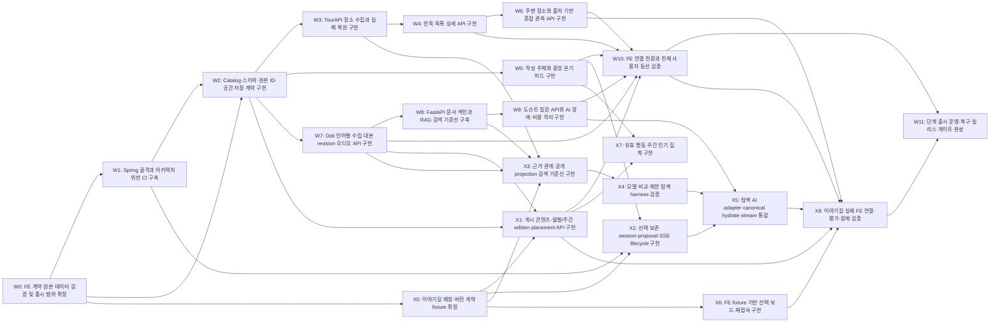

# 통합 implementation issue 발행 초안

> **ARCHIVED - 발행 금지:** 이 문서는 2026-09-09의 과거 graph다. 현재 GitHub 발행 기준은 [Backend Issue Tree](github-issues/README.md), [Work Graph](github-issues/work-graph.json), [Issue drafts](github-issues/issue-drafts.md)다.

2026-09-09. 준비용 산출물이며 GitHub Issues 미발행. 실행 Source of Truth는 발행 후 GitHub Issues다. work-graph.json이 W0~W11/X0~X8의 단일 graph이며 이전 issue-plan.md의 W 전용 wave와 책임 배분을 대체한다.

## Root

OnMaru Spring Boot·FastAPI 백엔드 단계 구축

현재 FE 탐색·온기·오디오·도슨트를 신뢰 가능한 데이터와 교체 가능한 기술 경계로 제공한다.

범위: 계약 확인, pure core, PostgreSQL/PostGIS, 관광 수집, 중앙 온기, Odii, FastAPI RAG, FE 통합, 운영; 이야기길 게시·관계·탐색·통합과 선택 P2 행동 집계

제외: H3 체크인, 정-길, 예약/결제, MSA, 개인화, 빈 모듈 선행 생성

성공 기준:
- BE-REQ-001~009 추적 및 인수 기준 충족
- 외부 관광/AI outage에도 저장된 핵심 콘텐츠 조회
- 아키텍처 위반 CI 실패, 데이터·계약·통합 테스트 통과
- JX-01~11 인수 기준 및 X8 통합 통과; JX-10 노출은 표본 충족 조건

완료 조건:
- Child별 검증과 통합 게이트 통과
- FE/BE PR merge 상태 확인
- 운영/복구/비용 측정 및 장기 결정 ADR 기록
- 핵심 출시 W11과 선택 P2 X7 완료를 별도 추적; 전체 Root 종료는 채택한 모든 Child 완료 후

## 발행 전 확인

- GitHub 전체 Issue 26건 조회: 모두 closed. 신규 graph와 동일한 열린 구현 Issue는 없다. 과거 데이터 조사 #4~#9는 배경 참고이며 신규 구현 완료 근거가 아니다.
- 기존 labels BE/FE/Feature/Planning/api-spec 재사용. milestone과 organization project 조회 결과는 비어 있다.
- Root는 BE 저장소, X6는 FE 저장소 별도 발행 후보다. 실제 FE repo와 native cross-repo 관계 지원을 발행 시 확인하고 external 경로를 BE 파일 경로로 사용하지 않는다.
- 제목·관계·wave·AC를 검토한 뒤 발행한다. Root/Child 생성, native sub-issue와 blocked-by 연결, 번호 역기입, 재조회 검증이 남아 있다.
- X7은 선택 P2로 출시 W11의 선행이 아니다. Root 전체 종료와 핵심 출시 완료는 구분한다.

## 의존성과 Wave

| ID | 제목 | 선행 | Wave |
|---|---|---|---|
| W0 | FE 계약·원본 데이터 검증 및 출시 범위 확정 | 없음 | 0 |
| W1 | Spring 골격과 아키텍처 위반 CI 구축 | W0 | 1 |
| W2 | Catalog 스키마·원본 ID·공간 저장 계약 구현 | W0, W1 | 2 |
| W3 | TourAPI 장소 수집과 실패 복원 구현 | W2 | 3 |
| W4 | 한옥 목록·상세 API 구현 | W3 | 4 |
| W5 | 작성 주체와 중앙 온기 피드 구현 | W2 | 3 |
| W6 | 주변 장소와 출처 기반 혼잡 관측 API 구현 | W4 | 5 |
| W7 | Odii 언어별 수집·대본 revision·오디오 API 구현 | W2 | 3 |
| W8 | FastAPI 문서 색인과 RAG 검색 기준선 구축 | W7 | 4 |
| W9 | 도슨트 질문 API와 AI 장애·비용 격리 구현 | W8 | 5 |
| W10 | FE 연결 전환과 전체 사용자 동선 검증 | W4, W5, W6, W7, W9, X1 | 6 |
| W11 | 단계 출시 운영·복구·릴리스 게이트 완성 | W10, X8 | 9 |
| X0 | 이야기길 매칭·버전 계약 fixture 확정 | W0 | 1 |
| X1 | 게시 콘텐츠·월별/주간 edition·placement API 구현 | X0, W2, W7 | 4 |
| X2 | 선택 보존 session·proposal·SSE lifecycle 구현 | X0, W1, W5 | 4 |
| X3 | 근거 관계·공개 projection 검색 기준선 구현 | X0, W3, W7, W8 | 5 |
| X4 | 모델 비교·제한 탐색 harness 검증 | X3 | 6 |
| X5 | 탐색 AI adapter·canonical hydrate·stream 통합 | X2, X4, W9 | 7 |
| X6 | FE fixture 기반 선택 보드·재접속 구현 | X0 | 2 |
| X7 | 유효 행동·주간 인기 집계 구현 | X1, W5 | 5 |
| X8 | 이야기길 실제 FE 연결·평가·장애 검증 | X1, X5, X6, W6, W10 | 8 |

## 통합 게이트

| 완료 Wave | 다음 착수 전 증거 |
|---|---|
| 0 | W0 범위·출처·보안·인증·필요 ADR 승인, 계약 검증. 미해결이면 scaffold 차단 |
| 1 | W1 build/architecture smoke, X0 schema/fixture 버전 일치 |
| 2 | W2 migration/ID/DB 역할 검증, X6 fixture FE 계약 통과 |
| 3 | 수집·작성·오디오 병합 후 migration 및 transaction 회귀 |
| 4 | 조회·색인·게시·session fake AI 통합 계약 검증 |
| 5 | 관측·도슨트·검색 회귀; X7 미채택/표본 부족이면 인기 노출 차단 |
| 6 | 기존 FE 전체 동선 및 모델 평가/예산 게이트 |
| 7 | AI hydrate와 stale/cancel/timeout backend E2E |
| 8 | 실제 FE 탐색 연결·장애·비용 검증과 양쪽 PR merge |
| 9 | W11 배포/복구/CI 및 출시 조건 확인 |

Wave는 DAG 일정 계산이다. 선택 X7 때문에 관련 없는 핵심 흐름을 차단하지 않는다.

## 공유 파일 통합

기존 경고 5쌍(W5/W9, W5/W6, W5/W7, W6/W9, W6/W7)은 settings.gradle.kts와 app build wiring의 쓰기 충돌이다. 각 기능 코드는 병렬 가능하지만 공유 파일 변경은 한 통합 담당자가 W5, W7, W6, W9 순서의 대기열로 반영한다. 담당자/쓰기 예약 없이 공유 파일 변경을 시작하지 않는다. 공통 composition, migration 번호, docs/database/schema.md도 같은 규칙을 적용한다. W9/X5 adapter와 W10/X8 E2E는 명시 선행으로 직렬화했다.

## 요구 추적과 중복 제거

| 요구 | 소유 작업 |
|---|---|
| BE-REQ-001,002 | W3,W4 |
| BE-REQ-003 | X1 (W4의 월별 게시 책임 이관) |
| BE-REQ-004,005 | W6 |
| BE-REQ-006,007 | W5 |
| BE-REQ-008 | W7 |
| BE-REQ-009 | W8,W9 |
| JX-01 | W5,W6,X0,X1,X7,X8 |
| JX-02,03 | X1 |
| JX-04,05 | X3,X4,X5 |
| JX-06 | X5,X6,X8 |
| JX-07,08,09 | X2,X5,X6,X8 |
| JX-10 | X7 (P2), X8 비공개 fallback 검증 |
| JX-11 | X3,X4,X6,X8 |
| JX-12 | 출시 제외 실험 inbox 유지 |

W0는 공통 source/auth/계약, X0는 이야기길 fixture 확장이다. W8은 색인/삭제/revision 엔진, X3는 관계 projection과 검색 확장이다. W9의 기존 ask와 X2의 durable run은 서로 다른 취소 수명주기를 가진다. X6 완료는 fixture 구현이고 실제 연결 완료는 X8이다.

## W0. FE 계약·원본 데이터 검증 및 출시 범위 확정

### Objective

BE-REQ-001~009의 데이터 차이와 인증 선택을 닫아 구현 가능한 계약을 제공한다.

### Context

FE canonical ID는 후보이고 원본 operation/category/자막/관측 단위가 서로 다르다. backend-prd.md의 미정 항목을 검토한다.

### Scope

OpenAPI public/AI 초안, canonical UUID/legacy mapping, source fixture, 작성 주체 결정, specs snapshot provenance

### Out of Scope

비즈니스 서버 구현, 실제 데이터의 무근거 보정

### Implementation Notes

계약은 docs/planning/data-api-design.md 기준으로 작성한다. source 미확인 항목은 pending gate로 남기고 live 성공으로 보고하지 않는다.

### Related Code / Modules

contracts/openapi, docs/reference-snapshots, docs/planning/contract-qualification

### Dependencies (blocked-by)

없음

### Blocks

W1, W2, X0

### Position in Graph

Wave 0. 같은 Wave: 없음.

### Expected Touch Points

- `contracts/openapi`
- `docs/reference-snapshots`
- `docs/planning/contract-qualification`

### Parallel Safety / Conflict Notes

공통 settings/build wiring 변경은 통합 담당자가 직렬 반영한다. context별 설정·migration 파일을 분리하고 새 touch point 발견 시 그래프를 재검증한다.

### Acceptance Criteria

- [ ] 한옥/지도/후기/오디/질문 정상·오류 예제의 schema validation 통과
- [ ] 공공 API operation/category와 언어ID/자막/관측단위를 실 fixture로 확인하거나 해당 production 기능을 명시 차단
- [ ] 작성 인증 방식과 문서 스냅샷 upstream commit/hash 기록
- [ ] 참가 범위/마감/팀/예산/데모와 두 참고 자료 확인 또는 명시적 제외 승인
- [ ] FE 키 fallback 제거·노출 평가·필요한 회전 증거 연결; 키 값 기록 금지
- [ ] D1/D2/D3 및 인증/배포 선택 승인 근거 연결

### Verification Method

OpenAPI lint/예제 검증, FE decoder fixture, source qualification checklist

Labels: BE, Planning, api-spec. Size: L. Good first issue: 아니오.

## W1. Spring 골격과 아키텍처 위반 CI 구축

### Objective

순수 core와 adapter classpath를 검증하는 실행 가능한 Boot 골격을 만든다.

### Context

architecture-blueprint.md §5/12의 최소 app/catalog/persistence-jpa/tourism-api부터 시작한다.

### Scope

Java/Boot/Gradle 버전 고정, 최소 모듈, CI, health, ArchUnit, container test harness

### Out of Scope

빈 community/audio/docent 미리 생성, 비즈니스 endpoint

### Implementation Notes

Java 21/Boot 4.1은 검증 시작점이며 라이브러리 호환 후 고정한다. core production dependency는 JDK만; W0 계약 파일 수정은 하지 않는다.

### Related Code / Modules

settings.gradle.kts, build.gradle.kts, gradle, build-logic, apps/spring-api/build.gradle.kts, apps/spring-api/src/main/java/kr/onmaru/boot, apps/spring-api/src/test/java/kr/onmaru/architecture, modules/catalog/build.gradle.kts, adapters/persistence-jpa/build.gradle.kts, adapters/tourism-api/build.gradle.kts, .github/workflows/ci.yml

### Dependencies (blocked-by)

W0

### Blocks

W2, X2

### Position in Graph

Wave 1. 같은 Wave: X0.

### Expected Touch Points

- `settings.gradle.kts`
- `build.gradle.kts`
- `gradle`
- `build-logic`
- `apps/spring-api/build.gradle.kts`
- `apps/spring-api/src/main/java/kr/onmaru/boot`
- `apps/spring-api/src/test/java/kr/onmaru/architecture`
- `modules/catalog/build.gradle.kts`
- `adapters/persistence-jpa/build.gradle.kts`
- `adapters/tourism-api/build.gradle.kts`
- `.github/workflows/ci.yml`

### Parallel Safety / Conflict Notes

공통 settings/build wiring 변경은 통합 담당자가 직렬 반영한다. context별 설정·migration 파일을 분리하고 새 touch point 발견 시 그래프를 재검증한다.

### Acceptance Criteria

- [ ] gradle check로 core/adapter 골격과 architecture tests 통과
- [ ] 금지 Spring import 및 package cycle fixture가 실제 실패
- [ ] application boot/health smoke와 실제 PostGIS container 연결 통과

### Verification Method

./gradlew check, 의도적 위반 fixture 검증, Boot smoke

Labels: BE, Feature. Size: M. Good first issue: 아니오.

## W2. Catalog 스키마·원본 ID·공간 저장 계약 구현

### Objective

안정된 내부 장소 ID와 재현 가능한 DB migration을 제공한다.

### Context

내부 UUID와 UNIQUE(provider,dataset,external_id,language)를 사용한다. geography가 좌표 정답이다.

### Scope

catalog 테이블/관계/제약, repository port, persistence mapper, migration ownership, 나머지 context DDL 설계 검토; 후속 context가 사용할 공개 PlaceLookup API와 operations schema namespace 초기화

### Out of Scope

전체 기능 테이블 선행 배포, Redis/ANN 최적화

### Implementation Notes

database-designer schema analyzer와 실제 DB DDL을 함께 검증한다. 각 context migration 디렉터리와 전역 version 예약 규칙을 정의한다.

### Related Code / Modules

modules/catalog/src/main/java/kr/onmaru/catalog/domain, modules/catalog/src/main/java/kr/onmaru/catalog/application/port, adapters/persistence-jpa/src/main/java/kr/onmaru/persistence/catalog, adapters/persistence-jpa/src/main/resources/db/migration/catalog, adapters/persistence-jpa/src/test/java/kr/onmaru/persistence/catalog, docs/database

### Dependencies (blocked-by)

W0, W1

### Blocks

W3, W5, W7, X1

### Position in Graph

Wave 2. 같은 Wave: X6.

### Expected Touch Points

- `modules/catalog/src/main/java/kr/onmaru/catalog/domain`
- `modules/catalog/src/main/java/kr/onmaru/catalog/application/port`
- `adapters/persistence-jpa/src/main/java/kr/onmaru/persistence/catalog`
- `adapters/persistence-jpa/src/main/resources/db/migration/catalog`
- `adapters/persistence-jpa/src/test/java/kr/onmaru/persistence/catalog`
- `docs/database`
- `modules/catalog/src/main/java/kr/onmaru/catalog/api`

### Parallel Safety / Conflict Notes

공통 settings/build wiring 변경은 통합 담당자가 직렬 반영한다. context별 설정·migration 파일을 분리하고 새 touch point 발견 시 그래프를 재검증한다.

### Acceptance Criteria

- [ ] 빈 DB migration 및 기존 버전 업그레이드 통과
- [ ] 다른 provider ID 충돌 방지, 동일 source 중복 차단, FK/좌표 결측 테스트 통과
- [ ] 공간 경계 fixture와 기준 EXPLAIN 결과 기록

### Verification Method

schema_analyzer.py, PostgreSQL/PostGIS Testcontainers, EXPLAIN baseline

Labels: BE, Feature. Size: M. Good first issue: 아니오.

## W3. TourAPI 장소 수집과 실패 복원 구현

### Objective

원본 장애에도 마지막 정상 장소 데이터를 보존하는 동기화를 구현한다.

### Context

W0 확정 operation/category fixture와 W2 source identity를 사용한다.

### Scope

tourism catalog adapter, source validation/quarantine, page checkpoint, lease, publish/sync 상태

### Out of Scope

Odii/DataLab 수집, AI 생성

### Implementation Notes

외부 HTTP는 DB transaction 밖. HTTP 200 header error/singleton/list/null 처리; 완주 전 watermark 및 삭제 적용 금지.

### Related Code / Modules

adapters/tourism-api/src/main/java/kr/onmaru/tourism/catalog, modules/catalog/src/main/java/kr/onmaru/catalog/application/sync, apps/spring-api/src/main/java/kr/onmaru/scheduling/catalog, adapters/persistence-jpa/src/main/java/kr/onmaru/persistence/sync, adapters/persistence-jpa/src/main/resources/db/migration/operations, adapters/tourism-api/src/test/java/kr/onmaru/tourism/catalog

### Dependencies (blocked-by)

W2

### Blocks

W4, X3

### Position in Graph

Wave 3. 같은 Wave: W5, W7.

### Expected Touch Points

- `adapters/tourism-api/src/main/java/kr/onmaru/tourism/catalog`
- `modules/catalog/src/main/java/kr/onmaru/catalog/application/sync`
- `apps/spring-api/src/main/java/kr/onmaru/scheduling/catalog`
- `adapters/persistence-jpa/src/main/java/kr/onmaru/persistence/sync`
- `adapters/persistence-jpa/src/main/resources/db/migration/operations`
- `adapters/tourism-api/src/test/java/kr/onmaru/tourism/catalog`

### Parallel Safety / Conflict Notes

공통 settings/build wiring 변경은 통합 담당자가 직렬 반영한다. context별 설정·migration 파일을 분리하고 새 touch point 발견 시 그래프를 재검증한다.

### Acceptance Criteria

- [ ] 두 번 sync해도 원본 identity 개수 동일
- [ ] 중간 page 실패 시 공개 snapshot과 성공 watermark 유지
- [ ] 429/timeout/잘못된 body 및 lease 만료 재시작 테스트 통과

### Verification Method

mock HTTP source + 실제 DB 통합 테스트

Labels: BE, Feature. Size: L. Good first issue: 아니오.

## W4. 한옥 목록·상세 API 구현

### Objective

첫 출시에서 한옥 탐색을 원본 API 실시간 의존 없이 제공한다.

### Context

BE-REQ-001~003. v1 data/meta와 FE villages/meta 차이는 compatibility contract로 검증한다.

### Scope

목록·상세·검색; 월별/주간 게시 책임은 X1 소유

### Out of Scope

관리자 UI, AI 큐레이션

### Implementation Notes

known-null 정보를 사실처럼 채우지 않는다. 내부 ID와 sourceUpdatedAt을 구분한다. source outage중 DB 조회 테스트 포함.

### Related Code / Modules

modules/catalog/src/main/java/kr/onmaru/catalog/api, modules/catalog/src/main/java/kr/onmaru/catalog/application/query, apps/spring-api/src/main/java/kr/onmaru/web/catalog, apps/spring-api/src/main/java/kr/onmaru/configuration/catalog, apps/spring-api/src/test/java/kr/onmaru/catalog, adapters/persistence-jpa/src/main/java/kr/onmaru/persistence/catalog, adapters/persistence-jpa/src/main/resources/db/migration/catalog

### Dependencies (blocked-by)

W3

### Blocks

W6, W10

### Position in Graph

Wave 4. 같은 Wave: W8, X1, X2.

### Expected Touch Points

- `modules/catalog/src/main/java/kr/onmaru/catalog/api`
- `modules/catalog/src/main/java/kr/onmaru/catalog/application/query`
- `apps/spring-api/src/main/java/kr/onmaru/web/catalog`
- `apps/spring-api/src/main/java/kr/onmaru/configuration/catalog`
- `apps/spring-api/src/test/java/kr/onmaru/catalog`
- `adapters/persistence-jpa/src/main/java/kr/onmaru/persistence/catalog`
- `adapters/persistence-jpa/src/main/resources/db/migration/catalog`

### Parallel Safety / Conflict Notes

공통 settings/build wiring 변경은 통합 담당자가 직렬 반영한다. context별 설정·migration 파일을 분리하고 새 touch point 발견 시 그래프를 재검증한다.

### Acceptance Criteria

- [ ] region/type/keyword/hasImage/page와 total 정확
- [ ] 없는 상세404/빈 검색200; 월별 published 순서는 X1 검증
- [ ] source server 종료에도 목록/상세 정상, FE decoder fixture 통과

### Verification Method

Boot API + DB 통합, FE payload fixture contract

Labels: BE, Feature. Size: M. Good first issue: 아니오.

## W5. 작성 주체와 중앙 온기 피드 구현

### Objective

localStorage 중심 후기를 검증된 작성 주체와 중앙 저장 API로 확장한다.

### Context

BE-REQ-006/007. W0에서 인증 방식 선택; 100 code points, mood 북적/한적, score null 또는1..5.

### Scope

community core, auth adapter, actor/warmth/tag/idempotency, 피드, transaction wrapper, 숨김 운영 절차

### Out of Scope

소셜 계정 전체 관리, localStorage 자동 이전, 체크인/H3

### Implementation Notes

mine은 서버 actor에서 계산. place는 consumer port와 app bridge로 확인. 재시도 key 동일 payload만 중복방지.

### Related Code / Modules

modules/community, apps/spring-api/src/main/java/kr/onmaru/web/community, apps/spring-api/src/main/java/kr/onmaru/security, apps/spring-api/src/main/java/kr/onmaru/transaction/community, apps/spring-api/src/main/java/kr/onmaru/integration/community, apps/spring-api/src/main/java/kr/onmaru/configuration/community, adapters/persistence-jpa/src/main/java/kr/onmaru/persistence/community, adapters/persistence-jpa/src/main/resources/db/migration/community, apps/spring-api/src/test/java/kr/onmaru/community

### Dependencies (blocked-by)

W2

### Blocks

W10, X2, X7

### Position in Graph

Wave 3. 같은 Wave: W3, W7.

### Expected Touch Points

- `modules/community`
- `apps/spring-api/src/main/java/kr/onmaru/web/community`
- `apps/spring-api/src/main/java/kr/onmaru/security`
- `apps/spring-api/src/main/java/kr/onmaru/transaction/community`
- `apps/spring-api/src/main/java/kr/onmaru/integration/community`
- `apps/spring-api/src/main/java/kr/onmaru/configuration/community`
- `adapters/persistence-jpa/src/main/java/kr/onmaru/persistence/community`
- `adapters/persistence-jpa/src/main/resources/db/migration/community`
- `apps/spring-api/src/test/java/kr/onmaru/community`
- `settings.gradle.kts`
- `apps/spring-api/build.gradle.kts`

### Parallel Safety / Conflict Notes

공통 settings.gradle.kts와 app build.gradle.kts의 새 모듈 등록은 동일 통합 담당자만 직렬 수정한다. 각 worker는 context 전용 파일을 구현하고 등록 패치를 통합 대기열로 전달한다. 공통 파일 쓰기 lease가 없으면 병렬 착수하지 않으며 dependency로 직렬화한 뒤 재검증한다. migration version은 W2 규칙으로 미리 예약한다.

### Acceptance Criteria

- [ ] 익명/타인 위조 거부와 mine 계산 테스트 통과
- [ ] 동일 멱등key 동시 작성 한 건, 다른 payload409
- [ ] 문자수/태그/점수/hidden feed/rollback/cursor 테스트 통과

### Verification Method

JUnit pure domain, fake ports, security + transaction Testcontainers

Labels: BE, Feature. Size: L. Good first issue: 아니오.

## W6. 주변 장소와 출처 기반 혼잡 관측 API 구현

### Objective

위치 검색과 날짜·단위가 명확한 관광 관측 히트맵을 제공한다.

### Context

BE-REQ-004/005. 지역 방문자 수를 장소 인원으로 복제하지 않는다.

### Scope

nearby/detail, insights core, 관측 저장/source mapping, DataLab adapter, heatmap

### Out of Scope

H3 사용자 체크인, 실시간 인원 추정, 근거 없는 혼잡 점수

### Implementation Notes

반경5000m 기본, 최대20000m 제안. metricType/basisDate/spatialLevel/source/status 필수. 미해결 target mapping은 unknown.

### Related Code / Modules

modules/insights, modules/catalog/src/main/java/kr/onmaru/catalog/application/query, modules/catalog/src/main/java/kr/onmaru/catalog/api, adapters/persistence-jpa/src/main/java/kr/onmaru/persistence/catalog, apps/spring-api/src/main/java/kr/onmaru/web/map, apps/spring-api/src/main/java/kr/onmaru/configuration/insights, apps/spring-api/src/main/java/kr/onmaru/scheduling/insights, adapters/persistence-jpa/src/main/java/kr/onmaru/persistence/insights, adapters/persistence-jpa/src/main/resources/db/migration/insights, adapters/tourism-api/src/main/java/kr/onmaru/tourism/insights, apps/spring-api/src/test/java/kr/onmaru/insights

### Dependencies (blocked-by)

W4

### Blocks

W10, X8

### Position in Graph

Wave 5. 같은 Wave: W9, X3, X7.

### Expected Touch Points

- `modules/insights`
- `modules/catalog/src/main/java/kr/onmaru/catalog/application/query`
- `modules/catalog/src/main/java/kr/onmaru/catalog/api`
- `adapters/persistence-jpa/src/main/java/kr/onmaru/persistence/catalog`
- `apps/spring-api/src/main/java/kr/onmaru/web/map`
- `apps/spring-api/src/main/java/kr/onmaru/configuration/insights`
- `apps/spring-api/src/main/java/kr/onmaru/scheduling/insights`
- `adapters/persistence-jpa/src/main/java/kr/onmaru/persistence/insights`
- `adapters/persistence-jpa/src/main/resources/db/migration/insights`
- `adapters/tourism-api/src/main/java/kr/onmaru/tourism/insights`
- `apps/spring-api/src/test/java/kr/onmaru/insights`
- `settings.gradle.kts`
- `apps/spring-api/build.gradle.kts`

### Parallel Safety / Conflict Notes

공통 settings.gradle.kts와 app build.gradle.kts의 새 모듈 등록은 동일 통합 담당자만 직렬 수정한다. 각 worker는 context 전용 파일을 구현하고 등록 패치를 통합 대기열로 전달한다. 공통 파일 쓰기 lease가 없으면 병렬 착수하지 않으며 dependency로 직렬화한 뒤 재검증한다. migration version은 W2 규칙으로 미리 예약한다.

### Acceptance Criteria

- [ ] 반경 경계·거리순·좌표축·limit fixture 통과
- [ ] 지역/장소·날짜가 다른 관측치가 잘못 합쳐지지 않음
- [ ] 누락 관측은 unknown이고 score0으로 대체하지 않음

### Verification Method

PostGIS integration, source fixture contract, missing-data API tests

Labels: BE, Feature. Size: L. Good first issue: 아니오.

## W7. Odii 언어별 수집·대본 revision·오디오 API 구현

### Objective

원본 언어 ID와 자막 정확도를 보존한 오디오 조회를 제공한다.

### Context

BE-REQ-008. UNIQUE(provider,stid,stlid), spot은 tid/tlid. 자막 균등배분은 estimated다.

### Scope

audio core/persistence, Odii sync, place mapping, stories API, revision/outbox 계약

### Out of Scope

정확한 forced alignment, TTS, LLM

### Implementation Notes

audio는 place가 없어도 제공한다. 삭제 tombstone, 대본 revision, outbox의 문서 변경 event를 실제 transaction에 기록한다. operations schema는 W2가 제공한다. outbox 테이블 migration은 audio 기능 소유 디렉터리에서 생성하고 W3 sync table과 구분한다.

### Related Code / Modules

modules/audio, adapters/tourism-api/src/main/java/kr/onmaru/tourism/audio, adapters/persistence-jpa/src/main/java/kr/onmaru/persistence/audio, adapters/persistence-jpa/src/main/resources/db/migration/audio, apps/spring-api/src/main/java/kr/onmaru/web/audio, apps/spring-api/src/main/java/kr/onmaru/configuration/audio, apps/spring-api/src/main/java/kr/onmaru/scheduling/audio, apps/spring-api/src/test/java/kr/onmaru/audio

### Dependencies (blocked-by)

W2

### Blocks

W8, W10, X1, X3

### Position in Graph

Wave 3. 같은 Wave: W3, W5.

### Expected Touch Points

- `modules/audio`
- `adapters/tourism-api/src/main/java/kr/onmaru/tourism/audio`
- `adapters/persistence-jpa/src/main/java/kr/onmaru/persistence/audio`
- `adapters/persistence-jpa/src/main/resources/db/migration/audio`
- `apps/spring-api/src/main/java/kr/onmaru/web/audio`
- `apps/spring-api/src/main/java/kr/onmaru/configuration/audio`
- `apps/spring-api/src/main/java/kr/onmaru/scheduling/audio`
- `apps/spring-api/src/test/java/kr/onmaru/audio`
- `settings.gradle.kts`
- `apps/spring-api/build.gradle.kts`

### Parallel Safety / Conflict Notes

공통 settings.gradle.kts와 app build.gradle.kts의 새 모듈 등록은 동일 통합 담당자만 직렬 수정한다. 각 worker는 context 전용 파일을 구현하고 등록 패치를 통합 대기열로 전달한다. 공통 파일 쓰기 lease가 없으면 병렬 착수하지 않으며 dependency로 직렬화한 뒤 재검증한다. migration version은 W2 규칙으로 미리 예약한다.

### Acceptance Criteria

- [ ] 같은 stid의 다른 stlid가 덮어써지지 않음
- [ ] script 없음/estimated timing/음원 결측 응답 검증
- [ ] D sync와 revision/outbox insert의 atomicity 테스트 통과

### Verification Method

Odii HTTP fixtures + DB integration + FE audio decoder

Labels: BE, Feature. Size: L. Good first issue: 아니오.

## W8. FastAPI 문서 색인과 RAG 검색 기준선 구축

### Objective

버전이 고정된 대본으로 검색 근거를 재현 가능하게 제공한다.

### Context

AI document PUT은 documentId/revision/hash를 사용. 같은 revision 다른 hash409, 늦은 revision은 활성화 금지.

### Scope

Python scaffold, AI schema/migration, document sync, embedding profile, exact retrieval, 한국어 eval

### Out of Scope

production LLM 답변, ANN/reranker, arbitrary web corpus

### Implementation Notes

outbox dispatch는 Spring audio scheduling의 별도 docsync package. FastAPI에 business DB write 권한을 주지 않는다.

### Related Code / Modules

apps/ai-api/pyproject.toml, apps/ai-api/src/onmaru_ai/main.py, apps/ai-api/src/onmaru_ai/api/documents, apps/ai-api/src/onmaru_ai/application/indexing, apps/ai-api/src/onmaru_ai/retrieval, apps/ai-api/src/onmaru_ai/providers/embedding, apps/ai-api/src/onmaru_ai/persistence, apps/ai-api/migrations, apps/ai-api/tests/indexing, apps/ai-api/evaluation, apps/spring-api/src/main/java/kr/onmaru/scheduling/docsync

### Dependencies (blocked-by)

W7

### Blocks

W9, X3

### Position in Graph

Wave 4. 같은 Wave: W4, X1, X2.

### Expected Touch Points

- `apps/ai-api/pyproject.toml`
- `apps/ai-api/src/onmaru_ai/main.py`
- `apps/ai-api/src/onmaru_ai/api/documents`
- `apps/ai-api/src/onmaru_ai/application/indexing`
- `apps/ai-api/src/onmaru_ai/retrieval`
- `apps/ai-api/src/onmaru_ai/providers/embedding`
- `apps/ai-api/src/onmaru_ai/persistence`
- `apps/ai-api/migrations`
- `apps/ai-api/tests/indexing`
- `apps/ai-api/evaluation`
- `apps/spring-api/src/main/java/kr/onmaru/scheduling/docsync`

### Parallel Safety / Conflict Notes

공통 settings/build wiring 변경은 통합 담당자가 직렬 반영한다. context별 설정·migration 파일을 분리하고 새 touch point 발견 시 그래프를 재검증한다.

### Acceptance Criteria

- [ ] 동일 PUT 멱등, 역순update/삭제tombstone 테스트 통과
- [ ] story/revision 범위 밖 evidence가 반환되지 않음
- [ ] 한국어50문항 및 held-out 분리, exact retrieval 품질/latency/cost 기준선 기록

### Verification Method

pytest + 실제 pgvector container, indexing failure/retry, eval report

Labels: BE, Feature. Size: L. Good first issue: 아니오.

## W9. 도슨트 질문 API와 AI 장애·비용 격리 구현

### Objective

서버 검증 대본만 사용하는 근거 포함 답변을 제공한다.

### Context

BE-REQ-009. FE scriptContext는 authoritative하지 않다. Request deadline30s, 자동 생성 retry0 제안.

### Scope

docent core, ai-fastapi adapter, 내부/외부 ask, JSON/SSE, citations, quota, circuit/bulkhead/cancel

### Out of Scope

개인화 추천, 도구 실행 agent

### Implementation Notes

Spring이 current revision과 actor quota를 결정. SSE 첫 event 후 오류는 error/done으로 종료. production 예산 미정이면 비활성.

### Related Code / Modules

modules/docent, adapters/ai-fastapi, apps/spring-api/src/main/java/kr/onmaru/web/docent, apps/spring-api/src/main/java/kr/onmaru/integration/docent, apps/spring-api/src/main/java/kr/onmaru/configuration/docent, adapters/persistence-jpa/src/main/java/kr/onmaru/persistence/docent, adapters/persistence-jpa/src/main/resources/db/migration/docent, apps/ai-api/src/onmaru_ai/api/answers, apps/ai-api/src/onmaru_ai/application/answering, apps/ai-api/src/onmaru_ai/providers/llm, apps/ai-api/tests/answering, apps/spring-api/src/test/java/kr/onmaru/docent

### Dependencies (blocked-by)

W8

### Blocks

W10, X5

### Position in Graph

Wave 5. 같은 Wave: W6, X3, X7.

### Expected Touch Points

- `modules/docent`
- `adapters/ai-fastapi`
- `apps/spring-api/src/main/java/kr/onmaru/web/docent`
- `apps/spring-api/src/main/java/kr/onmaru/integration/docent`
- `apps/spring-api/src/main/java/kr/onmaru/configuration/docent`
- `adapters/persistence-jpa/src/main/java/kr/onmaru/persistence/docent`
- `adapters/persistence-jpa/src/main/resources/db/migration/docent`
- `apps/ai-api/src/onmaru_ai/api/answers`
- `apps/ai-api/src/onmaru_ai/application/answering`
- `apps/ai-api/src/onmaru_ai/providers/llm`
- `apps/ai-api/tests/answering`
- `apps/spring-api/src/test/java/kr/onmaru/docent`
- `settings.gradle.kts`
- `apps/spring-api/build.gradle.kts`

### Parallel Safety / Conflict Notes

공통 settings.gradle.kts와 app build.gradle.kts의 새 모듈 등록은 동일 통합 담당자만 직렬 수정한다. 각 worker는 context 전용 파일을 구현하고 등록 패치를 통합 대기열로 전달한다. 공통 파일 쓰기 lease가 없으면 병렬 착수하지 않으며 dependency로 직렬화한 뒤 재검증한다. migration version은 W2 규칙으로 미리 예약한다.

### Acceptance Criteria

- [ ] 임의scriptContext로 근거를 바꿀 수 없고 인용은 허용revision 집합에 속함
- [ ] AI timeout/429/circuit-open/취소 중 core catalog 조회 정상
- [ ] 일일예산·actorquota·동시성 한도와 JSON/SSE error 계약 테스트 통과

### Verification Method

contract + resilience integration, 고정 eval, 선택 live provider smoke

Labels: BE, Feature. Size: L. Good first issue: 아니오.

## W10. FE 연결 전환과 전체 사용자 동선 검증

### Objective

각 public endpoint를 기존 FE 데이터 경로와 연결하고 ID/응답 차이를 검증한다.

### Context

R1부터 endpoint별 compatibility 검증을 수행하고 이 작업은 전체 회귀의 최종 통합이다. FE repo 변경은 해당 repo Issue/PR로 추적한다.

### Scope

BFF compatibility, feature flags, canonical ID 전환, central warmth, audio/ask, 전체 E2E

### Out of Scope

FE 화면 재설계, localStorage 무단 업로드

### Implementation Notes

FE upstream commit과 public API contract hash 고정. FE와 BE PR을 교차 링크하고 기본 branch별 merge 상태를 확인한다.

### Related Code / Modules

tests/e2e, docs/integration, ../OnMaruFE/src/app/api, ../OnMaruFE/src/hanok/services, ../OnMaruFE/src/map/warmth, ../OnMaruFE/src/features/odii-audio/services

### Dependencies (blocked-by)

W4, W5, W6, W7, W9, X1

### Blocks

W11, X8

### Position in Graph

Wave 6. 같은 Wave: X4.

### Expected Touch Points

- `tests/e2e`
- `docs/integration`
- `../OnMaruFE/src/app/api`
- `../OnMaruFE/src/hanok/services`
- `../OnMaruFE/src/map/warmth`
- `../OnMaruFE/src/features/odii-audio/services`

### Parallel Safety / Conflict Notes

공통 settings/build wiring 변경은 통합 담당자가 직렬 반영한다. context별 설정·migration 파일을 분리하고 새 touch point 발견 시 그래프를 재검증한다.

### Acceptance Criteria

- [ ] 한옥선택→상세, 후기작성→다른세션조회, 오디오→근거질문 E2E 통과
- [ ] legacy ID와 canonical ID migration fixture 통과
- [ ] TourAPI/AI outage 시 FE fallback/degraded 표시 검증

### Verification Method

두 서버와 DB의 staging E2E + FE contract suite

Labels: BE, Feature. Size: L. Good first issue: 아니오.

## W11. 단계 출시 운영·복구·릴리스 게이트 완성

### Objective

측정된 환경에서 배포·관측·rollback·restore가 가능한 출시를 만든다.

### Context

현재 CI는 hygiene 수준이다. 인원/hosting/월예산/RPO/RTO를 확정하고 목표를 실제 측정한다.

### Scope

container build, secrets wiring, CI release gates, metrics/alerts, backup restore, runbook, load tests

### Out of Scope

Kubernetes/MSA/broker 기본 도입

### Implementation Notes

이전 단계도 최소 health/secret/로그를 갖춰야 한다. release-please가 검증 없이 release를 내지 않도록 성공 CI에 연결한다.

### Related Code / Modules

infra, docs/operations, .github/workflows/release-please.yml, .github/workflows/ci.yml, tests/performance

### Dependencies (blocked-by)

W10, X8

### Blocks

없음

### Position in Graph

Wave 9. 같은 Wave: 없음.

### Expected Touch Points

- `infra`
- `docs/operations`
- `.github/workflows/release-please.yml`
- `.github/workflows/ci.yml`
- `tests/performance`

### Parallel Safety / Conflict Notes

공통 settings/build wiring 변경은 통합 담당자가 직렬 반영한다. context별 설정·migration 파일을 분리하고 새 touch point 발견 시 그래프를 재검증한다.

### Acceptance Criteria

- [ ] staging 환경에서 boot/migration/health/rollback 검증
- [ ] backup 복원 RPO/RTO 실측 및 공공 API/AI 장애 연습 기록
- [ ] 정의한 부하 조건에서 p95/error 측정하고 미달 항목은 issue로 처리, 필수 CI 실패 시 release 차단

### Verification Method

staging runbook drill + load report + release gate test

Labels: BE, Feature. Size: L. Good first issue: 아니오.

## X0. 이야기길 매칭·버전 계약 fixture 확정

### Objective

이야기길 매칭·버전 계약 fixture 확정

### Context

JX-01~09; W0 공통 ID/인증 재사용

### Scope

JX-01~09; W0 공통 ID/인증 재사용

### Out of Scope

JX-12, 임의 UI 코드 생성, 승인 없는 아키텍처 확정

### Implementation Notes

journey-exploration PRD와 FE handoff 참조. 실제 계약은 X0에서 확정.

### Related Code / Modules

contracts/discovery,docs/reference-snapshots/discovery

### Dependencies (blocked-by)

W0

### Blocks

X1, X2, X3, X6

### Position in Graph

Wave 1. 같은 Wave: W1.

### Expected Touch Points

- `contracts/discovery`
- `docs/reference-snapshots/discovery`

### Parallel Safety / Conflict Notes

공통 build/composition/migration registry와 docs/database/schema.md는 단일 통합 담당자가 PR별 직렬 반영. 미예약 공유 변경은 graph 재계획. external 경로는 FE 별도 저장소 작업 경계.

### Acceptance Criteria

- [ ] 한 지역 story-place/evidence 매칭 검수
- [ ] OpenAPI/Schema 정상·오류·빈 상태 예제와 기존 question+filters 호환 검증

### Verification Method

한 지역 story-place/evidence 매칭 검수; OpenAPI/Schema 정상·오류·빈 상태 예제와 기존 question+filters 호환 검증

Labels: BE, Feature. Size: L. Good first issue: 아니오.

## X1. 게시 콘텐츠·월별/주간 edition·placement API 구현

### Objective

게시 콘텐츠·월별/주간 edition·placement API 구현

### Context

JX-02,03 및 BE-REQ-003; W4 게시 책임 이관

### Scope

JX-02,03 및 BE-REQ-003; W4 게시 책임 이관

### Out of Scope

JX-12, 임의 UI 코드 생성, 승인 없는 아키텍처 확정

### Implementation Notes

journey-exploration PRD와 FE handoff 참조. 실제 계약은 X0에서 확정.

### Related Code / Modules

modules/content,adapters/persistence-jpa/src/main/java/kr/onmaru/persistence/content,apps/spring-api/src/main/java/kr/onmaru/web/content

### Dependencies (blocked-by)

X0, W2, W7

### Blocks

W10, X7, X8

### Position in Graph

Wave 4. 같은 Wave: W4, W8, X2.

### Expected Touch Points

- `modules/content`
- `adapters/persistence-jpa/src/main/java/kr/onmaru/persistence/content`
- `apps/spring-api/src/main/java/kr/onmaru/web/content`

### Parallel Safety / Conflict Notes

공통 build/composition/migration registry와 docs/database/schema.md는 단일 통합 담당자가 PR별 직렬 반영. 미예약 공유 변경은 graph 재계획. external 경로는 FE 별도 저장소 작업 경계.

### Acceptance Criteria

- [ ] 게시 승인/권한/revision/FK/기간 검증
- [ ] 월별·주간 동일 원본, 잘못된 fallback 장소 미노출

### Verification Method

게시 승인/권한/revision/FK/기간 검증; 월별·주간 동일 원본, 잘못된 fallback 장소 미노출

Labels: BE, Feature. Size: L. Good first issue: 아니오.

## X2. 선택 보존 session·proposal·SSE lifecycle 구현

### Objective

선택 보존 session·proposal·SSE lifecycle 구현

### Context

JX-07~09; fake AI 사용, 실제 연결 X5

### Scope

JX-07~09; fake AI 사용, 실제 연결 X5

### Out of Scope

JX-12, 임의 UI 코드 생성, 승인 없는 아키텍처 확정

### Implementation Notes

journey-exploration PRD와 FE handoff 참조. 실제 계약은 X0에서 확정.

### Related Code / Modules

modules/discovery/session,adapters/persistence-jpa/src/main/java/kr/onmaru/persistence/discovery,apps/spring-api/src/main/java/kr/onmaru/web/discovery

### Dependencies (blocked-by)

X0, W1, W5

### Blocks

X5

### Position in Graph

Wave 4. 같은 Wave: W4, W8, X1.

### Expected Touch Points

- `modules/discovery/session`
- `adapters/persistence-jpa/src/main/java/kr/onmaru/persistence/discovery`
- `apps/spring-api/src/main/java/kr/onmaru/web/discovery`

### Parallel Safety / Conflict Notes

공통 build/composition/migration registry와 docs/database/schema.md는 단일 통합 담당자가 PR별 직렬 반영. 미예약 공유 변경은 graph 재계획. external 경로는 FE 별도 저장소 작업 경계.

### Acceptance Criteria

- [ ] ownership/pin/version/cancel/replay/snapshot 테스트
- [ ] 연결 종료와 run 취소 구분; 이벤트 만료 후 snapshot 복구

### Verification Method

ownership/pin/version/cancel/replay/snapshot 테스트; 연결 종료와 run 취소 구분; 이벤트 만료 후 snapshot 복구

Labels: BE, Feature. Size: L. Good first issue: 아니오.

## X3. 근거 관계·공개 projection 검색 기준선 구현

### Objective

근거 관계·공개 projection 검색 기준선 구현

### Context

JX-04,05,11; W8 색인 재사용

### Scope

JX-04,05,11; W8 색인 재사용

### Out of Scope

JX-12, 임의 UI 코드 생성, 승인 없는 아키텍처 확정

### Implementation Notes

journey-exploration PRD와 FE handoff 참조. 실제 계약은 X0에서 확정.

### Related Code / Modules

modules/discovery/relations,apps/ai-api/src/onmaru_ai/search,contracts/corpus

### Dependencies (blocked-by)

X0, W3, W7, W8

### Blocks

X4

### Position in Graph

Wave 5. 같은 Wave: W6, W9, X7.

### Expected Touch Points

- `modules/discovery/relations`
- `apps/ai-api/src/onmaru_ai/search`
- `contracts/corpus`

### Parallel Safety / Conflict Notes

공통 build/composition/migration registry와 docs/database/schema.md는 단일 통합 담당자가 PR별 직렬 반영. 미예약 공유 변경은 graph 재계획. external 경로는 FE 별도 저장소 작업 경계.

### Acceptance Criteria

- [ ] 삭제/revision/동명 장소/좌표 없음 검증
- [ ] 공개 projection 제한과 recall·근거 기준선 기록

### Verification Method

삭제/revision/동명 장소/좌표 없음 검증; 공개 projection 제한과 recall·근거 기준선 기록

Labels: BE, Feature. Size: L. Good first issue: 아니오.

## X4. 모델 비교·제한 탐색 harness 검증

### Objective

모델 비교·제한 탐색 harness 검증

### Context

JX-04,05,09,11; SQL/편집 기준선 비교

### Scope

JX-04,05,09,11; SQL/편집 기준선 비교

### Out of Scope

JX-12, 임의 UI 코드 생성, 승인 없는 아키텍처 확정

### Implementation Notes

journey-exploration PRD와 FE handoff 참조. 실제 계약은 X0에서 확정.

### Related Code / Modules

apps/ai-api/src/onmaru_ai/exploration,apps/ai-api/tests/exploration,apps/ai-api/evaluation/exploration

### Dependencies (blocked-by)

X3

### Blocks

X5

### Position in Graph

Wave 6. 같은 Wave: W10.

### Expected Touch Points

- `apps/ai-api/src/onmaru_ai/exploration`
- `apps/ai-api/tests/exploration`
- `apps/ai-api/evaluation/exploration`

### Parallel Safety / Conflict Notes

공통 build/composition/migration registry와 docs/database/schema.md는 단일 통합 담당자가 PR별 직렬 반영. 미예약 공유 변경은 graph 재계획. external 경로는 FE 별도 저장소 작업 경계.

### Acceptance Criteria

- [ ] 고정 한국어 평가셋/held-out 품질·latency·비용·라이선스 평가
- [ ] 인젝션/allowlist/예산/timeout/repair 제한 테스트

### Verification Method

고정 한국어 평가셋/held-out 품질·latency·비용·라이선스 평가; 인젝션/allowlist/예산/timeout/repair 제한 테스트

Labels: BE, Feature. Size: L. Good first issue: 아니오.

## X5. 탐색 AI adapter·canonical hydrate·stream 통합

### Objective

탐색 AI adapter·canonical hydrate·stream 통합

### Context

JX-04~09; W9 공유 transport 이후 직렬 통합

### Scope

JX-04~09; W9 공유 transport 이후 직렬 통합

### Out of Scope

JX-12, 임의 UI 코드 생성, 승인 없는 아키텍처 확정

### Implementation Notes

journey-exploration PRD와 FE handoff 참조. 실제 계약은 X0에서 확정.

### Related Code / Modules

adapters/ai-fastapi,apps/spring-api/src/main/java/kr/onmaru/web/discovery,apps/spring-api/src/main/java/kr/onmaru/integration/discovery

### Dependencies (blocked-by)

X2, X4, W9

### Blocks

X8

### Position in Graph

Wave 7. 같은 Wave: 없음.

### Expected Touch Points

- `adapters/ai-fastapi`
- `apps/spring-api/src/main/java/kr/onmaru/web/discovery`
- `apps/spring-api/src/main/java/kr/onmaru/integration/discovery`

### Parallel Safety / Conflict Notes

공통 build/composition/migration registry와 docs/database/schema.md는 단일 통합 담당자가 PR별 직렬 반영. 미예약 공유 변경은 graph 재계획. external 경로는 FE 별도 저장소 작업 경계.

### Acceptance Criteria

- [ ] stale/deleted evidence 제외·늦은 version 폐기
- [ ] AI 장애 fallback/cancel race/typed blocks backend E2E

### Verification Method

stale/deleted evidence 제외·늦은 version 폐기; AI 장애 fallback/cancel race/typed blocks backend E2E

Labels: BE, Feature. Size: L. Good first issue: 아니오.

## X6. FE fixture 기반 선택 보드·재접속 구현

### Objective

FE fixture 기반 선택 보드·재접속 구현

### Context

JX-06~09,11; 별도 FE Issue/PR, 실제 서버 연결 완료는 X8

### Scope

JX-06~09,11; 별도 FE Issue/PR, 실제 서버 연결 완료는 X8

### Out of Scope

JX-12, 임의 UI 코드 생성, 승인 없는 아키텍처 확정

### Implementation Notes

journey-exploration PRD와 FE handoff 참조. 실제 계약은 X0에서 확정.

### Related Code / Modules

external/OnMaruFE/journey-curator,external/OnMaruFE/shared/selection,external/OnMaruFE/shared/transport

### Dependencies (blocked-by)

X0

### Blocks

X8

### Position in Graph

Wave 2. 같은 Wave: W2.

### Expected Touch Points

- `external/OnMaruFE/journey-curator`
- `external/OnMaruFE/shared/selection`
- `external/OnMaruFE/shared/transport`

### Parallel Safety / Conflict Notes

공통 build/composition/migration registry와 docs/database/schema.md는 단일 통합 담당자가 PR별 직렬 반영. 미예약 공유 변경은 graph 재계획. external 경로는 FE 별도 저장소 작업 경계.

### Acceptance Criteria

- [ ] fixture pin/부분 실패/replay/empty 테스트
- [ ] 모바일·키보드·선택 coordinator 검증과 FE PR 연결

### Verification Method

fixture pin/부분 실패/replay/empty 테스트; 모바일·키보드·선택 coordinator 검증과 FE PR 연결

Labels: FE, Feature. Size: L. Good first issue: 아니오.

## X7. 유효 행동·주간 인기 집계 구현

### Objective

유효 행동·주간 인기 집계 구현

### Context

JX-10; 선택 P2, 출시 blocker 아님

### Scope

JX-10; 선택 P2, 출시 blocker 아님

### Out of Scope

JX-12, 임의 UI 코드 생성, 승인 없는 아키텍처 확정

### Implementation Notes

journey-exploration PRD와 FE handoff 참조. 실제 계약은 X0에서 확정.

### Related Code / Modules

modules/analytics,apps/spring-api/src/main/java/kr/onmaru/scheduling/weekly

### Dependencies (blocked-by)

X1, W5

### Blocks

없음

### Position in Graph

Wave 5. 같은 Wave: W6, W9, X3.

### Expected Touch Points

- `modules/analytics`
- `apps/spring-api/src/main/java/kr/onmaru/scheduling/weekly`

### Parallel Safety / Conflict Notes

공통 build/composition/migration registry와 docs/database/schema.md는 단일 통합 담당자가 PR별 직렬 반영. 미예약 공유 변경은 graph 재계획. external 경로는 FE 별도 저장소 작업 경계.

### Acceptance Criteria

- [ ] KST 경계/중복/집계 판 재현 검증
- [ ] 최소 표본/anti-gaming/출처/신선도 명시; 부족 시 인기 비공개

### Verification Method

KST 경계/중복/집계 판 재현 검증; 최소 표본/anti-gaming/출처/신선도 명시; 부족 시 인기 비공개

Labels: BE, Feature. Size: L. Good first issue: 아니오.

## X8. 이야기길 실제 FE 연결·평가·장애 검증

### Objective

이야기길 실제 FE 연결·평가·장애 검증

### Context

JX-01~11; W10 공통 전환 후 실제 연결

### Scope

JX-01~11; W10 공통 전환 후 실제 연결

### Out of Scope

JX-12, 임의 UI 코드 생성, 승인 없는 아키텍처 확정

### Implementation Notes

journey-exploration PRD와 FE handoff 참조. 실제 계약은 X0에서 확정.

### Related Code / Modules

tests/e2e/discovery,docs/evaluation,docs/operations/discovery,external/OnMaruFE/journey-curator

### Dependencies (blocked-by)

X1, X5, X6, W6, W10

### Blocks

W11

### Position in Graph

Wave 8. 같은 Wave: 없음.

### Expected Touch Points

- `tests/e2e/discovery`
- `docs/evaluation`
- `docs/operations/discovery`
- `external/OnMaruFE/journey-curator`

### Parallel Safety / Conflict Notes

공통 build/composition/migration registry와 docs/database/schema.md는 단일 통합 담당자가 PR별 직렬 반영. 미예약 공유 변경은 graph 재계획. external 경로는 FE 별도 저장소 작업 경계.

### Acceptance Criteria

- [ ] 실서버 선택 보존/재접속/ownership E2E 및 FE/BE merge 확인
- [ ] 시연·사용자 비교 과업·장애복구·비용 측정; X7 미완료 시 인기 비공개 검증

### Verification Method

실서버 선택 보존/재접속/ownership E2E 및 FE/BE merge 확인; 시연·사용자 비교 과업·장애복구·비용 측정; X7 미완료 시 인기 비공개 검증

Labels: BE, Feature. Size: L. Good first issue: 아니오.
