# 이슈 기반 실행 계획

> **2026-09-11 개선 설계:** [감사 후속 계약](revision-2026-09-11/README.md)이 최신 검토 기준이다. 모듈/DB·소유권·run 복구·방문 후기·검색·자원 정책은 해당 묶음을 우선한다. 구조 ADR은 초안 승인 대기이며 구현 완료를 뜻하지 않는다. 아래 장기 SSE/RAG 및 1.0 예시는 최신 MVP 계약과 구분한다.

검토용 초안 / 2026-09-09. Root 1개 + Child 12개. 실제 GitHub 번호가 아니라 W0~W11의 안정된 작업 ID를 사용한다. 지금 단계에서는 보고서와 실행 그래프를 작성하며 GitHub 생성이나 애플리케이션 개발을 시작하지 않는다.

## 사전 조사

대상은 `YRootLab/OnMaru-backend`, 기본 branch는 main이다. 현재 조회한 기존 Issue는 모두 closed이며 열린 중복 작업은 없다. 과거 API 분석 Issue #5~9, #22~23은 이 구현 작업과 구분한다. 기존 labels `BE`, `Planning`, `api-spec`, `Feature`를 재사용한다. milestone과 Project는 현재 없다.

## 생성 예정 목록

| ID | 제목 | 선행 | Wave |
|---|---|---|---:|
| W0 | FE 계약·원본 데이터 검증 및 출시 범위 확정 | 없음 | 0 |
| W1 | Spring 골격과 아키텍처 위반 CI 구축 | 없음 | 0 |
| W2 | Catalog 스키마·원본 ID·공간 저장 계약 구현 | W0, W1 | 1 |
| W3 | TourAPI 장소 수집과 실패 복원 구현 | W2 | 2 |
| W4 | 한옥 목록·상세·월별 큐레이션 API 구현 | W3 | 3 |
| W5 | 작성 주체와 중앙 온기 피드 구현 | W2 | 2 |
| W6 | 주변 장소와 출처 기반 혼잡 관측 API 구현 | W4 | 4 |
| W7 | Odii 언어별 수집·대본 revision·오디오 API 구현 | W2 | 2 |
| W8 | FastAPI 문서 색인과 RAG 검색 기준선 구축 | W7 | 3 |
| W9 | 도슨트 질문 API와 AI 장애·비용 격리 구현 | W8 | 4 |
| W10 | FE 연결 전환과 전체 사용자 동선 검증 | W4, W5, W6, W7, W9 | 5 |
| W11 | 단계 출시 운영·복구·릴리스 게이트 완성 | W10 | 6 |

전체 기능은 여러 PR에 걸친 규모지만 빈 에픽 계층은 추가하지 않았다. 12개를 넘어 세부 기능이 커지면 출시 단계별 parent로 재분해한다. 하나의 Child가 독립 PR/검증 단위가 되도록 하고 현재 L 작업은 구현 중 커지면 다시 분해한다.

## Root 본문 초안

### Goal

현재 FE 탐색·온기·오디오·도슨트를 신뢰 가능한 데이터와 교체 가능한 기술 경계로 제공한다.

### Background / Motivation

docs/specs BE-REQ-001~009 및 2026-09-09 architecture-blueprint.md 검토안

### Scope

계약 확인, pure core, PostgreSQL/PostGIS, 관광 수집, 중앙 온기, Odii, FastAPI RAG, FE 통합, 운영

### Out of Scope

H3 체크인, 정-길, 예약/결제, MSA, 개인화, 빈 모듈 선행 생성

### Success Criteria

- BE-REQ-001~009 추적 및 인수 기준 충족
- 외부 관광/AI outage에도 저장된 핵심 콘텐츠 조회
- 아키텍처 위반 CI 실패, 데이터·계약·통합 테스트 통과

### Architecture / Approach

Spring modular monolith + pure Java core/ports + technology adapters; FastAPI separate contract and AI schema

### Child Issues

- [ ] W0: FE 계약·원본 데이터 검증 및 출시 범위 확정
- [ ] W1: Spring 골격과 아키텍처 위반 CI 구축
- [ ] W2: Catalog 스키마·원본 ID·공간 저장 계약 구현
- [ ] W3: TourAPI 장소 수집과 실패 복원 구현
- [ ] W4: 한옥 목록·상세·월별 큐레이션 API 구현
- [ ] W5: 작성 주체와 중앙 온기 피드 구현
- [ ] W6: 주변 장소와 출처 기반 혼잡 관측 API 구현
- [ ] W7: Odii 언어별 수집·대본 revision·오디오 API 구현
- [ ] W8: FastAPI 문서 색인과 RAG 검색 기준선 구축
- [ ] W9: 도슨트 질문 API와 AI 장애·비용 격리 구현
- [ ] W10: FE 연결 전환과 전체 사용자 동선 검증
- [ ] W11: 단계 출시 운영·복구·릴리스 게이트 완성

### Dependency Graph

계약·골격 → Catalog 모델 → 수집/온기/오디오 → 한옥/RAG → 지도/도슨트 → 전체 FE 통합 → 운영 출시. 모든 edge는 아래 DAG를 따른다.

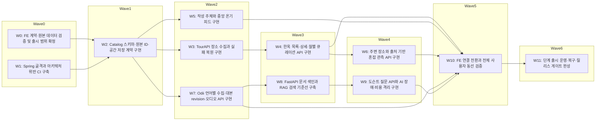

### Execution Waves

Wave 0:
  - W0: FE 계약·원본 데이터 검증 및 출시 범위 확정
  - W1: Spring 골격과 아키텍처 위반 CI 구축
Wave 1:
  - W2: Catalog 스키마·원본 ID·공간 저장 계약 구현
Wave 2:
  - W3: TourAPI 장소 수집과 실패 복원 구현
  - W5: 작성 주체와 중앙 온기 피드 구현
  - W7: Odii 언어별 수집·대본 revision·오디오 API 구현
Wave 3:
  - W4: 한옥 목록·상세·월별 큐레이션 API 구현
  - W8: FastAPI 문서 색인과 RAG 검색 기준선 구축
Wave 4:
  - W6: 주변 장소와 출처 기반 혼잡 관측 API 구현
  - W9: 도슨트 질문 API와 AI 장애·비용 격리 구현
Wave 5:
  - W10: FE 연결 전환과 전체 사용자 동선 검증
Wave 6:
  - W11: 단계 출시 운영·복구·릴리스 게이트 완성

### Integration Gates

- Wave 0 → 1: 계약 예제·source qualification 상태·작성 주체 결정을 검토하고 순수 core의 금지 dependency fixture가 실패하는지 확인한다.
- Wave 1 → 2: 실제 DB migration/unique/FK/공간 fixture와 공개 PlaceLookup API 계약을 함께 검증한다.
- Wave 2 → 3: source 실패 복구, community rollback, audio 언어별 ID/revision 보장이 각각 통과하고 통합 boot가 깨지지 않는지 확인한다.
- Wave 3 → 4: 한옥 FE decoder/원본 장애 조회와 AI document revision/filter를 검증한다. R1은 관련 게이트만 통과하면 별도로 출시할 수 있다.
- Wave 4 → 5: nearby/관측 결측과 AI outage/취소/인용/비용 게이트를 실제 두 서버에서 검증한다.
- Wave 5 → 6: FE 전체 사용자 동선, canonical ID 이행, fallback이 staging에서 통과한다.
- Wave 6 → release: backup restore, load, secret/권한, CI release 차단과 rollback을 검증한다.

Wave는 병렬 가능성 지도다. 한 명이 개발하면 같은 Wave도 순서대로 진행한다. 공유 파일 쓰기권한은 항상 하나의 통합 담당자에게 있다. endpoint별 단계 출시에는 해당 선행 작업과 통합 게이트를 적용하고 관련 없는 AI 작업 완료를 기다리게 하지 않는다.

### Risks

- 인원/일정/예산 미정
- 원본API/FE 계약 차이
- auth/provider 선택과 데이터 재사용 범위 확인 필요
- FE touch point의 `../OnMaruFE`는 별도 저장소의 논리 경로다. 실제 checkout은 현재 `/Users/yangseunghyeon/Development/OnMaru/OnMaruFE`이며 작업 시 worktree 경로를 확인한다.
- 미정 source/provider가 있는 Issue는 stub 검증과 production 활성화 조건을 분리해야 한다. 실 API 검증 없이 production 완료로 닫지 않는다.

### Definition of Done

- Child별 검증과 통합 게이트 통과
- FE/BE PR merge 상태 확인
- 운영/복구/비용 측정 및 장기 결정 ADR 기록

## 병렬 충돌 검토

검증기는 W5↔W6, W5↔W7, W5↔W9, W6↔W7, W6↔W9의 공통 `settings.gradle.kts` 접근을 경고한다. app build.gradle.kts도 공통 변경 대상이다. 이는 논리 dependency가 아닌 **공통 모듈 등록 파일의 쓰기 충돌**이다.

해소 방법: worker는 context 파일만 수정하고, 모듈 등록 패치를 단일 통합 담당자에게 전달한다. 담당자는 공통 파일 등록을 직렬 반영하고 각 Issue의 전체 build를 다시 검증한다. 이런 통합 담당자/쓰기 lease를 확보하지 못하면 해당 작업을 직렬 dependency로 바꾸고 재검증한다. `parallel_notes`에 같은 조건을 기록했다. migration version도 W2의 예약 규칙을 사용한다. 경고를 무시한 무조건 병렬 실행은 허용하지 않는다.

## GitHub 등록 및 추적

spec-to-issues [SKILL.md](/Users/yangseunghyeon/.codex/plugins/cache/personal/agent-toolkit-skills/0.3.20+codex.20260908040643/skills/spec-to-issues/SKILL.md)는 "생성할 Issue 전체 목록(제목 + 관계 + wave)을 사용자에게 보여주고 승인받은 뒤" 실제 생성을 요구한다. 위 목록은 그 검토 자료다. 이번 우선 요청인 보고서 작성 범위를 완료한 후, 확정된 범위로 등록한다.

등록 시 기존 Issue를 다시 조회한다. Root 먼저 생성 → Child 생성 → native Sub-Issue/blocked-by 연결 → 실제 번호로 전체/로컬 DAG 갱신 → 관계 조회로 검증한다. 설치된 gh의 --help에서 기능을 확인하고 없는 옵션은 공식 REST/GraphQL API를 확인한 뒤 사용한다. 텍스트 링크만으로 native dependency가 연결됐다고 보고하지 않는다.

작업 PR은 develop을 대상으로 하므로 기본 branch main 대상의 자동 종료만 믿지 않는다. merge 상태와 AC를 확인해 Issue를 닫는다. Root는 최종 게이트 후 닫는다. 열린 dependency를 우회해 구현 완료 처리하지 않는다.

아래 Child 본문은 source graph에서 만든 검토 자료다. 실제 번호를 발급받으면 Dependencies/Blocks/Position을 번호로 치환한다.

## W0. FE 계약·원본 데이터 검증 및 출시 범위 확정

### Objective

BE-REQ-001~009의 데이터 차이와 인증 선택을 닫아 구현 가능한 계약을 제공한다.

### Context

FE canonical ID는 후보이고 원본 operation/category/자막/관측 단위가 서로 다르다. backend-prd.md의 미정 항목을 검토한다.

### Scope

OpenAPI public/AI 초안, canonical UUID/legacy mapping, source fixture, 작성 주체 결정, specs snapshot provenance

### Out of Scope

비즈니스 서버 구현, 실제 데이터의 무근거 보정

### Implementation Notes

계약은 docs/planning/data-api-design.md 기준으로 작성한다. source 미확인 항목은 pending gate로 남기고 live 성공으로 보고하지 않는다.

### Related Code / Modules

contracts/openapi, docs/reference-snapshots, docs/planning/contract-qualification

### Dependencies (blocked-by)

없음 (Wave 0)

### Blocks

W2

### Position in Graph

Wave 0. 같은 Wave 이웃: W1.

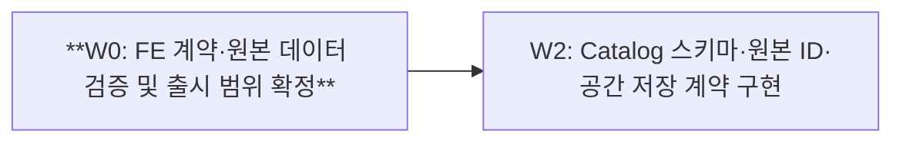

### Expected Touch Points

- `contracts/openapi`
- `docs/reference-snapshots`
- `docs/planning/contract-qualification`

### Parallel Safety / Conflict Notes

공통 settings/build wiring 변경은 통합 담당자가 직렬 반영한다. context별 설정·migration 파일을 분리하고 새 touch point 발견 시 그래프를 재검증한다.

### Acceptance Criteria

- [ ] 한옥/지도/후기/오디/질문 정상·오류 예제의 schema validation 통과
- [ ] 공공 API operation/category와 언어ID/자막/관측단위를 실 fixture로 확인하거나 해당 production 기능을 명시 차단
- [ ] 작성 인증 방식과 문서 스냅샷 upstream commit/hash 기록

### Verification Method

OpenAPI lint/예제 검증, FE decoder fixture, source qualification checklist

## W1. Spring 골격과 아키텍처 위반 CI 구축

### Objective

순수 core와 adapter classpath를 검증하는 실행 가능한 Boot 골격을 만든다.

### Context

architecture-blueprint.md §5/12의 최소 app/catalog/persistence-jpa/tourism-api부터 시작한다.

### Scope

Java/Boot/Gradle 버전 고정, 최소 모듈, CI, health, ArchUnit, container test harness

### Out of Scope

빈 community/audio/docent 미리 생성, 비즈니스 endpoint

### Implementation Notes

Java 21/Boot 4.1은 검증 시작점이며 라이브러리 호환 후 고정한다. core production dependency는 JDK만; W0 계약 파일 수정은 하지 않는다.

### Related Code / Modules

settings.gradle.kts, build.gradle.kts, gradle, build-logic, apps/spring-api/build.gradle.kts, apps/spring-api/src/main/java/kr/onmaru/boot, apps/spring-api/src/test/java/kr/onmaru/architecture, modules/catalog/build.gradle.kts, adapters/persistence-jpa/build.gradle.kts, adapters/tourism-api/build.gradle.kts, .github/workflows/ci.yml

### Dependencies (blocked-by)

없음 (Wave 0)

### Blocks

W2

### Position in Graph

Wave 0. 같은 Wave 이웃: W0.

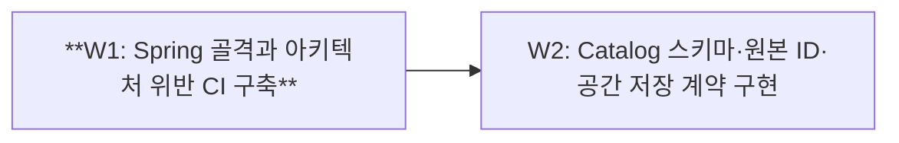

### Expected Touch Points

- `settings.gradle.kts`
- `build.gradle.kts`
- `gradle`
- `build-logic`
- `apps/spring-api/build.gradle.kts`
- `apps/spring-api/src/main/java/kr/onmaru/boot`
- `apps/spring-api/src/test/java/kr/onmaru/architecture`
- `modules/catalog/build.gradle.kts`
- `adapters/persistence-jpa/build.gradle.kts`
- `adapters/tourism-api/build.gradle.kts`
- `.github/workflows/ci.yml`

### Parallel Safety / Conflict Notes

공통 settings/build wiring 변경은 통합 담당자가 직렬 반영한다. context별 설정·migration 파일을 분리하고 새 touch point 발견 시 그래프를 재검증한다.

### Acceptance Criteria

- [ ] gradle check로 core/adapter 골격과 architecture tests 통과
- [ ] 금지 Spring import 및 package cycle fixture가 실제 실패
- [ ] application boot/health smoke와 실제 PostGIS container 연결 통과

### Verification Method

./gradlew check, 의도적 위반 fixture 검증, Boot smoke

## W2. Catalog 스키마·원본 ID·공간 저장 계약 구현

### Objective

안정된 내부 장소 ID와 재현 가능한 DB migration을 제공한다.

### Context

내부 UUID와 UNIQUE(provider,dataset,external_id,language)를 사용한다. geography가 좌표 정답이다.

### Scope

catalog 테이블/관계/제약, repository port, persistence mapper, migration ownership, 나머지 context DDL 설계 검토; 후속 context가 사용할 공개 PlaceLookup API와 operations schema namespace 초기화

### Out of Scope

전체 기능 테이블 선행 배포, Redis/ANN 최적화

### Implementation Notes

database-designer schema analyzer와 실제 DB DDL을 함께 검증한다. 각 context migration 디렉터리와 전역 version 예약 규칙을 정의한다.

### Related Code / Modules

modules/catalog/src/main/java/kr/onmaru/catalog/domain, modules/catalog/src/main/java/kr/onmaru/catalog/application/port, adapters/persistence-jpa/src/main/java/kr/onmaru/persistence/catalog, adapters/persistence-jpa/src/main/resources/db/migration/catalog, adapters/persistence-jpa/src/test/java/kr/onmaru/persistence/catalog, docs/database

### Dependencies (blocked-by)

W0, W1

### Blocks

W3, W5, W7

### Position in Graph

Wave 1. 같은 Wave 이웃: 없음.

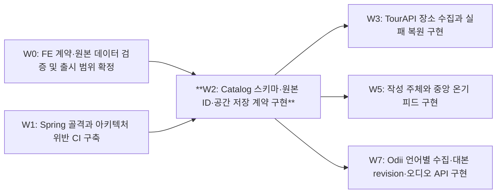

### Expected Touch Points

- `modules/catalog/src/main/java/kr/onmaru/catalog/domain`
- `modules/catalog/src/main/java/kr/onmaru/catalog/application/port`
- `adapters/persistence-jpa/src/main/java/kr/onmaru/persistence/catalog`
- `adapters/persistence-jpa/src/main/resources/db/migration/catalog`
- `adapters/persistence-jpa/src/test/java/kr/onmaru/persistence/catalog`
- `docs/database`
- `modules/catalog/src/main/java/kr/onmaru/catalog/api`

### Parallel Safety / Conflict Notes

공통 settings/build wiring 변경은 통합 담당자가 직렬 반영한다. context별 설정·migration 파일을 분리하고 새 touch point 발견 시 그래프를 재검증한다.

### Acceptance Criteria

- [ ] 빈 DB migration 및 기존 버전 업그레이드 통과
- [ ] 다른 provider ID 충돌 방지, 동일 source 중복 차단, FK/좌표 결측 테스트 통과
- [ ] 공간 경계 fixture와 기준 EXPLAIN 결과 기록

### Verification Method

schema_analyzer.py, PostgreSQL/PostGIS Testcontainers, EXPLAIN baseline

## W3. TourAPI 장소 수집과 실패 복원 구현

### Objective

원본 장애에도 마지막 정상 장소 데이터를 보존하는 동기화를 구현한다.

### Context

W0 확정 operation/category fixture와 W2 source identity를 사용한다.

### Scope

tourism catalog adapter, source validation/quarantine, page checkpoint, lease, publish/sync 상태

### Out of Scope

Odii/DataLab 수집, AI 생성

### Implementation Notes

외부 HTTP는 DB transaction 밖. HTTP 200 header error/singleton/list/null 처리; 완주 전 watermark 및 삭제 적용 금지.

### Related Code / Modules

adapters/tourism-api/src/main/java/kr/onmaru/tourism/catalog, modules/catalog/src/main/java/kr/onmaru/catalog/application/sync, apps/spring-api/src/main/java/kr/onmaru/scheduling/catalog, adapters/persistence-jpa/src/main/java/kr/onmaru/persistence/sync, adapters/persistence-jpa/src/main/resources/db/migration/operations, adapters/tourism-api/src/test/java/kr/onmaru/tourism/catalog

### Dependencies (blocked-by)

W2

### Blocks

W4

### Position in Graph

Wave 2. 같은 Wave 이웃: W5, W7.

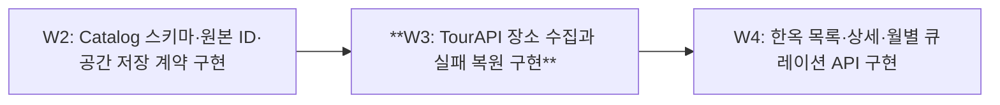

### Expected Touch Points

- `adapters/tourism-api/src/main/java/kr/onmaru/tourism/catalog`
- `modules/catalog/src/main/java/kr/onmaru/catalog/application/sync`
- `apps/spring-api/src/main/java/kr/onmaru/scheduling/catalog`
- `adapters/persistence-jpa/src/main/java/kr/onmaru/persistence/sync`
- `adapters/persistence-jpa/src/main/resources/db/migration/operations`
- `adapters/tourism-api/src/test/java/kr/onmaru/tourism/catalog`

### Parallel Safety / Conflict Notes

공통 settings/build wiring 변경은 통합 담당자가 직렬 반영한다. context별 설정·migration 파일을 분리하고 새 touch point 발견 시 그래프를 재검증한다.

### Acceptance Criteria

- [ ] 두 번 sync해도 원본 identity 개수 동일
- [ ] 중간 page 실패 시 공개 snapshot과 성공 watermark 유지
- [ ] 429/timeout/잘못된 body 및 lease 만료 재시작 테스트 통과

### Verification Method

mock HTTP source + 실제 DB 통합 테스트

## W4. 한옥 목록·상세·월별 큐레이션 API 구현

### Objective

첫 출시에서 한옥 탐색을 원본 API 실시간 의존 없이 제공한다.

### Context

BE-REQ-001~003. v1 data/meta와 FE villages/meta 차이는 compatibility contract로 검증한다.

### Scope

조회 DTO/filter/page, 상세, editorial 월별 큐레이션, FE decoder acceptance

### Out of Scope

관리자 UI, AI 큐레이션

### Implementation Notes

known-null 정보를 사실처럼 채우지 않는다. 내부 ID와 sourceUpdatedAt을 구분한다. source outage중 DB 조회 테스트 포함.

### Related Code / Modules

modules/catalog/src/main/java/kr/onmaru/catalog/api, modules/catalog/src/main/java/kr/onmaru/catalog/application/query, apps/spring-api/src/main/java/kr/onmaru/web/catalog, apps/spring-api/src/main/java/kr/onmaru/configuration/catalog, apps/spring-api/src/test/java/kr/onmaru/catalog, adapters/persistence-jpa/src/main/java/kr/onmaru/persistence/catalog, adapters/persistence-jpa/src/main/resources/db/migration/catalog

### Dependencies (blocked-by)

W3

### Blocks

W6, W10

### Position in Graph

Wave 3. 같은 Wave 이웃: W8.

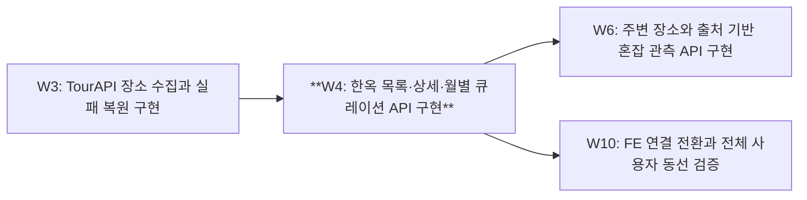

### Expected Touch Points

- `modules/catalog/src/main/java/kr/onmaru/catalog/api`
- `modules/catalog/src/main/java/kr/onmaru/catalog/application/query`
- `apps/spring-api/src/main/java/kr/onmaru/web/catalog`
- `apps/spring-api/src/main/java/kr/onmaru/configuration/catalog`
- `apps/spring-api/src/test/java/kr/onmaru/catalog`
- `adapters/persistence-jpa/src/main/java/kr/onmaru/persistence/catalog`
- `adapters/persistence-jpa/src/main/resources/db/migration/catalog`

### Parallel Safety / Conflict Notes

공통 settings/build wiring 변경은 통합 담당자가 직렬 반영한다. context별 설정·migration 파일을 분리하고 새 touch point 발견 시 그래프를 재검증한다.

### Acceptance Criteria

- [ ] region/type/keyword/hasImage/page와 total 정확
- [ ] 월별 published 순서 검증, 없는 상세404/빈 검색200
- [ ] source server 종료에도 목록/상세 정상, FE decoder fixture 통과

### Verification Method

Boot API + DB 통합, FE payload fixture contract

## W5. 작성 주체와 중앙 온기 피드 구현

### Objective

localStorage 중심 후기를 검증된 작성 주체와 중앙 저장 API로 확장한다.

### Context

BE-REQ-006/007. W0에서 인증 방식 선택; 100 code points, mood 북적/한적, score null 또는1..5.

### Scope

community core, auth adapter, actor/warmth/tag/idempotency, 피드, transaction wrapper, 숨김 운영 절차

### Out of Scope

소셜 계정 전체 관리, localStorage 자동 이전, 체크인/H3

### Implementation Notes

mine은 서버 actor에서 계산. place는 consumer port와 app bridge로 확인. 재시도 key 동일 payload만 중복방지.

### Related Code / Modules

modules/community, apps/spring-api/src/main/java/kr/onmaru/web/community, apps/spring-api/src/main/java/kr/onmaru/security, apps/spring-api/src/main/java/kr/onmaru/transaction/community, apps/spring-api/src/main/java/kr/onmaru/integration/community, apps/spring-api/src/main/java/kr/onmaru/configuration/community, adapters/persistence-jpa/src/main/java/kr/onmaru/persistence/community, adapters/persistence-jpa/src/main/resources/db/migration/community, apps/spring-api/src/test/java/kr/onmaru/community

### Dependencies (blocked-by)

W2

### Blocks

W10

### Position in Graph

Wave 2. 같은 Wave 이웃: W3, W7.

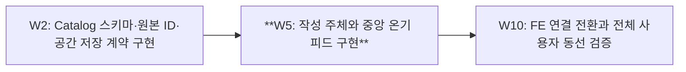

### Expected Touch Points

- `modules/community`
- `apps/spring-api/src/main/java/kr/onmaru/web/community`
- `apps/spring-api/src/main/java/kr/onmaru/security`
- `apps/spring-api/src/main/java/kr/onmaru/transaction/community`
- `apps/spring-api/src/main/java/kr/onmaru/integration/community`
- `apps/spring-api/src/main/java/kr/onmaru/configuration/community`
- `adapters/persistence-jpa/src/main/java/kr/onmaru/persistence/community`
- `adapters/persistence-jpa/src/main/resources/db/migration/community`
- `apps/spring-api/src/test/java/kr/onmaru/community`
- `settings.gradle.kts`
- `apps/spring-api/build.gradle.kts`

### Parallel Safety / Conflict Notes

공통 settings.gradle.kts와 app build.gradle.kts의 새 모듈 등록은 동일 통합 담당자만 직렬 수정한다. 각 worker는 context 전용 파일을 구현하고 등록 패치를 통합 대기열로 전달한다. 공통 파일 쓰기 lease가 없으면 병렬 착수하지 않으며 dependency로 직렬화한 뒤 재검증한다. migration version은 W2 규칙으로 미리 예약한다.

### Acceptance Criteria

- [ ] 익명/타인 위조 거부와 mine 계산 테스트 통과
- [ ] 동일 멱등key 동시 작성 한 건, 다른 payload409
- [ ] 문자수/태그/점수/hidden feed/rollback/cursor 테스트 통과

### Verification Method

JUnit pure domain, fake ports, security + transaction Testcontainers

## W6. 주변 장소와 출처 기반 혼잡 관측 API 구현

### Objective

위치 검색과 날짜·단위가 명확한 관광 관측 히트맵을 제공한다.

### Context

BE-REQ-004/005. 지역 방문자 수를 장소 인원으로 복제하지 않는다.

### Scope

nearby/detail, insights core, 관측 저장/source mapping, DataLab adapter, heatmap

### Out of Scope

H3 사용자 체크인, 실시간 인원 추정, 근거 없는 혼잡 점수

### Implementation Notes

반경5000m 기본, 최대20000m 제안. metricType/basisDate/spatialLevel/source/status 필수. 미해결 target mapping은 unknown.

### Related Code / Modules

modules/insights, modules/catalog/src/main/java/kr/onmaru/catalog/application/query, modules/catalog/src/main/java/kr/onmaru/catalog/api, adapters/persistence-jpa/src/main/java/kr/onmaru/persistence/catalog, apps/spring-api/src/main/java/kr/onmaru/web/map, apps/spring-api/src/main/java/kr/onmaru/configuration/insights, apps/spring-api/src/main/java/kr/onmaru/scheduling/insights, adapters/persistence-jpa/src/main/java/kr/onmaru/persistence/insights, adapters/persistence-jpa/src/main/resources/db/migration/insights, adapters/tourism-api/src/main/java/kr/onmaru/tourism/insights, apps/spring-api/src/test/java/kr/onmaru/insights

### Dependencies (blocked-by)

W4

### Blocks

W10

### Position in Graph

Wave 4. 같은 Wave 이웃: W9.

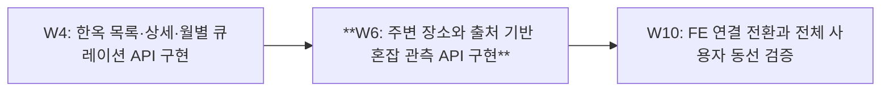

### Expected Touch Points

- `modules/insights`
- `modules/catalog/src/main/java/kr/onmaru/catalog/application/query`
- `modules/catalog/src/main/java/kr/onmaru/catalog/api`
- `adapters/persistence-jpa/src/main/java/kr/onmaru/persistence/catalog`
- `apps/spring-api/src/main/java/kr/onmaru/web/map`
- `apps/spring-api/src/main/java/kr/onmaru/configuration/insights`
- `apps/spring-api/src/main/java/kr/onmaru/scheduling/insights`
- `adapters/persistence-jpa/src/main/java/kr/onmaru/persistence/insights`
- `adapters/persistence-jpa/src/main/resources/db/migration/insights`
- `adapters/tourism-api/src/main/java/kr/onmaru/tourism/insights`
- `apps/spring-api/src/test/java/kr/onmaru/insights`
- `settings.gradle.kts`
- `apps/spring-api/build.gradle.kts`

### Parallel Safety / Conflict Notes

공통 settings.gradle.kts와 app build.gradle.kts의 새 모듈 등록은 동일 통합 담당자만 직렬 수정한다. 각 worker는 context 전용 파일을 구현하고 등록 패치를 통합 대기열로 전달한다. 공통 파일 쓰기 lease가 없으면 병렬 착수하지 않으며 dependency로 직렬화한 뒤 재검증한다. migration version은 W2 규칙으로 미리 예약한다.

### Acceptance Criteria

- [ ] 반경 경계·거리순·좌표축·limit fixture 통과
- [ ] 지역/장소·날짜가 다른 관측치가 잘못 합쳐지지 않음
- [ ] 누락 관측은 unknown이고 score0으로 대체하지 않음

### Verification Method

PostGIS integration, source fixture contract, missing-data API tests

## W7. Odii 언어별 수집·대본 revision·오디오 API 구현

### Objective

원본 언어 ID와 자막 정확도를 보존한 오디오 조회를 제공한다.

### Context

BE-REQ-008. UNIQUE(provider,stid,stlid), spot은 tid/tlid. 자막 균등배분은 estimated다.

### Scope

audio core/persistence, Odii sync, place mapping, stories API, revision/outbox 계약

### Out of Scope

정확한 forced alignment, TTS, LLM

### Implementation Notes

audio는 place가 없어도 제공한다. 삭제 tombstone, 대본 revision, outbox의 문서 변경 event를 실제 transaction에 기록한다. operations schema는 W2가 제공한다. outbox 테이블 migration은 audio 기능 소유 디렉터리에서 생성하고 W3 sync table과 구분한다.

### Related Code / Modules

modules/audio, adapters/tourism-api/src/main/java/kr/onmaru/tourism/audio, adapters/persistence-jpa/src/main/java/kr/onmaru/persistence/audio, adapters/persistence-jpa/src/main/resources/db/migration/audio, apps/spring-api/src/main/java/kr/onmaru/web/audio, apps/spring-api/src/main/java/kr/onmaru/configuration/audio, apps/spring-api/src/main/java/kr/onmaru/scheduling/audio, apps/spring-api/src/test/java/kr/onmaru/audio

### Dependencies (blocked-by)

W2

### Blocks

W8, W10

### Position in Graph

Wave 2. 같은 Wave 이웃: W3, W5.

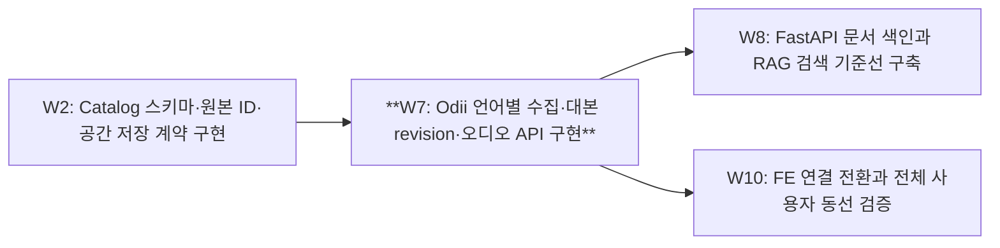

### Expected Touch Points

- `modules/audio`
- `adapters/tourism-api/src/main/java/kr/onmaru/tourism/audio`
- `adapters/persistence-jpa/src/main/java/kr/onmaru/persistence/audio`
- `adapters/persistence-jpa/src/main/resources/db/migration/audio`
- `apps/spring-api/src/main/java/kr/onmaru/web/audio`
- `apps/spring-api/src/main/java/kr/onmaru/configuration/audio`
- `apps/spring-api/src/main/java/kr/onmaru/scheduling/audio`
- `apps/spring-api/src/test/java/kr/onmaru/audio`
- `settings.gradle.kts`
- `apps/spring-api/build.gradle.kts`

### Parallel Safety / Conflict Notes

공통 settings.gradle.kts와 app build.gradle.kts의 새 모듈 등록은 동일 통합 담당자만 직렬 수정한다. 각 worker는 context 전용 파일을 구현하고 등록 패치를 통합 대기열로 전달한다. 공통 파일 쓰기 lease가 없으면 병렬 착수하지 않으며 dependency로 직렬화한 뒤 재검증한다. migration version은 W2 규칙으로 미리 예약한다.

### Acceptance Criteria

- [ ] 같은 stid의 다른 stlid가 덮어써지지 않음
- [ ] script 없음/estimated timing/음원 결측 응답 검증
- [ ] D sync와 revision/outbox insert의 atomicity 테스트 통과

### Verification Method

Odii HTTP fixtures + DB integration + FE audio decoder

## W8. FastAPI 문서 색인과 RAG 검색 기준선 구축

### Objective

버전이 고정된 대본으로 검색 근거를 재현 가능하게 제공한다.

### Context

AI document PUT은 documentId/revision/hash를 사용. 같은 revision 다른 hash409, 늦은 revision은 활성화 금지.

### Scope

Python scaffold, AI schema/migration, document sync, embedding profile, exact retrieval, 한국어 eval

### Out of Scope

production LLM 답변, ANN/reranker, arbitrary web corpus

### Implementation Notes

outbox dispatch는 Spring audio scheduling의 별도 docsync package. FastAPI에 business DB write 권한을 주지 않는다.

### Related Code / Modules

apps/ai-api/pyproject.toml, apps/ai-api/src/onmaru_ai/main.py, apps/ai-api/src/onmaru_ai/api/documents, apps/ai-api/src/onmaru_ai/application/indexing, apps/ai-api/src/onmaru_ai/retrieval, apps/ai-api/src/onmaru_ai/providers/embedding, apps/ai-api/src/onmaru_ai/persistence, apps/ai-api/migrations, apps/ai-api/tests/indexing, apps/ai-api/evaluation, apps/spring-api/src/main/java/kr/onmaru/scheduling/docsync

### Dependencies (blocked-by)

W7

### Blocks

W9

### Position in Graph

Wave 3. 같은 Wave 이웃: W4.

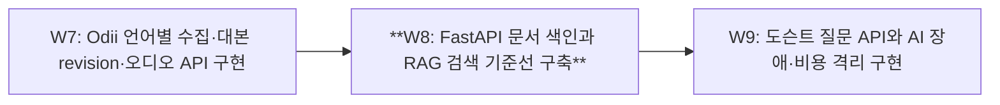

### Expected Touch Points

- `apps/ai-api/pyproject.toml`
- `apps/ai-api/src/onmaru_ai/main.py`
- `apps/ai-api/src/onmaru_ai/api/documents`
- `apps/ai-api/src/onmaru_ai/application/indexing`
- `apps/ai-api/src/onmaru_ai/retrieval`
- `apps/ai-api/src/onmaru_ai/providers/embedding`
- `apps/ai-api/src/onmaru_ai/persistence`
- `apps/ai-api/migrations`
- `apps/ai-api/tests/indexing`
- `apps/ai-api/evaluation`
- `apps/spring-api/src/main/java/kr/onmaru/scheduling/docsync`

### Parallel Safety / Conflict Notes

공통 settings/build wiring 변경은 통합 담당자가 직렬 반영한다. context별 설정·migration 파일을 분리하고 새 touch point 발견 시 그래프를 재검증한다.

### Acceptance Criteria

- [ ] 동일 PUT 멱등, 역순update/삭제tombstone 테스트 통과
- [ ] story/revision 범위 밖 evidence가 반환되지 않음
- [ ] 한국어50문항 및 held-out 분리, exact retrieval 품질/latency/cost 기준선 기록

### Verification Method

pytest + 실제 pgvector container, indexing failure/retry, eval report

## W9. 도슨트 질문 API와 AI 장애·비용 격리 구현

### Objective

서버 검증 대본만 사용하는 근거 포함 답변을 제공한다.

### Context

BE-REQ-009. FE scriptContext는 authoritative하지 않다. Request deadline30s, 자동 생성 retry0 제안.

### Scope

docent core, ai-fastapi adapter, 내부/외부 ask, JSON/SSE, citations, quota, circuit/bulkhead/cancel

### Out of Scope

개인화 추천, 도구 실행 agent

### Implementation Notes

Spring이 current revision과 actor quota를 결정. SSE 첫 event 후 오류는 error/done으로 종료. production 예산 미정이면 비활성.

### Related Code / Modules

modules/docent, adapters/ai-fastapi, apps/spring-api/src/main/java/kr/onmaru/web/docent, apps/spring-api/src/main/java/kr/onmaru/integration/docent, apps/spring-api/src/main/java/kr/onmaru/configuration/docent, adapters/persistence-jpa/src/main/java/kr/onmaru/persistence/docent, adapters/persistence-jpa/src/main/resources/db/migration/docent, apps/ai-api/src/onmaru_ai/api/answers, apps/ai-api/src/onmaru_ai/application/answering, apps/ai-api/src/onmaru_ai/providers/llm, apps/ai-api/tests/answering, apps/spring-api/src/test/java/kr/onmaru/docent

### Dependencies (blocked-by)

W8

### Blocks

W10

### Position in Graph

Wave 4. 같은 Wave 이웃: W6.

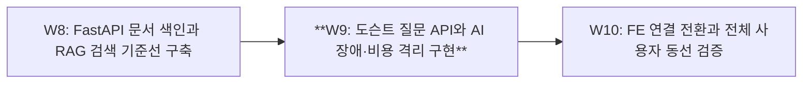

### Expected Touch Points

- `modules/docent`
- `adapters/ai-fastapi`
- `apps/spring-api/src/main/java/kr/onmaru/web/docent`
- `apps/spring-api/src/main/java/kr/onmaru/integration/docent`
- `apps/spring-api/src/main/java/kr/onmaru/configuration/docent`
- `adapters/persistence-jpa/src/main/java/kr/onmaru/persistence/docent`
- `adapters/persistence-jpa/src/main/resources/db/migration/docent`
- `apps/ai-api/src/onmaru_ai/api/answers`
- `apps/ai-api/src/onmaru_ai/application/answering`
- `apps/ai-api/src/onmaru_ai/providers/llm`
- `apps/ai-api/tests/answering`
- `apps/spring-api/src/test/java/kr/onmaru/docent`
- `settings.gradle.kts`
- `apps/spring-api/build.gradle.kts`

### Parallel Safety / Conflict Notes

공통 settings.gradle.kts와 app build.gradle.kts의 새 모듈 등록은 동일 통합 담당자만 직렬 수정한다. 각 worker는 context 전용 파일을 구현하고 등록 패치를 통합 대기열로 전달한다. 공통 파일 쓰기 lease가 없으면 병렬 착수하지 않으며 dependency로 직렬화한 뒤 재검증한다. migration version은 W2 규칙으로 미리 예약한다.

### Acceptance Criteria

- [ ] 임의scriptContext로 근거를 바꿀 수 없고 인용은 허용revision 집합에 속함
- [ ] AI timeout/429/circuit-open/취소 중 core catalog 조회 정상
- [ ] 일일예산·actorquota·동시성 한도와 JSON/SSE error 계약 테스트 통과

### Verification Method

contract + resilience integration, 고정 eval, 선택 live provider smoke

## W10. FE 연결 전환과 전체 사용자 동선 검증

### Objective

각 public endpoint를 기존 FE 데이터 경로와 연결하고 ID/응답 차이를 검증한다.

### Context

R1부터 endpoint별 compatibility 검증을 수행하고 이 작업은 전체 회귀의 최종 통합이다. FE repo 변경은 해당 repo Issue/PR로 추적한다.

### Scope

BFF compatibility, feature flags, canonical ID 전환, central warmth, audio/ask, 전체 E2E

### Out of Scope

FE 화면 재설계, localStorage 무단 업로드

### Implementation Notes

FE upstream commit과 public API contract hash 고정. FE와 BE PR을 교차 링크하고 기본 branch별 merge 상태를 확인한다.

### Related Code / Modules

tests/e2e, docs/integration, ../OnMaruFE/src/app/api, ../OnMaruFE/src/hanok/services, ../OnMaruFE/src/map/warmth, ../OnMaruFE/src/features/odii-audio/services

### Dependencies (blocked-by)

W4, W5, W6, W7, W9

### Blocks

W11

### Position in Graph

Wave 5. 같은 Wave 이웃: 없음.

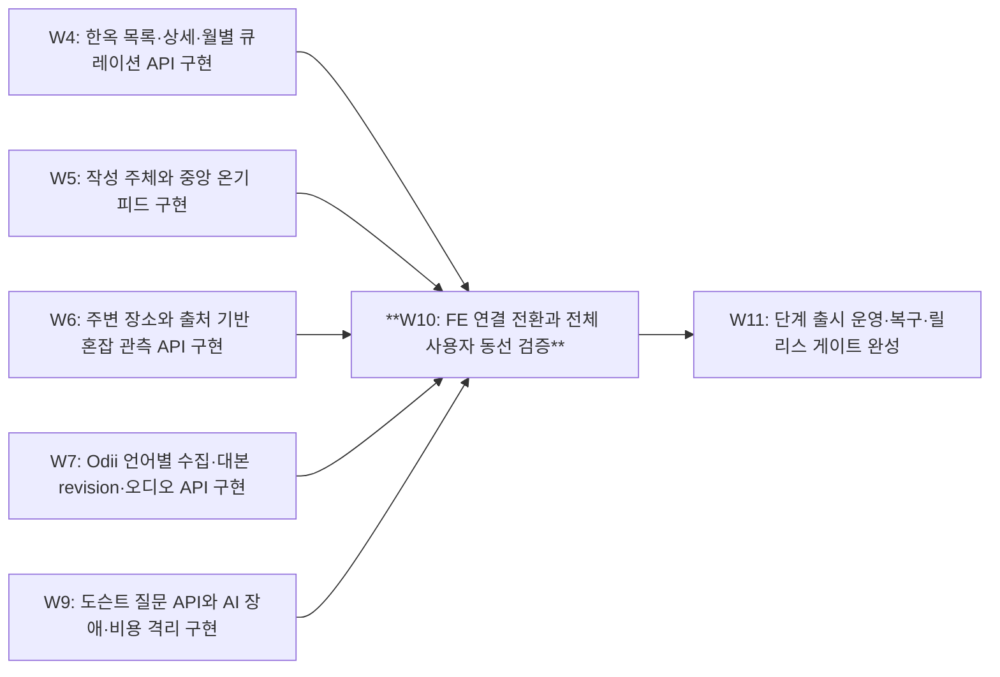

### Expected Touch Points

- `tests/e2e`
- `docs/integration`
- `../OnMaruFE/src/app/api`
- `../OnMaruFE/src/hanok/services`
- `../OnMaruFE/src/map/warmth`
- `../OnMaruFE/src/features/odii-audio/services`

### Parallel Safety / Conflict Notes

공통 settings/build wiring 변경은 통합 담당자가 직렬 반영한다. context별 설정·migration 파일을 분리하고 새 touch point 발견 시 그래프를 재검증한다.

### Acceptance Criteria

- [ ] 한옥선택→상세, 후기작성→다른세션조회, 오디오→근거질문 E2E 통과
- [ ] legacy ID와 canonical ID migration fixture 통과
- [ ] TourAPI/AI outage 시 FE fallback/degraded 표시 검증

### Verification Method

두 서버와 DB의 staging E2E + FE contract suite

## W11. 단계 출시 운영·복구·릴리스 게이트 완성

### Objective

측정된 환경에서 배포·관측·rollback·restore가 가능한 출시를 만든다.

### Context

현재 CI는 hygiene 수준이다. 인원/hosting/월예산/RPO/RTO를 확정하고 목표를 실제 측정한다.

### Scope

container build, secrets wiring, CI release gates, metrics/alerts, backup restore, runbook, load tests

### Out of Scope

Kubernetes/MSA/broker 기본 도입

### Implementation Notes

이전 단계도 최소 health/secret/로그를 갖춰야 한다. release-please가 검증 없이 release를 내지 않도록 성공 CI에 연결한다.

### Related Code / Modules

infra, docs/operations, .github/workflows/release-please.yml, .github/workflows/ci.yml, tests/performance

### Dependencies (blocked-by)

W10

### Blocks

없음

### Position in Graph

Wave 6. 같은 Wave 이웃: 없음.

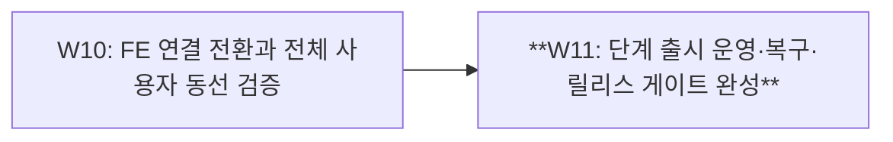

### Expected Touch Points

- `infra`
- `docs/operations`
- `.github/workflows/release-please.yml`
- `.github/workflows/ci.yml`
- `tests/performance`

### Parallel Safety / Conflict Notes

공통 settings/build wiring 변경은 통합 담당자가 직렬 반영한다. context별 설정·migration 파일을 분리하고 새 touch point 발견 시 그래프를 재검증한다.

### Acceptance Criteria

- [ ] staging 환경에서 boot/migration/health/rollback 검증
- [ ] backup 복원 RPO/RTO 실측 및 공공 API/AI 장애 연습 기록
- [ ] 정의한 부하 조건에서 p95/error 측정하고 미달 항목은 issue로 처리, 필수 CI 실패 시 release 차단

### Verification Method

staging runbook drill + load report + release gate test
