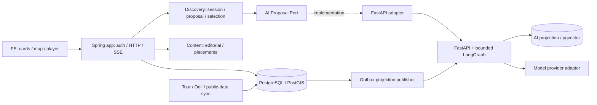
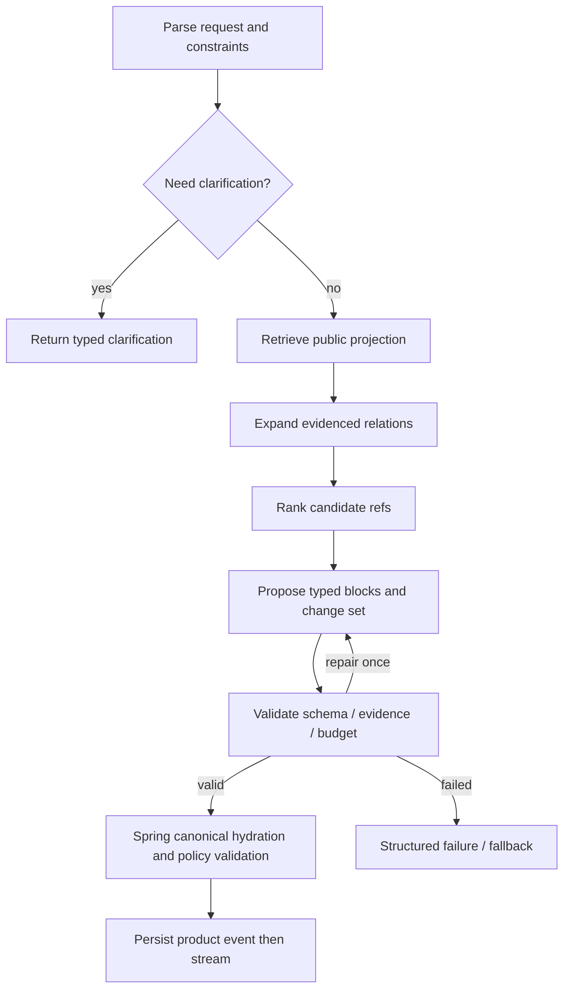

# 서버가 사실과 상태를 소유하고 AI는 검증 가능한 후보를 제안한다

## 1. 기존 구조의 확장

Spring Boot modular monolith + pure domain/application + 외부 adapter 원칙을 유지한다. Python/FastAPI는 독립 배포 AI 실행기다. 이번 요구로 `discovery`와 다중 자원 `content` 경계에 실제 책임이 생겼다. 처음부터 `rag`, `llm`, `embedding`, `agent`를 각각 Gradle 도메인으로 만들지 않는다.

그림은 런타임 흐름이다. 컴파일 의존성은 adapter→port이고 port가 구현을 참조하지 않는다. Python은 핵심 DB를 직접 쓰지 않는다. Spring이 AI 서비스 장애 때문에 장소 조회·온기 작성·오디 재생을 잃지 않도록 분리한다.

| 물리 단위 | 책임 | 허용 의존 | 금지 |
|---|---|---|---|
| `:discovery` | 세션, 고정 선택, 제안 적용, 추천 정책과 AI port | JDK, catalog/audio/content의 공개 계약 | Spring/JPA/HTTP/LLM SDK, 다른 모듈 internal |
| `:content` | 게시물 revision, 검수/게시, placement edition | JDK, 자원 식별자 계약 | UI 컴포넌트 코드, AI가 직접 게시 |
| 기존 `:catalog`, `:audio`, `:community`, `:insights` | 장소/음원/UGC/공공 관측 소유 | 기존 공개 계약 | discovery 역참조 |
| `:app` | 웹/SSE, 인증, 트랜잭션 wrapper, 조립 | core와 adapter | 비즈니스 정책 복제 |
| `:persistence-jpa` | 저장·버전·outbox·ranking 읽기 구현 | 각 소유 core의 port | core로 JPA entity 노출 |
| `:ai-fastapi-adapter` | AI 요청·취소·이벤트 변환·장애 격리 | discovery port, HTTP 기술 | canonical 데이터의 최종 권위 |

`discovery`는 위 모듈의 공개 조회만 조합하며 하위 도메인은 discovery를 알지 않는다. content는 opaque resource ref를 저장하고 게시 검증은 app의 조정 서비스가 공개 조회로 수행한다. 기술 변경 격리가 필요한 port는 만들되 단순 DTO용 input interface는 강제하지 않는다. 기존 인프라 모듈 분리는 변경 주기·클래스패스 격리가 생길 때 시행한다.

## 2. 데이터 모델과 소유권

기존 [데이터 설계](../data-api-design.md)에 추가하는 논리 모델이다. 확정 DDL이 아니다. 모든 시간은 timestamptz로 저장하고 사용자 기간은 별도 timezone 규칙으로 계산한다.

| 소유자 | 테이블 후보 | 관계·제약·접근 패턴 |
|---|---|---|
| catalog/audio | 기존 place/story + source_mapping | 원본 provider+복합 ID unique, canonical 매칭 검수 상태 |
| content | article, article_revision, article_resource | article 1:N revision, revision 1:N typed blocks/ref, published revision 명시 |
| content | placement_edition, placement_item | `(placement,period_start,revision)` unique, item rank unique, 공개판은 불변 |
| insights | regional_observation, derived_observation | source+region_code+observed_date+metric unique, 결측/추정 구분 |
| discovery | resource_relation, relation_evidence | typed source/target ref, evidence 1:N, 방향·유효기간·검수 상태 |
| discovery | exploration_session, selection | actor 소유, optimistic version, session+resource unique, pinned boolean |
| discovery | exploration_run, proposal | session 1:N run, baseVersion, lease, terminal state; proposal 수명 제한 |
| discovery | run_event, command_receipt | run+seq unique, actor+idempotency_key unique와 payload hash |
| 각 aggregate 소유자 | outbox_event | transaction 안에서 상태와 함께 기록, consumer dedup ID |
| analytics/read model | interaction_event, weekly_rank_snapshot | 이벤트 중복 키, 판의 기간/정책/대상 버전, actor 식별 최소화 |
| Python AI schema | document_revision, embedding, projection_relation, checkpoint | 원본 revision+embedding model revision, 공개 검색용 projection만 |

정규화된 원본을 우선한다. `article_resource`의 참조 무결성은 polymorphic 문자열 하나로 방치하지 않는다. 구현 시 catalog/audio 각각 typed association table 또는 CHECK로 정확히 한 대상만 지정하는 FK 구조를 선택한다. 모듈 간 DB FK 채택은 동일 배포/DB의 삭제 정책과 함께 ADR로 기록하고 미래 서비스 분리 비용을 인정한다. 그래프 ref도 같은 검증 규칙을 따른다.

관계 조회 인덱스는 `(source_type,source_id,relation_type,status)`, 역방향 탐색용 target 인덱스를 실제 접근 패턴에 맞춰 둔다. 장소 반경 조회는 PostGIS geography, 시간순 세션 run과 이벤트는 `(session_id,created_at)` 및 `(run_id,seq)`를 사용한다. 초기부터 무조건 partition/materialized view를 만들지 않는다. 실행 계획→인덱스→쿼리 수정 이후 병목이 남을 때 적용한다.

## 3. 세 가지 그래프를 혼동하지 않는다

| 그래프 | 역할 | 저장/표현 |
|---|---|---|
| 관광 관계 그래프 | 장소-이야기-주제-지역의 근거 있는 관계 | PostgreSQL typed relation + evidence, 기본1-hop |
| LangGraph 실행 그래프 | 질의 분해·검색·검증 등 계산 제어 | Python state/checkpoint, 사용자에게 내부 trace 비공개 |
| UI 관계 뷰 | 선택 주변의 이해 가능한 연결 표시 | FE layout, canonical refs와 legend, 최대 노드12/edge16 제안 |

초기 relation 종류는 `STORY_ABOUT_PLACE`, `LOCATED_IN_REGION`, `SHARES_VERIFIED_TOPIC`, `EDITORIAL_PAIRING`이다. `NEARBY`는 좌표로 계산한 공간 관계로 사실 서술 관계와 분리한다. 주제 유사도는 `SEMANTIC_CANDIDATE`로만 제안하고 검수 전 역사적 사실 edge로 승격하지 않는다. 경로 공급자가 검증한 이동 경로는 별도 route resource다.

따라서 초기 전략은 **hybrid retrieval + typed relation expansion**이지 대형 GraphRAG 시스템 도입 선언이 아니다. 다단계 관계 질의의 평가 이점이 확인될 때 graph database/graph retrieval을 비교한다.

## 4. 추천은 목적별로 다르게 계산한다

| 목적 | 초기 방식 | 필요한 데이터 | 사용자 라벨 |
|---|---|---|---|
| 추천 한옥·추천 오디 | 검수 편집 + 지역/태그 필터 | 공개 자원·출처·편집 revision | 에디터 추천 / 조건에 맞는 추천 |
| TourAPI 정렬 | 원본 정렬 의미 그대로 보존 | provider sort code와 수집시각 | 관광공사 제공 목록 |
| 주간 추천 | 운영자가 발행한 주간 edition | 기준 기간·선정 이유 | 이번 주 큐레이터 추천 5선 |
| 주간 인기 TOP5 | 자체 qualified event 주간 집계 | 중복 제거·최소 표본·공개 정책 | OnMaru 주간 인기 |
| 자연어 맥락 추천 | SQL 필터 + text/vector + 관계 + rerank | corpus, metadata, 평가셋 | 요청 조건과 관련된 후보 |
| 개인화 | 세션 내 고정/제외부터 | 동의된 선호·행동 | 현재 선택 기반 |

주간 인기 초안: KST 월요일00:00부터 다음 월요일00:00 직전까지의 **완료된 직전 주**를 집계한다. 월요일02:00 발행을 초기 운영안으로 두고 지연 이벤트 보정은 새 revision으로 발행한다. 롤링7일과 섞지 않는다. 동률은 canonical ID로 안정 정렬한다.

유효 이벤트는 의도적으로 한정한다. 상세 유효 열람, 저장, 지도 열기, 오디오 유효 재생을 구분한다. 재생은 긴 음원30초 이상, 짧은 음원50% 이상 등의 규칙을 실험하되 방문으로 간주하지 않는다. actor/resource/day/eventKind dedup, 서버 nonce·재생 세션 확인·속도 제한·봇 제외가 필요하다. 클라이언트 이벤트는 실제 청취를 완전히 입증하지 못한다.

초기 정책 후보는 `고유 저장자수*3 + 고유 길찾기 실행자수*2 + 고유 유효 소비자수`다. 장소/음원은 모집단이 달라 각각 순위를 낸다. 최소 자원별10명·판 전체50명 등 표본 문턱은 제품 검토용 제안이며 통계적으로 검증된 숫자가 아니다. 문턱 미달이면 `INSUFFICIENT_SAMPLE`로 응답하고 별도의 편집판을 보여준다. 5위를 채우려고 노이즈 점수나 가짜 데이터를 만들지 않는다.

## 5. Hugging Face와 다른 방식의 비교

Hugging Face는 모델을 찾는 경로이지 추천 품질이나 운영 배포를 보장하는 서비스가 아니다. 원본 DB 데이터만 있다고 곧바로 협업 필터링을 학습할 수 있는 것도 아니다. 초기에는 사용자-아이템 상호작용이 부족하다.

| 후보 | 장점 | 비용/위험 | 선택 조건 |
|---|---|---|---|
| SQL/태그/편집 + 한국어 검색 기준선 | 설명·운영 단순, AI 장애와 무관 | 동의어/긴 자연어 약함 | 모든 실험의 기준선으로 KEEP |
| multilingual-e5-small | 384차원 경량 다국어 임베딩 후보 | 한국어 관광 고유명사 품질 직접 평가 필요, query/passage 입력 규칙 준수 | 제한 장비에서 품질·지연 충족 시 |
| BGE-M3 | 다국어 dense/sparse/multivector 선택 가능 | 더 큰 리소스와 운영 복잡성, 여러 검색 방식을 한 번에 도입할 필요 없음 | 경량 대비 유의미한 회수율 이득 시 |
| bge-reranker-v2-m3 | 소수 후보의 질의 관련성 재순위화 | 별도 추론 지연, 모든 문서에 실행하면 비쌈 | top20 후보에서 품질 이득이 지연 예산 안일 때 |
| 관리형 embedding/LLM API | 초기 운영 부담 낮음 | 요청 비용, 데이터 처리 정책, 공급자 장애 | 동일 평가/예산/약관 통과 시 |
| 학습형 추천/LTR | 축적된 행동의 선택 패턴 반영 | 콜드스타트, 노출 편향, 학습 파이프라인 | 충분한 실제 데이터 후 DEFER |

모델 특성의 근거: [E5 모델 카드](https://huggingface.co/intfloat/multilingual-e5-small), [BGE-M3 모델 카드](https://huggingface.co/BAAI/bge-m3), [BGE reranker 모델 카드](https://huggingface.co/BAAI/bge-reranker-v2-m3). 모델 선택 전 revision/hash/license와 라이브러리 호환성을 고정하고 CPU/GPU별 메모리·p95·비용을 측정한다. 공개 모델을 임의로 다운로드·학습한 상태가 아니다.

실험은 같은 corpus split으로 SQL/text→dense hybrid→rerank→relation expansion을 하나씩 더해 Recall@10, nDCG@5, 근거 적합성, 조건 위반, p95, 유효 선택당 비용을 비교한다. 한국어 별칭·동명 장소·행정구역·문맥 부정 조건을 포함한다. 모델만 바꾸면서 UI 효과까지 모델 성능으로 주장하지 않는다.

## 6. LangGraph와 harness

LangGraph는 다음처럼 제한된 실행을 조직한다. 사용자 의도가 단순 필터이면 LLM 없이 검색한다.

Harness는 별도 유행 도구명이 아니라 실행 통제다. allowlist tool, 입력·출력 schema, actor scope, 공개 projection 범위, 비용/시간 상한, idempotency, tracing, 평가 fixture, checkpoint retention을 포함한다. 자유로운 에이전트 swarm, 임의 SQL/URL 실행, 무제한 자기 수정은 제외한다.

초기 한 run 한도 제안: 모델 생성 최대2회, repair1회, 검색 후보20, 최종 카드5, 기본 관계1-hop·최대2-hop, 절대30초. 검색 결과의 지시문은 자료이며 시스템 명령이 아니다. 도구 권한은 prompt가 아니라 코드에서 정한다. 위치·대화·사용자 식별자는 최소화하고 로그에 원문을 기본 저장하지 않는다.

LangGraph streaming/checkpoint는 내부 실행 기능이다. FE로 그대로 전달하지 않는다. durable execution도 외부 부작용의 exactly-once를 보장하는 마법이 아니므로 재실행되는 작업은 멱등하게 만들고 결제·게시 같은 동작은 도구 목록에서 제외한다. [Streaming](https://docs.langchain.com/oss/python/langgraph/streaming), [Persistence](https://docs.langchain.com/oss/python/langgraph/persistence), [Interrupts](https://docs.langchain.com/oss/python/langgraph/interrupts)

## 7. Spring/Python 계약과 트랜잭션

Python은 outbox로 배포된 **공개 검색 projection**을 조회한다. user/community 비공개 원문은 기본 인덱싱하지 않는다. Spring은 AI가 반환한 canonical refs를 현재 상태로 다시 읽어 공개 여부·삭제·위치·제약을 검사하고 카드 데이터를 만든다. AI가 보내온 가격·영업시간·좌표를 canonical 사실로 저장하지 않는다.

Spring→Python 요청은 runId, requestRevision, 제한된 constraints, pinned refs, 공개 corpus revision, trace context다. Python 응답은 draft candidate refs, relation/evidence refs, reason code, typed block 제안이다. 양쪽 네트워크 호출 동안 DB 트랜잭션을 열어 두지 않는다.

실행은 세션/명령/outbox를 짧은 transaction으로 저장한 후 worker가 내부 FastAPI job 제출을 수행한다. 네트워크 실패 재제출은 runId로 멱등 처리한다. Python checkpoint ID는 서버가 run에서 도출하며 사용자 입력 thread_id로 다른 세션에 접근할 수 없다. 결과는 Spring에서 검증·이벤트 저장 후 전달한다. lease 만료나 이미 terminal인 run의 늦은 결과는 폐기한다.

동기 내부 연결 timeout 2초, run deadline30초, transient transport 재시도 최대1회+jitter를 초기안으로 둔다. job 생성 재시도는 동일 idempotency ID일 때만 한다. validation/auth/비용 초과는 재시도하지 않는다. circuit breaker·concurrency bulkhead는 ai adapter 경계에 두고 열린 상태에서도 catalog/편집 추천은 정상 제공한다.

## 8. 검증과 재검토

Domain: pin 보존, proposal 적용 버전, 공개판 불변성과 관계 정책을 순수 테스트한다. Application: Fake AI port/clock/catalog lookup으로 거절·지연·삭제를 시험한다. Adapter: PostgreSQL/PostGIS/pgvector는 실제 extension을 갖춘 Testcontainers 환경에서 확인하고 외부 HTTP는 계약 fixture로 검사한다. 실 provider 테스트는 키 없이 CI 기본 경로에 넣지 않는다.

Architecture: core의 Spring/JPA/HTTP 의존 금지, 하위 도메인의 discovery 역참조 금지, 내부 패키지 접근 금지. E2E: 선택→재탐색→중단→재접속→제안 적용→되돌리기, stale projection, 근거 삭제, SSE gap, AI 장애.

graph DB·Redis·broker·MSA는 트래픽/지연/운영 병목을 측정한 뒤 재검토한다. 모델 교체 시 embedding 차원이 다르면 새 인덱스 공간에서 재색인하고 검색 평가 후 전환한다. provider SDK만 바꾸면 DB·품질 문제가 모두 해결된다고 약속하지 않는다.
