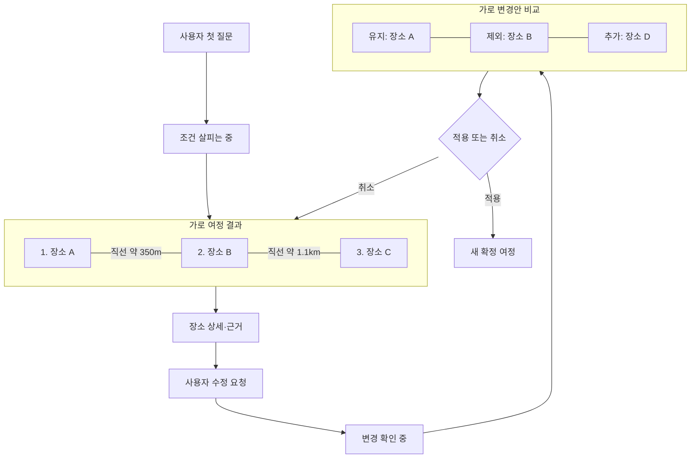
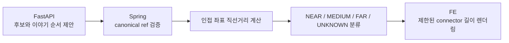
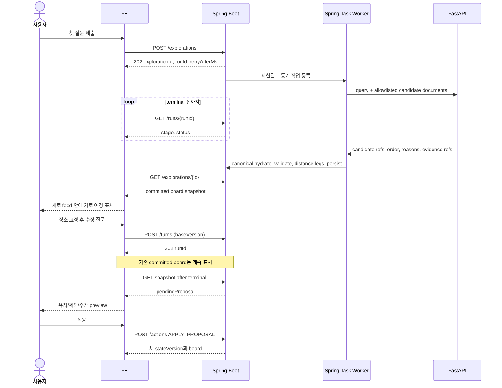
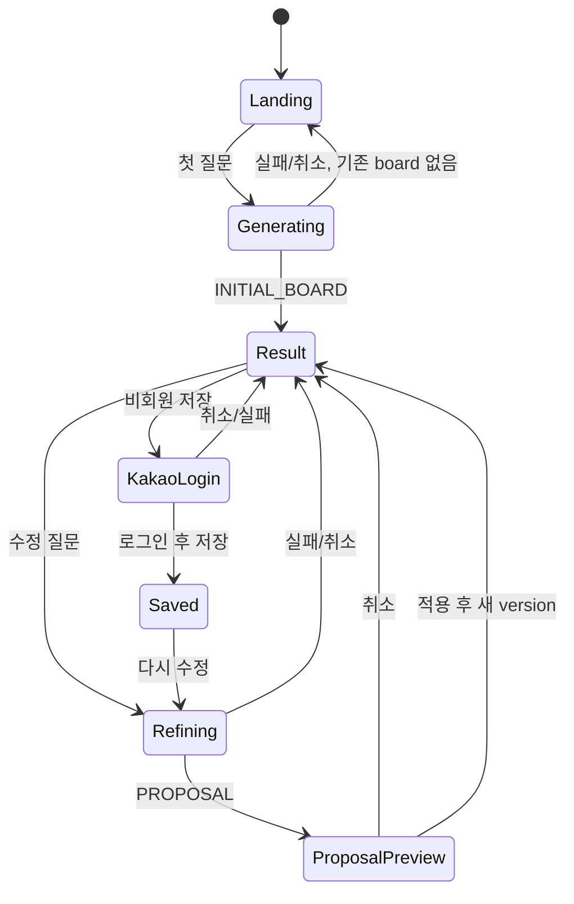

# AI 여정 탐색 FE 경험·API 구현 보고서

> **ARCHIVED HANDOFF (2026-09-10). 구현 기준으로 사용하지 않는다.** 본문의 polling과 7일 MVP 범위는 과거 가설이다. 현재 여정 transport와 DTO는 [Public REST API](../../contracts/rest-api.md), [Journey OpenAPI](../../contracts/openapi/journey.openapi.yaml), [Frontend handoff](../../contracts/frontend-handoff.md)를 따른다.

> **현재 설계 기준:** [문서 안내](../../README.md)의 책임별 설계를 따른다. 이 문서는 FE 경험 기획의 과거 보고서이며, 구현 완료를 뜻하지 않는다.


작성일: 2026-09-10  
상태: 사용자 승인 방향 반영 / 7일 제출 MVP 구현 기준  
대상: OnMaru FE, Spring Boot, FastAPI 담당자

## 1. 이 문서가 결정하는 것

이 보고서는 `/discover` 여정 탐색을 일반 채팅창이 아니라 **대화를 따라 아래로 진행하면서, 판단이 필요한 순간에는 가로 여정과 비교 화면이 펼쳐지는 탐색 작업 공간**으로 구현하기 위한 공동 계약이다.

제품의 기억점은 다음 한 장면이다.

> 사용자가 “시장은 빼고 역사 이야기를 더 넣어줘”라고 말하면, 고정한 장소는 남고 제외·추가되는 장소와 장소 사이의 상대 거리가 적용 전에 눈앞에서 다시 구성된다.

이번 제출에서는 오디 전용 AI 도슨트, 실제 길찾기, 여러 자율 agent를 제외한다. 오디는 시간이 남을 때 검수된 관련 콘텐츠 한 건을 읽기 전용으로 연결한다.

이 문서는 다음 문서를 구현 가능한 FE 관점으로 묶는다.

- [제품 PRD](product-prd.md): 연결 이유, 선택 보존, 근거라는 제품 원칙
- [회원·여정 경험 상세안](journey-service-plan.md): 웹·모바일 연속 경험과 화면 역할
- [7일 MVP FE 전달서](seven-day-mvp-fe-handoff.md): 제출 범위, API, polling, 카카오 로그인
- [백엔드·AI 구조안](architecture-and-recommendation.md): Spring/FastAPI 소유권과 검증 경계

충돌 시 7일 제출 범위에는 `seven-day-mvp-fe-handoff.md`와 이 문서를 우선한다. API field의 최종 Source of Truth는 아직 작성되지 않은 OpenAPI가 되며, OpenAPI 생성 전에는 두 문서의 타입을 함께 변경한다.

실사용 staging, 비상 demo 환경, release 승격과 성공 지표는 [여정 탐색 환경·릴리스·성공 게이트](staging-demo-release-and-success-gates.md)를 따른다. Demo는 별도 mock 제품이나 제품 성과의 근거로 사용하지 않는다.

## 2. 제품 구조: 세로는 대화의 시간, 가로는 여정의 공간

한 방향만 사용하지 않는다.

- **세로 축**: 사용자의 질문, 진행 상태, 결과, 수정 요청, 변경안이 시간순으로 쌓인다.
- **가로 축**: 한 결과 안에서 장소 순서, 장소 간 상대 거리, 유지·제외·추가 후보를 비교한다.
- **깊이 축**: 한 장소의 연결 이유, 근거, 미확인 정보는 상세 panel이나 bottom sheet에서 연다.
- **지도 보기**: 실제 지리 위치만 표현한다.
- **관계 보기**: 왜 연결되는지 표현하며 길이나 거리로 읽히지 않게 한다.



가로 여정은 최단 경로가 아니다. **AI가 근거 안에서 제안한 이야기 순서**이며 connector의 길이는 인접 장소 좌표의 직선거리를 제한된 단계로 표현한 것이다.

## 3. 페이지 흐름

### 3.1 랜딩

첫 viewport에는 Header, 제품명 또는 짧은 제목, 한 줄 설명, 큰 검색창, 실제 지원 가능한 예시 질문 최대 3개를 둔다. 빈 그래프와 고정 Bento 카드를 미리 채우지 않는다.

검색 제출 시 입력창이 Header 아래 compact composer로 이동하고 같은 URL 안에서 workspace가 열린다. 페이지를 새로 전환해 사용자가 방금 입력한 맥락을 잃게 하지 않는다.

### 3.2 탐색 workspace

데스크톱 권장 구조는 다음과 같다.

```text
┌──────────────────────────────────────────────────────────────┐
│ Header                                      로그인 / 저장    │
├──────────────────────────────────────────────────────────────┤
│ compact query: 서촌에서 한옥과 역사를 조용히 만나고 싶어    │
├──────────────────────────────────────────────────────────────┤
│ 대화·결과 feed                                      세로 ↓   │
│  ┌ 사용자 질문 ───────────────────────────────────────────┐  │
│  └────────────────────────────────────────────────────────┘  │
│  ┌ 장소 A ─── 짧음 ─── 장소 B ───── 김 ───── 장소 C ───┐  │
│  │ 가로 스크롤 가능한 여정 흐름                         │  │
│  └────────────────────────────────────────────────────────┘  │
│  ┌ 선택 상세 / 근거 / 미확인 정보 ──────────────────────┐  │
│  └────────────────────────────────────────────────────────┘  │
│  ┌ 사용자 수정 요청 ─────────────────────────────────────┐  │
│  └────────────────────────────────────────────────────────┘  │
│  ┌ 유지 / 제외 / 추가 변경안 + 적용 / 취소 ─────────────┐  │
│  └────────────────────────────────────────────────────────┘  │
├──────────────────────────────────────────────────────────────┤
│ refine composer                                              │
└──────────────────────────────────────────────────────────────┘
```

현재 결과의 보조 보기는 `여정 / 지도 / 연결` segmented control로 전환한다. 데스크톱에서도 세 화면을 동시에 좁게 욱여넣지 않는다. 여정이 기본이며 지도와 연결은 같은 `focusedRef`를 공유한다.

### 3.3 모바일

- 세로 feed와 하단 composer를 유지한다.
- 여정 카드는 viewport보다 작게 고정하고 horizontal scroll과 scroll snap을 사용한다.
- connector가 길어져 카드를 압축하지 않게 한다.
- 상세는 기존 FE 체계에 맞춰 bottom sheet 또는 인라인 확장 중 하나만 사용한다.
- 지도와 연결은 `여정 / 지도 / 연결` segmented control로 전환한다.
- 키보드가 열려도 변경안의 적용·취소와 composer 전송에 접근할 수 있어야 한다.
- 가로 스크롤만이 유일한 탐색법이 되지 않도록 이전·다음 icon button과 `1/3` 위치를 제공한다.

## 4. 결과를 렌더링하는 규칙

서버나 LLM이 React, HTML, CSS 또는 임의 UI JSON을 생성하지 않는다. FE는 검증된 domain type을 아래 고정 컴포넌트로 매핑한다.

| Domain data | FE component | 방향 | 사용자 목적 |
|---|---|---|---|
| 사용자 `query` | `UserTurn` | 세로 | 내가 요청한 조건 확인 |
| `RunSnapshot.stage` | `JourneyProgress` | 세로 | 현재 처리 단계 확인 |
| `JourneyBoard.candidates + legs` | `JourneyFlowRail` | 가로 | 장소 순서와 상대 거리 파악 |
| `JourneyCandidate` | `JourneyPlaceCard` | 가로 반복 | 후보 비교·고정·제외 |
| 선택 candidate와 evidence | `JourneyDetail` | 세로 상세 | 이유·출처·미확인 정보 확인 |
| `JourneyProposal` | `ProposalComparison` | 가로 비교 | 유지·제외·추가 검토 |
| `relations` | `RelationView` | 공간 배치 또는 목록 | 연결 이유 탐색 |
| 오류·빈 결과 | `JourneyNotice` | 세로 | 기존 보드를 잃지 않고 복구 |

LLM 문장을 분석해 컴포넌트를 결정하지 않는다. `pendingProposal != null`이면 변경안, `board != null`이면 여정 흐름을 그리는 식으로 schema가 표현을 결정한다.

### 이전 대화와 현재 보드

현재 확정 보드와 pending proposal만 편집 가능하다. 이전 질문과 적용 이력은 세로 feed에 compact history로 남기되, 과거 보드를 다시 활성 편집 상태처럼 보이지 않는다.

- 현재 세션 중에는 초기 결과와 변경안을 feed 안에서 볼 수 있다.
- 새로고침 후에는 서버가 반환한 최근 turn과 action history를 compact row로 복구한다.
- 과거 결과 전체를 영구 복제하지 않고 `stateVersion`과 변경 요약을 참조한다.
- 사용자가 저장한 것은 마지막 committed board다. pending proposal과 hover·열린 panel은 저장하지 않는다.

## 5. 가로 여정 흐름 상세

### 5.1 의미

`JourneyBoard.candidates` 배열 순서가 화면 순서다. FastAPI는 검색 조건과 연결 이유를 근거로 이야기 순서를 제안하고, Spring은 canonical 장소와 좌표를 검증한 후 인접 구간을 만든다.



### 5.2 거리 표현

| band | 권장 connector | 표시 |
|---|---:|---|
| `NEAR` | 48px | `직선 약 350m` 또는 `가까움` |
| `MEDIUM` | 88px | `직선 약 700m` 또는 `보통` |
| `FAR` | 128px | `직선 약 1.1km` 또는 `조금 멂` |
| `UNKNOWN` | 64px 점선 | `거리 미확인` |

`distanceMeters`는 좌표 기반 직선거리다. FE는 이를 도보거리나 도보시간으로 변환하지 않는다. 파일럿 지역의 band threshold는 Day 1 좌표 fixture로 동결한다.

카드에는 거리와 별개로 `1`, `2`, `3` 순번을 표시한다. screen reader는 “첫 번째 장소, 서촌 한옥마을. 다음 장소까지 직선거리 약 350미터”처럼 읽을 수 있어야 한다.

### 5.3 변경안 움직임

사용자가 수정 요청을 보내도 확정 rail을 즉시 교체하지 않는다.

- `keptRefs`: 위치를 유지하고 `유지` 상태를 표시한다.
- `removedRefs`: 카드와 기존 connector를 낮은 강조도로 남겨 비교하게 한다.
- `addedRefs`: 제안 위치에 새 카드와 connector를 표시한다.
- 적용: 새 board로 한 번 전환하고 `focusedRef`가 제거됐다면 첫 유지/추가 장소로 이동한다.
- 취소: preview만 제거하고 board, pin, focused selection을 유지한다.

전환은 180~280ms 범위의 opacity와 position 변화만 사용한다. layout 전체가 크게 튀지 않게 card와 connector의 stable width를 둔다. `prefers-reduced-motion`에서는 즉시 교체한다.

## 6. FE가 호출하는 API

브라우저는 Spring Boot만 호출한다. FastAPI 주소와 model provider key는 브라우저에 노출하지 않는다.

| Method·path | 응답 | FE 동작 |
|---|---|---|
| `POST /api/v1/explorations` | `202 AcceptedRun` | feed에 질문 추가, polling 시작 |
| `GET /api/v1/explorations/{id}/runs/{runId}` | `RunSnapshot` | stage 갱신, terminal에서 polling 종료 |
| `GET /api/v1/explorations/{id}` | `ExplorationSnapshot` | board, proposal, history를 한 번에 복구 |
| `POST /api/v1/explorations/{id}/turns` | `202 AcceptedRun` | 기존 board 유지, 수정 진행 표시 |
| `POST /api/v1/explorations/{id}/actions` | `ExplorationSnapshot` | pin 또는 proposal 적용·취소 반영 |
| `POST /api/v1/explorations/{id}/runs/{runId}/cancel` | terminal run | 진행 표시 종료, 기존 board 유지 |
| `GET /api/v1/members/me` | `MemberSummary` | 로그인·저장 affordance 결정 |
| `POST /api/v1/saved-journeys` | 저장 결과 | 마지막 committed board 저장 |
| `GET /api/v1/saved-journeys/{id}` | `SavedJourneyDetail` | 저장 여정을 새 workspace로 열기 |

현재 MVP 통신은 `REST command + SSE notification + snapshot`이다. FE는 terminal, reconnect, reset, 화면 복귀에서 run과 exploration snapshot을 다시 읽고 stream을 해제한다. polling은 SSE 미지원 환경의 compatibility fallback뿐이다.



## 7. FE용 핵심 데이터 계약

전체 공통 타입은 [7일 MVP FE 전달서](seven-day-mvp-fe-handoff.md)를 따른다. 아래는 레이아웃과 복구를 위해 반드시 필요한 부분이다.

```ts
type DistanceBand = 'NEAR' | 'MEDIUM' | 'FAR' | 'UNKNOWN';

interface JourneyLeg {
  fromRef: ResourceRef & { type: 'PLACE' };
  toRef: ResourceRef & { type: 'PLACE' };
  order: number;
  distanceMeters: number | null;
  distanceKind: 'STRAIGHT_LINE' | 'UNKNOWN';
  distanceBand: DistanceBand;
}

interface JourneyBoard {
  title: string;
  querySummary: string;
  regionRef: ResourceRef & { type: 'REGION' };
  candidates: JourneyCandidate[]; // ordered, 1..3
  legs: JourneyLeg[]; // candidates.length - 1, or 0
  resources: Array<PlaceResource | RegionResource | TopicResource>;
  relations: Relation[];
  evidence: Evidence[];
}

type JourneyHistoryType =
  | 'QUERY_SUBMITTED'
  | 'BOARD_COMMITTED'
  | 'PIN_CHANGED'
  | 'PROPOSAL_READY'
  | 'PROPOSAL_APPLIED'
  | 'PROPOSAL_DISMISSED'
  | 'RUN_FAILED';

interface JourneyHistoryItem {
  id: string;
  type: JourneyHistoryType;
  createdAt: string;
  query: string | null;       // QUERY_SUBMITTED에서만 사용자 원문
  runId: string | null;
  stateVersion: number;
  proposalId: string | null;
  affectedRefs: ResourceRef[];
}

interface ExplorationSnapshot {
  schemaVersion: '1.0';
  explorationId: string;
  stateVersion: number;
  board: JourneyBoard | null;
  pinnedRefs: ResourceRef[];
  latestRun: { runId: string; status: RunStatus } | null;
  pendingProposal: JourneyProposal | null;
  recentHistory: JourneyHistoryItem[]; // 시간 오름차순, MVP 최대 20개
  updatedAt: string;
}
```

### 계약 불변식

Spring과 FE가 함께 지켜야 하는 규칙이다.

1. `candidates`의 모든 ref는 `resources`의 공개 `PLACE`와 일치한다.
2. `legs.length`는 후보가 2개 이상이면 `candidates.length - 1`이다.
3. 각 leg는 배열에서 순서상 인접한 두 candidate만 연결한다.
4. `distanceKind = UNKNOWN`이면 `distanceMeters = null`, `distanceBand = UNKNOWN`이다.
5. `STRAIGHT_LINE` 값을 FE가 도보거리·시간으로 재해석하지 않는다.
6. `pinnedRefs`는 pending proposal의 `keptRefs`에 반드시 포함된다.
7. proposal은 적용 전 committed board와 `stateVersion`을 바꾸지 않는다.
8. `evidenceRefs`, `relationRefs`, `affectedRefs`는 snapshot 안에서 해석 가능하다.
9. 과거 history는 audit와 복구용이며 LLM의 내부 추론을 포함하지 않는다.
10. 서버 문자열로 화면 컴포넌트 종류를 동적으로 생성하지 않는다.

## 8. 상태 관리 경계



서버 상태와 FE 표현 상태를 섞지 않는다.

| 서버가 소유 | FE가 소유 |
|---|---|
| committed board와 version | active view (`JOURNEY/MAP/RELATION`) |
| pinned refs | focused ref |
| run status와 pending proposal | hover, scroll position |
| recent history | 열린 상세와 bottom sheet |
| 회원과 저장 여정 | 입력 중인 query draft |

FE store는 `serverSnapshot`, `runPolling`, `viewState`, `composerState` 정도로 나누는 것을 권장한다. 서버 snapshot을 candidate card별 로컬 state로 복제하지 않는다. 렌더링용 selector에서 ref를 hydrate한다.

## 9. Spring·FastAPI·FE 책임

| 책임 | FE | Spring Boot | FastAPI |
|---|---|---|---|
| 사용자 입력·접근성·레이아웃 | 소유 | 입력 validation | 없음 |
| 세션·회원·권한·CSRF | cookie 사용 | 소유 | 접근 금지 |
| canonical 장소·좌표·이미지 | 렌더링 | 소유·hydrate | allowlist로만 참조 |
| 후보 검색 범위 | 없음 | 최대 30개로 제한 | 범위 안에서 rerank |
| 조건 해석·이유 작성 | 렌더링 | schema 검증 | 제한적으로 수행 |
| 이야기 순서 | 표시 | ref 검증 | 제안 |
| 직선거리와 band | 표시 | 계산·분류 | 계산하지 않음 |
| pin·apply·dismiss | command 전송 | transaction·version 소유 | DB 변경 금지 |
| 임의 웹 검색·UI 생성 | 금지 | 금지 | 금지 |

BYOK를 쓰더라도 browser가 provider key를 직접 FastAPI에 보내는 구조는 사용하지 않는다. 제출 MVP에서 팀이 관리하는 server-side key를 우선한다. 사용자 BYOK가 꼭 필요하면 별도 secret 저장·삭제·provider 제한·비용 고지 설계가 선행되어야 하므로 P0 밖이다.

## 10. 실패와 복구

| 상황 | FE 처리 | 보존해야 하는 것 |
|---|---|---|
| 최초 검색 결과 없음 | 빈 결과와 조건 수정 제안 | 입력 원문 |
| 수정 run 실패 | 오류를 새 feed item으로 표시 | 기존 board, pin, focused ref |
| 20초 timeout | polling 종료 후 재시도 제공 | 기존 board와 query draft |
| proposal 취소 | preview 제거 | committed board와 version |
| version conflict | 최신 snapshot 재조회, 자동 재적용 금지 | 사용자 입력은 draft로 복원 가능 |
| 로그인 취소 | `/discover` 복귀 | 익명 exploration과 board |
| 이미지 실패 | 고정 비율 placeholder | 카드 크기와 텍스트 |
| 좌표 없음 | 지도 pin과 실제 거리 생략 | 후보와 연결 이유 |

오류 때문에 feed 전체를 지우거나 랜딩으로 강제 이동하지 않는다. 새 요청을 보냈을 때 이전 run polling을 반드시 정리한다.

## 11. 저장·PDF·공유 로드맵

세 기능은 같은 버튼처럼 보여도 인증과 데이터 수명이 다르므로 별도 동작으로 구현한다.

| 순서 | 기능 | 로그인 | 저장 위치 | 제출 우선순위 |
|---:|---|---|---|---|
| 1 | 내 여정 저장·다시 열기 | 카카오 로그인 필요 | Spring 회원 저장소 | P0 |
| 2 | PDF 인쇄 또는 파일 저장 | 불필요 | 사용자 기기 | P0 안정 후 첫 추가 |
| 3 | 읽기 전용 공유 링크 | 생성자는 카카오 로그인 필요 | Spring 공유 snapshot | PDF 이후 로드맵 |

비회원이 `내 여정 저장`을 누르면 현재 `explorationId`를 보존한 채 카카오 authorization으로 이동한다. 로그인 성공 후 마지막 committed board만 저장하고, 로그인 취소·실패 시 현재 board로 돌아온다.

PDF는 제출 MVP에서 서버 PDF 생성기를 두지 않는다. FE가 인쇄 전용 layout과 `window.print()`를 제공해 브라우저의 PDF 저장을 사용한다. PDF에는 여정 제목, 생성일, 장소 순서, 상대 거리, 연결 이유, 출처와 `직선거리 기준` 표시를 포함한다. 사용자 질문 원문, 회원 정보, pending proposal은 기본 제외한다.

공유 링크는 익명 exploration URL을 복사하는 기능이 아니다. 로그인 회원이 마지막 committed board에서 읽기 전용 snapshot을 생성하고 `/journeys/share/{shareId}`로 공개 범위를 제한한다. 받은 사람은 수정할 수 없고, 개인 질문·위치·탐색 이력은 포함하지 않으며 소유자는 링크를 철회할 수 있어야 한다. 원천 장소가 삭제되거나 비공개로 바뀌면 공유본에서도 숨긴다.

FE는 상단에 주 행동인 `저장`을 두고 공유 icon menu에 향후 `PDF로 저장`, `링크 공유`를 배치할 수 있다. 아직 구현되지 않은 항목을 동작하는 버튼처럼 노출하지 않는다.

## 12. FE 구현 순서

### P0

1. 합의된 JSON fixture와 TypeScript type을 만든다.
2. Landing → Generating → Result 전환을 완성한다.
3. 세로 feed 안에 `JourneyFlowRail`을 삽입한다.
4. card·map·relation의 `focusedRef`를 연결한다.
5. pin과 refine composer를 연결한다.
6. `ProposalComparison`의 유지·제외·추가와 적용·취소를 완성한다.
7. polling, timeout, cancel, version conflict를 연결한다.
8. 카카오 로그인·저장·다시 열기를 연결한다.
9. 1440px와 390px에서 접근성·overflow·keyboard를 검증한다.

### 시간이 남을 때

1. PDF 인쇄·파일 저장
2. 읽기 전용 공유 링크
3. 관계 view의 전환 animation
4. 저장 여정 이름 수정
5. 검수된 오디 관련 콘텐츠 한 건

공유 링크는 PDF보다 뒤에 둔다. 오디 player, 실제 경로 API, SSE, BYOK, 대형 knowledge graph는 P0 완료를 늦추지 않는다.

## 13. FE 완료 기준

- 첫 질문부터 결과까지 같은 페이지에서 자연스럽게 이어진다.
- 질문은 세로로 쌓이고 장소 비교와 여정은 가로로 읽힌다.
- 390px에서 카드·connector·버튼·텍스트가 겹치지 않는다.
- connector 길이가 달라도 card 크기와 feed 높이가 불필요하게 흔들리지 않는다.
- 실제 도보경로로 오인할 수 있는 표현이 없다.
- 고정 장소가 수정 preview와 적용 후에도 유지된다.
- 변경안은 적용 전 현재 board를 덮어쓰지 않는다.
- 카드·지도·관계가 같은 canonical ref를 선택한다.
- timeout, 취소, 로그인 왕복, 새로고침 뒤에도 마지막 확정 board가 유지된다.
- 키보드만으로 가로 rail 이동, 장소 선택, pin, 적용·취소, 저장이 가능하다.
- 감소된 모션에서도 정보와 동작이 동일하다.
- fixture와 실제 Spring JSON이 같은 enum과 field를 사용한다.

## 14. Day 1 공동 산출물

다음 항목을 FE와 BE가 같은 날 동결해야 병렬 구현할 수 있다.

1. 파일럿 장소 3개와 canonical ID, 좌표, 이미지, 출처
2. 최초 질문 1개와 수정 질문 1개
3. INITIAL_BOARD, PROPOSAL, FAILED snapshot fixture
4. `NEAR / MEDIUM / FAR` 미터 threshold
5. 1440px·390px 기준 rail card와 connector token
6. Kakao redirect URI, FE/Spring origin, cookie·CSRF 방식
7. OpenAPI 작성 담당과 schema 변경 승인 방식

이 결정이 끝나기 전 FE는 현재 고정 5개 mock plan을 더 확장하지 않는다. 새 fixture로 화면 상태부터 구현하고 Spring이 같은 schema를 반환하도록 맞춘다.

## 15. ADR로 남길 결정과 남기지 않을 결정

ADR 후보는 **“여정 탐색의 canonical 상태와 AI 제안 경계를 Spring 중심 typed snapshot으로 둔다”**이다. 이 결정은 FE·Spring·FastAPI의 책임, 데이터 일관성, 장애 복구, 향후 앱 클라이언트에 장기 영향을 주므로 ADR Toolkit significance 14점으로 기록 권장 대상이다.

ADR에 포함할 결정:

- Spring이 exploration, committed board, pin, version, proposal 적용을 소유한다.
- FastAPI는 Spring이 제공한 allowlist 안에서 후보와 이야기 순서·이유를 제안한다.
- FE는 typed snapshot을 렌더링하고 LLM 출력으로 임의 UI를 만들지 않는다.
- 브라우저는 Spring만 호출한다.

ADR에 포함하지 않을 구현 세부:

- 48/88/128px connector 길이
- 180~280ms animation
- SSE 미지원 환경의 1초 polling fallback 간격
- 카드 세부 스타일과 문구

이 세부는 제출 일정과 사용자 검증에 따라 바뀔 수 있으므로 본 보고서와 FE token에서 관리한다.
