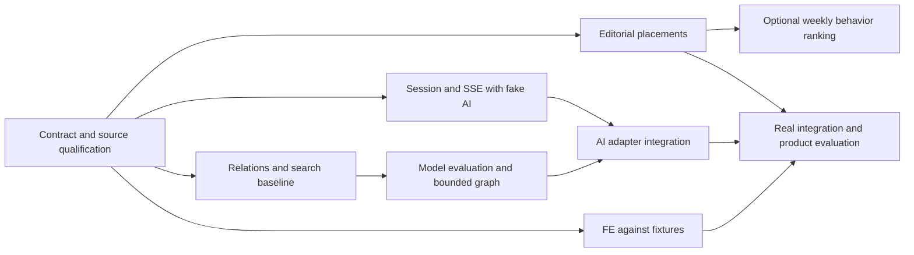

# 기존 이슈 계획과 ADR에 확장 요구를 반영하는 방법

이 문서는 확장 요구의 최초 영향 분석이다. W/X 후보는 현재 [work-graph.json](../work-graph.json)에 통합됐고 [통합 발행 초안](../implementation-issues.md)에 최신 제목·선행·wave·AC를 기록했다. GitHub Issue는 아직 발행하지 않았다. 아래 표보다 통합 초안이 우선하며 X6 fixture 완료와 X8 실서버 통합을 분리한다.

## 기존 계획의 수정점

| 기존 항목 | 유지 | 수정할 내용 |
|---|---|---|
| W0 계약 검증 | 원본/FE 차이 해소 | 실제 question+filters 도슨트, discover mock, 인기·온기 라벨 추가. 새 계약은 별도 경로 |
| W4 한옥 큐레이션 | 장소 조회 | 다중 자원 게시판은 content 소유. catalog 큐레이션을 이중 원본으로 남기지 않도록 이관 |
| W5 온기 | 서버 UGC | 공공 방문 관측과 분리, 로컬 작성 기록 동의 기반 이관 |
| W6 insights | 지역 집계와 근거리 | 행정코드·날짜·결측·산식·원본 페이지 검증, 장소 혼잡으로 과장 금지 |
| W7 Odii | 아카이브/재생·원본 ID | 공개 StoryLookup 계약과 검수된 story-place 관계, weekly 라벨 정정 |
| W8 색인 | 공개 corpus projection | 관계/evidence/revision 삭제 반영, 모델 비교 기준선 |
| W9 도슨트 | 기존 질의응답 호환 | 자유 탐색과 별도 use case. 기존 연결 종료 취소안은 durable exploration run에는 적용하지 않음 |
| W10/W11 | FE 통합·운영 | 새 exploration은 별도 통합 게이트, 기존 완료 기준 확대 시 graph 재계산 |

## 구현 후보와 인수 조건

각 후보는 독립 결과물과 검증 방법을 가진다. 선행 W 항목은 기존 계획상의 작업이며 완료됐다는 뜻이 아니다. X6은 FE 저장소의 별도 이슈로 연결할 수 있으므로 BE 이슈에 FE 파일을 조용히 포함하지 않는다.

| ID | 결과물 / 대응 요구 | 선행 | 예상 수정 경계 | 완료·검증 |
|---|---|---|---|---|
| X0 | 실제 데이터 매칭/계약 fixture / JX-01~09 | W0 | contracts/discovery, docs/reference-snapshots | 한 지역 mapping/evidence 검수, 정상·오류 OpenAPI/Schema 예제 검증 |
| X1 | article·주간 edition·placement API / JX-02,03 | X0,W2,W7 | modules/content, persistence/content, app/content | 검수 후 게시만 노출, revision/FK/권한 테스트, 잘못된 fallback 없음 |
| X2 | session·proposal·SSE lifecycle / JX-07,08,09 | X0,W1,W5 | discovery/session, persistence/discovery, app/discovery | Fake AI로 pin/version/cancel/replay/ownership 테스트 |
| X3 | 근거 관계·공개 projection·검색 기준선 / JX-04,05,11 | X0,W3,W7,W8 | discovery/relations, python/search, contracts/corpus | source 삭제/좌표 없음/동명 장소 테스트, recall/근거 baseline |
| X4 | HF/관리형 비교·제한 LangGraph / JX-04,05,09,11 | X3 | python/exploration, python/evals | 고정 평가셋, 인젝션/예산/시간 한도, 모델 선택 기록 |
| X5 | AI adapter·hydrate·stream 통합 / JX-04~09 | X2,X4 | adapters/ai-fastapi, app/discovery orchestration | stale evidence 제외, 장애 fallback, 늦은 결과 폐기, E2E backend |
| X6 | FE 선택 coordinator·보드·재접속 / JX-06~09,11 | X0 | FE journey-curator, FE shared selection/transport | fixture로 먼저 구현, X5 연결 후 모바일/키보드/E2E 게이트 |
| X7 | 유효 행동·주간 인기 집계 / JX-10 | X1,W5 | analytics/events, jobs/weekly, placements ranking adapter | KST 경계/중복/표본 부족/판 재현 테스트. 핵심 흐름과 독립 P2 |
| X8 | 실제 통합 평가·시연·운영 검증 / 출시 JX-01~11 | X1,X5,X6,W6 | e2e/discovery, docs/evaluation, ops/runbooks | 실제 데이터·비교 과업·장애복구·관측 메타데이터·비용 측정 |

X6의 시작은 X0 fixture 이후 가능하지만 **완료는 X5 실제 통합 이후**다. 최종 graph에서는 FE fixture PR과 통합 게이트를 구분해 거짓 독립 완료가 되지 않게 한다. X7은 충분한 표본이 없으면 집계 기능을 검증해도 인기 화면은 비공개로 둔다. JX-12는 별도 실험 backlog이며 이번 출시 graph에 포함하지 않는다.

위 그림은 X 후보만의 개념 DAG다. 전체 wave는 W 선행 관계를 합쳐야 계산할 수 있다. shared settings.gradle.kts, app composition, migration version registry, 계약 파일은 통합 담당자만 직렬 변경한다. X2/X5의 app/discovery 공유 경계는 선행 관계로 직렬화한다. 계약 수정 시 X0 합의 버전을 갱신하고 소비자 이슈를 다시 검증한다.

## ADR 검토 후보

기존 [ADR 제안](../adr-proposals.md)의 D1~D4와 아래 결정을 함께 검토한다. 정식 ADR 번호는 아직 배정하지 않는다. 기능마다 무조건 ADR을 만들기보다 데이터 의미·프로토콜·의존성 같은 장기 비용 경계를 기록한다.

| 후보 | 문제와 제안 | 대안·기각 이유 | 비용/재검토 조건 |
|---|---|---|---|
| E1 탐색 계약과 UI 소유권 | 서버는 검증된 refs/typed blocks, FE는 layout/interaction | 자유 HTML/React 생성은 보안·접근성·테스트 경계 확대 | registry 양측 배포. 표현력 반복 부족 시 schema 확장 |
| E2 관계 검색 | PostgreSQL typed relation + hybrid retrieval | Neo4j/대형 GraphRAG는 현재 질의·운영 근거 부족 | 다단계 검색 개선과 DB 병목 측정 후 재검토 |
| E3 run/SSE 상태 | HTTP command + durable run + SSE + snapshot | 단일 POST stream은 재접속 취약, WebSocket은 양방향 필요 낮음 | 이벤트 저장·lease 비용. 공동 편집 시 재검토 |
| E4 추천·온기 의미 | 편집/행동/공급자 순위와 UGC/지역 관측 분리 | 단일 인기/온기 숫자는 출처와 해상도 혼합 | 라벨·판 운영 비용. 원본 해상도 변경 시 정책 version |
| E5 AI 실행 경계 | 공개 projection, canonical 재검증, bounded graph/harness | Python business DB 직접 접근과 무제한 tool은 소유권/권한 위험 | projection 지연·중복 validation. 최신성 SLA 초과 시 재검토 |

모델 제품명 자체는 비교 실험 기록으로 충분할 수 있다. 장기 운영/라이선스/데이터 처리 경계를 바꾸는 모델 호스팅 결정은 별도 ADR 대상으로 승격한다. ADR-0001의 기록 절차를 유지하고 승인 전 accepted 결정을 만들지 않는다.

## 승인 후 순서

1. 두 참고 자료, 참가 부문/마감, 파일럿 데이터 커버리지와 핵심 흐름을 확인한다.
2. X0 계약 초안을 실제 OpenAPI/JSON Schema와 fixture로 확정한다. source provenance를 저장소 안에 재현 가능하게 고정한다.
3. W/X 중복 책임을 합쳐 work-graph.json 하나로 작성하고 validate_work_graph/compute_waves를 실행한다. 기존 graph의 공통 build 충돌5건도 해소 또는 직렬 통합한다.
4. 제목·선행 관계·wave·인수 조건을 사용자에게 보여주고 승인 후 GitHub native sub-issue/blocked-by 관계로 발행한다. 기존 열린 이슈를 재조회해 중복을 피한다.
5. ADR 후보를 승인받아 adr-toolkit 절차로 등록하고, 이슈별 구현·테스트·리뷰를 진행한다.

이번 문서 작성은 애플리케이션 구현이나 이슈 발행에 대한 암묵적 승인이 아니다.
