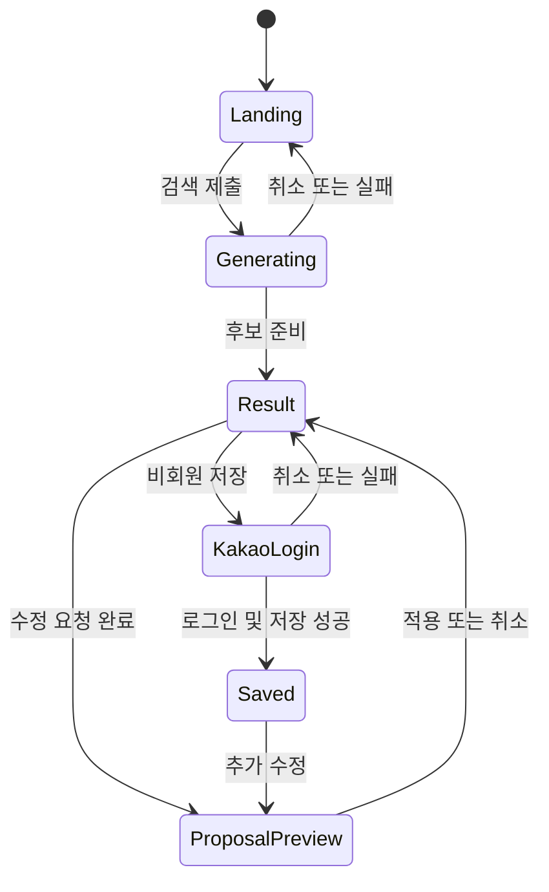
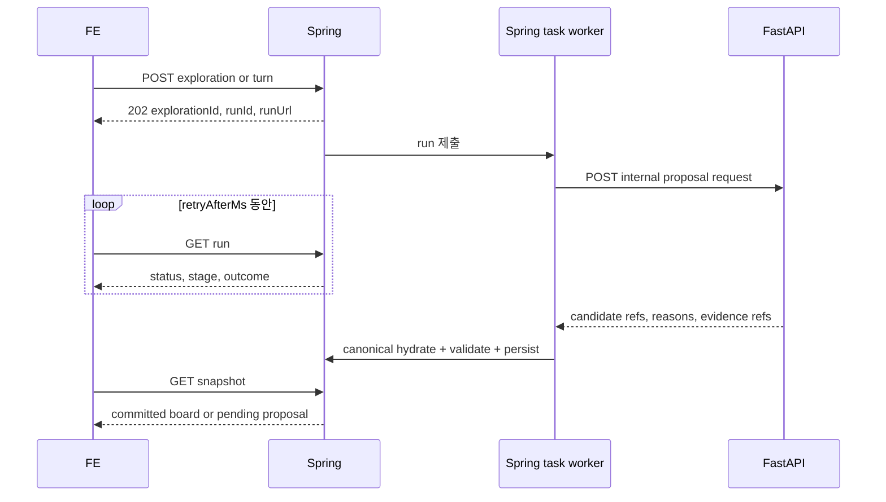

# 7일 MVP: 대화형 여정 탐색 FE 전달서

작성일: 2026-09-10.

상태: 사용자 방향 승인 / FE·BE 계약 검토안.

대상: OnMaru FE·Spring Boot·FastAPI 구현 담당

화면별 배치, 가로·세로 flow, API-to-component mapping과 모바일 구현 규칙은 [AI 여정 탐색 FE 경험·API 구현 보고서](fe-experience-api-implementation-report.md)를 함께 따른다.

## 1. 이번 제출에서 만들 제품

**여정 탐색은 사용자의 한 문장을 실제 장소 후보와 연결 이유로 바꾸고, 마음에 든 장소를 남긴 채 대화로 나머지 선택을 좁혀 가는 화면이다.**

이번 7일 MVP의 기억점은 일정표 자동 생성이나 큰 지식그래프가 아니다.

> “시장은 빼고 역사 이야기를 더 넣어줘.”
>
> 사용자가 남긴 장소는 유지되고, 제외·추가되는 후보와 연결 이유가 적용 전에 보인다.

오디와 AI 도슨트는 이번 여정 탐색 MVP에서 제외한다. P0가 안정되고 시간이 남을 때 한 건을 읽기 전용으로 연결할 수 있는 후속 선택 범위이며, 여정 탐색의 완료를 막지 않는다.

## 2. 확정된 제품 결정

| 항목 | 7일 MVP 결정 |
|---|---|
| 우선 화면 | `/discover` 여정 탐색 |
| 첫인상 | 검색창과 실제 장소 이미지가 조화를 이루는 랜딩형 시작 화면 |
| 검색 이후 | 랜딩이 축소되고 같은 페이지 안에서 작업 공간으로 전환 |
| 결과 | 한 지역의 장소 후보 최대 3개와 후보별 연결 이유 |
| 핵심 상호작용 | 고정, 제외, 대화형 수정, 변경안 비교, 적용·취소 |
| 여정 표현 | 이야기 순서의 가로 흐름과 장소 간 직선거리 기반 상대 길이 |
| 정보 보기 | 여정·지도·연결 3개 보기. 연결은 선택 주변의 작은 관계망 |
| 회원 | 카카오 로그인 1종, 여정 저장, 저장한 여정 다시 열기 |
| 비회원 | 검색·수정 가능. 저장 시 로그인 요청, 로그인 취소 시 현재 결과 유지 |
| AI 실행 | 하나의 제한된 탐색 workflow. 독립적인 여러 agent 협업은 사용하지 않음 |
| 모바일 | 같은 기능의 반응형 모바일 웹. 네이티브 앱과 오프라인은 이후 범위 |

## 3. 이번 MVP가 해결하는 사용자 문제

여행자는 장소 목록을 많이 받는 것보다 “왜 이곳이 내 관심과 맞는지” 이해하고, 마음에 든 후보를 잃지 않으면서 조건을 바꾸고 싶다. 현재 초안은 정해진 5개 플랜을 키워드로 교체하므로 자유 입력에 맞춘 결과나 선택 보존을 증명하지 못한다. 그래프와 카드도 동일한 선택 상태로 충분히 연결되지 않았고, 고정된 네 종류 카드가 질문과 무관하게 노출된다.

MVP는 다음 가설 하나를 검증한다.

> 연결 이유와 선택 보존형 재탐색이 일반 장소 목록보다 사용자가 원하는 후보를 이해하고 좁히는 데 도움이 된다.

## 4. 대표 데모 시나리오

파일럿 작업 지역은 **서울 종로구 서촌 일대**를 우선 검증한다. Day 1에 실제 장소 3곳 이상의 canonical ID·좌표·공개 설명·관계 근거를 확보하지 못하면, 동일 기능을 유지한 채 자료 완성도가 가장 높은 한 지역으로 교체한다. 현재 정적 mock의 장소명·사진·시간·혼잡 수치를 검증된 데이터로 간주하지 않는다.

1. 비회원 사용자가 랜딩에서 “서촌에서 한옥과 역사 이야기를 조용히 만나고 싶어”라고 입력한다.
2. 진행 상태 뒤 장소 후보 최대 3개와 각각의 연결 이유가 나타난다.
3. 사용자가 한 장소를 고정한다.
4. “시장은 빼고 역사 이야기를 더 넣어줘”라고 요청한다.
5. 기존 보드 위에 `유지 / 제외 / 추가` 변경안이 표시된다. 고정한 장소는 `유지`다.
6. 가로 여정 흐름에서 빠지는 장소와 새 장소, 다시 계산된 상대 거리를 적용 전에 확인한다.
7. 사용자가 적용하면 여정·지도·연결 보기가 같은 후보로 갱신된다. 취소하면 기존 보드가 그대로다.
8. 저장을 누르면 카카오 로그인을 요청한다. 취소해도 보드는 유지된다.
9. 로그인에 성공하면 현재 확정 보드를 저장하고 저장 목록에서 다시 연다.

데모 문장은 파일럿 자료에 맞춰 변경할 수 있지만 `고정 → 조건 수정 → 변경 비교 → 적용 → 저장` 순서는 바꾸지 않는다.

## 5. 화면 상태와 자연스러운 전환



### Landing

- 첫 viewport에는 Header, 짧은 제목, 한 줄 설명, 큰 검색창, 실제 지원 가능한 예시 질문 3개만 둔다.
- 결과가 아직 없을 때 큰 빈 그래프와 4개 고정 카드를 먼저 보여주지 않는다.
- 대표 장소 이미지 한 장 또는 파일럿 지역의 실제 이미지 흐름을 사용하되 검색창과 제목의 가독성을 보장한다.
- ‘AI’, ‘RAG’, ‘agent’, ‘지식그래프’ 같은 구현 용어를 첫 설명의 주어로 쓰지 않는다.

### Generating

- 검색 제출 즉시 입력 내용을 보존하고 중복 제출을 막는다.
- `조건 살피는 중 → 장소 찾는 중 → 연결 확인 중`의 제품 단계만 표시한다.
- 토큰 단위 답변과 모델 내부 추론은 표시하지 않는다.
- 사용자는 생성을 취소할 수 있다. 실패해도 입력값과 이전 확정 보드는 유지된다.

### Result workspace

- 랜딩 제목 영역은 Header 아래의 compact query bar로 축소한다.
- 축소와 workspace 등장은 250~400ms 범위의 한 번의 전환으로 제안한다. `prefers-reduced-motion`에서는 즉시 전환한다.
- 사용자 검색으로 발생한 전환에서는 workspace 제목으로 한 번만 이동한다. 이후 수정 요청마다 페이지 최상단으로 이동시키지 않는다.
- 데스크톱은 후보 보드와 선택 상세를 중심으로 두고, `여정 / 지도 / 연결` 보기를 전환한다.
- 모바일은 동일한 세 보기를 segmented control로 전환하고, 선택 상세는 bottom sheet 또는 인라인 확장 중 기존 디자인 체계에 맞는 하나만 사용한다.
- 하단 수정 입력은 콘텐츠를 가리지 않아야 하며 모바일 키보드가 열려도 적용·취소 버튼에 접근 가능해야 한다.

### Proposal preview

- 현재 보드를 유지한 채 변경 후보를 겹쳐 보여준다.
- 각 카드에는 `유지`, `제외`, `추가` 중 하나만 표시한다.
- 적용과 취소는 항상 함께 제공한다. AI 응답 도착만으로 보드를 바꾸지 않는다.
- 고정한 장소가 제외되는 잘못된 결과는 렌더링 전에 거절하고 오류 상태로 전환한다.

## 6. 정보 구조와 컴포넌트 책임

| 영역 | 책임 | 현재 요소 활용 방향 |
|---|---|---|
| Landing search | 최초 질문·예시 질문·제출 | `JourneyHeroSearch`를 idle/compact 두 형태로 확장 |
| Journey context | 현재 지역·관심·명시 조건 | 결과 상단의 짧은 summary와 removable condition chip |
| Journey flow | 후보 1~3개의 이야기 순서와 상대 거리 | 가로 place rail과 거리 connector, 모바일 horizontal scroll |
| Candidate board | 후보 1~3개 선택·고정·제외 | 고정 4종 Bento 대신 반복 가능한 place card |
| Selected detail | 연결 이유·근거·확인 불가 정보 | 선택된 카드 하나의 상세만 열기 |
| View switcher | 여정·지도·연결 전환 | 데스크톱과 모바일에서 같은 선택 상태 공유 |
| Relation view | 선택 주변 관계와 이유 | `KnowledgeGraphView`를 전체 장식에서 선택형 도구로 변경 |
| Refine composer | 조건 수정과 빠른 요청 | `JourneyRefineBar`를 workspace의 지속 입력으로 사용 |
| Proposal controls | 유지·제외·추가 비교와 적용 | 별도 preview state로 관리 |
| Save affordance | 로그인 또는 저장 상태 표시 | 비회원 저장 시 카카오 로그인, 회원은 저장 결과 표시 |

그래프·카드·지도는 하나의 `focusedRef`를 공유한다. hover는 강조만 하고 선택·재생·서버 상태를 바꾸지 않는다. 모바일에서는 관계를 동일 내용의 목록으로도 확인할 수 있어야 한다.

## 7. 후보 카드의 최소 정보

후보 카드는 다음 정보만 필수로 한다.

- 장소명, 종류, 지역
- 실제 대상과 일치하고 사용 가능한 이미지 또는 `이미지 없음`
- 사용자 요청과 연결된 이유 한 문장
- 위치가 있으면 지도 보기
- 고정·제외 동작
- 근거 또는 데이터 출처를 여는 동작
- `확인됨 / 미확인` 상태가 필요한 정보

일정 시각, 총 소요시간, 도보 거리, 운영시간, 접근성은 검증된 데이터가 있을 때만 노출한다. 후보 수를 맞추기 위해 허구 정보를 생성하지 않는다.

`실시간 온기`, `혼잡 지수`, `현재 방문객이 적다`, `추천 시간대`는 이번 데모에서 제거한다. 공공 지역 관측이나 실제 사용자 데이터의 의미·기준일·공간 단위가 검증된 후 별도 block으로 복귀시킨다.

### 장소 사이의 상대 거리 표현

이번 MVP는 길찾기 API나 실제 도보 경로를 계산하지 않는다. AI가 제안한 후보 순서를 **이야기 순서**로 사용하고, Spring이 순서상 인접한 두 장소의 좌표로 직선거리를 계산한다. FE는 이를 실제 비율 그대로 늘리지 않고 제한된 시각 단계로 바꿔 가로 흐름에 표시한다.

| `distanceBand` | 기본 의미 | 권장 connector 길이 |
|---|---|---|
| `NEAR` | 상대적으로 가까움 | 48px |
| `MEDIUM` | 중간 거리 | 88px |
| `FAR` | 상대적으로 멂 | 128px |
| `UNKNOWN` | 좌표 또는 계산값 없음 | 64px 점선 |

거리 구간의 미터 기준은 Day 1 파일럿 좌표 분포를 보고 fixture와 함께 고정한다. FE가 임의 threshold로 다시 분류하지 않으며, px 값은 반응형 레이아웃 안에서 조정할 수 있다.

- 표기 문구는 `장소 간 상대 거리` 또는 `직선 약 420m`를 사용한다.
- `추천 동선`, `최적 경로`, `도보 8분`처럼 실제 길찾기로 오인되는 문구는 사용하지 않는다.
- 선은 도로 모양의 지도 polyline이 아니라 두 장소의 관계를 잇는 단순 connector다.
- 데스크톱은 한 줄을 우선하되 컨테이너를 넘으면 가로 스크롤한다. 모바일은 카드 폭과 connector 길이를 고정하고 scroll snap을 사용한다.
- 정확한 거리를 읽지 못하는 사용자도 순서를 알 수 있도록 카드에 `1`, `2`, `3` 순번을 함께 제공한다.
- `prefers-reduced-motion`에서는 장소 교체와 connector 재배치를 즉시 반영한다.

변경안에서는 확정 흐름을 유지한 채 `removed` 장소와 기존 connector를 흐리게, `added` 장소와 새 connector를 구분해 표시한다. 애니메이션은 결과를 설명하는 보조 수단이며 `유지 / 제외 / 추가` 텍스트와 적용·취소 동작을 대체하지 않는다.

## 8. 작은 관계 보기

관계 보기는 선택한 장소를 중심으로 최대 노드 8개·연결 10개만 표시한다.

MVP 관계 종류는 다음 네 가지로 제한한다.

- 해당 지역에 위치
- 같은 검수 주제
- 근처에 위치
- 편집자가 함께 선정

`근처`는 좌표 계산 관계이고 역사·문화적 관련성을 의미하지 않는다. 의미 유사성만으로 역사적 배경 관계를 만들지 않는다. 연결을 선택하면 사람이 이해할 수 있는 이유와 근거를 보여준다. 서버는 관계와 근거를 제공하고 FE는 배치를 소유한다.

## 9. FE 상태 모델

FE는 다음 상태를 분리한다.

| 상태 | 서버 지속 여부 |
|---|---|
| query draft, active view, hover, open detail | 로컬 표현 상태 |
| focusedRef | 로컬 상태, 카드·지도·관계 보기에 공유 |
| committed board, pinnedRefs, stateVersion | 서버 확정 상태 |
| latest run, progress, error | 서버 실행 상태 |
| pending proposal | 서버 결과지만 적용 전 상태 |
| auth status, saved journey ID, save status | 회원·저장 상태 |

필수 화면 상태는 `idle`, `generating`, `result`, `proposal preview`, `empty`, `failed`, `auth cancelled`, `saving`, `saved`, `version conflict`다. FE는 backend가 늦어져도 이 상태를 fixture로 먼저 구현한다.

## 10. 통신 방식 결정: 이번 MVP는 polling

이번 제출에서는 **REST JSON command + 짧은 polling + snapshot**으로 확정한다. SSE와 토큰 스트리밍은 사용하지 않는다.

선택 이유는 다음과 같다.

- 화면에 필요한 진행 단계는 `조건 분석`, `후보 검색`, `관계 검증` 세 가지뿐이며 생성 토큰을 직접 보여주지 않는다.
- polling은 Spring·FE proxy·카카오 cookie·모바일 네트워크에서 연결 복구가 단순하다.
- 완료 결과를 snapshot으로 읽으므로 새로고침과 로그인 왕복 후에도 같은 상태를 복구할 수 있다.
- SSE를 위한 event 저장·cursor·gap replay·proxy buffering까지 7일에 함께 구현하지 않아도 된다.

FE는 run 응답의 `retryAfterMs`를 따르며 기본 1초 간격으로 조회한다. 브라우저가 background 상태일 때는 2초로 늦춘다. `COMPLETED`, `FAILED`, `CANCELLED`에서 polling을 끝낸다. 20초가 지나도 terminal 상태가 아니면 FE가 임의 성공 처리하지 않고 마지막 조회 후 `AI_TIMEOUT` 안내와 재시도 동작을 제공한다.

SSE가 필요해지면 동일한 run 상태와 snapshot을 유지한 채 진행 이벤트 전송만 추가한다. 장기 설계인 `fe-api-handoff.md`의 SSE 계약은 이번 제출 구현 기준이 아니다.



## 11. 브라우저가 호출할 API

모든 경로는 `/api/v1` 기준이다. 브라우저는 Spring API만 호출하고 FastAPI를 직접 호출하지 않는다. 배포에서는 같은 origin reverse proxy를 우선하여 cookie와 CSRF 처리를 단순화한다.

| Method·path | 인증 | 목적 |
|---|---|---|
| `POST /explorations` | 비회원 가능 | 새 탐색과 최초 run 생성 |
| `GET /explorations/{explorationId}` | 소유 guest/member | 최신 snapshot 조회 |
| `POST /explorations/{id}/turns` | 소유 guest/member | 현재 보드를 유지한 수정 run 생성 |
| `GET /explorations/{id}/runs/{runId}` | 소유 guest/member | polling으로 run 상태 조회 |
| `POST /explorations/{id}/runs/{runId}/cancel` | 소유 guest/member | 진행 중 run 취소 요청 |
| `POST /explorations/{id}/actions` | 소유 guest/member | PIN, UNPIN, APPLY, DISMISS |
| `GET /auth/kakao/login` | 공개 | 카카오 authorization 시작 |
| `GET /auth/kakao/callback` | 공개 callback | code·state 검증 후 회원 세션 생성 |
| `GET /members/me` | 회원 | 최소 회원 정보 조회 |
| `POST /auth/logout` | 회원 | OnMaru 인증 세션 종료 |
| `POST /saved-journeys` | 회원 | 확정된 탐색 snapshot 저장 |
| `GET /saved-journeys` | 회원 | 내 저장 여정 목록 |
| `GET /saved-journeys/{savedJourneyId}` | 소유 회원 | 저장 여정 다시 열기 |

### 최초 탐색

```http
POST /api/v1/explorations
{
  "query": "서촌에서 한옥과 역사 이야기를 조용히 만나고 싶어",
  "locale": "ko-KR",
  "regionCode": "SEOUL-JONGNO"
}
```

`regionCode`는 선택 입력이다. 없으면 AI가 텍스트에서 해석하되 확정할 수 없으면 `CLARIFICATION_REQUIRED`로 끝낸다. 클라이언트가 보낸 지역명만으로 canonical region을 생성하지 않는다.

```http
HTTP 202
{
  "schemaVersion": "1.0",
  "explorationId": "exp_01",
  "runId": "run_01",
  "stateVersion": 0,
  "runUrl": "/api/v1/explorations/exp_01/runs/run_01",
  "snapshotUrl": "/api/v1/explorations/exp_01",
  "retryAfterMs": 1000
}
```

### run polling

```json
GET /api/v1/explorations/exp_01/runs/run_01
{
  "schemaVersion": "1.0",
  "runId": "run_01",
  "status": "RUNNING",
  "stage": "RETRIEVING",
  "outcome": null,
  "retryAfterMs": 1000,
  "startedAt": "2026-09-10T12:00:00Z",
  "deadlineAt": "2026-09-10T12:00:20Z",
  "error": null
}
```

`status`는 `QUEUED | RUNNING | COMPLETED | FAILED | CANCELLED`, `stage`는 `INTERPRETING | RETRIEVING | VALIDATING | PERSISTING`이다. `outcome`은 terminal 상태에서 `INITIAL_BOARD | PROPOSAL | CLARIFICATION_REQUIRED | NO_RESULTS` 중 하나다. stage 문구는 FE에서 한국어로 변환하며 서버 문자열을 그대로 사용자에게 노출하지 않는다.

`INITIAL_BOARD`가 성공하면 Spring이 최초 보드를 확정하고 `stateVersion`을 0에서 1로 올린다. 이후 수정 run의 `PROPOSAL`은 `pendingProposal`만 만들고 stateVersion을 바꾸지 않는다. 사용자가 APPLY해야 다음 확정 버전이 된다.

### 수정 요청

```http
POST /api/v1/explorations/exp_01/turns
{
  "clientTurnId": "0ec40e9a-d830-42bb-93c8-2aa416196fc7",
  "baseVersion": 2,
  "query": "고정한 장소는 두고 시장 대신 역사 이야기를 더 넣어줘"
}
```

`Idempotency-Key` header를 필수로 받고 `clientTurnId`와 함께 중복 제출을 막는다. exploration당 active run은 하나다. 이미 실행 중이면 `409 ACTIVE_RUN`을 반환한다.

### 명시적 상태 변경

```http
POST /api/v1/explorations/exp_01/actions
{
  "commandId": "f4aab744-6941-4ef7-9d55-f4a5de8af768",
  "baseVersion": 2,
  "action": {
    "type": "PIN",
    "resourceRef": {"type": "PLACE", "id": "place_101"}
  }
}
```

`action.type`은 `PIN | UNPIN | APPLY_PROPOSAL | DISMISS_PROPOSAL`만 허용한다. APPLY와 DISMISS는 `proposalId`를 요구한다. 실제 보드 변경만 `stateVersion`을 1 증가시킨다. 오래된 `baseVersion`은 `409 VERSION_CONFLICT`이며 FE가 사용자 명령을 자동 재적용하지 않는다.

### 카카오 로그인과 저장

카카오 로그인은 아직 현재 FE에 구현돼 있지 않으므로 제출 P0 작업이다. PC·모바일 웹에 공통 적용 가능한 REST authorization code 흐름을 사용한다. 구현 기준은 [Kakao Login REST API 공식 문서](https://developers.kakao.com/docs/en/kakaologin/rest-api)다.

1. 비회원이 저장을 누르면 FE가 현재 exploration을 유지하고 `/api/v1/auth/kakao/login?returnTo=/discover&explorationId=exp_01`로 이동한다.
2. Spring은 일회용 `state`와 return context를 서버에 저장한 뒤 카카오로 redirect한다.
3. callback에서 Spring이 code·state를 검증하고 token을 교환해 내부 member를 연결한다.
4. Spring은 HttpOnly·Secure·SameSite=Lax 세션 cookie를 발급하고 `/discover`로 돌려보낸다.
5. FE는 `/members/me`를 조회한 뒤 마지막 committed snapshot을 `/saved-journeys`로 저장한다.

FE가 Kakao access token, refresh token, client secret을 localStorage에 저장하지 않는다. 지도 JavaScript 키와 로그인 REST API key·client secret을 섞지 않는다. state-changing 요청은 Spring Security가 발급한 CSRF token을 header로 전달한다. 로그인 취소·실패 시 익명 exploration cookie와 현재 보드를 유지한다.

```http
POST /api/v1/saved-journeys
{
  "explorationId": "exp_01",
  "expectedStateVersion": 3,
  "title": "서촌의 한옥과 역사"
}
```

```http
HTTP 201
{
  "savedJourneyId": "journey_01",
  "sourceExplorationId": "exp_01",
  "savedStateVersion": 3,
  "title": "서촌의 한옥과 역사",
  "savedAt": "2026-09-10T12:05:00Z"
}
```

## 12. FE에 전달할 데이터 타입

현재 FE의 고정 `BentoJourneyPlan`은 아래 계약으로 교체한다. exact field name은 OpenAPI 작성 시 이 문서와 같게 고정한다.

```ts
type ResourceType = 'PLACE' | 'REGION' | 'TOPIC';
type RelationType =
  | 'LOCATED_IN'
  | 'NEARBY'
  | 'SHARES_VERIFIED_TOPIC'
  | 'EDITORIAL_PAIRING';
type RunStatus = 'QUEUED' | 'RUNNING' | 'COMPLETED' | 'FAILED' | 'CANCELLED';
type RunStage = 'INTERPRETING' | 'RETRIEVING' | 'VALIDATING' | 'PERSISTING';
type RunOutcome = 'INITIAL_BOARD' | 'PROPOSAL' | 'CLARIFICATION_REQUIRED' | 'NO_RESULTS';

interface CreateExplorationRequest {
  query: string;
  locale: 'ko-KR';
  regionCode?: string | null;
}

interface AcceptedRun {
  schemaVersion: '1.0';
  explorationId: string;
  runId: string;
  stateVersion: number;
  runUrl: string;
  snapshotUrl: string;
  retryAfterMs: number;
}

interface RunSnapshot {
  schemaVersion: '1.0';
  runId: string;
  status: RunStatus;
  stage: RunStage | null;
  outcome: RunOutcome | null;
  retryAfterMs: number | null;
  startedAt: string | null;
  deadlineAt: string;
  error: ErrorEnvelope['error'] | null;
}

interface ResourceRef {
  type: ResourceType;
  id: string;
}

interface GeoPoint {
  latitude: number;
  longitude: number;
  accuracy: 'EXACT' | 'APPROXIMATE';
}

interface ImageAsset {
  url: string;
  alt: string;
  sourceName: string;
}

interface PlaceResource {
  ref: ResourceRef & { type: 'PLACE' };
  title: string;
  category: string;
  regionRef: ResourceRef & { type: 'REGION' };
  summary: string | null;
  image: ImageAsset | null;
  location: GeoPoint | null;
  sourceRefs: string[];
  unavailableFields: string[];
}

interface RegionResource {
  ref: ResourceRef & { type: 'REGION' };
  title: string;
}

interface TopicResource {
  ref: ResourceRef & { type: 'TOPIC' };
  title: string;
  description: string | null;
}

interface Evidence {
  id: string;
  kind: 'PROVIDER_FIELD' | 'EDITORIAL_NOTE' | 'SPATIAL_CALCULATION';
  sourceName: string;
  sourceUrl: string | null;
  sourceRevision: string | null;
  summary: string;
  asOf: string | null;
}

interface Relation {
  id: string;
  sourceRef: ResourceRef;
  targetRef: ResourceRef;
  type: RelationType;
  label: string;
  evidenceRefs: string[];
}

interface ConstraintCheck {
  key: 'REGION' | 'TOPIC' | 'PACE' | 'TIME_BUDGET';
  status: 'SATISFIED' | 'VIOLATED' | 'UNKNOWN';
  label: string;
  evidenceRefs: string[];
}

interface JourneyCandidate {
  placeRef: ResourceRef & { type: 'PLACE' };
  reason: string;
  evidenceRefs: string[];
  relationRefs: string[];
  constraintChecks: ConstraintCheck[];
}

type DistanceBand = 'NEAR' | 'MEDIUM' | 'FAR' | 'UNKNOWN';

interface JourneyLeg {
  fromRef: ResourceRef & { type: 'PLACE' };
  toRef: ResourceRef & { type: 'PLACE' };
  order: number;
  distanceMeters: number | null;
  distanceKind: 'STRAIGHT_LINE' | 'UNKNOWN';
  distanceBand: DistanceBand;
}

interface JourneyBoard {
  title: string;
  querySummary: string;
  regionRef: ResourceRef & { type: 'REGION' };
  candidates: JourneyCandidate[]; // 1..3
  legs: JourneyLeg[]; // candidates가 2개 이상이면 순서상 인접 장소 사이 N-1개
  resources: Array<PlaceResource | RegionResource | TopicResource>;
  relations: Relation[]; // max 10
  evidence: Evidence[];
}

interface JourneyProposal {
  id: string;
  baseVersion: number;
  expiresAt: string;
  keptRefs: ResourceRef[];
  addedRefs: ResourceRef[];
  removedRefs: ResourceRef[];
  board: JourneyBoard;
  unknowns: string[];
}

interface ExplorationSnapshot {
  schemaVersion: '1.0';
  explorationId: string;
  stateVersion: number;
  board: JourneyBoard | null;
  pinnedRefs: ResourceRef[];
  latestRun: {
    runId: string;
    status: RunStatus;
  } | null;
  pendingProposal: JourneyProposal | null;
  recentHistory: JourneyHistoryItem[]; // 시간 오름차순, 최대 20개
  updatedAt: string;
}

type JourneyHistoryType =
  | 'QUERY_SUBMITTED'
  | 'BOARD_COMMITTED'
  | 'PIN_CHANGED'
  | 'PROPOSAL_READY'
  | 'PROPOSAL_APPLIED'
  | 'PROPOSAL_DISMISSED'
  | 'RUN_FAILED';

interface JourneyHistoryItem {
  id: string;
  type: JourneyHistoryType;
  createdAt: string;
  query: string | null;
  runId: string | null;
  stateVersion: number;
  proposalId: string | null;
  affectedRefs: ResourceRef[];
}

interface MemberSummary {
  id: string;
  nickname: string;
  profileImageUrl: string | null;
  provider: 'KAKAO';
}

interface SavedJourneySummary {
  id: string;
  title: string;
  regionTitle: string;
  candidateCount: number;
  thumbnailUrl: string | null;
  savedAt: string;
  updatedAt: string;
}

interface SavedJourneyDetail {
  id: string;
  title: string;
  savedStateVersion: number;
  board: JourneyBoard;
  pinnedRefs: ResourceRef[];
  savedAt: string;
}

type ExplorationAction =
  | { type: 'PIN'; resourceRef: ResourceRef }
  | { type: 'UNPIN'; resourceRef: ResourceRef }
  | { type: 'APPLY_PROPOSAL'; proposalId: string }
  | { type: 'DISMISS_PROPOSAL'; proposalId: string };

interface ActionRequest {
  commandId: string;
  baseVersion: number;
  action: ExplorationAction;
}

interface ErrorEnvelope {
  error: {
    code:
      | 'INVALID_INPUT'
      | 'AUTH_REQUIRED'
      | 'NOT_FOUND'
      | 'ACTIVE_RUN'
      | 'VERSION_CONFLICT'
      | 'RATE_LIMITED'
      | 'AI_TIMEOUT'
      | 'AI_UNAVAILABLE'
      | 'NO_RESULTS'
      | 'RESOURCE_WITHDRAWN';
    message: string;
    retryable: boolean;
    traceId: string;
    details: Record<string, unknown> | null;
  };
}
```

`focusedRef`, active tab, hover, 열린 상세, 입력 중 query는 이 응답에 넣지 않는다. FE 로컬 표현 상태다. `resources`, `relations`, `evidence`의 모든 ref는 같은 snapshot 안에서 해석 가능해야 한다.

표준 오류는 다음 envelope를 사용한다.

```json
{
  "error": {
    "code": "VERSION_CONFLICT",
    "message": "최신 여정을 다시 불러와 주세요.",
    "retryable": false,
    "traceId": "trace_01",
    "details": {"currentStateVersion": 3}
  }
}
```

MVP 오류 코드는 `INVALID_INPUT`, `AUTH_REQUIRED`, `NOT_FOUND`, `ACTIVE_RUN`, `VERSION_CONFLICT`, `RATE_LIMITED`, `AI_TIMEOUT`, `AI_UNAVAILABLE`, `NO_RESULTS`, `RESOURCE_WITHDRAWN`으로 제한한다.

## 13. 실제로 채울 데이터와 제외할 데이터

현재 시점에는 Spring/FastAPI 런타임이 없으므로 위 payload를 실제 제공하고 있지 않다. 아래는 구현 시 원천별로 제공할 수 있는 범위다.

| 데이터 | MVP 원천·소유 | FE에 제공 | 이번에 제공하지 않음 |
|---|---|---|---|
| 장소 | Spring canonical catalog, TourAPI·검수 한옥 자료 | ID, 이름, 분류, 지역, 설명, 좌표, 이미지, 출처 | 검증되지 않은 운영시간·접근성 |
| 지역 | Spring region mapping | canonical code, 이름 | 문자열에서 임의 생성한 행정구역 |
| 주제 | 운영자가 고정한 작은 taxonomy | ID, 이름, 설명 | LLM이 즉석 생성한 무제한 주제 |
| 위치 관계 | Spring 좌표 계산 | LOCATED_IN, NEARBY와 계산 근거 | 실제 도보 경로·소요시간 |
| 여정 구간 | Spring 좌표 계산 | 후보 순서, 인접 장소 직선거리, 상대 거리 단계 | 길찾기 경로, 도보시간, 최단 순서 |
| 주제 관계 | 검수 relation fixture | SHARES_VERIFIED_TOPIC | 의미 유사성을 역사적 사실로 승격 |
| 편집 관계 | 제출용 검수 fixture | EDITORIAL_PAIRING과 이유 | AI가 근거 없이 만든 연결 |
| 이미지 | 원천 사용 가능 이미지 | URL, alt, source | 무관한 stock 이미지 fallback |
| 온기·혼잡 | 제외 | 없음 | 실시간 온기, 혼잡률, 추천 시간대 |
| 오디 | 제외 | 없음 | 음원, 대본, 도슨트 답변 |

Day 1에는 파일럿 장소3개 이상, REGION1개, TOPIC2~4개, relation 최대10개, evidence를 JSON fixture로 동결한다. FE는 이 fixture로 먼저 구현하고 Spring은 같은 schema를 반환한다.

## 14. Spring과 FastAPI 내부 계약

Spring은 비즈니스 상태·회원·canonical data의 소유자다. FastAPI는 후보 제안만 하고 DB 상태를 직접 변경하지 않는다.

Spring은 지역과 공개 상태로 최대30개 후보 문서를 먼저 제한한 뒤 FastAPI에 전달한다. 이 방식은 7일 MVP에서 outbox·별도 vector DB·전체 corpus 동기화를 피하면서도, 허용된 자료 안에서 조건 해석과 reranking을 검증할 수 있게 한다.

```ts
interface AiProposalRequest {
  runId: string;
  mode: 'INITIAL' | 'REFINE';
  query: string;
  locale: 'ko-KR';
  currentRefs: ResourceRef[];
  pinnedRefs: ResourceRef[];
  candidateDocuments: Array<{
    placeRef: ResourceRef & { type: 'PLACE' };
    title: string;
    regionRef: ResourceRef & { type: 'REGION' };
    category: string;
    summary: string;
    topicRefs: Array<ResourceRef & { type: 'TOPIC' }>;
    evidence: Evidence[];
  }>;
}

interface AiProposalResponse {
  runId: string;
  interpretation: {
    regionRef: ResourceRef | null;
    topicRefs: ResourceRef[];
    exclusions: string[];
    clarificationQuestion: string | null;
  };
  keptRefs: ResourceRef[];
  addedRefs: ResourceRef[];
  removedRefs: ResourceRef[];
  reasons: Array<{
    placeRef: ResourceRef;
    text: string;
    evidenceRefs: string[];
  }>;
}
```

FastAPI는 전달받지 않은 place·topic·evidence ID를 반환할 수 없다. Spring은 schema 검사 후 공개 여부, ref 존재, evidence 포함, 후보 최대3개, 고정 장소 보존을 다시 검증하고 canonical title·image·location을 hydrate한다. FastAPI가 반환한 장소명·좌표·운영정보를 저장하지 않는다.

Spring은 run을 DB에 먼저 저장하고 제한된 task executor에서 FastAPI를 동기 호출한다. browser 요청 thread에서 AI 완료를 기다리지 않는다. 초기 기준은 FastAPI connect timeout 1초, response timeout 15초, 전체 run deadline 20초다. 명시적 validation·rate limit 오류는 재시도하지 않는다. 응답을 받기 전 transport 실패만 같은 `runId`로 1회 재시도할 수 있다.

별도 broker, Redis, outbox, vector database는 이번 제출에 넣지 않는다. 프로세스 재시작으로 남은 `RUNNING` 상태는 deadline 이후 `FAILED/AI_UNAVAILABLE`로 정리하고 사용자가 같은 보드에서 다시 요청할 수 있게 한다.

## 15. FastAPI workflow

여러 agent를 만들지 않는다. 하나의 제한된 workflow가 다음 단계를 수행한다.

1. 질문에서 지역·관심·제외·유지 조건을 구조화한다.
2. Spring이 전달한 최대30개 후보 안에서 keyword·metadata 기준선을 적용한다.
3. 필요할 때만 embedding 또는 LLM reranking으로 후보 순서를 조정한다.
4. 검수 주제 관계와 좌표 기반 관계를 붙인다.
5. 후보 최대3개와 근거를 참조하는 변경 이유 및 이야기 순서를 만든다.
6. schema, evidence allowlist, pinned 보존을 코드로 검사한다.
7. Spring이 canonical data를 다시 검증하고 인접 후보의 직선거리와 `distanceBand`를 계산한 결과만 FE에 전달한다.

LangGraph를 사용한다면 위 고정 node의 실행 제어 용도로만 사용한다. 단순 query는 LLM 없이 처리할 수 있다. 필요하면 LLM 역할을 `조건 해석`과 `연결 이유 작성`으로 나눌 수 있지만 별도 자율 agent, agent 간 대화, 임의 도구 선택은 넣지 않는다. validator는 코드 규칙으로 구현한다.

## 16. 7일 실행 순서

| 시점 | FE | Spring Boot + FastAPI | 공동 확인 |
|---|---|---|---|
| Day 1 | 상태 모델·fixture·반응형 골격 | 파일럿 데이터와 계약 확정, 카카오 앱 설정 | 후보 3곳·대표 질의·응답 fixture 동결 |
| Day 2 | Landing → generating → workspace 전환, polling client | 익명 탐색 생성·run 조회, 검색 baseline | 정상 검색과 terminal polling 종료 |
| Day 3 | 후보 선택·고정·상세·보기 전환 | 수정 run·snapshot·고정 상태 | focusedRef와 canonical ref 일치 |
| Day 4 | proposal preview·적용·취소 | FastAPI workflow와 Spring 검증 | 고정 장소 보존, 실패 fallback |
| Day 5 | 카카오 로그인·저장·다시 열기 | OAuth callback·회원 연결·저장 API | 취소·성공·다른 계정 접근 차단 |
| Day 6 | 모바일·접근성·성능·오류 상태 | timeout·rate limit·관측 로그 | 전체 데모와 재접속 점검 |
| Day 7 | 기능 동결·데모 데이터 고정 | 기능 동결·복구 리허설 | 90초 데모 반복, 심각 오류만 수정 |

Day 1 계약과 fixture가 늦어지면 FE는 현재 mock 구조를 더 확장하지 않고, 합의된 응답 fixture로 화면 상태를 먼저 완성한다. Day 5 종료 시 핵심 흐름이 불안정하면 관계 보기는 목록 fallback을 기본으로 하고 시각 그래프 고도화를 중단한다.

## 17. P0, 시간 여유, 제외 범위

### 제출 P0

- 랜딩 검색과 자연스러운 workspace 전환
- 실제 한 지역·후보 최대 3개
- 후보별 연결 이유·근거 접근
- 선택·고정·대화형 변경 요청
- 유지·제외·추가 preview와 적용·취소
- 이야기 순서의 가로 흐름과 직선거리 기반 상대 connector
- 여정·지도·작은 관계 보기의 선택 동기화
- AI 실패·빈 결과에서도 기존 보드 유지
- 카카오 로그인, 저장, 다시 열기
- 데스크톱과 모바일 웹

### 시간이 남을 때 한 가지씩 추가

1. 로그인 없이 현재 committed board를 PDF로 인쇄·파일 저장
2. 로그인 회원의 committed board로 읽기 전용 공유 링크 생성
3. 저장 여정 제목 수정과 목록 polish
4. 답변 전용 질문 block
5. 관계 보기 전환 animation과 추가 접근성 점검
6. 오디 이야기 한 건을 읽기 전용 관련 콘텐츠로 연결

PDF는 FE의 인쇄 전용 layout과 브라우저 `window.print()`를 우선하며 서버 PDF 생성은 하지 않는다. 공유 링크는 익명 exploration URL을 노출하지 않고 개인 질문·위치·탐색 이력을 제외한 별도 snapshot을 생성해야 한다. 두 기능 모두 P0 카카오 저장·다시 열기가 안정된 뒤 착수하며, 공유 링크는 PDF보다 후순위다.

### 이번 제출에서 제외

- 오디 전용 AI 도슨트와 듣던 구간 질문
- 여러 자율 agent 또는 multi-agent 협업
- 전국 자동 일정·예약·결제·최적 경로
- 실제 도보 경로·도보시간 계산과 지도 경로선
- GPS 이동 추적과 방문 인증
- 실시간 혼잡·실시간 온기·행동 기반 인기 순위
- 장기 취향 학습과 개인화 모델
- 제출 P0의 공유 링크, 공동 편집·다중 인증 공급자
- 네이티브 앱, PWA 오프라인 패키지
- 임의 웹 검색·임의 SQL·임의 UI 생성

## 18. FE 완료 기준

- 1440px와 390px viewport에서 핵심 행동과 텍스트가 겹치지 않는다.
- 랜딩에서 검색 후 workspace로 이동하고, 뒤로 가기 또는 새 탐색으로 시작 상태를 회복한다.
- 카드·지도·관계 보기의 선택이 같은 canonical ref를 가리킨다.
- 가로 흐름의 순서와 `JourneyBoard.candidates`, `JourneyLeg`의 ref가 일치한다.
- 상대 거리 connector가 직선거리임을 알 수 있고 실제 도보 경로나 시간으로 표현되지 않는다.
- 고정한 후보가 변경 preview와 적용 후에도 유지된다.
- proposal 취소, AI timeout, 로그인 취소에서 마지막 확정 보드가 유지된다.
- 로딩·빈 결과·오류·저장 중·저장 완료 상태에 layout shift가 크지 않다.
- 마우스 없이 후보 선택·고정·보기 전환·적용·취소·저장이 가능하다.
- 감소된 모션 환경에서 기능 손실 없이 전환이 즉시 일어난다.
- 실제 이미지·장소명·연결 이유가 같은 자원을 가리키며 demo/mock 여부가 섞이지 않는다.
- 브라우저 새로고침 후 저장한 회원 여정을 다시 열 수 있다.
- polling이 terminal 상태·화면 이탈·새 요청에서 중단되고 동시에 두 run을 만들지 않는다.
- FE fixture와 Spring JSON이 같은 OpenAPI schema 및 enum을 사용한다.

## 19. 미확정이지만 Day 1에 닫을 항목

- 서촌 실제 자료가 P0 데모를 충족하는지와 대체 지역
- 후보 3곳과 대표 최초 질문·수정 질문의 최종 문구
- Kakao Developers 앱의 redirect URI와 요청 동의 항목
- Spring·FE origin, cookie, CSRF 및 배포 도메인
- AI 사용량 상한과 timeout 수치
- 상대 거리 `NEAR / MEDIUM / FAR`의 파일럿 미터 threshold

위 항목은 기능 방향을 다시 논의하기 위한 목록이 아니다. Day 1 fixture와 배포 환경을 확정하기 위한 구현 입력이다.

## 20. 관련 문서와 우선순위

이 문서는 7일 제출 범위에 한해 기존 장기 기획보다 우선한다. 장기 회원·공유·현장 경험은 `journey-service-plan.md`, 제출 이후 SSE 확장은 `fe-api-handoff.md`, 데이터 의미와 AI 경계는 `architecture-and-recommendation.md`를 따른다. 충돌하면 이번 MVP에서는 이 문서의 polling 결정, 제외 범위와 후보 수 제한을 적용한다.
