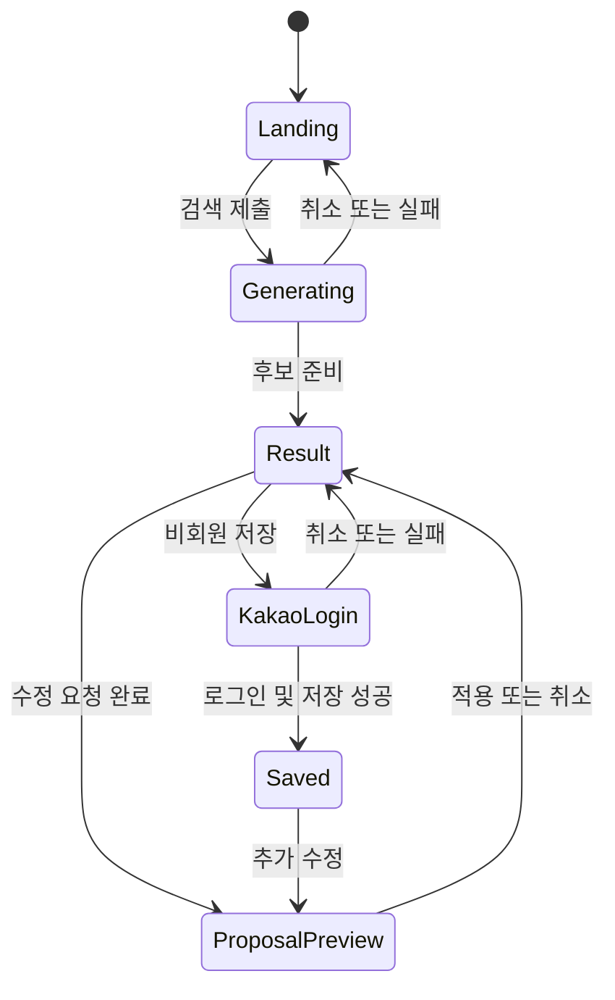

# 7일 MVP: 대화형 여정 탐색 FE 전달서

작성일: 2026-09-10.

상태: 사용자 방향 승인 / FE·BE 계약 검토안.

대상: OnMaru FE·Spring Boot·FastAPI 구현 담당

## 1. 이번 제출에서 만들 제품

**여정 탐색은 사용자의 한 문장을 실제 장소 후보와 연결 이유로 바꾸고, 마음에 든 장소를 남긴 채 대화로 나머지 선택을 좁혀 가는 화면이다.**

이번 7일 MVP의 기억점은 일정표 자동 생성이나 큰 지식그래프가 아니다.

> “시장은 빼고 역사 이야기를 더 넣어줘.”
>
> 사용자가 남긴 장소는 유지되고, 제외·추가되는 후보와 연결 이유가 적용 전에 보인다.

오디와 AI 도슨트는 이번 여정 탐색 MVP에서 제외한다. P0가 안정되고 시간이 남을 때 한 건을 읽기 전용으로 연결할 수 있는 후속 선택 범위이며, 여정 탐색의 완료를 막지 않는다.

## 2. 확정된 제품 결정

| 항목 | 7일 MVP 결정 |
|---|---|
| 우선 화면 | `/discover` 여정 탐색 |
| 첫인상 | 검색창과 실제 장소 이미지가 조화를 이루는 랜딩형 시작 화면 |
| 검색 이후 | 랜딩이 축소되고 같은 페이지 안에서 작업 공간으로 전환 |
| 결과 | 한 지역의 장소 후보 최대 3개와 후보별 연결 이유 |
| 핵심 상호작용 | 고정, 제외, 대화형 수정, 변경안 비교, 적용·취소 |
| 정보 보기 | 여정·지도·연결 3개 보기. 연결은 선택 주변의 작은 관계망 |
| 회원 | 카카오 로그인 1종, 여정 저장, 저장한 여정 다시 열기 |
| 비회원 | 검색·수정 가능. 저장 시 로그인 요청, 로그인 취소 시 현재 결과 유지 |
| AI 실행 | 하나의 제한된 탐색 workflow. 독립적인 여러 agent 협업은 사용하지 않음 |
| 모바일 | 같은 기능의 반응형 모바일 웹. 네이티브 앱과 오프라인은 이후 범위 |

## 3. 이번 MVP가 해결하는 사용자 문제

여행자는 장소 목록을 많이 받는 것보다 “왜 이곳이 내 관심과 맞는지” 이해하고, 마음에 든 후보를 잃지 않으면서 조건을 바꾸고 싶다. 현재 초안은 정해진 5개 플랜을 키워드로 교체하므로 자유 입력에 맞춘 결과나 선택 보존을 증명하지 못한다. 그래프와 카드도 동일한 선택 상태로 충분히 연결되지 않았고, 고정된 네 종류 카드가 질문과 무관하게 노출된다.

MVP는 다음 가설 하나를 검증한다.

> 연결 이유와 선택 보존형 재탐색이 일반 장소 목록보다 사용자가 원하는 후보를 이해하고 좁히는 데 도움이 된다.

## 4. 대표 데모 시나리오

파일럿 작업 지역은 **서울 종로구 서촌 일대**를 우선 검증한다. Day 1에 실제 장소 3곳 이상의 canonical ID·좌표·공개 설명·관계 근거를 확보하지 못하면, 동일 기능을 유지한 채 자료 완성도가 가장 높은 한 지역으로 교체한다. 현재 정적 mock의 장소명·사진·시간·혼잡 수치를 검증된 데이터로 간주하지 않는다.

1. 비회원 사용자가 랜딩에서 “서촌에서 한옥과 역사 이야기를 조용히 만나고 싶어”라고 입력한다.
2. 진행 상태 뒤 장소 후보 최대 3개와 각각의 연결 이유가 나타난다.
3. 사용자가 한 장소를 고정한다.
4. “시장은 빼고 역사 이야기를 더 넣어줘”라고 요청한다.
5. 기존 보드 위에 `유지 / 제외 / 추가` 변경안이 표시된다. 고정한 장소는 `유지`다.
6. 사용자가 적용하면 여정·지도·연결 보기가 같은 후보로 갱신된다. 취소하면 기존 보드가 그대로다.
7. 저장을 누르면 카카오 로그인을 요청한다. 취소해도 보드는 유지된다.
8. 로그인에 성공하면 현재 확정 보드를 저장하고 저장 목록에서 다시 연다.

데모 문장은 파일럿 자료에 맞춰 변경할 수 있지만 `고정 → 조건 수정 → 변경 비교 → 적용 → 저장` 순서는 바꾸지 않는다.

## 5. 화면 상태와 자연스러운 전환

### Landing

- 첫 viewport에는 Header, 짧은 제목, 한 줄 설명, 큰 검색창, 실제 지원 가능한 예시 질문 3개만 둔다.
- 결과가 아직 없을 때 큰 빈 그래프와 4개 고정 카드를 먼저 보여주지 않는다.
- 대표 장소 이미지 한 장 또는 파일럿 지역의 실제 이미지 흐름을 사용하되 검색창과 제목의 가독성을 보장한다.
- ‘AI’, ‘RAG’, ‘agent’, ‘지식그래프’ 같은 구현 용어를 첫 설명의 주어로 쓰지 않는다.

### Generating

- 검색 제출 즉시 입력 내용을 보존하고 중복 제출을 막는다.
- `조건 살피는 중 → 장소 찾는 중 → 연결 확인 중`의 제품 단계만 표시한다.
- 토큰 단위 답변과 모델 내부 추론은 표시하지 않는다.
- 사용자는 생성을 취소할 수 있다. 실패해도 입력값과 이전 확정 보드는 유지된다.

### Result workspace

- 랜딩 제목 영역은 Header 아래의 compact query bar로 축소한다.
- 축소와 workspace 등장은 250~400ms 범위의 한 번의 전환으로 제안한다. `prefers-reduced-motion`에서는 즉시 전환한다.
- 사용자 검색으로 발생한 전환에서는 workspace 제목으로 한 번만 이동한다. 이후 수정 요청마다 페이지 최상단으로 이동시키지 않는다.
- 데스크톱은 후보 보드와 선택 상세를 중심으로 두고, `여정 / 지도 / 연결` 보기를 전환한다.
- 모바일은 동일한 세 보기를 segmented control로 전환하고, 선택 상세는 bottom sheet 또는 인라인 확장 중 기존 디자인 체계에 맞는 하나만 사용한다.
- 하단 수정 입력은 콘텐츠를 가리지 않아야 하며 모바일 키보드가 열려도 적용·취소 버튼에 접근 가능해야 한다.

### Proposal preview

- 현재 보드를 유지한 채 변경 후보를 겹쳐 보여준다.
- 각 카드에는 `유지`, `제외`, `추가` 중 하나만 표시한다.
- 적용과 취소는 항상 함께 제공한다. AI 응답 도착만으로 보드를 바꾸지 않는다.
- 고정한 장소가 제외되는 잘못된 결과는 렌더링 전에 거절하고 오류 상태로 전환한다.

## 6. 정보 구조와 컴포넌트 책임

| 영역 | 책임 | 현재 요소 활용 방향 |
|---|---|---|
| Landing search | 최초 질문·예시 질문·제출 | `JourneyHeroSearch`를 idle/compact 두 형태로 확장 |
| Journey context | 현재 지역·관심·명시 조건 | 결과 상단의 짧은 summary와 removable condition chip |
| Candidate board | 후보 1~3개 선택·고정·제외 | 고정 4종 Bento 대신 반복 가능한 place card rail/grid |
| Selected detail | 연결 이유·근거·확인 불가 정보 | 선택된 카드 하나의 상세만 열기 |
| View switcher | 여정·지도·연결 전환 | 데스크톱과 모바일에서 같은 선택 상태 공유 |
| Relation view | 선택 주변 관계와 이유 | `KnowledgeGraphView`를 전체 장식에서 선택형 도구로 변경 |
| Refine composer | 조건 수정과 빠른 요청 | `JourneyRefineBar`를 workspace의 지속 입력으로 사용 |
| Proposal controls | 유지·제외·추가 비교와 적용 | 별도 preview state로 관리 |
| Save affordance | 로그인 또는 저장 상태 표시 | 비회원 저장 시 카카오 로그인, 회원은 저장 결과 표시 |

그래프·카드·지도는 하나의 `focusedRef`를 공유한다. hover는 강조만 하고 선택·재생·서버 상태를 바꾸지 않는다. 모바일에서는 관계를 동일 내용의 목록으로도 확인할 수 있어야 한다.

## 7. 후보 카드의 최소 정보

후보 카드는 다음 정보만 필수로 한다.

- 장소명, 종류, 지역
- 실제 대상과 일치하고 사용 가능한 이미지 또는 `이미지 없음`
- 사용자 요청과 연결된 이유 한 문장
- 위치가 있으면 지도 보기
- 고정·제외 동작
- 근거 또는 데이터 출처를 여는 동작
- `확인됨 / 미확인` 상태가 필요한 정보

일정 시각, 총 소요시간, 도보 거리, 운영시간, 접근성은 검증된 데이터가 있을 때만 노출한다. 후보 수를 맞추기 위해 허구 정보를 생성하지 않는다.

`실시간 온기`, `혼잡 지수`, `현재 방문객이 적다`, `추천 시간대`는 이번 데모에서 제거한다. 공공 지역 관측이나 실제 사용자 데이터의 의미·기준일·공간 단위가 검증된 후 별도 block으로 복귀시킨다.

## 8. 작은 관계 보기

관계 보기는 선택한 장소를 중심으로 최대 노드 8개·연결 10개만 표시한다.

MVP 관계 종류는 다음 네 가지로 제한한다.

- 해당 지역에 위치
- 같은 검수 주제
- 근처에 위치
- 편집자가 함께 선정

`근처`는 좌표 계산 관계이고 역사·문화적 관련성을 의미하지 않는다. 의미 유사성만으로 역사적 배경 관계를 만들지 않는다. 연결을 선택하면 사람이 이해할 수 있는 이유와 근거를 보여준다. 서버는 관계와 근거를 제공하고 FE는 배치를 소유한다.

## 9. FE 상태 모델

FE는 다음 상태를 분리한다.

| 상태 | 서버 지속 여부 |
|---|---|
| query draft, active view, hover, open detail | 로컬 표현 상태 |
| focusedRef | 로컬 상태, 카드·지도·관계 보기에 공유 |
| committed board, pinnedRefs, stateVersion | 서버 확정 상태 |
| latest run, progress, error | 서버 실행 상태 |
| pending proposal | 서버 결과지만 적용 전 상태 |
| auth status, saved journey ID, save status | 회원·저장 상태 |

필수 화면 상태는 `idle`, `generating`, `result`, `proposal preview`, `empty`, `failed`, `auth cancelled`, `saving`, `saved`, `version conflict`다. FE는 backend가 늦어져도 이 상태를 fixture로 먼저 구현한다.

## 10. BE·FastAPI와 맞출 최소 계약

기존 HTTP command + SSE progress/result + HTTP snapshot 방향을 유지한다. FE는 LangGraph checkpoint나 내부 agent 이름을 알 필요가 없다.

필수 operation은 다음과 같다.

| Operation | FE가 보내는 핵심 값 | FE가 받는 핵심 값 |
|---|---|---|
| 탐색 생성 | query, locale, optional region | sessionId, stateVersion, events URL |
| 탐색 조회 | sessionId | committed board, pinned refs, current run/proposal |
| 수정 요청 | query, baseVersion, pinned/replace refs | runId, progress와 proposal |
| 고정·해제 | resourceRef, baseVersion | 새 snapshot |
| 제안 적용·취소 | proposalId, baseVersion | 적용 후 snapshot 또는 기존 snapshot |
| 카카오 로그인 시작 | return target, 익명 session reference | authorization redirect |
| 현재 회원 조회 | 없음 | member ID, nickname 최소 정보 |
| 여정 저장 | sessionId, stateVersion, optional title | savedJourneyId, savedAt |
| 저장 여정 목록·조회 | cursor 또는 savedJourneyId | 공개 자원으로 다시 검증된 snapshot |

카카오 로그인은 PC·모바일 웹에 공통 적용 가능한 REST authorization code 흐름을 기준으로 한다. FE가 카카오 access token을 장기 저장하거나 Spring 대신 비즈니스 소유권을 판단하지 않는다. 로그인 시작과 callback·token 교환·내부 회원 연결은 Spring이 소유하고, 요청별 `state`를 검증한다. 카카오 앱 설정, redirect URI, 동의 항목과 최소 프로필 범위는 Day 1에 고정한다.

구현 시 기준 문서는 [Kakao Login REST API 공식 문서](https://developers.kakao.com/docs/en/kakaologin/rest-api)다. 지도 JavaScript 키와 로그인 REST API 키·client secret의 용도와 노출 범위를 섞지 않는다.

비회원 저장에서 로그인으로 이동하기 전 현재 `sessionId`와 복귀 URL을 서버가 검증 가능한 방식으로 보존한다. 로그인 취소·실패 시 현재 보드를 삭제하지 않는다. 로그인 성공 후 active run이나 pending proposal이 아닌 마지막 committed board만 저장한다.

## 11. FastAPI 실행 범위

여러 agent를 만들지 않는다. 하나의 제한된 workflow가 다음 단계를 수행한다.

1. 질문에서 지역·관심·제외·유지 조건을 구조화한다.
2. Spring이 허용한 공개 장소 projection에서 후보를 찾는다.
3. 검수 관계와 좌표 기반 관계를 붙인다.
4. 후보 최대 3개와 변경 이유를 만든다.
5. schema, 근거, 고정 장소 보존을 검사한다.
6. Spring이 canonical data로 다시 확인한 결과만 FE에 전달한다.

필요하면 LLM 역할을 `조건 해석`과 `연결 이유 작성`으로 나눌 수 있지만 별도 자율 agent, agent 간 대화, 임의 도구 선택은 넣지 않는다. validator는 가능한 한 코드 규칙으로 구현한다. 이 구성이 7일 MVP의 비용·실패 지점·디버깅 범위를 가장 작게 유지한다.

## 12. 7일 실행 순서

| 시점 | FE | Spring Boot + FastAPI | 공동 확인 |
|---|---|---|---|
| Day 1 | 상태 모델·fixture·반응형 골격 | 파일럿 데이터와 계약 확정, 카카오 앱 설정 | 후보 3곳·대표 질의·응답 fixture 동결 |
| Day 2 | Landing → generating → workspace 전환 | 익명 탐색 생성·조회, 검색 baseline | 정상 검색 연결 |
| Day 3 | 후보 선택·고정·상세·보기 전환 | 수정 run·snapshot·고정 상태 | focusedRef와 canonical ref 일치 |
| Day 4 | proposal preview·적용·취소 | FastAPI workflow와 Spring 검증 | 고정 장소 보존, 실패 fallback |
| Day 5 | 카카오 로그인·저장·다시 열기 | OAuth callback·회원 연결·저장 API | 취소·성공·다른 계정 접근 차단 |
| Day 6 | 모바일·접근성·성능·오류 상태 | timeout·rate limit·관측 로그 | 전체 데모와 재접속 점검 |
| Day 7 | 기능 동결·데모 데이터 고정 | 기능 동결·복구 리허설 | 90초 데모 반복, 심각 오류만 수정 |

Day 1 계약과 fixture가 늦어지면 FE는 현재 mock 구조를 더 확장하지 않고, 합의된 응답 fixture로 화면 상태를 먼저 완성한다. Day 5 종료 시 핵심 흐름이 불안정하면 관계 보기는 목록 fallback을 기본으로 하고 시각 그래프 고도화를 중단한다.

## 13. P0, 시간 여유, 제외 범위

### 제출 P0

- 랜딩 검색과 자연스러운 workspace 전환
- 실제 한 지역·후보 최대 3개
- 후보별 연결 이유·근거 접근
- 선택·고정·대화형 변경 요청
- 유지·제외·추가 preview와 적용·취소
- 여정·지도·작은 관계 보기의 선택 동기화
- AI 실패·빈 결과에서도 기존 보드 유지
- 카카오 로그인, 저장, 다시 열기
- 데스크톱과 모바일 웹

### 시간이 남을 때 한 가지씩 추가

1. 저장 여정 제목 수정과 목록 polish
2. 답변 전용 질문 block
3. 관계 보기 전환 animation과 추가 접근성 점검
4. 오디 이야기 한 건을 읽기 전용 관련 콘텐츠로 연결

### 이번 제출에서 제외

- 오디 전용 AI 도슨트와 듣던 구간 질문
- 여러 자율 agent 또는 multi-agent 협업
- 전국 자동 일정·예약·결제·최적 경로
- GPS 이동 추적과 방문 인증
- 실시간 혼잡·실시간 온기·행동 기반 인기 순위
- 장기 취향 학습과 개인화 모델
- 공유·공동 편집·다중 인증 공급자
- 네이티브 앱, PWA 오프라인 패키지
- 임의 웹 검색·임의 SQL·임의 UI 생성

## 14. FE 완료 기준

- 1440px와 390px viewport에서 핵심 행동과 텍스트가 겹치지 않는다.
- 랜딩에서 검색 후 workspace로 이동하고, 뒤로 가기 또는 새 탐색으로 시작 상태를 회복한다.
- 카드·지도·관계 보기의 선택이 같은 canonical ref를 가리킨다.
- 고정한 후보가 변경 preview와 적용 후에도 유지된다.
- proposal 취소, AI timeout, 로그인 취소에서 마지막 확정 보드가 유지된다.
- 로딩·빈 결과·오류·저장 중·저장 완료 상태에 layout shift가 크지 않다.
- 마우스 없이 후보 선택·고정·보기 전환·적용·취소·저장이 가능하다.
- 감소된 모션 환경에서 기능 손실 없이 전환이 즉시 일어난다.
- 실제 이미지·장소명·연결 이유가 같은 자원을 가리키며 demo/mock 여부가 섞이지 않는다.
- 브라우저 새로고침 후 저장한 회원 여정을 다시 열 수 있다.

## 15. 미확정이지만 Day 1에 닫을 항목

- 서촌 실제 자료가 P0 데모를 충족하는지와 대체 지역
- 후보 3곳과 대표 최초 질문·수정 질문의 최종 문구
- Kakao Developers 앱의 redirect URI와 요청 동의 항목
- Spring·FE origin, cookie, CSRF 및 배포 도메인
- AI 사용량 상한과 timeout 수치
- 지도에서 실제 경로선을 표시할지, 위치 핀만 표시할지

위 항목은 기능 방향을 다시 논의하기 위한 목록이 아니다. Day 1 fixture와 배포 환경을 확정하기 위한 구현 입력이다.

## 16. 관련 문서와 우선순위

이 문서는 7일 제출 범위에 한해 기존 장기 기획보다 우선한다. 장기 회원·공유·현장 경험은 `journey-service-plan.md`, HTTP/SSE 상세는 `fe-api-handoff.md`, 데이터 의미와 AI 경계는 `architecture-and-recommendation.md`를 따른다. 충돌하면 이번 MVP에서는 이 문서의 제외 범위와 후보 수 제한을 적용한다.
