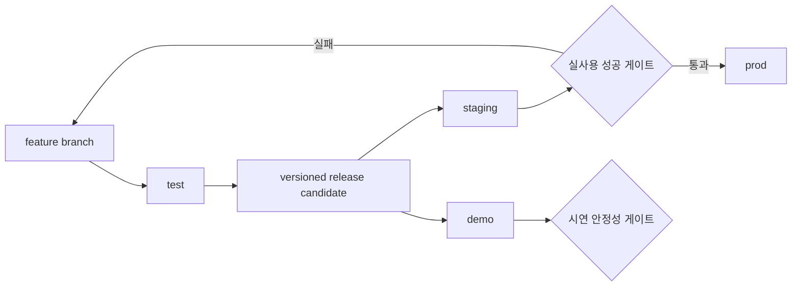

# 여정 탐색 환경·릴리스·성공 게이트

> **2026-09-11 개선 설계:** [감사 후속 계약](../revision-2026-09-11/README.md)이 최신 검토 기준이다. 모듈/DB·소유권·run 복구·방문 후기·검색·자원 정책은 해당 묶음을 우선한다. 구조 ADR은 초안 승인 대기이며 구현 완료를 뜻하지 않는다. 아래 장기 SSE/RAG 및 1.0 예시는 최신 MVP 계약과 구분한다.


작성일: 2026-09-10  
상태: 사용자 승인 방향 / 구현 전 설계  
대상: OnMaru FE, Spring Boot, FastAPI, 배포 담당

## 1. 결정

OnMaru 여정 탐색은 **실사용 가능한 `staging`과 `prod`를 제품 검증 기준**으로 삼는다. 라이브 심사의 외부 장애에 대비해 `demo` 환경도 운영하지만, 이는 실사용 성과를 대신하는 mock 제품이 아니라 동일 release artifact와 API 계약을 사용하는 격리된 비상 시연 환경이다.

심사와 리허설의 기본 환경은 `staging`이다. `demo` 전환은 실제 AI 또는 외부 관광 API 장애로 핵심 흐름을 보여줄 수 없을 때만 사용하고, 화면과 발표에서 전환 사실을 숨기지 않는다.

## 2. 환경 구조

| 환경 | 목적 | 데이터 | AI | 인증·저장 |
|---|---|---|---|---|
| `local` | 개발자 구현·디버깅 | fixture 또는 로컬 snapshot | stub 또는 실제 provider | 로컬 설정 |
| `test` | 자동 단위·계약·E2E 테스트 | 테스트 fixture | deterministic fake | 테스트 principal |
| `demo` | 비상 시연·반복 리허설 | 실제 장소를 검수한 고정 snapshot | deterministic adapter | 격리 DB와 카카오 테스트 앱 |
| `staging` | 실사용 전 통합 검증·기본 시연 | 실제 canonical 데이터 | BASELINE 또는 승인된 LLM | 실제 OAuth 흐름과 격리 DB |
| `prod` | 실제 사용자 서비스 | 실제 canonical 데이터 | BASELINE 또는 승인된 LLM | 운영 OAuth와 운영 DB |

`release`는 환경명이 아니라 검증을 통과한 versioned artifact다. 배포 흐름은 다음과 같다.



## 3. 환경이 달라도 같아야 하는 것

다음 항목은 `demo`, `staging`, `prod`에서 동일해야 한다.

- FE, Spring Boot, FastAPI의 release artifact version
- 공개 REST path와 OpenAPI schema
- exploration state와 `stateVersion` 전이
- pin 보존, proposal 적용·취소 불변식
- canonical ref와 evidence validation
- 오류 envelope와 timeout 처리
- 카카오 로그인 후 committed board만 저장하는 규칙
- 카드·지도·관계 보기의 `focusedRef` 의미
- 직선거리와 실제 도보 경로를 구분하는 표현

환경별로 달라질 수 있는 값은 credential, endpoint, DB, 로그 수준, data/provider mode, dataset revision과 승인된 feature flag뿐이다.

## 4. 설정 모델

환경과 provider 동작을 하나의 모호한 boolean으로 제어하지 않는다.

```yaml
APP_ENV: demo
DATA_MODE: VERIFIED_SNAPSHOT
ENGINE: BASELINE
AUTH_MODE: KAKAO_TEST_APP
DATASET_REVISION: seochon-2026-09-10
```

권장 enum은 다음으로 제한한다.

```text
APP_ENV  = local | test | demo | staging | prod
DATA_MODE = FIXTURE | VERIFIED_SNAPSHOT | LIVE_CANONICAL
ENGINE = BASELINE | LLM
AUTH_MODE = TEST_PRINCIPAL | KAKAO_TEST_APP | KAKAO_LIVE_APP
```

허용 조합을 시작 시 검증한다.

- `prod`: `LIVE_CANONICAL + (BASELINE 또는 LLM) + KAKAO_LIVE_APP` 허용; LLM은 평가와 금액/token cap 통과 필수
- `staging`: `LIVE_CANONICAL + BASELINE`을 기본으로 사용하고 LLM을 별도 평가
- `demo`: `VERIFIED_SNAPSHOT + BASELINE + KAKAO_TEST_APP`만 허용
- `test`: 외부 API와 운영 credential 접근 금지
- `local`: 명시적으로 선택하되 운영 credential을 기본값으로 사용하지 않음

잘못된 조합은 경고만 남기고 실행하지 않고 application startup을 실패시킨다.

## 5. Demo 데이터와 AI 규칙

Demo snapshot은 허구 장소나 심사용으로 꾸며낸 설명을 포함하지 않는다. 실제 파일럿 장소의 canonical ID, 좌표, 사용 가능한 이미지, 검수된 설명과 evidence를 특정 revision으로 고정한다.

Deterministic AI adapter는 같은 요청에 schema가 같은 재현 가능한 후보·변경안을 반환한다. LLM이 성공한 것처럼 숨기지 않고 snapshot에 실행 방식을 표시한다.

```ts
interface ExecutionDisclosure {
  environment: 'DEMO' | 'STAGING' | 'PRODUCTION';
  dataMode: 'VERIFIED_SNAPSHOT' | 'LIVE_CANONICAL';
  engine: 'BASELINE' | 'LLM';
  datasetRevision: string;
}
```

FE는 `DEMO`일 때 Header 또는 query context에 `데모 환경`을 지속 표시한다. 발표자는 demo 결과를 실시간 AI 성능이나 실제 사용자 성과로 설명하지 않는다.

## 6. Staging과 실사용 원칙

`staging`은 실제 관광 원천에서 수집·정규화한 canonical 데이터와 BASELINE 또는 평가를 통과한 LLM을 사용한다. 지원 범위 밖의 지역이나 근거가 부족한 조건은 후보 수를 억지로 채우지 않고 `NO_RESULTS` 또는 미확인 상태로 반환한다.

AI 장애 fallback이 필요하면 mock 답변이 아니라 현재 canonical 데이터에 대한 keyword·metadata baseline을 사용하고 결과에 실행 방식을 기록한다. fallback도 canonical/evidence 검증과 pin 보존 규칙을 통과해야 한다.

## 7. 성공 지표

### 제품 성공 지표

Staging 또는 prod의 실제 canonical 데이터에서 측정하고 BASELINE/LLM별로 분리한다. Demo 결과는 포함하지 않는다.

| 지표 | MVP 목표 |
|---|---:|
| 선택 보존형 여정 완료율 | 형성 평가 5명 중 4명 이상 |
| 실제 후보의 canonical·evidence 연결률 | 100% |
| 20회 수정 중 고정 장소 손실 | 0회 |
| 추천 이유를 설명할 수 있는 사용자 | 5명 중 4명 이상 |
| 최초 검증 보드 생성 | p95 8초 이하 |
| 전체 run 절대 timeout | 20초 |
| AI·로그인 실패 후 기존 board 보존 | 100% |
| 다른 로그인 세션에서 저장 여정 다시 열기 | 성공 |
| 허구 장소·근거 없는 사실 생성 | 0건 |

주 성공 지표인 `선택 보존형 여정 완료`는 다음 다섯 단계를 모두 마친 경우다.

```text
실제 데이터로 board 생성
→ 장소 한 곳 pin
→ 조건 수정
→ proposal 검토 후 적용 또는 취소
→ 카카오 로그인 후 저장
```

5명 평가는 형성 평가이며 시장성이나 통계적 우위를 입증한다고 주장하지 않는다.

### 시연 안정성 지표

Demo 결과를 제품 성공 지표와 합산하지 않는다.

| 지표 | 목표 |
|---|---:|
| 핵심 흐름 연속 리허설 | 20회 모두 완료 |
| Demo와 staging OpenAPI response schema 차이 | 0건 |
| Demo와 prod 회원·여정 데이터 교차 접근 | 0건 |
| 환경 표시 누락 | 0건 |
| 운영 credential의 demo/test 주입 | 0건 |

클릭 수, 대화 횟수, 그래프 노드 수, demo의 낮은 latency는 제품 성공 지표로 사용하지 않는다.

## 8. 라이브 심사 운영

1. 심사 전 staging health, 실제 데이터 revision, AI provider, Kakao callback을 점검한다.
2. staging에서 대표 질의로 핵심 흐름을 시연한다.
3. 외부 장애가 발생하면 기존 확정 board가 보존되는 모습을 먼저 보여준다.
4. 복구되지 않을 때만 demo URL로 전환하고 `검수 snapshot 기반 비상 환경`임을 밝힌다.
5. demo에서도 같은 검색·pin·수정·proposal·저장 UI와 API 계약을 사용한다.
6. 심사 후 demo 결과를 실제 사용 로그와 분리한다.

Demo 전환 판단을 발표자 개인의 즉흥 결정으로 두지 않는다. AI run이 연속 2회 timeout이거나 필수 외부 API health check가 실패하면 전환하는 식으로 사전 기준을 정한다.

## 9. 보안과 데이터 격리

- 환경별 DB, cookie domain, OAuth callback, encryption key를 분리한다.
- demo/test 계정이 prod API에 접근할 수 없어야 한다.
- 운영 service key를 FE bundle, fixture, demo 로그에 포함하지 않는다.
- `APP_ENV=demo` 응답에는 cache와 검색 노출을 제한한다.
- demo 데이터 초기화는 관리자 인증이 필요한 별도 운영 동작으로 제한한다.
- query와 회원 정보의 로그 수집 범위는 환경별로 달리 숨기지 않고 공통 최소화 정책을 사용한다.

## 10. 구현 순서와 중단 기준

1. OpenAPI와 INITIAL_BOARD·PROPOSAL·FAILED fixture를 확정한다.
2. Staging에서 실제 장소 3곳의 E2E를 먼저 완성한다.
3. 같은 port 계약의 deterministic adapter를 추가한다.
4. Demo snapshot과 환경 표시를 연결한다.
5. 환경 조합 startup validation과 데이터 격리 테스트를 추가한다.
6. Staging 실사용 게이트와 demo 리허설 게이트를 별도로 실행한다.

OpenAPI, 실제 canonical 데이터, staging 핵심 흐름이 준비되지 않았다면 demo 환경을 먼저 고도화하지 않는다. Demo 구축이 카카오 저장 또는 실제 E2E 완료를 늦추면 최소 deterministic adapter와 환경 표시만 남기고 운영 자동화는 제출 이후로 넘긴다.

## 11. 아직 구현 전에 닫아야 할 값

- staging, demo, prod의 실제 domain과 Kakao redirect URI
- 파일럿 dataset revision을 만드는 담당자와 갱신 절차
- AI provider와 환경별 credential 주입 방식
- demo 전환 health check와 발표자 runbook
- 로그 보존 기간과 실제 사용자 query 마스킹 정책
- 제품 지표를 기록할 최소 event와 사용자 평가 기록 양식

이 값들은 제품 방향을 다시 논의하기 위한 항목이 아니라 배포와 리허설을 위한 구현 입력이다.
