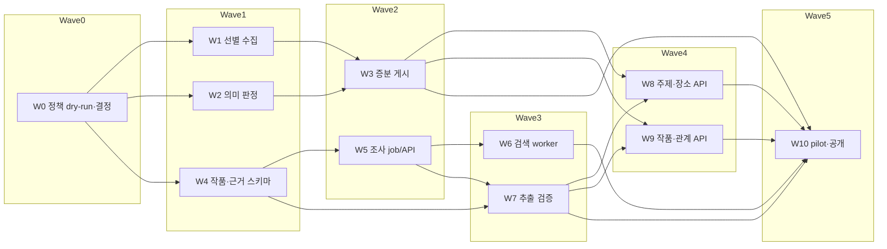

# 장소 선별·K-Contents 백엔드 구현 Issue Graph 초안

> 상태: **GitHub Child Issue 생성 전 검토안**. [`work-graph.json`](work-graph.json)이 작업별 목적·범위·제외 범위·예상 수정 경로·인수 기준·검증법의 기계 검증 원본이다. 승인 전 이 문서만으로 운영 정책이나 기존 API를 변경하지 않는다.

## 기준과 기존 이슈

- 제품 정책은 [통합 PRD](product-prd.md), 신규 조회 응답·오류는 [FE API 명세](../../contracts/discovery-kcontents-api.md), 현행 호환성은 [스크린 속 한옥 계약](../../contracts/screen-hanok-api.md)과 [FE–BE 추적표](../../specs/traceability/fe-be-traceability-matrix.md)를 따른다.
- 기존 백엔드 [#603](https://github.com/YRootLab/OnMaru-backend/issues/603)을 **Root 후보로 재사용**한다. 현재 본문의 3일·전체 catalog·즉시 100곳/150관계 조건은 최신 PRD의 주간 선별·단계적 50곳 품질 gate와 충돌한다. Child 발행 승인 때 본문을 갱신하되 과거 제안의 변경 이유를 남긴다. 신규 Root를 중복 생성하지 않는다.
- [#569](https://github.com/YRootLab/OnMaru-backend/issues/569)는 궁궐·문화재 누락 회귀 사례이며, 새 정책만으로 이슈를 자동 종료하지 않는다. 새 탐색 및 기존 지도 양쪽의 실제 응답을 검증해야 한다.
- FE [#366](https://github.com/YRootLab/OnMaru-Frontend/issues/366)은 신규 계약 검토 창구다. 이 graph는 BE 작업이며 FE 화면 구현을 포함하지 않는다.
- 심사 중 기존 홈·지도·한옥·상세·찜·소리마루·스크린 속 한옥 API와 기존 공개 장소 집합을 유지한다. 신규 탐색 revision과 GET 6개만 추가한다. 과거 원천/공개 데이터의 물리 삭제는 별도 승인·백업·전환 작업이다.

## 분해 기준과 병렬 실행

작업 하나는 독립 검증 가능한 PR 하나에 대응한다. PRD의 장별로 나누지 않고 원천 수집, 의미 판정, 게시, 작품 관계, 조사, 공개 조회라는 **수정 소유권**으로 나눴다. 같은 Wave라도 공통 DB migration registry·Gradle settings·Spring app wiring 같은 조립 파일을 동시에 고치지 않는다. 각 소유 PR은 자기 하위 패키지와 계약을 먼저 만들고, 조립은 해당 Wave의 통합 gate에서 순차 반영한다. 예상 경로가 바뀌면 작업 전에 graph의 `expected_touch_points`를 갱신한다.

| Wave | 병렬 가능한 Child 후보 | 완료 후 산출물 |
| --- | --- | --- |
| 0 | `W0` 정책 dry-run·결정 | 실제 데이터 표본, 34개 코드·구제/판정 정책 버전, 기존 API 기준선 |
| 1 | `W1` 선택 수집, `W2` 의미 판정, `W4` 작품·근거 스키마 | 서로 독립된 원천 후보·판정 함수·관계 저장 모델 |
| 2 | `W3` 증분 게시, `W5` durable 조사 job/API | 별도 신규 탐색 revision과 인증된 조사 lease |
| 3 | `W6` 로컬 검색 worker, `W7` 추출 검증·정규화 | 근거 수집과 서버 측 사실 승인/검수 |
| 4 | `W8` 주제·장소 API, `W9` 작품·촬영 관계 API | 기존 API에 영향 없는 신규 GET 6개 |
| 5 | `W10` 단계적 pilot·공개 | 품질/비용/회귀/롤백 증거와 FE 인계 |

`W6`과 `W7`은 검색 수집과 결과 검증으로 소유 파일이 분리되어 병렬 구현 가능하다. `W8`/`W9`도 각각 catalog 조회와 작품 조회를 소유한다. 다만 **운영 공개는 W10의 통합 gate 이후**다. 후속 작업의 선행 관계는 단순한 관련성이 아니라 시작에 필요한 계약/데이터가 실제로 없을 때만 걸었다.

## Issue별 구현·완료 증거

아래는 빠른 실행 요약이다. 실제 Child 본문은 `work-graph.json`의 `objective`, `context`, `scope`, `out_of_scope`, `implementation_notes`, `related_code`, `dependencies`, `expected_touch_points`, `parallel_notes`, `acceptance_criteria`, `verification_method`를 빠짐없이 옮겨 독립적으로 읽히게 작성한다.

| ID | 핵심 결과물 | 완료를 증명하는 주요 테스트/관측 |
| --- | --- | --- |
| W0 | 실데이터 dry-run, 정책 버전, ADR-0010 계승/변경안 | 34개 소분류 total/page/고유 ID, 구제 검색 중복, 기존 공개 교집합/차집합, #569 경복궁 사례·골든 fixture |
| W1 | 선택 소분류+keywordSearch2 수집 어댑터 | 페이지 누락/totalCount 불일치/중복 contentId/429·timeout에서 완료 처리 금지 |
| W2 | `INCLUDE/REVIEW/EXCLUDE`와 장소 역할 매핑 | 궁궐≠HANOK, 카페/체험마을 조건부, 사찰/서원 낮은 대표성, 좌표 오류·사람 override 회귀 |
| W3 | `modifiedtime` 힌트+SHA-256 diff, 주간 신규 revision 게시 | 신규/변경/동일/누락·hash 불일치, 실패 시 LKG, 같은 run 멱등성, legacy active 불변 |
| W4 | K-Contents 작품/alias/관계/근거/태그/요약 스키마 | place 내부 ID FK, 관계 UNIQUE, 출처 N개, 미검증 비공개, Flyway/DBML 검증 |
| W5 | 서버 소유 조사 job, 인증 lease·제출 API | lease 경쟁·만료·중복 제출·잘못된 evidence ID·재시도/FAILED·운영 재큐잉 |
| W6 | 로컬 검색 worker/n8n 연결 | URL dedup·지역 disambiguation·quota 제한·꺼짐/재기동 복구, 100건 비용/발견율 |
| W7 | evidence 한정 추출·서버 검증·검수 큐 | hallucination/부정문/동명이인/MV 아닌 화보 차단, alias dedup, 근거 없는 태그만 격리 |
| W8 | `/discovery/topics`, `/discovery/places`, `/discovery/places/{placeId}` | 고유 장소 facet/count·cursor·guest saved 상태·이미지 권리·오류 fixture |
| W9 | `/k-contents/works`, `/k-contents/works/{workId}`, `/places/{placeId}/k-contents` | 검증 관계/복수 출처만 노출, 작품 alias/태그 검색, null 이미지, 0건과 404 구별 |
| W10 | 100→1000건 pilot, 7개 기존 카드 재검증, 단계적 공개 | precision/다양성/비용/실패율·기존 FE 전 경로 회귀·스테이징 rollback·FE 인계 |

## Wave 경계의 통합 gate

1. **0→1:** 34개 코드·구제 키워드·역할/판정 표본과 기존 공개 기준선을 동결한다. 검색/CLI 약관·quota가 불확실하면 W6 대량 자동화는 계속 비활성화한다.
2. **1→2:** 같은 TourAPI fixture에서 W1이 만든 contentId 후보를 W2가 결정론적으로 판정하고, W4 migration은 운영과 분리된 DB에서 적용·복구된다.
3. **2→3:** 기존 게시 pointer가 바뀌지 않은 상태에서 W3의 신규 revision과 W5의 job 생성·재실행·lease idempotency가 통합 테스트를 통과한다.
4. **3→4:** 검색 원문을 저장하지 않고도 evidence bundle→추출→서버 검증→관계 저장이 재현된다. 검색/CLI 장애와 잘못된 JSON에서도 기존 게시 관계를 삭제하지 않는다.
5. **4→5:** GET 6개 OpenAPI/fixture와 HTTP 오류(400/404/410/429/500/503), cursor revision/facet, legacy golden fixture가 함께 통과한다.
6. **공개 전:** W10의 스테이징 rollback·실측 precision·권리·비용 결과를 검토한다. 검증 장소 50곳은 목표이지 자동 게시 하한선이 아니다.

## 미정과 Issue 발행 절차

- 새 탐색 revision 보존 기간, `NO_MATCH` 재조사 TTL, 검색 provider/무료·유료 quota, CLI 자동화 이용 허용, 태그 어휘·관계 confidence threshold, 물리 삭제 보존 기간은 실측/권리 검토 뒤 고정한다. 숫자를 추정해 인수 조건으로 박지 않는다.
- 현재 #603과 #569의 완료 조건은 최신 설계만으로 충족되지 않는다. #603은 이 graph 승인 후 Root 본문을 개정하고 Child를 **GitHub native Sub-Issue / blocked-by**로 연결한다. #569는 기존 지도에 궁궐이 나타나는지 별도 재현/검증 전 닫지 않는다.
- graph 승인 전에는 **Child Issue를 생성하지 않는다**. 승인 후 기존 중복을 재검색하고 #603 개정 → Child 발행 → 관계 연결 → Root/Child Mermaid와 실제 번호 갱신 → API로 관계 재검증한다.
