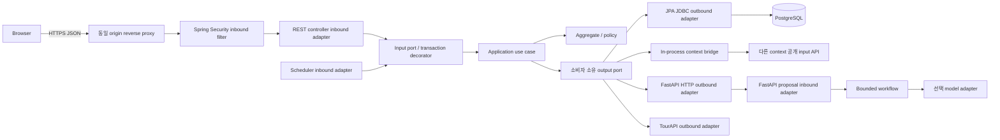
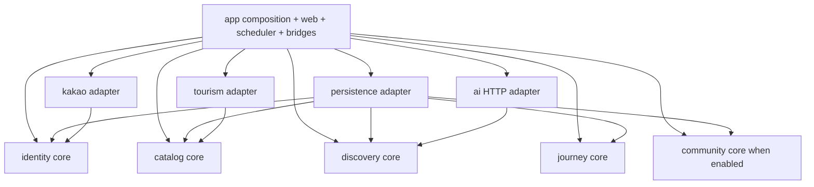

# 호출 경로와 코드 의존성을 분리해 모듈 경계를 보호한다

상태: 개선 설계안. 기존 Blueprint의 구조 원칙을 최신 여정 MVP에 적용한다. 현재 애플리케이션 코드는 없으므로 ‘헥사고날/DDD 구현 완료’가 아니다.

## 런타임 경로

역방향 응답은 같은 호출의 반환값이며 의존성 화살표를 뒤집지 않는다. 모든 outbound가 edge gateway를 통과할 필요는 없다. **Edge gateway**는 TLS 종료, 같은 origin 라우팅, 요청 크기·속도 상한을 담당한다. 별도 Spring Cloud Gateway 배포는 두지 않고 호스팅 reverse proxy를 활용한다. **AI gateway**라는 이름을 쓴다면 소비자 `ProposalPort`를 구현한 HTTP adapter를 뜻한다. 인증 결정·ranking·aggregate 변경 정책을 gateway에 두지 않는다.

외부 HTTP DTO→내부 값 객체 매핑과 provider 오류 번역은 outbound adapter의 anti-corruption 역할이다. Web controller는 형식 검증, principal 변환, HTTP mapping만 한다. 객체 소유권은 input use case에서도 검사해 scheduler/bridge 진입으로 우회할 수 없게 한다.

## DDD를 적용하는 범위

| Core | 소유와 책임 | Input / Output port | 불변식 |
|---|---|---|---|
| identity | member, credential session, OAuth state, guest grant | Login/Logout/ResolveActor; IdentityStore, KakaoIdentityPort | provider subject 유일, 만료 credential 거절, state 1회 소비 |
| catalog | canonical ID, 지역, 게시 revision, 출처, 검수 관계/콘텐츠 | CatalogQueries/PublishDataset; PublishedCatalogPort, StagingPort, TourismSourcePort | 불완전 revision 비공개, 원본 natural key 유일 |
| discovery | exploration, pin/exclude, run, proposal | Start/Turn/Act/GetSnapshot; ExplorationStore, CandidateSearchPort, ProposalPort | actor당 active 1, pin 보존, version CAS, terminal 불변 |
| journey | saved snapshot, 저장 목록, 재개 요청 | Save/List/Get/Resume; SavedJourneyStore, ExplorationSnapshotPort, NewExplorationPort | 회원 소유, 확정 snapshot만 저장, saved immutable |
| community | VisitReview/ReviewLike, 작성/삭제/좋아요 정책 | Publish/Delete/List/SetLike; VisitReviewStore, ReviewLikeStore, PlaceEligibilityPort | 공개 장소, 회원 작성, 본인 삭제, 300 code points/5줄, 회원별 좋아요 유일 |

Catalog 조회는 projection 중심이다. 모든 읽기에 aggregate를 복원하거나 domain service를 만들지 않는다. Discovery의 `Exploration`은 board+pins+excludedRefs+stateVersion의 일관성 경계, Run은 별도 lifecycle이지만 exploration 잠금으로 상태 경쟁을 조정한다. SavedJourney는 독립 immutable aggregate다. Identity 삭제/저장/재개처럼 여러 context가 관여하는 강한 일관성 작업만 app orchestration이 동일 DB transaction에서 공개 API를 조합한다.

`content`는 MVP에서 catalog의 검수 콘텐츠 package로 통합한다. Audio/Insights/Docent는 후속 모듈이고 빈 Gradle module을 미리 만들지 않는다. 장기 설계의 content/discovery 구분은 catalog 콘텐츠의 별도 편집·게시 주기가 생길 때 다시 검토한다.

## 컴파일 DAG와 런타임 역호출 금지

Core는 JDK만 의존한다. `domain → application`도 금지한다. application은 자기 domain·port를 호출하며 Spring/JPA/Reactor/HTTP transport DTO를 import하지 않는다. `app`이 constructor DI로 adapter와 순수 use case를 조립한다. @Transactional wrapper는 app에 위치하며 원격 호출을 감싸지 않는다.

Core 간 직접 Gradle 의존성은 0이다. Discovery의 CandidateSearchPort를 app의 CatalogCandidateBridge가 구현하고 catalog.api만 호출한다. Journey의 SnapshotPort도 같은 방식이다. 소비자용 DTO mapping은 bridge가 맡는다. 공통 `shared` 모듈에 모든 엔티티를 몰지 않는다. 작은 ID 표현은 context별 값 객체로 두고 bridge에서 변환한다.

컴파일 DAG만으로 runtime cycle을 막을 수 없으므로 허용 호출도 고정한다: `journey → discovery → catalog`, `community → catalog`; 각 use case의 actor는 security/identity 검증으로 먼저 획득한다. Catalog에서 discovery/journey로 동기 callback 금지, discovery에서 journey 호출 금지. AI 처리 중 Spring callback도 금지한다. 탈퇴 orchestration은 identity, discovery, journey, community 공개 삭제 API를 순서대로 호출한다. core가 identity repository에 직접 접근하지 않는다.

Persistence는 하나의 기술 모듈로 시작하되 `persistence.<context>` package는 자기 core만 참조한다. JPA entity 간 타 context 연관관계 대신 scalar ID/FK를 사용한다. 읽기 join이 필요한 경우에도 catalog 공개 projection 또는 명시된 read view를 사용하며 타 모듈 테이블 UPDATE를 금지한다. Snapshot 저장은 mapper를 통과한 immutable 값이며 JPA managed entity를 넘기지 않는다.

## 구현 시 자동 검증 기준

- Gradle graph에 cycle 0; core classpath에 Spring/JPA/HTTP SDK 0.
- ArchUnit: core domain의 application/adapter import 금지, core 간 import 금지, app.web→persistence 직접 접근 금지, adapter 간 import 금지.
- Persistence package별 자기 context allowlist; app bridge→다른 core의 `api`만 허용.
- Constructor injection만 사용. `allow-circular-references`, setter injection, `@Lazy`로 cycle을 숨기지 않는다.
- Runtime bridge fake로 `journey→discovery→catalog` 호출 방향 검사. 같은 aggregate 재진입 시 실패시키는 테스트로 callback cycle 검출.
- Aggregates: stale apply, pinned exclude, 동시 save, 삭제 중 complete, duplicate command를 검증한다.

위 규칙은 미래 source path 기준이다. 지금 문서 검증으로 ArchUnit을 실행했다고 주장하지 않는다.

## 데이터베이스 선택과 수

운영 환경당 **PostgreSQL database 1개 + PostGIS**, Spring instance 1개, 경량 FastAPI instance 1개를 기본으로 한다. app schema는 identity/catalog/discovery/journey/community/operations다. schema는 DB 개수가 아니다. FastAPI MVP에는 DB credential 자체를 주지 않는다. 모델을 켜도 Spring이 보낸 후보 문서만 사용한다.

대안은 MySQL+공간 검색(팀 경험이 더 강할 때 유효), PostgreSQL+별도 vector store(독립 확장 시 유효)다. 현재는 관계 제약·공간 검색·향후 선택 pgvector를 한 엔진에서 다룰 수 있어 PostgreSQL을 선택 제안한다. Redis, read replica, Kafka, 별도 vector DB는 기본안에 없다. Supabase는 hosting 옵션이며 Kakao→Spring 세션을 Supabase Auth로 자동 변경하지 않는다.

Prod/staging/demo는 서로 다른 database와 credential이다. 비용 때문에 같은 물리 인스턴스를 쓸 수 있으나 장애·자원 격리가 되었다고 주장하지 않는다. 각각을 동시에 상시 운영해야 한다는 뜻도 아니다. 선택 RAG가 승인되면 같은 환경 DB의 `ai` schema와 제한 role을 추가하고 Python migration 소유권을 분리한다. 브라우저에는 SQL/Data API 접근권한을 주지 않는다. 공급자의 public Data API가 켜져 있다면 app schema 노출 제거·grant 회수·노출 테이블 RLS가 배포 필수다.
