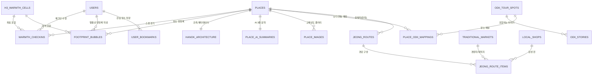

# 🏛️ 온마루(On-Maru) 백엔드 스키마 및 테이블 릴레이션 설계 가이드

본 문서는 온마루(On-Maru) 백엔드 시스템 개발 시, 데이터베이스 스키마와 테이블 구조 및 릴레이션(ERD)을 설계하기 위해 반드시 참고해야 하는 프로젝트 내부 문서들과 각 도메인별 상세 설계 명세를 정리한 가이드입니다.

---

## 📌 1. 백엔드 설계 시 핵심 참고 문서 맵 (Document Map)

| 분류 | 대상 문서 (File Path) | 백엔드 설계 시 확인해야 할 핵심 내용 |
| :--- | :--- | :--- |
| **전체 기획 & 요구사항** | [`prd.md`](./prd.md) | • 전체 비즈니스 로직 및 5대 핵심 기능 명세<br>• 온기 감쇄(Decay) 알고리즘, 캐싱 전략, 기술 스택 요구사항 |
| **A to Z 도슨트 기획** | [`feat1PRD.md`](./feat1PRD.md) | • 한옥 해부학(온돌, 마루, 창호 등) 구조 JSON 데이터 명세<br>• 건축물대장 메타데이터 및 AI 3줄 요약 캐싱 구조 |
| **전체 API 연동 계획** | [`Feature별API/api_utilization_plan.md`](./Feature별API/api_utilization_plan.md) | • 공공 API 및 외부 솔루션(TourAPI, Odii, Kakao, H3, Redis, Supabase) 역할 정의<br>• 데이터 정제 및 주소 정규화 파이프라인 |
| **Feature 1 API 명세** | [`Feature별API/feature1_api.md`](./Feature별API/feature1_api.md) | • TourAPI(`overview`, `detailImage2`) + 건축물대장(`strctCdNm`, `roofCdNm`, `archYear`) 데이터 매핑 |
| **Feature 2 API 명세** | [`Feature별API/feature2_api.md`](./Feature별API/feature2_api.md) | • Uber H3 공간 인덱싱 (해상도 8~9) 및 셀별 온기 점수 합산<br>• 말풍선 방명록 및 체크인 좌표 데이터 구조 |
| **Feature 3 API 명세** | [`Feature별API/feature3_api.md`](./Feature별API/feature3_api.md) | • 오디(Odii) 관광지 및 이야기 매핑, 반경 5km 추천 쿼리 기준 |
| **오디 API 상세 스펙** | [`api-docs/tour_audio_guide_api.md`](./api-docs/tour_audio_guide_api.md) | • `tid`, `tlid`, `stid`, `stlid`, `audioUrl`, `script`, `playTime`, `mapX`, `mapY` 등 오디 원본 스키마<br>• 증분 동기화(`syncStatus`) 배치 설계 기준 |
| **Feature 4 API 명세** | [`Feature별API/feature4_api.md`](./Feature별API/feature4_api.md) | • 전통시장(`marketNm`, `items`, `pakingYn`) 및 상권정보(`indsMclsNm` - 전통찻집/공방) 필터링 구조 |
| **Feature 5 API 명세** | [`Feature별API/feature5_api.md`](./Feature별API/feature5_api.md) | • `cat3` 기반 시맨틱 필터링 및 검색 인덱싱 스펙 |
| **공공데이터 딥다이브** | [`data_utilization_deep_dive.md`](./data_utilization_deep_dive.md) | • 국토부/행안부/소진공/국가유산청 공공데이터 필드 정의 및 머징 키(`contentId`, `entNm`, 지번주소) |
| **화면/인터랙션 명세** | [`wireframe_guide.md`](./wireframe_guide.md) | • 클라이언트가 화면에서 요구하는 바텀시트, 핀, 토스트, Bento Grid 응답 DTO 필드 파악 |

---

## 🏗️ 2. 도메인별 데이터 모델 및 테이블 릴레이션 설계 가이드

온마루 백엔드는 **5대 핵심 도메인(온기 맵, 한옥/장소, 오디오 도슨트, 로컬 상권/정-길, 유저/소통)**으로 나뉩니다.



---

### 1️⃣ 온기 맵 & 발자취 도메인 (Warmth & Footprints)
> **참고 문서**: `prd.md (Feature 2)`, `Feature별API/feature2_api.md`, `wireframe_guide.md`

1. **`h3_warmth_cells` (H3 육각형 그리드 집계 테이블)**
   - **설명**: Uber H3 (Resolution 8 또는 9) 인덱스 단위의 집계 테이블로, 지도에 메타볼/영역을 그리기 위한 핵심 캐시/영속성 테이블.
   - **주요 컬럼**:
     - `h3_index` (VARCHAR(15), PK): Uber H3 16진수 인덱스
     - `resolution` (INT): H3 해상도 (예: 8 or 9)
     - `current_warmth_score` (FLOAT): 감쇄 알고리즘이 적용된 현재 온기 점수
     - `total_checkin_count` (BIGINT): 누적 체크인 수
     - `centroid_lat` / `centroid_lng` (DOUBLE PRECISION): 셀 중심점 좌표
     - `last_decayed_at` (TIMESTAMPTZ): 마지막 온기 감쇄 계산 시각
     - `last_checkin_at` (TIMESTAMPTZ): 마지막 온기 주입 시각

2. **`warmth_checkins` (실시간 온기 체크인 로그 테이블)**
   - **설명**: 사용자가 현장에서 "나 여기 왔어" 클릭 시 생성되는 트랜잭션 로그.
   - **주요 컬럼**:
     - `id` (UUID, PK)
     - `user_id` (UUID, FK -> `users.id`, Nullable: 비로그인 허용 시)
     - `place_id` (UUID, FK -> `places.id`, Nullable: 장소 외 좌표 체크인 가능)
     - `lat` / `lng` (DOUBLE PRECISION): 체크인 실제 좌표
     - `h3_index` (VARCHAR(15), Index): 해당 좌표의 H3 인덱스
     - `warmth_weight` (FLOAT): 부여된 온기 가중치 (기본 1.0)
     - `created_at` (TIMESTAMPTZ)

3. **`footprint_bubbles` (말풍선 방명록 테이블)**
   - **설명**: 지도 위에 팝업되는 사용자들의 짧은 후기 및 팁.
   - **주요 컬럼**:
     - `id` (UUID, PK)
     - `user_id` (UUID, FK -> `users.id`)
     - `place_id` (UUID, FK -> `places.id`, Nullable)
     - `lat` / `lng` (DOUBLE PRECISION, NOT NULL)
     - `h3_index` (VARCHAR(15), Index)
     - `content` (VARCHAR(300), NOT NULL): 말풍선 텍스트
     - `status` (ENUM: `ACTIVE`, `REPORTED`, `HIDDEN`): AI 필터링 및 신고 처리 상태
     - `report_count` (INT, DEFAULT 0)
     - `created_at`, `updated_at` (TIMESTAMPTZ)

---

### 2️⃣ 한옥 및 장소 도메인 (Hanok & Places)
> **참고 문서**: `prd.md (Feature 1, 5)`, `feat1PRD.md`, `Feature별API/feature1_api.md`, `data_utilization_deep_dive.md`

1. **`places` (한옥/관광지 마스터 테이블)**
   - **설명**: TourAPI 및 행안부 한옥체험업 데이터를 통합한 마스터 장소 정보.
   - **주요 컬럼**:
     - `id` (UUID, PK)
     - `content_id` (VARCHAR(50), UNIQUE): TourAPI `contentid`
     - `title` (VARCHAR(200), NOT NULL): 한옥/명소 명칭
     - `category_code` (VARCHAR(20)): `cat3` (예: `B02010700` 한옥스테이, `A02010700` 고택/종택 등)
     - `primary_type` (ENUM: `HANOK_STAY`, `HISTORIC_HOUSE`, `VILLAGE`, `PAVILION`, `CULTURE`): 온마루 공통 분류
     - `road_address` / `jibun_address` (VARCHAR(255))
     - `lat` / `lng` (DOUBLE PRECISION): 위경도
     - `h3_index` (VARCHAR(15), Index)
     - `tel` (VARCHAR(50))
     - `overview` (TEXT): TourAPI 국문 소개
     - `thumbnail_url` (VARCHAR(500)): 한국관광콘텐츠랩 대표 이미지 (`firstimage`)
     - `is_barrier_free` (BOOLEAN): TourAPI `detailWithTour2` 무장애 정보 보유 여부
     - `barrier_free_info` (JSONB): 휠체어 리프트, 전용 주차장 등 상세 정보
     - `created_at`, `updated_at` (TIMESTAMPTZ)

2. **`hanok_architecture` (한옥 건축 사양 테이블)**
   - **설명**: 국토부 건축물대장 데이터 및 자체 정의 한옥 해부학 JSON 메타데이터.
   - **주요 컬럼**:
     - `id` (UUID, PK)
     - `place_id` (UUID, UNIQUE, FK -> `places.id`)
     - `strct_cd_nm` (VARCHAR(100)): 구조코드명 (예: 일반목구조)
     - `roof_cd_nm` (VARCHAR(100)): 지붕코드명 (예: 기와, 초가)
     - `arch_year` (VARCHAR(20)): 건축연도 (예: 1930년)
     - `plat_area` / `arch_area` (FLOAT): 대지면적, 건축면적
     - `anatomy_data` (JSONB): 온돌, 대청마루, 창호 등 부위별 스토리텔링 및 3D/인터랙션 속성

3. **`place_ai_summaries` (AI 3줄 요약 캐싱 테이블)**
   - **설명**: LLM(OpenAI/Gemini)으로 전처리한 3줄 요약 및 아코디언 상세 텍스트.
   - **주요 컬럼**:
     - `id` (UUID, PK)
     - `place_id` (UUID, UNIQUE, FK -> `places.id`)
     - `summary_points` (JSONB, NOT NULL): `["포인트1", "포인트2", "포인트3"]`
     - `deep_narrative` (TEXT): 더 깊은 역사적 맥락 아코디언 텍스트
     - `model_version` (VARCHAR(50)): 요약 생성에 사용된 모델명
     - `created_at`, `updated_at` (TIMESTAMPTZ)

4. **`place_images` (고해상도 갤러리 이미지 테이블)**
   - **주요 컬럼**:
     - `id` (UUID, PK)
     - `place_id` (UUID, FK -> `places.id`)
     - `image_url` (VARCHAR(500), NOT NULL)
     - `caption` (VARCHAR(200))
     - `display_order` (INT, DEFAULT 0)

---

### 3️⃣ 오디(Odii) 오디오 도슨트 도메인 (Audio Guide)
> **참고 문서**: `prd.md (Feature 3)`, `Feature별API/feature3_api.md`, `api-docs/tour_audio_guide_api.md`

1. **`odii_tour_spots` (오디 관광지 정보 테이블)**
   - **설명**: Odii API `/themeBasedList`, `/themeLocationBasedList` 기반 관광지 엔티티.
   - **주요 컬럼**:
     - `tid` (VARCHAR(50), PK): 관광지 ID
     - `tlid` (VARCHAR(50)): 관광지 언어 ID
     - `title` (VARCHAR(200)): 관광지명 (예: 백제문화단지, 전주 한옥마을)
     - `theme_category` (VARCHAR(100)): 테마 카테고리
     - `addr1`, `addr2` (VARCHAR(100))
     - `lat` / `lng` (DOUBLE PRECISION)
     - `image_url` (VARCHAR(500))
     - `lang_code` (VARCHAR(10), DEFAULT 'ko')
     - `last_synced_at` (TIMESTAMPTZ)

2. **`odii_stories` (오디 개별 이야기/트랙 테이블)**
   - **설명**: Odii API `/storyBasedList`, `/storyLocationBasedList` 기반 개별 음성 트랙.
   - **주요 컬럼**:
     - `stid` (VARCHAR(50), PK): 이야기 ID
     - `stlid` (VARCHAR(50)): 이야기 언어 ID
     - `tid` (VARCHAR(50), FK -> `odii_tour_spots.tid`): 소속 관광지 ID
     - `title` (VARCHAR(200)): 소주제 제목
     - `audio_title` (VARCHAR(200)): 오디오 타이틀
     - `audio_url` (VARCHAR(500), NOT NULL): MP3 스트리밍 URL
     - `script` (TEXT): 오디오 도슨트 전체 대본/자막 (검색 및 UI 노출용)
     - `play_time` (INT): 재생 시간 (초 단위)
     - `lat` / `lng` (DOUBLE PRECISION): 오디오 발동 기준 좌표
     - `h3_index` (VARCHAR(15), Index)
     - `sync_status` (VARCHAR(5)): `A`(추가), `U`(수정), `D`(삭제)

3. **`place_odii_mappings` (온마루 장소 - 오디 관광지 매핑 테이블)**
   - **설명**: TourAPI `places`와 Odii `odii_tour_spots` 간의 매핑 브릿지.
   - **주요 컬럼**:
     - `id` (UUID, PK)
     - `place_id` (UUID, FK -> `places.id`)
     - `odii_tid` (VARCHAR(50), FK -> `odii_tour_spots.tid`)
     - `match_type` (ENUM: `EXACT_CONTENT_ID`, `GEO_PROXIMITY`, `NAME_SIMILARITY`)
     - `distance_meter` (FLOAT)

---

### 4️⃣ 전통시장 및 정-길 도메인 (Traditional Market & Jeong-gil)
> **참고 문서**: `prd.md (Feature 4)`, `Feature별API/feature4_api.md`, `data_utilization_deep_dive.md`

1. **`traditional_markets` (전통시장 마스터 테이블)**
   - **설명**: 국토부 전통시장현황 API 기반.
   - **주요 컬럼**:
     - `id` (UUID, PK)
     - `market_name` (VARCHAR(200), NOT NULL)
     - `market_type` (VARCHAR(50)): 상설, 5일장 등
     - `items` (TEXT): 주요 취급 품목 (먹거리, 로컬 특산품 등)
     - `has_parking` (BOOLEAN): 주차 가능 여부 (`pakingYn`)
     - `road_address` (VARCHAR(255))
     - `lat` / `lng` (DOUBLE PRECISION)
     - `h3_index` (VARCHAR(15), Index)

2. **`local_shops` (산책로 주변 로컬 상점 테이블)**
   - **설명**: 소진공 상가(상권)정보 API 기반 (전통찻집, 공방, 독립서점 등 필터링).
   - **주요 컬럼**:
     - `id` (UUID, PK)
     - `bizes_name` (VARCHAR(200)): 상호명
     - `industry_large_name` / `industry_middle_name` (VARCHAR(100)): 업종 대분류/중분류
     - `is_warmth_booster` (BOOLEAN, DEFAULT FALSE): 감성 핀/온기 부스터 대상 여부
     - `lat` / `lng` (DOUBLE PRECISION)
     - `h3_index` (VARCHAR(15), Index)

3. **`jeong_routes` & `jeong_route_items` (정-길 큐레이션 경로 테이블)**
   - **설명**: 한옥 숙소 -> 로컬 상점/공방 -> 전통시장으로 이어지는 산책 경로.
   - **주요 컬럼**:
     - `jeong_routes`: `id`, `start_place_id`, `end_market_id`, `title`, `estimated_duration_min`, `distance_meter`
     - `jeong_route_items`: `route_id`, `item_type` (`PLACE`, `SHOP`, `MARKET`), `item_id`, `sequence_order`

---

### 5️⃣ 사용자, 인증 및 활동 도메인 (Users & Activities)
> **참고 문서**: `prd.md`, `findings.md`, `wireframe_guide.md`

1. **`users` (사용자 프로필 테이블)**
   - **주요 컬럼**:
     - `id` (UUID, PK - Supabase Auth `auth.users.id` 연동)
     - `kakao_id` (VARCHAR(100), UNIQUE)
     - `nickname` (VARCHAR(50))
     - `profile_image_url` (VARCHAR(500))
     - `created_at`, `last_login_at` (TIMESTAMPTZ)

2. **`user_bookmarks` (사용자 관심 장소/도슨트 저장)**
   - **주요 컬럼**:
     - `id` (UUID, PK)
     - `user_id` (UUID, FK -> `users.id`)
     - `target_type` (ENUM: `PLACE`, `ODII_STORY`, `JEONG_ROUTE`)
     - `target_id` (VARCHAR(100))
     - `created_at` (TIMESTAMPTZ)

---

## ⚡ 3. 백엔드 핵심 쿼리 및 알고리즘 구현 체크포인트

1. **5km 반경 Odii 도슨트 추천 쿼리 (PostGIS 또는 위경도 Haversine)**:
   ```sql
   -- 사용자의 현재 위치 ($1: lat, $2: lng) 기준 5km 이내 Odii 이야기 조회
   SELECT s.stid, s.title, s.audio_title, s.audio_url, s.play_time,
          (6371 * acos(cos(radians($1)) * cos(radians(s.lat)) * cos(radians(s.lng) - radians($2)) + sin(radians($1)) * sin(radians(s.lat)))) AS distance_km
   FROM odii_stories s
   WHERE (6371 * acos(cos(radians($1)) * cos(radians(s.lat)) * cos(radians(s.lng) - radians($2)) + sin(radians($1)) * sin(radians(s.lat)))) <= 5.0
   ORDER BY distance_km ASC
   LIMIT 10;
   ```

2. **H3 인덱스 기반 온기 뷰포트 조회 쿼리**:
   - 프론트엔드가 카카오맵 화면 바운딩 박스(Bounding Box)에 해당하는 H3 인덱스 목록을 요청하면, `h3_warmth_cells`에서 해당 셀들의 `current_warmth_score`를 반환.
   - 줌 레벨에 따라 Resolution을 7~9로 동적 클러스터링.

3. **온기 감쇄(Warmth Decay) 배치/스케줄러 (Supabase pg_cron 또는 Edge Function)**:
   - 일정 주기마다 `current_warmth_score = current_warmth_score * exp(-decay_rate * elapsed_time)` 로직을 실행하여 실시간성 유지.

4. **Redis 캐싱 전략 (Upstash Redis)**:
   - Key: `place:detail:{contentId}` (TTL: 24시간)
   - Key: `odii:story:{stid}` (TTL: 24시간)
   - Key: `warmth:hotspots` (TTL: 10분)
