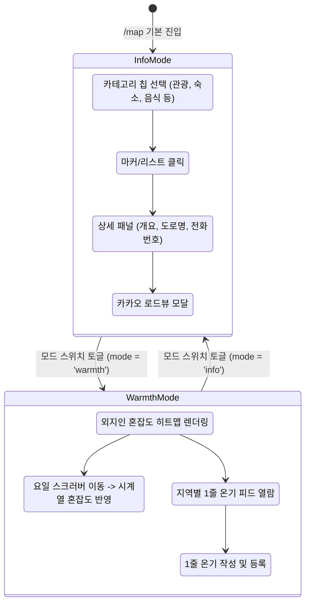

# Page Spec: 온기/정보 지도 (`/map`)

> **문서 ID**: `PAGE-SPEC-MAP-001`  
> **Route Path**: `/map`  
> **Entry File**: `src/app/map/page.tsx`  
> **Canonical Component**: `src/map/MapPage.tsx`

---

## 1. Page Purpose & Capabilities

카카오맵 SDK를 기반으로 주변의 전통 한옥, 문화재, 고택, 카페, 숙소를 직관적으로 탐색하는 **정보지도(Info Mode)**와 한국관광 데이터랩 빅데이터 기반 혼잡도 히트맵 및 사용자들의 실시간 체감 정취(북적/한적)를 나누는 **온기지도(Warmth Mode)**의 듀얼 모드 공간 탐색 경험을 제공합니다.

### User Capabilities
- **CAP-MAP-01 (정보지도)**: 현 위치/지도 중심 기반 8대 카테고리(관광지, 한옥스테이, 음식점 등) 장소 마커 탐색
- **CAP-MAP-02 (장소 상세)**: 장소 선택 시 바텀시트/상세 패널 확장, 대표 이미지 캐러셀, 운영시간, 로드뷰 및 길찾기 연동
- **CAP-MAP-03 (온기지도 히트맵)**: 요일별 스크러빙을 통해 실시간/시간대별 외지인 방문객 수요 집중도 및 혼잡도 히트맵 시각화
- **CAP-MAP-04 (1줄 온기 및 정취 피드)**: 장소별 '북적/한적' 분위기 태그 및 1줄 후기 열람, 신규 온기 작성 모달 등록

---

## 2. UI Component Structure

```text
<MapPage>
  ├── <KakaoMap> (카카오 지도 캔버스)
  │     ├── <PlaceMarkers> (정보모드 장소 핀 마커 및 클러스터링)
  │     └── <WarmthLayer> (온기모드 히트맵 캔버스 및 웜스 블롭 오버레이)
  ├── <MapNavRail> (상단/좌측 모드 전환 토글: 정보 ⇄ 온기)
  ├── <SearchBar> (장소 및 지역 검색창)
  ├── <CategoryChips> (정보모드 카테고리 필터) / <RegionChips> (온기모드 지역 필터)
  ├── <BottomSheet> (모바일 3단 스냅 바텀시트: peek | half | full)
  │     ├── <PlaceList> (정보모드 장소 목록)
  │     ├── <PlaceDetail> (장소 상세 정보 패널)
  │     └── <WarmthFeed> (온기모드 1줄 온기 피드 및 인기 장소 랭킹)
  ├── <DateScrubber> (온기모드 하단 요일/날짜 시계열 조작 바)
  └── <WriteWarmthModal> (온기 남기기 팝업 모달)
```

---

## 3. Dual-Mode State Transitions



---

## 4. Data Flow & Local Fallback Strategy

1. **장소 목록 (`Item[]`)**:
   - `useKakaoMap` 중심좌표 변경 시 `/api/map/places` 호출. 외부 장애 시 `src/map/data/curatedPlaces.ts` 정적 데이터로 자동 폴백.
2. **온기 피드 (`Warmth[]`)**:
   - `src/map/warmth/warmthRepo.ts`에서 LocalStorage 및 인메모리 시드(`seed.ts`)를 조합하여 클라이언트 영구 저장 지원.
3. **혼잡도 히트맵 (`HeatSpot[]`)**:
   - `/api/map/heat` 및 한국관광 데이터랩 시계열 데이터를 Canvas 상에 블룸(Bloom) 가우시안 블러로 렌더링.

---

## 5. Implementation Evidence

- **Main Component**: `src/map/MapPage.tsx`
- **Store & Hooks**: `src/map/hooks/useMapStore.ts`, `src/map/hooks/useKakaoMap.ts`, `src/map/hooks/usePlaceDetail.ts`
- **Types**: `src/map/types.ts`
- **Warmth Repo**: `src/map/warmth/warmthRepo.ts`, `src/map/warmth/congestion.ts`
