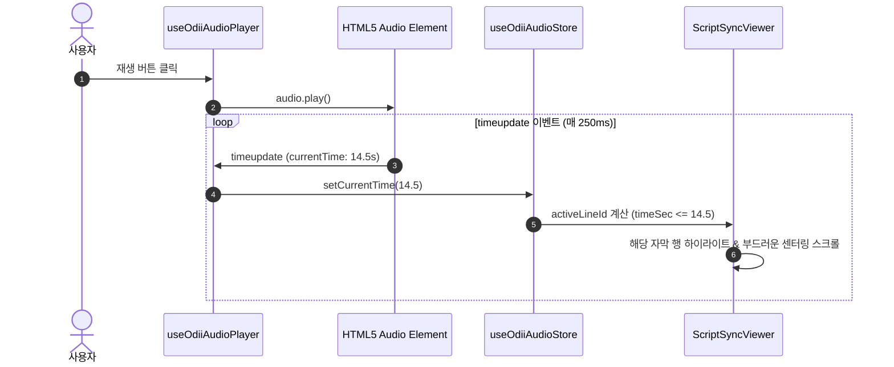

# Page Spec: 마음 여행 오디(Odii) 오디오 도슨트 (`/odii`)

> **문서 ID**: `PAGE-SPEC-ODII-001`  
> **Route Path**: `/odii`  
> **Entry File**: `src/app/odii/page.tsx`  
> **Canonical Component**: `src/features/odii-audio/components/OdiiAudioFeature.tsx`

---

## 1. Page Purpose & Capabilities

한국관광공사의 오디(Odii) 오디오 가이드 공공 API와 온마루의 고품격 한옥 서사를 융합하여, 사용자에게 공간 음성 해설 스트리밍, 실시간 초 단위 자막 동기화, 지역 챕터별 사운드 성좌도 인터랙션 및 LLM 기반 AI 도슨트 질의응답을 제공하는 미디엄 스크롤리텔링 오디오 아카이브입니다.

### User Capabilities
- **CAP-ODII-01 (오디오 스트리밍)**: 한옥/궁궐/고택 도슨트 음원 재생, 일시정지, 10초 앞/뒤 탐색, 재생 속도 제어
- **CAP-ODII-02 (자막 동기화 뷰어)**: 오디오 현재 재생 타임코드에 맞춘 LRC-style 가사/자막 자동 스크롤 및 하이라이트
- **CAP-ODII-03 (사운드 성좌도)**: 전국 주요 권역(경주, 전주, 안동 등)별 이야기 챕터를 우주 성좌도 형태의 비주얼로 탐색
- **CAP-ODII-04 (AI 도슨트 어시스턴트)**: 오디오 대본 및 역사적 배경에 대해 실시간으로 질문하고 답변을 수신하는 챗 인터랙션

---

## 2. UI Component Structure

```text
<OdiiPage>
  └── <OdiiAudioFeature>
        ├── <OdiiThemeHeaderRail> (상단 테마 카테고리 탭: 한옥/고택, 궁궐/역사, 서원/향교 등)
        ├── <SoundConstellationSection> (공간/지역별 사운드 클러스터 성좌도 뷰)
        ├── <StoryCarousel> (추천 오디오 스토리 카드 캐러셀)
        ├── <ScriptSyncViewer> (실시간 초 단위 자막 대본 뷰어 & 웨이브폼 비주얼라이저)
        ├── <OdiiQuestionAssistant> (AI 도슨트 RAG 질의응답 플로팅 패널)
        └── <SavedSoundDrawer> (북마크된 이야기 서랍장)
```

---

## 3. Real-time Audio-Script Sync State Flow



---

## 4. Data Flow & Mock Resilience

1. **오디오 스토리 목록 (`OdiiStoryItem[]`)**:
   - `TourApiClient`를 통해 오디 오디오 공공 API 조회. 외부 통신 실패 시 `src/features/odii-audio/data/odiiChapterData.ts`의 로컬 정적 데이터로 무중단 표출.
2. **자막 대본 파싱 (`ScriptLine[]`)**:
   - `scriptParser.ts`가 `[00:15] 텍스트` 형식의 타임코드 자막을 초 단위 배열로 변환하여 렌더링.
3. **AI 질의응답 (`/api/odii/ask`)**:
   - 현재 재생 중인 스토리 제목과 대본 전문을 Context로 주입하여 LLM 답변 스트리밍 수신.

---

## 5. Implementation Evidence

- **Main Component**: `src/features/odii-audio/components/OdiiAudioFeature.tsx`
- **Player Hook**: `src/features/odii-audio/hooks/useOdiiAudioPlayer.ts`
- **Store**: `src/features/odii-audio/store/useOdiiAudioStore.ts`
- **Types**: `src/features/odii-audio/types/odii.types.ts`
- **Script Parser**: `src/features/odii-audio/utils/scriptParser.ts`
