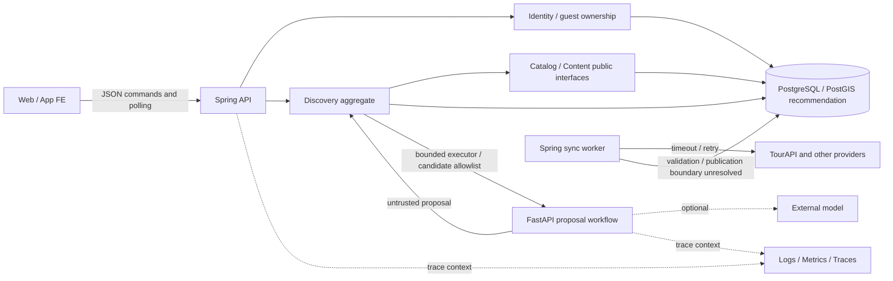

# OnMaru 설계 아키텍처 감사

검토 시작: 2026-09-10. 보고서 확정: 2026-09-11. 기준 커밋: `b733350179f75b50f59427e04be4274b39b20c73`. 파일명의 날짜는 검토 시작일이다.

## 1. 결론과 검토 범위

**판정: 구현 착수는 가능하나, 현재 문서를 그대로 구현하는 방식의 실사용 출시는 보류한다.** 방향의 문제가 아니라 API·상태 전이·저장 모델 사이의 연결이 덜 닫혀 있다. 무료 환경에서는 Redis나 여러 agent를 추가하는 것보다 이 연결을 먼저 완성하는 편이 중요하다.

이 보고서는 실행 중인 시스템의 보안 인증이나 성능 측정 결과가 아니다. 백엔드 애플리케이션이 아직 없는 계획 저장소의 **설계 완결성**을 평가한다. 실제 처리량, 복구 성공, 권한 차단, 모델 품질은 UNKNOWN이다. 확인된 P0는 없지만, 이는 출시 안전성을 증명하지 않는다. P1 14개, P2 7개를 식별했다. 같은 원인에 대한 여러 리뷰어의 지적은 합쳤다.

요청된 두 스킬을 사용자 지정 로컬 경로에서 읽고 적용했다. Backend/Database, SRE, Security/Devil's Advocate를 독립 검토한 뒤 주 검토자가 계약과 증거를 대조했다. 기존 계획·ADR·코드는 수정하지 않았다. 이 보고서의 권고는 아직 승인된 결정이 아니다.

### 증거의 경계

- VERIFIED는 문서 또는 workflow에서 직접 확인했다는 의미다. 실행 동작 검증과 구분한다.
- PARTIAL은 원칙은 있으나 필드·상태·실행 정책이 덜 정의된 경우다.
- MISSING은 관련 원문을 직접 확인했으나 필요한 계약이 없는 경우다.
- UNKNOWN은 호스팅·실측·외부 GitHub 설정처럼 이번 검토로 확인할 수 없는 경우다.
- `docs/planning/platform`에 대한 과거 대화의 상세 설계는 현재 저장소에 존재하지 않는다. 대화에서만 제안된 제품·수치·정책을 승인된 명세로 인정하지 않았다.
- 최신 7일 MVP의 REST JSON + polling이 장기 SSE 설계보다 우선한다. 두 방식의 공존 자체를 모순으로 계산하지 않았다.
- `docs/database/schema.md`는 후속 설계를 안내하는 역사적 자료다. canonical UUID는 `data-api-design.md`에 실제 존재한다.
- 자동 scanner는 심볼릭 링크를 건너뛰고 일부 signal 결과를 절단했다. 따라서 scanner의 검색 실패를 부재 증거로 쓰지 않았다. 연결된 FE 문서는 별도로 읽었다.

### 읽기 범위

루트 운영 문서, CI/release workflow, `docs/planning` 및 여정 탐색 문서, `docs/database`, `docs/api`, `docs/decisions`, 연결된 `docs/specs`의 data-contract/backend-requirements/integrations/traceability를 조사했다. 핵심 계약은 줄 단위로 대조했다. 외부 FE 애플리케이션 전체 코드, 실제 GitHub 보호 설정, 배포 계정·DB·TourAPI 실응답은 검증하지 않았다. 평가에 인용하는 줄 번호는 위 기준 커밋 및 검토 당시 symlink 대상 기준이다.

## 2. 재구성한 시스템

Spring은 canonical 자료·소유권·여정 상태를 소유하고 FastAPI는 제한된 후보만 제안한다. 저장 상태 변경 권한을 AI에 주지 않는 경계는 적절하다. public 요청이 매번 TourAPI 성공에 종속되지 않는 구조도 적절하다. 다만 회원·저장 aggregate의 영속화, sync 게시 원자성, executor의 실패 경계는 현재 그림만으로 구현할 수 없다.

무료 단일 인스턴스는 의식적인 가용성 절충으로 허용한다. 이를 이유로 다중 리전·Kafka·Kubernetes를 요구하지 않는다. 단일 장애 지점은 제거했다고 주장하는 대신 복구 방법과 허용 중단을 명세해야 한다.

## 3. 채점

주 점수는 사용자 지정 가중치에 따른 **설계 완결성 58/100**이다. 각 영역은 명시성·문서 간 일치·실행 가능한 정책·검증 가능성을 평가한다. 도구의 존재 자체에는 점수를 주지 않는다. 측정 결과가 없는 것을 성능 실패로 단정하지도 않는다. 세부 근거와 별도 스킬 평가 방식은 [채점 부록](2026-09-10-architecture-review-scorecard.md)을 참고한다.

| 영역 | 배점 | 획득 | 핵심 판단 |
|---|---:|---:|---|
| Requirements & Traceability | 10 | 6 | 우선순위는 있으나 질문·제외·저장의 종단 연결 미완 |
| Domain Architecture | 10 | 8 | 소유권과 경계 양호, identity/save aggregate 구체화 필요 |
| API Design | 10 | 5 | typed DTO 양호, FE 필수 동작의 누락 존재 |
| Data Architecture | 12 | 7 | canonical/provenance/index 양호, 회원·저장·게시 모델 공백 |
| Reliability | 12 | 6 | LKG·timeout 의도 양호, lease/queue/deadline 불완전 |
| Security | 10 | 5 | cookie/CSRF 경계 양호, 이관·예산·보존 미확정 |
| Performance & Scalability | 10 | 5 | 검색 상한·공간 인덱스 있음, 통합 용량 예산 없음 |
| Observability | 8 | 5 | 관측 항목 있음, 비동기 trace·알림 운영 계약 미완 |
| Deployment & Operations | 7 | 3 | 환경 격리 있음, release 순서·복구 절차 미완 |
| Testing | 6 | 4 | 테스트 전략 있음, 최신 계약 실패 fixture 미완 |
| Cost & Complexity | 5 | 4 | 단순화 적절, 모델 필수 운영 조건만 정합화 필요 |
| 합계 | 100 | 58 | 운영 준비도 인증 점수가 아님 |

### 이미 잘 설계된 부분

canonical place UUID와 source namespace, Odii 언어 복합 식별, provenance, 공간 query/index가 있다 (`data-api-design.md:65-128`). 외부 I/O를 DB transaction 밖에 두고 HTTP 200 내부 오류를 검증한다 (`data-api-design.md:160-164`). Spring의 ID/evidence/pin 재검증, AI의 DB 수정 금지, MVP의 broker/vector/multi-agent 제외도 적절하다 (`J/seven-day-mvp-fe-handoff.md:637-699`).

freshness와 SLO가 전혀 없는 것은 아니다. `backend-prd.md:98-103`에 catalog p95 500ms, 10만 건·동시 50·10분 조건, 일일 03시 동기화·36시간 경고, 가용성 99.5%, RPO 24h/RTO 4h 초안이 있다. 아래 지적은 이 목표를 데이터셋별 정책과 실제 복구 절차로 연결하지 못한 부분이다.

## 4. 교차 문서 감사

아래 경로는 `docs/planning/` 기준이다. J는 `journey-exploration/`을 뜻한다.

| 사용자 요구 | 계약/설계 연결 | 결과 |
|---|---|---|
| 모호한 질문에 되묻기 | J/seven-day §14 내부 질문 → §10 public run | public 필드 누락 F01 |
| 후보 제외 | 카드 요구 → action union | 명령 없음 F02 |
| 지역 자연어 해석 | optional region → 선행 지역 검색 | 실행 순서 미정 F03 |
| 카카오 후 저장 | API → identity/save 영속 모델 | 모델 공백 F04/F09 |
| 외부 장애에도 조회 | PRD LKG → page upsert → 공개 revision | 게시 경계 미정 F06 |
| 동기화 중복 방지 | lease → 만료 worker의 commit | fencing 미정 F07 |
| AI 장애 후 다시 시도 | DB run → executor → active-run 제약 | QUEUED 고착 F05 |
| 무모델 baseline 운영 | optional LLM → prod LIVE_PROVIDER gate | 정책 충돌 F12 |
| 후보 순서 설명 | FastAPI 이야기 순서 → kept/added/removed | 최종 순서 반환 미정 F15 |
| 저장 여정 다시 편집 | saved GET → mutable exploration | 재개 계약 미정 F17 |
| 릴리스 전 CI | main push CI → 독립 release job | 선후관계 없음 F13 |

## 5. Findings

P0는 데이터 손실·권한 침해 등 치명적 결함이 근거로 확정된 경우, P1은 구현 또는 운영 전에 닫아야 할 높은 위험, P2는 품질·명확성 개선, P3는 낮은 우선순위 개선으로 적용했다. 미구현이라는 이유만으로 P0를 부여하지 않았다.

### F01 [P1] 확인 질문이 public API에 없다

**Evidence:** `J/seven-day-mvp-fe-handoff.md:259,387-397,506-519,668`. 내부 응답은 clarificationQuestion을 생성하지만 public RunSnapshot에는 상태만 있다.

**Risk:** 최초 검색이 CLARIFICATION_REQUIRED로 끝나도 FE는 무엇을 되물어야 할지 알 수 없다. **Recommendation:** typed clarification payload, 선택 가능한 값, 후속 turn 연결을 정의한다. **Criterion:** API/Traceability. **Confidence:** High. **검증:** 지역 없는 최초 요청에서 질문이 렌더되고 답변 후 같은 exploration이 완료되는 fixture.

### F02 [P1] 카드의 제외 동작에 대응하는 명령이 없다

**Evidence:** `J/seven-day-mvp-fe-handoff.md:31,116,298-303,322,567-571`. 카드 제외는 요구하지만 action은 PIN/UNPIN/APPLY/DISMISS뿐이다.

**Risk:** FE 로컬 제외가 다음 응답에서 되살아나거나 자연어로 임의 변환된다. **Recommendation:** 구조화된 제외와 해제·유효기간·pin 충돌을 정의하거나 버튼을 MVP에서 제거한다. **Criterion:** API/Traceability. **Confidence:** High. **검증:** 제외 후 재탐색·새로고침의 결과가 일치한다.

### F03 [P1] 지역 해석보다 지역 검색이 먼저 필요하다

**Evidence:** `J/seven-day-mvp-fe-handoff.md:259,641-660,691`. regionCode는 생략 가능하나 Spring은 FastAPI 호출 전에 지역으로 30개 후보를 제한한다.

**Risk:** 전국 상위 30개나 임의 지역을 선택하여 자연어 질의의 후보가 처음부터 사라진다. **Recommendation:** canonical 지역 사전으로 선해석하고 모호하면 F01로 되묻거나, 별도 해석 단계의 allowlisted 계약을 정의한다. **Criterion:** Domain/API. **Confidence:** High. **검증:** 동명 지역·지역 생략·명확한 지역 문장의 candidate scope 검증.

### F04 [P1] 회원·세션·저장 API에 대응하는 영속 모델이 없다

**Evidence:** `J/seven-day-mvp-fe-handoff.md:234-246,324-353`; `data-api-design.md:63-89`; `J/architecture-and-recommendation.md:40-52`; `J/journey-service-plan.md:170`.

**Risk:** provider subject 유일성, 세션 소유권, 저장 snapshot/version, 중복 저장이 각 구현자의 판단으로 갈라진다. **Recommendation:** 최소 identity/session/saved-journey 모델, FK/unique, 저장 transaction과 idempotency 범위를 확정한다. **Criterion:** Data/Domain. **Confidence:** High. **검증:** 동일 로그인·중복 save·타인 save·version conflict를 실제 DB 제약과 함께 테스트한다.

### F05 [P1] DB 저장 후 실행되지 않은 QUEUED run이 고착될 수 있다

**Evidence:** `J/seven-day-mvp-fe-handoff.md:306,367,683-685`. DB 저장 후 executor에 제출하고 복구는 RUNNING만 언급한다.

**Risk:** 제출 거절 또는 commit 직후 프로세스 종료로 QUEUED가 남아 ACTIVE_RUN이 계속 반환된다. **Recommendation:** QUEUED/RUNNING의 만료 terminalization, 제출 거절 처리, startup/주기 cleanup을 정의한다. broker 도입은 필요 없다. **Criterion:** Reliability. **Confidence:** High. **검증:** commit과 dispatch 사이 kill 후 기존 board 유지 및 새 turn 허용.

### F06 [P1] LKG의 원자적 게시 경계가 정의되지 않았다

**Evidence:** `backend-prd.md:88`; `data-api-design.md:65-89,163-165`. page별 stage/upsert와 마지막 정상 snapshot 보존을 함께 요구한다.

**Risk:** canonical 직접 upsert를 택하면 후반 페이지 실패 시 공개 데이터가 부분 갱신된다. watermark 미전진만으로 이전 snapshot을 보존하지 못한다. **Recommendation:** staging + active revision 전환 또는 row-level LKG와 mixed-version 허용 중 하나를 명시적으로 선택한다. 삭제·참조 중인 revision의 보존도 포함한다. **Criterion:** Data/Reliability. **Confidence:** High. **검증:** 5페이지 중 마지막 실패 시 공개 revision과 삭제 후보가 기대대로 유지된다.

### F07 [P1] sync lease 만료 후 늦은 worker를 막는 정책이 없다

**Evidence:** `data-api-design.md:85,159,165`; `architecture-blueprint.md:51`. lease_until은 있으나 갱신·fencing·게시 권한 재확인 계약이 없다.

**Risk:** 새 worker가 lease를 얻은 뒤 이전 worker가 늦게 commit/삭제할 수 있다. **Recommendation:** owner token, DB-clock lease, generation 또는 동등한 조건부 commit, heartbeat와 만료 동작을 정의한다. **Criterion:** Data/Reliability. **Confidence:** High. **검증:** A 만료 → B 완료 → A 결과 도착 순서에서 B의 게시 결과가 유지된다.

### F08 [P1] timeout·retry와 전체 deadline 예산이 연결되지 않았다

**Evidence:** `J/seven-day-mvp-fe-handoff.md:203,683-685`; `J/architecture-and-recommendation.md:135`. 15초 응답 timeout, 1회 transport retry, 전체 20초가 병존한다.

**Risk:** 첫 호출 후 retry가 20초를 넘고, 취소나 timeout 이후 결과가 보드를 변경할 수 있다. **Recommendation:** queue 대기부터 절대 deadline, remaining-budget retry, terminal CAS, late-result 폐기 및 동일 runId 중복 실행 정책을 MVP에 연결한다. **Criterion:** Reliability/API. **Confidence:** High. **검증:** deadline 직전 오류·cancel/complete 경합에서 terminal 결과 하나만 남는다.

### F09 [P1] 익명 소유권과 OAuth 이관의 실행 계약이 덜 닫혔다

**Evidence:** `J/seven-day-mvp-fe-handoff.md:328-334`; `J/journey-service-plan.md:119-121`. state 검증과 익명 이관 원칙은 존재한다.

**Risk:** explorationId와 유효 OAuth state만으로 소유권을 판단하면 타인 자료를 저장할 수 있다. 이는 현재 취약점 확정이 아니라 구현 위험이다. **Recommendation:** guest credential 수명·저장, state의 guest/context 결합, callback 세션 회전, save 소유권 재검증과 복사/폐기 transaction을 명세한다. **Criterion:** Security. **Confidence:** High. **검증:** 타인 ID·만료 state·재사용 callback·다중 탭·취소 흐름.

### F10 [P1] 익명 요청의 actor/global 자원 예산이 미정이다

**Evidence:** `backend-prd.md:105`; `J/seven-day-mvp-fe-handoff.md:234,306,683`; `J/journey-service-plan.md:194`. exploration당 active run은 있으나 새 exploration 생성으로 우회 가능하다.

**Risk:** 무료 서버의 DB·executor·모델 비용이 고갈된다. 무모델이어도 위험은 남는다. **Recommendation:** actor/IP 요청 한도, global inflight/queue, body/candidate byte 상한, 저장 전 admission, 429 Retry-After와 provider ceiling을 수치로 확정한다. **Criterion:** Security/Performance. **Confidence:** High. **검증:** 대량 신규 exploration에도 정상 사용자 슬롯과 메모리 상한 유지.

### F11 [P1] query·세션·저장 자료의 수명과 삭제 정책이 미정이다

**Evidence:** `J/seven-day-mvp-fe-handoff.md:517,534`; `J/journey-service-plan.md:129,144`; `J/staging-demo-release-and-success-gates.md:188`.

**Risk:** 응답의 최근 20개 제한은 DB 삭제를 뜻하지 않는다. 개인정보 포함 query가 무기한 보존되거나 탈퇴 후 늦은 결과로 다시 저장될 수 있다. **Recommendation:** 데이터 종류별 TTL/삭제 owner, 원문 query 기본 로그 제외, 마스킹 allowlist, 탈퇴 중 late-result 차단을 명세한다. **Criterion:** Security/Data. **Confidence:** High. **검증:** 만료·탈퇴 후 DB/로그/후속 결과에서 정책 준수 확인.

### F12 [P1] 운영 환경은 모델을 강제하지만 MVP는 무모델을 허용한다

**Evidence:** `J/staging-demo-release-and-success-gates.md:70-82,105,111`; `J/seven-day-mvp-fe-handoff.md:691-699`. 최신 사용자도 무료·경량화를 요구했다.

**Risk:** 실제 canonical 자료를 쓰는 정상 baseline 서비스가 production startup gate에서 탈락한다. **Recommendation:** data mode와 execution engine을 분리하고 baseline 운영·fallback 표시·성공지표를 정합화한다. demo 격리는 유지한다. **Criterion:** Cost/Operations. **Confidence:** High. **검증:** provider 없는 실제 데이터 모드의 정상 기동과 정직한 engine 표시.

### F13 [P1] release 생성이 동일 SHA의 CI 성공에 종속되지 않는다

**Evidence:** `.github/workflows/ci.yml:3-8,24-30`; `.github/workflows/release-please.yml:3-6,17-24`. main push에 두 workflow가 독립 실행된다.

**Risk:** CI 실패와 release/tag 생성이 동시에 일어날 수 있다. PR 보호 설정의 실제 상태는 UNKNOWN이다. **Recommendation:** verify → release dependency 또는 동일 SHA의 성공한 CI만 release를 유발하도록 구성한다. **Criterion:** Deployment. **Confidence:** High. **검증:** 의도적으로 검증 실패한 SHA에서 tag/release가 생성되지 않는다.

### F14 [P1] 복구 목표가 실행 가능한 복원 절차로 연결되지 않았다

**Evidence:** `backend-prd.md:103`; `data-api-design.md:132`; `issue-plan.md:1021,1074`; `project-roadmap.md:14`.

**Risk:** DB 손실 시 공공 자료 재수집으로 회원 저장 여정은 복원할 수 없다. **Recommendation:** 호스팅 확정과 함께 backup 대상·빈도·보존·암호화·권한·복구 순서·담당자, migration 실패 중지와 앱 rollback 호환 범위를 정하고 첫 실사용 쓰기 전에 drill을 수행한다. **Criterion:** Recoverability/Operations. **Confidence:** High. **검증:** 별도 DB 복원 후 회원별 저장 자료와 RPO/RTO 실측.

### F15 [P2] 이야기 순서 생성과 내부 응답의 순서 의미가 불명확하다

**Evidence:** `J/seven-day-mvp-fe-handoff.md:662-677,695`. 응답은 kept/added/removed 배열이며 최종 interleaving 순서는 없다.

**Risk:** FE의 horizontal 순서와 AI가 설명한 순서가 달라진다. **Recommendation:** orderedRefs 또는 명시적 Spring ordering을 결정하고 중복·pin·leg 재계산 규칙을 정의한다. **Criterion:** API/Domain. **Confidence:** High. **검증:** 유지 A,C 사이에 B 추가 시 A-B-C가 재현된다.

### F16 [P2] pin 변경과 aggregate version의 관계가 모호하다

**Evidence:** `J/seven-day-mvp-fe-handoff.md:322,484-511`; `J/fe-api-handoff.md:136`. 장기 계약은 PIN version 증가를 명시하지만 최신 문구는 board 변경만 언급한다.

**Risk:** pin 이전 proposal이 새 pin을 무시할 수 있다. **Recommendation:** stateVersion의 범위에 pin 포함 여부와 적용 시 재검증을 명시한다. **Criterion:** Data consistency. **Confidence:** Medium-High. **검증:** proposal 생성 후 pin한 장소가 stale apply로 제거되지 않는다.

### F17 [P2] 저장 여정을 편집 가능한 workspace로 여는 계약이 없다

**Evidence:** `J/fe-experience-api-implementation-report.md:193`; `J/seven-day-mvp-fe-handoff.md:371-375,558-565`.

**Risk:** saved GET은 board를 반환하지만 후속 command에 필요한 explorationId를 만들 수 없다. **Recommendation:** 읽기 전용으로 범위를 좁히거나 savedJourneyId 기반 workspace 생성 계약을 추가한다. **Criterion:** API/Traceability. **Confidence:** High. **검증:** 저장 → 새 기기 열기 → pin/turn 또는 명시적 읽기 전용 화면.

### F18 [P2] 관측 항목을 trace·알림·대응으로 연결하는 계약이 부족하다

**Evidence:** `architecture-blueprint.md:188`; `data-api-design.md:217`; `J/staging-demo-release-and-success-gates.md:184-189`.

**Risk:** executor를 건너 trace가 끊기거나 장애 지표가 있어도 담당자가 알 수 없다. **Recommendation:** requestId/traceId/runId 구분, async propagation, JSON 필드·sampling·cardinality·마스킹, 알림 수신자·threshold·runbook을 정의한다. Grafana Cloud 선택은 문서에 반영할 별도 결정이며 Zipkin 상시 운영은 필수가 아니다. **Criterion:** Observability. **Confidence:** High. **검증:** FE 오류 ID로 Spring → executor → FastAPI 실패 span을 찾고 실제 알림 수신.

### F19 [P2] 데이터셋별 stale-serving·diff 경계가 덜 정의됐다

**Evidence:** `backend-prd.md:101`; `data-api-design.md:163-168`. 36시간 경고는 있으나 경고 이후 제공 상한과 동일 timestamp/페이지 이동의 처리 계약은 불완전하다.

**Risk:** 영업 상태처럼 민감한 값이 오래된 채 제공되거나 페이지 변경으로 수정 자료를 놓친다. **Recommendation:** sourceObservedAt/fetchedAt/publishedAt 구분, dataset별 stale 허용, overlap·동일 timestamp tie·정규화 hash·삭제 확인·quarantine 재처리 정책을 명세한다. **Criterion:** Reliability/Data. **Confidence:** High. **검증:** 순서 변경·중복 페이지·동일 수정시각·부분 응답·명시 삭제 fixture.

### F20 [P2] 입력 검증·금칙어·prompt injection의 경계가 완결되지 않았다

**Evidence:** `J/fe-api-handoff.md:82`; `data-api-design.md:197`; `J/seven-day-mvp-fe-handoff.md:647,675`.

**Risk:** 금칙어를 보안 경계로 오인하거나 정상 문화·지명 검색을 막는다. **Recommendation:** 검색과 UGC 정책을 분리하고 Unicode/길이/schema 검증, plain-text 출력, 원천 HTML sanitize 책임, 거절 reason을 정의한다. 라이브러리는 한국어 오탐 fixture로 비교하며 특정 패키지 도입을 이번 감사에서 확정하지 않는다. **Criterion:** Security. **Confidence:** Medium. **검증:** 정상 지명·우회 문자열·외부 문서 지시문·HTML payload.

### F21 [P2] 필수 입력 문서가 재현 불가능한 절대 symlink다

**Evidence:** `docs/specs`, `docs/backend_schema_design_guide.md`는 개발자 로컬 외부 저장소를 가리킨다. `.github/workflows/ci.yml:29-30`은 링크 존재만 확인한다.

**Risk:** 다른 개발자/CI의 동일 commit에서 필수 FE 계약을 읽을 수 없거나 다른 내용으로 검토한다. **Recommendation:** version-pinned snapshot/submodule/명시적 fetch 중 하나를 선택하고 링크 대상 가독성·revision을 검증한다. **Criterion:** Traceability/Maintainability. **Confidence:** High. **검증:** 빈 환경 clone에서 동일 FE 계약과 checksum 확보.

## 6. 실패 분석과 병목

| 시나리오 | 현재 방어 | 남은 위험 / 필수 검증 |
|---|---|---|
| DB down | DB 소유권 명확 | public LKG도 DB가 없으면 불가. readiness 차단·503·복구 절차 F14 |
| TourAPI down | timeout/retry/LKG | serving과 sync 실패 분리, freshness 표시 F06/F19 |
| FastAPI down | board 보존·실패 상태 | deadline 안 terminal, 기존 board 불변 F05/F08 |
| HTTP 200 오류 envelope | validation/quarantine | 잘못된 성공 watermark·삭제가 없어야 함 |
| 마지막 sync page 실패 | watermark 유지 | 부분 공개·삭제 방지 F06 |
| duplicate request | command/run ID 개념 | save 멱등성·동일 key 다른 payload 충돌 F04 |
| concurrent update | baseVersion | pin/apply의 조건부 원자 갱신 F16 |
| cancel 후 late result | 장기 계약 존재 | 최신 REST 구현도 terminal 불변 F08 |
| queue 포화/프로세스 kill | bounded executor | QUEUED 복구·admission F05/F10 |
| lease 만료 | DB lease | stale worker 쓰기 차단 F07 |
| OAuth 실패/재사용 | state/CSRF/cookie | 타인 소유권·다중 탭 이관 F09 |
| deployment 실패 | 환경 분리 | 같은 SHA CI와 release 연결 F13 |
| migration 실패 | expand/contract 제안 | 이전 앱 호환·복구 drill F14 |
| 탈퇴 중 AI 완료 | 이력 폐기 원칙 | 재저장 차단·TTL F11 |
| 무료 환경 cold start | 미측정 | warm/cold 분리 측정, deadline 충돌 확인 |

**병목 우선순위는 모델 추론보다 admission·DB polling·동기화 경쟁이다.** 활성 탐색 N개, polling 간격 t초이면 status 요청만 N/t RPS다. 50개 동시 탐색과 1초 간격이면 50 RPS이며 snapshot/일반 조회는 별도다. 이는 관측값이 아니라 검증 시나리오 계산이다. 평균 처리시간 L, 실행 슬롯 C이면 안정적 수용률은 대략 C/L 미만이어야 하며 burst는 bounded queue나 거절로 흡수해야 한다.

30개 후보 제한은 문서 byte/token 크기를 제한하지 않는다. summary/evidence 길이, DB pool, executor 슬롯, sync batch 크기와 주기를 하나의 예산표로 확정해야 한다. 인덱스 유효성은 실제 EXPLAIN ANALYZE와 대표 데이터로 검증한다. 개인정보 응답을 공유 캐시에 두지 않는다. Redis·Nginx는 측정된 필요에 따라 도입하며 cache가 생길 때 revision key/TTL/invalidation owner를 추가한다.

## 7. 수정 순서와 출시 조건

수정은 별도 승인 후 수행한다. GitHub Issues가 실행 작업의 source of truth이며 아래는 아직 생성된 Issue가 아니다. P2를 몰래 함께 구현하지 않는다.

| 순서 | 범위 | 영향받는 문서 | 완료 증거 |
|---|---|---|---|
| 1 | F12 운영 baseline 결정 | 환경 정책, MVP, 성공지표, ADR | 허용 mode 조합 fixture |
| 2 | F01-F04 계약/모델 동결 | FE handoff, internal DTO, schema, traceability | 같은 JSON으로 FE/BE contract test |
| 3 | F09-F11 identity/abuse/privacy | schema, auth/API, 운영 정책 | 타인 접근·TTL·admission 테스트 |
| 4 | F05/F08 run 상태 머신 | API, domain policy, internal timeout | kill/cancel/retry 경합 테스트 |
| 5 | F06/F07 sync 게시·lease | data schema, sync policy | 부분 실패·만료 worker 테스트 |
| 6 | F13/F14 출시·복구 | CI, deployment, runbook | 실패 SHA release 차단·restore drill |

구조적 결정이 필요한 ADR 후보는 LKG 게시 단위, guest/member 소유권 및 저장 snapshot, DB-backed run lifecycle, data/engine mode 분리, 무료 운영의 복구 수준이다. 각 ADR에는 관측 사실·가정·선택지·비용·거절 이유·검증 신호를 분리한다. 단순 필드 추가는 ADR을 남발하지 말고 API/스키마 변경으로 추적한다.

7일 안에 모든 장기 기능을 넣지 않는다. 파일럿 지역과 canonical baseline, 검색→질문→후보→고정/변경→카카오 저장의 한 흐름에 집중한다. 예산이 부족하면 외부 모델·공유·PDF·오디 확장을 미루되, 소유권·중복 저장·run 고착·원천 장애 보존은 제외하지 않는다. P2 기능이 미정이면 해당 UI를 범위에서 제외하는 명시적 결정이 필요하다.

**실사용 공개 게이트:** P1 해소 근거, 최소 E2E, provider 장애와 kill 테스트, 권한 negative test, 복원 실측, 실제 호스팅의 warm/cold 용량 측정, 책임자/알림/비상 중지 수단. 문서 점수 상승만으로 통과하지 않는다.

## 8. 평가 프레임워크와 한계

[AWS Well-Architected](https://docs.aws.amazon.com/wellarchitected/latest/framework/welcome.html)의 여섯 축은 사업 맥락에 맞는 trade-off 검토 기준으로 사용했다. sustainability는 상시 중복 서버·불필요 모델·중복 저장 최소화에 연결했다. 공식 인증 또는 AWS 평가 점수라고 주장하지 않는다.

[Google SRE launch checklist](https://sre.google/sre-book/launch-checklist/)를 용량·의존성 장애·부하/E2E·배포/복구 질문에 적용했다. 대규모 조직의 모든 운영 체계를 이 프로젝트의 필수 조건으로 옮기지 않았다.

[OWASP API Security](https://owasp.org/API-Security/)와 [API4 resource consumption](https://owasp.org/API-Security/editions/2023/en/0xa4-unrestricted-resource-consumption/)을 객체 소유권·익명 요청·외부 응답 불신·자원 한도 검토에 적용했다. 침투 테스트나 ASVS 전항목 인증은 수행하지 않았다.

다음 재감사에서는 구현된 OpenAPI/DDL/상태 전이와 이 보고서의 acceptance test를 비교한다. 현재 근거로 확정할 수 없는 성능·취약점·호스팅 비용은 추정치를 실제 결과처럼 표시하지 않는다.
