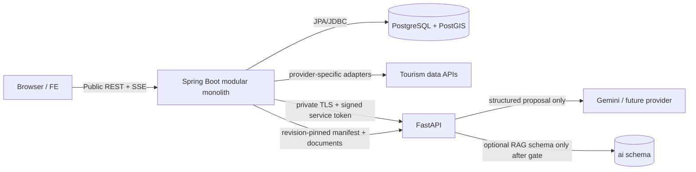

# 2026-09-13 구현 전 최종 백엔드 아키텍처·PRD 검토 보고서

상태: review report. 코드, migration, 실행 API, 배포 환경이 아직 없는 문서 단계의 evidence 기반 심사다. 이 문서는 설계·코드를 수정하지 않으며, 구현 착수 전에 닫아야 할 계약과 검증 게이트를 기록한다.

## 1. Executive Summary

OnMaru의 현재 설계는 **Spring Boot modular monolith가 비즈니스 정답과 외부 관광 데이터 수집을 소유하고, FastAPI가 제한된 AI 제안·선택 RAG를 소유하는 구조**다. PostgreSQL/PostGIS 한 개, Spring 한 인스턴스, 경량 FastAPI 한 인스턴스로 시작하며, Redis·Kafka·별도 gateway·별도 vector DB를 기본 구성에 넣지 않는다. 현재 제품 단계와 운영 불확실성에 적합하다.

9월 12일 심사의 주요 P0/P1 공백은 보완되었다. 여정은 REST command + SSE notification + authoritative GET snapshot으로 단일화되었고, Journey OpenAPI·SSE schema/fixture, corpus manifest/ACK/tombstone 계약, 내부 서비스 JWT replay/rotation 정책, UGC moderation runbook이 생겼다.

다만 모든 R1/R2 공개 기능이 기계 판독 API 계약과 fixture까지 내려오지 않았고, 외부 관광 API의 실제 응답·쿼터·이용 조건과 FE 입력의 재현성이 아직 증명되지 않았다. 이는 아키텍처 재설계 사유가 아니라 **구현 Issue를 발행하기 전 닫아야 하는 P1 게이트**다.

## 2. Reviewed Documents

| 영역 | 검토 문서 | 확인 결과 |
|---|---|---|
| 제품·추적 | `docs/planning/backend-prd.md`, `docs/planning/implementation-readiness.md`, `docs/specs/traceability/fe-be-traceability-matrix.md` | BE-REQ-001~009, 출시 단계, 구현 전 게이트가 존재 |
| 구조·경계 | `docs/architecture/module-boundaries.md`, `docs/planning/architecture-blueprint.md`, ADR-0002 | modular monolith 및 Spring/FastAPI 경계가 명확 |
| 데이터·동시성 | `docs/database/schema.dbml`, `docs/database/migration-and-concurrency.md`, `docs/spring/identity-and-journey.md` | 논리 스키마, DB 강제 제약, lock order, Testcontainers matrix가 정의됨 |
| 공개 계약 | `docs/contracts/rest-api.md`, `docs/contracts/openapi/journey.openapi.yaml`, `docs/contracts/openapi/visit-reviews.openapi.json`, SSE schema/fixtures | 지도·후기와 여정의 current 계약이 존재하나 전체 API coverage는 불완전 |
| 수집 파이프라인 | `docs/spring/catalog-ingestion.md`, `docs/operations/runtime-and-reliability.md` | lease/fence/LKG/revision publish/재시도 정책이 구체적 |
| AI 파이프라인 | `docs/ai/application-architecture.md`, `journey-guardrails.md`, `corpus-sync-contract.md`, `internal-service-authentication.md`, `retrieval-and-rag.md` | 소유권·검증·fallback·RAG activation gate가 구체적 |
| 운영·보안 | `docs/operations/runtime-and-reliability.md`, `docs/operations/moderation.md` | backup, restore, OTel/Grafana, alert, moderation drill이 설계됨 |

## 3. Reconstructed Backend Architecture

- Spring contexts: identity, catalog, discovery, journey, community, operations. Core 간 직접 Gradle 의존성은 금지하고 app bridge가 공개 input API를 연결한다.
- Catalog pipeline: provider adapter → private dataset revision/stage → validation/quarantine → lease fence 재확인 → active pointer CAS → LKG 공개. 외부 HTTP는 DB transaction 밖에서 실행한다.
- Journey pipeline: admission/actor quota → deterministic candidate search → opt-in AI 요청 또는 baseline → Spring 재검증·원자적 snapshot 저장 → SSE 알림 → GET snapshot 재동기화다.
- RAG pipeline: Spring의 immutable revision manifest → FastAPI hash 검증·idempotent ingest → private corpus revision → allowlist/eval 통과 시 active pointer → ACK. 반쯤 색인된 corpus는 제공하지 않는다.
- 운영 pipeline: Actuator/Micrometer 및 OTel → Grafana Cloud, severity별 Discord/email notification. backup/restore와 moderation은 public write 이전 drill 대상이다.

## 4. Traceability Map

| PRD 요구 | Architecture / domain | DB | API / pipeline | 검증 상태 |
|---|---|---|---|---|
| BE-REQ-001~004 한옥·장소 탐색 | catalog | catalog revision/place tables | catalog ingestion·REST prose | **부분**: 공개 OpenAPI/fixture 부족 |
| BE-REQ-005 혼잡 | insights/catalog | observation·region 모델 | source basis date·stale 표시 | **부분**: live source 확인 전 |
| BE-REQ-006~007 방문 후기 | community | review/like/report/audit | REST + VisitReview OpenAPI + moderation | **연결됨** |
| BE-REQ-008 Odii | catalog/audio boundary | audio tables | source ingestion·REST prose | **부분**: 공개 OpenAPI/fixture 부족 |
| BE-REQ-009 AI 여정 | discovery/journey + FastAPI | run/admission/proposal, optional ai | Journey OpenAPI + SSE + guardrail/RAG | **연결됨**, 실행 증거 없음 |
| NFR-01 신뢰·동기화 | catalog/operations | revision/lease/watermark/quarantine | LKG/fence/retry/tombstone | **설계 연결됨**, live capture 없음 |
| NFR-02 보안·운영 | identity/app/AI | session/idempotency/admission | CSRF/OAuth/service token/OTel/backup | **설계 연결됨**, hosting drill 없음 |

## 5. Scorecard

점수는 문서 완성도이며, 구현·운영 증거 점수가 아니다. 전체 confidence는 **중간-높음**이다.

| 영역 | 점수 | 판단 / 핵심 근거 |
|---|---:|---|
| Requirements & Traceability | 8/10 | BE-REQ와 release/게이트는 추적되나 R1/R2 contract coverage가 비대칭 |
| Domain Architecture | 9/10 | bounded context, dependency DAG, runtime callback 금지가 명확 |
| API Design | 7/10 | 여정/후기 강함; catalog·Odii·saved/identity 등의 OpenAPI/fixture 부족 |
| Data Architecture | 9/12 | revision, provenance, concurrency 설계는 강함; executable DDL 없음 |
| Reliability | 10/12 | LKG, deadline, fence, CAS, fallback, restore 절차가 구체적 |
| Security | 9/10 | CSRF/OAuth/service auth/replay/role 분리가 강함; hosting secret proof 미완료 |
| Performance & Scalability | 8/10 | 초기 cap·budget·공간 query/DB pool 기준 존재, 실측은 없음 |
| Observability | 7/8 | signal/alert/runbook이 존재하나 dashboard와 notification test는 미래 증거 |
| Deployment & Operations | 5/7 | rollback/backup 원칙은 있으나 hosting·backup owner/destination 미정 |
| Testing | 5/6 | contract/concurrency/failure matrix가 좋으나 아직 실행 테스트 0 |
| Cost & Complexity | 5/5 | 현 단계에 맞는 modular monolith; 과도한 분산 구성 배제 |

**총점: 82/100**

점수를 가장 크게 높일 증거는 새 기술 도입이 아니라, (1) API별 OpenAPI/fixture, (2) 실제 원천 API redacted capture, (3) migration/concurrency/restore/contract test 실행 결과다.

## 6. Critical Findings

### [P1] 현재 PRD 범위 전체에 대한 기계 판독 공개 API 계약이 완성되지 않았다

- Evidence: `docs/contracts/rest-api.md`는 catalog, Odii, saved journey/resource, timeline, OAuth 등 public endpoint를 정의한다. 기계 계약은 `journey.openapi.yaml`과 `visit-reviews.openapi.json` 두 영역에만 있다. `docs/planning/implementation-readiness.md`도 API별 OpenAPI/fixture 또는 명시적 후속 Issue를 게이트로 둔다.
- Risk: FE/Spring이 payload, pagination cursor, auth/CSRF, error/idempotency를 각자 보완하여 API drift가 발생한다.
- Impact: BE-REQ-001~005·008 및 로그인/저장 기능을 독립 Issue로 안전하게 분할할 수 없다.
- Recommendation: R1 catalog/curation/nearby, R2 Odii/congestion, identity/saved/timeline을 release slice별 OpenAPI+정상·빈값·권한·cursor·stale fixture로 동결한다. 범위 밖이면 readiness에 명시적으로 후속 Issue로 남긴다.
- Reference criterion: requirements-to-contract traceability, contract-first API design.
- Confidence: 높음.

### [P1] 외부 관광 원천의 live contract와 운영 권한이 아직 검증되지 않았다

- Evidence: `docs/planning/implementation-readiness.md` 현재 사실은 실제 API 호출 결과/페이지네이션/쿼터 검증 기록이 없다고 명시한다. `docs/spring/catalog-ingestion.md`도 redacted live capture가 통과하기 전 `LIVE_CANONICAL`을 비활성으로 둔다.
- Risk: 문서의 pagination, HTTP 200 error envelope, 429, licence, 데이터 삭제/정정 가정이 실제 공급자와 다를 수 있다.
- Impact: R1/R2의 production sync와 신선도 약속을 출시할 수 없다.
- Recommendation: provider별 정상/마지막 page/빈 응답/200 오류/4xx·5xx/429/timeout redacted capture와 quota·licence 증빙을 첫 ingestion adapter Issue의 acceptance criteria로 고정한다. 통과 전에는 fixture 또는 verified snapshot만 제공한다.
- Reference criterion: external integration validation, LKG publication safety.
- Confidence: 높음.

### [P1] FE/스키마 입력이 로컬 절대경로 symlink여서 새 checkout과 CI에서 재현되지 않는다

- Evidence: `docs/specs`와 `docs/backend_schema_design_guide.md`는 repository 밖 `/Users/...`를 가리키는 symlink다. `docs/planning/README.md`와 `docs/operations/runtime-and-reliability.md`도 snapshot+manifest 전환을 열린 작업으로 기록한다.
- Risk: FE-BE traceability, fixture 검증, schema review가 작성자 환경에서만 재현된다.
- Impact: CI와 다른 개발자의 Issue/PR acceptance criteria가 동일 입력을 검증하지 못한다.
- Recommendation: 비밀정보 검토 후 필요한 specs/fixtures만 repository 내부 snapshot 또는 reproducible fetch로 고정하고, source repository/commit/path/SHA-256 manifest를 CI가 검증하게 한다.
- Reference criterion: reproducible specification input and contract governance.
- Confidence: 높음.

### [P2] 실행 가능한 migration과 contract test가 아직 설계에서 증거로 전환되지 않았다

- Evidence: `docs/database/migration-and-concurrency.md`는 Flyway DDL·PostgreSQL Testcontainers matrix를 future proof로 정의하고, readiness는 실행 DDL·serializer/reducer contract test 부재를 명시한다.
- Risk: partial unique, CHECK, lock/CAS, SSE reset semantics가 구현 중 약화될 수 있다.
- Impact: duplicate command, cancel-completion race, stale worker, migration rollback에서 결함이 늦게 발견될 수 있다.
- Recommendation: scaffold 다음 첫 wave에서 migration SQL과 Testcontainers concurrency matrix, FE reducer/Spring serializer fixture test를 함께 구현한다. 이 항목은 문서 추가만으로 닫지 않는다.
- Reference criterion: database-enforced invariants and executable contracts.
- Confidence: 높음.

## 7. Cross-document Contradictions

**현재 구현 기준 문서 사이에서 P0 수준의 모순은 발견하지 못했다.** 과거 polling/schema 1.1 문서는 `docs/planning/journey-exploration/README.md` 및 각 handoff의 `ARCHIVED` 헤더로 명시적으로 격리되었고, 현재 기준은 `docs/contracts/rest-api.md`, Journey OpenAPI, SSE schema/fixture로 연결된다.

다만 다음은 모순이 아니라 혼동 방지 조치가 필요하다.

| 항목 | 상태 | 처리 |
|---|---|---|
| `schemaVersion: 1.1` 후보/board 타입 서술 | legacy DTO 보존 문맥 | 새 OpenAPI/FE type 생성 시 `1.2` current envelope와의 포함 관계를 fixture로 검증 |
| FastAPI의 `ai` schema | optional RAG 승인 후에만 사용 | MVP baseline에는 DB credential을 주지 않고, RAG gate 통과 후 Python migration role/limited role을 부여 |
| 과거 polling 문서 | archive | 구현 Issue에서는 `docs/contracts`만 current source로 링크 |

## 8. Failure Scenario Results

| 시나리오 | 문서상 대응 | 남은 실행 증거 |
|---|---|---|
| PostgreSQL down | readiness false, snapshot/DB write 중지, restore 절차 | 실제 restore drill |
| Tour API timeout/429/200 오류 | bounded retry, Retry-After, private revision, LKG 유지 | provider capture + scheduler test |
| partial sync/stale worker | lease generation, fence, pointer CAS, quarantine | kill/restart + late writer test |
| Gemini/FastAPI timeout·invalid output | 같은 run의 deterministic BASELINE, provider retry 없음 | fake/sandbox adapter test |
| SSE process restart/replay gap | reset 후 GET run/exploration snapshot | proxy idle/buffering + reducer fixture test |
| duplicate/cancel/complete race | idempotency, partial unique, admission lock, terminal CAS | PostgreSQL concurrent integration test |
| internal JWT replay/key revoke | one-use JTI store, fail closed, overlapping key rotation | key rotation/replay store outage drill |
| UGC PII/report abuse | protected queue, HIDDEN/REMOVED audit, 24h/72h triage | operator synthetic-data drill |
| migration/rollback failure | expand-contract, N/N-1 compatible rollback, backup deletion ledger | staging upgrade/restore proof |

## 9. Missing Requirements

다음은 아직 `MISSING` 또는 `UNKNOWN`이며, 현재 문서가 이미 게이트로 표시한 항목이다.

1. R1/R2/identity/saved API의 OpenAPI, request/response/error/cursor fixture와 FE/BE 실행 contract test.
2. 공급자별 실제 API version, authentication/권한, quota, pagination, error envelope, licence/reuse terms, redacted capture.
3. repository 내부에서 재현 가능한 FE specs·backend schema guide snapshot/manifest.
4. hosting 선택, secret manager, backup destination, on-call owner와 deployment pipeline의 실제 설정.
5. Gemini 실제 지역/정책/비용/SDK 호환성 및 approved budget. LLM과 optional RAG는 해당 gate 전에는 baseline으로 유지.

## 10. Overengineering / Underengineering Assessment

현재 **Spring modular monolith + bounded FastAPI**는 적정하다. Kafka, Redis, Kubernetes, service mesh, separate API gateway, separate vector DB, durable SSE event log는 현재 요구와 팀/예산 미정 상태에서 근거가 부족하다. SSE도 notification으로 제한하고 DB snapshot을 정답으로 둔 선택은 적절하다.

반대로 공개 API의 prose-only 영역과 symlink 기반 입력은 under-specified다. 이는 서비스를 더 쪼개서 해결할 문제가 아니라, contract artifact와 재현 가능한 입력을 추가해 해결할 문제다.

## 11. Required Fixture Catalogue

아래 fixture는 **예제 데이터**가 아니라 PR의 acceptance test 입력이다. 키, cookie, OAuth code, 정확한 사용자 위치, 원천 URL query, 원본 raw payload 전체를 넣지 않는다. 실제 원천 capture는 민감 query/식별자를 제거하고 fixture metadata에 provider, endpoint, capture date, response hash, licence 확인 상태만 남긴다.

| 우선순위 | 저장 위치 / fixture 묶음 | 반드시 고정할 사례 | 통과 조건 |
|---|---|---|---|
| P1 | `docs/contracts/fixtures/catalog-ingestion/` | provider별 정상 첫/마지막 page, 빈 결과, object/list/null 변형, HTTP 200 error envelope, malformed JSON/content-type, 401/403, 429 `Retry-After`, timeout, 중복 external ID, 좌표/필수값 오류 | adapter가 canonical stage 또는 typed failure만 만들며 key를 로그/fixture에 남기지 않음 |
| P1 | `docs/contracts/fixtures/catalog-public/` + R1 OpenAPI | `region/type/keyword/hasImage/page/size`, unknown nullable field, canonical ID와 legacy ID, 삭제/비공개 404, stale/LKG metadata, 월별 큐레이션 없음 | FE decoder와 Spring serializer가 같은 JSON schema·error·cursor를 통과 |
| P1 | `docs/contracts/fixtures/odii/` + R2 OpenAPI | 언어별 story, 동일 locale의 여러 source ID, subtitle 추정값, audio/script 없음, revision tombstone, cursor 경계 | 언어/원본 ID를 잘못 병합하지 않고 미공개 revision을 노출하지 않음 |
| P1 | `docs/contracts/fixtures/identity/` | OAuth state 최초 성공/재사용/만료, 다른 browser nonce, 허용되지 않은 returnTo, guest→member grant 만료, CSRF 누락/회전, 탈퇴 중 늦은 완료 | credential 없는 소유 접근은 401/404이며 session·OAuth token이 응답/로그에 없음 |
| P1 | `docs/contracts/fixtures/saved-and-timeline/` | active run 중 save, 동일 idempotency key 동일/다른 payload, 삭제된 place/Odii, duplicate PUT/DELETE, cursor 만료, member isolation | 정확히 한 business effect, private response `no-store`, 다른 회원 데이터 0건 |
| P1 | 기존 `journey-sse-fixtures.json` 확장 | accepted, replay, reset, terminal, auth expiry, cancel race 외에 queue rejection, deadline sweeper, stale FastAPI result, `baseVersion` conflict, clarification answer XOR | SSE 알림과 GET snapshot의 terminal status/error가 항상 일치 |
| P1 | `docs/ai/fixtures/` 및 `docs/ai/evals/` | scope/privacy/prompt-injection, candidate ID/evidence injection, malformed provider JSON, timeout, quota 경계 동시성, RAG duplicate manifest, invalid hash, tombstone, out-of-order manifest | 차단 입력은 FastAPI/Gemini에 도달하지 않고, allowlist 위반 0, 실패 시 동일 run baseline 또는 typed terminal |
| P1 | `docs/contracts/fixtures/moderation/` | self-report, duplicate report, high-risk PII hide, false-positive restore, removed/hide list exclusion, member deletion | public list/cache가 HIDDEN/REMOVED 원문을 반환하지 않고 audit sequence가 남음 |
| P2 | `db/test-fixtures/` (scaffold 후) | active-run/admission 경쟁, cancel-complete/deadline race, lease 상실 뒤 late writer, migration upgrade, backup restore/deletion ledger | PostgreSQL Testcontainers에서 constraint·CAS·pointer 불변식이 증명됨 |

`journey.openapi.yaml`과 VisitReview OpenAPI가 이미 시작점이므로, 새 영역도 같은 방식으로 **OpenAPI → JSON fixture → FE decoder/Spring serializer contract test** 순서로 만든다. ingestion fixture는 Spring adapter test 전용이며 브라우저가 원천 pageNo, raw provider DTO, service key를 알아야 할 이유가 없다.

## 12. API Parsing and Secret Boundary

외부 관광 API의 **호출·응답 파싱·pagination·오류 envelope 해석은 Spring의 `TourismSourcePort` outbound adapter에서 수행**한다. 그 adapter가 provider DTO를 internal source model과 canonical model로 변환하고, validation/quarantine/revision publish를 거친 뒤에만 FE에는 OnMaru public DTO를 내려준다. FE는 `/api/v1`의 canonical API만 호출하며 provider endpoint, pageNo, service key, raw response 형식에 의존하지 않는다.

현재 FE에서 받은 키가 있다면 키 종류를 분리해야 한다.

- **TourAPI/Odii/LLM/OAuth client secret 등 서버용 비밀키:** FE에 존재하거나 번들·localStorage·git history에 있었으면 노출된 것으로 간주한다. 즉시 server-only secret manager로 이동하고, 공급자 콘솔에서 회전·기존 키 폐기·배포 환경 적용을 확인한다. 기존 키 값을 이슈·fixture·로그에 복사하지 않는다.
- **지도 SDK처럼 공급자가 browser 사용을 전제로 한 public JavaScript key:** 허용 도메인(referrer) 제한, API scope 제한, quota 제한을 설정한 경우에만 FE에 둘 수 있다. 이것도 Tourism API service key나 OAuth client secret과 공유하면 안 된다.

이는 새 권고가 아니라 `docs/planning/p0-triage.md`의 **FE key fallback P0 blocker**와 일치한다. 현재 저장소 문서만으로는 받은 키의 종류·노출 범위·회전 완료 여부를 확인할 수 없으므로, 회전이 끝났다고 판단하지 않는다.

## 13. Recommended Remediation Order

1. **P1 — 계약 닫기:** R1/R2/identity/saved API를 OpenAPI·fixture로 동결하고, 책임별 구현 Issue의 입력으로 만든다.
2. **P1 — 재현성 닫기:** FE specs와 schema guide의 source manifest/snapshot 방식을 확정한다.
3. **P1 — 외부 입력 검증:** 첫 adapter에서 provider별 live capture·quota·licence를 검증하고 `LIVE_CANONICAL` gate를 결정한다.
4. **P2 — 실행 증거 만들기:** Flyway migration, Testcontainers concurrency, serializer/reducer contract test를 scaffold와 함께 구현한다.
5. **출시 전 게이트:** hosting/secret/backup owner, restore drill, Grafana alert notification, moderation drill, AI sandbox/eval을 확인한다.

## 14. Final Verdict

**`IMPLEMENTABLE WITH FIXES`**

핵심 아키텍처와 Spring/FastAPI·수집·AI·운영 파이프라인의 책임 경계는 구현 가능한 수준이다. 다만 위 P1 세 항목을 닫기 전에는 전체 MVP를 한 번에 구현 Issue로 발행하지 않는다. 먼저 계약/입력 재현성/외부 원천 검증을 독립 선행 Issue로 완료한 뒤 R1 → R2 → R3 순서로 진행한다.
