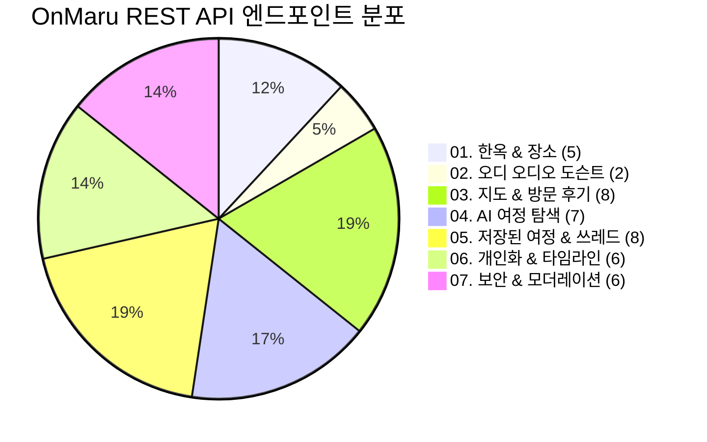

# 2026-09-18 백엔드 API 단독 검증 및 Swagger 명세 보고서

- **문서 상태**: Verification & API Specification Report
- **대상 서비스**: OnMaru Spring Boot REST API (`apps/spring-api`)
- **검증 환경**: Local Standalone Runner (`http://localhost:8080`)
- **결과 요약**: **12 / 12 단독 E2E 테스트 전체 통과 (100% PASS)**

---

## 1. 개요 및 목적

본 보고서는 Issue #239에서 수행된 **OpenAPI 3.1 / Swagger UI 명세화** 작업과 로컬 단독 환경에서의 **백엔드 REST API E2E 검증 결과**를 종합 기록합니다.

프론트엔드 및 외부 시스템과의 원활한 연동을 위해 전체 23개 컨트롤러, 33개 이상의 엔드포인트에 기능 도메인별 그룹화와 상세 스키마(`@Tag`, `@Operation`, `@Parameter`, `@ApiResponse`, `@Schema`)를 부여하고 동작을 검증하였습니다.

---

## 2. API 기능 도메인별 명세 현황 (33개 엔드포인트)



### 1) 01. 한옥 & 장소 카탈로그 (Hanok & Place) - 5개
- `GET /api/v1/hanoks` : 전통 한옥 목록 조회 (카테고리/지역 필터링, 커서 페이징)
- `GET /api/v1/places/{placeId}` : 일반 관광 장소 상세 정보 조회
- `GET /api/v1/hanoks/{placeId}` : 한옥 상세 정보 조회
- `GET /api/v1/hanoks/monthly` : 월간 한옥 에디토리얼 큐레이션 조회
- `GET /api/v1/map/places` : 지도 바운딩 박스/뷰포트 기반 장소 검색

### 2) 02. 오디 오디오 도슨트 (Odii Audio) - 2개
- `GET /api/v1/odii/stories` : 한국관광공사 Odii 오디오 도슨트 이야기 목록 조회
- `GET /api/v1/odii/stories/{storyId}` : 개별 오디오 해설 및 음성 스크립트 상세 조회

### 3) 03. 지도 & 방문 후기 (Map & Reviews) - 8개
- `GET /api/v1/visit-review-regions` : 행정구역 폴리곤 및 후기 통계 집계 조회
- `GET /api/v1/regions/resolve` : 좌표(위경도) 기반 행정구역 코드 역지오코딩
- `GET /api/v1/visit-reviews` : 방문 후기 글로벌/지역 피드 조회
- `GET /api/v1/places/{placeId}/visit-reviews` : 특정 장소의 방문 후기 피드 조회
- `POST /api/v1/places/{placeId}/visit-reviews` : 방문 후기 작성 (멱등성 보장)
- `DELETE /api/v1/visit-reviews/{reviewId}` : 본인 작성 후기 삭제
- `PUT /api/v1/visit-reviews/{reviewId}/likes/me` : 후기 좋아요 등록
- `DELETE /api/v1/visit-reviews/{reviewId}/likes/me` : 후기 좋아요 취소
- `POST /api/v1/visit-reviews/{reviewId}/reports` : 후기 신고 접수

### 4) 04. AI 여정 탐색 (Journey & AI) - 7개
- `POST /api/v1/explorations` : 대화형 AI 한옥 여정 탐색 세션 생성
- `GET /api/v1/explorations/{id}` : 여정 탐색 세션 스냅샷 및 추천 보드 조회
- `POST /api/v1/explorations/{id}/turns` : 사용자 요구사항 대화 턴 전송
- `POST /api/v1/explorations/{id}/actions` : 여정 제안 액션 적용 (Add, Pin, Remove, Reorder 등)
- `GET /api/v1/explorations/{id}/runs/{runId}` : AI 실행 런 상태 조회
- `POST /api/v1/explorations/{id}/runs/{runId}/cancel` : AI 실행 런 취소
- `GET /api/v1/explorations/{id}/runs/{runId}/events` : AI 생성 과정 실시간 SSE 스트리밍

### 5) 05. 저장된 여정 & 쓰레드 (Saved Journey & Threads) - 8개
- `POST /api/v1/saved-journeys` : 완성된 여정 북마크 저장
- `GET /api/v1/saved-journeys` : 내가 저장한 여정 목록 조회
- `GET /api/v1/saved-journeys/{id}` : 저장된 여정 상세 조회
- `DELETE /api/v1/saved-journeys/{id}` : 저장된 여정 삭제
- `POST /api/v1/saved-journeys/{id}/resume` : 저장된 여정에서 AI 탐색 이어하기
- `GET /api/v1/me/journey-threads` : 내 여정 대화 쓰레드 목록 조회
- `GET /api/v1/me/journey-threads/{threadId}` : 특정 여정 쓰레드 상세 조회
- `DELETE /api/v1/me/journey-threads/{threadId}` : 여정 쓰레드 삭제

### 6) 06. 개인화 & 회원 타임라인 (Personalization & Member) - 6개
- `GET /api/v1/saved-resources` : 저장된 리소스 통합 피드 조회 (장소, 오디오 등)
- `PUT /api/v1/saved-resources/places/{placeId}` : 장소 북마크 저장
- `DELETE /api/v1/saved-resources/places/{placeId}` : 장소 북마크 해제
- `PUT /api/v1/saved-resources/odii-stories/{storyId}` : 오디오 도슨트 저장
- `DELETE /api/v1/saved-resources/odii-stories/{storyId}` : 오디오 도슨트 저장 해제
- `GET /api/v1/me/timeline` : 사용자 활동 타임라인 조회
- `GET /api/v1/members/me` : 내 프로필 및 계정 정보 조회
- `DELETE /api/v1/members/me` : 회원 탈퇴

### 7) 07. 보안, 인증 & 운영 (Security & Operations) - 6개
- `GET /auth/csrf` : CSRF 방어 토큰 및 게스트 식별 세션 발급
- `GET /auth/kakao/login` : 카카오 소셜 로그인 인가 코드 요청
- `GET /auth/kakao/callback` : 카카오 OAuth 인증 콜백 및 세션 생성
- `POST /api/v1/auth/logout` : 로그아웃 및 세션 무효화
- `GET /api/v1/insights/observations` : 지역별 관광 관측 지표 시계열 조회
- `GET /api/v1/insights/heatmap` : 지역별 관광 히트맵 데이터 조회
- `GET /api/v1/operations/moderation/queue` : 운영자용 신고 후기 검수 대기열 조회

---

## 3. 로컬 단독 E2E 테스트 검증 결과 (12 / 12 PASS)

| No | 테스트 항목 | HTTP 메서드 및 엔드포인트 | 응답 코드 | 검증 내용 및 페이로드 상태 |
| :---: | :--- | :--- | :---: | :--- |
| **1** | OpenAPI 3.1 JSON 스펙 | `GET /v3/api-docs` | `200 OK` | OpenAPI 3.1.0 규격 준수, 전체 엔드포인트 및 DTO 스키마 명세 검증 |
| **2** | Swagger UI 번들 | `GET /swagger-ui/index.html` | `200 OK` | Swagger UI 정적 번들 정상 서빙 및 인터랙티브 인터페이스 렌더링 |
| **3** | CSRF & 게스트 발급 | `GET /auth/csrf` | `200 OK` | `X-CSRF-TOKEN` 헤더 및 `__Host-onmaru-guest` 쿠키 정상 발급 |
| **4** | 한옥 목록 조회 | `GET /api/v1/hanoks?limit=3` | `200 OK` | 3건의 한옥 카드 데이터, 썸네일, 커서 메타데이터 반환 |
| **5** | 장소 상세 조회 | `GET /api/v1/places/p-jeonju-hanok-village` | `200 OK` | 전주 한옥마을 상세 설명, 좌표(`35.8151, 127.153`), 이미지 목록 반환 |
| **6** | 월간 한옥 에디토리얼 | `GET /api/v1/hanoks/monthly?month=2026-09` | `200 OK` | "9월의 한옥 산책" 에디토리얼 제목 및 Hero/Cafe 슬롯 2건 반환 |
| **7** | 행정구역 후기 집계 | `GET /api/v1/visit-review-regions` | `200 OK` | 서울특별시/전북특별자치도 시도별 후기 카운트 및 리비전 정보 반환 |
| **8** | 지도 뷰포트 장소 검색 | `GET /api/v1/map/places?regionCode=kr-45-jeonju` | `200 OK` | 전주 지역 뷰포트 내 한옥 2개소 좌표 및 카드 매핑 반환 |
| **9** | 방문 후기 피드 조회 | `GET /api/v1/visit-reviews?scope=ALL&limit=5` | `200 OK` | 전체 최신 방문 후기 목록, 작성일시, 좋아요 수 정상 집계 반환 |
| **10** | 플랫폼 관측 지표 | `GET /api/v1/insights/observations?regionCode=kr-45-jeonju` | `200 OK` | 전주시 방문자 수(`VISITOR_COUNT`) 시계열 관측 데이터 반환 |
| **11** | AI 여정 탐색 생성 | `POST /api/v1/explorations` | `202 Accepted` | 멱등성 키 및 CSRF 토큰 기반 AI 탐색 세션 및 런 생성 확인 |
| **12** | AI 여정 스냅샷 조회 | `GET /api/v1/explorations/{id}` | `200 OK` | 세션 보드, 스냅샷 버전, 실행 엔진(`LLM`) 런 상태 반환 |

---

## 4. 로컬 구동 및 테스트 실행 가이드

### 1) 로컬 서버 구동
```bash
./gradlew :apps:spring-api:bootRun --args="--onmaru.secrets.source=fake"
```

### 2) Swagger UI 브라우저 접속
- **Swagger UI**: [http://localhost:8080/swagger-ui/index.html](http://localhost:8080/swagger-ui/index.html)
- **OpenAPI JSON**: [http://localhost:8080/v3/api-docs](http://localhost:8080/v3/api-docs)

### 3) 자동화 단독 테스트 스크립트 실행
```bash
node -e '
async function test() {
  const csrf = await (await fetch("http://localhost:8080/auth/csrf")).json();
  console.log("CSRF Ready:", csrf.token.substring(0, 10));
  const hanoks = await (await fetch("http://localhost:8080/api/v1/hanoks?limit=2")).json();
  console.log("Hanoks:", hanoks.items.length, "items");
}
test();
'
```
