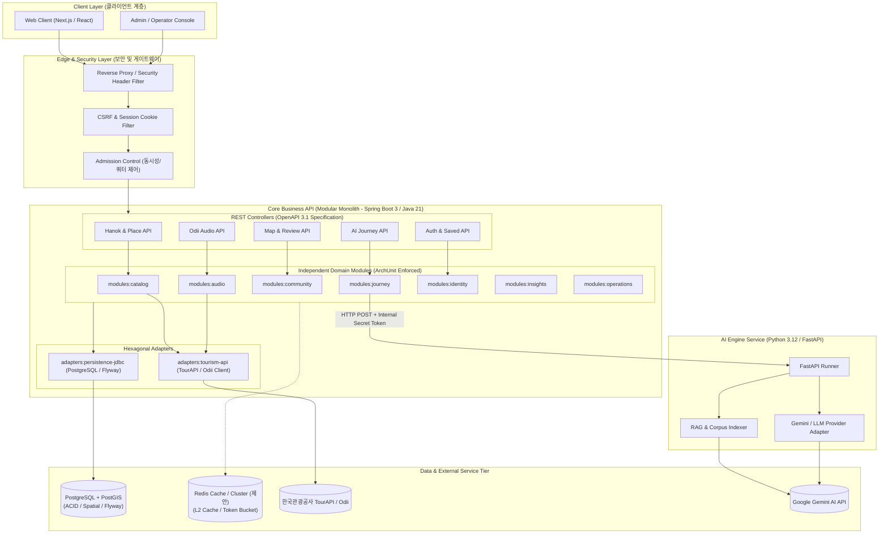
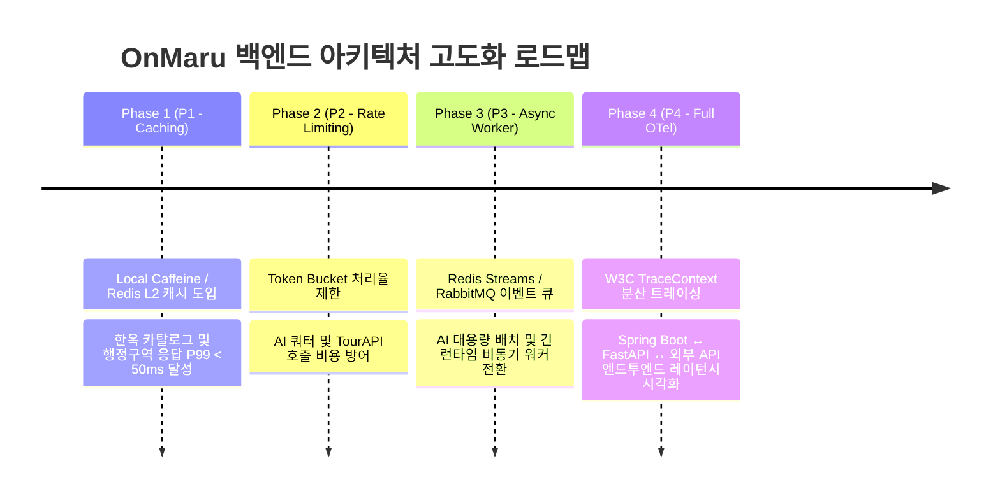

# 2026-09-18 백엔드 아키텍처 평가 및 진화 로드맵 보고서

- **문서 상태**: Architecture Review & Evaluation Report
- **평가 기준**: `backend-architect-engineer`, 모듈 결합도, 동시성/멱등성 제어, 트래픽 확장성 및 운영 복원력

---

## 1. Executive Summary

OnMaru 백엔드는 **Java 21 / Spring Boot 3 기반의 모듈러 모놀리스(Modular Monolith)** 와 **Python 3.12 / FastAPI 기반의 AI RAG 엔진**이 결합된 하이브리드 아키텍처를 채택하고 있습니다.

비즈니스 정합성, 엄격한 트랜잭션(ACID), 보안, 외부 공공데이터(TourAPI/Odii) 연동은 Spring Boot가 전담하고, 비결정론적 LLM 추론 및 코퍼스 임베딩/색인은 FastAPI가 독립적으로 수행합니다. 또한 ArchUnit 테스트를 통해 모듈 간 경계를 엄격히 통제하여 마이크로서비스의 복잡성을 피하면서도 높은 유지보수성과 확장성을 확보한 우수한 설계입니다.

본 보고서에서는 현재의 아키텍처 토폴로지를 분석하고, 대규모 트래픽 및 프로덕션 운영을 대비한 4대 핵심 개선 영역(캐싱, Rate Limiting, 비동기 이벤트 큐, 분산 트레이싱)을 제시합니다.

---

## 2. 전체 시스템 아키텍처 토폴로지 (System Topology View)

---

## 3. 핵심 아키텍처 영역별 평가

### 1) 모듈화 및 결합도 관리 (Modular Monolith & Decoupling)
- **현황**: `modules/` 디렉터리 하위에 `catalog`, `audio`, `community`, `identity`, `journey`, `operations`, `insights`, `shared-web` 등 8개 모듈이 분리되어 있습니다.
- **평가**: **매우 우수 (A+)**
  - 모듈 간 직접 참조를 금지하고 `ModuleBoundaryArchUnitTests`를 통해 순환 참조 및 잘못된 레이어 접근을 CI 빌드 단계에서 원천 차단합니다.
  - 마이크로서비스 전환 시 모듈 단위의 서비스 분리가 손쉽게 가능한 느슨한 결합 구조를 갖추고 있습니다.

### 2) 동시성, 정합성 및 멱등성 (Concurrency & Idempotency)
- **현황**:
  - 상태 변경 엔드포인트(후기 작성, 여정 생성)에 `Idempotency-Key` 헤더 및 지문(Fingerprint) 검증 적용.
  - AI 탐색 세션 상태 전이에 CAS(Compare-And-Swap) 낙관적 락(`baseVersion`) 적용.
  - AI 요청 폭주를 막기 위한 Admission Control(정원 관리) 및 Actor 쿼터 제어 도입.
- **평가**: **매우 우수 (A)**
  - 네트워크 재시도로 인한 중복 결제/중복 데이터 생성 위험을 사전에 완벽히 차단하고 있습니다.

### 3) 기술 스택 분리 (Java/Spring + Python/FastAPI)
- **현황**: 트랜잭션 비즈니스 로직은 Java/Spring Boot, AI RAG/LLM 연동은 Python/FastAPI로 분리.
- **평가**: **우수 (A)**
  - 각 생태계의 강점(Java의 견고한 타입 시스템 및 엔터프라이즈 기능, Python의 풍부한 AI/LLM 생태계)을 적절히 레버리지하고 있습니다.
  - 통신은 내부 시크릿 토큰(`X-Internal-Token`) 기반의 경량화된 프로토콜로 격리되어 있습니다.

### 4) 데이터베이스 및 영속성 계층 (Database Tier)
- **현황**: PostgreSQL + Flyway 마이그레이션 기반 단일 데이터베이스 운용.
- **평가**: **적정 (B+)**
  - MVP 및 초기 상용화 단계에 가장 적합한 단일 RDBMS 구조입니다.
  - 향후 트래픽 증가에 따라 읽기 복제본(Read Replica) 및 캐시 계층 추가가 필요합니다.

---

## 4. 향후 아키텍처 진화 로드맵 (Evolution Roadmap)

### P1. 고속 읽기 캐시 계층 도입 (Redis / Caffeine L2 Cache)
- **목적**: 한옥 목록(`GET /api/v1/hanoks`), 장소 상세, 월간 에디토리얼 등 읽기 집중 데이터의 DB 쿼리 부하 80% 이상 절감.
- **방안**: Cache-Aside 패턴 적용 및 카탈로그 변경 시 선택적 캐시 무효화(Cache Invalidation).

### P2. API 처리율 제한 (Rate Limiting)
- **목적**: 악의적 호출 및 급격한 트래픽 유입 시 고비용 외부 API(Gemini LLM, TourAPI) 보호.
- **방안**: IP/세션 기반 Bucket4j 또는 Redis Token Bucket 필터 적용.

### P3. 비동기 작업 큐 확장 (Event-Driven Worker)
- **목적**: 다중 턴 AI 탐색 및 대용량 코퍼스 동기화 작업의 백프레셔(Backpressure) 제어.
- **방안**: Redis Streams / RabbitMQ 기반의 비동기 작업 큐로 Worker 패턴 확장.

### P4. 통합 분산 트레이싱 (OpenTelemetry W3C Context)
- **목적**: 클라이언트 ➡️ Spring Boot ➡️ FastAPI ➡️ Gemini 호출 전 구간 지연시간 및 병목 시각화.
- **방안**: W3C `traceparent` 헤더 전파 및 Grafana Tempo/Jaeger 대시보드 연동.
