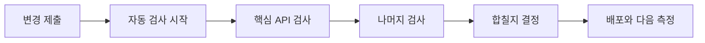

# OnMaruBE CI 성과: 7분의 대기 시간을 측정하고 병렬화의 기준을 세우기까지

- 상태: **현재 병목 관측 완료 — 개선율 확정 전**
- 관측 일시: 2026-09-24 UTC
- 관련 이슈: #368 (직렬 기준선), #365 (병렬 caller), #377 (AI 실행 환경), #380 (보고서 표현)
- 데이터 원칙: 원시 로그·secret·consumer source는 저장하지 않고, 실행 링크와 집계 수치만 기록한다.

## 먼저 읽을 결론

개발자가 Pull Request를 올린 뒤 코드를 합치기 전에 기다리는 자동 확인 절차, 즉 CI는 현재 한 번에 약 **6분 40초~7분 34초**가 걸린다. 그중 Spring API 테스트가 약 **3분 30초**로 가장 길어서, 전체 대기 시간의 약 절반을 붙잡고 있다. 여러 검사를 동시에 실행하는 병렬 구조 자체는 확인했지만, 첫 후보 실행은 AI 테스트 도구가 준비되지 않아 실패했다. 따라서 지금은 “얼마나 빨라졌다”가 아니라 “어디가 느리고, 무엇을 성공 표본으로 다시 측정해야 하는가”까지 확정된 상태다.

## 개발자가 체감하는 흐름은 하나의 긴 줄이었다

CI는 사람이 검토하기 전에 컴퓨터가 테스트와 품질 검사를 대신 수행하는 과정이다. 현재 `verify` 작업은 하나의 임시 컴퓨터(runner)에서 검사들을 차례대로 처리한다. 앞선 검사가 끝나야 다음 검사가 시작되므로, 짧은 테스트가 많아도 가장 긴 테스트가 전체 완료 시간을 끌고 간다. 이때 전체 완료를 가장 오래 붙잡는 단계를 critical path, 즉 **가장 긴 대기 경로**라고 부른다.

*현재는 핵심 API 검사가 가장 긴 대기 경로를 형성한다. 이 그림은 세부 step 목록이 아니라 개발자가 경험하는 의사결정 흐름을 보여 준다.*

## 숫자로 보면 CI는 측정할 수 있지만 CD는 아직 측정할 수 없다

아래의 PR CI 세 건은 서로 다른 커밋에서 실행된 운영 관측값이다. 시간대가 비슷하게 모여 현재 대기 시간을 설명하는 데에는 도움이 되지만, 동일 커밋을 반복 실행한 정식 기준선은 아니다. 정식 기준선은 #368에서 같은 코드 상태로 세 번 이상 성공 실행을 확보한 뒤 중앙값으로 정한다.

| 구분 | 현재 관측 | 독자가 알아야 할 점 |
| --- | ---: | --- |
| PR CI `verify` | 400~403초 (약 6분 40초) | 최근 성공 PR 3건의 job 실행 시간 |
| develop CI `verify` | 454초 (약 7분 34초) | 단일 성공 관측값 |
| 병렬 후보의 가장 긴 경로 | 316.41초 | 실패한 실행이므로 개선 성과로 사용하지 않음 |
| CD: Staging Deploy | 성공 표본 없음 | 실패까지 걸린 시간은 배포 속도가 아님 |
| CD: Release Please | 성공 표본 없음 | 성공한 release 흐름부터 별도 측정 필요 |

CI는 코드를 확인하는 시간이고, CD는 확인된 코드를 실제 환경에 배포하는 시간이다. 최근 Staging Deploy와 Release Please에는 성공 표본이 없으므로, 지금 CD에 대해 “몇 분 만에 배포된다”라고 말할 근거는 없다. 실패한 실행의 지속 시간은 문제를 찾는 단서일 뿐, 배포 성능 지표가 아니다.

## 시간의 절반은 Spring API 테스트에 쓰였다

`develop`의 [CI run 35940692137](https://github.com/YRootLab/OnMaru-backend/actions/runs/35940692137)은 454초가 걸렸다. Step timestamp를 기준으로 나눈 아래 값은 근사치이며, runner가 배정되기 전의 대기 시간이나 비용을 뜻하지 않는다.

| 자동 확인 단계 | 시간 | 전체 CI에서 차지한 비중 | 기다림의 의미 |
| --- | ---: | ---: | --- |
| Spring API 테스트 | 221초 | 48.7% | 다른 검사가 끝나도 이 검사가 끝날 때까지 PR 결과를 기다린다. |
| TourAPI adapter 테스트 | 59초 | 13.0% | 외부 관광 API 연동 계약이 깨지지 않았는지 확인한다. |
| Node·생성물 검증 | 38초 | 8.4% | 공개 계약과 생성 파일이 서로 어긋나지 않았는지 확인한다. |
| 나머지 모듈 테스트 | 91초 | 20.0% | 독립적인 검사들이 순서대로 실행되고 있다. |
| 준비·Python/FastAPI·정리 | 45초 | 9.9% | 검사 도구를 준비하고 AI·FastAPI 품질을 확인한다. |

가장 먼저 개선을 검토할 이유도 여기에 있다. Spring API 테스트를 없애거나 줄이자는 뜻은 아니다. 다른 독립 테스트와 **동시에** 시작하게 만들어, 중요한 검증은 그대로 유지하면서 개발자가 결과를 기다리는 시간을 줄일 수 있는지 확인하자는 뜻이다.

## 병렬화는 가능성을 보였지만 아직 성과가 아니다

[Module Benchmark run 35941255870](https://github.com/YRootLab/OnMaru-backend/actions/runs/35941255870)에서는 한 번에 최대 4개 모듈을 시작했고, 12개 모듈 중 11개가 성공했다. toolkit checkout, 실행 계획 생성, 각 모듈의 근거 artifact 수집도 동작했다. 즉, 여러 검사를 동시에 실행할 수 있는 배관은 실제로 연결됐다.

하지만 AI 모듈이 새 runner에 없는 `uv` 명령을 실행하면서 실패했다. 이 한 건 때문에 결과를 모으는 단계는 의도적으로 실패 처리됐다. 316.41초라는 값은 병렬 구조의 길이를 관찰한 값일 뿐이며, 성공한 직렬 실행과 비교해 “절감됐다”라고 표현할 수 없다. AI 실행 환경은 #377에서 수정 중이고, 그 수정이 성공한 뒤에야 공정한 비교를 시작할 수 있다.

| 확인된 사실 | 아직 말할 수 없는 것 |
| --- | --- |
| 최대 4개 모듈을 동시에 시작할 수 있다. | CI가 21% 빨라졌다. |
| 11개 모듈의 테스트와 근거 artifact 수집은 성공했다. | 316.41초가 공식 병렬 기준선이다. |
| AI runner의 `uv` 준비가 필요하다. | CD가 더 빨라졌다. |

> 실패·취소·시간 초과·근거 artifact 누락·환경 차이가 있는 실행은 개선 또는 회귀 판단에서 제외한다. 빨라 보이는 실패를 성과로 기록하지 않는 것이 이 측정 체계의 기본 원칙이다.

## 다음 측정에서는 결과가 아니라 비교 조건부터 맞춘다

공정한 비교를 위해 같은 코드(commit SHA), 같은 테스트 명령, 같은 도구 버전, 같은 runner 이미지, 같은 캐시 상태에서 실행해야 한다. 직렬 CI와 병렬 CI를 각각 세 번 이상 성공 실행한 뒤, 가운데 값인 중앙값을 대표 수치로 사용한다. 가장 느린 쪽의 안정성은 p95, 즉 20번 중 19번은 이보다 빨랐던 시간으로 계속 살핀다. 실패율과 취소율도 함께 비교해, 단지 빨라진 대신 신뢰도가 떨어지는 변화는 개선으로 보지 않는다.

| 다음 단계 | 완료 기준 | 왜 필요한가 |
| --- | --- | --- |
| 직렬 기준선 수집 (#368) | 같은 코드 상태의 성공 실행 3회 | 우연한 runner·캐시 차이를 줄인다. |
| AI 실행 환경 수정 (#377) | AI 테스트 성공, 전체 결과 집계 성공 | 병렬 후보가 완결된 실행이 되게 한다. |
| 병렬 후보 수집 (#365) | 같은 조건의 성공 실행 3회 | 직렬과 공정하게 비교한다. |
| CI·CD 추세 보고 (#366) | 중앙값·p95·실패율을 지속 기록 | 한 번의 빠른 실행이 아닌 꾸준한 개선을 확인한다. |

## 포트폴리오에 남길 수 있는 문장

OnMaru Backend의 CI 실행 시간을 단계별로 계측해 Spring API 테스트가 전체 대기 시간의 약 절반을 차지하는 병목임을 확인했습니다. 이후 모듈 단위 병렬 실행 구조와 실행 근거 수집 체계를 도입했으며, 실패한 실행은 개선 성과에서 제외하고 동일 조건 반복 측정으로 실제 개선율을 검증하는 기준을 설계했습니다.

## 데이터의 범위와 원본

- 직렬 관측: [CI run 35940692137](https://github.com/YRootLab/OnMaru-backend/actions/runs/35940692137) — 성공, 단일 `develop` 표본
- 병렬 관측: [Module Benchmark run 35941255870](https://github.com/YRootLab/OnMaru-backend/actions/runs/35941255870) — AI runner 환경 문제로 실패, 성과 판정 제외
- 최근 성공 PR CI: [35942322749](https://github.com/YRootLab/OnMaru-backend/actions/runs/35942322749), [35942194992](https://github.com/YRootLab/OnMaru-backend/actions/runs/35942194992), [35941255407](https://github.com/YRootLab/OnMaru-backend/actions/runs/35941255407)

이 문서는 [CI 성과 보고서 작성 프롬프트](../prompts/ci-performance-report.md)를 적용한 첫 결과다. 이후 보고서도 같은 프롬프트와 비교 가능성 규칙을 사용해 갱신한다.
