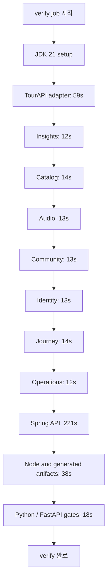
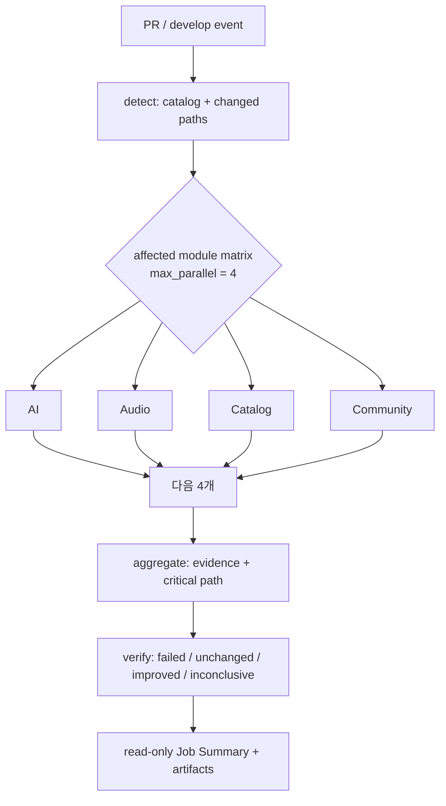
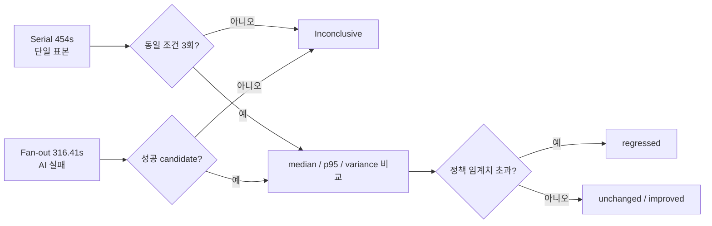

# OnMaruBE CI 병렬화: 기준선, fan-out 관측, 측정 계획

- 상태: **초기 관측 완료 — 성능 비교는 아직 보류**
- 기준 이슈: #368 (serial 기준선), #365 (caller), #376 (이 보고서), #377 (AI runner 준비)
- 관측 일시: 2026-09-24 UTC
- 원칙: raw log·secret·consumer source는 저장하지 않고 GitHub Actions run/artifact 링크와 집계 수치만 기록한다.

## 결론

현재 `verify`는 하나의 runner에서 모듈과 품질 검사를 순서대로 실행하는 약 7분 34초의 직렬 경로다. 실측 fan-out은 4개 모듈을 동시에 시작하고 toolkit checkout·planning·artifact 수집까지 성공해 병렬 topology 자체는 검증했다. 그러나 AI 모듈이 fresh runner에 없는 `uv`를 호출하여 실패했으므로, 이 후보 run은 **성능 개선의 증거가 아니라 실패한 관측값**이다.

따라서 현 시점에 주장할 수 있는 것은 다음 두 가지뿐이다.

1. Spring API 테스트(221초)가 현재 단일 `verify`의 최대 병목이다.
2. module matrix의 resource-profile self-cancellation은 제거됐고, 최대 4개 모듈의 동시 실행을 실제로 확인했다.

"30% 빨라졌다"와 같은 결론은 #377을 고친 성공 candidate와 #368의 동일 조건 serial run 3개가 확보되기 전에는 금지한다.

## 측정 대상과 증거 품질

| 구분 | 증거 | 결과 | 비교 가능 여부 | 용도 |
| --- | --- | --- | --- | --- |
| Serial 관측 | [CI run 35940692137](https://github.com/YRootLab/OnMaru-backend/actions/runs/35940692137) | success | 단일 표본, 불충분 | 현재 병목 지도 |
| Fan-out 관측 | [Module Benchmark run 35941255870](https://github.com/YRootLab/OnMaru-backend/actions/runs/35941255870) | failed | 불가 | topology·실패 원인 확인 |
| Serial baseline | #368 | pending | 동일 SHA 성공 3회 필요 | median/분산 기준선 |
| Fan-out candidate | #365 + #377 | pending | 동일 catalog/config, success 필요 | 전후 비교 |

비교 가능 조건은 commit SHA, runner image, dependency mode, cache state, Java/Python version, test command와 catalog/config hash가 모두 같은 것이다. 조건이 다르거나 실패·취소·artifact 누락이면 결과는 `inconclusive`이며 regression 또는 improvement로 분류하지 않는다.

## 현재 직렬 CI의 구조와 병목

Serial run 35940692137의 job 실행 시간은 **454초**(시작 00:56:32 UTC, 완료 01:04:06 UTC)다. GitHub run 전체는 458초다. 이는 하나의 최신 `develop` 관측값이며 median이 아니다.

| 구간 | 시간 | 직렬 job 대비 | 해석 |
| --- | ---: | ---: | --- |
| Spring API tests | 221s | 48.7% | 가장 큰 병목; 병렬화 뒤에도 critical path 후보 |
| TourAPI adapter tests | 59s | 13.0% | 두 번째 독립 비용 |
| Node / generated artifact validation | 38s | 8.4% | Spring API 이후에 놓여 있어 tail 증가 |
| 나머지 모듈 테스트 | 91s | 20.0% | 서로 독립이면 matrix로 겹칠 수 있는 구간 |
| setup·Python/FastAPI·cleanup | 45s | 9.9% | runtime provisioning과 tail 비용 |

이 표의 합계는 step timestamp 경계로 계산한 근사치다. GitHub-hosted runner의 queue·image provisioning 시간은 job 시작 전후와 별도이므로, runner utilization이나 비용을 뜻하지 않는다.

## 목표 fan-out 구조와 관측 결과

Fan-out run 35941255870에서 detect는 다음을 성공했다.

- consumer checkout, immutable toolkit checkout, toolkit CLI install, module-plan 생성
- `max_parallel: 4`로 AI·audio·catalog·community 4개 module job의 동시 시작
- 이전 resource-profile concurrency key로 인한 sibling cancellation은 발생하지 않음
- module evidence artifact와 aggregate report artifact를 발행

그러나 AI job은 `uv run pytest`를 실행했을 때 `uv`가 없는 fresh runner에서 exit 127로 실패했다. 나머지 11개 module job은 성공했지만 aggregate는 fail-closed로 `failed`를 반환했다. 이것은 #377이 해결할 실행 계약 결함이며, 성능 회귀로 해석하지 않는다.

| Fan-out 관측 지표 | 값 | 해석 |
| --- | ---: | --- |
| 실행 모드 | PR / full-suite fallback | caller workflow 변경이 공통 경로로 분류됨 |
| 동시 시작 module 수 | 4 | `max_parallel` 정책이 적용됨 |
| module 결과 | 11 success, 1 failed | 불완전 candidate |
| aggregate critical path | 316.41s | 실패한 run의 topology 관측값; 개선 수치로 사용 금지 |
| 실행 결과 | failed | promotion/required gate에 사용 금지 |

## 왜 직렬 454초와 fan-out 316.41초를 비교하지 않는가

두 수치는 참고 가능한 운영 관측값이지만 실험 쌍이 아니다. serial은 `develop`의 SHA `2843c8c…`이고, fan-out은 PR merge SHA와 다른 runner image/version, cache 상태, command environment를 사용했다. 더 결정적으로 candidate는 실패했다.

## 기준선과 후보 측정 계약

| 지표 | 정의 | 수집 위치 | 판정에 쓰는 방법 |
| --- | --- | --- | --- |
| Queue time | workflow 생성부터 job 시작까지 | Actions run/job timestamps | runner capacity 변동과 실행 시간 분리 |
| Wall-clock | job 시작부터 완료까지 | Actions job timestamps | 개발자 대기 시간; median/p95 비교 |
| Sum of work | module elapsed/cpu evidence의 합 | module evidence artifacts | 병렬화가 비용을 늘렸는지 확인 |
| Critical path | DAG상 가장 긴 의존 경로 | aggregate report | topology 효과 확인 |
| Module duration | module command 시작~종료 | `module-evidence-<id>` | 병목·straggler 탐지 |
| Failure/cancellation | exit code, result, artifact 존재 | aggregate/verify | false improvement 차단 |
| Environment identity | SHA, runner image, cache, toolchain, config hash | serial manifest + module report | 비교 가능성 gate |

### 기준선 수집 순서

1. #368에서 동일 `develop` SHA의 성공한 serial `verify` 3개를 확보한다.
2. `serial-baseline.mjs`로 median wall-clock, work, peak RSS와 immutable run URL을 포함한 manifest를 생성한다.
3. #377에서 AI runner 준비를 고치고, #365의 fan-out을 성공시킨다.
4. 같은 catalog/config hash와 toolchain identity를 가진 성공 fan-out 3개를 수집한다.
5. 보고서 표에 median, p95, relative delta, queue delta, critical-path delta를 채운다.

## 개선 우선순위와 기대 검증

| 우선순위 | 개선 | 기대 효과 | 검증 기준 | 위험 / 방어 |
| --- | --- | --- | --- | --- |
| P0 | AI module에 `uv` runtime 준비 | candidate 성공·evidence 완결 | AI exit 0, aggregate success | 설치 비용은 module duration에 포함 |
| P0 | module-ID concurrency 유지 | sibling cancellation 제거 | 같은 profile 4개 이상이 모두 실행 | max_parallel 초과 금지 |
| P1 | serial baseline 3회 수집 | 전후 수치의 신뢰성 | identity 완전 일치 | 표본 부족은 inconclusive |
| P1 | Spring API를 독립 matrix lane으로 운용 | 221초 병목을 다른 short test와 겹침 | critical path와 wall-clock 감소 | shared DB/CPU contention 측정 |
| P2 | cache warm/cold를 분리 보고 | 캐시 편향 차단 | cache state label 일치 | warm 결과를 cold baseline과 비교 금지 |
| P2 | develop/nightly/release evidence gate | PR·장기 추세 분리 | #366 artifact 연계 | 실패를 자동 개선으로 오인하지 않음 |

## 보고서 갱신 표

성공한 비교 표본이 생기면 아래 표를 채운다. 빈 칸이나 `N/A`는 0 또는 improvement가 아니다.

| Metric | Serial baseline median (n=3) | Fan-out median (n=3) | Delta | Status |
| --- | ---: | ---: | ---: | --- |
| Queue time | pending | pending | pending | inconclusive |
| Wall-clock | pending | pending | pending | inconclusive |
| Sum of work | pending | pending | pending | inconclusive |
| Critical path | serial DAG pending | pending | pending | inconclusive |
| P95 wall-clock | pending | pending | pending | inconclusive |
| Failure/cancellation rate | pending | pending | pending | inconclusive |

## 의사결정 기준

- `improved`: valid paired evidence에서 wall-clock과 critical path가 정책 임계치 이상 개선되고, failure/cancellation이 증가하지 않음.
- `unchanged`: 유의미한 차이가 없거나 개선이 임계치 미만.
- `regressed`: comparable evidence에서 정책 임계치 이상의 악화.
- `inconclusive`: 표본 부족, identity 불일치, 실패, 취소, timeout, artifact 누락 또는 설정 변경.

이 보고서는 #364의 required-check 변경과 #366의 release gate를 직접 바꾸지 않는다. 해당 이슈들은 여기서 확정된 baseline·candidate evidence를 입력으로 사용한다.
