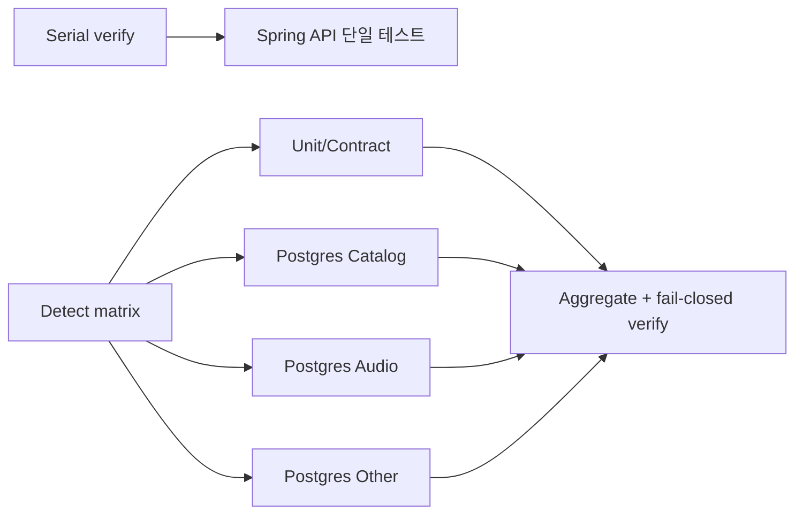

# Issue #465 Spring API 테스트 shard benchmark 보고서

측정일: 2026-09-29 · 대상: `OnMaru-backend` · Issue: [#465](https://github.com/YRootLab/OnMaru-backend/issues/465)

## 결론

구현은 완료됐다. Spring API 테스트 97개를 unit/contract 63개, PostgreSQL catalog 4개, PostgreSQL audio 5개, PostgreSQL other 25개로 나누고, 모든 shard 성공을 요구하는 fan-out/fan-in 및 모니터링 증거(CPU, peak RSS, wall-clock)를 추가했다. 동일 SHA에서 성공한 후보 3회의 critical path 중앙값은 411.62초로 serial verify job 중앙값 470초보다 58.38초(12.42%) 짧았다. 다만 serial verify job과 후보 benchmark critical path는 측정 경계가 다르며, 후보 workflow 전체 wall-clock 중앙값은 725초였다. 따라서 “전체 CI가 12.42% 개선됐다”고 확정할 수 없고, 현재 판정은 `inconclusive`다. 실제 required CI의 동일 경계 wall-clock을 추가 측정해야 최종 성과를 확정할 수 있다.

## 측정 범위와 증거 품질

| 구분 | 표본 | SHA / runner | 명령·경계 | 품질 |
|---|---:|---|---|---|
| 변경 전 serial baseline | 3회 성공 | `764c2c1`, `ubuntu-latest`, locked | 기존 `ci.yml` verify job | 유효, Actions API에서 queue/resource 일부 미제공 |
| 변경 후 candidate | 3회 성공 | `9f3b34d`, `ubuntu-latest`, locked | Module Benchmark 16-module matrix | 유효, CPU/RSS 있음, queue 없음 |
| 제외 실행 | 1회 취소 | `791497c` | 테스트 계약 수정 후 자동 실행 | SHA가 달라 성능 비교에서 제외 |

근거 artifact는 [serial baseline](../benchmark/evidence/issue-465/serial-baseline.json)과 [candidate runs](../benchmark/evidence/issue-465/candidate-runs.json)이며, 원시 로그와 secret은 저장하지 않았다. 실행 링크는 [candidate 1](https://github.com/YRootLab/OnMaru-backend/actions/runs/36511784017), [candidate 2](https://github.com/YRootLab/OnMaru-backend/actions/runs/36512788117), [candidate 3](https://github.com/YRootLab/OnMaru-backend/actions/runs/36512792006)이다.

## 변경 전후 구조

변경 후 shard 분류는 fail-closed다. 분류되지 않는 테스트가 생기면 inventory 검증이 실패하며, aggregate는 shard 실패·취소·누락을 성공으로 간주하지 않는다. 전체 suite를 대체하지 않고, 각 shard의 합집합이 97개임을 inventory artifact로 고정했다.

## 실제 시간과 critical path

### Serial baseline

| 지표 | 샘플(초) | median | max observed |
|---|---:|---:|---:|
| verify job wall-clock | 469, 470, 510 | 470 | 510 |
| Spring API step wall-clock | 301, 294, 302 | 301 | 302 |

### Candidate 전체 실행

| 실행 | workflow wall-clock(초) | critical path(초) | sum work(초) | 결과 |
|---|---:|---:|---:|---|
| 36511784017 attempt 2 | 725 | 410.76 | 1,996.64 | success |
| 36512788117 | 652 | 411.62 | 1,983.45 | success |
| 36512792006 | 791 | 504.42 | 2,135.65 | success |
| **median** | **725** | **411.62** | — | 3/3 success |

`critical path`는 16개 module job의 wall-clock 최대값이다. 후보 workflow 전체 wall-clock에는 matrix 대기, aggregate, verify, summary가 포함되며, reusable aggregate가 제공한 workflow field가 없어 Actions run timestamps로 계산했다. Queue time은 baseline과 candidate 모두 공통 API에서 신뢰성 있게 얻지 못해 `미측정`이다.

### Spring API shard별 시간

| shard | 테스트 수 | 3회 샘플(초) | median(초) | max(초) |
|---|---:|---:|---:|---:|
| unit-contract | 63 | 157.95, 168.11, 157.88 | 157.95 | 168.11 |
| postgres-catalog | 4 | 211.88, 217.89, 203.19 | 211.88 | 217.89 |
| postgres-audio | 5 | 179.02, 173.86, 189.64 | 179.02 | 189.64 |
| postgres-other | 25 | 410.76, 411.62, 504.42 | 411.62 | 504.42 |

`postgres-other`가 세 회 모두 critical path를 결정했다. 3회 모두 exit code 0이며 candidate 실패율은 0/3 run, 0/12 Spring shard execution이다. CPU/RSS evidence는 candidate에 대해 사용 가능했고, `postgres-other`의 CPU 중앙값은 7.19초, peak RSS 중앙값은 약 158.5 MiB였다. baseline은 Actions API만으로 CPU/RSS를 복원할 수 없었다.

## 변경 효과와 해석

| 비교 | 계산 | 결과 | 판정 |
|---|---|---:|---|
| serial verify job median → candidate critical path median | `(411.62 - 470) / 470` | **-12.42%** | 참고용 proxy, 최종 CI 개선률 아님 |
| serial Spring API step median → candidate critical path median | `(411.62 - 301) / 301` | **+36.75%** | Spring API 단독 경계에서는 개선 미확인 |
| candidate run 전체 wall-clock | 725초 median | baseline과 직접 비교 불가 | 경계 불일치 |

따라서 관측 사실은 “병렬 matrix의 최대 shard는 첫 두 회차에서 약 411초였고, 세 번째에는 504초까지 흔들렸다”이다. 병목 원인이 테스트 자체인지, Testcontainers/PostgreSQL 초기화인지, runner contention인지까지는 현재 evidence만으로 단정하지 않는다. `postgres-other`가 가장 긴 것은 관측 사실이며, 외부 서비스나 runner contention이 원인이라는 표현은 추론이다.

## 실패(failure)·취소·환경 차이

- baseline 3회와 candidate 3회는 모두 성공 표본이다. 실패율 계산에서 제외할 실패 표본은 없다.
- `791497c`에서 자동 실행된 후보는 테스트 계약 수정으로 SHA가 달라졌고, 별도 실행은 취소했다. 성능 비교에 포함하지 않았다.
- baseline cache state는 `unknown`, queue/CPU/RSS는 unavailable이다. candidate cache도 완전한 cache identity를 얻지 못했지만 CPU/RSS evidence는 artifact에 있다.
- candidate aggregate의 `workflow_wall_clock_seconds`는 비어 있어 run timestamps로 보완했다. 이 보완값은 전체 CI required check의 동일 경계 측정값이 아니다.
- 표본 수가 3개뿐이므로 p95는 안정적인 통계량으로 보고하지 않고 max observed를 함께 제시했다.

## 모니터링과 재현 계획

다음 required CI 실행에서 동일 SHA·runner label·dependency lock·cache 정책으로 serial verify와 shard matrix를 각각 5회 이상 수집한다. 각 run에 대해 queue, job wall-clock, critical path, sum work, failed/cancelled/missing artifact, CPU seconds, peak RSS를 함께 저장한다. 판정 기준은 다음과 같다.

1. 동일 경계의 candidate critical path median이 serial verify median보다 15% 이상 낮고, 5회 모두 성공하면 “성능 개선 확정”으로 승격한다.
2. `postgres-other`가 critical path의 90% 이상을 계속 차지하면 해당 테스트군을 데이터 fixture 또는 테스트 격리 단위로 재분할한다.
3. 실패율이 0이 아니거나 artifact 누락이 있으면 개선률을 계산하지 않고 fail-closed 원인부터 해결한다.
4. 전체 workflow wall-clock을 목표 지표로 삼는다면 reusable workflow 안에서 run 시작부터 summary 완료까지를 공식적으로 export하도록 후속 변경한다.

검증 결과: backend Node 테스트 122개 통과, 로컬 Spring shard 4개 모두 성공, toolkit 검증 161개 통과(coverage 91%)이다.
