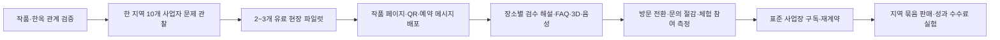

# 온마루 사업성·VC 관점 평가

재평가일: 2026-10-07 · 관련 Issue: [#673](https://github.com/YRootLab/OnMaru-backend/issues/673) · 대상: [공개 사이트](https://www.onmaru.site/)

## Executive Verdict

**Selected Mode: VC REVIEW (Auto-inferred)** · **Stage: MVP** (대안: 공개 프로토타입; 사용자·결제 증거는 확인되지 않음) · **Provisional Venture Score: 36/100** · **Evidence Confidence: LOW** · **Decision: REVISE**

**Business viability:** 작품 속 한옥을 찾는 방문자에게 검증된 장소·현장 해설을 제공하고, 운영자·지역 기관이 그 방문·문의 성과에 지불하는 경로는 시험할 가치가 있다. **Investability:** 현재 공개 정보만으로 VC가 투자할 사업이라고 말하기 어렵다. 웹 서비스와 K-콘텐츠 조사 코드가 있다는 사실과 방문자 전환·반복 계약 사이가 비어 있다. 낮은 점수는 팀의 능력을 단정한 것이 아니라 **가격·획득·유지·마진의 관찰 증거가 없음**을 반영한다.

평가 자료는 2026-10-02 공개 홈·한옥마루 화면, 2026-10-07 [공개 한옥 목록 API](https://api.onmaru.site/api/v1/hanoks)와 [K-콘텐츠 API](https://api.onmaru.site/api/v1/hanoks/screen-hanok), 저장소의 여정·RAG·K-콘텐츠 설계다. 공개 API는 한옥 목록 `totalCount: 1096`, `HANOK` 208건, 스크린 속 한옥 `total: 0`을 반환했다. 팀이 제시한 한옥 관련 원천 **약 1만 건**은 추출·중복 제거 기준이 미확인이고 게시 건수와 다르다. FE 개발 브랜치의 K-콘텐츠 fallback은 운영 데이터 성과로 보지 않는다. 온마루의 매출, MAU, 전환율, 사업자 계약, 고객 인터뷰는 제공되지 않았으며 **Unknown**이다. 공개 화면의 추천 오분류·검색형 예약 연결 등은 [별도 공모전 평가](2026-10-07-onmaru-tourism-contest-review.md)에 증거와 함께 기록했다. 제안하는 사업 아이디어는 관찰된 매출이 아니라 **검증 가설**이다.

**범용 여행 일정 생성은 주력 사업 가설에서 제외한다.** 국문 TourAPI 전체 소개의 약 26만 건은 한옥 일정에 필요한 장소 밀도나 최신 운영·재고·예약 정보의 충족률이 아니다. 사용자가 앞서 언급한 약 6만 건의 범위도 미확인이다. 일정의 완전성은 총량보다 타깃 지역·카테고리의 누락률과 운영 정보 품질에 달린다. [국문 관광정보 API 설명](https://www.data.go.kr/data/15101578/openapi.do)

## Venture Thesis와 고객을 좁히는 선택

현재 메시지는 `한옥 관광객에게 맞는 일정을 만들어준다`에 가깝다. 그러나 전국 숙박·음식·관광 명소의 완전한 목록, 실제 예약 가능 여부, 운영 시간, 이동 제약을 보장하기 어렵다. 지도·범용 LLM과도 비교해야 한다. 검증 가능한 사업 명제로 바꾸면 다음과 같다.

> **가설:** K-드라마 작품으로 유입한 방문자가 검증된 실제 한옥을 선택해 현장 해설·체험으로 이어지면, 한옥 스테이·고택 체험 운영자는 해당 장소의 검수된 도슨트와 방문 유입 도구를 예약 안내·현장 QR에 붙이고, **실제 방문·체험 문의 증가 또는 반복 응대 시간 절감**이 확인될 때 사업장 단위 월 사용료를 지불한다. 가격과 효과 크기는 미확인이다.

첫 구매자 후보는 전국 관광객 전체가 아니라 **예약 후 현장 안내 문의가 반복되거나 실제 방문 유입을 원하는 한 지역의 한옥 운영자**다. 작품을 보고 장소를 찾는 방문자는 사용자, 운영자는 구매자다. 지역 관광기관의 지역별 라이선스는 두 번째 구매자 가설이다. 이 구분이 없으면 콘텐츠 조회와 사업 매출을 혼동하게 된다. [한옥마루의 현재 스테이 접점](https://www.onmaru.site/hanok)

### 세 방향의 사업성 비교

| 방향 | 장점 | 핵심 제약 | 판단 |
|---|---|---|---|
| 전국 AI 일정 생성 | 유입 메시지가 쉽다. | 장소·운영·예약 데이터의 빈틈을 숨기기 어렵고 지도·범용 AI와 정면 경쟁한다. | **주력에서 제외** |
| 방문자용 한옥 현장 도슨트 | 기존 3D·Odii·RAG와 잘 맞고 범위를 장소별로 검수할 수 있다. | 개인의 방문 빈도가 낮고 직접 과금이 불명확하다. | **제품 가치 검증** |
| K-콘텐츠→검증 한옥→현장 해설 | 팬 관심을 실제 장소 탐색으로 유입시키는 독특한 입구다. | 작품–장소 관계 검증·콘텐츠 권리·팬 유입 비용과 실제 방문 전환이 미확인이다. | **획득 경로 실험** |
| 운영자용 장소별 도슨트 위젯 | QR·예약 안내로 배포할 수 있고 문의 절감이라는 구매 이유를 시험할 수 있다. | 콘텐츠 검수·사업자 영업·재계약 비용을 증명해야 한다. | **첫 유료 가설** |

## Venture Scorecard — 분석용 잠정 점수

| 영역 | 배점 | 점수 | 높은 점수의 이유 / 낮은 점수의 이유 |
|---|---:|---:|---|
| Market & Problem | 24 | **13** | 팬의 작품 장소 탐색과 현장 해설·반복 문의의 마찰은 이해 가능하지만 문제의 빈도·비용·지불자를 특정한 증거가 없다. |
| Product & Advantage | 17 | **8** | 3D·오디오·자연어 해설 결합은 보인다. 작품 관계는 운영 API 0건이므로 아직 가산하지 않았다. 답변 신뢰, 독점 데이터·유통도 없다. |
| Business Engine | 31 | **7** | 스테이·체험·지역 기관으로 연결 가능한 접점은 있다. 과금, CAC, 재계약, 변동비, 거래 성사가 모두 미검증이다. |
| Evidence & Execution | 20 | **5** | 공개 제품과 백엔드 설계·안전 계약은 제작 증거다. 고객 행동·유료 파일럿·빠른 실험 학습 자료는 없다. |
| Venture Return | 8 | **3** | 여러 지역 운영자에게 반복 판매할 가능성은 있다. 소수 한옥의 수작업 큐레이션이라면 투자 규모의 수익이 나오기 어렵다. |
| **총점** | **100** | **36** | **0–39 구간의 미검증 사업 가설. 점수의 불확실성은 높음.** |

### 세부 차원별 감점 근거

증거 수준은 E0 가설, E1 의견, E2 실제 기존 행동·지출, E3 가입·예약, E4 보증금·LOI·파일럿, E5 결제·반복 사용·재계약이다. 아래 `미확인`은 자료가 없다는 뜻이지 실제로 존재하지 않는다는 뜻이 아니다.

| 세부 차원 | 점수/배점 | 증거·확신 | 이유와 점수를 바꿀 자료 |
|---|---:|---|---|
| Problem Severity | 4/8 | E0·낮음 | 장소별 현장 해설 수요는 가능성이 있으나 운영자의 실제 반복 응대 시간·기회 손실 기록이 없다. |
| Customer Clarity | 3/5 | E0·낮음 | 한옥 관심층은 보인다. 첫 유료 구매자·구매 시점·예산을 인터뷰로 확인해야 한다. |
| Market Potential | 3/7 | E0·낮음 | 한옥에서 문화유산·지역 체험으로 확장할 수 있으나 유료 구매자 수와 반복 지출 범위가 없다. |
| Timing | 3/4 | E0·중간 | 관광 공공데이터와 생성형 AI 결합의 구현 가능성은 보인다. 구매가 지금 늘어나는지는 미확인이다. |
| Solution / Value | 3/5 | 제품 관찰·중간 | 장소·소리·3D 설명을 엮는 경험은 있다. 시간 절감·체험 참여 증가로 환산되지 않았다. |
| Differentiation | 4/7 | 제품 관찰·중간 | 한옥 특화 UI·3D는 구별된다. 추천 오분류가 신뢰 기반 차이를 약화한다. |
| Defensibility | 1/5 | E0·낮음 | 공공 API와 범용 LLM만으로는 복제 장벽이 낮다. 지역 운영자 공급망·검수 데이터·배포 채널이 쌓여야 한다. |
| Monetization | 2/7 | E0·낮음 | 월 사용료·예약 수수료 등은 가능한 가설이다. 유료 제안·결제 사례가 없다. |
| Unit Economics | 0/6 | 미확인·낮음 | 모델 호출, 콘텐츠 검수, 사업자 온보딩, 지원·환불 비용을 알 수 없다. |
| GTM | 1/7 | 미확인·낮음 | 첫 10개 운영자에 접근할 명단·소개 경로·응답률이 제시되지 않았다. |
| Retention | 1/5 | 미확인·낮음 | 여행자는 저빈도 방문자일 수 있다. 운영자 재계약·예약 후 반복 접점이 더 적절한 지표다. |
| Scalability | 3/6 | E0·낮음 | 소프트웨어 복제는 가능하다. 각 지역의 장소·해설·영업을 사람 손으로 반복하면 확장 이익이 사라진다. |
| Traction / Evidence | 0/10 | 미확인·낮음 | 공개된 작품 유입·검증 장소 클릭·현장 QR 진입·질문 완료·유료 계약의 분모 있는 코호트가 없다. |
| Founder / Team | 3/6 | 제품 관찰·낮음 | 제품·백엔드 제작 역량은 보인다. 문화관광 도메인 접근성과 영업 능력은 미확인이다. |
| Execution | 2/4 | 제품·문서 관찰·낮음 | 공개 서비스 제작은 확인된다. 고객 가정을 얼마나 빨리 검증하고 바꿨는지는 자료가 없다. |
| Return Potential | 3/8 | E0·낮음 | B2B2C 공급망으로 커지면 상향 가능하다. 현재 B2C 콘텐츠 포털 상태로는 벤처 규모를 주장하기 어렵다. |

세부 점수는 상위 영역 합계와 일치한다. 제품과 기술의 완성도를 낮게 본 것이 아니라 **사업 고리의 증거가 더 약한 상태**다. 이전 평가와 같은 36점인 이유는 약 1만 건의 원천과 K-콘텐츠 구현 계획이 아직 공개된 검증 관계·고객 행동·매출 증거로 바뀌지 않았기 때문이다. API 0건은 제품 감점 요인이지만 현재 점수의 더 큰 제약은 Business Engine과 Traction에 있다.

## Investment Thesis와 Bear Case

**투자 찬성 논리.** 작품→실제 장소→현장 해설의 검증된 관계망이 생기면, 온마루는 팬의 관심을 한옥 방문으로 옮기는 유입 경로와 운영자 체크인·예약 접점을 동시에 가질 수 있다. TourAPI·Odii는 장소와 오디오의 공통 기반이고, 운영자가 확인한 건축·운영 정보와 자주 받은 질문이 장소별 신뢰 자료가 된다. 한 지역에서 `검증된 방문 유입 + 응대 시간 절감 + 체험 참여 증가`가 유료 파일럿으로 확인되면 문화유산·숙박·체험 사업자와 지역 관광기관으로 확장할 소프트웨어 가능성이 있다. **조건부 가설**이다.

**가장 강한 반대 논리.** 팬은 이미 검색·SNS·지도에서 촬영지를 찾고, 운영자는 안내문·직원 응대로 질문을 처리한다. 공공 데이터와 LLM은 경쟁사가 접근하기 쉬우며, 작품 지식재산권·사진/영상 사용권은 별도 문제다. 공개 API에는 K-콘텐츠 관계가 0건이고 한옥 분류도 오염돼 있다. 작품별 관심이 일회성이라 획득 비용이 높고, 장소별 사실 검수와 파트너 관리가 매출에 비례해 늘 수 있다. 작은 한옥 사업자별 월 과금만으로는 CAC와 지원비를 감당할지도 불확실하다. 이 상태에서 VC가 요구하는 큰 수익 가능성을 설명하기 어렵다.

**Positive Signals:** (1) 공개 사용 가능 제품, (2) 한옥 테마의 일관성과 3D·오디오 자산, (3) TourAPI·Odii를 결합할 구현 경로, (4) 후보 제한·출처·RAG 평가를 고려한 내부 설계. 모두 **제품·실행 신호**이며 유료 수요 증거는 아니다.

## Investment Killers — 먼저 해결할 세 가지

| 위험 | 현재 자료 | 왜 치명적인가 | 해결 증거와 실패 시 결정 |
|---|---|---|---|
| **지불자·구매 이유 부재** | 사이트에는 소비자 가치만 있다. 유료 운영자·기관 자료 없음. | 사업의 첫 거래가 성립하지 않는다. | 10개 적격 사업자에게 현재 응대 업무·지출을 확인하고 가격이 보이는 유료 파일럿을 제안한다. 무관심이 반복되면 운영자 과금 논리를 수정한다. |
| **작품–장소·답변 신뢰 부족** | 공개 분류에 비관련 장소가 있고 K-콘텐츠 API는 0건. 현재 ADR은 출처 URL이 있어도 장소 오매칭 위험을 인정한다. | 허위 촬영지 또는 틀린 공간 해설은 팬과 운영자의 신뢰를 동시에 잃는다. | 작품 관계·장소 동일성·현장 답변을 각각 표본 감사한다. 교정 비용이 과도하면 공개 범위와 답변 주제를 좁힌다. [ADR-0010](../decisions/0010-screen-hanok-ai-auto-publish-without-review.md) |
| **수작업 확장 비용** | 콘텐츠·운영자 데이터의 온보딩 단가 미확인. | 매출 증가가 사람 노동 증가에 묶이면 VC 수익이 어렵다. | 사업장당 최초 설정·월 갱신·지원 시간을 기록하고 지역 2곳에서 재현한다. 비용이 높으면 소프트웨어 구독보다 서비스·기관 프로젝트로 포지셔닝한다. |

## 어디에서 돈을 벌 수 있는가 — 선택지와 권장 순서

| 모델 | 지불자·과금 단위 | 온마루가 팔 결과 | 검증 난점 | 우선순위 |
|---|---|---|---|---|
| **운영자용 장소 도슨트 위젯** | 한옥 숙소·고택 체험 사업자 / 사업장 월 구독 + 선택적 초기 설정비 | 체크인·현장 QR에서 검수된 건축·문화 해설과 FAQ, 체험 문의로 연결 | 구매자 예산, 사실 검수, 실제 문의 감소 | **1** |
| **작품 연계 방문 유입 상품** | 한옥 체험 운영자 / 검증된 방문·체험 문의 또는 캠페인 기간 과금 | 작품 검색 유입을 검증 장소·현장 해설·체험으로 연결 | 팬 유입 규모와 실제 방문 귀속, 작품 명칭·이미지 사용권, 유료 성과 | **1과 병행 실험** |
| **지역 묶음 라이선스** | 관광재단·RTO·지자체 또는 지역 운영 조직 / 지역·기간 계약 | 공공 문화유산의 접근 가능한 해설과 집계형 이용 보고 | 조달·판매 주기 길고 맞춤 제작 유혹 큼 | **2**, 유료 운영자 사례 이후 |
| **검증된 장소 관계 데이터/위젯 라이선스** | 관광 플랫폼·지역 매체 / API 또는 위젯 사용 계약 | 작품–실제 장소–원문 근거 관계와 정정 이력 | 제3자 자료의 재사용권, 충분한 커버리지와 정확도, 구매자 존재 | **옵션**, 품질 확보 후 |
| **체험 성과 수수료** | 체험 공급자 / 확인된 전환 건 | 해설 중 실제 체험 신청으로 연결 | 재고·환불·귀속·권리·수수료 계약 필요 | **3**, 전환 추적 후 |
| **관광객 유료 심화 해설** | 방문자 / 장소별 유료 콘텐츠 | 현장 음성·깊은 해설 | 무료 대안과 저빈도 이용 때문에 지불 의향 불확실 | 실험만, 주력 BM 아님 |

### 신선한 킥: ‘팬의 관심을 검증된 한옥 방문으로 전환하는 도슨트’

방문자가 K-드라마 작품에서 장소를 찾으면 온마루는 **검증된 실제 한옥·원문 출처**를 제시한다. 사업자의 예약 안내와 현장 QR에 이어지면 앱 설치 없이 `현재 장소 확인 → 처마·마루·역사 질문 → 근거 답변 → 3D·Odii 감상 → 체험 문의`를 할 수 있다. 사업자는 **작품 유입과 장소별 디지털 도슨트**를 함께 얻는다. 전국의 숙박·음식점·명소를 한 번에 일정으로 엮을 필요가 없다. `[가설]`

이 아이디어가 돈이 될 가능성은 ‘AI가 설명한다’가 아니라 **운영자의 유료 성과**에 있다. 작품에서 온 방문자의 실제 길찾기·현장 진입·체험 문의 또는 반복 전화·메시지 문의 감소를 운영자가 직접 확인할 수 있어야 한다. 작품명은 사실 설명 범위에서 다루되 스틸컷·포스터·영상·음원·사진의 상업 재사용 권리는 각각 확인한다. 공공데이터 자체를 독점 자산이나 판매 가능한 원천 데이터로 주장하지 않는다.

### K-콘텐츠 데이터가 사업 자산이 되는 조건

`TourAPI 고유 장소 → 한옥 적합성 판정 → 작품 후보 검색 → 원문이 실제 촬영 관계를 지지하는지 검증 → 작품·장소 관계와 출처/확인일 저장 → 운영자 사실 보강 → 방문자 행동 → 유료 성과`가 하나의 파이프라인이다. TourAPI는 **장소 식별·위치·기본 관광정보**에, 외부 검증 출처는 **작품–장소 관계**에 기여한다. LLM은 후보 추출·구조화·요약·다국어 설명을 돕되 사실 관계의 최종 근거가 아니다. [ADR-0010](../decisions/0010-screen-hanok-ai-auto-publish-without-review.md)

해자는 공공 원천 1만 건 자체가 아니라 **정확한 관계, 정정 이력, 운영자 확인 정보, 배포 채널, 방문·체험 성과의 누적**에서만 생긴다. 공개 API가 현재 0건이므로 이것은 미래 자산 가설이다. 기존 [#603](https://github.com/YRootLab/OnMaru-backend/issues/603)의 증분 조사·복수 출처·누적 저장 방향은 비용과 데이터 소실 위험을 줄일 수 있으나, **100개 장소·150개 연결 목표만으로 구매 수요를 증명하지는 못한다.**

K-pop을 같은 출시 묶음에 넣기 전에 뮤직비디오 촬영, 공연장, 콘셉트 사진, 단순 영감 장소를 구분하고 실제 한옥 연결의 조사 후보 대비 비율을 측정한다. 초기는 K-드라마의 검증된 소수 장소가 더 관리 가능한 실험이다. K-콘텐츠가 유입을 늘려도 저작권 비용·검수 인건비·계절적 트래픽이 마진을 잠식하면 VC 관점의 확장성은 낮다.

### 사업화 파이프라인

**첫 10곳:** 한 지역의 한옥 숙박·체험 사업자를 직접 만나 최근 한 달 문의 유형과 현재 지출을 본다. 검증된 작품 장소가 있는 곳과 없는 곳을 구분해 작품 유입의 추가 효과를 분리한다. 운영자가 자사 고객에게 QR·메시지를 배포해 주는 조건의 유료 파일럿을 제안한다. **첫 100곳:** 같은 지역 운영자 협회·예약 솔루션·관광 조직에 표준 위젯을 제휴 제안한다. 첫 10곳의 경제성이 확인되기 전엔 제휴 채널을 확장하지 않는다. **첫 1,000곳:** 타 지역 파트너가 장소·운영 정보·해설을 셀프 등록하고 검수되는 도구, 예약 시스템 연동, 지역별 품질 운영이 필요하다. 이는 현재 달성 단계가 아니라 확장 조건이다.

단위경제는 `사업장당 월 매출 − 검색·LLM·호스팅 비용 − 원문 검증·콘텐츠 권리 비용 − 결제·지원 비용 − 온보딩/검수 인건비 배분 − 영업비 배분`으로 계산한다. 별도로 `CAC 회수기간 = 사업장 획득비 / 월 기여이익`을 본다. 작품 유입 캠페인은 `검증된 현장 방문 또는 체험 문의 1건당 총 획득비`도 계산한다. **가격과 마진 수치는 미확인**이다.

## 증거 감사와 가장 약한 고리

| 구분 | 지금 말할 수 있는 것 |
|---|---|
| FACT | 공개 사이트에 한옥 도감·3D·오디오·자연어 입력이 있다. 관광 공공데이터 사용을 표시한다. 팀은 한옥 관련 원천 약 1만 건을 제시했다. |
| EVIDENCE | 2026-10-07 API는 한옥 목록 1,096건·`HANOK` 208건·K-콘텐츠 0건이다. 2026-10-02 화면에서 추천 오분류·0회 ‘인기’·검색형 예약 연결을 관찰했다. |
| INTERPRETATION | 특정 한옥의 검수된 현장 도슨트는 지도·일반 LLM과 다른 포지션이 될 수 있다. |
| ASSUMPTION | 팬이 검증 장소를 실제 방문하고, 운영자는 추가 방문이나 문의 절감에 돈을 낸다. 위젯 설치·검수 비용이 반복 매출보다 충분히 낮다. |
| UNKNOWN | 원천 1만 건의 중복·적합성·K-콘텐츠 연결 비율, 유입·현장 전환·유지·결제·사업자 계약·고객획득비·콘텐츠 권리·실제 RAG 정확도. |

`Problem → Pay/Switch → Acquisition → Delivery → Retention → Margin → Scale`에서 **Pay/Switch**가 현재 가장 약하다. ‘한옥이 좋다’나 ‘사이트가 예쁘다’는 결제를 증명하지 않는다. 두 번째 약점은 Delivery의 추천 정확성이다. 지불 의향이 확인돼도 추천이 틀리면 도입·재계약이 깨진다.

## 무엇이 점수를 바꾸는가

1. **운영자 10곳의 과거 행동 인터뷰:** 지난달 장소·건축·관람·체험에 관한 반복 문의 시간과 기존 안내 도구에 쓴 비용을 기록한다. `Problem Severity`, `Customer Clarity` 재평가.
2. **가격이 보이는 2~3곳 유료 파일럿:** 실제 결제·계약·QR 배포가 있어야 한다. ‘관심 있다’는 E1, 계약·결제는 E4~E5로 구분한다. `Monetization`, `Evidence`, `GTM` 재평가.
3. **최소 두 운영 주기의 반복 성과:** 운영자 재계약과 방문자의 질문 완료·음성 감상·현장 체험 문의를 분모와 함께 본다. `Value`, `Retention` 재평가.
4. **지역 두 곳의 설치 시간·비용:** 사업장별 설정 시간이 줄고 검수 품질이 유지돼야 한다. `Unit Economics`, `Scalability`, `Return` 재평가.
5. **비창업자 채널 유입:** 파트너 소개·예약 솔루션 제휴 등에서 획득비와 유료 전환을 확인한다. `GTM`, `Defensibility` 재평가.
6. **작품→장소 퍼널:** 검증된 작품 카드를 본 사람 중 실제 장소 확인·길찾기·현장 QR·체험 문의의 단계별 분자/분모를 기록하고 일반 한옥 카드와 비교한다. `Differentiation`, `Acquisition`, `Value` 재평가.

## 다음 검증 스프린트 — 3주, 작게 시작

| 항목 | 사전 등록할 실험 계약 |
|---|---|
| Risk | 한옥 운영자가 장소별 해설·반복 질문 응대에 돈을 내지 않을 수 있다. |
| Target / Recruitment | 한 지역의 실제 예약 운영 한옥 숙박·체험 사업자 10곳. 지인만으로 채우지 않고 규모·운영 형태를 기록. |
| Hypothesis | 적어도 일부 운영자는 장소 설명·반복 질문에 측정 가능한 시간을 쓰고, 온마루의 현장 도슨트 위젯을 유료로 시험한다. |
| Method / Offer | 과거 30일 문의 로그 인터뷰 → 실제 작품 관계가 검증된 한옥 5~10곳의 작품 카드와 한 시설용 QR 프로토타입 → **가격을 명시한** 4주 유료 파일럿 제안. 가격은 사업자 인터뷰와 원가를 보고 제안하며 시장 가격인 양 고정하지 않는다. |
| Primary metric / Denominator | 유료 파일럿 수 / 가격과 설치 범위를 설명받은 적격 사업자 수. 보조: 검증 장소 클릭 / 작품 카드 노출, 길찾기 / 장소 클릭, 현장 QR 진입 / 길찾기, 질문 완료 / QR 진입, 체험 문의 / 질문 완료, 문의 시간 변화 / 운영일. 채널과 기간을 기록한다. |
| Pass / Fail threshold | **팀 의사결정용 임시 기준:** 10곳 중 2곳 이상이 결제·배포까지 하면 다음 지역 검증. 0곳이고 공통 이유가 ‘문제가 없다’이면 B2B 가설 수정. 1곳이거나 구매 시기가 뒤라면 인터뷰·가격을 재설계. 이는 업계 표준 수치가 아니다. |
| Time / Cost cap | 3주. 검수 장소·해설을 한 지역 10곳 이내로 제한. 신규 범용 기능 개발은 중단. |
| Retain / Decision | 작품–장소 근거와 반려 기록, 인터뷰 메모, 제안 가격, 계약·결제 증거, 배포 여부, 문의 시간표, 익명 QR 행동 로그를 보관. 통과하면 표준 위젯·재계약 검증, 실패하면 유입 경로·고객군·지불 단위를 변경. |

## 결론과 결정 질문

**지금 가장 신선한 투자 논리는 ‘작품을 본 팬→검증된 실제 한옥→현장 해설·체험’ 관계망을 운영자와 지역 기관이 구매할 수 있는 방문 성과 도구로 만드는 것이다.** 이 경로는 공공데이터, 출처 검증, 한옥 해설, RAG, 3D·오디오 UI를 쓰되 전국 일정 데이터의 빈틈에 의존하지 않는다. 다만 지금은 투자 논리가 아니라 실험할 가설이다. 소규모 지역 콘텐츠 사업으로 성공할 가능성과 VC 투자 적합성도 분리해서 판단해야 한다.

다음 의사결정에 필요한 질문은 다섯 개다. **(1)** 작품–실제 한옥 관계를 얼마나 많이, 어느 정확도로 검증할 수 있는가? **(2)** 작품 유입이 실제 길찾기·현장 방문을 추가로 만드는가? **(3)** 한옥 운영자의 반복 문의·방문 유입에 얼마만큼의 경제적 가치가 있는가? **(4)** 틀린 장소·해설을 어떤 비용과 속도로 교정할 수 있는가? **(5)** 첫 지역의 결제·재계약이 창업자 직접 작업 없이 두 번째 지역에서 재현되는가?
