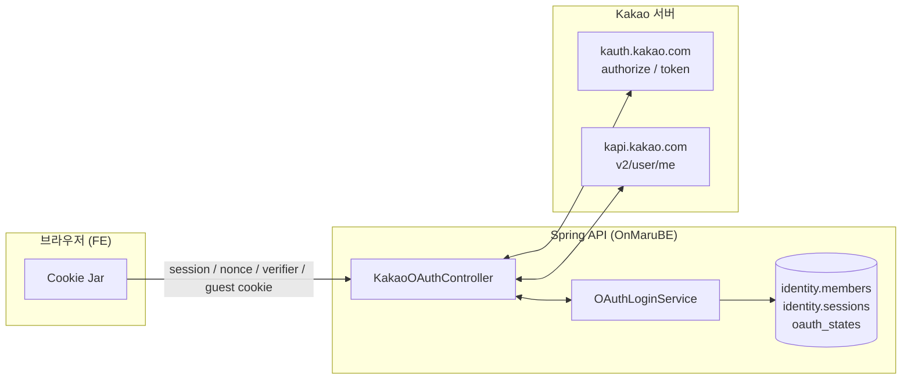
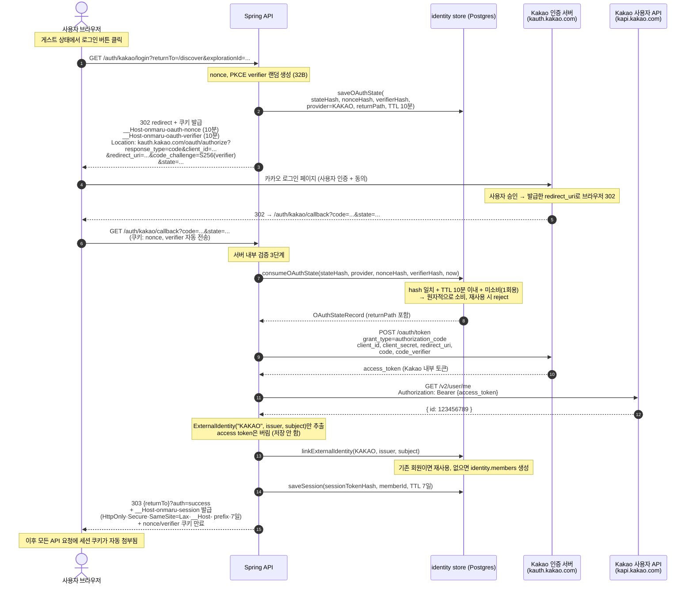
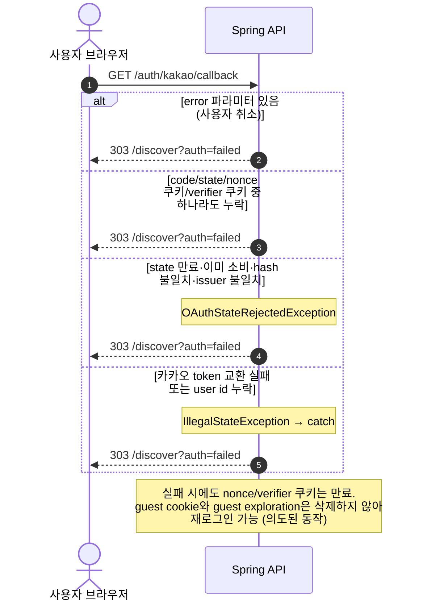
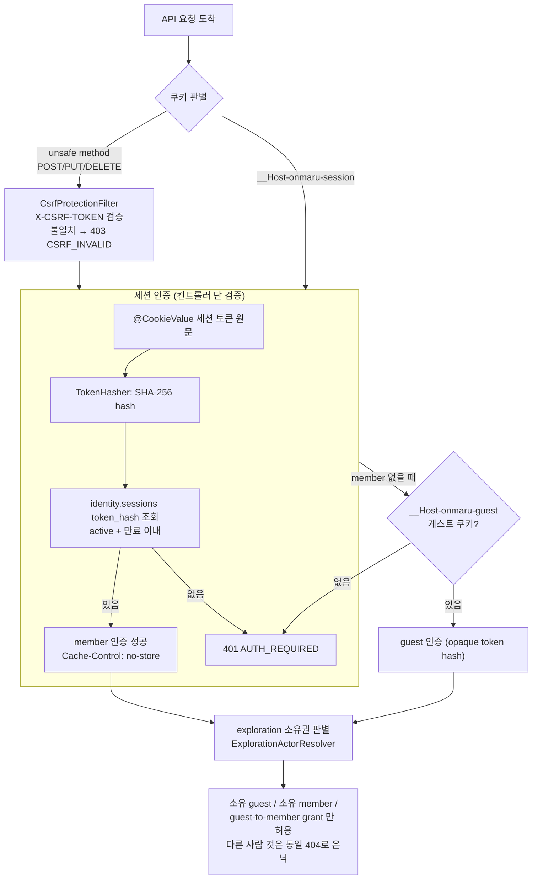
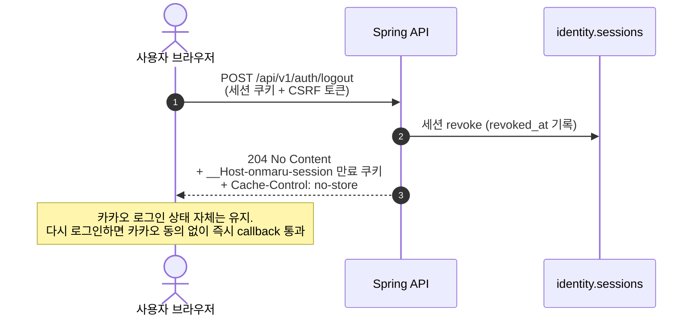
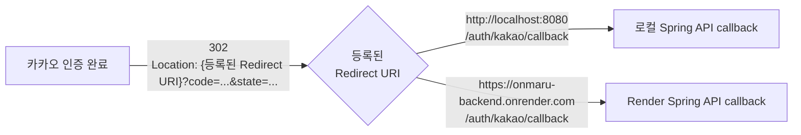
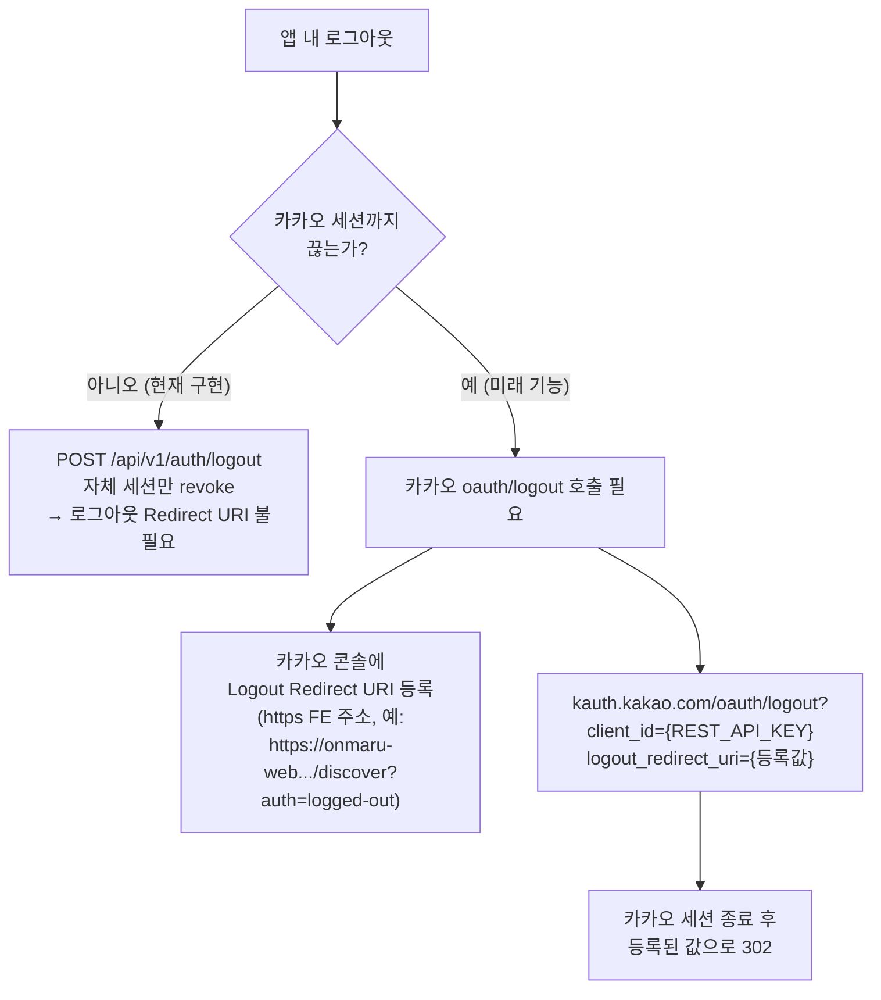

# Kakao OAuth 로그인·로그아웃 흐름

> 근거 코드: `apps/spring-api/src/main/java/com/yrootlab/onmaru/security/oauth/kakao/*`,
> `modules/identity/src/main/java/com/yrootlab/onmaru/identity/oauth/OAuthLoginService.java`
> 근거 문서: `docs/decisions/0008-opaque-session-guest-grant.md`,
> `troubleshooting-worklog/26.09.20 kakao-auth-authorization-flow.md`

---

## 1. 전체 구조 요약



핵심 결론 3가지:

1. **카카오 callback은 FE가 아니라 Spring API가 직접 받는다.** FE는 카카오 SDK나 authorize URL을 직접 조립하지 않고 `/auth/kakao/login`으로 이동만 한다.
2. **브라우저에는 Kakao access token을 절대 노출하지 않는다.** 카카오 토큰 교환은 서버 내부에서만 일어나고, FE가 받는 것은 opaque 세션 쿠키(`__Host-onmaru-session`) 하나뿐이다.
3. **DB에는 원문 토큰 대신 SHA-256 hash만 저장한다.** state·nonce·verifier·session 모두 hash 저장 + 1회 소비(consume) 구조다.

---

## 2. 로그인 전체 시퀀스 (Mermaid)



### 로그인 실패 경로



---

## 3. 로그인 이후 인증 처리 (Mermaid)




인가(authorization) 정책 요약:

| 리소스 | 요구 사항 |
|---|---|
| 공개 장소·지도·후기 조회 | 비회원 허용 |
| `GET /api/v1/members/me` | 유효한 member session |
| 저장(saved)·여정 저장·후기 작성 | member session + 리소스 정책 |
| cookie 기반 POST/PUT/DELETE | CSRF token (`GET /auth/csrf`로 발급) |
| exploration | 소유 guest·member·유효한 grant만 |
| 회원 탈퇴/로그아웃 | member session |

- FE는 Kakao subject·이메일을 식별자로 쓰지 않고, 응답의 `mine`·`likedByMe`·`savedByMe` 같은 서버 계산 플래그를 사용한다.
- 로그인 시 `explorationId`를 넘기면 게스트 탐색 소유권을 회원 grant로 이전(claim)할 수 있다.

---

## 4. 로그아웃 흐름 (Mermaid)

OnMaru의 로그아웃은 **카카오 세션을 끊지 않는다.** OnMaru 자체 세션만 무효화한다.



---

## 5. 카카오 개발자 콘솔에 등록해야 하는 값 (완전 상세)

> 앱 키: **Native 앱 키가 아니라 REST API 키**를 사용한다 (서버가 token 교환을 수행하므로).
> 등록 위치: [Kakao Developers](https://developers.kakao.com) → 내 애플리케이션 → 앱 설정.

### 5-1. Redirect URI 등록

경로: **내 애플리케이션 → 앱 설정 → 카카오 로그인 → Redirect URI**

Redirect URI는 **카카오 인가 코드를 돌려줄 목적지**이며, FE가 아니라 **Spring API의 callback 엔드포인트**를 등록한다.

| 환경 | 등록할 Redirect URI |
|---|---|
| Local | `http://localhost:8080/auth/kakao/callback` |
| Render (staging/prod) | `https://onmaru-backend.onrender.com/auth/kakao/callback` |



등록 시 반드시 지켜야 할 규칙:

1. **경로는 정확히 `/auth/kakao/callback`** — 컨트롤러 매핑과 1글자까지 동일해야 한다. (`/api/v1/auth/kakao/callback`으로 등록하면 실패한다. gateway prefix 정책이 확정되기 전까지는 `/auth/kakao/...`가 실제 경로다.)
2. **`http`/`https`, 포트, 마지막 slash까지 세 곳이 동일해야 한다.**
   - ① Kakao Developers에 등록한 URI
   - ② 서버 환경변수 `ONMARU_OAUTH_KAKAO_REDIRECT_URI`
   - ③ Spring이 authorize URL과 token 교환 form에 넣는 `redirect_uri` (같은 `KakaoOAuthProperties.redirectUri` 값)
3. Redirect URI는 **비밀값이 아니다** (노출돼도 안전). 비밀은 `client_secret`이며 env/secret provider로만 주입한다.
4. 환경마다 하나씩 **모두 등록**한다. localhost와 Render를 동시에 등록해도 된다.
5. FE 주소(예: `http://localhost:3000/auth/kakao/callback`)는 등록하지 않는다. FE는 callback을 처리하지 않는다. FE의 `NEXT_PUBLIC_KAKAO_REDIRECT_URI`는 폐기하고 로그인 시작 URL(`{API}/auth/kakao/login`) 또는 `NEXT_PUBLIC_API_BASE_URL`로 정리한다.

### 5-2. 로그아웃 Redirect URI 등록

경로: **내 애플리케이션 → 앱 설정 → 카카오 로그인 → 고급 설정 → 로그아웃 Redirect URI**

이 값은 **카카오 제공 로그아웃 엔드포인트**를 쓸 때만 필요하다:

```
https://kauth.kakao.com/oauth/logout?client_id={REST_API_KEY}&logout_redirect_uri={등록값}
```

카카오 세션을 완전히 끊어 "다른 카카오 계정으로 로그인"을 유도하고 싶을 때 사용한다. 등록 규칙:

1. **https만 허용** (localhost도 https면 가능, `http://localhost`는 등록 불가).
2. 등록하지 않은 값으로 `logout_redirect_uri`를 넘기면 카카오가 거부한다.
3. **OnMaru 현재 구현에서는 필수가 아니다.** `POST /api/v1/auth/logout`은 자체 세션만 revoke하므로 이 값이 없어도 동작한다. 등록이 필요해지는 시점은 "앱 내 로그아웃 시 카카오 계정까지 로그아웃" 기능을 추가할 때이며, 그때는
   - 백엔드가 `{API}/auth/kakao/logout` 같은 엔드포인트를 만들어 302로 `kauth.kakao.com/oauth/logout`에 보내거나,
   - FE가 `logout_redirect_uri`에 **FE 화면 주소**(예: `https://onmaru-web.onrender.com/discover?auth=logged-out`)를 등록해 그 URL로 이동시키는 방식이 된다.



### 5-3. 기타 필수 설정 체크리스트

| 항목 | 설정 위치 | 값 / 요건 |
|---|---|---|
| REST API 키 | 앱 키 | 서버 환경변수 `ONMARU_OAUTH_KAKAO_CLIENTID`로 주입 (`onmaru.oauth.kakao.client-id`) |
| Client Secret | 카카오 로그인 → 보안 (코드 생성 후 **Secret 사용 ON**) | 서버 환경변수 `ONMARU_SECRET_OAUTH_CLIENT_SECRET_CURRENT` (`SecretProvider.get("oauth.client-secret")`, runbook `docs/operations/runbooks/secrets.md`) |
| Redirect URI | 카카오 로그인 | 위 5-1 표 값 (환경별) |
| 호출 허용 IP 주소 | 앱 키 → REST API 키 | 비워둠 권장. Render outbound IP는 고정이 아니므로 allowlist 등록 시 배포 실패 위험 |
| 로그아웃 Redirect URI | 카카오 로그인 → 고급 | 카카오 로그아웃 기능 추가 시에만 (5-2) |
| 동의 항목 | 카카오 로그인 → 동의항목 | 현재 구현은 `/v2/user/me`의 `id`만 사용 → 이메일 등 추가 동의 불필요. 필요 시 추가 심사 |
| 플랫폼 (Web) | 플랫폼 | 서비스 도메인 등록은 redirect 검증 자체와 직접 연관 없으나 실서비스 도메인 등록 권장 |

배포 환경변수 요약:

```text
ONMARU_OAUTH_KAKAO_CLIENTID={REST API 키}
ONMARU_SECRET_OAUTH_CLIENT_SECRET_CURRENT={카카오 Client Secret}
ONMARU_OAUTH_KAKAO_REDIRECTURI=https://onmaru-backend.onrender.com/auth/kakao/callback
```

> 참고: 일부 문서에는 `ONMARU_OAUTH_KAKAO_REDIRECT_URI`로 표기돼 있지만, Spring Boot relaxed binding은 하이픈 제거 형태(`..._REDIRECTURI`)가 정규형이다. 배포 시 실제 바인딩 동작을 로그로 확인한다.


### 5-4. 설정 불일치 대표 오류

| 증상 | 원인 |
|---|---|
| `KOE006` / redirect mismatch | 콘솔 URI, `ONMARU_OAUTH_KAKAO_REDIRECT_URI`, 코드 내 `redirect_uri` 3곳 불일치 (http/https·포트·slash 포함) |
| `KOE010` client error | REST API 키 아님 (Native/JS 키 사용) 또는 secret 불일치 |
| callback 후 404 | 콘솔에 `/api/v1/...`로 등록했으나 실제 매핑은 `/auth/kakao/...` |
| 로그인 성공했는데 401 | `credentials: "include"` 누락, 쿠키 미발급, CORS credential allowlist 누락 |

---

## 6. 파일 위치 지도

| 역할 | 파일 |
|---|---|
| 로그인 시작·callback 웹 경계 | `apps/spring-api/.../security/oauth/kakao/KakaoOAuthController.java` |
| 카카오 token 교환·사용자 조회 | `apps/spring-api/.../security/oauth/kakao/RestClientKakaoOAuthClient.java` |
| OAuth 설정값 | `apps/spring-api/.../security/oauth/kakao/KakaoOAuthProperties.java` (`onmaru.oauth.kakao.*`) |
| state 검증·소비, member 연결, 세션 발급 | `modules/identity/.../identity/oauth/OAuthLoginService.java` |
| 이후 요청 인증 | `apps/spring-api/.../web/member/MemberLifecycleController.java` |
| guest/member actor 해석 | `apps/spring-api/.../web/exploration/ExplorationActorResolver.java` |
| CSRF·보안 헤더 | `apps/spring-api/.../security/web/*` |

## 7. 검증 명령

```bash
./gradlew :apps:spring-api:test --tests '*KakaoOAuthWebBoundaryTests' --no-daemon
./gradlew :modules:identity:test --tests '*OAuthLoginServiceTests' --no-daemon
```

