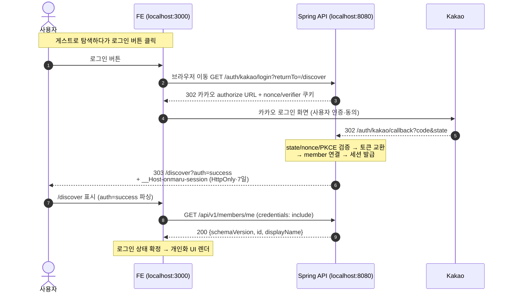
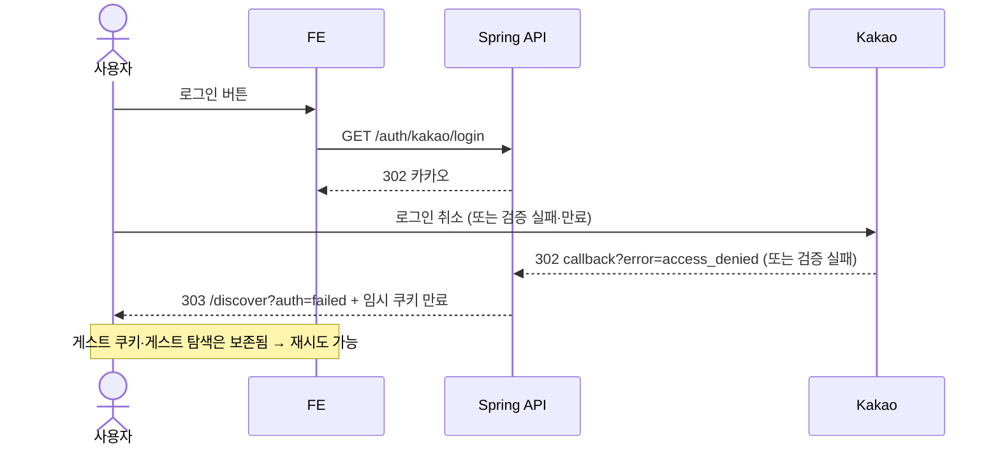

# FE 카카오 로그인 연동 가이드 (Kakao Login Flow for Frontend)

> 근거 코드: `apps/spring-api/.../security/oauth/kakao/KakaoOAuthController.java`
> 흐름 상세: `../spring/kakao-oauth-flow.md`
> 2026-09-21 로컬 end-to-end 검증 완료 (`auth=success` + 세션 쿠키 발급 실측)

## 0. 전제 — FE는 카카오와 직접 통신하지 않는다

FE는 카카오 SDK, JS 키, redirect URI를 **아무것도 다루지 않는다**. 카카오 authorize URL 조립, callback 수신, 토큰 교환, 세션 발급은 전부 백엔드가 한다. FE가 하는 일은 **"로그인 시작 URL로 브라우저를 옮기는 것" 하나**뿐이다.

기존 `NEXT_PUBLIC_KAKAO_*` 변수(JS 키, REDIRECT_URI, CLIENT_ID)는 모두 폐기 대상이다. FE `.env.local`에는 아래 하나만 있으면 된다:

```bash
NEXT_PUBLIC_API_BASE_URL=http://localhost:8080        # 로컬
# NEXT_PUBLIC_API_BASE_URL=https://onmaru-backend.onrender.com   # 배포
```

## 1. FE가 구현할 5가지

### 1-1. 로그인 버튼 → 로그인 시작으로 이동

```ts
const login = () => {
  window.location.href =
    `${process.env.NEXT_PUBLIC_API_BASE_URL}/auth/kakao/login?returnTo=/discover`;
};
```

- `returnTo`: 로그인 후 돌아갈 **내부 경로**(`/discover` 등). 외부 URL은 open redirect로 거부되므로 경로만 넘긴다.
- 로그인 전 게스트 탐색 상태를 회원으로 승계하려면 `&explorationId={uuid}`를 추가한다.

### 1-2. 복귀 감지: `?auth=` 파싱

콜백은 백엔드가 받고, 완료되면 `{returnTo}?auth=success|failed`로 브라우저를 돌려보낸다. FE는 랜딩 시 쿼리를 파싱한다:

```ts
const params = new URLSearchParams(window.location.search);
const auth = params.get("auth"); // "success" | "failed" | null

if (auth === "success") {
  // 세션 쿠키가 이미 발급돼 있음 → 이어서 프로필/개인화 데이터 로딩
} else if (auth === "failed") {
  // 안내 UI 표시. 게스트 상태는 보존되므로 바로 재시도 가능
  // (성공해도 게스트 탐색은 자동 저장되지 않음 — 보류했던 intent를 저장 API로 다시 호출)
}
```

### 1-3. 개인화 API 호출 — `credentials: "include"` 필수

```ts
fetch(`${API}/api/v1/members/me`, { credentials: "include" });
```

- 세션 쿠키는 **HttpOnly**라 JS로 읽을 수 없다. 로그인 상태 판단은 항상 `GET /api/v1/members/me` 응답으로 한다 (200 = 로그인, 401 = 비로그인).
- 식별자로 카카오 ID·이메일·provider subject를 사용하지 않는다. `mine`, `likedByMe`, `savedByMe` 등 서버 계산 플래그를 사용한다.
- 401 응답 본문: `{schemaVersion:"1.2", code:"AUTH_REQUIRED", message, requestId, details}` — FE는 `code`로 문구를 결정한다.

### 1-4. unsafe 요청(POST/PUT/DELETE) — CSRF 토큰

cookie 인증 요청에는 CSRF 토큰이 필요하다. 미리 발급받아 헤더로 실는다:

```ts
// 1) 앱 시작 시 1회 발급 (동시에 게스트 세션 쿠키도 발급됨)
const { csrfToken } = await fetch(`${API}/auth/csrf`, {
  credentials: "include",
}).then(r => r.json());

// 2) unsafe 호출에 헤더 첨부
fetch(`${API}/api/v1/auth/logout`, {
  method: "POST",
  credentials: "include",
  headers: { "X-CSRF-TOKEN": csrfToken, "Content-Type": "application/json" },
  body: JSON.stringify({}),
});
// CSRF 불일치 → 403 { code: "CSRF_INVALID" }
```

### 1-5. 세션 만료·로그아웃 처리

| 상황 | 동작 |
|---|---|
| 개인화 API에서 401 AUTH_REQUIRED | 세션 만료/부재 → 로그인 버튼 다시 노출 (자동 재시도 금지) |
| 로그아웃 | `POST /api/v1/auth/logout` → 204 + 쿠키 파기 → 비로그인 UI로 전환 |
| 회원 탈퇴 | `DELETE /api/v1/members/me` → 202 `{status: "DELETING"}` + 쿠키 파기 |

## 2. 전체 플로우 (Mermaid)



실패 시:



## 3. 환경별 값

| 항목 | 로컬 | 배포 (Render) |
|---|---|---|
| 로그인 시작 | `http://localhost:8080/auth/kakao/login` | `https://onmaru-backend.onrender.com/auth/kakao/login` |
| `auth=` 복귀 지점 | `http://localhost:8080{returnTo}?auth=...` | 백엔드 호스트 기준 (FE origin redirect는 백엔드 후속 작업, 아래 4 참고) |
| FE `.env.local` | `NEXT_PUBLIC_API_BASE_URL=http://localhost:8080` | `https://onmaru-backend.onrender.com` |
| 카카오 키 | FE 저장 불필요 | FE 저장 불필요 |

## 4. 알려진 제한 (배포 전 백엔드 후속 작업)

- 콜백 성공 redirect가 **상대경로**(`/discover?auth=success`)라, FE와 백엔드가 다른 호스트면 브라우저가 **백엔드 호스트**의 `/discover`로 이동한다. 배포 전에 백엔드가 FE origin allowlist를 기준으로 절대경로 redirect하도록 수정 예정(`troubleshooting-worklog/26.09.20 kakao-auth-authorization-flow.md` 참고). 로컬에서는 포트만 달라 같은 호스트라 문제없다.
- 개인화 응답은 `Cache-Control: no-store`다. FE 캐시에 개인 응답을 저장하지 않는다.

## 5. 백엔드 제공 Auth API 요약

| Method | Path | 용도 | 비고 |
|---|---|---|---|
| GET | `/auth/kakao/login` | 로그인 시작 → 카카오 302 | `returnTo`, `explorationId` |
| GET | `/auth/kakao/callback` | 카카오 code 수신 (FE가 호출하지 않음) | 완료 후 `{returnTo}?auth=` redirect |
| GET | `/auth/csrf` | CSRF 토큰 + 게스트 세션 발급 | unsafe 호출 전 발급 |
| POST | `/api/v1/auth/logout` | 로그아웃 (세션 revoke + 쿠키 파기) | CSRF 토큰 필요 |
| GET | `/api/v1/members/me` | 로그인 상태·프로필 조회 | 401 = 비로그인 |
| DELETE | `/api/v1/members/me` | 회원 탈퇴 접수 | 202 + 쿠키 파기 |
