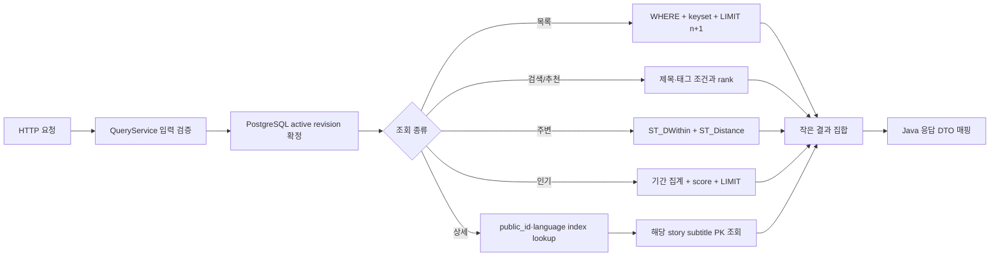

# [Deprecated historical environment] ODII 활성 리비전 조회를 PostgreSQL read model로 전환한 과정

> 이 문서의 Neon 저장공간/요금 및 Render 메모리 관련 판단은 deprecated된 과거 운영환경 기준이다. PostgreSQL query/read-model 설계 기록만 참고하고, 현재 운영 원본은 AWS PostgreSQL이다.

## 결론부터 말하면 리비전 전체를 Java에 올린 설계가 병목의 중심이었다

Issue #454의 운영 장애를 처음 완화할 때는 활성 ODII 리비전을 한 번 읽어 JVM에 캐시하는 방식으로 같은 revision을 요청마다 반복 적재하지 않게 했다. 이 변경은 “요청마다 6,205개 story와 6,069개 subtitle을 다시 객체화한다”는 가장 급한 중복 작업은 줄였지만, 조회 책임 자체는 여전히 잘못된 위치에 남아 있었다. 목록 12건, 상세 1건, 검색 20건, 주변 20건, 인기 6건을 응답하기 위해 활성 revision 전체를 먼저 Java 객체 그래프로 만드는 것은 PostgreSQL이 이미 제공하는 조건 검색, keyset pagination, 공간 검색, 기간 집계 능력을 포기하는 구조다. 캐시는 이 구조의 비용을 요청마다 한 번에서 revision마다 한 번으로 낮출 뿐, 불필요한 전체 전송과 대량 객체 생성을 제거하지 못한다.

이번 변경의 목표는 revision 개념을 제거하는 것이 아니다. revision은 외부 데이터 동기화의 원자적 게시, last-known-good 보존, 재현 가능한 응답, cursor 만료 판정에 반드시 필요하다. 바꾼 것은 revision의 사용 방식이다. Java가 revision 전체 내용을 소유하는 대신 PostgreSQL이 `catalog_active_datasets`에서 활성 `revision_id`를 먼저 확정하고, 같은 SQL 또는 같은 읽기 transaction 안에서 필요한 행만 필터링한다. Java에는 최종 응답에 필요한 최대 `limit + 1`개 projection 또는 상세 한 건과 그 자막만 전달한다.

## 관찰한 운영 데이터와 기존 실행 비용

운영 Neon을 읽기 전용으로 확인했을 때 활성 ODII revision은 `b3aaa083-dd67-418b-9bbf-4bae475f4ad6`이었고, 활성 snapshot 기준 story version은 6,205행, subtitle line은 6,069행이었다. 이 숫자 자체는 PostgreSQL에 부담스러운 크기가 아니다. 문제는 크지 않은 데이터라도 모든 웹 요청의 선행 조건으로 전체 조회하고, 네트워크로 전송하고, JDBC row를 domain object로 변환하고, 다시 Java stream으로 필터링했다는 점이다. 동시 요청 수가 늘면 같은 문자열과 컬렉션이 요청 수만큼 또는 cache miss 경합 수만큼 생겨 384 MiB Render JVM에서 GC와 메모리 압박으로 확대된다.

기존 full snapshot SQL을 `EXPLAIN (ANALYZE, BUFFERS)`로 확인한 cold read 결과는 다음과 같았다. spot 조회는 결과 2,095행에 실행 약 146.001 ms, shared buffer read 355였다. subtitle 조회는 결과 6,069행에 실행 약 936.377 ms, shared buffer read 6,552였고 parallel sequential scan에서 worker마다 약 2,023개의 비활성 revision 행을 제거했다. story/script 조회는 결과 6,205행에 실행 약 1,228.296 ms, shared buffer read 6,884였으며 worker마다 약 2,068개의 다른 revision 행을 제거했다. 세 쿼리의 DB 실행만 약 2.31초다. 여기에 Neon과 Render 사이 전송, 긴 script 문자열 디코딩, 수천 domain object와 transcript list 생성, region metadata 계산이 더해진다.

이 수치가 중요한 이유는 운영의 `/api/v1/home/popular-sounds`가 약 6.4~12.2초였던 현상을 설명하기 때문이다. 인기 6건을 만들면서 먼저 full snapshot을 복원하고, 6,205개 공개 story ID를 Java list로 만든 뒤 재생 수와 저장 수 집계에 각각 대형 `IN (?, ?, ...)`를 사용했다. 즉 결과 크기는 6건인데 후보 6,205건의 본문·자막과 ID 목록을 애플리케이션으로 왕복했다. 프론트의 10초 timeout은 CORS나 빈 DB 때문이 아니라 이 서버 실행 경로만으로도 충분히 발생할 수 있었다.

## 데이터 모델 진단: 정규화는 유지하되 공개 조회 키가 없었다

현재 ODII 모델의 identity/version 분리는 유지할 가치가 있다. `audio_odii_stories`와 `audio_odii_spots`는 공급자 식별자의 안정 identity이고, `audio_story_versions`, `audio_spot_versions`, `audio_subtitle_lines`는 revision에 종속된 게시 내용이다. 동기화 중인 staging revision과 현재 published revision을 동시에 보존하려면 이 정규화가 필요하다. 따라서 해결책은 version 테이블을 덮어쓰는 단일 최신 테이블로 되돌리는 것이 아니다.

문제는 HTTP가 노출하는 공개 story ID가 Java의 `UUID.nameUUIDFromBytes(provider + ':odii-story-:' + stid)`로 요청 시점에만 계산됐다는 점이다. 클라이언트는 `odii-story-<uuid>`를 보내지만 DB에는 그 UUID가 없으므로 상세 한 건을 곧바로 index lookup할 수 없었다. 애플리케이션은 전체 identity/version을 읽은 뒤 모든 공개 ID를 계산해 비교했다. 이것은 API 식별자가 데이터베이스 access path에 포함되지 않은 모델 결함이다.

V033에서는 Java UUID v3 생성 규칙과 byte 단위로 같은 immutable SQL 함수 `onmaru.java_name_uuid(text)`를 정의했다. MD5 digest의 version nibble을 3으로, variant bit를 RFC 4122 호환 값으로 설정한다. 실제 운영 예시 `KTO_ODII:odii-story-:1`에 대해 Java 결과와 SQL 결과가 `75f98acf-844c-3055-91e5-c2d1a3b50716`으로 같은 것을 확인했다. 그 함수를 사용하는 `public_id uuid GENERATED ALWAYS AS (...) STORED`를 spot/story identity에 추가하고 `(public_id, lang_code)` 복합 unique 탐색 index를 만들었다. 애플리케이션 계약의 ID를 바꾸지 않으면서 DB가 공개 ID와 요청 언어를 함께 직접 탐색할 수 있게 한 것이다.

운영 데이터에 대해 `(provider, stid)`와 `(provider, tid)` 중복 그룹 수가 모두 0인지 먼저 확인했지만, 전체 migration 회귀 테스트가 더 넓은 스키마 계약을 드러냈다. 현재 모델은 같은 `tid/stid`를 서로 다른 `tlid/stlid`와 언어로 저장하는 것을 의도적으로 허용한다. 따라서 운영 표본만 보고 `public_id` 단독 unique index를 두면 합법적인 다국어 identity insert를 막는다. 첫 전체 `check`가 바로 이 위반을 재현했고 index를 `(public_id, lang_code)` 복합 unique index로 고쳤다. 언어가 다르면 같은 공개 ID를 공유할 수 있지만, 동일 공개 ID·동일 언어가 둘 이상이면 API가 구분할 수 없으므로 DB가 거절한다. 공개 ID에 `stlid`를 임의로 섞으면 이미 FE가 저장한 ID가 바뀌기 때문에 그렇게 하지 않았다.

## 목록 조회: 전체 script가 아니라 keyset page만 읽는다

기존 목록은 active snapshot의 모든 story, spot, subtitle을 읽고 Java에서 공개 가능 여부, 언어, category, region, cursor 이후 여부를 차례로 필터링했다. 새 기본 목록 경로는 PostgreSQL CTE에서 dataset의 active revision을 하나 결정하고, 요청 언어에 공개 가능한 행이 하나라도 있으면 그 언어를, 없으면 `ko`를 선택한다. 이어 story/spot status, 좌표 존재, 게시 시각, audio URL, 허용된 HTTPS CDN host를 SQL `WHERE`에서 검사한다.

pagination은 `source_modified_at DESC, public_id ASC` 복합 순서를 유지한다. cursor가 있으면 `source_modified_at < cursor_time OR (source_modified_at = cursor_time AND public_id > cursor_id)` 조건을 적용한다. DB에는 `limit + 1`만 요청한다. 추가 한 행의 존재로 `hasMore`를 결정하고 응답에는 `limit`개만 포함한다. 목록 SELECT에는 `script`와 subtitle이 아예 없다. 따라서 12개 카드 요청은 최대 13개의 좁은 row만 JDBC로 넘어온다.

V033의 `audio_story_versions_active_page_idx`는 `(revision_id, source_modified_at DESC, story_id)`이고 `status = 'ACTIVE' AND source_modified_at IS NOT NULL`인 행만 가진 partial index다. 긴 script, URL, title을 INCLUDE하는 covering index는 Neon 저장공간을 과도하게 늘릴 수 있어 넣지 않았다. 이 index는 활성 revision과 최신순 시작점을 빠르게 찾는 역할만 하고 최종 소수 heap row는 정상적으로 읽는다. 공개 UUID tie-breaker는 identity join 결과이므로 PostgreSQL이 작은 top-N 정렬을 할 수 있다.

처음 페이지와 다음 페이지 사이에 sync가 publish되면 두 revision의 결과가 섞이지 않아야 한다. cursor에는 revision ID가 서명돼 있고 다음 요청에서 현재 active revision과 다르면 기존 계약대로 cursor expired를 반환한다. 한 요청 내부에서는 목록 query 직후 active revision을 다시 읽는 순간 publish가 끼어들 수 있으므로 JDBC 연결을 read-only `REPEATABLE READ` transaction으로 설정했다. 첫 SQL과 후속 subtitle/active lookup이 동일 snapshot을 보게 된다.

## 상세 조회: 공개 UUID 한 건과 그 한 건의 자막만 읽는다

상세 요청은 `audio_odii_stories(public_id, lang_code)` index로 identity를 찾고 active revision의 story version과 spot version을 join한다. 요청 언어 identity가 active revision에서 실제 공개 가능할 때만 EXACT로 선택하고, identity만 존재하지만 해당 version이 hidden/deleted인 경우에는 잘못 exact를 선택하지 않는다. exact가 없으면 기존 계약대로 한국어를 사용한다.

상세 본문을 찾은 다음에만 `audio_subtitle_lines WHERE revision_id = ? AND story_id = ? ORDER BY position`을 실행한다. 이 조건과 정렬은 기존 PK `(revision_id, story_id, position)`의 left prefix와 완전히 일치한다. 별도의 `story_id` index나 동일 컬럼 covering index를 추가하면 write amplification과 storage만 늘어난다. 자동 index 추천 도구가 두 index를 제안했지만 실제 PK를 고려해 거절한 이유다.

공개 ID 형식은 맞지만 UUID가 아닌 문자열이 들어오면 JDBC adapter의 UUID parse 예외가 500으로 새지 않게 query service에서 not-found 도메인 오류로 변환했다. 상세 결과가 없을 때도 active revision은 같은 repeatable-read transaction에서 읽는다. 따라서 정상적인 404와 저장 가능 여부 조회가 full snapshot을 건드리지 않는다.

## 검색과 추천: Java stream의 6,205건 순회를 SQL 조건과 LIMIT으로 이동했다

`/api/stories` 검색은 기존에 title, audio title, content tags를 모든 projection에서 소문자 문자열로 합쳐 `contains`를 수행했다. `/api/recommendation`은 다시 모든 후보의 일치 점수를 Java에서 계산하고 전체 정렬했다. 새 relational port는 활성 revision과 유효 언어를 먼저 제한한 뒤 spot title, story title, content-tag EXISTS 조건을 SQL에서 적용하고 `LIMIT`한다. 추천은 spot title exact/partial, story title partial, tag exact/partial에 기존과 같은 100/60/40/30/15 가중치를 `CASE`로 계산해 DB에서 정렬한다.

현재 규모 6,205건에서는 title의 `lower(...) LIKE '%keyword%'`를 위한 trigram GIN index를 즉시 추가하지 않았다. wildcard contains는 일반 B-tree를 사용하지 못하지만 데이터가 작고, 태그까지 포함한 여러 조건의 선택도가 운영 키워드마다 크게 다르다. `pg_trgm` index는 title/태그 저장량과 sync write 비용을 늘린다. 배포 뒤 `pg_stat_statements`에서 검색 p95와 호출 빈도를 수집하고, 실제 병목으로 남을 때 `lower(title) gin_trgm_ops`를 각각 추가하는 것이 맞다. 중요한 1차 개선은 검색 결과 20개를 위해 script와 subtitle 전체를 애플리케이션으로 옮기지 않는 것이다.

## 주변 조회: Haversine 전체 계산을 PostGIS 공간 검색으로 이동했다

기존 nearby는 모든 공개 story의 좌표를 Java로 가져온 뒤 각 행마다 Haversine 공식을 계산하고 반경 필터와 전체 정렬을 했다. 새 query는 요청 위치를 `ST_SetSRID(ST_MakePoint(lng, lat), 4326)::geography`로 한 번 만들고 `ST_DWithin(spot_version.location, origin, radius)`으로 후보를 자른다. 정렬도 `ST_Distance`를 사용하고 최신 시각과 public ID를 안정 tie-breaker로 둔 뒤 limit한다.

`audio_spot_versions.location`에는 이미 GiST index가 있다. index optimizer가 일반 컬럼 위주의 추천만 하기 때문에 공간 조건은 별도 검토했고, 기존 GiST를 재사용하는 것이 맞다고 판단했다. revision별 행이 현재 두 벌 정도인 retention 정책에서는 공간 index 하나로 충분하다. revision을 포함한 복합 GiST를 만들려면 `btree_gist` 확장과 추가 저장공간이 필요하므로 현재 cardinality에서는 이득보다 비용이 크다.

## 인기 조회: 6,205개 ID의 대형 IN 두 번을 기간 집계 SQL 하나로 바꿨다

기존 인기 조회는 snapshot에서 모든 공개 story ID를 만든 다음 재생 이벤트와 저장 테이블에 각각 6,205개 placeholder를 가진 `IN` query를 보냈다. 그 결과를 Java Map 두 개로 받은 뒤 `2 * playCount + saveCount`를 계산하고 전체 정렬해 상위 6개를 골랐다. prepared statement가 비정상적으로 커지고, DB와 Java 양쪽에서 후보 집합을 반복 보유하며, 인기 신호가 하나도 없어도 같은 비용을 썼다.

새 popular query는 `occurred_at >= since`인 play event와 `saved_at >= since`인 save를 각각 story ID로 group하고 active/public story에 left join한다. 점수 계산, fallback 최신순 정렬, limit을 모두 PostgreSQL에서 수행한다. Java에는 최종 N개의 projection과 두 count만 전달된다. 신호가 하나라도 있으면 basis는 `POPULARITY`, 모두 0이면 `FALLBACK_RECENT`라는 응답 계약은 그대로다.

기존 play index `(story_id, occurred_at)`은 특정 story의 기간 조회에는 좋지만 “이번 주 전체 이벤트를 먼저 자른 뒤 story별 group”에는 선두 컬럼이 맞지 않는다. 그래서 작은 `(occurred_at, story_id)` index를 추가했다. 저장 테이블은 이미 `(saved_at, id)`와 `(story_id, saved_at)`가 있어 중복 index를 만들지 않았다. 인기 데이터가 커졌을 때 index-only scan이 필요하다는 실행계획 근거가 생기면 `(saved_at, story_id)`로 교체할 수 있지만, 지금은 Neon 512 MiB 예산을 우선했다.

## public URL 정책도 SQL 조건으로 옮긴 이유

처음 구현에서는 SQL이 `limit + 1`을 가져온 뒤 Java의 `OdiiPublicAudioUrlPolicy`가 허용되지 않은 audio URL을 제거했다. 그러면 DB에는 다음 행이 있어도 응답 개수가 limit보다 작고 cursor가 건너뛸 수 있다. 보안 필터가 pagination 이후에 위치한 correctness bug다. 설정의 public host set을 JDBC text array로 넘기고, SQL에서 HTTPS scheme과 정규화 host를 검사하도록 바꿨다. Java 정책은 방어 계층으로 그대로 남지만 정상 결과 개수와 cursor는 DB 필터 기준으로 결정된다.

host 문자열을 SQL에 이어 붙이지 않고 JDBC array parameter로 전달하므로 설정값이 query 문법이 되지 않는다. URL 전체를 regex로 허용하는 대신 scheme과 authority host를 분리해 비교한다. 이미지 URL은 기존 응답 매핑 단계의 정책을 유지한다. audio 재생 가능 여부가 목록 후보 조건이고 image는 없어도 story 자체가 비공개가 되는 것은 아니기 때문이다.

## 자동 스키마·인덱스 분석 결과를 그대로 믿지 않은 이유

database-designer의 schema analyzer를 baseline SQL에 적용했을 때 schema-qualified 이름(`onmaru.audio_*`)을 parser가 완전히 처리하지 못했다. prefix를 제거한 임시 입력에서는 테이블을 인식했지만 복합 PK/FK 일부를 누락해 “PK 없음”으로 표시했다. 실제 V008에는 `audio_story_versions(revision_id, story_id)`와 `audio_subtitle_lines(revision_id, story_id, position)` PK가 명시돼 있다. 따라서 도구 출력은 후보 탐색에 사용하고 migration 원문과 PostgreSQL catalog를 정답으로 삼았다.

query-pattern 기반 index optimizer는 source_modified_at 단일 index, subtitle story_id 단일 index, subtitle 복합 covering index, event time index 등을 추천했다. 이 중 subtitle 추천 둘은 기존 PK와 중복이고, source_modified_at 단독 index는 active revision 조건을 선두에서 사용하지 못한다. 대신 실제 목록 predicate와 order에 맞춘 active partial composite index를 선택했다. play event의 time-leading index만 추천 취지 그대로 반영했다. 도구가 계산한 모든 추천을 적용하면 예상 insert overhead가 45%라고 표시됐기 때문에, 특히 용량 제한이 있는 Neon에서는 선별 적용이 필수다.

## migration 작성 중 발견한 Flyway와 concurrent index 함정

초기 V033은 운영 lock을 최소화하려고 `CREATE UNIQUE INDEX CONCURRENTLY`와 Flyway per-script `executeInTransaction=false`를 사용했다. 그러나 통합 환경에서 migration이 끝나지 않아 `pg_stat_activity`를 확인했고, Flyway schema-history 연결이 idle in transaction 상태로 virtual transaction ID를 유지한 채 concurrent index가 그것을 기다리는 자기 대기 형태를 확인했다. 단순 timeout으로 넘기지 않고 테스트를 중단한 뒤 원인을 분리했다.

현재 identity는 6,205행, spot은 2,095행 수준이고 Testcontainers에서 V001부터 V033까지 전체 migration이 약 1.1초 안에 완료됐다. 이 cardinality에서는 작은 identity index를 transaction 안에서 원자적으로 만드는 편이 운영 위험이 더 낮다. 따라서 `CONCURRENTLY`와 별도 `.sql.conf`를 제거하고 일반 `CREATE INDEX`로 확정했다. 데이터가 수백만 행으로 커진 뒤 같은 migration 전략을 재사용하면 안 되며, 그때는 expand/backfill/validate/contract 단계와 별도 운영 migration이 필요하다.

## 테스트가 증명하는 경계

module 단위 회귀 테스트는 snapshot store가 호출되면 즉시 `AssertionError`를 내도록 만든 뒤 relational port가 목록과 상세를 정상 반환하는지 검증한다. 이는 production wiring이 존재해도 실수로 `activeSnapshot()`을 먼저 호출하는 회귀를 잡는다. 검색, 주변, 추천, 인기용 relational 계약도 같은 port에 있어 query service가 Java full snapshot 경로를 건너뛴다.

PostGIS Testcontainers 통합 테스트는 baseline migration 전체를 적용한 실제 PostgreSQL에서 세 story와 자막을 게시한다. 목록 테스트는 최신순과 limit/hasMore를 확인하고 목록 projection의 transcript가 비어 있음을 검증한다. 상세 테스트는 요청 story의 두 subtitle만 position 순으로 반환하는지 확인한다. 검색 테스트는 조건에 맞는 한 건만, 주변 테스트는 1.5 km 안의 두 건만 거리순으로 받는지 확인한다. 인기 테스트는 play event 두 건을 DB에서 집계해 해당 story가 score 4로 첫 번째가 되고 limit 2만 반환되는지 확인한다.

이 테스트는 “SQL 문이 컴파일된다” 수준이 아니다. generated public UUID 함수와 column, 다국어 탐색 index, PostGIS geography 연산, active revision join, CDN host array parameter, 기간 집계까지 실제 PostgreSQL에서 실행한다. 대상 module/JDBC migration 테스트가 성공했고, 최종적으로 `./gradlew check :apps:spring-api:bootJar --no-daemon` 전체 검증도 10분 46초에 성공했다.

## 메모리와 전송량 관점의 전후 차이

기존 목록/검색/주변/상세/인기 요청의 공통 시작점은 story 6,205개, spot 2,095개, subtitle 6,069개를 포함한 snapshot이었다. 정확한 Java heap byte 수는 JVM object layout, 문자열 compact representation, region resolver 결과에 따라 달라서 임의 숫자로 단정하지 않는다. 다만 최소한 DB 결과 row 수가 약 14,369개이고 script와 subtitle text까지 전송됐다는 사실은 측정 가능하다. 동시에 두 cache miss가 생기면 그 객체 그래프가 중복될 수 있었고, 캐시 완료 뒤에도 revision 교체 시 전체 그래프가 새로 생겼다.

새 목록은 보통 13 row, 검색/추천/주변은 최대 50 row, 인기 홈은 최대 20 row, 상세는 story/spot 한 row와 그 story의 subtitle line만 읽는다. 목록과 인기에는 script/subtitle을 선택하지 않는다. 따라서 응답 수가 12라면 story 후보 전송 행은 약 6,205에서 최대 13으로 99.79% 줄어든다. 상세는 전체 6,205 story에서 한 story로, subtitle도 전체 6,069 line에서 해당 story line으로 줄어든다. 이 비율은 실행시간 약속이 아니라 result cardinality의 구조적 감소다.

JVM cache를 완전히 삭제하지 않은 것은 fallback 호환성 때문이다. category/region 필터 목록과 region group 계산은 현재 region boundary가 PostgreSQL polygon이 아니라 애플리케이션의 `RegionBoundaryStore`에 있어 즉시 순수 SQL로 옮기면 계약이 달라진다. 그러나 이번에 프론트가 집중 호출하는 기본 목록, 상세, 검색, 추천, 주변, 홈 인기 경로는 relational read port를 사용한다. 남은 fallback도 이전 변경의 revision 단위 single-flight cache 덕분에 요청마다 DB 전체를 다시 읽지는 않지만, 최종 목표는 아니다.

## 남은 구조적 부채와 다음 migration 방향

가장 큰 남은 부채는 region이 story/spot version의 queryable key로 저장되지 않는 점이다. 현재 좌표를 Java `RegionBoundaryStore`에 넣어 행정구역을 계산하므로 `regionCode` 목록 필터와 `/api/v1/odii/regions` group count를 DB에서 집계할 수 없다. 다음 단계는 활성 catalog region revision의 polygon을 PostGIS에 저장하고, ODII publish 과정에서 `region_id`를 결정해 `audio_spot_versions`에 FK 또는 별도 revision mapping으로 보존하는 것이다. 그러면 `GROUP BY parent_region_code`, `WHERE region_code = ?`가 가능하고 region group도 6,205 projection 생성 없이 count row 몇 개만 반환할 수 있다.

category도 현재 `OdiiProjectionMetadataResolver`의 단일 설정값과 content tags가 혼재한다. FE의 “한옥과 고택/전통 시장/마을과 골목/궁궐과 역사/소리와 문화/자연과 숲길” 필터를 안정적으로 지원하려면 category code를 동기화 시점에 분류하고 versioned relation으로 저장해야 한다. 요청 시 title 문자열로 추론하면 분류 결과가 배포 코드에 따라 바뀌고 index도 사용할 수 없다. category taxonomy와 provenance를 스키마에 넣은 뒤 `(revision_id, category_code, source_modified_at)` index를 측정해 추가하는 것이 바람직하다.

검색은 배포 후 실제 `pg_stat_statements`를 보고 trigram 도입 여부를 결정한다. 인기 이벤트가 커지면 매 요청 group 대신 일/주 bucket aggregate table 또는 materialized rollup을 검토할 수 있다. 다만 지금 6천 story 때문에 rollup이 필요한 것은 아니다. 먼저 기간 선두 index와 SQL aggregate만으로 충분한지 p95를 측정해야 한다. 미리 aggregate 중복본을 만들면 Neon storage와 정합성 비용이 다시 증가한다.

## 배포 후 확인해야 할 실행계획과 운영 기준

이 변경은 아직 운영 배포 결과를 주장하지 않는다. 배포 직후 `ANALYZE`가 generated column과 새 index 통계를 수집했는지 확인하고, 대표 query를 `EXPLAIN (ANALYZE, BUFFERS, WAL, FORMAT JSON)`으로 측정해야 한다. 목록은 `audio_story_versions_active_page_idx` 또는 더 저렴한 계획으로 limit까지 조기 종료하는지, 상세는 `audio_odii_stories_public_language_idx`와 subtitle PK를 사용하는지, nearby는 GiST의 index condition에 `ST_DWithin`이 나타나는지, 인기 집계는 기간 index가 실제 event cardinality에서 이득인지 본다.

운영 합격 기준은 단순 200이 아니다. `/api/v1/home/popular-sounds`, `/api/v1/odii/stories`, `/api/stories`, `/api/stories/nearby`, `/api/recommendation`, 상세 endpoint를 cold/warm 각각 여러 번 측정하고 프론트 10초 timeout보다 충분히 낮은 p95를 확보해야 한다. Render heap과 GC pause가 동시 요청에서 안정적인지도 확인한다. 새 index가 사용되지 않으면 바로 더 추가하지 말고 통계, selectivity, 실제 row count를 먼저 본다.

DB migration 중 lock 시간과 Neon storage 증가도 기록한다. generated UUID 두 열과 identity 탐색 index, active page partial index, play time index는 full snapshot text 중복본을 만드는 것보다 훨씬 작지만 “0”은 아니다. `pg_relation_size`와 `pg_indexes_size` 전후를 측정해 보고서에 보강한다. retention은 published와 직전 published 한 벌을 유지하되 read query는 언제나 active pointer로 한 revision만 선택해야 한다.

## 최종 판단

이번 문제는 PostgreSQL에 6천 건이 있어서 생긴 것이 아니다. 6천 건 중 6~20건을 고르는 책임을 PostgreSQL에 주지 않고, 긴 본문과 자막까지 모두 Java로 옮긴 뒤 검색·거리·집계·정렬했기 때문에 작은 서버에서 증폭됐다. revision 모델과 정규화는 유지할 수 있으며, active revision을 SQL predicate로 사용하는 것이 올바른 해법이다.

이번 변경은 공개 ID를 indexable generated key로 승격했고, 기본 목록을 keyset/limit query로, 상세를 공개 ID·언어 index lookup과 한 story subtitle query로, 검색·추천을 DB 조건/점수 계산으로, 주변 조회를 PostGIS로, 인기 조회를 기간 aggregate로 전환했다. 모든 read는 같은 revision을 보도록 repeatable-read 경계를 사용하고 공개 CDN 정책을 pagination 이전 SQL 조건으로 이동했다. 자동 도구가 제안한 중복 index는 거절하고 실제 PK, 다국어 cardinality, Neon 저장공간을 기준으로 최소 index만 선택했다.

따라서 snapshot cache는 최종 아키텍처가 아니라 아직 relational key가 없는 category/region fallback을 위한 임시 안전망이다. 다음 최적화의 기준도 “캐시를 더 크게 만들기”가 아니라 region/category를 queryable schema로 승격해 마지막 fallback을 제거하는 것이어야 한다.
